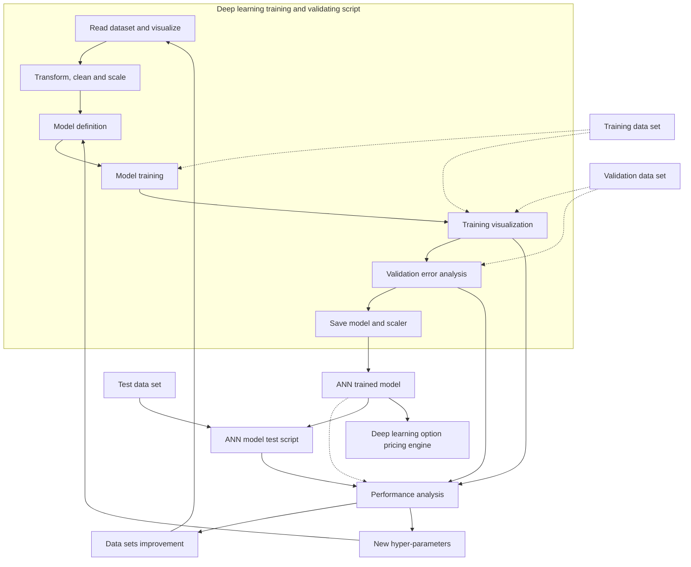

DSFE, 3(3): 267–284.
DOI: 10.3934/DSFE.2023016
Received: 01 June 2023
Revised: 25 July 2023
Accepted: 27 July 2023
Published: 10 August 2023

http://www.aimspress.com/journal/dsfe

**Research article**

# **Option pricing using deep learning approach based on LSTM-GRU neural networks: Case of London stock exchange**

**Habib Zouaoui\*, Meryem-Nadjat Naas**

Faculty of Economic Sciences, University of Relizane, w. Relizane, B.P: 48000, Algeria

* **Correspondence:** Email: habib.zouaoui@univ-relizane.dz.

**Abstract:** This study is a review of literature on machine learning to examine the potential of deep learning (DL) techniques in improving the accuracy of option pricing models versus the Black-Scholes model and capturing complex features in financial data.

Neural networks and other machine learning models have been proposed for option pricing and have improved accuracy compared with traditional models. However, such use of machine learning also presents practical challenges such as data availability and quality, computational resources, model selection and validation, interpretability and overfitting. This study discusses several of these challenges and highlights the need for careful evaluation and validation of machine learning models in London option pricing during the Coronavirus disease 2019 pandemic. Moreover, to investigate the quality of the models used, we compare the performances of these algorithms in option pricing through the application of significance statistical tests.

**Keywords:** black scholes; deep learning; GRU, LSTM; option pricing; RNN

**JEL Codes:** C45, E47, G17

**Abbreviations:** BSM: black scholes Model; RNN: recurrent neural networks; LSTM: long short-term memory; GRU: gated recurrent unit

---

268

# 1. **Introduction**

Option pricing using deep learning (DL) is a relatively new and promising area of research that seeks to use artificial neural networks (ANN) to better model the complex dynamics of financial markets and price financial derivatives such as options. As a type of machine learning, DL uses neural networks with multiple layers to learn complex relationships between inputs and outputs.

Traditional methods of option pricing such as the Black-Scholes model (BSM), rely on a few assumptions about the underlying asset and market dynamics such as constant volatility and log-normal returns. These assumptions may not hold true in real-world markets, leading to inaccurate pricing and risk management (Huang, 2014).

By comparison, DL approaches have the potential to capture complex, nonlinear relationships between market variables that can affect option prices. By training a neural network on historical market data, the network can learn to generalise for new market conditions and thereby make more accurate predictions.

One approach to option pricing using DL is to train a neural network to predict the future price of an underlying asset and then use this prediction to price the option. Another approach is to directly train the neural network to predict the option price, given a set of market variables such as the current asset price, volatility and time to expiration (Li, 2023).

However, using DL for option pricing presents several challenges including the need for large amounts of training data, potential for over fitting to noisy data and the difficulty of interpreting the neural network internal representations. Researchers continue to explore and refine DL approaches to option pricing and remain active in the area of quantitative finance.

DL is an advanced technique of machine learning based on ANN algorithms. As a promising branch of artificial intelligence, DL has attracted considerable attention in recent years. Compared with conventional machine learning techniques such as support vector machine (SVM) and k-nearest neighbours (kNN), DL possesses the advantages of unsupervised feature learning, a strong capability of generalisation and robust training power for big data (Flórido, 2022)

At present, modern advancements in mathematical analysis, computational hardware and software and availability of big data have allowed for the possibility of commoditised machines that can learn to operate as investment managers, financial analysts and traders. We briefly survey how and why artificial intelligence and DL can influence the field of finance in general. Revisiting original work from the 1990s, we summarise a framework within which machine learning may be used for this field, with specific application to option pricing. We train a fully-connected feed-forward DL neural network to reproduce the Black and Scholes (1973) option pricing formula to a high degree of accuracy. We also offer a brief introduction to neural networks and details on the various choices of hyper-parameters that increase the model accuracy. This exercise suggests that DL nets may be used to learn option pricing models from the markets and can be trained to mimic option pricing traders who specialise in a single stock or index (Chang, 2022).

One hypothesis for using DL in option pricing is that its models can better capture the complex nonlinear relationships of the underlying asset's risk and uncertainty with the option price. Traditional option pricing models such as the BSM, assume that the underlying asset price follows a log-normal distribution and has constant volatility over time. However, in reality, the underlying

*Data Science in Finance and Economics*

Volume 3, Issue 3, 267–284.

---

269

asset price is influenced by a complex set of factors including market sentiment, news events and macroeconomic conditions that can lead to its non-normal distribution and time-varying volatility.

DL models, which are capable of learning complex relationships between input and output variables, have shown promise in capturing these complex dynamics and improving the accuracy of option pricing. DL models can also incorporate a wider range of input variables including unstructured data such as news articles and social media sentiment, which can provide additional insights into the underlying asset's risk and uncertainty.

Another hypothesis for using DL models in option pricing is their better adaptability to changing market conditions and capability to handle extreme events, such as market crashes or unexpected news events, than traditional option pricing models. DL models can be trained on large amounts of historical data including those from extreme market events, which can help better capture the tail risk associated with options.

Overall, the hypothesis is that DL models can provide more accurate and robust option pricing predictions by capturing the complex and dynamic relationships between the underlying asset's risk and uncertainty and the option price and by being more adaptive to changing market conditions and handling extreme events. However, DL models require large amounts of high-quality data, rigorous validation and careful interpretation. In addition, their performance may depend on the specific problem and data characteristics.

## 2. **Background of the study**

Options occupy a certain position in the derivatives market. Researchers, speculators and other traders all hope to obtain a reasonable price for each option. Yet we can only obtain accurate solutions to the price of limited options, most of which must be defined numerically. The classical method has poor processing skills and slow calculation of large data sets and high-dimensional data. With the development of artificial intelligence in recent years, such as machine learning methods, optimisation of target values has gradually become easier. Thus, several scholars, investors and traders began to apply artificial intelligence to different kinds of option pricing. This study is a review of the use of different methods in the pricing of different options in the past years, including a comparison of their pros and cons, accuracy and robustness (Li, 2022). To better understand these methods, we present recent research and count the number of articles that use various DL models in exchange rate forecasting, as shown in Table 1.

Nowadays, machine learning methods such as neural networks in financial market shave become a hot topic. Amongst these methods, derivatives pricing plays an important role in both academia and actual transactions. DL algorithms that keep pace with the times also have good model generalisation capabilities and their prediction accuracy has surpassed that of traditional financial models (Li, 2022).

*Data Science in Finance and Economics*

Volume 3, Issue 3, 267–284.

---

270

### <b>**Table1**.</b> Reviewed previous studies.

<table>
  <thead>
    <tr>
      <th>Author(s)/Year</th>
      <th>Country</th>
      <th>Methodology</th>
      <th>Main findings</th>
    </tr>
  </thead>
  <tbody>
    <tr>
      <td>Robert Culkin, Sanjiv R. Das (2017)</td>
<td>USA</td>
<td>BSM, ANN</td>
<td>Best accuracy of ANN</td>
    </tr>
<tr>
      <td>Andrey Itkin (2019)</td>
<td>USA</td>
<td>BSM, ANN</td>
<td>Best accuracy of ANN</td>
    </tr>
<tr>
      <td>Camilo Blanco Vargas (2019)</td>
<td>UK</td>
<td>BS, MC, ANN, GPU</td>
<td>Best accuracy of ANN</td>
    </tr>
<tr>
      <td>Salvador et al. (2020)</td>
<td>USA</td>
<td>BSM, ANN</td>
<td>Best accuracy of ANN</td>
    </tr>
<tr>
      <td>Ivascu (2020)</td>
<td>USA</td>
<td>BSM, SVM, LSTM, GBM, ANN, GA</td>
<td>Best accuracy of LSTM</td>
    </tr>
<tr>
      <td>Gabriel Adams (2020)</td>
<td>USA</td>
<td>BSM, MLP, LSTM</td>
<td>Best accuracy of MLP and LSTM</td>
    </tr>
<tr>
      <td>Alexander Ke, Andrew Yang (2021)</td>
<td>USA</td>
<td>BSM, MLP, LSTM</td>
<td>Best accuracy of MLP and LSTM</td>
    </tr>
<tr>
      <td>Codruț-Florin Ivașcu (2021)</td>
<td>Romania</td>
<td>BSM, ANN, SVR, LGBM, GA</td>
<td>Best accuracy of NN and SVR</td>
    </tr>
<tr>
      <td>Wenda Li (2021)</td>
<td>Taiwan</td>
<td>BSM, ANN</td>
<td>Best accuracy of ANN</td>
    </tr>
<tr>
      <td>Edward Chang (2022)</td>
<td>Canada</td>
<td>BSM, CNN-LSTM, ANN</td>
<td>CNN-LSTM yields better results</td>
    </tr>
<tr>
      <td>Diogo Pinto Flórido (2022)</td>
<td>Spain</td>
<td>BSM, MLP, LSTM</td>
<td>Best accuracy of MLP and LSTM</td>
    </tr>
<tr>
      <td>Yan Liu, Xiong Zhang (2023)</td>
<td>China</td>
<td>BSM, SVM, LSTM, RNN</td>
<td>Best accuracy of LSTM</td>
    </tr>
<tr>
      <td>Li, Yan (2023)</td>
<td>China</td>
<td>BSM, MC, MLP</td>
<td>Best accuracy of MLP</td>
    </tr>
  </tbody>
</table>

<b>**Source:**</b> Authors’ analysis from literature review (2023)

Based on previous studies, we conclude that the LSTM model, derived from recurrent neural network (RNN), is one of the best methods to learn financial time series data. We re-examine the original model and make corrections on this basis, and obtain a learning model that is also applicable to financial data. For American options, an additional question is how to find the optimal stopping time and provide a reasonable explanation, given that the optimal exercise time cannot be learned directly from market information.

Overall, these studies suggest that DL models have the potential to significantly improve option pricing accuracy and profitability, particularly when used in combination with large amounts of high-quality data and careful validation and interpretation. However, we must note that DL models are still relatively new approaches to option pricing and their performance may depend on the specific problem and data characteristics.

However, in comparing the performance of DL in options pricing, this study is characterised using gated recurrent unit (GRU) model as a new contribution in the field of computational finance.

## **3. Materials and methods**

### *3.1. Black-Scholes model (BSM)*

In the spring of 1973, Fisher Black and Myron Scholes published an academic paper based on empirical evidence to price options on given assets and suggested that the value of an option is derived from a few variables: the price of the underlying asset, strike price and maturity of the option, volatility of the asset and the risk-free interest rate.

*Data Science in Finance and Economics* Volume 3, Issue 3, 267–284.

---

271

## 3.1.1. Assumptions of the black–scholes–merton model

To use the BS formula, Black (1973) assumed ideal conditions for stocks:

- **Lognormal distribution:** The Black–Scholes–Merton model assumes that stock prices follow a lognormal distribution based on the principle that asset prices cannot take a negative value. that is, they are bounded by zero.
- **No dividends:** The model assumes that the stocks do not pay dividends or returns.
- **Expiration date:** The model assumes that the options can only be exercised on its expiration or maturity date and thus cannot accurately price American options. Rather, the model is extensively used in the European options market.
- **Random walk:** The stock market is highly volatile and a state of random walk is assumed as the market direction can never truly be predicted.
- **Frictionless market:** No transaction costs, including commission and brokerage, is assumed in the model.
- **Risk-free interest rate:** The interest rates are assumed to be constant and thus the underlying asset is considered risk-free.
- **Normal distribution:** Stock returns are normally distributed, implying that the volatility of the market is constant over time.
- **No arbitrage:** Without arbitrage, the opportunity of making a riskless profit is avoided.

## 3.1.2. Black–Scholes–Merton equation

The Black–Scholes–Merton model can be described as a second order partial differential equation.

$$\frac{\partial V}{\partial t} + \frac{1}{2}\sigma^2 S^2 \frac{\partial^2 V}{\partial S^2} + rS \frac{\partial^2 V}{\partial S} - rV = 0$$

A key financial insight behind the equation is that one can perfectly hedge the option by buying and selling the underlying asset and the bank account asset (cash) to eliminate risk. This hedge, in turn, implies that the option has only one right price, as returned by the Black–Scholes formula (see the next section).

## 3.1.3. Black–Scholes formula

The Black–Scholes formula calculates the price of European put and call options. This price is consistent with the Black–Scholes equation, given that the formula can be obtained by solving for the corresponding terminal and boundary conditions (Chriss and Kawaller, 1997):

$$C(0, t) = 0  for all  t$$
$$C(S, t) = S - K  as  S \to \infty$$
$$C(S, T) = \max \{S - K, 0\}$$

The value of a call option for a non-dividend-paying underlying stock in terms of the Black–Scholes parameters is

*Data Science in Finance and Economics* Volume 3, Issue 3, 267–284.

---

272

$$C(S_t, t) = N(d_1)S_t - N(d_2)Ke^{-r(T-t)} \tag{1}$$

$$d_1 = \frac{1}{\sigma\sqrt{T-t}} \left[ \ln \left( \frac{S_t}{K} \right) + \left( r + \frac{\sigma^2}{2} \right) (T-t) \right] \tag{2}$$

$$d_2 = d_1 - \sigma\sqrt{T-t}$$

The price of a corresponding put option based on put–call parity with discount factoris [**Figure 1**]

### Figure 1. European call valued using the Black–Scholes pricing equation. (V: European Call Price; S: Spot price; T: Time to maturity)

<table>
  <thead>
    <tr>
      <th rowspan="2">T (Time to maturity)</th>
      <th colspan="3">S (Spot price)</th>
    </tr>
<tr>
      <th>0.8</th>
      <th>1.0</th>
      <th>1.2</th>
    </tr>
  </thead>
  <tbody>
    <tr>
      <th>0.0</th>
      <td>0.00</td>
<td>0.00</td>
<td>0.20</td>
    </tr>
<tr>
      <th>0.5</th>
      <td>0.02</td>
<td>0.08</td>
<td>0.23</td>
    </tr>
<tr>
      <th>1.0</th>
      <td>0.05</td>
<td>0.12</td>
<td>0.26</td>
    </tr>
<tr>
      <th>1.5</th>
      <td>0.08</td>
<td>0.16</td>
<td>0.29</td>
    </tr>
<tr>
      <th>2.0</th>
      <td>0.11</td>
<td>0.19</td>
<td>0.32</td>
    </tr>
  </tbody>
</table>

$$P(S_t, t) = Ke^{-r(T-t)} - S_t + C(S_t, t). \tag{3}$$
$$= N(-d_2)Ke^{-r(T-t)} - N(d_1)S_t$$

Where **N** – Cumulative distribution function of the standard normal distribution; mean = 0 and standard deviation = 1
**T-t** – Time to maturity (in years)
**St** – Spot price of the underlying asset
**K** – Strike price
**r** – Risk-free rate
**σ** – Volatility of returns of the underlying asset

### 3.1.4. Limitations of the Black–Scholes–Merton model

**Limited to the European market:** As mentioned earlier, the Black–Scholes–Merton model is an accurate determinant of European option prices, but does not accurately value stock options in the United States. The assumption is that options can only be exercised on its expiration/maturity date.
**Risk-free interest rates:** The BSM assumes constant interest rates, which hardly ever occurs in reality.
**Assumption of a frictionless market:** Trading generally comes with transaction costs such as brokerage fees and commission. However, the Black–Scholes–Merton model assumes a frictionless market, which implies no transaction costs that hardly ever occurs in the actual trading market.
**No returns:** The BSM assumes that no returns are associated with the stock options, no dividends and no interest earnings. However, these are similarly rare in the actual trading market. The buying and selling of options are primarily focused on the returns.1

---
1. https://corporatefinanceinstitute.com/resources/derivatives/black-scholes-merton-model/December(2022)

*Data Science in Finance and Economics*
Volume 3, Issue 3, 267–284.

---

273

## *3.2. Deep learning (DL) models*

This section is devoted to the brief description of the basic principle of four *Non-linear* machine learning models or DL models that are used later for exchange rate time-series forecasting, namely RNN, LSTM and gated recurrent unit (GRU).

### 3.2.1. Recurrent neural networks (RNN)

RNNs differe from traditional neural networks by introducing a transition weight to send information over time. This transition weight means that the next state is dependent on the previous one, indicating that the model now has memory. In RNNs, the hidden layers act as an internal storage of the information captured in the earlier stages. The term recurrent is derived from the fact that the model performs the same task to every element of the sequence using the previously obtained information to predict future values. RNN is represented in (Figure 2).

**Figure 2.** Recurrent neural network with p time steps.

Two powerful RNN models are efficient for time dependent in time-series data, namely, LSTM and GRU. These deep learning models have shown considerable success in modelling and forecasting compared with the classical time series models and traditional networks, demonstrating good results in many application domains with time series.

### 3.2.2. Long short-term memory (LSTM) model

LSTM is a sophisticated gated memory unit designed to mitigate the vanishing gradient problems limiting the efficiency of a simple RNN (Zeroual et al., 2020).

Figure 3 shows a complete diagram of LSTM, similar to Figure 3 with RNN. The LSTM has four components: input gates, forget gate, cell state and output gate.

*Data Science in Finance and Economics*
Volume 3, Issue 3, 267–284.

---

274

**Figure 3.** LSTM structure.

The LSTM model is defined as follows. Let $x_t$, $h_t$ and $C_t$ be the input, control state and cell state at timestep $t$. Given a sequence of inputs ($x_1, x_2, \dots, x_m$), the LSTM computes the $h$-sequence ($h_1, h_2, \dots, h_m$) and the $C$-sequence ($C_1, C_2, \dots, C_m$) as follows:

***Input Gate:*** the goal is to take in new information $x_t$ by using two functions: $r_t$ and $d_t$. The $r_t$ concatenates the previous hidden vector *ht-1* with the new information $x_t$. that is, [*ht-1, xt*] then multiplies it with the weight matrix *Wr,* plus a noise vector $b_r$. The $d_t$ has a similar function. Then, $r_t$ and $d_t$ are multiplied element-wise to obtain the cell state $c_t$:

$$r_t = \sigma(W_f \cdot [h_{t-1}, x_t]) + b_f$$
$$d_t = \tanh(W_d \cdot [h_{t-1}, x_t]) + b_d$$

***Forget Gate:*** Looking very similar to $r_t$ in the input gate, the forget gate $f_t$ controls the limit up to which a value is retailed in memory:

$$f_t = \sigma(W_i \cdot [h_{t-1}, x_t]) + b_i$$

***Cell State:*** An element-wise multiplication is calculated between the previous cell state *Ct-1* and forget gate $f_t$. Then, the cell state adds the results from the input gate $r_t$ times $d_t$:

$$C_t = f_t \cdot C_{t-1} + r_t \cdot d_t$$

***Output gate:*** Here, $o_t$ is the output gate at time step $t$ and $W_o$ and $b_o$ are the weights and bias for the output gate. The hidden layer $h_t$ either moves to the next time step or up to output as $y_t$, $y_t$ is obtained by applying another $\tanh$ to $h_t$. Note that the output gate $o_t$ is not the output $y_t$, but rather simply is the gate to control the output:

$$o_t = \sigma(W_o \cdot [h_{t-1}, x_t]) + b_o$$
$$h_t = o_t \tanh C_t$$

### 3.2.3. Gated recurrent unit (GRU) model

Cho et al., (2014) invented GRU in company with RNN and LSTM, with the expectation that more variations of recursive network may continue to emerge. GRU also aims to solve the vanishing

*Data Science in Finance and Economics*
Volume 3, Issue 3, 267–284.

---

275

gradient problem. Different from LSTM, GRU does not have the cell state and the output gate and thus has fewer parameters. GRU uses the hidden layers to transfer information and has two gates for reset and update.

The parameters of GRU include $W_r$, $W_z$ and $W_h$. The reset signal $r_t$ determines if the previous hidden state must be ignored while the update signal $z_t$ determines if the hidden state $h_t$ needs updating with the new one *hat ($h_t$)*.

$$z_t = \sigma(W_z \cdot [h_{t-1}, x_t]) + b_z$$
$$r_t = \sigma(W_r \cdot [h_{t-1}, x_t]) + b_r$$
$$\hat{h}_t = \tanh(W_h \cdot [r_t \cdot h_{t-1}, x_t] + b_h)$$
$$h_h = (1 - z_t) \cdot h_{t-1} + z_t \cdot \hat{h}_t$$

***Reset Gate:*** This gate achieves a similar function of the input and forget gates of LSTM. The gate $r_t$ determines if the previous hidden state must be ignored. The gate $z_t$ is generated for the update gate with *hat ($h_t$)*. $W_z$ and $W_r$ are the weight parameters to be trained while $b_z$ and $b_r$ are the noise vectors.

***Update Gate: (Part 1):*** This part multiplies $r_t$ and $h_{t-1}$. The multiplication means how much of $h_{t-1}$ is retained or ignored. Thus, a temporal *hat ($h_t$)* is created to be used for the update of $h_t$. $W_h$ and $b_h$ are weight parameters and the noise vectors, respectively.

***Update Grade: (Part II):*** This part computes the weighted average between $h_{t-1}$ and *hat ($h_t$)*, according to the weight $z_t$. If $z_t$ is close to zero, then the past information contributes little and new information contributes more.

### *3.3. Evaluation metrics*

We used five different measures of forecast errors for evaluating the model performance and the accuracy of the methods: MAE, MSE, RMSE and MAPE, where $\hat{y}_t$ are the forecasted values, $y_t$ the observed values, $n$ is the number of forecasts and $\mu$ is the average of measurements.

**Table 2.** Evaluation Metrics.

<table>
  <thead>
    <tr>
      <th>Evaluation Metrics</th>
      <th>Equation</th>
    </tr>
  </thead>
  <tbody>
    <tr>
      <td>Mean square error (MSE)</td>
<td>\( MSE = \frac{1}{n} \sum_{t=1}^{n} (y_t - \widehat{y}_t)^2 \)</td>
    </tr>
<tr>
      <td>Root means square error (RMSE)</td>
<td>\( RMSE = \sqrt{\sum_{t=1}^{n} \frac{(y_t - \widehat{y}_t)^2}{n}} \)</td>
    </tr>
<tr>
      <td>Mean absolute error (MAE)</td>
<td>\( MAE = \sum_{t=1}^{n} \frac{|y_t - \widehat{y}_t|}{n} \)</td>
    </tr>
<tr>
      <td>Mean absolute percentage error (MAPE)</td>
<td>\( MAPE = \frac{1}{n} \sum_{t=1}^{n} \left| \frac{y_t - \widehat{y}_t}{y_t} \right| . 100 \)</td>
    </tr>
<tr>
      <td>R-squared</td>
<td>\( R^2 = 1 - \frac{\sum_{t=1}^{n} (y_t - \widehat{y}_t)^2}{\sum_{t=1}^{n} (y_t - \mu)^2} \)</td>
    </tr>
  </tbody>
</table>

*Data Science in Finance and Economics*
Volume 3, Issue 3, 267–284.

---

276

# **4. Results and analysis**

## *4.1. Data description*

This study implements and compares the two models by using the Historical CSV Data Sample, which includes 10000 observations of put and call European options traded on the London Stock Exchange2. The sample includes all data recorded **Table 3** on 1 January 2020–31 December 2021, which fall during the Coronavirus disease 2019 (COVID-19) pandemic, with the following features:

### <strong>Table 3.</strong> List of all features in the dataset, with an identification of the type of variable and a brief description of their meaning.

<table>
    <thead>
        <tr>
            <th>Variable</th>
            <th>Class</th>
            <th>Description</th>
        </tr>
    </thead>
    <tbody>
        <tr>
            <td>Time</td>
<td>Numerical</td>
<td>Settlement time of contract</td>
        </tr>
<tr>
            <td>Strike price</td>
<td>Numerical</td>
<td>Strike price of the option</td>
        </tr>
<tr>
            <td>Stock price</td>
<td>Numerical</td>
<td>Price of the underlying asset of the option</td>
        </tr>
<tr>
            <td>Volatility</td>
<td>Numerical</td>
<td>Volatility of returns of the underlying asset</td>
        </tr>
<tr>
            <td>Interest rate</td>
<td>Numerical</td>
<td>Actual total number of unsettled and outstanding options</td>
        </tr>
<tr>
            <td><u>Type</u></td>
<td>Binomial</td>
<td>Whether the option is a call or a put</td>
        </tr>
<tr>
            <td>Delta</td>
<td>Numerical</td>
<td>Derivative of the option price with respect to its underlying price</td>
        </tr>
<tr>
            <td>Gamma</td>
<td>Numerical</td>
<td>Sensibility of the option price with respect to its delta</td>
        </tr>
<tr>
            <td>Theta</td>
<td>Numerical</td>
<td>Derivative of the option price with respect to its time to maturity</td>
        </tr>
    </tbody>
</table>

The models are implemented using Python 3.7 programming language. The choice has been made due to the simplicity of the language and all the pre-built libraries for machine learning, which allow for faster workflow and easier debugging. In particular, the libraries used throughout the empirical part of the study are:

### <b>**Table 4**.</b> The models implemented using Python 3.7.

<table>
  <thead>
    <tr>
      <th>Packages</th>
      <th>Study</th>
      <th>Description</th>
    </tr>
  </thead>
  <tbody>
    <tr>
      <td>Pandas</td>
<td>(McKinney, 2022)</td>
<td>Used to read, write and manipulate the dataset</td>
    </tr>
<tr>
      <td>NumPy</td>
<td>(Oliphant, 2006)</td>
<td>Which uses arrays as the main data structure to perform computations;</td>
    </tr>
<tr>
      <td>SciPy</td>
<td>(Virtanen et al., 2019)</td>
<td>A large library, which includes various branches of science, used in this case for statistical tools;</td>
    </tr>
<tr>
      <td>Time</td>
<td>present in the Python Standard Library,</td>
<td>Used to calculate the time of computation and training for the two models;</td>
    </tr>
<tr>
      <td>Matplotlib</td>
<td>(Hunter, 2007)</td>
<td>Used to make the graphs and plots to have a visual interpretation of the models;</td>
    </tr>
<tr>
      <td>TensorFlow</td>
<td>(Abadi et al., 2015)</td>
<td>An interface from Google made to implement machine learning, particularly DL models. The name derives from the fact that data are imported in TensorFlow using tensors, which speeds up the model training.</td>
    </tr>
  </tbody>
</table>

***

2. https://www.londonstockexchange.com/

*Data Science in Finance and Economics*
Volume 3, Issue 3, 267–284.

---

277

Here is a sample correlation heatmap matrix created to understand the linear relationship between different variables in the dataset **Figure 4**.

### Figure 4. Correlation heatmap matrix amongst numerical features from the dataset (Put Options)

<table>
  <thead>
    <tr>
      <th>Feature</th>
      <th>putPrice</th>
      <th>T</th>
      <th>K</th>
      <th>S0</th>
      <th>sigma</th>
      <th>r</th>
    </tr>
  </thead>
  <tbody>
    <tr>
      <th>putPrice</th>
      <td>1</td>
<td>0.023</td>
<td>0.7</td>
<td>-0.54</td>
<td>0.099</td>
<td>-0.045</td>
    </tr>
<tr>
      <th>T</th>
      <td>0.023</td>
<td>1</td>
<td>-0.0063</td>
<td>-0.00049</td>
<td>-0.0039</td>
<td>-0.011</td>
    </tr>
<tr>
      <th>K</th>
      <td>0.7</td>
<td>-0.0063</td>
<td>1</td>
<td>-0.00017</td>
<td>-0.001</td>
<td>-0.0039</td>
    </tr>
<tr>
      <th>S0</th>
      <td>-0.54</td>
<td>-0.00049</td>
<td>-0.00017</td>
<td>1</td>
<td>0.0028</td>
<td>0.00055</td>
    </tr>
<tr>
      <th>sigma</th>
      <td>0.099</td>
<td>-0.0039</td>
<td>-0.001</td>
<td>0.0028</td>
<td>1</td>
<td>-0.011</td>
    </tr>
<tr>
      <th>r</th>
      <td>-0.045</td>
<td>-0.011</td>
<td>-0.0039</td>
<td>0.00055</td>
<td>-0.011</td>
<td>1</td>
    </tr>
  </tbody>
</table>

### Figure 4. Correlation heatmap matrix amongst numerical features from the dataset (Call Options)

<table>
  <thead>
    <tr>
      <th>Feature</th>
      <th>callPrice</th>
      <th>T</th>
      <th>K</th>
      <th>S0</th>
      <th>sigma</th>
      <th>r</th>
    </tr>
  </thead>
  <tbody>
    <tr>
      <th>callPrice</th>
      <td>1</td>
<td>0.084</td>
<td>-0.54</td>
<td>0.72</td>
<td>0.095</td>
<td>0.018</td>
    </tr>
<tr>
      <th>T</th>
      <td>0.084</td>
<td>1</td>
<td>-0.0063</td>
<td>-0.00049</td>
<td>-0.0039</td>
<td>-0.011</td>
    </tr>
<tr>
      <th>K</th>
      <td>-0.54</td>
<td>-0.0063</td>
<td>1</td>
<td>-0.00017</td>
<td>-0.001</td>
<td>-0.0039</td>
    </tr>
<tr>
      <th>S0</th>
      <td>0.72</td>
<td>-0.00049</td>
<td>-0.00017</td>
<td>1</td>
<td>0.0028</td>
<td>0.00055</td>
    </tr>
<tr>
      <th>sigma</th>
      <td>0.095</td>
<td>-0.0039</td>
<td>-0.001</td>
<td>0.0028</td>
<td>1</td>
<td>-0.011</td>
    </tr>
<tr>
      <th>r</th>
      <td>0.018</td>
<td>-0.011</td>
<td>-0.0039</td>
<td>0.00055</td>
<td>-0.011</td>
<td>1</td>
    </tr>
  </tbody>
</table>

## *4.2. Models used and their specifications*

The standard BSM is used as the standard of comparison for the ML models. As we all know, BSM takes inputs of the price of the underlying asset, strike price of the option, time to maturity of said option, RF rate and the measure of volatility of the underlying asset. For the latter, we use the variable described in the model outputs an arbitrage-free price of an option.

Once we have a working deep learning stack, we start the development by creating a python script to train ANNs with Keras and Tensor Flow for simple regression problems.

**Figure 5.** Deep learning option pricing solver development flowchart.

*Data Science in Finance and Economics* Volume 3, Issue 3, 267–284.

---

278

Many online resources can be used to achieve these first steps. In particular, the online documentation of TensorFlow is very clear and includes simple practical examples. The DL training and validating script, implemented for this project, is derived from a basic regression tutorial that can be found on <u>https://www.tensorflow.org/tutorials/keras/regression</u>.

Similar to a class diagram for planning an OOP solution, flowcharts are tools used to describe procedural programs and processes. Figure 5 presents the iterative development that is implemented to create the DL option pricing solvers in this review.

Here is a general flowchart for developing a DL option pricing solver:

**Problem Formulation:** Define the problem statement and determine the project scope.

**Data Collection:** Collect historical data on the underlying asset's price, including any relevant market data such as interest rates, volatility and dividends.

**Data Pre-processing:** Clean, normalise and transform the data to prepare for use in the DL model.

**Model Selection:** Choose an appropriate DL model architecture and design, considering the problem statement, data characteristics and available computational resources.

**Model Training:** Train the DL model using the pre-processed data, using techniques such as gradient descent and backpropagation to optimise the model parameters.

**Model Evaluation:** Evaluate the performance of the DL model using appropriate metrics such as RMSE or MAE and validate the predictions using test data.

**Model Tuning:** Based on the results of the evaluation and validation, adjust the DL model parameters and architecture to improve its performance.

**Deployment:** Deploy the DL option pricing solver in a production environment and test its performance under real-world conditions.

**Monitoring and Maintenance:** Continuously monitor the performance of the DL option pricing solver and maintain and update the model as needed to ensure its accuracy and reliability over time.

Note that the specific steps and details of the flowchart may vary depending on the specific requirements and objectives of the DL option pricing solver as well as the availability and quality of data. Additionally, the development of a DL model requires expertise in both finance and computer science, together with a solid understanding of the underlying data and market dynamics.

We train the neural network with the following hyperparameters Table 5:
- four hidden fully connected layers
- each layer has200 neurons
- batch size of 64
- 200 training epochs
- 80–20 train-validation split Figures 7,8.
- MSE as loss function

*Data Science in Finance and Economics*

Volume 3, Issue 3, 267–284.

---

279

### <b>**Table 5.**</b> Hyperparameter of each model.

<table>
  <thead>
    <tr>
      <th>Hyperparameter</th>
      <th>LSTM</th>
      <th>GRU</th>
    </tr>
  </thead>
  <tbody>
    <tr>
      <td>Activation function</td>
<td>RELU</td>
<td>RELU</td>
    </tr>
<tr>
      <td>Loss function</td>
<td>MSE</td>
<td>MSE</td>
    </tr>
<tr>
      <td>Neurons</td>
<td>[200,200,200,200,200,1]</td>
<td>[200,200,200,200,200,1]</td>
    </tr>
<tr>
      <td>Learning rate</td>
<td>0.001</td>
<td>0.001</td>
    </tr>
<tr>
      <td>Optimiser</td>
<td>Adam</td>
<td>Adam</td>
    </tr>
  </tbody>
</table>

Here, [200, 200, 200, 200, 200, 1] represents the number of neurons from the first to the last network layer.

### *4.3. Pricing performance of benchmark models*

To investigate the quality of the models used, we compare the performances of BSM and the deep learning models such as LSTM and GRU. In terms of pricing European call options errors, Python routines were used. These algorithms forecast the price London Stock Exchange (JSE) for European call options through the application of significance statistical tests (MSE, RMSE, MAE).

Results of benchmark models are measured with the metrics obtained on the dataset by using the BSM option pricing compared with the LSTM and GRU. The results are summarised to confirm the pricing performance of LSTM. Nevertheless, the results obtained with the benchmark machine learning models are used as an indicator of the possible error range.

The first conclusion is that the quality of pricing with the benchmark models varies considerably across different states of moneyness for options **Figure 6**.

### Figure 6. Train and test loss of GRU model

<table>
  <thead>
    <tr>
      <th>Epoch</th>
      <th>GRU train loss</th>
      <th>GRU test loss</th>
    </tr>
  </thead>
  <tbody>
    <tr>
      <th>0</th>
      <td>0.0235</td>
<td>0.0058</td>
    </tr>
<tr>
      <th>25</th>
      <td>0.0002</td>
<td>0.0003</td>
    </tr>
<tr>
      <th>50</th>
      <td>0.0001</td>
<td>0.0002</td>
    </tr>
<tr>
      <th>75</th>
      <td>0.0001</td>
<td>0.0001</td>
    </tr>
<tr>
      <th>100</th>
      <td>0.0001</td>
<td>0.0001</td>
    </tr>
<tr>
      <th>125</th>
      <td>0.0001</td>
<td>0.0001</td>
    </tr>
<tr>
      <th>150</th>
      <td>0.0001</td>
<td>0.0001</td>
    </tr>
<tr>
      <th>175</th>
      <td>0.0001</td>
<td>0.0001</td>
    </tr>
<tr>
      <th>200</th>
      <td>0.0001</td>
<td>0.0001</td>
    </tr>
  </tbody>
</table>

### **Figure 7.** Train and test loss of LSTM model.

<table>
  <thead>
    <tr>
      <th>Epoch</th>
      <th>LSTM train loss</th>
      <th>LSTM test loss</th>
    </tr>
  </thead>
  <tbody>
    <tr>
      <th>0</th>
      <td>0.0195</td>
<td>0.0065</td>
    </tr>
<tr>
      <th>25</th>
      <td>0.0003</td>
<td>0.0004</td>
    </tr>
<tr>
      <th>50</th>
      <td>0.0002</td>
<td>0.0003</td>
    </tr>
<tr>
      <th>75</th>
      <td>0.0002</td>
<td>0.0002</td>
    </tr>
<tr>
      <th>100</th>
      <td>0.0001</td>
<td>0.0002</td>
    </tr>
<tr>
      <th>125</th>
      <td>0.0001</td>
<td>0.0002</td>
    </tr>
<tr>
      <th>150</th>
      <td>0.0001</td>
<td>0.0002</td>
    </tr>
<tr>
      <th>175</th>
      <td>0.0001</td>
<td>0.0002</td>
    </tr>
<tr>
      <th>200</th>
      <td>0.0001</td>
<td>0.0002</td>
    </tr>
  </tbody>
</table>

*Data Science in Finance and Economics*
Volume 3, Issue 3, 267–284.

---

280

### <b>**Table 6.**</b> Deep learning error metrics compared with Black-Scholes prices.

<table>
  <thead>
    <tr>
      <th>Options Type</th>
      <th>Model</th>
      <th>Train/Test (%)</th>
      <th>Epochs</th>
      <th>Time</th>
      <th>MAE</th>
      <th>MSE</th>
      <th>RMSE</th>
    </tr>
  </thead>
  <tbody>
    <tr>
      <td rowspan="3">Call</td>
<td>BSM</td>
<td>80/20</td>
<td>200</td>
<td>1s 3ms/step</td>
<td>2.84</td>
<td>16.39</td>
<td>4.05</td>
    </tr>
<tr>
      <td>LSTM</td>
<td>80/20</td>
<td>200</td>
<td>0s 4ms/step</td>
<td>2.33</td>
<td>13.58</td>
<td>3.69</td>
    </tr>
<tr>
      <td>GRU</td>
<td>80/20</td>
<td>200</td>
<td>2s 13ms/step</td>
<td>2.65</td>
<td>15.21</td>
<td>3.90</td>
    </tr>
<tr>
      <td rowspan="3">Put</td>
<td>BSM</td>
<td>80/20</td>
<td>200</td>
<td>0s 1ms/step</td>
<td>4.70</td>
<td>54.46</td>
<td>7.38</td>
    </tr>
<tr>
      <td>LSTM</td>
<td>80/20</td>
<td>200</td>
<td>0s 6ms/step</td>
<td>4.44</td>
<td>54.30</td>
<td>7.37</td>
    </tr>
<tr>
      <td>GRU</td>
<td>80/20</td>
<td>200</td>
<td>0s 4ms/step</td>
<td>4.60</td>
<td>55.16</td>
<td>7.43</td>
    </tr>
  </tbody>
</table>

Note: All values are multiplied by a factor of 100.

In terms of the pricing accuracy of the LSTM model, Table 4 reveals that the LSTM model presents the most excellent pricing performance except for put and call options, with remarkable nonlinear fitting ability. The BSM provides the least reliable pricing due to the maximum values of metrics in terms of MAE, MSE, RMSE of call and put options with 2.84%, 16.39% and 4.05 for call options and close to 4.70%, 54.46%, 7.38% for put options, respectively. From the GRU model, prices decrease by 2.65%, 15.21% and 3.90% for call options and close to 4.60%, 55.16%, 7.43% for put options. However, the LSTM model has the most accurate pricing quality regardless of the pricing model with minimum values of metrics in terms of MAE, MSE, RMSE, with 2.33%, 13.58%, 3.69% for call options and close to 4.44%, 54.30%, 7.37% for put options, respectively.

Finally, we confirm our hypothesis and the results achieved by previous studies to forecast option pricing (Appendices).

The COVID-19 pandemic has exerted significant impact on financial markets and option pricing in the United Kingdom (UK), including the pan increased uncertainty and volatility as well as changes in economic conditions and government policies that in turn affect the valuation of financial assets.

One of the key effects on option pricing is the increase in volatility across asset classes. The implied volatility of many options has increased significantly since the start of the pandemic, reflecting higher levels of uncertainty and risk in financial markets. Thus, accurately predicting price options and managing risk, particularly for complex options and structured products, has become more challenging.

The pandemic also caused changes in interest rates and monetary policy. To support the economy during this period, the Bank of England implemented a range of measures such as lowering interest rates and introducing quantitative easing. These measures have affected the pricing of options and other financial instruments, particularly those with longer maturities.

The pandemic has also led to changes in market structure and trading practices. Many financial institutions have shifted to remote working and electronic trading, which has affected market

*Data Science in Finance and Economics* Volume 3, Issue 3, 267–284.

---

281

liquidity and trading volumes. This shift in turn affected the pricing of options and other financial instruments, particularly those with lower liquidity or trading volumes.

Overall, the COVID-19 pandemic has caused significant impact on option pricing in the UK, with increased volatility and changes in economic conditions and market structure affecting the valuation of financial assets. Financial institutions needed to adapt their pricing models and risk management practices to account for these changes and continued monitoring and analysis are required to manage the evolving market risks and uncertainties.

## 5. **Conclusions**

In this study, we focus on the forecast option pricing during the COVID-19 period by proposing an ensemble of deep learning approach, specifically LSTM and GRU versus BSM.

In conclusion, machine learning techniques have shown promise in improving option pricing accuracy and capturing complex features in financial data. Several studies have proposed neural network and other machine learning models for option pricing, achieving improved pricing accuracy compared with traditional models.

However, machine learning models can suffer from overfitting and other issues and their use in option pricing and other financial applications require careful evaluation and validation. Furthermore, the use of machine learning techniques in option pricing may require significant amounts of data and computational resources, which may pose practical challenges for certain applications.

Overall, machine learning has the potential to enhance option pricing models and provide more accurate pricing estimates, but further research and development is needed to fully realise its potential and address practical challenges.

However, this increased volatility translates into more challenging options market predictions. We confirm our fundamental hypothesis that DL models still perform well compared with Black-Scholes option pricing model in terms of the RMSE, MAE, MSE.

The highly competitive prediction capacity of the proposed model during theCOVID-19 period is beneficial for policymakers, entrepreneurs and foreign exchange brokers.

Finally, based on the current results, future research can predict a large performance improvement by optimizing the parameters of these algorithms for application in more common option pricing scenarios.

## **Use of AI tools declaration**

The authors declare they have not used artificial intelligence (AI) tools in the creation of this article.

## **Conflict of interest**

The authors declare that there is no conflict of interest.

*Data Science in Finance and Economics*

Volume 3, Issue 3, 267–284.

---

282

# **References**

Abadi M, Agarwal A, Barham P, et al. (2016) Tensorflow: Large-Scale Machine Learning on Heterogeneous Distributed Systems. *arXiv Preprint*. https://doi.org/10.48550/arXiv.1603.04467.

Andrey I (2019) Deep learning calibration of option pricing models: some pitfalls and solutions. *arXiv Preprint*. https://doi.org/10.48550/arXiv.1906.03507.

Adams G (2020) Black-Scholes and Neural Networks, All Graduate Plan B and other Reports. 1486. https://doi.org/10.26076/133e-2777

Chang E (2022) CNN-LSTM vs ANN: Option Pricing Theory, Western University. Available from: https://ir.lib.uwo.ca/cgi/viewcontent.cgi?article=1589&context=usri

Chriss N, Kawaller I (1997) Black-Scholes and Beyond: Option Pricing Models 1st Edition, McGraw-Hill, USA.

Culkin R, Das SR (2017) Machine Learning in Finance: The Case of Deep Learning for Option Pricing. *J Invest Manag* 15: 92–100. Available from: https://srdas.github.io/Papers/BlackScholesNN.pdf

Flórido DP (2019) Estimate European vanilla option prices using artificial neural networks, UNIVERSIDADE DE LISBOA. Available from: https://repositorio.ul.pt/bitstream/10451/53641/1/TM_Diogo_Florido.pdf

Huang J, Cen Z (2014) Cubic Spline Method for a Generalized Black-Scholes Equation. *Math Probl Eng.* http://dx.doi.org/10.1155/2014/48436

Ibri S, Slimane M (2022) Probability Stochastic Processes and Simulation In Python, Algeria. Available from: https://www.researchgate.net/publication/360767027

Ivașcu CF (2021) Option pricing using Machine Learning. *Expert Syst Appl* 163: 113799. https://doi.org/10.1016/j.eswa.2020.113799

Ke A, Yang A (2019) Option Pricing with Deep Learning. *Department of Computer Science, Standford University, In CS230: Deep learning*, 8: 1–8. Available from: https://cs230.stanford.edu/projects_fall_2019/reports/26260984.pdf

Ketkar N, Moolayi J (2021) *Deep learning with python: Learn Best Practices of Deep Learning Models with PyTorch*, Bangalore, Karnataka, India.

Lewinson E (2023) Python for Finance Cookbook, 2nd Ed, Packt, USA.

Lindqvist S (2022) Neural Networks for Option Pricing. U.U.D.M. Project Report.

Liu Y, Zhang X (2023) Option Pricing Using LSTM: A Perspective of Realized Skewness. *Mathematics* 11: 314. https://doi.org/10.3390/math11020314

Li W (2022) Application of Machine Learning in Option Pricing: A Review. *Proceedings of the 2022 7th International Conference on Social Sciences and Economic Development (ICSSED 2022)*. *Advances in Economics, Business and Management Research*, 2022: 209–214. https://doi.org/10.2991/aebmr.k.220405.035

Li Y, Yan K (2023) Prediction of Barrier Option Price Based on Antithetic Monte Carlo and Machine Learning Methods. *Cloud Comput Data Sci* 2023: 77–86. https://doi.org/10.37256/ccds.4120232110

McKinney W (2022) *Python for Data Analysis*, 3E, Publisher: O’Reilly Media.

*Data Science in Finance and Economics* Volume 3, Issue 3, 267–284.

---

283

Morales-Bañuelos P, Muriel N, Fernández-Anaya G (2022) A Modified Black-Scholes-Merton Model for Option Pricing. *Mathematics* 10: 1492. https://doi.org/10.3390/math10091492

Oliphant TE (2006) *Guide to NumPy*. USA: Trelgol Publishing.

Salvador B, Oosterlee CW, van der Meer R (2020) European and American Options Valuation by Unsupervised Learning with Artificial Neural Networks. *Proceedings* 54: 14. https://doi.org/10.3390/proceedings2020054014

Vargas CB (2019) Machine learning and modern numerical techniques for high dimensional option pricing, A thesis presented for the degree of MSc Financial Computing, School of Mathematical Sciences and School of Electronic Engineering & Computer Science Queen Mary University of London.

## **Appendices**

### Figure 10: Scatter plots of DL Price vs BS Price for Call and Put options (Training and Test data)

<table>
  <thead>
    <tr>
      <th>Option Type</th>
      <th>Dataset</th>
      <th>BS Price (X-axis)</th>
      <th>DL Price (Y-axis)</th>
    </tr>
  </thead>
  <tbody>
    <tr>
      <th rowspan="2">Call Price</th>
      <th>Training data</th>
      <td>0 to 495</td>
<td>0 to 495</td>
    </tr>
<tr>
      <th>Test data</th>
      <td>0 to 480</td>
<td>0 to 480</td>
    </tr>
<tr>
      <th rowspan="2">Put Price</th>
      <th>Training data</th>
      <td>0 to 480</td>
<td>0 to 470</td>
    </tr>
<tr>
      <th>Test data</th>
      <td>0 to 475</td>
<td>0 to 470</td>
    </tr>
  </tbody>
</table>

**Figure 8.** Test vs training data using BSM and DL models.

*Data Science in Finance and Economics* Volume 3, Issue 3, 267–284.

---

284

### Fig. 11. Prediction error distribution — Density vs Prediction Error (GBP)

<table>
  <thead>
    <tr>
      <th>Prediction Error (GBP)</th>
      <th>Predicted Error (Density)</th>
      <th>Normal Dist. Simu. (Density)</th>
    </tr>
  </thead>
  <tbody>
    <tr>
      <th>-22.5</th>
      <td>0.000</td>
<td>0.001</td>
    </tr>
<tr>
      <th>-20.0</th>
      <td>0.000</td>
<td>0.001</td>
    </tr>
<tr>
      <th>-17.5</th>
      <td>0.000</td>
<td>0.001</td>
    </tr>
<tr>
      <th>-15.0</th>
      <td>0.001</td>
<td>0.001</td>
    </tr>
<tr>
      <th>-12.5</th>
      <td>0.003</td>
<td>0.002</td>
    </tr>
<tr>
      <th>-10.0</th>
      <td>0.007</td>
<td>0.005</td>
    </tr>
<tr>
      <th>-7.5</th>
      <td>0.017</td>
<td>0.015</td>
    </tr>
<tr>
      <th>-5.0</th>
      <td>0.040</td>
<td>0.040</td>
    </tr>
<tr>
      <th>-2.5</th>
      <td>0.101</td>
<td>0.085</td>
    </tr>
<tr>
      <th>0.0</th>
      <td>0.173</td>
<td>0.106</td>
    </tr>
<tr>
      <th>2.5</th>
      <td>0.038</td>
<td>0.085</td>
    </tr>
<tr>
      <th>5.0</th>
      <td>0.019</td>
<td>0.040</td>
    </tr>
<tr>
      <th>7.5</th>
      <td>0.009</td>
<td>0.015</td>
    </tr>
<tr>
      <th>10.0</th>
      <td>0.004</td>
<td>0.005</td>
    </tr>
<tr>
      <th>12.5</th>
      <td>0.001</td>
<td>0.002</td>
    </tr>
<tr>
      <th>15.0</th>
      <td>0.000</td>
<td>0.001</td>
    </tr>
<tr>
      <th>17.5</th>
      <td>0.000</td>
<td>0.001</td>
    </tr>
<tr>
      <th>20.0</th>
      <td>0.000</td>
<td>0.001</td>
    </tr>
<tr>
      <th>22.5</th>
      <td>0.000</td>
<td>0.001</td>
    </tr>
  </tbody>
</table>

**Figure 9.** Prediction error (GBP).

©2023 the Author(s), licensee AIMS Press. This is an open access article distributed under the terms of the Creative Commons Attribution License (http://creativecommons.org/licenses/by/4.0)

*Data Science in Finance and Economics*
Volume 3, Issue 3, 267–284.