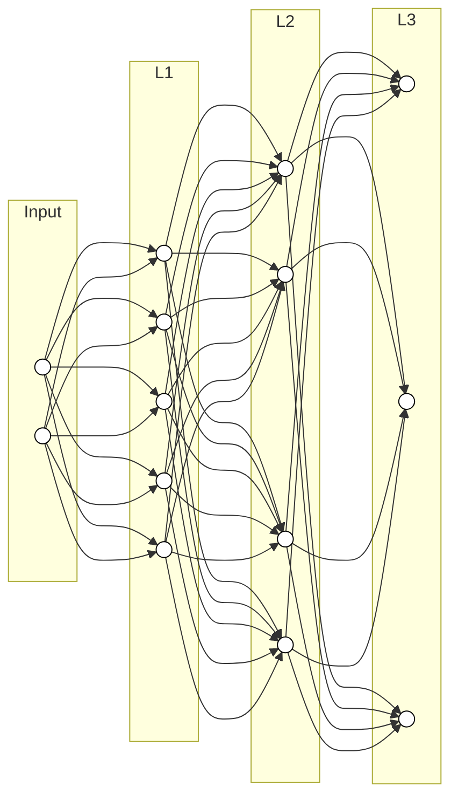
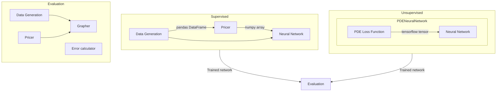
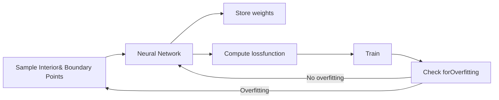

IMPERIAL COLLEGE LONDON

DEPARTMENT OF MATHEMATICS

----

# **Pricing Options using Deep Neural Networks from a Practical Perspective: a Comparative Study of Supervised and Unsupervised Learning**

----

*Author:* Viola Ruo Han Pu (CID: 01977026)

A thesis submitted for the degree of

MSc in Mathematics and Finance, 2020-2021

---

# **Declaration**

The work contained in this thesis is my own work unless otherwise stated.

1

---

# **Acknowledgements**

The thesis was created from June to August at Optiver Services B.V., a market making and proprietary trading firm in Amsterdam.

First of all, I would like to express my gratitude to my supervisors from the derivatives pricing team at Optiver, Dr. Artur Swiech and Dr. Andrea Fontanari, for giving me this opportunity to carry out this project, providing invaluable guidance and feedback throughout the thesis, and dedicating time to read my thesis. Secondly, I would like to thank the entire derivatives pricing team. Thank you for providing me with the necessary facilities and patiently answering my questions. I would like to extend my gratitude to all the traders and researchers on the trading floor whom I can approach whenever I have questions, which is really helpful for me to gain knowledge about the practical side.

I would also like to thank my internal supervisor from Imperial College London, Dr. Paul Bilokon, for supervising me despite having busy schedules, attending regular meetings, and spending time reading my final work.

I would like to thank Dana for making the arrangements to make the project happen and having talks with me every now and then. Thanks to Joe who has always been very helpful and supportive, I will always remember our talks about mochi! Special thanks to Brendan for all the ice coffee latte and all the desserts we had together – I cannot wait for you to start working as well! On the same line, I would also like to thank Clarence, thank you for helping me settling in Amsterdam, introducing me to delicious reminiscent food and bringing back yummy bubble tea!

From Imperial College London I would like to mention Antila, Kian, Lidan and Jay. Thank you for making the remote learning during lockdown enjoyable, and continuing to show support during thesis project – I hope we can meet up soon!

Robert and his family definitely deserve a special mention. Thank you for helping me whenever I need and wherever I am – I am very grateful!

At last I would like to thank my parents. Thank you for asking about my meals and sleep and always putting my happiness a priority! I am grateful for all the invaluable life advice and the unconditional support and love. This thesis is dedicated to my parents, thank you for everything.

---

# **Abstract**

An option gives the buyer the right, but not the obligation, to buy or sell the underlying at the strike price on or before the expiry date. Determining the value of an option has been a long-lasting problem. European options which can only be exercised on the expiry date can fortunately be solved by the celebrated Black-Scholes model. American options which can be exercised anytime before the expiry, however, have no closed-form solution. Numerical methods such as solving the partial differential equations (PDEs), tree-based method, Monte Carlo simulation and finite difference method have been developed in an attempt to price American options.

With rising popularity of machine learning, recent work has shown that neural networks can be used to price options. Among the methods using neural networks, there is supervised learning where the options prices are used as labels to train the neural network to interpolate the relationship between the inputs such as underlying, strike, and volatility and the prices. The success in applying neural networks to solve the PDEs such as Laplace equation has inspired the use of neural networks as Black-Scholes PDE or American option PDE solvers.

This work aims to evaluate and compare supervised and unsupervised learning methods in pricing options assessed from the aspects of accuracy, robustness and efficiency. The work is carried out with an emphasis on practical usage. We show that a trained supervised neural network produces prices close to the analytical and numerical prices with the exception of at-the-money region. It generates reasonably accurate prices for in-sample prediction but starts to have undesirable errors for out-of-sample prediction. Unsupervised neural network suffers from dimensionality problem where an increase in domain dimension lengthens the training time and increases the errors. In general, a supervised neural network generally outperforms an unsupervised neural network in our work, although both methods have room for improvement when used in practice.

---

### Contents

<table>
    <tr>
      <td><b>1</b></td>
<td><b>Pricing European Options</b></td>
<td><b>13</b></td>
    </tr>
<tr>
      <td>1.1</td>
<td>General Partial Differential Equations . . . . . . . . . . . . . . . . . . . . . . . . . . . . . . . . . .</td>
<td>13</td>
    </tr>
<tr>
      <td>1.2</td>
<td>The Black-Scholes PDE for European Options . . . . . . . . . . . . . . . . . . . . . . . . . . . .</td>
<td>14</td>
    </tr>
<tr>
      <td><b>2</b></td>
<td><b>Pricing American Options</b></td>
<td><b>16</b></td>
    </tr>
<tr>
      <td>2.1</td>
<td>The PDE for American Options . . . . . . . . . . . . . . . . . . . . . . . . . . . . . . . . . . . . . .</td>
<td>16</td>
    </tr>
<tr>
      <td>2.2</td>
<td>Tree-based Method . . . . . . . . . . . . . . . . . . . . . . . . . . . . . . . . . . . . . . . . . . . . .</td>
<td>18</td>
    </tr>
<tr>
      <td>2.3</td>
<td>Least-Squares Monte Carlo Simulation . . . . . . . . . . . . . . . . . . . . . . . . . . . . . . . .</td>
<td>19</td>
    </tr>
<tr>
      <td><b>3</b></td>
<td><b>Artificial Neural Networks</b></td>
<td><b>22</b></td>
    </tr>
<tr>
      <td>3.1</td>
<td>Overview . . . . . . . . . . . . . . . . . . . . . . . . . . . . . . . . . . . . . . . . . . . . . . . . . . . .</td>
<td>22</td>
    </tr>
<tr>
      <td>3.2</td>
<td>Architecture . . . . . . . . . . . . . . . . . . . . . . . . . . . . . . . . . . . . . . . . . . . . . . . . . .</td>
<td>23</td>
    </tr>
<tr>
      <td>3.3</td>
<td>Universal Approximation Theorem . . . . . . . . . . . . . . . . . . . . . . . . . . . . . . . . . .</td>
<td>24</td>
    </tr>
<tr>
      <td>3.4</td>
<td>Activation Function . . . . . . . . . . . . . . . . . . . . . . . . . . . . . . . . . . . . . . . . . . . . .</td>
<td>26</td>
    </tr>
<tr>
      <td>3.5</td>
<td>Loss Function . . . . . . . . . . . . . . . . . . . . . . . . . . . . . . . . . . . . . . . . . . . . . . . . .</td>
<td>27</td>
    </tr>
<tr>
      <td>3.6</td>
<td>Optimisation . . . . . . . . . . . . . . . . . . . . . . . . . . . . . . . . . . . . . . . . . . . . . . . . .</td>
<td>29</td>
    </tr>
<tr>
      <td></td>
<td>3.6.1 Stochastic Gradient Descent . . . . . . . . . . . . . . . . . . . . . . . . . . . . . . . . . .</td>
<td>29</td>
    </tr>
<tr>
      <td></td>
<td>3.6.2 Adam . . . . . . . . . . . . . . . . . . . . . . . . . . . . . . . . . . . . . . . . . . . . . . . . .</td>
<td>30</td>
    </tr>
<tr>
      <td></td>
<td>3.6.3 L-BFGS . . . . . . . . . . . . . . . . . . . . . . . . . . . . . . . . . . . . . . . . . . . . . . .</td>
<td>30</td>
    </tr>
<tr>
      <td><b>4</b></td>
<td><b>Methodology and Implementation</b></td>
<td><b>32</b></td>
    </tr>
<tr>
      <td>4.1</td>
<td>Overview . . . . . . . . . . . . . . . . . . . . . . . . . . . . . . . . . . . . . . . . . . . . . . . . . . . .</td>
<td>32</td>
    </tr>
<tr>
      <td>4.2</td>
<td>Shared Components . . . . . . . . . . . . . . . . . . . . . . . . . . . . . . . . . . . . . . . . . . . .</td>
<td>33</td>
    </tr>
<tr>
      <td>4.3</td>
<td>Supervised Learning . . . . . . . . . . . . . . . . . . . . . . . . . . . . . . . . . . . . . . . . . . . .</td>
<td>34</td>
    </tr>
<tr>
      <td></td>
<td>4.3.1 Parameters Selection and Labels Generation . . . . . . . . . . . . . . . . . . . . . . .</td>
<td>34</td>
    </tr>
<tr>
      <td></td>
<td>4.3.2 Data Pre-processing . . . . . . . . . . . . . . . . . . . . . . . . . . . . . . . . . . . . . . .</td>
<td>35</td>
    </tr>
<tr>
      <td></td>
<td>4.3.3 Training . . . . . . . . . . . . . . . . . . . . . . . . . . . . . . . . . . . . . . . . . . . . . . .</td>
<td>35</td>
    </tr>
<tr>
      <td>4.4</td>
<td>Unsupervised Learning . . . . . . . . . . . . . . . . . . . . . . . . . . . . . . . . . . . . . . . . . .</td>
<td>36</td>
    </tr>
<tr>
      <td></td>
<td>4.4.1 Neural Networks as PDE Solvers . . . . . . . . . . . . . . . . . . . . . . . . . . . . . .</td>
<td>36</td>
    </tr>
<tr>
      <td></td>
<td>4.4.2 Numerical Tractability . . . . . . . . . . . . . . . . . . . . . . . . . . . . . . . . . . . . .</td>
<td>37</td>
    </tr>
<tr>
      <td></td>
<td>4.4.3 Options Pricing Partial Differential Equations . . . . . . . . . . . . . . . . . . . . .</td>
<td>39</td>
    </tr>
<tr>
      <td></td>
<td>4.4.4 Implementation Details . . . . . . . . . . . . . . . . . . . . . . . . . . . . . . . . . . . . .</td>
<td>40</td>
    </tr>
<tr>
      <td><b>5</b></td>
<td><b>Results and Discussion</b></td>
<td><b>44</b></td>
    </tr>
<tr>
      <td>5.1</td>
<td>Data Generation . . . . . . . . . . . . . . . . . . . . . . . . . . . . . . . . . . . . . . . . . . . . . . .</td>
<td>44</td>
    </tr>
<tr>
      <td>5.2</td>
<td>Supervised Learning . . . . . . . . . . . . . . . . . . . . . . . . . . . . . . . . . . . . . . . . . . . .</td>
<td>45</td>
    </tr>
<tr>
      <td></td>
<td>5.2.1 Performance . . . . . . . . . . . . . . . . . . . . . . . . . . . . . . . . . . . . . . . . . . . .</td>
<td>45</td>
    </tr>
</table>

1

---

<table>
        <tr>
            <td></td>
<td>5.2.2</td>
<td>Robustness . . . . . . . . . . . . . . . . . . . . . . . . . . . . . . . . . . . . . . . . . . . . . . . . . .</td>
<td>50</td>
        </tr>
<tr>
            <td>5.3</td>
            <td colspan="2">Unsupervised Learning . . . . . . . . . . . . . . . . . . . . . . . . . . . . . . . . . . . . . . . . . .</td>
<td>52</td>
        </tr>
<tr>
            <td></td>
<td>5.3.1</td>
<td>Expressivity . . . . . . . . . . . . . . . . . . . . . . . . . . . . . . . . . . . . . . . . . . . . . . . . . .</td>
<td>52</td>
        </tr>
<tr>
            <td>5.4</td>
            <td colspan="2">Comparison . . . . . . . . . . . . . . . . . . . . . . . . . . . . . . . . . . . . . . . . . . . . . . . . . . .</td>
<td>58</td>
        </tr>
<tr>
            <td></td>
<td>5.4.1</td>
<td>Performance . . . . . . . . . . . . . . . . . . . . . . . . . . . . . . . . . . . . . . . . . . . . . . . . . .</td>
<td>59</td>
        </tr>
<tr>
            <td></td>
<td>5.4.2</td>
<td>Robustness . . . . . . . . . . . . . . . . . . . . . . . . . . . . . . . . . . . . . . . . . . . . . . . . . .</td>
<td>61</td>
        </tr>
<tr>
            <td></td>
<td>5.4.3</td>
<td>Efficiency . . . . . . . . . . . . . . . . . . . . . . . . . . . . . . . . . . . . . . . . . . . . . . . . . . . .</td>
<td>62</td>
        </tr>
<tr>
            <td><b>6</b></td>
            <td colspan="2"><b>Conclusion and Further Work</b></td>
<td><b>64</b></td>
        </tr>
<tr>
            <td colspan="3"><b>Bibliography</b></td>
<td><b>69</b></td>
        </tr>
</table>

2

---

# List of Figures

<table>
<tr>
<td>3.1</td>
<td>Graphical representation of a neural network with <i>r</i> = 3, <i>I</i> = <i>d</i>0 = 2, <i>d</i>1 = 5, <i>d</i>2 = 4 and <i>O</i> = <i>d</i>3 = 3.</td>
<td>24</td>
</tr>
<tr>
<td>4.1</td>
<td>Project structure. The project is split into supervised and unsupervised learning, with some shared components linking them together.</td>
<td>33</td>
</tr>
<tr>
<td>4.2</td>
<td>Flowchart of unsupervised neural network deep learning process, which comprises the process of sampling interior and boundary data, training the neural network by minimisng the loss function, and checking for overfitting to increase the sampled points. The weights are then stored.</td>
<td>41</td>
</tr>
<tr>
<td>4.3</td>
<td>Graphical representation of the steps in sampling points into dimension <i>S</i> and <i>t</i> array respectively, which are then paired up to form the coordinates of the boundary points.</td>
<td>42</td>
</tr>
<tr>
<td>5.1</td>
<td><b>(a)</b> Neural network predicted prices against Black-Scholes closed-form prices. <b>(b)</b> Histogram of errors between neural network predicted prices and Black-Scholes closed-form prices.</td>
<td>45</td>
</tr>
<tr>
<td>5.2</td>
<td>Parameters <i>S</i> ∈ [0.01, 60], <i>K</i> = 20, <i>σ</i> = 0.25, <i>r</i> = 0.04, <i>q</i> = 0.0, and <i>T</i> = 365 days are supplied. <b>(a)</b> The predicted and the Black-Scholes prices against the underlying. <b>(b)</b> The absolute differences between the predicted and the Black-Scholes prices. The absolute differences between the Black-Scholes and the prices generated by binomial tree and Monte Carlo methods are also plotted.</td>
<td>46</td>
</tr>
<tr>
<td>5.3</td>
<td>Parameters <i>S</i> = 20, <i>K</i> ∈ [0.01, 60], <i>σ</i> = 0.25, <i>r</i> = 0.04, <i>q</i> = 0.0, and <i>T</i> = 365 days are supplied. <b>(a)</b> The predicted and the Black-Scholes prices against the strike. <b>(b)</b> The absolute differences between the predicted price and the Black-Scholes prices.</td>
<td>47</td>
</tr>
<tr>
<td>5.4</td>
<td>Parameters <i>S</i> = <i>K</i> = 20, <i>σ</i> ∈ [0.05, 0.5], <i>r</i> = 0.04, <i>q</i> = 0.0, and <i>T</i> = 365 days are supplied. <b>(a)</b> The predicted and the Black-Scholes prices against the volatility. <b>(b)</b> The absolute differences between the predicted and the Black-Scholes prices.</td>
<td>47</td>
</tr>
<tr>
<td>5.5</td>
<td><b>(a)</b> Neural network predicted prices against binomial tree prices. <b>(b)</b> Histogram of errors between neural network predicted prices and binomial tree prices.</td>
<td>48</td>
</tr>
<tr>
<td>5.6</td>
<td>The parameters <i>r</i> = 0.04, <i>q</i> = 0.0, and <i>T</i> = 365 days are fixed. The following parameters are supplied: <b>(a-b)</b> <i>S</i> ∈ [0, 60], <i>K</i> = 20, and <i>σ</i> = 0.25. <b>(c-d)</b> <i>S</i> = 20, <i>K</i> ∈ [0, 60], and <i>σ</i> = 0.25. <b>(e-f)</b> <i>S</i> = <i>K</i> = 20 and <i>σ</i> ∈ [0.05, 0.5]. Graphs on the left are predicted and binomial tree prices against the underlying, strike and volatility, while graphs on the right show their absolute differences.</td>
<td>49</td>
</tr>
<tr>
<td>5.7</td>
<td>Results of model <code>BSSt</code>, <code>BSStrikeSt</code>, and <code>BSSigmaSt</code> trained with parameters specified in Table 5.6. Graphs on the left plot the predicted and analytical solutions against different parameters, while graphs on the right show the differences between the predicted and analytical prices.</td>
<td>55</td>
</tr>
</table>

3

---

<table>
		<tr>
			<td>5.8</td>
<td>Three-dimensional plots produced from model BSSt, BSStrikeSt, and BSSigmaSt, respectively. The orange line in the leftmost graph represents the boundary. . . . . . . .</td>
<td>55</td>
		</tr>
<tr>
			<td>5.9</td>
<td>Model AmericanSt, AmericanStrikeSt, and AmericanSigmaSt trained with parameters specified in Table 5.6. Graphs on the left plot the predicted and analytical solutions against different parameters, while graphs on the right show the differences between the predicted and binomial tree prices. . . . . . . . . . . . . . . . . . . . . . . . . .</td>
<td>57</td>
		</tr>
<tr>
			<td>5.10</td>
<td>Graphs on the left show supervised and unsupervised prices against the underlying, strike and volatility, while graphs on the right plot the differences between the supervised and unsupervised prices against different parameters. . . . . . . . . . . . . . .</td>
<td>60</td>
		</tr>
<tr>
			<td>5.11</td>
<td>Graphs on the left show supervised and unsupervised prices against the underlying, strike and volatility, while graphs on the right plot the differences between the supervised and unsupervised prices against different parameters. . . . . . . . . . . . . . .</td>
<td>61</td>
		</tr>
</table>

4

---

# **List of Tables**

3.1 Common activation functions, and their definitions, derivatives and output domains. Adapted from [1]. ............................ 26

3.2 Common loss functions that are used in regression and binary classification problems. $\hat{y}$ represents the predicted value and $y$ represents the actual value. Adapted from [1]. . . 28

4.1 The ranges of parameters used to simulate 100,000 option prices for training the neural network. Time to maturity $T$ is in days. ........................ 34

5.1 Time taken (in seconds) to generate 100,000 samples with binomial tree (1000 steps), MC/LSM (10,000 paths and 20 steps) and analytical Black-Scholes engines. ............................ 44

5.2 MSE, relative $L_2$ and max error of the training and test sets for neural networks trained on data generated by **BinomialAmerican** and **MCAmerican**. ............................ 48

5.3 The narrowed ranges of parameters used to simulate 100,000 option prices to test robustness. Time to maturity $T$ is in days. ............................ 50

5.4 MSE, relative $L_2$ and max error for both the training and test data sets for neural networks trained using eight different sample sizes. Parameters $K \in [60, 100]$, $r = 0.02$, $q = 0.03$, and $T = 550$ days are fixed for all predictions. For in-sample prediction, parameters $S = 80$ and $\sigma = 0.25$ are supplied; for out-of-sample prediction, three sets of parameters including: (1) $S = 40$ and $\sigma = 0.25$, (2) $S = 80$ and $\sigma = 0.05$, (3) $S = 40$ and $\sigma = 0.05$ are supplied. Maximum absolute errors between the predicted and Black-Scholes prices are recorded. Note the difference in **Max** for training/test data and in-sample/out-of-sample prediction. ............................ 51

5.5 MSE, relative $L_2$ and max error for both the training and test data sets for neural networks trained using eight different sample sizes. Parameters $K \in [60, 100]$, $r = 0.02$, $q = 0.03$, and $T = 550$ days are fixed for all predictions. For in-sample prediction, parameters $S = 80$ and $\sigma = 0.25$ are supplied; for out-of-sample prediction, three sets of parameters including: (1) $S = 40$ and $\sigma = 0.25$, (2) $S = 80$ and $\sigma = 0.05$, (3) $S = 40$ and $\sigma = 0.05$ are supplied. Maximum absolute errors between the predicted and binomial tree prices are recorded. Note the difference in **Max** for training/test data and in-sample/out-of-sample prediction. ............................ 52

5.6 The ranges or values of the parameters used to train different models. Time to maturity $T$ and real time $t$ are in years. ............................ 53

5.7 Interior training loss (int. loss), interior validation loss (int. val. loss), boundary training loss (bound. loss), boundary validation loss (bound. val. loss), relative $L_2$ error and relative max error for all the European and American models. ............................ 58

5.8 The ranges of parameters used to simulate option prices to compare supervised and unsupervised neural networks. Time to maturity $T$ is in days. ............................ 58

5

---

<table>
        <tr>
            <td>5.9</td>
<td>Relative <i>L</i>2 and max error for supervised and unsupervised neural network trained with the same parameters in Table 5.8. . . . . . . . . . . . . . . . . . . . . . . . . . . . . . . . . . .</td>
<td>59</td>
        </tr>
<tr>
            <td>5.10</td>
<td>Maximum absolute error for supervised and unsupervised neural network for both European and American options tested via out-of-sample parameters. . . . . . . . . . . . . . . . . .</td>
<td>62</td>
        </tr>
<tr>
            <td>5.11</td>
<td>Time taken (in seconds) for supervised and unsupervised learning processes. Note that 200,000 samples are generated for training for European options while 500,000 samples are generated for American options. . . . . . . . . . . . . . . . . . . . . . . . . . . . . . . . . .</td>
<td>62</td>
        </tr>
</table>

6

---

# List of Abbreviations

<table>
<tr>
<td>PDE</td>
<td>Partial differential equation</td>
</tr>
<tr>
<td>FDM</td>
<td>Finite difference method</td>
</tr>
<tr>
<td>FEM</td>
<td>Finite element method</td>
</tr>
<tr>
<td>LSM</td>
<td>Least-Squares Monte Carlo</td>
</tr>
<tr>
<td>SDE</td>
<td>Stochastic differential equation</td>
</tr>
<tr>
<td>CDF</td>
<td>Cumulative distribution function</td>
</tr>
<tr>
<td>ANN</td>
<td>Artificial neural network</td>
</tr>
<tr>
<td>GBM</td>
<td>Geometric Brownian motion</td>
</tr>
<tr>
<td>DE</td>
<td>Differential evolution</td>
</tr>
<tr>
<td>CaNN</td>
<td>Calibration neural network</td>
</tr>
<tr>
<td>BDSE</td>
<td>Backward stochastic differential equation</td>
</tr>
<tr>
<td>FNN</td>
<td>Feedforward neural network</td>
</tr>
<tr>
<td>MSE</td>
<td>Mean squared error</td>
</tr>
<tr>
<td>PnL</td>
<td>Profit-and-loss</td>
</tr>
<tr>
<td>Id</td>
<td>Identity activation function</td>
</tr>
<tr>
<td>H</td>
<td>Heaviside activation function</td>
</tr>
<tr>
<td>ReLU</td>
<td>Rectified linear unit activation function</td>
</tr>
<tr>
<td>SGD</td>
<td>Stochastic gradient descent</td>
</tr>
<tr>
<td>BFGS</td>
<td>Broyden–Fletcher–Goldfarb–Shanno</td>
</tr>
<tr>
<td>L-BFGS</td>
<td>Limited-memory Broyden–Fletcher–Goldfarb–Shanno</td>
</tr>
<tr>
<td>ATM</td>
<td>At-the-money</td>
</tr>
<tr>
<td>ITM</td>
<td>In-the-money</td>
</tr>
<tr>
<td>OTM</td>
<td>Out-of-the-money</td>
</tr>
</table>

7

---

# List of Symbols

<table>
<tr>
<td>$K$</td>
<td>Strike price</td>
</tr>
<tr>
<td>$S$</td>
<td>Underlying price</td>
</tr>
<tr>
<td>$r$</td>
<td>Risk-free interest rate</td>
</tr>
<tr>
<td>$\sigma$</td>
<td>Volatility</td>
</tr>
<tr>
<td>$T$</td>
<td>Time to maturity</td>
</tr>
<tr>
<td>$B = (B_t)_{t \ge 0}$</td>
<td>Brownian motion under the risk neutral measure $\mathbb{Q}$</td>
</tr>
<tr>
<td>$g(S_T)$</td>
<td>Payoff function of an option</td>
</tr>
<tr>
<td>$\Delta t := T/N$</td>
<td>Sub-intervals in tree-based method</td>
</tr>
<tr>
<td>$t_n = n\Delta t$</td>
<td>Grid-points in tree-based method and LSM</td>
</tr>
<tr>
<td>$p$</td>
<td>Probability of the underlying price going up in tree-based method</td>
</tr>
<tr>
<td>$u$</td>
<td>Scaling factor of the underlying price when it goes up in the tree-based method</td>
</tr>
<tr>
<td>$d$</td>
<td>Scaling factor of the underlying price when it goes down in the tree-based method</td>
</tr>
<tr>
<td>$g_k^n$</td>
<td>Intrinsic value of an American option at time $n$ with $k$ specifying the node in the tree- based method</td>
</tr>
<tr>
<td>$\tilde{V}_k^n$</td>
<td>Continuation value of an American option at time $n$ with $k$ specifying the node in the tree-based method</td>
</tr>
<tr>
<td>$\tau$</td>
<td>Stopping time</td>
</tr>
<tr>
<td>$(\Omega, \mathcal{F}, \mathbb{P})$</td>
<td>Probability space</td>
</tr>
<tr>
<td>$\Omega$</td>
<td>The state space which is the set of all possible outcomes between time 0 and $T$</td>
</tr>
<tr>
<td>$\omega$</td>
<td>A sample path</td>
</tr>
<tr>
<td>$\mathbb{P}$</td>
<td>A probability measure which under no-arbitrage condition admits the existence of an equivalent martingale measure $\mathbb{Q}$</td>
</tr>
<tr>
<td>$C(\omega, s; t_n, T)$</td>
<td>The path of cash flows generated by the option conditional on the holder of the option adopting the optimal stopping strategy for all $s, t &#x3C; s \le T$, as well as conditional on that the options are not exercised on or before time $t$ in LSM</td>
</tr>
<tr>
<td>$a_j$</td>
<td>Constant coefficients in a set of weighted Laguerre polynomials in LSM</td>
</tr>
<tr>
<td>$F(\omega; t_n)$</td>
<td>Continuation value of an American option at time $t_n$ in LSM</td>
</tr>
<tr>
<td>$F_K(\omega; t_{N-1})$</td>
<td>Approximated continuation value of an American option at time $t_{N-1}$ using the first $K$ Laguerre basis functions</td>
</tr>
<tr>
<td>$\widehat{F}_K(\omega; t_{N-1})$</td>
<td>Fitted value by regressing the discounted values of $C(\omega, s; t_{N-1}, T)$ onto the Laguerre basis functions</td>
</tr>
<tr>
<td>$N_I$</td>
<td>Differential operators on the interior of a PDE</td>
</tr>
<tr>
<td>$N_B$</td>
<td>Differential operators on the boundary of a PDE</td>
</tr>
<tr>
<td>$N_0$</td>
<td>Initial or final time operator</td>
</tr>
<tr>
<td>$F / G$</td>
<td>Source functions of a PDE</td>
</tr>
<tr>
<td>$q$</td>
<td>Continuous dividend yield</td>
</tr>
</table>

8

---

<table>
        <tr>
            <td>$\mathcal{N}$</td>
<td>Cumulative distribution function of the standard normal distribution $\mathcal{N}(0, 1)$</td>
        </tr>
<tr>
            <td>$\mathcal{T}[t, T]$</td>
<td>The set of admissible stopping times in $[t, T]$ during which the American option holder can choose to exercise</td>
        </tr>
<tr>
            <td>$V_{\text{Call}}(t, S)$</td>
<td>Time-$t$ fair value of a Call option</td>
        </tr>
<tr>
            <td>$V_{\text{Put}}(t, S)$</td>
<td>Time-$t$ fair value of a Put option</td>
        </tr>
<tr>
            <td>$I$</td>
<td>Number of units in the input layer in a feedforward neural network</td>
        </tr>
<tr>
            <td>$O$</td>
<td>Number of units in the output layer in a feedforward neural network</td>
        </tr>
<tr>
            <td>$d_i$</td>
<td>Number of units in the $i$-th hidden layer in a feedforward neural network</td>
        </tr>
<tr>
            <td>$r - 1$</td>
<td>Number of hidden layers in a feedforward neural network</td>
        </tr>
<tr>
            <td>$\boldsymbol{\sigma}_i$</td>
<td>Activation function in the $i$-th hidden layer</td>
        </tr>
<tr>
            <td>$W^i$</td>
<td>Weight matrix from the $(i - 1)$-th to $i$-th hidden layer</td>
        </tr>
<tr>
            <td>$\boldsymbol{b}^i$</td>
<td>Bias vector in the $i$-th hidden layer</td>
        </tr>
<tr>
            <td>$\mathcal{N}_r$</td>
<td>Class of feedforward neural networks with $r - 1$ hidden layers</td>
        </tr>
<tr>
            <td>$\sigma$</td>
<td>Sigmoid activation function</td>
        </tr>
<tr>
            <td>$\tanh$</td>
<td>Hyperbolic tangent activation function</td>
        </tr>
<tr>
            <td>$\ell$</td>
<td>Loss function in training a feedforward neural network</td>
        </tr>
<tr>
            <td>$\mathscr{L}$</td>
<td>Empirical risk</td>
        </tr>
<tr>
            <td>$\mathscr{L}_B$</td>
<td>Minibatch risk</td>
        </tr>
<tr>
            <td>$\eta$</td>
<td>A hyperparameter in stochastic gradient descent and <i>Adam</i> called step size or learning rate</td>
        </tr>
<tr>
            <td>$B_i$</td>
<td>The $i$-th minibatch in stochastic gradient descent that the training data is uniformly sampled into</td>
        </tr>
<tr>
            <td>$g_t$</td>
<td>Gradient in <i>Adam</i></td>
        </tr>
<tr>
            <td>$m_t$</td>
<td>Exponential moving averages of the gradients in <i>Adam</i></td>
        </tr>
<tr>
            <td>$v_t$</td>
<td>Exponential moving averages of the variances of the gradients in <i>Adam</i></td>
        </tr>
<tr>
            <td>$\beta_1, \beta_2$</td>
<td>The hyperparameters that control the exponential decay rates of the moving averages in <i>Adam</i></td>
        </tr>
<tr>
            <td>$\mathscr{L}$</td>
<td>Loss function in training neural networks as PDE solvers</td>
        </tr>
<tr>
            <td>$\lambda$</td>
<td>Weighting attributed to the interior loss in the loss function which is used to train the neural networks as PDE solvers</td>
        </tr>
<tr>
            <td>$\{\boldsymbol{y}_i^I\}_{i=1}^{n_I}$</td>
<td>Collocation points uniformly distributed over the domain $\Omega$</td>
        </tr>
<tr>
            <td>$\{\boldsymbol{y}_i^B\}_{i=1}^{n_B}$</td>
<td>Collocation points uniformly distributed over the domain $\partial\Omega$</td>
        </tr>
<tr>
            <td>$t_{\max}$</td>
<td>Value of the real time at the upper bound</td>
        </tr>
<tr>
            <td>$S_{\max}$</td>
<td>Value of the underlying at the upper bound</td>
        </tr>
</table>

9

---

# **Introduction**

An *option* is a type of derivative, which in finance, refers to a contract that derives its value from the performance of an *underlying*. An underlying can be an index, asset or interest rate. An option gives the buyer the right, but not the obligation, to buy or sell the underlying at a specified strike price on or before the expiry date, depending on the exercise style of the option. Traders and investors enter option markets with different goals in mind. While some enter the markets with an opinion on which direction the prices will move, others make use of options to protect their positions against unfavourable price movements, or act as intermediaries where they buy and sell at request from other market participants, hoping to profit from the differences between the bid and ask prices. The most common type of an option is a *European vanilla option*, which gives the buyer the right, but not the obligation, to buy (a *Call option*) or sell (a *Put option*) the underlying at a specified strike price $K$ at maturity $T$. The payoff of a European option at maturity is $(S_T - K)^+$ for a Call option and $(K - S_T)^+$ for a Put option, where $S_T$ is the underlying price at maturity.

Determining the value of an option has been a long-standing problem in the field of mathematical finance. Black and Scholes [2] deduced a closed-form formula for pricing a European option on an underlying whose price follows a log-normal diffusion process, making the valuation of European options straightforward. On the other hand, early exercise options such as *American options* are hard to value. As an American option can be exercised at any time during the lifetime of the option, American option pricing problem is concerned with a moving boundary that is related to the optimal *stopping time*. The theory of optimal stopping is related to the problem of choosing a time to adopt an action based on sequentially observed random variables so as to maximize an expected payoff or to minimize an expected cost.

Since the only scenario when a closed-form solution to pricing an American option exists is when the underlying has no dividend, a wide range of numerical and analytical methods have been developed for the valuation of American options. Early attempts made to price American options, which remain popular until today, include solving *partial differential equations (PDEs)*. For instance, Brennan and Schwartz [3] developed the *finite difference method (FDM)* to evaluate American put options. Zvan *et al.* transformed the Black-Scholes PDE into one with a non-linear penalty term and solved the equations under the *finite element method (FEM)* [4]. Recently, Ballestra [5] developed a novel algorithm under the finite difference scheme enhanced by repeated Richardson extrapolation and showed that it performs remarkably better than the traditional FDM. These PDE methods, however, are only suitable for low-dimensional problems – at most four dimensions [6].

Apart from these PDE methods, *binomial tree method* proposed by Cox *et al.* [7], which was then extended to *trinomial tree method* by Boyle [8], is easy to implement and fast to compute. Various literature has proven the convergence of binomial tree method for the valuation of American options [9]. Moreover, common simulation-based approaches include *Monte Carlo simulation* and the *Least-Squares Monte Carlo (LSM)* method proposed by Longstaff and Schwartz [10]. LSM has been shown to exhibit better results [11] than the normal Monte Carlo simulation and its consistency and conver-

10

---

gence has been investigated by Clement *et al.* [12]. These simulation-based approaches depend on the discretisation of the corresponding *stochastic differential equations (SDEs)* and the approximation of conditional expectations [6].

On the other hand, *artificial neural network (ANN)* based methods do not require discretisation of the partial or stochastic differential equation. Ever since Hutchinson *et al.* [13] who proposed the learning network to price the S&P 500 futures options under the Black-Scholes framework, there has been considerable interest in the use of ANNs for option pricing and hedging. This is due to their advantage in computation time when the models are trained upfront compared to standard functional approximators, as well as their ability to approximate solutions to very complex functions as stated by universal approximation theorem [14]. While most literature on ANNs focuses on European options, such as the paper by Liu *et al.* [15] which proposed an ANN approach to price European options under the Black-Scholes framework and the Heston model as well as to compute implied volatilities using Brent's root-finding method, there have been some attempts to extend the ANN approach to pricing more complex options such as American options.

Research using *supervised machine learning* techniques to price American options includes the one by Jang and Lee [16], who showed that generative Bayesian neural network models incorporating priors produce a better calibration and prediction performance for pricing American put options on S&P 100 index than classical American option models. As opposed to Jang and Lee [16] who looked at American put options on S&P 100 index, Gaspar *et al.* [17] investigated pricing the American put options on individual stocks using two different neural networks, with the input variables collected from Bloomberg. Compared to the NN model with input variables of stock price, strike price, implied volatility and maturity, the model with more input variables (such as dividend yield and interest rate) outperforms both the former model and LSM. Without depending on the observed market option prices to apply ANN to fit a model-free function like Gaspar *et al.* [17] did, Karatas *et al.* [18] employed model-based pricing by generating artificial sample paths of the price processes for American options using the Ju-Zhong (JZ) approximation under the *geometric Brownian motion (GBM)* framework and showed that recurrent neural network has more promising training time than feedforward neural network. Moreover, Liu *et al.* [19] also employed model-based pricing – they extended their work on European options [15] to not only approximate the American-style Black-Scholes prices, but also use the *Differential Evolution (DE)* optimisation algorithm to estimate implied volatility and implied dividend (when they are unknown) using the *Calibration Neural Network (CaNN)*.

In terms of *unsupervised learning techniques*, several papers have attempted to solve the PDEs using ANNs rather than using the numerical techniques, alleviating the curse of dimensionality. Han *et al.* [20] reformulated PDEs as *backward stochastic differential equations (BDSE)* and approximated the gradients of the solution with deep neural networks, inspiring the field of deep BDSE. Following Han *et al.*'s work, Chen and Wan [21] implemented neural networks on American option problems with the least squares residual of the BDSE as the loss function. Their neural network performs better than LSM when the dimension is more than 20. In contrast to employing deep BDSE approach, Salvador *et al.* [22] reformulated the Black–Scholes American option pricing problem as a linear complementarity problem and made an ANN learn solutions which satisfy constraints imposed by the PDE and the boundary conditions by minimising a loss function. Compared to the prices computed by the finite element method, the solutions obtained by the ANN have errors of order of magnitude of minus three, and therefore are reasonably accurate.

Previous work in the field mainly explores the feasibility of pricing European and American options using artificial neural networks, and compare the results against those produced by traditional numerical methods. The comparison between supervised and unsupervised learning in terms of

11

---

speed, accuracy, and robustness in extreme market conditions is however not explored. Supervised and unsupervised learning methods each has its own advantages – supervised learning is simpler to implement while unsupervised learning does not require a large amount of training data which is difficult to acquire in some circumstances. The main goal of this project is to compare pricing options using both methods. For supervised learning, the prices are generated using the numerical methods and used to train the neural networks to map the inputs to the prices. For unsupervised learning, we base our work on van der Meer *et al.*'s [23] and Salvador *et al.*'s [6] papers, where we solve the corresponding partial differential equations by minimising suitable loss functions using ANNs. The ANNs will then approximate solutions that converge to the solutions of the PDE problems.

The thesis is structured as follows. In the first three chapters a theoretical background to the key concepts is provided. Chapter 1 introduces the general PDEs and the renowned Black-Scholes PDE which is used to price European options. Chapter 2 presents the methods to price American options, including the PDE for American options, the tree-based method and Least-Squares Monte Carlo. In Chapter 3, one can find an overview of the artificial neural networks, including the concept of a fully-connected feedforward neural network, the universal approximation theorem that states that neural network with a single hidden layer can approximate a rich class of functions on compact subsets, and the training of neural networks. Chapter 4 details the methodology and implementation of both supervised and unsupervised learning, including how unsupervised neural network can be used as PDE solvers, practical concerns and changes to ensure numerical tractability, connecting Black-Scholes and American PDEs in Chapter 1 and 2 with the loss functions. Practical implementation details of the critical components of the code are also discussed. Chapter 5 presents the results of European and American options pricing using both supervised and unsupervised learning. We evaluate and discuss supervised and unsupervised techniques individually before going on to compare them. Finally, in Chapter 6 we conclude this thesis by giving a brief summary and an insight into possible future research directions. The code of this thesis is available on GitHub: https://github.com/violapu/OPNN.

12

---

# Chapter 1

# Pricing European Options

This thesis begins with pricing European options. Before presenting pricing European options with Black-Scholes partial differential equations (PDEs) in Section 1.2, we give a brief introduction of general PDEs in Section 1.1.

Partial differential equations (PDEs), which describe the relations between the various partial derivatives of a multi-variable function, are usually used to describe natural phenomena and model multi-dimensional dynamical systems. In the area of finance, solving PDEs is important for problems of derivatives pricing, optimal execution and many more.

## 1.1 General Partial Differential Equations

Consider a general $n$-dimensional PDE for the function $u(x) \equiv u(x_1, ..., x_n)$ on the finite domain $\Omega \subset R^n$, the $k$-th order PDE can be expressed as

$$N_I(x, u(x); Du(x), ..., D^{k-1}u(x), D^k u(x)) = 0 \quad x \in \Omega \subset R^n$$

where $D^k$ is the collection of all the partial derivatives of order $k$. As these partial derivatives arguments can usually be inferred from $u$, we can omit them and write

$$N_I(x, u) = 0  in  \Omega \tag{1.1.1}$$

In certain scenarios, we require the unknown function $u$ to be equal to some known function on the boundary of its domain $\partial\Omega$. Similarly to above, the boundary conditions can be represented as

$$N_B(x, u) = 0  on  \partial\Omega \tag{1.1.2}$$

In many cases, it is crucial that a unique solution exists for each choice of data, and the solution depends continuously on the data including the right hand side and the differential operators on the interior and boundary, $N_I$ and $N_B$ respectively. This is a property known as *well-posedness* [24]. To be more specific, one example would be that the solution should only change marginally when the boundary conditions change slightly. To ensure the PDE is well-posed, Equations (1.1.1) and (1.1.2) can be rewritten as [23]

$$
\begin{cases}
\tilde{N}_I(x, u) = F(x) & in  \Omega \\
\tilde{N}_B(x, u) = G(x) & on  \partial\Omega
\end{cases} \tag{1.1.3}
$$

where $F$ and $G$ are source functions. These source functions and operators define constraints on $u$ that must be satisfied to solve the PDE. The well-posedness of such PDE is defined as follows [25]:

13

---

**Definition 1.1.1.** The PDE given in Equation (1.1.3) exhibits well-posedness if for all $F$ and $G$, there exists a unique solution, and if for every two sets of data, $F_1, G_1$ and $F_2, G_2$, the solutions $u_1$ and $u_2$ satisfy
$$\|u_1 - u_2\| \leq K(\|F_1 - F_2\| + \|G_1 - G_2\|)$$
for some fixed constant $K \in \mathbb{R}$, which is known as the Lipschitz constant.

## 1.2 The Black-Scholes PDE for European Options

One of the most renowned results in the field of mathematical finance is the Black-Scholes Equation and the associated Black-Scholes PDE discussed in the seminal work of Black and Scholes [2] in 1973. We present here a simple variant of this equation relevant for pricing a European option on underlying that yields continous dividends.

A European option gives the holder the right to buy or sell an underlying asset such as a stock, bond or commodity at the strike price on the expiry date. Before we present the Black-Scholes equation for the valuation of a plain vanilla European option, we first look at the Feynman-Kac formula. The Feynman-Kac formula [26] states the expectation of stochastic process driven by Brownian motion $B = (B_t)_{t \geq 0}$ can be obtained as a solution of an associated PDE.

**Theorem 1.2.1** (Feynman-Kac). *Suppose $V = V(t, x)$ is the solution to the PDE*
$$
\begin{cases}
\partial_t V + b(t, x) \partial_x V + \frac{1}{2} \sigma^2(t, x) \partial_x^2 V = r(t, x) V, & t < T; \\
V(T, x) = g(x), & t = T.
\end{cases}
$$

Then subject to some suitable regularity conditions on $V, r, b$ and $\sigma$, we have
$$V(t, x) = \mathbb{E} \left[ g(X_T) \exp \left( \int_t^T r(u, X^u) \mathrm{d}u \right) \middle| \mathcal{F}_t \right] \eqno(1.2.1)$$

where $X = (X_s)_{s \in [t, T]}$ is the solution to the stochastic differential equation (SDE)
$$\mathrm{d}X_s = b(s, X_s) \mathrm{d}s + \sigma(s, X_s) \mathrm{d}B_s, \quad X_t = x$$

In the Black-Scholes model, under the risk neutral measure $\mathbb{Q}$, the underlying asset is assumed to pay a continuous yield of $q$, i.e. the dividend paid over the interval $(t, t + \delta t]$ equals $q S_t \delta t$. The dynamics of the underlying asset can be shown to follow the SDE
$$\mathrm{d}S_t = (r - q) S_t \mathrm{d}t + \sigma S_t \mathrm{d}B_t$$

where $B_t$ is a Brownian motion. The time-$t$ fair value of an option with payoff $g(S_T)$ at maturity $T$ is
$$V(t, S) := \mathbb{E}_{\mathbb{Q}}^{(t, S)} [g(S_T) \exp(-r(T - t))]$$

By Theorem 1.2.1, $V(t, S)$ can then be characterised by the solution to the PDE, which is known as the Black-Scholes PDE
$$
\begin{cases}
\partial_t V + (r - q) S \partial_S V + \frac{1}{2} \sigma^2 S^2 \partial_S^2 V - rV = 0, & t < T; \\
V(T, S) = g(S), & t = T.
\end{cases} \eqno(1.2.2)
$$

In order to solve the PDE, appropriate boundary conditions should be imposed [27]. For a European option, the underlying lives on the domain $[0, \infty)$. In this case, $S_{\min} = 0$, and $S_{\max}$ needs to be chosen to impose the boundary conditions $V(t, 0)$ and $V(t, S_{\max})$.

14

---

* For Call options with the terminal condition $V(T, S) = (S - K)^+$:

    (1) At zero stock price, a Call option becomes worthless. Therefore, $V(t, 0) = 0$.

    (2) For very large initial stock price, a Call option has a high probability of ending up in the money and being exercised so that the option holder receives the stock and pays the strike price $K$ at maturity $T$. Therefore, $V(t, S_{\text{max}}) \approx S_{\text{max}} - Ke^{-r(T-t)}$.

* For Put options with the terminal condition $V(T, S) = (K - S)^+$:

    (1) When the stock price is zero, a Put option behaves like a fixed cash payment of $K$. Hence the fair value of the option is $V(t, 0) = Ke^{-r(T-t)}$.

    (2) For very large initial stock price, a Put option is very likely to end up above the strike price $K$ and expire worthless. Thus, $V(t, S_{\text{max}}) \approx 0$.

With boundary conditions imposed, the analytical solution to Equation (1.2.2) is:

$$
\begin{aligned}
V_{\text{Call}}(t, S) &= Se^{-q(T-t)}\mathcal{N}(d_1) - Ke^{-r(T-t)}\mathcal{N}(d_2) \\
V_{\text{Put}}(t, S) &= Ke^{-r(T-t)}\mathcal{N}(-d_2) - Se^{-q(T-t)}\mathcal{N}(-d_1)
\end{aligned}
\eqno(1.2.3)
$$

where $\mathcal{N}$ is the cumulative distribution function (CDF) of the standard normal distribution $\mathcal{N}(0, 1)$ and

$$
\begin{aligned}
d_1 &= \frac{\log(S/K) + (r - q + \sigma^2/2)(T - t)}{\sigma\sqrt{T - t}} \\
d_2 &= \frac{\log(S/K) + (r - q - \sigma^2/2)(T - t)}{\sigma\sqrt{T - t}} = d_1 - \sigma\sqrt{T - t}
\end{aligned}
$$

15

---

# Chapter 2

# Pricing American Options

This Chapter presents the methods to price American options. Following Chapter 1, the PDE for American options is introduced in Section 2.1. Apart from solving the PDE, popular numerical methods used to price American options including the tree-based method and Least-Squares Monte Carlo are presented in Section 2.2 and 2.3. These two methods are used to generate prices which are used as labels for training under supervised learning, and also used to compute errors against the predicted prices by neural networks under both supervised and unsupervised learning.

## 2.1 The PDE for American Options

In contrast to European options, American options allow the option holder to exercise the option prior to the maturity date and receive the payoff immediately based on the prevailing value of the underlying. This can be described as an *optimal stopping problem*.

**Definition 2.1.1** (Stopping Time). Let $(\Omega, F, \{F_n\}_{n=0}^{\infty}, P)$ be a filtered probability space. A stopping time is a random variable $\tau: \Omega \to \{0, 1, 2...\} \cup \{\infty\}$ such that for all $n \ge 0$ we have:

$$\{\omega : \tau(\omega)\} := \{\tau \le n\} \in F_n \tag{2.1.1}$$

**Remark.** *The condition 2.1.1 is equivalent in discrete time to $\{\tau = n\} \in F_n$ for every $n$.*

Let $T[t, T]$ be the set of admissible stopping times in $[t, T]$ during which the option holder can choose to exercise. The price of an American option at time $t$ with the underlying price $S_t = S$ is

$$V(t, S) = \sup_{\tau \in T[t, T]} E_{Q} \left[ g(S_{\tau}) e^{-r(\tau - t)} \big| S_t \right] \tag{2.1.2}$$

where $Q$ is the risk neutral measure. Taking $\tau = t$ in Equation (2.1.2), which means one can immediately exercise the option and obtain payoff $g(S)$. We therefore have

$$V(t, S) \ge g(S)$$

16

---

One may continue holding onto the option to time $t + \delta t$ with $\delta t$ being a very small number. Then

$$
\begin{aligned}
e^{r \delta t} V(t, S) &= e^{r \delta t} \sup_{\tau \in \mathcal{T}[t, T]} \mathbb{E}_{\mathbb{Q}} \left[ g(S_{\tau}) e^{-r(\tau - t)} \middle| S_t \right] \\
&= \sup_{\tau \in \mathcal{T}[t, T]} \mathbb{E}_{\mathbb{Q}} \left[ \mathbb{E}_{\mathbb{Q}} \left[ g(S_{\tau}) e^{-r(\tau - t - \delta t)} \middle| S_{t + \delta t} \right] \middle| S_t \right] \\
&\geq \sup_{\tau \in \mathcal{T}[t + \delta t, T]} \mathbb{E}_{\mathbb{Q}} \left[ \mathbb{E}_{\mathbb{Q}} \left[ g(S_{\tau}) e^{-r(\tau - t - \delta t)} \middle| S_{t + \delta t} \right] \middle| S_t \right] \\
&= \mathbb{E}_{\mathbb{Q}} \left[ \sup_{\tau \in \mathcal{T}[t + \delta t, T]} \mathbb{E}_{\mathbb{Q}} \left[ g(S_{\tau}) e^{-r(\tau - t - \delta t)} \middle| S_{t + \delta t} \right] \middle| S_t \right] \\
&= \mathbb{E}_{\mathbb{Q}} [V(t + \delta t, S_{t + \delta t})]
\end{aligned}
$$

where $S_{t+\delta t}$ is the underlying asset price at time $t + \delta t$. We have therefore shown that

$$e^{r\delta t} V(t, S) \geq \mathbb{E}_{\mathbb{Q}} [V(t + \delta t, S_{t+\delta t})] \tag{2.1.3}$$

We assume that $V$ is continuously differentiable with respect to $t$ and twice continuously differentiable with respect to $S$. By Itô's lemma, we have

$$V(t + \delta t, S_{t+\delta t}) = V(t, S) + \int_t^{t+\delta t} \left( \partial_t V(u, S_u) du + \partial_S V(u, S_u)(r S_u du + \sigma S_u dB_u) \right.$$
$$\left. + \frac{1}{2} \partial_S^2 V(u, S_u) \sigma^2 S_u^2 du \right)$$

Taking expectation on both sides, we obtain

$$\mathbb{E}_{\mathbb{Q}} [V(t + \delta t, S_{t+\delta t})] = V(t, S) + \mathbb{E}_{\mathbb{Q}} \left[ \int_t^{t+\delta t} \partial_t V(u, S_u) du + \partial_S V(u, S_u) r S_u du \right.$$
$$\left. + \frac{1}{2} \partial_S^2 V(u, S_u) \sigma^2 S_u^2 du \right] \tag{2.1.4}$$

By substituting $e^{r\delta t} = 1 + r\delta t + \mathcal{O}(\delta t^2)$ and Equation (2.1.4) into Equation (2.1.3), and dividing both sides by $\delta t$, we obtain

$$r V(t, S) + \frac{\mathcal{O}(\delta t^2)}{\delta t} \geq \mathbb{E}_{\mathbb{Q}} \left[ \frac{1}{\delta t} \int_t^{t+\delta t} \partial_t V(u, S_u) du + \partial_S V(u, S_u) r S_u du + \frac{1}{2} \partial_S^2 V(u, S_u) \sigma^2 S_u^2 du \right]$$

Since $\mathcal{O}(\delta t)$ is a high order term of $\delta t$, by letting $\delta t \to 0$, we have

$$r V(t, S) \geq \partial_t V(t, S) + \partial_S V(t, S) r S + \frac{1}{2} \partial_S^2 V(t, S) \sigma^2 S^2$$

$$\partial_t V(t, S) + \partial_S V(t, S) r S + \frac{1}{2} \partial_S^2 V(t, S) \sigma^2 S^2 - r V(t, S) \leq 0$$

Therefore, we have shown that

$$\min \left( -\partial_t V(t, S) - \partial_S V(t, S) r S - \frac{1}{2} \partial_S^2 V(t, S) \sigma^2 S^2 + r V(t, S), V(t, S) - g(S) \right) \geq 0 \tag{2.1.5}$$

The first term in Equation (2.1.5) is equal to zero when $V(t, S) > g(S)$, known as the *continuation region*, i.e. when the payoff from keeping the option is higher than that from the immediate exercise.

17

---

The second term is equal to zero when $V(t, S) = g(S)$, known as the *exercise boundary*, where the option will be exercised. Since a decision has to be made at time $t$, one of the two decisions must be optimal and therefore one of the inequalities must be an equality. We have therefore shown that the inequality in Equation (2.1.5) is actually an equality, and hence the PDE for an American option is

$$
\begin{cases} 
\min(-\partial_t V(t, S) - \partial_S V(t, S)rS - \frac{1}{2}\partial_S^2 V(t, S)\sigma^2 S^2 + rV(t, S), V(t, S) - g(S)) = 0, & t \in [0, T]; \\
V(T, S) = g(S), & t = T.
\end{cases}
\eqno(2.1.6)
$$

## 2.2 Tree-based Method

In the Black-Scholes model, the risk-free asset with interest rate $r$ and the risky stock with the price process $(S_t)_{t \ge 0}$ follow the geometric Brownian motion

$$
\frac{dS_t}{S_t} = rdt + \sigma dB_t \eqno(2.2.1)
$$

which gives

$$
S_t = S_0 \exp \left[ \left( r - \frac{\sigma^2}{2} \right)t + \sigma B_t \right] \eqno(2.2.2)
$$

where $B = (B_t)_{t \ge 0}$ is a Brownian motion under the risk neutral measure $\mathbb{Q}$. The time-zero fair price of a European option with maturity $T$ and payoff function $g(S_T)$, where $g(s) = (s - K)^+$ for Call options and $g(s) = (K - s)^+$ for Put options, is

$$
e^{-rT} \mathbb{E}_{\mathbb{Q}} \left[ g(S_T) \right] \eqno(2.2.3)
$$

The motivation of the tree-based method is to approximate the continuous price process by a simple discrete process to aid the computation of the time-zero fair price as shown in Equation (2.2.3). The basic idea is to construct a tree which models the various paths that the stock price can follow during the lifetime of an option. The binomial pricing model on a single underlying asset was initially proposed by Cox, Ross and Rubinstein [7]. Since then, it has been often used to price American options which can be exercised at any time prior to expiry.

To price an American option with the binomial tree method, we divide the period $[0, T]$ by $N$ sub-intervals with length $\Delta t := T/N$ and grid points $t_n = n\Delta t, n = 0, 1, \dots, N$. An $N$-period recombined tree is built from simple one-period binomial trees, where the stock price $S$ can go up to $uS$ with probability $p$, or go down to $dS$ with probability $1 - p$. From Equations (2.2.1) and (2.2.2), we have

$$
\frac{S_{t+\Delta t}}{S_t} = \exp \left[ \left( r - \frac{\sigma^2}{2} \right) \Delta t + \sigma(B_{t+\Delta t} - B_t) \right] \sim \text{log-normal} \left( \left( r - \frac{\sigma^2}{2} \right) \Delta t, \sigma^2 \Delta t \right)
$$

The first and second moments of the stochastic return over the interval $[t, t + \Delta t]$ are

$$
\mathbb{E}_{\mathbb{Q}} \left[ \frac{S_{t+\Delta t}}{S_t} \right] = e^{r \Delta t} \quad \text{and} \quad \mathbb{E}_{\mathbb{Q}} \left[ \left( \frac{S_{t+\Delta t}}{S_t} \right)^2 \right] = e^{(2r + \sigma^2) \Delta t}
$$

By matching the above two moments with the first two moments of the binary random variable, we obtain

$$
\begin{cases}
pu + (1 - p)d = e^{r \Delta t} \\
pu^2 + (1 - p)d^2 = e^{(2r + \sigma^2) \Delta t}
\end{cases}
$$

18

---

After imposing the condition $ud = 1$ to ensure the tree recombines, and performing Taylor expansion of $u$ in powers of $\sqrt{\Delta t}$, we obtain the parameters of the binomial tree specified under the Cox-Ross-Rubinstein (CRR) model
$$p = \frac{e^{r\Delta t} - d}{u - d}, \quad u = e^{\sigma\sqrt{\Delta t}}, \quad d = e^{-\sigma\sqrt{\Delta t}}$$
where $-\sigma < r\sqrt{\Delta t} < \sigma$ is required to ensure $p$ is a well-defined probability.

Due to the early exercise feature of the American options, a stopping time $\tau$ is required to describe the exercise timing strategy. The time-$n$ fair price of an American option with maturity $T$ and strike $K$ is
$$
\begin{aligned}
V^n &:= \sup_{\tau \in [n, N]} \mathbb{E}_{\mathbb{Q}} \left[ e^{-r(\tau-n)\Delta t} g(S_\tau) \middle| \mathcal{F}_n \right] \\
&= \begin{cases} g(S_N) & \text{for } n = N \\ \max\{g(S_n), e^{-r\Delta t} \mathbb{E}_{\mathbb{Q}} \left[ V^{n+1} \middle| \mathcal{F}_n \right]\} & \text{for } n = 0, 1, \dots, N-1 \end{cases}
\end{aligned}
$$

At time $t_n$, there are $n + 1$ nodes representing asset price $S_k^n$, where $S_k^n = S_0 u^{n-k} d^k$ for $k = 0, 1, \dots, n$ and $n = 0, 1, \dots, N$. We further define $g_k^n := g(S_k^n)$. Then, for $n = 0, 1, \dots, N-1$, the time-$n$ fair price of an American option becomes
$$V_k^n = \max\{g_k^n, e^{-r\Delta t} (p V_k^{n+1} + (1 - p) V_{k+1}^{n+1})\}$$

The intuition is that at any time point $n$, there are two possibilities. If exercising the option is optimal right now, the option holder exercises the option and receives an immediate payoff of $g_k^n$, which is also called the *intrinsic value* of an option at time $n$. On the other hand, if exercising the option is not optimal at this instant, the option holder keeps the option and the value of this position as of time $n$ can be computed by risk neutral pricing
$$\tilde{V}_k^n := e^{-r\Delta t} \left[ p V_{k+1}^{n+1} + (1 - p) V_k^{n+1} \right]$$
where $\tilde{V}_k^n$ is also known as the *continuation value* of the option at time $n$. The option is therefore exercised if and only if the intrinsic value is larger than the continuation value.

The algorithm to compute the time-zero value of an American option with the binomial tree method is as follows. Firstly, the option value at terminal time $N$ is given by its intrinsic value $V_k^N = g_k^N$ for $k = 0, 1, \dots, N$. For $n = N - 1, N - 2, \dots, 0$, we compute $V_k^n$ for each $k = 0, 1, \dots, n$. By backward induction, we can then obtain the time-zero option value $V_0^0$. More details and proof can be found in [28]. Jiang and Dai proved the convergence of the binomial tree method for American options [9].

The advantages of the binomial tree method are its ease of implementation, fast computation for low-dimensional problems, and its flexibility to extend to options with embedded decision features. However, as the number of the underlying assets increases, the curse of dimensionality kicks in and the implementation becomes computationally expensive.

## 2.3 Least-Squares Monte Carlo Simulation

Although using Monte Carlo simulation to price American options is difficult due to their early exercise feature, there are several advantages [10]. The key advantage is that computational time increases linearly when the value of the option depends on multiple factors. Moreover, Monte Carlo simulation allows general stochastic processes such as jump diffusion. In practice, simulation is applicable to

19

---

parallel computing, thereby allowing a potential increase in the computational speed. There are several Monte Carlo simulation methods that can be used price American options, and here we give an overview of the Least-Squares Monte Carlo (LSM) proposed by Longstaff and Schwartz. More details regarding the numerical examples illustrating the simulation method, the theoretical framework, and the algorithm can be found in [10].

On the expiry date, the optimal strategy is to exercise an option if it is in the money and allow it to expire worthless if it is out of the money. Prior to the expiry date, as mentioned under Section 2.2, the holder of an American option compares the payoff from immediate exercise called the intrinsic value against the expected payoff if keeping the option called the continuation value, and exercise if and only if the intrinsic value is higher. Similarly to the binomial tree method, the optimal exercise strategy is determined by the conditional expectation of the payoff from keeping the option. The key to the LSM method is the application of the least squares to estimate this conditional expected payoff.

We assume a probability space $(\Omega, F, P)$ and a finite time horizon $[0, T]$. The state space $\Omega$ is the set of all possible outcomes between time 0 and $T$ with $\omega$ representing a sample path, $F$ is the sigma field of distinguishable events at time $T$, and $P$ is a probability measure which under no-arbitrage condition admits the existence of an equivalent martingale measure $Q$. To implement LSM, we assume that the American options can only be exercised at $N$ discrete times, and can be used to approximate continuously exercisable American options by making $N$ sufficiently large. We divide the period from the valuation date to the expiry date $[0, T]$ into $N$ sub-intervals with grid points $t_n = n\Delta t, n = 0, 1, ..., N$. At time $t_n$, the cash flow from immediate exercise equals to the intrinsic value and is known to the option holder. However, the cash flow from holding on to the option, is not known but can be calculated from taking the expectation of the rest of the discounted cash flows $C(\omega, s; t_n, T)$ with respect to the risk neutral measure $Q$. $C(\omega, s; t_n, T)$ refers to the path of cash flows generated by the option conditional on the holder of the option adopting the optimal stopping strategy for all $s, t < s \leq T$, as well as that the options are not exercised on or before time $t$. Then, at time $t_n$, the continuation value is

$$F(\omega; t_n) = E_{Q} \left[ \sum_{j=n+1}^{N} \exp \left( -\int_{t_n}^{t_j} r(\omega, s) \, ds \right) C(\omega, t_j; t_n, T) \bigg| F_{t_n} \right] \tag{2.3.1}$$

The least squares approach can be used to approximate the conditional expectation at $t_{N-1}, t_{N-2}, ..., t_1$. For instance, at $t_{N-1}$, $F(\omega; t_{N-1})$ in Equation 2.3.1 can be represented by a linear combination of a countable set of $F_{t_{N-1}}$-measurable basis functions. Possible choices of basis functions include Legendre, Chebyshev, and Jacobi. Longstaff and Schwartz [10] chose a set of weighted Laguerre polynomials as the basis functions:

$$F(\omega; t_{N-1}) = \sum_{j=0}^{\infty} a_j L_j(X)$$

where the $a_j$ coefficients are constants. The LSM algorithm [10] is as follows:

- Generate a number of random paths that the underlying may follow, and for each path, the asset price $S_n$ at $t_n, n = 0, 1, ..., N$ are known.
- Divide the period $[0, T]$ into $N$ sub-intervals where $0 < t_1 \leq t_2 \leq \cdots \leq t_N = T$.
- At time $t_{N-1}$, the continuation value $F(\omega; t_{N-1})$ can be approximated using the first $K$ Laguerre basis functions, which is denoted as $F_K(\omega; t_{N-1})$. After finding the paths where the options are in the money at $t_{N-1}$, we then regress the discounted values of $C(\omega, s; t_{N-1}, T)$ onto those basis functions and obtain the fitted value of this regression as $\widehat{F}_K(\omega; t_{N-1})$.

20

---

* By comparing the intrinsic value from immediate exercise with $\widehat{F}_K(\omega; t_{N-1})$, we can decide to early exercise if the intrinsic value is higher. This is repeated for all in-the-money paths.
* Go backwards to time $t_{N-2}$ and repeat this process until a decision on whether to exercise is made for each time step along all the paths.
* Starting from time zero, we move along each path until encountering the first stopping time and discount the cash flow from the stopping time back to time zero.
* Average over all paths $\omega$ to obtain the American option value.

21

---

# Chapter 3

# Artificial Neural Networks

The chapter begins with an overview of artificial neural networks as well as machine learning algorithms including both supervised and unsupervised learning in Section <u>3.1</u>. This is followed by a formal definition of the components of the neural networks in Section <u>3.2</u>. Universal approximation theorem, which states that a neural network with a single hidden layer, can approximate any function, is discussed in Section <u>3.3</u>. Continuity and differentiability properties of some activation functions are also proved in this Section. Implementation of the neural networks including choosing suitable activation functions to impose non-linearity, and minimising distance measures with optimisation algorithms is detailed in Section <u>3.4-3.6</u>.

## 3.1 Overview

Artificial neural networks (ANNs) are mathematical computing systems that are structured in a way that is similar to animal brains. According to Haykin <u>[29]</u>, a non-mathematical formulation of neural networks is as follows:

A neural network is a massively parallel distributed processor that has a natural propensity for storing experiential knowledge and making it available for use. It resembles the brain in two respects:

1. Knowledge is acquired by the network through a learning process.
2. Interneuron connection strengths known as synaptic weights are used to store the knowledge.

The aim of a neural network is to approximate some function $f$ by defining a mapping $y = f(x; \theta)$ and learning the value of the parameters $\theta$ that best approximate the function. In order to learn the mapping between the inputs and outputs, the synaptic weights and neural network architecture including the number of perceptrons per layer, the number of layers and the directing of synaptic connections, are important.

Different types of neural networks can be distinguished by varying those parameters. One example would be feedforward neural networks (FNNs) where each unit in a layer is connected to all the other units in the next layer and there are no feedback connections in which outputs of the model are fed back into the neural network <u>[30]</u>. The information flows through the function being evaluated from $x$, through the computations that are used to define $f$, before reaching the output $y$ <u>[31]</u>. This is in contrast to recurrent neural networks, where the output of the network is fed back to the network.

22

---

Due to their universal approximation capability, FNNs have been useful in many applications, such as face and speech recognition, time series prediction, and simulation modeling. With the numerous applications of FNNs being successful, we aim to apply FNNs for pricing options in both supervised and unsupervised manners.

Supervised and unsupervised learning are the two main categories of machine learning algorithms, which are algorithms that can learn from data. A computer program is said to learn from experience $E$ with respect to some tasks $T$ and performance measure $P$, if its performance at tasks in $T$ measured by $P$ improves with experience $E$ [32]. Examples of tasks $T$ include classification and regression, and measures $P$ can be accuracy or error rate. Supervised learning algorithms experience inputs containing features, with a label being associated with each example. The data is usually split into training, validation and test data sets. The training data is represented as

$$(x_1, y_1), ..., (x_n, y_n)$$

where $x_i$ represents an input vector and $y_i$ represents the corresponding label. Given the inputs $x_i$, the outputs $f(x_i)$ should be as close as possible to $y_i$. To quantify the closeness, we define loss functions, which are then minimised with optimisation algorithms during training. An example of a loss function is *Mean Squared Error* (MSE):

$$MSE = \frac{1}{n} \sum_{i}^{n} (f(x_i) - y_i)^2$$

which measures the average squared difference between the outputs and the labels. During training, a problem called *overfitting*, that is, producing a function that performs well with the training data but poorly with the unseen data, can happen. This is manifested as training loss plunging below validation loss during training. To prevent overfitting, a *dropout* layer can be introduced where each input gets randomly replaced by zero value during training with probability $p \in [0, 1]$, so that the neural network is forced to learn the most robust features. Apart from using a dropout layer, the number of iterations called epochs can be reduced or the number of samples can be increased to prevent overfitting. Once the model is trained, the model can be evaluated on unseen data called the test data, so as to see how our model generalises.

On the other hand, unsupervised learning algorithms are those that experience only features but not labels. Without the labels, the optimality of the algorithm cannot be measured directly through the closeness of its outputs from the labels, but through some other kinds of measures such as profit-and-loss (PnL) if the aim is to maximise PnL or self-defined loss functions.

## 3.2 Architecture

The concept of a neural network can be formalised as follows [1]:

**Definition 3.2.1.** Let $I, O, r \in N$. A function $f: R^I \to R^O$ is a feedforward neural network with $r-1 \in \{0, 1, ...\}$ hidden layers, where there are $d_i \in N$ units in the $i^{th}$ hidden layer for any $i = 1, ..., r-1$, and activation functions $\sigma_i: R^{d_i} \to R^{d_i}, i = 1, ..., r$, where $d_r := O$, if

$$f = \sigma_r \circ L_r \circ \cdots \circ \sigma_1 \circ L_1 \tag{3.2.1}$$

where $L_i: R^{d_{i-1}} \to R^{d_i}$, for any $i = 1, ..., r$, is an affine function

$$L_i(x) := W^i x + b^i, x \in R^{d_{i-1}}$$

23

---

parametrised by weight matrix $W^i = [W^i_{j,k}]_{j=1,...,d_i, k=1,...,d_{i-1}} \in \mathbb{R}^{d_i \times d_{i-1}}$ and bias vector $\boldsymbol{b}^i = (b^i_1, ..., b^i_{d_i}) \in \mathbb{R}^{d_i}$, with $d_0 := I$. We denote the class of such functions $f$ by

$$\mathcal{N}_r (I, d_1, ..., d_{r-1}, O; \sigma_1, ..., \sigma_r)$$

An example of deep neural network can be seen in Figure 3.1. As can be seen from the definition, FNNs are typically represented by composing alternatingly affine and simple non-linear functions, giving rise to non-linearity, hence the reason why they are called networks. The overall length of the chain structure, including the input layer, the hidden layers and the output layer, gives the *depth* of the model. The dimensionality of the hidden layers determines the *width* of the neural networks. The neural network architecture is determined by the weights $W^1, ..., W^r$ and biases $\boldsymbol{b}^1, ..., \boldsymbol{b}^r$, as well as the activation functions $\sigma_1, ..., \sigma_r$.

*   $I = d_0 = 2$
*   $d_1 = 5$
*   $d_2 = 4$
*   $O = d_3 = 3$
*   Activation functions: $\sigma_1$ (applied to $L_1$), $\sigma_2$ (applied to $L_2$), $\sigma_3$ (applied to $L_3$)

**Figure 3.1:** Graphical representation of a neural network with $r = 3, I = d_0 = 2, d_1 = 5, d_2 = 4$ and $O = d_3 = 3$.

## 3.3 Universal Approximation Theorem

The use of neural networks to approximate very complex functions is motivated by their *universal approximation property*, which states that a continuous function defined on a bounded domain can be approximated by a suitable neural network [33].

In order to measure the precision of approximation by a neural network, two norms are defined as follows. Let $K \subset \mathbb{R}^I$ be compact, and $L^p(K, \mathbb{R})$ denotes the class of measurable functions $f : K \to \mathbb{R}$ such that $\|f\|_{L^p(K)} < \infty$. For any measurable $f : \mathbb{R}^I \to \mathbb{R}$, the *sup norm* is defined as:

$$\|f\|_{\text{sup}, K} := \sup_{x \in K} |f(\boldsymbol{x})|$$

and for any $p \ge 1$, the $L^p$ *norm* is defined as:

$$\|f\|_{L^p(K)} := \left( \int_K |f(\boldsymbol{x})|^p d\boldsymbol{x} \right)^{\frac{1}{p}}$$

24

---

A slight reformulation of the generalised results on universal approximation theorem by Leshno *et al.* [34] can be found in Theorem 2.22 in [1]:

**Theorem 3.3.1** (Universal Approximation Theorem). *Let $g : \mathbb{R} \to \mathbb{R}$ be a measurable function such that*

(a) *g is not a polynomial function.*

(b) *g is bounded on any finite interval.*

(c) *the closure of the set of all discontinuity points of g in $\mathbb{R}$ has zero Lebesgue measure.*

*Moreover, let $K \subset \mathbb{R}^I$ be compact and $\epsilon > 0$.*

(i) *For any $u \in C(K, \mathbb{R})$, there exist $d \in \mathbb{N}$ and $f \in \mathcal{N}_2(I, d, 1; g, \text{Id})$ such that*
$$\|u - f\|_{\sup, K} < \epsilon$$

(ii) *Let $p \geq 1$. For any $v \in L^p(K, \mathbb{R})$, there exist $d' \in \mathbb{N}$ and $h \in \mathcal{N}_2(I, d', 1; g, \text{Id})$ such that*
$$\|v - h\|_{L^p(K)} < \epsilon$$

According to universal approximation theorem, a neural network is able to represent any function that we are trying to approximate. However, it is not guaranteed that the function can be learnt due to two reasons [31]. Firstly, the algorithm may not find the parameters that correctly learn the function. Secondly, wrong functions might be learnt instead because of problems such as overfitting.

Theorem 3.3.1 holds for neural networks with a single hidden layer, which can be extended to deeper neural networks with bounded width but unbounded depth, with general activation functions [35]. In practice, using a single hidden layer may result in an infeasibly large layer and subsequently generalization error. Using more hidden layers can reduce the number of perceptrons in each layer significantly and may lead to better generalization.

When using neural networks to solve PDEs, which is what we aim to achieve with unsupervised learning in our thesis, it is important that the neural networks can approximate both the functions and their derivatives well. This has been shown to be the case when the activation functions enjoy continuity and differentiability properties [1]:

**Proposition 3.3.2** (Continuity and Differentiability).

(i) *If $\sigma_i \in C(\mathbb{R}^{d_i}, \mathbb{R}^{d_i})$ for any $i = 1, \dots, r$, then*
$$\mathcal{N}_r(I, d_1, \dots, d_{r-1}, O; \sigma_1, \dots, \sigma_r) \subset C(\mathbb{R}^I, \mathbb{R}^O)$$

(ii) *If $\sigma_i \in C^{m_i}(\mathbb{R}^{d_i}, \mathbb{R}^{d_i})$ for some $m_i \in \mathbb{N} \cup \{\infty\}$ for any $i = 1, \dots, r$, then*
$$\mathcal{N}_r(I, d_1, \dots, d_{r-1}, O; \sigma_1, \dots, \sigma_r) \subset C^{\min\{m_1, \dots, m_r\}}(\mathbb{R}^I, \mathbb{R}^O)$$

*Proof.* (i) As the affine functions $L_1, \dots, L_r$ in Equation (3.2.1) are continuous, $f \in \mathcal{N}_r(I, d_1, \dots, d_{r-1}, O; \sigma_1, \dots, \sigma_r)$ is a composition of continuous functions. Therefore, $f$ is continuous.

(ii) Suppose we are trying to compose partial derivatives that are of order $m$, where $m \leq \min\{m_1, \dots, m_r\}$, of a function $f \in \mathcal{N}_r(I, d_1, \dots, d_{r-1}, O; \sigma_1, \dots, \sigma_r)$. According to the chain rule, the derivative exists and can be shown to be a combination and composition of the partial derivatives of $L_1, \dots, L_r$ and $\sigma_1, \dots, \sigma_r$ up to order $m$. By construction and by assumption, all those partial derivatives are continuous. Hence, the partial derivative of $f$ is continuous as well.
$\square$

25

---

## 3.4 Activation Function

As described in Section 3.2, neural networks are constructed by affine and non-linear functions, where the non-linearity is given by the activation functions so that the neural networks can learn complex data. During training, the *back-propagation* algorithm is often employed to calculate the gradient, so as to find the minimum of the loss function. This requires the continuity and the differentiability of the neural network, which is in turn controlled by the activation functions as shown in Proposition 3.3.2. Therefore, it is desirable for activation functions to be continuous and differentiable. Some common activation functions can be found in Table 3.1, which are often chosen depending on the usage.

<table>
<thead>
<tr>
<th>Activation</th>
<th>Plot</th>
<th>Definition</th>
<th>Derivative</th>
<th>Range</th>
</tr>
</thead>
<tbody>
<tr>
<td>Identity (Id)</td>
<td></td>
<td>g(x) = x</td>
<td>g'(x) = 1</td>
<td>ℝ</td>
</tr>
<tr>
<td>Heaviside (H)</td>
<td></td>
<td>g(x) = { 0 x &#x3C; 0 1 x ≥ 0</td>
<td>g'(x) = 0, x ≠ 0</td>
<td>{0, 1}</td>
</tr>
<tr>
<td>Sigmoid (σ)</td>
<td></td>
<td>g(x) = 1 / (1 + e-x)</td>
<td>g'(x) = g(x)(1 - g(x))</td>
<td>(0, 1)</td>
</tr>
<tr>
<td>Hyperbolic Tangent (tanh)</td>
<td></td>
<td>g(x) = (ex - e-x) / (ex + e-x)</td>
<td>g'(x) = 1 - g(x)2</td>
<td>(-1, 1)</td>
</tr>
<tr>
<td>ArcTan</td>
<td></td>
<td>g(x) = tan-1(x)</td>
<td>g'(x) = 1 / (1 + x2)</td>
<td>(-1.5, 1.5)</td>
</tr>
<tr>
<td>Rectified linear unit (ReLU)</td>
<td></td>
<td>g(x) = max{x, 0}</td>
<td>g'(x) = { 0 x &#x3C; 0 1 x > 0</td>
<td>[0, ∞)</td>
</tr>
<tr>
<td>Softplus</td>
<td></td>
<td>g(x) = log(1 + ex)</td>
<td>g'(x) = 1 / (1 + e-x)</td>
<td>(0, ∞)</td>
</tr>
</tbody>
</table>

**Table 3.1:** Common activation functions, and their definitions, derivatives and output domains. Adapted from [1].

The *identity (Id)* activation function takes the inputs multiplied by the weights for each neuron, and produces an output proportional to the inputs. It therefore can only be used in the output layer in cases such as regression problems instead of simultaneously in all the layers, otherwise non-linearity is not imposed. Moreover, since the derivative of identity is a constant, back-propagation algorithm cannot be used to learn the weights. Similarly for *heaviside (H)* activation function, with its derivative

26

---

being zero or undefined, it cannot be used in back-propagation algorithms.

On the other hand, *sigmoid* ($\sigma$), *hyperbolic tangent* ($tanh$), and *arctan* activation functions are differentiable and therefore popular in deep neural networks. With its outputs being bounded to (0, 1), sigmoid is also often used in classification problems to represent the probabilities of belonging to a class. However, all three activation functions suffer from *vanishing gradient problem* [36], where the gradient is vanishingly small as it gets back-propagated back, preventing the update of the weights.

The *rectified linear unit (ReLU)* activation function [37] is computationally efficient as it allows for fast convergence. However, one of its limitations is that it does not allow any negative values to pass through. Therefore, ReLU units become inactive and output a constant for any input on the negative real line, a problem known as the *dead ReLU problem* [38]. This leads to its continuous differentiable counterpart – *softplus* activation function.

## 3.5 Loss Function

As shown in Section 3.3, theoretically, neural networks are able to approximate any reasonable functions. To approximate the function in an optimal way with the neural network $\boldsymbol{f} : \mathbb{R}^I \to \mathbb{R}^O, \boldsymbol{f} \in \mathcal{N}_r(I, d_1, ..., d_{r-1}, O)$, loss functions $\ell : \mathbb{R}^O \times \mathbb{R}^O \to \mathbb{R}$ are defined, with one example being the Mean Squared Error as can be found in Section 3.1.

More generally, if the input $\boldsymbol{x} \in \mathbb{R}^I$ and the label $\boldsymbol{y} \in \mathbb{R}^O$ are a realisation of a joint random vector $(\boldsymbol{X}, \boldsymbol{Y})$, optimal $\boldsymbol{f}$ can be achieved by minimising the *risk*

$$\boldsymbol{E}[\ell(\boldsymbol{f}(\boldsymbol{X}), \boldsymbol{Y})]$$

Without knowing the distribution of $(\boldsymbol{X}, \boldsymbol{Y})$, which is often the case in real life, we can minimise the *empirical risk*

$$\mathcal{L}(\boldsymbol{f}) := \frac{1}{N} \sum_{i=1}^N \ell(\boldsymbol{f}(\boldsymbol{x}^i), \boldsymbol{y}^i) \tag{3.5.1}$$

We also define the *minibatch risk* as follows

$$\mathcal{L}_B(\boldsymbol{\theta}) := \frac{1}{\#B} \sum_{i \in B} \ell(\boldsymbol{f}_{\boldsymbol{\theta}}(\boldsymbol{x}^i), \boldsymbol{y}^i) \tag{3.5.2}$$

where minibatch $B \subset \{1, 2, ..., N\}$ is any subset of samples.

Some common one-dimensional loss functions can be found in Table 3.2. *Squared loss* is the squared difference between the actual and predicted value, which is penalised more heavily if the difference is big. Due to the quadratic growth, squared loss usually amplifies the predicted values that are far away from the actual values, causing the outliers to be given more weight during training and therefore impact the training result disproportionately. *Absolute loss* can be used to address this shortcoming. However, the gradient of the absolute loss function is constant, meaning that the gradient remains big even when the loss is low, which is not good for gradient-based training. Therefore, $L_1$ loss is relatively robust to outliers but maybe harder to find the solution, while $L_2$ loss is sensitive to outliers but is more stable. *Huber loss* [39], on the other hand, combines the squared loss and absolute loss and has both of their desirable properties. It is absolute loss which becomes quadratic in a $\delta$-neighbourhood for $\delta > 0$. Choosing a suitable $\delta$ is important as it determines what we consider as outliers. *Log-cosh loss* is a smooth $L_2$ loss that is twice differentiable as compared to Huber loss which is only differentiable to the first order. As some algorithms use Newton's method to minimise the loss function, it is favourable to have a loss function that is twice differentiable.

27

---

Example loss functions for binary classification are also presented in Table 3.2. Other loss functions that are suitable for multi-dimensional classification problems include *categorical cross-entropy* and *Kullback–Leibler divergence loss*. Since our project involves regression, only loss functions that are suitable for regression problems are focused in this Section.

<table>
    <thead>
        <tr>
            <th>Loss</th>
            <th>Plot</th>
            <th>Definition</th>
            <th>Use</th>
        </tr>
    </thead>
    <tbody>
        <tr>
            <td>Squared loss</td>
<td></td>
<td>ℓ(ŷ, y) = (ŷ − y)2, ŷ, y ∈ ℝ</td>
<td>Regression</td>
        </tr>
<tr>
            <td>Absolute loss</td>
<td></td>
<td>ℓ(ŷ, y) = |ŷ − y|, ŷ, y ∈ ℝ</td>
<td>Regression</td>
        </tr>
<tr>
            <td>Huber loss</td>
<td></td>
<td>ℓ(ŷ, y) = { 1/2(ŷ − y)2, |ŷ − y| ≤ δ δ(|ŷ − y| − 1/2δ), |ŷ − y| > δ</td>
<td>Regression</td>
        </tr>
<tr>
            <td>Log-cosh loss</td>
<td></td>
<td>ℓ(ŷ, y) = log(cosh(ŷ − y)) ŷ, y ∈ ℝ</td>
<td>Regression</td>
        </tr>
<tr>
            <td>Binary cross-entropy</td>
<td></td>
<td>ℓ(ŷ, y) = −y log ŷ − (1 − y) log 1 − ŷ, ŷ ∈ (0, 1), y ∈ {0, 1}</td>
<td>Binary classification</td>
        </tr>
<tr>
            <td>Hinge loss</td>
<td></td>
<td>ℓ(ŷ, y) = max(0, 1 − ŷy), ŷ ∈ (0, 1), y ∈ {0, 1}</td>
<td>Binary classification</td>
        </tr>
    </tbody>
</table>

**Table 3.2:** Common loss functions that are used in regression and binary classification problems. $\hat{y}$ represents the predicted value and $y$ represents the actual value. Adapted from [1].

28

---

## 3.6 Optimisation

In this section, we present some of the popular optimisation methods used in training neural networks.

### 3.6.1 Stochastic Gradient Descent

To understand *stochastic gradient descent (SGD)*, we first look at gradient descent which is a first-order gradient-based optimisation method that updates the variables in the direction of the steepest descent. More details can be found in [1].

To minimise a generic differentiable function $F : \mathbb{R}^d \to \mathbb{R}$, the usual approach is to let $\nabla F(\boldsymbol{x}) = 0$ and sometimes there is at least one solution that is a minimiser. However, $\nabla F$ may be zero or just difficult to solve in real life, usually rendering the common method infeasible. The differential equation

$$\frac{\mathrm{d}\boldsymbol{x}(t)}{\mathrm{d}t} = -\nabla F(\boldsymbol{x}(t)), \quad t > 0 \tag{3.6.1}$$

with initial condition $\boldsymbol{x}(0) \in \mathbb{R}^d$ can approximate a minimiser if it exists. With step size $\eta > 0$, Equation (3.6.1) can be approximated by Euler's method as

$$\frac{\boldsymbol{x}(t + \eta) - \boldsymbol{x}(t)}{\eta} \approx -\nabla F(\boldsymbol{x}(t))$$

$$\boldsymbol{x}(t + \eta) \approx \boldsymbol{x}(t) - \eta \nabla F(\boldsymbol{x}(t))$$

which motivates the gradient descent

$$\boldsymbol{x}_{\text{new}} := \boldsymbol{x}_{\text{old}} - \eta \nabla F(\boldsymbol{x}_{\text{old}})$$

given some initial condition $\boldsymbol{x}_0$; the step size $\eta$ is a hyperparameter called the learning rate. Minimising the empirical risk as defined in Equation (3.5.1) with gradient descent method can be computationally expensive. Therefore, SGD which uses the subsets of the training data to successively compute the gradient updates is favoured in the training of neural networks. In SGD, the training data is uniformly sampled into minibatches $B_1, \dots, B_k \subset \{1, \dots, N\}$ such that $\#B_i = N/k$ for any $i = 1, \dots, k$, where $N/k$ is the minibatch size. With a batch size $N/k$, an iteration of SGD when minimising the minibatch risk as defined in Equation (3.5.2) is given by

$$\boldsymbol{\theta}_i := \boldsymbol{\theta}_{i-1} - \eta \nabla_{\boldsymbol{\theta}} \mathscr{L}_{B_i}(\boldsymbol{\theta}_{i-1}), \quad i = 1, \dots, k$$

SGD faces several challenges. One challange lies in choosing a suitable learning rate. If the learning rate $\eta$ is too big, SGD may overshoot. On the other hand, if it is too low, the convergence may be very slow. Another challenge is to avoid being trapped in the suboptimal local minima and saddle points. This is because the slopes of the saddle points in orthogonal directions are all zero, which is hard for SGD to escape [40]. Nevertheless, SGD has been proven to be an efficient and effective method that is key to the success of many machine learning applications, such as recent advances in deep learning for speech recognition [41].

29

---

### 3.6.2 Adam

To address the shortcomings of SGD mentioned in the previous section, several stochastic optimisation methods were proposed. One of them called *Adam* combines the advantages of two popular methods: the capacity of *AdaGrad* [42] to deal with sparse gradients and the ability of *RMSProp* [43] to work with non-stationary objective functions.

We let $f(\theta)$ be a noisy objective function and we want to minimise the expected value of this objective function $\mathbb{E}[f(\theta)]$ with respect to parameters $\theta$. Let $g_t = \nabla_\theta f_t(\theta)$ denote the gradient, $m_t$ denote the exponential moving averages of the gradients, and $v_t$ denote the exponential moving averages of the variances of these gradients. The *Adam* algorithm updates $m_t$ and reduces the learning rate based on $v_t$, with the hyperparameters $\beta_1, \beta_2 \in [0, 1)$ controlling the exponential decay rates of these moving averages. The algorithm [44] is as follows:

$$g_t = \nabla_\theta f_t(\theta_{t-1})$$

$$m_t = \beta_1 \cdot m_{t-1} + (1 - \beta_1) \cdot g_t$$

$$v_t = \beta_2 \cdot v_{t-1} + (1 - \beta_2) \cdot g_t^2$$

$$\widehat{m}_t = m_t / (1 - \beta_1^t)$$

$$\widehat{v}_t = v_t / (1 - \beta_2^t)$$

$$\theta_t = \theta_{t-1} - \eta \cdot \frac{\widehat{m}_t}{\sqrt{\widehat{v}_t} + \epsilon}$$

where $g_t^2$ denotes the element-wise square $g_t \odot g_t$, $\eta$ denotes the learning rate, $\epsilon$ ensures numerical stability and $\hat{m}_t$ and $\hat{v}_t$ denote the bias-corrected estimates. All operations on vectors are element-wise.

Requiring little memory, *Adam* has proven to work well in practice and has been the most popular optimisation algorithm at the moment.

### 3.6.3 L-BFGS

Another popular optimisation algorithm is the Broyden–Fletcher–Goldfarb–Shanno (BFGS) method, a type of quasi-Newton method that produces a positive-definite matrix $B_k$ for each iteration. The conventional BFGD method is presented as follows [45]. Firstly, given some approximation of the parameter $\theta_k$, BFGS finds the search direction by computing

$$p_k = -B_k^{-1} \nabla \mathcal{L}(\theta_k) \tag{3.6.2}$$

Then the line-search algorithm tries a step size $\eta_k = 1$, if it does not satisfy the sufficient decrease and the curvature conditions such as the Wolfe conditions [46], it recursively reduces $\eta_k$ until some stopping criteria. After choosing a step size $\eta_k$ which satisfies the Wolfe conditions, we compute

$$\theta_{k+1} = \theta_k + \eta_k \boldsymbol{p}_k = \theta_k + \boldsymbol{s}_k$$

$$\boldsymbol{y}_k = \nabla \mathcal{L}(\theta_{k+1}) - \nabla \mathcal{L}(\theta_k)$$

$$B_{k+1} = B_k + \frac{\boldsymbol{y}_k \boldsymbol{y}_k^T}{\boldsymbol{y}_k^T \boldsymbol{s}_k} - \frac{B_k \boldsymbol{s}_k \boldsymbol{s}_k^T B_k^T}{\boldsymbol{s}_k^T B_k \boldsymbol{s}_k}$$

where the last step is the BFGS update.

30

---

The problem is that solving Equation (3.6.2) can be computationally costly when $B_k$ becomes high-rank. In view of this, a version of BFGS called the *limited-memory* BFGS (L-BFGS) method was proposed. Instead of storing the full matrix $B_k$, the algorithm stores the vectors $s_k$ and $y_k$ computed during the iterations and uses them to represent the matrix. Compared to the memory requirement by BFGS which is quadratic with respect to the number of parameters, these low-rank updates to Hessian approximations enable the memory to increase linearly with respect to the number of parameters, which is beneficial considering the large number of the parameters usually involved in the neural networks.

As shown in [45], the L-BFGS method has modest memory requirements, more robust convergence compared to SGD, and can be efficiently scaled to larger supervised, unsupervised or reinforcement learning applications.

31

---

# Chapter 4

# **Methodology and Implementation**

In this Chapter, we provide the methodology and the implementation of both supervised and unsupervised learning, including how they are used to price options, the key individual and shared components and design considerations.

We begin with an overview of the project structure and how the main components relate to each other in Section <u>4.1</u>, followed by the shared components between supervised and unsupervised learning in Section <u>4.2</u>. In Section <u>4.3</u>, a detailed description of how supervised learning is used to price options is provided. Finally, Section <u>4.4</u> presents solving linear and nonlinear time-dependent PDEs using unsupervised learning based on van der Meer *et al.*'s paper [<u>23</u>] where neural networks are used to solve the Laplace equation, Poisson equation, and convection-dominated convection-diffusion equation as well as Salvador *et al.*'s paper [<u>6</u>] where similar methodology is used to price European and American options. Methods to ensure numerical tractability and key parts of the code are also presented.

## 4.1 Overview

As can be seen in Figure <u>4.1</u>, the project is mainly split into supervised and unsupervised learning due to different requirements as well as for better clarity. For instance, the ease of obtaining the inputs to the neural networks differs: in supervised learning, the input consists of a <u>pandas</u> [<u>47</u>] DataFrame containing the strikes, spots, volatilities, risk-free interest rates, dividend yields, and the number of days to maturity, while in unsupervised learning, uniform collocation points sampled from both interior and boundary of the domains are used as inputs. The feedforward neural network in supervised learning is built using *keras*, a front-end that uses a lower-level deep learning library called <u>tensorflow</u> [<u>48</u>], while that in unsupervised learning is built using <u>tensorflow</u> variables and placeholders, which is more involved and allows for more customised neural networks.

The trained supervised and unsupervised neural networks are then used to predict option prices given the same inputs, and the *grapher* is used to plot the options prices against input parameters such as strikes or spots for both trained neural networks. *L2* errors and max errors of supervised and unsupervised learning are compared.

Furthermore, there is a selection of shared components used for both supervised and unsupervised learning, including the *data generation* and the *pricer*, due to the repeated need to generate data and option prices for training and evaluation.

32

---

**Figure 4.1:** Project structure. The project is split into supervised and unsupervised learning, with some shared components linking them together.

## 4.2 Shared Components

The shared components include the *data generation* and the *pricer*. The `DataGenerator` produces a `pandas` DataFrame from a series of column generators using a pipeline design pattern. Examples of column generators include:

* `UniformGenerator`: used to generate a column of uniformly distributed floating point numbers within a range. It is used to generate strikes, spots, volatilities, risk-free interest rates, and dividend yields.
* `RandIntGenerator`: used to generate a column of random integers from a discrete uniform distribution within a range. It is used to generate the number of days to maturity.

33

---

*   `ConstantGenerator`: used to generate a column of constant value. It is used to generate constant strikes, spots, volatilities, risk-free interest rates, dividend yields, and number of days to maturity.
*   `LinspaceGenerator`: used to generate a column of evenly spaced numbers over a specified range. It is used to generate evenly spaced strikes, spots, volatilities, risk-free interest rates, dividend yields, and number of days to maturity.

The DataFrame generated from `UniformGenerator` and `RandIntGenerator` is fed into a pricer, which outputs a column of option prices to be used as labels in supervised training.

Apart from being used in supervised learning, the generator also generates DataFrames with one column containing evenly spaced numbers such as spots, and the rest of the columns consisting of constant values. The DataFrames are then fed into a trained neural network to predict option prices and a graph of option prices against spots can be plotted to visualise how well the trained neural network's prediction performs. This is used in both supervised and unsupervised learning.

The pricers use `QuantLib` [49] pricing engines such as `BinomialVanillaEngine` which uses binomial tree method; `MCAmericanEngine`, a subclass of `MCLongstaffSchwartzEngine` which uses LSM to price American options; and `MCEuropeanEngine` which uses Monte Carlo simulation to price European options.

## 4.3 Supervised Learning

In this Section, the methodology for pricing European and American options by means of supervised learning is introduced.

### 4.3.1 Parameters Selection and Labels Generation

To generate a large size of data set, which is needed to implement the supervised learning, we first need to uniformly and randomly select parameters from some chosen ranges of values. The parameters include: initial stock price $S_0$, strike price $K$, volatility $\sigma$, maturity $T$, risk-free interest rate $r$, dividend yield $q$, whose ranges can be found in Table 4.1. Note that the maturity is in days as `QuantLib` pricing engines use specific calculation dates and maturity dates to calculate the time to maturity. The maturity dates are obtained by adding the randomly sampled days to the calculation dates before being supplied to the pricing engines.

### Table 4.1: The ranges of parameters used to simulate 100,000 option prices for training the neural network.

<table>
  <thead>
    <tr>
      <th>Parameter</th>
      <th>Range</th>
    </tr>
  </thead>
  <tbody>
    <tr>
      <td>Initial stock price (<i>S</i>0)</td>
<td>[0.01, 200]</td>
    </tr>
<tr>
      <td>strike price (<i>K</i>)</td>
<td>[0.01, 200]</td>
    </tr>
<tr>
      <td>volatility (<i>σ</i>)</td>
<td>[0.05, 0.5]</td>
    </tr>
<tr>
      <td>maturity (<i>T</i>)</td>
<td>[1, 1095]</td>
    </tr>
<tr>
      <td>risk-free rate (<i>r</i>)</td>
<td>[-0.02, 0.08]</td>
    </tr>
<tr>
      <td>dividend yield (<i>q</i>)</td>
<td>[0, 0.08]</td>
    </tr>
  </tbody>
</table>

100,000 samples of these parameters are then uniformly sampled from the given ranges, where one sample consists of a set of parameters listed in Table 4.1. These samples are then fed into the

34

---

binomial tree and Least-Squares Monte Carlo pricers to generate two sets of 100,000 option prices as labels. To generate these 100,000 samples, the number of steps for the binomial tree method is set to be 1000 steps to ensure the prices are smooth, and the Least-Squares Monte Carlo method is set to have 10,000 paths and 20 steps.

### 4.3.2 Data Pre-processing

The values of initial stock price, strike price and maturity range up to two orders of magnitude, while the other values stay within zero and one. The initial stock price, strike price and maturity will affect the results more due to larger values. Since they are not necessarily more important, the data needs to be normalised before training. For regression problems, data normalisation does not have a big impact on the results of the training, but improves the numerical stability of the model and may speed up the training process. To normalise our generated data apart from the prices, we use `sklearn.preprocessing.Min-MaxScaler` where the estimator rescales each feature individually to a range of [0, 1] using the formula:

$$X_{\text{std}} = \frac{X - X.\min(\text{axis} = 0)}{X.\max(\text{axis} = 0) - X.\min(\text{axis} = 0)}$$

$$X_{\text{scaled}} = X_{\text{std}} * (\max - \min) + \min$$

Furthermore, in order to train and calibrate our neural network models, the data needs to be divided into training, validation and test data sets. The training data is a set of examples used to train the parameters such as the weights; the validation data is used to fine-tune and calibrate the model; lastly, the unseen test data is a used to provide an unbiased evaluation of model fit to the training data. We divide the data randomly in such a way so that the training, validation and test data consists of 64%, 16%, and 20% of the data respectively. The `random_state` parameter is set to zero for repetition of the results in future.

### 4.3.3 Training

After tuning the hyperparameters such as the number of hidden layers, the number of perceptrons per layer, number of epochs and minibatch size, we use a fixed neural network hyperparameters: two hidden layers where each one has 128 perceptrons, a minibatch size of 128 and an epoch of 800, for both the European and American options. The activation function used in hidden layers is softplus and that in output layer is also softplus to ensure the prices are positive.

During training, we minimise the MSE between the label prices and the prices produced by the neural network using the Adam optimizer. Similar to unsupervised training, relative $L_2$ and max errors are used as the metrics to evaluate the performance of the model. The relative $L_2$ and max error are defined as:

$$L_2 \text{ error} = \frac{\|v_{\text{NN}} - v_{\text{Analytical/Numerical}}\|_{L_2}}{\|v_{\text{Analytical/Numerical}}\|_{L_2}} \tag{4.3.1}$$

$$\max \text{ error} = \frac{\max(v_{\text{NN}} - v_{\text{Analytical/Numerical}})}{\max(v_{\text{Analytical/Numerical}})} \tag{4.3.2}$$

where $v_{\text{Analytical/Numerical}}$ is the analytical Black-Scholes solution or numerical solution in the case of American options, and $v_{\text{NN}}$ is the trained solution produced by the neural network.

To inspect whether there is any overfitting, the graphs of training and validation losses against number of iterations are plotted. Overall, the training loss does not plunge below the validation loss,

35

---

suggesting that overfitting does not occur and dropout layers are therefore not needed. The trained neural network model is then saved using the <u>pickle</u> library for graphing and easy access in the future.

## 4.4 **Unsupervised Learning**

PDEs are traditionally solved with approaches that iteratively update and improve a solution until convergence. Decades of research have been going into exploring update rules which enable faster convergence. With the advances in machine learning, there have been several attempts at applying the neural networks as PDE solvers.

Among the different ways to learn the solution of a PDE using a neural network, we mainly base our project on the work developed in <u>[23]</u> and <u>[6]</u>. Instead of enforcing the boundary and initial conditions as hard constraints which must be satisfied, <u>[23]</u> and <u>[6]</u> treated them as soft constraints, which have to be satisfied as much as possible, by embedding them into the loss functions. These loss functions are then minimised during the training of neural networks. By only adjusting these loss functions, different types of PDEs, initial and boundary conditions can be learnt, showing that this method is versatile and adaptable.

Section <u>4.4.1</u> aims to explain why the above-mentioned method works by proving that solving a PDE is the same as optimising several functionals at the same time. In Section <u>4.4.2</u> one can find some practical considerations when training the algorithms. Finally, detailed explanation of the main code for implementing unsupervised neural networks can be found in Section <u>4.4.4</u>.

### 4.4.1 **Neural Networks as PDE Solvers**

Let the problem domain be $\Omega \subset R^d$, $\partial\Omega$ represent the boundary on the domain $\Omega$ and $v(t, x)$ denote the solution of the PDE. Following the introduction of general partial differential equations in Section <u>1.1</u>, the general PDE problem can be written as <u>[6]</u>:

$$
\begin{aligned}
N_I(v(t, x)) &= 0, \quad x \in \Omega, t \in [0, T] \\
N_B(v(t, x)) &= 0, \quad x \in \partial\Omega, t \in [0, T] \\
N_0(v(t, x)) &= 0, \quad x \in \Omega, t \in \{0, T\}
\end{aligned}
$$

where $N_I(\cdot)$ is a linear or nonlinear time-dependent differential operator, $N_B(\cdot)$ is a boundary operator, and $N_0(\cdot)$ is an initial or final time operator.

To obtain the true solution $\hat{v}(t, x)$ of the PDE, we have to minimise a suitable loss function $L(v)$ over the space of $k$-times differentiable functions, where $k$ depends on the order of the derivatives in the PDE. It is deemed desirable for $L$ to satisfy the following properties, and more details of those properties can be found in <u>[25]</u>.

**Property 4.4.1.** *The solution of the PDE is the minimiser, i.e.*

$$
\argmin_{v \in C^k} L(v) = \hat{v}.
$$

**Property 4.4.2.** *For any $\varepsilon > 0$, there exists a $\delta > 0$ such that*

$$
L(v) - L(\hat{v}) < \delta
$$

*implies that*

$$
\|v - \hat{v}\| < \varepsilon.
$$

36

---

Property 4.4.2 arises as it is not guaranteed that finite neural networks can express any function, which means that the true minimum of $\mathscr{L}$ might not be attained.

**Property 4.4.3.** $\mathscr{L}(\nu)$ has a unique global minimum.

**Property 4.4.4.** For every $\epsilon > 0$, there exists a $\delta > 0$ such that
$$\|\nu - \hat{\nu}\| > \delta \Rightarrow \mathscr{L}(\nu) - \mathscr{L}(\hat{\nu}) > \epsilon$$

Property 4.4.3 and 4.4.4 are sufficient to ensure convergence. Firstly, as mentioned in Section 3.6, gradient-based methods, which are used to minimise the loss function, suffer from the problem of being trapped in the suboptimal local minima. To ensure that the methods do not get trapped, it is required that the loss function only has one single global minimum. Secondly, the loss increases for solutions that are far away from the true solution, which ensures that the optimiser does not go towards infinity. These two properties ensure convergence as they allow the construction of bounded regions that contain the path the optimiser needs to take to minimise the loss function.

With these properties being satisfied, assuming that $\mathcal{N}_I$, $\mathcal{N}_B$ and $\mathcal{N}_0$ are scalar, their $L^p$ norms can be the loss functions:

$$\|\mathcal{N}_I(\nu(t, x))\|_p \equiv \left[ \int_{\Omega} |\mathcal{N}_I(\nu(t, x))|^p \, \mathrm{d}x \mathrm{d}t \right]^{\frac{1}{p}}$$
$$\|\mathcal{N}_B(\nu(t, x))\|_p \equiv \left[ \int_{\partial\Omega} |\mathcal{N}_B(\nu(t, x))|^p \, \mathrm{d}x \mathrm{d}t \right]^{\frac{1}{p}}$$
$$\|\mathcal{N}_0(\nu(t, x))\|_p \equiv \left[ \int_{\partial\Omega} |\mathcal{N}_0(\nu(t, x))|^p \, \mathrm{d}x \mathrm{d}t \right]^{\frac{1}{p}}$$

for some $p \geq 1$. To obtain the function that minimises those three norms at the same time, we omit the $p$-th root and include a weighting $\lambda \in (0, 1)$ to obtain the total loss function:

$$\mathscr{L}(\nu) = \lambda \int_{\Omega} |\mathcal{N}_I(\nu(t, x))|^p \, \mathrm{d}x \mathrm{d}t + (1 - \lambda) \int_{\partial\Omega} \left( |\mathcal{N}_B(\nu(t, x))|^p + |\mathcal{N}_0(\nu(t, x))|^p \right) \mathrm{d}x \mathrm{d}t \tag{4.4.1}$$

When $p = 2$, the problem is reduced to least squares regression problem, which is the most studied and easiest the analyze. Hence, we will use $p = 2$:

$$\mathscr{L}(\nu) = \lambda \int_{\Omega} |\mathcal{N}_I(\nu(t, x))|^2 \, \mathrm{d}x \mathrm{d}t + (1 - \lambda) \int_{\partial\Omega} \left( |\mathcal{N}_B(\nu(t, x))|^2 + |\mathcal{N}_0(\nu(t, x))|^2 \right) \mathrm{d}x \mathrm{d}t \tag{4.4.2}$$

It has been shown in [25] that loss functions defined in Equation 4.4.1 and 4.4.2 satisfy all four desired properties. Therefore, theoretically gradient-based methods used in neural networks should be able to find approximations to the true solution.

### 4.4.2 Numerical Tractability

With the theoretical function space established in Section 4.4.1, we then look at the practical algorithms which train the neural networks to approximate the solution of the PDE as detailed in [25]. We start with the conversion from function space to weight space.

37

---

# **Conversion to Weight Space**

To use neural networks to approximate the solution, instead of optimising the loss function over the space of $k$ times differentiable functions, we instead have to optimise over the parameters of the neural network $\theta \in R^N$. We achieve this by redefining the loss function as

$$L(\theta) = \lambda \int_{\Omega} \left| N_I(v(y, \theta)) \right|^2 dxdt + (1 - \lambda) \int_{\partial \Omega} \left( \left| N_B(v(y, \theta)) \right|^2 + \left| N_0(v(y, \theta)) \right|^2 \right) dxdt \tag{4.4.3}$$

The loss function after the redefinition, however, does not satisfy all the desired properties discussed in Section 4.4.1 anymore. Nevertheless, empirical evidence suggests that the conversion to weight space results in loss function satisfying the desired properties asymptotically.

# **Monte Carlo Integration**

After converting to weight space, we can train the neural networks with optimisation algorithms, which depend on their ability to compute the gradients of the loss function with respect to the weights. As integrals are usually intractable, we have to convert the integrals to approximations using techniques such as Monte Carlo integration. Monte Carlo integration has added advantage that its performance remains high with increasing dimension, which is usually the case in neural networks. Using Monte Carlo integration, integrals can be approximated as:

$$\int_{\Omega} dy \approx \|\Omega\| \frac{1}{n} \sum_{i=1}^{n} H(y_i)$$

where $y_i$ are sampled uniformly over $\Omega$. Applying this to the loss function defined in 4.4.3, we obtain the following approximated loss function:

$$L(\theta) \approx \lambda \|\Omega\| \frac{1}{n_I} \sum_{i=1}^{n_I} \left| N_I(v(y_i^I, \theta)) \right|^2 + (1 - \lambda) \|\partial\Omega\| \left( \frac{1}{n_B} \sum_{i=1}^{n_B} \left| N_B(v(y_i^B, \theta)) \right|^2 + \frac{1}{n_0} \sum_{i=1}^{n_0} \left| N_0(v(y_i^0, \theta)) \right|^2 \right) \tag{4.4.4}$$

where the collocation points $\{y_i^I\}_{i=1}^{n_I}$ and $\{y_i^B\}_{i=1}^{n_B}$ are uniformly distributed over the domain $\Omega$ and the boundary $\partial\Omega$ respectively, and $\{y_i^0\}_{i=1}^{n_0}$ are uniformly distributed over $T \times \Omega$.

# **Optimisation Algorithms**

As for the optimisation algorithms, in Section 3.6, three training algorithms including SGD, Adam and L-BFGS are introduced. We, however, focus on L-BFGS only in our project due to the following reasons. As stated in Section 3.6.1, one challenge of SGD is choosing a suitable learning rate so that the process converges within some reasonable time: too high a learning rate causes the gradients to overshoot, while too low a learning rate leads to a large number of iterations before convergence. To avoid searching for a suitable learning rate every time the neural network configuration such as the number of perceptrons per layer or the number of layers changes, van der Meer [25] proposed normalising the SGD so that the normalised step size is equal to the learning rate. However, after solving the challenge of finding a suitable learning rate, it was found that normalised SGD is very sensitive to the choice of hyperparameters including the number of iterations, the batch size and the learning rate, rendering it impractical.

38

---

Similar to normalised SGD, *Adam* has four hyperparameters including the batch size, the learning rate, and two exponential decay parameters $\beta_1$ and $\beta_2$ that control the moving averages of the first and second moments of the gradients. The advantage of *Adam* over normalised SGD is that it is not as sensitive to its hyperparameters. On the other hand, the only hyperparameter that needs to be optimised for L-BFGS is the number of collocation points, which makes it practical.

As interpolating the relationship between the inputs and the prices in supervised learning is relatively easier than solving PDEs with neural networks, we use the first-order optimisation algorithm *Adam* for training supervised neural networks as stated in 4.3.3, and second-order optimisation algorithm L-BFGS for solving PDEs with unsupervised neural networks. Similar to supervised learning, we use softplus activation function for the hidden layers and the output layer.

## 4.4.3 Options Pricing Partial Differential Equations

After introducing how generic neural networks are used as PDE solvers, we can solve options pricing PDEs with neural networks by linking what we have discussed so far, specifically by connecting the PDEs presented in Chapter 1.2 and 2.1 and the loss functions defined in Equations (4.4.3) and (4.4.4).

## Black-Scholes PDE

In Section 1.2, we present the Black-Scholes PDE in Equation (1.2.2) which is used to price European options. We define operator $L(\cdot)$ to represent the Black-Scholes PDE prior to maturity and Equation (1.2.2) can be written as

$$
\begin{cases}
L(v) = \partial_t v + (r - q) S \partial_S v + \frac{1}{2} \sigma^2 S^2 \partial_S^2 v - r v = 0, \quad t < T; \\
v(t, S) = g(S), \quad t = T.
\end{cases}
\tag{4.4.5}
$$

where terminal condition is $g(S) = (S - K)^+$ for Call options and $g(S) = (K - S)^+$ for Put options. The boundary conditions are:

$$
\begin{cases}
v_{Call}(t, 0) = 0 \\
v_{Call}(t, S_{\max}) \approx S_{\max} - K e^{-r(T-t)}
\end{cases}
\quad
\begin{cases}
v_{Put}(t, 0) = K e^{-r(T-t)} \\
v_{Put}(t, S_{\max}) \approx 0
\end{cases}
\tag{4.4.6}
$$

The operator $N_I(\cdot)$ in the redefined loss function defined in Equation (4.4.3) corresponds to the operator $L(\cdot)$ in Equation (4.4.5), and the operator $N_B(\cdot)$ is equal to $v(t, x) - B(t, x)$, where $B(t, x)$ refers to the boundary conditions stated in Equation (4.4.6). The terminal condition is given by $v(t, x) - g(x)$. Hence, the loss function for Black-Scholes PDE to price European options is

$$
L(\theta) = \lambda \int_{\Omega} \left| L(v(t, x)) \right|^2 dx dt + (1 - \lambda) \int_{\partial \Omega} \left( \left| v(t, x) - B(t, x) \right|^2 + \left| v(t, x) - g(x) \right|^2 \right) dx dt
$$

After converting to weight space and approximating the integral terms with Monte Carlo integration, we obtain the loss function for the neural network parameter vector $\theta$:

$$
L(\theta) \approx \lambda \|\Omega\| \frac{1}{n_I} \sum_{i=1}^{n_I} \left| L(v(y_i^I, \theta)) \right|^2 + (1 - \lambda) \|\partial\Omega\| \left( \frac{1}{n_B} \sum_{i=1}^{n_B} \left| N_B(v(y_i^B, \theta)) \right|^2 + \frac{1}{n_0} \sum_{i=1}^{n_0} \left| N_0(v(y_i^0, \theta)) \right|^2 \right)
$$

$$
\approx \tilde{\lambda} \frac{1}{n_I} \sum_{i=1}^{n_I} \left| L(v(y_i^I, \theta)) \right|^2 + (1 - \tilde{\lambda}) \left( \frac{1}{n_B} \sum_{i=1}^{n_B} \left| v(y_i^B, \theta) - B(y_i^B) \right|^2 + \frac{1}{n_0} \sum_{i=1}^{n_0} \left| v(y_i^0, \theta) - g(y_i^0) \right|^2 \right)
$$

39

---

where we incorporate the constants $\|\Omega\|$ and $\|\partial\Omega\|$ into $\lambda$ to form $\tilde{\lambda}$.

In practice, we combine the boundary and terminal conditions as $(S - Ke^{-r(T-t)})^+$ for Call options and $(Ke^{-r(T-t)} - S)^+$ for Put options. This is because when $t = T$ at maturity, they reduce to the terminal condition $g(S)$; and when $S = 0$ or $S = S_{\max}$, they reduce to the boundary conditions in Equation <u>4.4.6</u>. We let $S_{\max} = 4K$.

## **American Options PDE**

As for the PDEs for American options, we again write the one presented in Equation <u>2.1.6</u> with operator $L(\cdot)$:

$$
\begin{cases}
\min\left(-L(v), v(t, S) - g(S)\right) = 0, \quad t \in [0, T]; \\
v(t, S) = g(S), \quad t = T.
\end{cases}
\tag{4.4.7}
$$

where terminal condition is $g(S) = (S - K)^+$ for Call options and $g(S) = (K - S)^+$ for Put options. The boundary conditions are:

$$
\begin{cases}
v_{Call}(t, 0) = 0 \\
v_{Call}(t, S_{\max}) \approx S_{\max}
\end{cases}
\quad
\begin{cases}
v_{Put}(t, 0) = K \\
v_{Put}(t, S_{\max}) \approx 0
\end{cases}
\tag{4.4.8}
$$

Similarly, the operator $N_I(\cdot)$ is equal to $L(\cdot)$, and the operator $N_B(\cdot)$ is equal to $v(t, x) - B(t, x)$, where $B(t, x)$ refers to the boundary conditions stated in Equation <u>4.4.8</u>. The terminal condition is given by $v(t, x) - g(x)$. Hence, the loss function is defined as

$$
L(\theta) = \lambda \int_{\Omega} \left| \min\left(-L(v(t, x)), v(t, x) - g(x)\right) \right|^2 dx dt + (1 - \lambda) \int_{\partial\Omega} \left( \left| v(t, x) - B(t, x) \right|^2 + \left| v(t, x) - g(x) \right|^2 \right) dx dt
$$

After similar operations including conversion to weight space and Monte Carlo integration, we obtain:

$$
L(\theta) \approx \tilde{\lambda} \frac{1}{n_I} \sum_{i=1}^{n_I} \left| \min\left(-L(v(y_i^I, \theta)), v(y_i^I, \theta) - g(y_i^I)\right) \right|^2 + (1 - \tilde{\lambda}) \left( \frac{1}{n_B} \sum_{i=1}^{n_B} \left| v(y_i^B, \theta) - B(y_i^B) \right|^2 + \frac{1}{n_0} \sum_{i=1}^{n_0} \left| v(y_i^0, \theta) - g(y_i^0) \right|^2 \right)
$$

During practical implementation, we combine the boundary and terminal conditions as $(S - K)^+$ for Call options and $(K - S)^+$ for Put options, with similar reasoning as for European options. We again let $S_{\max} = 4K$.

### 4.4.4 Implementation Details

This Section provides insight into how the unsupervised neural networks are used to solve the PDEs presented in Section <u>4.4.3</u> by explaining the key parts of the code. A command line interface is used to run the training and graphing of the models. This provides a simple but expressive interface that allows for easy testing. The model is specified using a unique identifier string in the console, then a model object is built from this using a factory object.

40

---

# Sampling Data

Figure 4.2 presents the unsupervised learning process. We start with how we obtain the data required to train the neural networks. Collocation points are uniformly sampled in the domain of the interior and boundary respectively.

For instance, take the example where we specify a domain of $[0, 60]$ for underlying stock price $S$, where $S_{\text{max}} = 4K = 60$, and a domain of $[0, 1]$ for real time, where $t_{\text{max}} = \text{maturity} = 1$. The interior collocation points are uniformly sampled from each domain given the specified point count into two separate arrays. The two arrays can then form coordinates for points in this two dimensional domain by matching the sampled points pairwise.

**Figure 4.2:** Flowchart of unsupervised neural network deep learning process, which comprises the process of sampling interior and boundary data, training the neural network by minimisng the loss function, and checking for overfitting to increase the sampled points. The weights are then stored.

The boundary points are sampled in a way where one dimension is fixed and all the other dimensions are varied. Using the same example, the procedure is as follows:

1. Fix the underlying stock dimension $S$. Fill the array representing dimension $S$ with lower bound of the domain which is 0, and sample uniformly in the real time domain $[0, 1]$ to obtain a number such as 0.68 to put in the dimension $t$ array.
2. Fill the dimension $S$ array with the upper bound of the domain which is 60, and again sample uniformly in dimension $t$ to obtain a number such as 0.20 to put in the dimension $t$ array.
3. Fix the real time dimension $t$. Fill the array representing dimension $t$ with lower bound of the domain which is 0, and sample uniformly in the underlying stock domain $[0, 60]$ to obtain a number such as 42.
4. Fill the dimension $t$ array with the upper bound of the domain which is 1, and sample uniformly in dimension $S$ to obtain a number such as 17.

This procedure repeats until the specified point count is reached. The number of points in each domain is distributed according to the ratio of the size of the domains. A graphical representation of this procedure using the above example can be found in Figure 4.3.

41

---

**Figure 4.3:** Graphical representation of the steps in sampling points into dimension $S$ and $t$ array respectively, which are then paired up to form the coordinates of the boundary points.

### Constructing Neural Network

After sampling the interior and boundary points, we feed them into the neural network for training. As neural networks are essentially graphs, a placeholder which is a variable that we assign data later on is used to represent the inputs, outputs, source functions and boundary conditions. This allows us to create the operations and build the computation graph without requiring the data at this stage.

The weights and biases are initialised. Weight initialisation has been widely researched and it aims to preserve gradients as layers are added, so that there are no vanishing or exploding gradients, which can potentially lead to extremely slow convergence if there is even one. The choice of the initialisation scheme depends on the activation function used. Van der Meer [25] and Salvador *et al.* [6] used the hyperbolic tangent activation function and hence used the Glorot initialisation [50]. We, however, decide to use softplus activation function to ensure that our prices do not go negative. The Glorot initialisation scheme initialises the weights in such a way that the mean of the activation output is near zero, and it does not work on ReLU-like activation functions since it scales down all values lower than or equal to zero to zero, silencing the majority of the neurons and slowing the learning process. Therefore, a different initialisation scheme suitable for ReLU-like activation functions called *He initialisation* [51] is implemented. It has the following steps:

1. Create a tensor with the dimensions matching the weight matrix at a given layer, and initialize the values from a random uniform distribution.
2. Scale all the values with $\sqrt{2/N}$ where $N$ is number of incoming nodes from the previous layer's output, also known as the *fan-in*.
3. Initialise the bias vectors to zero.

With the weights and biases being initialised, the neural network graph is then built using the initialised weights and biases as well as the chosen activation function. We run all the models with 20,000 iterations with 4 hidden layers. The number of perceptrons per layer depends on the dimension of the domains: 20 perceptrons per layer are used to train neural networks with a two-dimensional domain, and 128 perceptrons per layer are used to train those with domains of three and more.

### Computing Loss Function and Training

Class `BlackScholesBase`, which is a subclass of the class `PDENeuralNetwork`, has a function `compute_loss_terms` that returns interior and boundary losses as tensors. For instance, `tf.gradients` is used to estimate the partial derivatives in the PDEs for the interior loss. The boundary loss in the function `compute_loss_terms` is defined by taking the difference between

42

---

the theoretical boundary conditions and the neural network predicted boundary conditions. The total loss function is then defined by adding the interior and the boundary loss.

The function *boundary_condition* defines the boundary conditions in Black-Scholes PDE as stated in Equation (4.4.6). The *sample_data* in the PDENeuralNetwork class then creates a *feed_dict* from the sampled interior and boundary points as well as the boundary condition. This *feed_dict* is supplied to the neural network during training, which minimises the loss function using the L-BFGS optimiser, and the data is used in place of the placeholders.

## **Checking for Overfitting**

After every iteration in training, the *default_callback_validate* function in the PDENeuralNetwork class is called. It checks for overfitting by comparing the interior (training) loss versus the interior validation loss, and the boundary (training) loss versus the boundary validation loss. This is because training loss plunging below validation loss is usually a sign of overfitting.

If the interior (training) loss is smaller than one-fifth of interior validation loss, the number of interior points is then doubled. Increasing the sampled data helps reducing the overfitting error as training with more data makes it generalise better. Similarly for the boundary loss: if the boundary (training) loss is smaller than one-fifth of boundary validation loss, the number of boundary points is then doubled. The starting numbers of interior and boundary points can be specified.

The *default_callback_validate* function is called if we **specify** the TrainMode as DefaultAdaptive. **Alternatively, we can specify the TrainMode as Default** which calls the *default_callback* function in the PDENeuralNetwork class which does not check for overfitting. The numbers of interior and boundary points are specified beforehand and do not increase during the training.

## **Computing $L_2$ and Max Error**

Apart from plotting the graphs of option prices against variables such as underlying stock price or strike price, metrics such as $L_2$ and max error defined in Section 4.3.3 are calculated to gauge the accuracy of the solution generated by the neural networks.

Analytical solution of Black-Scholes PDE is used. Since American options do not have a closed-form analytical solution, we generate a set of data that has the same domains for the input variables such as the underlying stock price and real time, or the same values for the fixed variables such as volatility and risk-free interest rate. Pricers are used to generate prices with the specified data, which are then used as the numerical solution to calculate the errors.

43

---

# Chapter 5

## Results and Discussion

This Chapter covers the main results and evaluation. In Section 5.1 one can find a brief summary of the time taken by binomial tree method and LSM to generate the data required. Sections 5.2 and 5.3 cover the results of pricing European and American options using both supervised and unsupervised neural networks. On top of the inherently different natures of supervised and unsupervised learning which result in different optimal neural network architectures and hyperparameters, input parameters with slightly different ranges are used for them. This is because in unsupervised learning, $S_{\max} = 4K$ is required to solve PDEs with boundary conditions, mandating different ranges of parameters for underlying and strike that is not required in supervised learning.

Therefore, input parameters with slightly different ranges are used to train supervised and unsupervised neural networks separately first. Individual analysis including the performance of the trained neural networks, their robustness tested via in-sample and out-of-sample prediction, and expressivity is then carried out on optimised trained supervised and unsupervised neural networks respectively.

Finally, parameters over the same ranges are supplied for training supervised and unsupervised networks for fair comparative analysis. All implementation is carried out on Put options.

### 5.1 Data Generation

The time taken to generate 100,000 samples with the ranges specified in Table 4.1 is presented in Table 5.1. All the generators rely on the `QuantLib` library.

<table>
<thead>
<tr>
<th>Generator</th>
<th>Time Taken</th>
</tr>
</thead>
<tbody>
<tr>
<td><kbd>BinomialAmerican</kbd></td>
<td>714</td>
</tr>
<tr>
<td><kbd>BinomialEuropean</kbd></td>
<td>124</td>
</tr>
<tr>
<td><kbd>MCAmerican</kbd></td>
<td>8168</td>
</tr>
<tr>
<td><kbd>MCEuropean</kbd></td>
<td>6549</td>
</tr>
<tr>
<td><kbd>AnalyticalBS</kbd></td>
<td>15</td>
</tr>
</tbody>
</table>

<strong>Table 5.1:</strong> Time taken (in seconds) to generate 100,000 samples with binomial tree (1000 steps), MC/LSM (10,000 paths and 20 steps) and analytical Black-Scholes engines.

44

---

## 5.2 Supervised Learning

For supervised learning, performance and robustness of the trained neural networks are presented. The Black-Scholes analytical solution and numerical solution are used as labels and treated as ground truths for European and American options respectively.

### 5.2.1 Performance

The training data consists of 64,000 samples, validation data consists of 16,000 samples, and test data consists of 20,000 samples. The data generated with the ranges specified in Table 4.1 are then feed into the the neural network with hyperparameters in Section 4.3.3 for training.

#### European Options

The labels for European options are generated by `AnalyticalBS` generator. After training the neural network, we obtain a MSE of 5.67E-03, a relative $L_2$ error (Equation (4.3.1)) of 1.35E-03 and a relative max error (Equation (4.3.2)) of 1.30E-03 for the training data, as well as a MSE of 5.93E-03, a relative $L_2$ error of 1.38E-03 and a relative max error of 1.32E-03 for the test data.

The trained neural network is used to predict prices on training and test data to produce 64,000 and 20,000 prices respectively. 1000 prices are randomly sampled from each of them to plot the graph of predicted prices against the labels, as can be seen in Figure 5.1. The fact that the price pairs from the training data lie on a straight line at 45 degrees suggests that the predicted prices are very close to the labels we use to train the neural network. Moreover, as the prices pairs from the test data are also situated on the straight line at 45 degrees, it indicates that our trained neural network generalises well to unseen data.

The distribution of the differences, calculated by subtracting the predicted prices from the labels, can also be found in Figure 5.1. As the training data is 3.2 times of the test data, to fairly compare them, 20,000 prices are randomly sampled from the predicted prices from training data. Most of the pricing errors from both the training and test data are within $\pm 40$ cents.

### Figure 5.1: (a) Neural network predicted prices against Black-Scholes closed-form prices.

<table>
  <thead>
    <tr>
      <th>Data Series</th>
      <th>Black-Scholes Price</th>
      <th>Predicted Price</th>
    </tr>
  </thead>
  <tbody>
    <tr>
      <th>Training Data</th>
      <td>0</td>
<td>0</td>
    </tr>
<tr>
      <th>Training Data</th>
      <td>25</td>
<td>25</td>
    </tr>
<tr>
      <th>Training Data</th>
      <td>50</td>
<td>50</td>
    </tr>
<tr>
      <th>Training Data</th>
      <td>75</td>
<td>75</td>
    </tr>
<tr>
      <th>Training Data</th>
      <td>81</td>
<td>81</td>
    </tr>
<tr>
      <th>Training Data</th>
      <td>100</td>
<td>100</td>
    </tr>
<tr>
      <th>Training Data</th>
      <td>125</td>
<td>125</td>
    </tr>
<tr>
      <th>Training Data</th>
      <td>137</td>
<td>137</td>
    </tr>
<tr>
      <th>Training Data</th>
      <td>150</td>
<td>150</td>
    </tr>
<tr>
      <th>Training Data</th>
      <td>168</td>
<td>168</td>
    </tr>
<tr>
      <th>Training Data</th>
      <td>175</td>
<td>175</td>
    </tr>
<tr>
      <th>Training Data</th>
      <td>180</td>
<td>180</td>
    </tr>
<tr>
      <th>Training Data</th>
      <td>185</td>
<td>185</td>
    </tr>
<tr>
      <th>Training Data</th>
      <td>196</td>
<td>196</td>
    </tr>
<tr>
      <th>Test Data</th>
      <td>0</td>
<td>0</td>
    </tr>
<tr>
      <th>Test Data</th>
      <td>25</td>
<td>25</td>
    </tr>
<tr>
      <th>Test Data</th>
      <td>50</td>
<td>50</td>
    </tr>
<tr>
      <th>Test Data</th>
      <td>75</td>
<td>75</td>
    </tr>
<tr>
      <th>Test Data</th>
      <td>80</td>
<td>80</td>
    </tr>
<tr>
      <th>Test Data</th>
      <td>100</td>
<td>100</td>
    </tr>
<tr>
      <th>Test Data</th>
      <td>125</td>
<td>125</td>
    </tr>
<tr>
      <th>Test Data</th>
      <td>138</td>
<td>138</td>
    </tr>
<tr>
      <th>Test Data</th>
      <td>150</td>
<td>150</td>
    </tr>
<tr>
      <th>Test Data</th>
      <td>160</td>
<td>160</td>
    </tr>
<tr>
      <th>Test Data</th>
      <td>170</td>
<td>170</td>
    </tr>
  </tbody>
</table>

### Figure 5.1: (b) Histogram of errors between neural network predicted prices and Black-Scholes closed-form prices — series: Training Data, Test Data; axis: Difference vs Density

<table>
  <thead>
    <tr>
      <th>Difference (Bin Center)</th>
      <th>Training Data (Density)</th>
      <th>Test Data (Density)</th>
    </tr>
  </thead>
  <tbody>
    <tr>
      <th>-0.375</th>
      <td>0</td>
<td>20</td>
    </tr>
<tr>
      <th>-0.325</th>
      <td>20</td>
<td>100</td>
    </tr>
<tr>
      <th>-0.275</th>
      <td>100</td>
<td>180</td>
    </tr>
<tr>
      <th>-0.225</th>
      <td>250</td>
<td>400</td>
    </tr>
<tr>
      <th>-0.175</th>
      <td>550</td>
<td>900</td>
    </tr>
<tr>
      <th>-0.125</th>
      <td>1000</td>
<td>1950</td>
    </tr>
<tr>
      <th>-0.075</th>
      <td>2850</td>
<td>3550</td>
    </tr>
<tr>
      <th>-0.025</th>
      <td>4900</td>
<td>8650</td>
    </tr>
<tr>
      <th>0.025</th>
      <td>5650</td>
<td>2500</td>
    </tr>
<tr>
      <th>0.075</th>
      <td>1400</td>
<td>1000</td>
    </tr>
<tr>
      <th>0.125</th>
      <td>650</td>
<td>350</td>
    </tr>
<tr>
      <th>0.175</th>
      <td>150</td>
<td>150</td>
    </tr>
<tr>
      <th>0.225</th>
      <td>50</td>
<td>100</td>
    </tr>
<tr>
      <th>0.275</th>
      <td>20</td>
<td>50</td>
    </tr>
<tr>
      <th>0.325</th>
      <td>10</td>
<td>20</td>
    </tr>
<tr>
      <th>0.375</th>
      <td>0</td>
<td>10</td>
    </tr>
  </tbody>
</table>

**Figure 5.1:** **(a)** Neural network predicted prices against Black-Scholes closed-form prices. **(b)** Histogram of errors between neural network predicted prices and Black-Scholes closed-form prices.

To visualise the performance of the trained neural networks, the following parameters, $S \in [0.01, 60]$, $K = 20$, $\sigma = 0.25$, $r = 0.04$, $q = 0.0$, and $T = 365$ days are supplied to the trained neural network to

45

---

generate predicted prices. These prices and the Black-Scholes prices are then plotted against the underlying $S$ as can be seen in Figure 5.2.

The prices of in-the-money (ITM) Put option are slightly below the intrinsic value (negative time value) due to positive interest rate and zero dividend yield. Positive interest rate not only increases the forward price and causes the Put option prices to fall, but also decreases the present value of the Put as it becomes less attractive than saving money in the bank. As expected, the differences between the predicted prices and Black-Scholes prices are highest near at-the-money (ATM) region. This is because ATM options are most sensitive to time decay and changes in volatility, resulting in them being the hardest region to price.

The differences between the predicted prices and the prices generated by Monte Carlo and binomial tree methods are also plotted. The small differences indicate that binomial tree and Monte Carlo approximate Black-Scholes solution well, validating these methods to generate relatively accurate American prices.

### Prices against Underlying (a) — series: NN predicted AnalyticalBS, AnalyticalBS prices, Payoff

<table>
  <thead>
    <tr>
      <th>Underlying</th>
      <th>NN predicted AnalyticalBS Price</th>
      <th>AnalyticalBS prices Price</th>
      <th>Payoff Price</th>
    </tr>
  </thead>
  <tbody>
    <tr>
      <th>0</th>
      <td>19.1</td>
<td>19.1</td>
<td>20.0</td>
    </tr>
<tr>
      <th>5</th>
      <td>14.5</td>
<td>14.5</td>
<td>15.0</td>
    </tr>
<tr>
      <th>10</th>
      <td>9.8</td>
<td>9.8</td>
<td>10.0</td>
    </tr>
<tr>
      <th>15</th>
      <td>5.3</td>
<td>5.3</td>
<td>5.0</td>
    </tr>
<tr>
      <th>20</th>
      <td>1.5</td>
<td>1.8</td>
<td>0.0</td>
    </tr>
<tr>
      <th>25</th>
      <td>0.3</td>
<td>0.6</td>
<td>0.0</td>
    </tr>
<tr>
      <th>30</th>
      <td>0.1</td>
<td>0.2</td>
<td>0.0</td>
    </tr>
<tr>
      <th>35</th>
      <td>0.0</td>
<td>0.1</td>
<td>0.0</td>
    </tr>
<tr>
      <th>40</th>
      <td>0.0</td>
<td>0.0</td>
<td>0.0</td>
    </tr>
<tr>
      <th>45</th>
      <td>0.0</td>
<td>0.0</td>
<td>0.0</td>
    </tr>
<tr>
      <th>50</th>
      <td>0.0</td>
<td>0.0</td>
<td>0.0</td>
    </tr>
<tr>
      <th>55</th>
      <td>0.0</td>
<td>0.0</td>
<td>0.0</td>
    </tr>
<tr>
      <th>60</th>
      <td>0.0</td>
<td>0.0</td>
<td>0.0</td>
    </tr>
  </tbody>
</table>

### Differences in Prices against Underlying (b) — Price vs Underlying

<table>
  <thead>
    <tr>
      <th>Underlying</th>
      <th>NN predicted AnalyticalBS vs AnalyticalBS prices</th>
      <th>BinomialEuropean vs AnalyticalBS prices</th>
      <th>MCEuropean vs AnalyticalBS prices</th>
    </tr>
  </thead>
  <tbody>
    <tr>
      <th>0</th>
      <td>0.033</td>
<td>0.000</td>
<td>0.000</td>
    </tr>
<tr>
      <th>5</th>
      <td>0.100</td>
<td>0.000</td>
<td>0.001</td>
    </tr>
<tr>
      <th>7.5</th>
      <td>0.123</td>
<td>0.000</td>
<td>0.002</td>
    </tr>
<tr>
      <th>10</th>
      <td>0.085</td>
<td>0.000</td>
<td>0.003</td>
    </tr>
<tr>
      <th>12.5</th>
      <td>0.000</td>
<td>0.000</td>
<td>0.005</td>
    </tr>
<tr>
      <th>15</th>
      <td>0.052</td>
<td>0.000</td>
<td>0.017</td>
    </tr>
<tr>
      <th>17.5</th>
      <td>0.000</td>
<td>0.000</td>
<td>0.009</td>
    </tr>
<tr>
      <th>20</th>
      <td>0.220</td>
<td>0.000</td>
<td>0.010</td>
    </tr>
<tr>
      <th>21.5</th>
      <td>0.275</td>
<td>0.000</td>
<td>0.009</td>
    </tr>
<tr>
      <th>25</th>
      <td>0.150</td>
<td>0.000</td>
<td>0.008</td>
    </tr>
<tr>
      <th>30</th>
      <td>0.030</td>
<td>0.000</td>
<td>0.006</td>
    </tr>
<tr>
      <th>32.5</th>
      <td>0.000</td>
<td>0.000</td>
<td>0.002</td>
    </tr>
<tr>
      <th>35</th>
      <td>0.008</td>
<td>0.000</td>
<td>0.001</td>
    </tr>
<tr>
      <th>40</th>
      <td>0.012</td>
<td>0.000</td>
<td>0.001</td>
    </tr>
<tr>
      <th>50</th>
      <td>0.007</td>
<td>0.000</td>
<td>0.001</td>
    </tr>
<tr>
      <th>60</th>
      <td>0.004</td>
<td>0.000</td>
<td>0.001</td>
    </tr>
  </tbody>
</table>

**Figure 5.2:** Parameters $S \in [0.01, 60]$, $K = 20$, $\sigma = 0.25$, $r = 0.04$, $q = 0.0$, and $T = 365$ days are supplied. **(a)** The predicted and the Black-Scholes prices against the underlying. **(b)** The absolute differences between the predicted and the Black-Scholes prices. The absolute differences between the Black-Scholes and the prices generated by binomial tree and Monte Carlo methods are also plotted.

Similarly, $S = 20$, $K \in [0.01, 60]$, $\sigma = 0.25$, $r = 0.04$, $q = 0.0$, and $T = 365$ days are fed to the trained neural network to generate predicted prices to be plotted against strike prices as shown in Figure 5.3. The ATM region again has the highest error.

To inspect the relationship between option prices and volatility, $S = K = 20$, $\sigma \in [0.05, 0.5]$, $r = 0.04$, $q = 0.0$, and $T = 365$ days are fed to the trained neural network to generate predicted prices. For ATM Put options, $Se^{-q(T-t)} = Ke^{-r(T-t)}$. Substituting $Ke^{-r(T-t)}$ with $Se^{-q(T-t)}$ into Black-Scholes Put formula as stated in Equation (1.2.3):

$$V_{\text{Put}}(t, S) = Ke^{-r(T-t)}\mathcal{N}(-d_2) - Se^{-q(T-t)}\mathcal{N}(-d_1)$$

where

$$d_1 = \frac{\log(S/K) + (r - q + \sigma^2/2)(T-t)}{\sigma\sqrt{T-t}}, \quad d_2 = d_1 - \sigma\sqrt{T-t}$$

we obtain:

$$V_{\text{Put}}(t, S) = Se^{-q(T-t)} \left[ \mathcal{N}\left(\frac{\sigma}{2}\sqrt{T-t}\right) - \mathcal{N}\left(-\frac{\sigma}{2}\sqrt{T-t}\right) \right]$$

46

---

By Taylor expansion, for small $\sigma \sqrt{T-t}$ and $q = 0.0$ in our case, we obtain:

$$V_{\text{Put}}(t, S) \approx 0.4 S \sigma \sqrt{T-t} \tag{5.2.1}$$

Therefore, for ATM option in Figure 5.4, the analytical Black-Scholes prices increase linearly with volatility. The difficulty in pricing the ATM options might be because that vega, which measures the option's price sensitivity to changes in the volatility of the underlying, is highest for near ATM options. This probably results in the errors observed as volatility varies.

### Figure 5.3: Parameters S = 20, K ∈ [0.01, 60], σ = 0.25, r = 0.04, q = 0.0, and T = 365 days are supplied. (a) The predicted and the Black-Scholes prices against the strike. (b) The absolute differences between the predicted price and the Black-Scholes prices.

<table>
  <thead>
    <tr>
      <th rowspan="2">Strike</th>
      <th colspan="3">Panel (a) Prices against Strike (Price)</th>
      <th colspan="3">Panel (b) Differences in Prices against Strike (Price)</th>
    </tr>
<tr>
      <th>NN predicted AnalyticalBS</th>
      <th>AnalyticalBS prices</th>
      <th>Payoff</th>
      <th>NN predicted AnalyticalBS vs AnalyticalBS prices</th>
      <th>BinomialEuropean vs AnalyticalBS prices</th>
      <th>MCEuropean vs AnalyticalBS prices</th>
    </tr>
  </thead>
  <tbody>
    <tr>
      <th>0</th>
      <td>0.0</td>
<td>0.0</td>
<td>0.0</td>
<td>0.000</td>
<td>0.000</td>
<td>0.000</td>
    </tr>
<tr>
      <th>5</th>
      <td>0.0</td>
<td>0.0</td>
<td>0.0</td>
<td>0.001</td>
<td>0.000</td>
<td>0.000</td>
    </tr>
<tr>
      <th>10</th>
      <td>0.1</td>
<td>0.1</td>
<td>0.0</td>
<td>0.010</td>
<td>0.000</td>
<td>0.002</td>
    </tr>
<tr>
      <th>15</th>
      <td>0.5</td>
<td>0.5</td>
<td>0.0</td>
<td>0.005</td>
<td>0.000</td>
<td>0.005</td>
    </tr>
<tr>
      <th>20</th>
      <td>1.8</td>
<td>1.5</td>
<td>0.0</td>
<td>0.250</td>
<td>0.000</td>
<td>0.008</td>
    </tr>
<tr>
      <th>25</th>
      <td>5.2</td>
<td>5.2</td>
<td>5.0</td>
<td>0.010</td>
<td>0.000</td>
<td>0.012</td>
    </tr>
<tr>
      <th>30</th>
      <td>10.1</td>
<td>10.0</td>
<td>10.0</td>
<td>0.075</td>
<td>0.000</td>
<td>0.022</td>
    </tr>
<tr>
      <th>35</th>
      <td>15.0</td>
<td>15.0</td>
<td>15.0</td>
<td>0.025</td>
<td>0.000</td>
<td>0.010</td>
    </tr>
<tr>
      <th>40</th>
      <td>20.0</td>
<td>20.0</td>
<td>20.0</td>
<td>0.005</td>
<td>0.000</td>
<td>0.005</td>
    </tr>
<tr>
      <th>45</th>
      <td>25.0</td>
<td>25.0</td>
<td>25.0</td>
<td>0.001</td>
<td>0.000</td>
<td>0.005</td>
    </tr>
<tr>
      <th>50</th>
      <td>30.0</td>
<td>30.0</td>
<td>30.0</td>
<td>0.015</td>
<td>0.000</td>
<td>0.006</td>
    </tr>
<tr>
      <th>55</th>
      <td>34.0</td>
<td>34.0</td>
<td>35.0</td>
<td>0.030</td>
<td>0.000</td>
<td>0.006</td>
    </tr>
<tr>
      <th>60</th>
      <td>37.5</td>
<td>37.5</td>
<td>40.0</td>
<td>0.042</td>
<td>0.000</td>
<td>0.006</td>
    </tr>
  </tbody>
</table>

**Figure 5.3:** Parameters $S = 20, K \in [0.01, 60], \sigma = 0.25, r = 0.04, q = 0.0$, and $T = 365$ days are supplied. **(a)** The predicted and the Black-Scholes prices against the strike. **(b)** The absolute differences between the predicted price and the Black-Scholes prices.

### Figure 5.4: Parameters S = K = 20, σ ∈ [0.05, 0.5], r = 0.04, q = 0.0, and T = 365 days are supplied. (a) The predicted and the Black-Scholes prices against the volatility. (b) The absolute differences between the predicted and the Black-Scholes prices.

<table>
  <thead>
    <tr>
      <th rowspan="2">Sigma</th>
      <th colspan="2">Panel (a) Prices against Sigma (Price)</th>
      <th colspan="3">Panel (b) Differences in Prices against Sigma (Price)</th>
    </tr>
<tr>
      <th>NN predicted AnalyticalBS</th>
      <th>AnalyticalBS prices</th>
      <th>NN predicted AnalyticalBS vs AnalyticalBS prices</th>
      <th>BinomialEuropean vs AnalyticalBS prices</th>
      <th>MCEuropean vs AnalyticalBS prices</th>
    </tr>
  </thead>
  <tbody>
    <tr>
      <th>0.05</th>
      <td>0.43</td>
<td>0.12</td>
<td>0.31</td>
<td>0.00</td>
<td>0.00</td>
    </tr>
<tr>
      <th>0.1</th>
      <td>0.62</td>
<td>0.50</td>
<td>0.12</td>
<td>0.00</td>
<td>0.00</td>
    </tr>
<tr>
      <th>0.15</th>
      <td>0.88</td>
<td>0.88</td>
<td>0.00</td>
<td>0.00</td>
<td>0.00</td>
    </tr>
<tr>
      <th>0.2</th>
      <td>1.15</td>
<td>1.25</td>
<td>0.10</td>
<td>0.00</td>
<td>0.01</td>
    </tr>
<tr>
      <th>0.25</th>
      <td>1.48</td>
<td>1.63</td>
<td>0.15</td>
<td>0.00</td>
<td>0.01</td>
    </tr>
<tr>
      <th>0.3</th>
      <td>1.82</td>
<td>2.02</td>
<td>0.20</td>
<td>0.00</td>
<td>0.01</td>
    </tr>
<tr>
      <th>0.35</th>
      <td>2.20</td>
<td>2.38</td>
<td>0.18</td>
<td>0.00</td>
<td>0.01</td>
    </tr>
<tr>
      <th>0.4</th>
      <td>2.60</td>
<td>2.75</td>
<td>0.15</td>
<td>0.00</td>
<td>0.01</td>
    </tr>
<tr>
      <th>0.45</th>
      <td>3.02</td>
<td>3.12</td>
<td>0.10</td>
<td>0.00</td>
<td>0.01</td>
    </tr>
<tr>
      <th>0.5</th>
      <td>3.45</td>
<td>3.49</td>
<td>0.04</td>
<td>0.00</td>
<td>0.01</td>
    </tr>
  </tbody>
</table>

**Figure 5.4:** Parameters $S = K = 20, \sigma \in [0.05, 0.5], r = 0.04, q = 0.0$, and $T = 365$ days are supplied. **(a)** The predicted and the Black-Scholes prices against the volatility. **(b)** The absolute differences between the predicted and the Black-Scholes prices.

## American Options

For American options, the labels are generated with `BinomialAmerican` and `MCAmerican` generators. The following results are obtained after training.

47

---

<table>
  <thead>
    <tr>
      <th></th>
      <th>BinomialAmerican</th>
      <th>MCAmerican</th>
    </tr>
  </thead>
  <tbody>
    <tr>
      <th colspan="3">Training Data</th>
    </tr>
<tr>
      <td><strong>MSE</strong></td>
<td>0.01461</td>
<td>0.01055</td>
    </tr>
<tr>
      <td><strong>L2</strong></td>
<td>0.00210</td>
<td>0.00176</td>
    </tr>
<tr>
      <td><strong>Max</strong></td>
<td>0.00194</td>
<td>0.00187</td>
    </tr>
<tr>
      <th colspan="3">Test Data</th>
    </tr>
<tr>
      <td><strong>MSE</strong></td>
<td>0.01559</td>
<td>0.1147</td>
    </tr>
<tr>
      <td><strong>L2</strong></td>
<td>0.00215</td>
<td>0.00184</td>
    </tr>
<tr>
      <td><strong>Max</strong></td>
<td>0.00201</td>
<td>0.00197</td>
    </tr>
  </tbody>
</table>

**Table 5.2:** MSE, relative $L_2$ and max error of the training and test sets for neural networks trained on data generated by `BinomialAmerican` and `MCAmerican`.

As the results for neural networks trained on data generated by `BinomialAmerican` and `MCAmerican` are quite similar, only graphs of networks trained on data generated by `BinomialAmerican` are presented. Similar to European options, the graph of predicted prices against the labels generated by `BinomialAmerican` is plotted in Figure 5.5. The straight line at 45 degrees that the price pairs lie on shows that the training is satisfactory and the neural network generalises to unseen test data well. The majority of the pricing errors from both the training and test data are within $\pm 0.8$ as can be seen in the histogram.

### Figure 5.5: (a) Neural network predicted prices against binomial tree prices — series: Training Data, Test Data

<table>
  <thead>
    <tr>
      <th>Data Set</th>
      <th>Binomial Tree Price</th>
      <th>Predicted Price</th>
    </tr>
  </thead>
  <tbody>
    <tr><th rowspan="25">Training Data</th><td>0</td><td>0</td></tr>
<tr><td>10</td><td>10</td></tr>
<tr><td>20</td><td>20</td></tr>
<tr><td>30</td><td>30</td></tr>
<tr><td>40</td><td>40</td></tr>
<tr><td>50</td><td>50</td></tr>
<tr><td>60</td><td>60</td></tr>
<tr><td>70</td><td>70</td></tr>
<tr><td>80</td><td>80</td></tr>
<tr><td>90</td><td>90</td></tr>
<tr><td>100</td><td>100</td></tr>
<tr><td>108</td><td>108</td></tr>
<tr><td>115</td><td>115</td></tr>
<tr><td>125</td><td>125</td></tr>
<tr><td>135</td><td>135</td></tr>
<tr><td>145</td><td>145</td></tr>
<tr><td>155</td><td>155</td></tr>
<tr><td>165</td><td>165</td></tr>
<tr><td>172</td><td>172</td></tr>
<tr><td>178</td><td>178</td></tr>
<tr><td>182</td><td>182</td></tr>
<tr><td>184</td><td>184</td></tr>
<tr><td>186</td><td>186</td></tr>
<tr><td>188</td><td>188</td></tr>
<tr><td>196</td><td>196</td></tr>
<tr><th rowspan="20">Test Data</th><td>2</td><td>2</td></tr>
<tr><td>12</td><td>12</td></tr>
<tr><td>22</td><td>22</td></tr>
<tr><td>32</td><td>32</td></tr>
<tr><td>42</td><td>42</td></tr>
<tr><td>52</td><td>52</td></tr>
<tr><td>62</td><td>62</td></tr>
<tr><td>72</td><td>72</td></tr>
<tr><td>82</td><td>82</td></tr>
<tr><td>92</td><td>92</td></tr>
<tr><td>102</td><td>102</td></tr>
<tr><td>112</td><td>112</td></tr>
<tr><td>122</td><td>122</td></tr>
<tr><td>132</td><td>132</td></tr>
<tr><td>142</td><td>142</td></tr>
<tr><td>152</td><td>152</td></tr>
<tr><td>162</td><td>162</td></tr>
<tr><td>172</td><td>172</td></tr>
<tr><td>182</td><td>182</td></tr>
<tr><td>188</td><td>188</td></tr>
  </tbody>
</table>

### Figure 5.5: (b) Histogram of errors between neural network predicted prices and binomial tree prices — series: Training Data, Test Data; axis: Difference, Density

<table>
  <thead>
    <tr>
      <th>Difference (bin center)</th>
      <th>Training Data (Density)</th>
      <th>Test Data (Density)</th>
    </tr>
  </thead>
  <tbody>
    <tr>
      <th>-0.75</th>
      <td>0</td>
<td>10</td>
    </tr>
<tr>
      <th>-0.70</th>
      <td>0</td>
<td>10</td>
    </tr>
<tr>
      <th>-0.65</th>
      <td>0</td>
<td>20</td>
    </tr>
<tr>
      <th>-0.60</th>
      <td>10</td>
<td>30</td>
    </tr>
<tr>
      <th>-0.55</th>
      <td>20</td>
<td>40</td>
    </tr>
<tr>
      <th>-0.50</th>
      <td>30</td>
<td>50</td>
    </tr>
<tr>
      <th>-0.45</th>
      <td>40</td>
<td>70</td>
    </tr>
<tr>
      <th>-0.40</th>
      <td>60</td>
<td>100</td>
    </tr>
<tr>
      <th>-0.35</th>
      <td>100</td>
<td>150</td>
    </tr>
<tr>
      <th>-0.30</th>
      <td>150</td>
<td>250</td>
    </tr>
<tr>
      <th>-0.25</th>
      <td>250</td>
<td>350</td>
    </tr>
<tr>
      <th>-0.20</th>
      <td>400</td>
<td>550</td>
    </tr>
<tr>
      <th>-0.15</th>
      <td>750</td>
<td>950</td>
    </tr>
<tr>
      <th>-0.10</th>
      <td>1400</td>
<td>2250</td>
    </tr>
<tr>
      <th>-0.05</th>
      <td>3500</td>
<td>7600</td>
    </tr>
<tr>
      <th>0.00</th>
      <td>6200</td>
<td>2800</td>
    </tr>
<tr>
      <th>0.05</th>
      <td>2400</td>
<td>2200</td>
    </tr>
<tr>
      <th>0.10</th>
      <td>1750</td>
<td>1200</td>
    </tr>
<tr>
      <th>0.15</th>
      <td>1000</td>
<td>600</td>
    </tr>
<tr>
      <th>0.20</th>
      <td>600</td>
<td>350</td>
    </tr>
<tr>
      <th>0.25</th>
      <td>350</td>
<td>250</td>
    </tr>
<tr>
      <th>0.30</th>
      <td>250</td>
<td>180</td>
    </tr>
<tr>
      <th>0.35</th>
      <td>180</td>
<td>130</td>
    </tr>
<tr>
      <th>0.40</th>
      <td>120</td>
<td>100</td>
    </tr>
<tr>
      <th>0.45</th>
      <td>80</td>
<td>70</td>
    </tr>
<tr>
      <th>0.50</th>
      <td>50</td>
<td>50</td>
    </tr>
<tr>
      <th>0.55</th>
      <td>30</td>
<td>40</td>
    </tr>
<tr>
      <th>0.60</th>
      <td>20</td>
<td>30</td>
    </tr>
<tr>
      <th>0.65</th>
      <td>10</td>
<td>20</td>
    </tr>
<tr>
      <th>0.70</th>
      <td>5</td>
<td>10</td>
    </tr>
<tr>
      <th>0.75</th>
      <td>0</td>
<td>5</td>
    </tr>
  </tbody>
</table>

**Figure 5.5: (a)** Neural network predicted prices against binomial tree prices. **(b)** Histogram of errors between neural network predicted prices and binomial tree prices.

To visualise the performance of the neural network, predicted prices generated with the same parameters used for European options are plotted against underlying, strike, and sigma. The differences between the predicted prices and binomial tree prices are also plotted.

Note that American option value is never below the intrinsic value. This is because if it does, people will buy the option and hedge the position with the underlying, and immediately exercise the option, resulting in arbitrage profit. Therefore, the lower arbitrage bound of American option is the intrinsic value. This is not possible in the case of European options as they can only be exercised on the expiry date. The maximum absolute differences between the predicted prices and numerical

48

---

solution are around 12%-20% more than those between predicted prices and Black-Scholes prices, with the ATM region again having the highest error.

### Prices and Differences in Prices against Underlying, Strike, and Sigma — Panels (a) through (f)

<table>
  <thead>
    <tr>
      <th rowspan="2">X-axis Value</th>
      <th colspan="3">Prices against Underlying (a)</th>
      <th>Differences in Prices against Underlying (b)</th>
      <th colspan="3">Prices against Strike (c)</th>
      <th>Differences in Prices against Strike (d)</th>
      <th rowspan="2">Sigma</th>
      <th colspan="2">Prices against Sigma (e)</th>
      <th>Differences in Prices against Sigma (f)</th>
    </tr>
<tr>
      <th>NN predicted BinomialAmerican</th>
      <th>BinomialAmerican prices</th>
      <th>Payoff</th>
      <th>NN predicted BinomialAmerican vs BinomialAmerican prices</th>
      <th>NN predicted BinomialAmerican</th>
      <th>BinomialAmerican prices</th>
      <th>Payoff</th>
      <th>NN predicted BinomialAmerican vs BinomialAmerican prices</th>
      <th>NN predicted BinomialAmerican</th>
      <th>BinomialAmerican prices</th>
      <th>NN predicted BinomialAmerican vs BinomialAmerican prices</th>
    </tr>
  </thead>
  <tbody>
    <tr>
      <th>0</th>
      <td>20.0</td>
<td>20.0</td>
<td>20.0</td>
<td>0.04</td>
<td>0.0</td>
<td>0.0</td>
<td>0.0</td>
<td>0.00</td>
      <th>0.05</th>
      <td>0.70</td>
<td>0.20</td>
<td>0.50</td>
    </tr>
<tr>
      <th>5</th>
      <td>15.0</td>
<td>15.0</td>
<td>15.0</td>
<td>0.01</td>
<td>0.0</td>
<td>0.0</td>
<td>0.0</td>
<td>0.00</td>
      <th>0.10</th>
      <td>0.80</td>
<td>0.50</td>
<td>0.30</td>
    </tr>
<tr>
      <th>10</th>
      <td>10.0</td>
<td>10.0</td>
<td>10.0</td>
<td>0.06</td>
<td>0.0</td>
<td>0.0</td>
<td>0.0</td>
<td>0.02</td>
      <th>0.15</th>
      <td>0.95</td>
<td>0.85</td>
<td>0.10</td>
    </tr>
<tr>
      <th>15</th>
      <td>5.0</td>
<td>5.0</td>
<td>5.0</td>
<td>0.25</td>
<td>0.1</td>
<td>0.1</td>
<td>0.0</td>
<td>0.04</td>
      <th>0.20</th>
      <td>1.20</td>
<td>1.30</td>
<td>0.10</td>
    </tr>
<tr>
      <th>20</th>
      <td>1.5</td>
<td>1.8</td>
<td>0.0</td>
<td>0.03</td>
<td>1.5</td>
<td>1.8</td>
<td>0.0</td>
<td>0.03</td>
      <th>0.25</th>
      <td>1.55</td>
<td>1.70</td>
<td>0.15</td>
    </tr>
<tr>
      <th>25</th>
      <td>0.3</td>
<td>0.4</td>
<td>0.0</td>
<td>0.07</td>
<td>5.0</td>
<td>5.0</td>
<td>5.0</td>
<td>0.28</td>
      <th>0.30</th>
      <td>1.90</td>
<td>2.05</td>
<td>0.15</td>
    </tr>
<tr>
      <th>30</th>
      <td>0.1</td>
<td>0.1</td>
<td>0.0</td>
<td>0.02</td>
<td>10.0</td>
<td>10.0</td>
<td>10.0</td>
<td>0.00</td>
      <th>0.35</th>
      <td>2.25</td>
<td>2.40</td>
<td>0.15</td>
    </tr>
<tr>
      <th>35</th>
      <td>0.0</td>
<td>0.0</td>
<td>0.0</td>
<td>0.04</td>
<td>15.0</td>
<td>15.0</td>
<td>15.0</td>
<td>0.10</td>
      <th>0.40</th>
      <td>2.65</td>
<td>2.80</td>
<td>0.15</td>
    </tr>
<tr>
      <th>40</th>
      <td>0.0</td>
<td>0.0</td>
<td>0.0</td>
<td>0.03</td>
<td>20.0</td>
<td>20.0</td>
<td>20.0</td>
<td>0.08</td>
      <th>0.45</th>
      <td>3.00</td>
<td>3.15</td>
<td>0.15</td>
    </tr>
<tr>
      <th>45</th>
      <td>0.0</td>
<td>0.0</td>
<td>0.0</td>
<td>0.02</td>
<td>25.0</td>
<td>25.0</td>
<td>25.0</td>
<td>0.04</td>
      <th>0.50</th>
      <td>3.40</td>
<td>3.55</td>
<td>0.15</td>
    </tr>
<tr>
      <th>50</th>
      <td>0.0</td>
<td>0.0</td>
<td>0.0</td>
<td>0.01</td>
<td>30.0</td>
<td>30.0</td>
<td>30.0</td>
<td>0.01</td>
<td></td>
<td></td>
<td></td>
<td></td>
    </tr>
<tr>
      <th>55</th>
      <td>0.0</td>
<td>0.0</td>
<td>0.0</td>
<td>0.00</td>
<td>35.0</td>
<td>35.0</td>
<td>35.0</td>
<td>0.00</td>
<td></td>
<td></td>
<td></td>
<td></td>
    </tr>
<tr>
      <th>60</th>
      <td>0.0</td>
<td>0.0</td>
<td>0.0</td>
<td>0.00</td>
<td>40.0</td>
<td>40.0</td>
<td>40.0</td>
<td>0.00</td>
<td></td>
<td></td>
<td></td>
<td></td>
    </tr>
  </tbody>
</table>

**Figure 5.6:** The parameters $r = 0.04$, $q = 0.0$, and $T = 365$ days are fixed. The following parameters are supplied: **(a-b)** $S \in [0, 60]$, $K = 20$, and $\sigma = 0.25$. **(c-d)** $S = 20$, $K \in [0, 60]$, and $\sigma = 0.25$. **(e-f)** $S = K = 20$ and $\sigma \in [0.05, 0.5]$. Graphs on the left are predicted and binomial tree prices against the underlying, strike and volatility, while graphs on the right show their absolute differences.

49

---

When plotted against volatility, due to our zero dividend yield and low interest rate, the American option behaves rather similarly to European options at the money. Therefore, as volatility increases, the binomial tree solution also increases linearly due to the relationship in Equation (5.2.1). The neural network has similar pricing difficulty as volatility varies, resulting in similar errors which is also seen in European options.

## 5.2.2 Robustness

The robustness of the neural network is tested two ways: in-sample interpolation and out-of-sample extrapolation. In order to carry out these two tests, we narrow the ranges of the parameters to those in Table 5.3.

<table>
<thead>
<tr>
<th>Parameter</th>
<th>Range</th>
</tr>
</thead>
<tbody>
<tr>
<td>Initial stock price (<i>S</i>0)</td>
<td>[60, 100]</td>
</tr>
<tr>
<td>strike price (<i>K</i>)</td>
<td>[60, 100]</td>
</tr>
<tr>
<td>volatility (<i>σ</i>)</td>
<td>[0.10, 0.40]</td>
</tr>
<tr>
<td>maturity (<i>T</i>)</td>
<td>[365, 730]</td>
</tr>
<tr>
<td>risk-free rate (<i>r</i>)</td>
<td>[0.0, 0.04]</td>
</tr>
<tr>
<td>dividend yield (<i>q</i>)</td>
<td>[0.02, 0.04]</td>
</tr>
</tbody>
</table>

**Table 5.3:** The narrowed ranges of parameters used to simulate 100,000 option prices to test robustness. Time to maturity *T* is in days.

To find the minimum number of samples required for training to still obtain a decent trained neural network, we generated 100, 500, 1000, 5000, 10,000, 20,000, 50,000 and 100,000 samples using the parameters in Table 5.3.

### European Options

The training data for European options, generated by `AnalyticalBS` generator, is fed into the neural network for training. MSE, relative *L*2 and max error for both the training and test sets are reported in Table 5.4. As the sample size increases from 100 to 10,000, MSE for the training and test data decreases drastically by a percentage of 99.8%, relative *L*2 error for the training and test data plummets by a percentage of 96.6% and 95.1% respectively, and relative max error for the training and test data also plunges by a percentage of 93.1% and 92.8% respectively, before starting to slowly level up. A decent trained neural network can start to be obtained with approximately 10,000 samples.

Furthermore, to determine the performance of trained neural network at predicting, in-sample parameters, *S* = 80, *K* ∈ [60, 100], *σ* = 0.25, *r* = 0.02, *q* = 0.03, and *T* = 550 days, are fed into these eight trained neural networks respectively to generate predicted prices. A range instead of a single value is given to *K* so that a range of predicted prices can be generated. The maximum absolute difference between the predicted and Black-Scholes prices is then reported. In this way, randomness coming from a specific set of parameters is reduced. As can be seen in Table 5.4, the maximum absolute difference generally decreases as sample sizes increases from 100 to 100,000 with the exception of 50,000 which might just be higher for the chosen set of parameters.

For out-of-sample extrapolation, parameters of more interest including *S* and *σ* are set to be out of sample, while parameters *K* ∈ [60, 100], *r* = 0.02, *q* = 0.03 and *T* = 550 days are fixed. *K* is set to have a range instead of a single value for the same reason stated above. Three sets of parameters are

50

---

supplied: (1) $S = 40$ and $\sigma = 0.25$, (2) $S = 80$ and $\sigma = 0.05$, (3) $S = 40$ and $\sigma = 0.05$. Having both $S$ and $\sigma$ out of sample has bigger impact than having one of them as expected. Moreover, the larger the sample size, the better the ability to extrapolate, albeit not very well.

## European Options

<table>
  <thead>
    <tr>
      <th colspan="9">European Options</th>
    </tr>
<tr>
      <th>Size</th>
      <th>100</th>
      <th>500</th>
      <th>1000</th>
      <th>5000</th>
      <th>10,000</th>
      <th>20,000</th>
      <th>50,000</th>
      <th>100,000</th>
    </tr>
  </thead>
  <tbody>
    <tr>
      <th colspan="9">Training Data</th>
    </tr>
<tr>
      <td><strong>MSE</strong></td>
<td>1.90529</td>
<td>1.09192</td>
<td>0.20605</td>
<td>0.00672</td>
<td>0.00289</td>
<td>3.82E-04</td>
<td>1.30E-04</td>
<td>3.12E-05</td>
    </tr>
<tr>
      <td><strong>L2</strong></td>
<td>0.10912</td>
<td>0.06900</td>
<td>0.03199</td>
<td>0.00555</td>
<td>0.00369</td>
<td>0.00130</td>
<td>7.66E-04</td>
<td>3.73E-04</td>
    </tr>
<tr>
      <td><strong>Max</strong></td>
<td>0.06078</td>
<td>0.03937</td>
<td>0.03090</td>
<td>0.00641</td>
<td>0.00419</td>
<td>0.00149</td>
<td>8.60E-04</td>
<td>1.54E-04</td>
    </tr>
<tr>
      <th colspan="9">Test Data</th>
    </tr>
<tr>
      <td><strong>MSE</strong></td>
<td>1.89696</td>
<td>2.25707</td>
<td>0.15353</td>
<td>0.00659</td>
<td>0.00296</td>
<td>3.78E-04</td>
<td>1.37E-04</td>
<td>3.10E-05</td>
    </tr>
<tr>
      <td><strong>L2</strong></td>
<td>0.07495</td>
<td>0.09484</td>
<td>0.02469</td>
<td>0.00567</td>
<td>0.00369</td>
<td>0.00130</td>
<td>7.83E-04</td>
<td>3.73E-04</td>
    </tr>
<tr>
      <td><strong>Max</strong></td>
<td>0.06047</td>
<td>0.04722</td>
<td>0.02653</td>
<td>0.00679</td>
<td>0.00433</td>
<td>0.00149</td>
<td>8.87E-04</td>
<td>1.53E-04</td>
    </tr>
<tr>
      <th colspan="9">In-Sample Prediction</th>
    </tr>
<tr>
      <td><strong>Max</strong></td>
<td>1.72817</td>
<td>0.96682</td>
<td>0.88647</td>
<td>0.07202</td>
<td>0.06123</td>
<td>0.00973</td>
<td>0.01344</td>
<td>0.00643</td>
    </tr>
<tr>
      <th colspan="9">Out-of-Sample Prediction</th>
    </tr>
<tr>
      <td><strong>Max1</strong></td>
<td>14.18484</td>
<td>5.55869</td>
<td>5.52033</td>
<td>0.80936</td>
<td>1.06838</td>
<td>0.35788</td>
<td>0.24086</td>
<td>0.21350</td>
    </tr>
<tr>
      <td><strong>Max2</strong></td>
<td>4.58948</td>
<td>4.50357</td>
<td>1.85624</td>
<td>0.67389</td>
<td>0.63721</td>
<td>0.50430</td>
<td>0.27694</td>
<td>0.31145</td>
    </tr>
<tr>
      <td><strong>Max3</strong></td>
<td>21.25890</td>
<td>13.47338</td>
<td>4.73384</td>
<td>3.92314</td>
<td>3.47274</td>
<td>2.24869</td>
<td>2.13002</td>
<td>2.11120</td>
    </tr>
  </tbody>
</table>

**Table 5.4:** MSE, relative $L_2$ and max error for both the training and test data sets for neural networks trained using eight different sample sizes. Parameters $K \in [60, 100]$, $r = 0.02$, $q = 0.03$, and $T = 550$ days are fixed for all predictions. For in-sample prediction, parameters $S = 80$ and $\sigma = 0.25$ are supplied; for out-of-sample prediction, three sets of parameters including: (1) $S = 40$ and $\sigma = 0.25$, (2) $S = 80$ and $\sigma = 0.05$, (3) $S = 40$ and $\sigma = 0.05$ are supplied. Maximum absolute errors between the predicted and Black-Scholes prices are recorded. Note the difference in **Max** for training/test data and in-sample/out-of-sample prediction.

## American Options

The training data with the narrowed range specified in Table 5.3 to test robustness for American options is generated by `BinomialAmerican` generator. MSE, relative $L_2$ and max error as the sample size is increased from 100 to 100,000 are reported in Table 5.5.

The results are similar to European case. As the sample size increases from 100 to 10,000, MSE for the training and test data decreases drastically by a percentage of 99.9%, relative $L_2$ error for the training and test data plummets by a percentage of 96.9% and 95.7% respectively, and relative max error for the training and test data also plunges by a percentage of 93.2% and 93.4% respectively, before starting to slowly level up. With approximately more than 10,000 samples, a decent trained neural network can start to be obtained.

Similar to the European case, for in-sample prediction, the maximum absolute difference generally decreases as sample sizes increases from 100 to 100,000. For out-of-sample prediction, the results are again similar, with varying both $S$ and $\sigma$ producing larger errors than varying either of them. Note that when varying both $S$ and $\sigma$, the maximum absolute differences are two to ten times smaller for American options when sample size is 20,000 and more. This suggests that increasing the number of samples improves the ability to extrapolate more for American options than for European options.

51

---

<table>
  <thead>
    <tr>
      <th colspan="9"><b>American Options</b></th>
    </tr>
<tr>
      <th><b>Size</b></th>
      <th><b>100</b></th>
      <th><b>500</b></th>
      <th><b>1000</b></th>
      <th><b>5000</b></th>
      <th><b>10,000</b></th>
      <th><b>20,000</b></th>
      <th><b>50,000</b></th>
      <th><b>100,000</b></th>
    </tr>
  </thead>
  <tbody>
    <tr>
      <th colspan="9"><b>Training Data</b></th>
    </tr>
<tr>
      <td><b>MSE</b></td>
<td>1.90170</td>
<td>1.44934</td>
<td>0.16396</td>
<td>0.03720</td>
<td>0.00261</td>
<td>9.85E-04</td>
<td>1.56E-04</td>
<td>4.47E-05</td>
    </tr>
<tr>
      <td><b>L2</b></td>
<td>0.10825</td>
<td>0.07866</td>
<td>0.02824</td>
<td>0.01292</td>
<td>0.00339</td>
<td>0.00205</td>
<td>8.14E-04</td>
<td>4.30E-04</td>
    </tr>
<tr>
      <td><b>Max</b></td>
<td>0.06363</td>
<td>0.03702</td>
<td>0.02891</td>
<td>0.01460</td>
<td>0.00434</td>
<td>0.00297</td>
<td>7.68E-04</td>
<td>3.94E-04</td>
    </tr>
<tr>
      <th colspan="9"><b>Test Data</b></th>
    </tr>
<tr>
      <td><b>MSE</b></td>
<td>2.00642</td>
<td>3.24441</td>
<td>0.13660</td>
<td>0.03522</td>
<td>0.00247</td>
<td>0.00103</td>
<td>1.66E-04</td>
<td>4.38E-05</td>
    </tr>
<tr>
      <td><b>L2</b></td>
<td>0.07678</td>
<td>0.11046</td>
<td>0.02273</td>
<td>0.01293</td>
<td>0.00331</td>
<td>0.00207</td>
<td>8.35E-04</td>
<td>4.25E-04</td>
    </tr>
<tr>
      <td><b>Max</b></td>
<td>0.06366</td>
<td>0.04581</td>
<td>0.02684</td>
<td>0.01484</td>
<td>0.00418</td>
<td>0.00296</td>
<td>7.98E-04</td>
<td>3.96E-04</td>
    </tr>
<tr>
      <th colspan="9"><b>In-Sample Prediction</b></th>
    </tr>
<tr>
      <td><b>Max</b></td>
<td>1.72658</td>
<td>1.28727</td>
<td>0.72480</td>
<td>0.14604</td>
<td>0.05455</td>
<td>0.05198</td>
<td>0.00955</td>
<td>0.00864</td>
    </tr>
<tr>
      <th colspan="9"><b>Out-of-Sample Prediction</b></th>
    </tr>
<tr>
      <td><b>Max1</b></td>
<td>14.99500</td>
<td>8.22808</td>
<td>5.30161</td>
<td>2.67740</td>
<td>0.80573</td>
<td>0.30729</td>
<td>0.46919</td>
<td>0.28069</td>
    </tr>
<tr>
      <td><b>Max2</b></td>
<td>4.57698</td>
<td>4.48225</td>
<td>1.37062</td>
<td>0.93873</td>
<td>0.48714</td>
<td>0.28102</td>
<td>0.47818</td>
<td>0.38925</td>
    </tr>
<tr>
      <td><b>Max3</b></td>
<td>22.37835</td>
<td>16.18176</td>
<td>5.99075</td>
<td>4.84882</td>
<td>5.27667</td>
<td>1.21286</td>
<td>0.74324</td>
<td>0.26194</td>
    </tr>
  </tbody>
</table>

**Table 5.5:** MSE, relative *L*2 and max error for both the training and test data sets for neural networks trained using eight different sample sizes. Parameters *K* ∈ [60, 100], *r* = 0.02, *q* = 0.03, and *T* = 550 days are fixed for all predictions. For in-sample prediction, parameters *S* = 80 and *σ* = 0.25 are supplied; for out-of-sample prediction, three sets of parameters including: (1) *S* = 40 and *σ* = 0.25, (2) *S* = 80 and *σ* = 0.05, (3) *S* = 40 and *σ* = 0.05 are supplied. Maximum absolute errors between the predicted and binomial tree prices are recorded. Note the difference in **Max** for training/test data and in-sample/out-of-sample prediction.

Therefore, to obtain predicted prices that are approximated less than 1 cent off from the ground truth prices, 20,000 and more samples are required for European options while 50,000 and more samples are required for American options. Due to poor extrapolation with 100,000 samples still producing around 25 to 40 cents error, larger ranges are preferred in training so as to handle extreme market conditions such as exceptionally calm markets with low volatility, markets with skyrocketed volatility such as in March 2020 due to COVID-19, or negative interest rates during deflationary periods.

## 5.3 Unsupervised Learning

There are no labels in unsupervised learning. Black-Scholes solution and numerical solution are again used as ground truths to produce pricing errors.

### 5.3.1 Expressivity

For training the neural network, Salvador *et al.* [6] only specified the domain of *S*0 as [0, 60] (*S*max = 4*K*) and *t* as [0, 1] (*t*max = *T*), while keeping the other parameters fixed: *K* = 15, *σ* = 0.25, *r* = 0.04, *q* = 0.0, *T* = 1. This means that the trained neural network can only predict on data with varying *S* and *t* but with the rest of the parameters fixed, which is not practical in real life as retraining every other parameter when required such as *K* is costly.

To solve this impracticality, we increase the dimension of domains to include the rest of the parameters. The increase of the dimension not only lengthens the training time drastically, but also

52

---

increases the errors. We therefore aim to find the maximum number of dimensions of the domain that can be added, so that we still obtain a decent trained neural network. Parameters $r$, $q$, and $T$ are of less interest in this project and are therefore fixed with $r = 0.04$, $q = 0.0$, and $T = 1$. The ranges or values of the parameters used in different models are specified in Table 5.6.

### <b>Table 5.6:</b> The ranges or values of the parameters used to train different models. Time to maturity <i>T</i> and real time <i>t</i> are in years.

<table>
  <thead>
    <tr>
      <th>Parameter</th>
      <th><i>S</i></th>
      <th><i>t</i></th>
      <th><i>K</i></th>
      <th><i>σ</i></th>
      <th><i>r</i></th>
      <th><i>q</i></th>
      <th><i>T</i></th>
    </tr>
  </thead>
  <tbody>
    <tr>
      <td>BSSt &#x26; AmericanSt</td>
<td>[0, 80]</td>
<td>[0, 1]</td>
<td>20</td>
<td>0.25</td>
<td>0.04</td>
<td>0.0</td>
<td>1</td>
    </tr>
<tr>
      <td>BSStrikeSt &#x26; AmericanStrikeSt</td>
<td>[0, 400]</td>
<td>[0, 1]</td>
<td>[0, 100]</td>
<td>0.25</td>
<td>0.04</td>
<td>0.0</td>
<td>1</td>
    </tr>
<tr>
      <td>BSSigmaSt &#x26; AmericanSigmaSt</td>
<td>[0, 80]</td>
<td>[0, 1]</td>
<td>20</td>
<td>[0.05, 0.5]</td>
<td>0.04</td>
<td>0.0</td>
<td>1</td>
    </tr>
<tr>
      <td>BSSrikeSigmaSt &#x26; AmericanSrikeSigmaSt</td>
<td>[0, 400]</td>
<td>[0, 1]</td>
<td>[0, 100]</td>
<td>[0.05, 0.5]</td>
<td>0.04</td>
<td>0.0</td>
<td>1</td>
    </tr>
  </tbody>
</table>

Model `BSSt` and `AmericanSt` refer to the simplest case of varying $S$ and $t$ only, and `BSSigmaSt` and `AmericanSigmaSt` refer to the case of varying $S$, $t$ and $\sigma$. Similarly for other models. All the examples are generated with $\lambda = 0.5$ where the interior and boundary loss are given equal weights, and ran with the neural network architecture specified in Section 4.4.4. After training each model for 20,000 iterations, the graphs for each model are presented, followed by a summary table containing the interior loss, boundary loss, $L_2$ error and max error for both European and American options.

## European Options

To visualise the training results, we again plot the neural network predicted prices (approximated solution) and analytical prices against different parameters. The differences between the approximated and analytical solution are also plotted.
Model `BSSt` with two domain dimensions only allows for plotting against the underlying, while models with three and more domain dimensions allow for plotting against more parameters.

### Model BSSt

### Model BSSt: Approximated Solution, Analytical Solution, and Payoff vs S — t=0.0, K=20.0, r=0.04, q=0.0, σ=0.25, T=1.0 (DefaultAdaptive, iterations=20000)

<table>
  <thead>
    <tr>
      <th>S</th>
      <th>Approximated Solution (V)</th>
      <th>Analytical Solution (V)</th>
      <th>Payoff (V)</th>
    </tr>
  </thead>
  <tbody>
    <tr>
      <th>0</th>
      <td>19.2</td>
<td>19.2</td>
<td>20.0</td>
    </tr>
<tr>
      <th>5</th>
      <td>14.8</td>
<td>14.8</td>
<td>15.0</td>
    </tr>
<tr>
      <th>10</th>
      <td>10.6</td>
<td>10.6</td>
<td>10.0</td>
    </tr>
<tr>
      <th>15</th>
      <td>6.8</td>
<td>6.8</td>
<td>5.0</td>
    </tr>
<tr>
      <th>20</th>
      <td>3.8</td>
<td>3.8</td>
<td>0.0</td>
    </tr>
<tr>
      <th>25</th>
      <td>1.8</td>
<td>1.8</td>
<td>0.0</td>
    </tr>
<tr>
      <th>30</th>
      <td>0.8</td>
<td>0.8</td>
<td>0.0</td>
    </tr>
<tr>
      <th>35</th>
      <td>0.3</td>
<td>0.3</td>
<td>0.0</td>
    </tr>
<tr>
      <th>40</th>
      <td>0.1</td>
<td>0.1</td>
<td>0.0</td>
    </tr>
<tr>
      <th>45</th>
      <td>0.0</td>
<td>0.0</td>
<td>0.0</td>
    </tr>
<tr>
      <th>50</th>
      <td>0.0</td>
<td>0.0</td>
<td>0.0</td>
    </tr>
<tr>
      <th>55</th>
      <td>0.0</td>
<td>0.0</td>
<td>0.0</td>
    </tr>
<tr>
      <th>60</th>
      <td>0.0</td>
<td>0.0</td>
<td>0.0</td>
    </tr>
  </tbody>
</table>
### Model BSSt: Differences in Prices vs S — parameters: t=0.0, K=20.0, r=0.04, q=0.0, σ=0.25, T=1.0 (DefaultAdaptive, iterations=20000)

<table>
  <thead>
    <tr>
      <th>S</th>
      <th>V (Differences in Prices)</th>
    </tr>
  </thead>
  <tbody>
    <tr><th>0</th><td>0.0081</td></tr>
<tr><th>1.25</th><td>0.0032</td></tr>
<tr><th>2.5</th><td>0.0075</td></tr>
<tr><th>3.75</th><td>0.0019</td></tr>
<tr><th>5</th><td>0.0045</td></tr>
<tr><th>6.25</th><td>0.0015</td></tr>
<tr><th>7.5</th><td>0.0043</td></tr>
<tr><th>8.75</th><td>0.0010</td></tr>
<tr><th>11.25</th><td>0.0121</td></tr>
<tr><th>12.5</th><td>0.0115</td></tr>
<tr><th>15</th><td>0.0022</td></tr>
<tr><th>16.25</th><td>0.0005</td></tr>
<tr><th>20</th><td>0.0110</td></tr>
<tr><th>25</th><td>0.0171</td></tr>
<tr><th>30</th><td>0.0130</td></tr>
<tr><th>40</th><td>0.0005</td></tr>
<tr><th>41.25</th><td>0.0000</td></tr>
<tr><th>47.5</th><td>0.0018</td></tr>
<tr><th>50</th><td>0.0019</td></tr>
<tr><th>60</th><td>0.0011</td></tr>
  </tbody>
</table>

53

---

# Model BSStrikeSt

### Model BSStrikeSt: t=0.0, K=20.0, r=0.04, q=0.0, σ=0.25, T=1.0 (DefaultAdaptive, iterations=20000) — Y-axis: V(t, S), X-axis: S

<table>
  <thead>
    <tr>
      <th>S</th>
      <th>Approximated Solution</th>
      <th>Analytical Solution</th>
      <th>Payoff</th>
    </tr>
  </thead>
  <tbody>
    <tr>
      <th>0</th>
      <td>19.6</td>
<td>19.2</td>
<td>20.0</td>
    </tr>
<tr>
      <th>10</th>
      <td>9.2</td>
<td>8.9</td>
<td>10.0</td>
    </tr>
<tr>
      <th>20</th>
      <td>2.4</td>
<td>2.1</td>
<td>0.0</td>
    </tr>
<tr>
      <th>30</th>
      <td>0.3</td>
<td>0.2</td>
<td>0.0</td>
    </tr>
<tr>
      <th>40</th>
      <td>0.0</td>
<td>0.0</td>
<td>0.0</td>
    </tr>
<tr>
      <th>50</th>
      <td>0.0</td>
<td>0.0</td>
<td>0.0</td>
    </tr>
<tr>
      <th>60</th>
      <td>0.0</td>
<td>0.0</td>
<td>0.0</td>
    </tr>
  </tbody>
</table>

### Model BSStrikeSt: Differences in Prices — t=0.0, K=20.0, r=0.04, q=0.0, σ=0.25, T=1.0 (DefaultAdaptive, iterations=20000)

<table>
  <thead>
    <tr>
      <th>S</th>
      <th>V(t, S)</th>
    </tr>
  </thead>
  <tbody>
    <tr><th>0</th><td>0.27</td></tr>
<tr><th>2</th><td>0.33</td></tr>
<tr><th>4</th><td>0.30</td></tr>
<tr><th>6</th><td>0.01</td></tr>
<tr><th>8</th><td>0.13</td></tr>
<tr><th>10</th><td>0.21</td></tr>
<tr><th>12</th><td>0.21</td></tr>
<tr><th>14</th><td>0.01</td></tr>
<tr><th>16</th><td>0.11</td></tr>
<tr><th>18</th><td>0.16</td></tr>
<tr><th>20</th><td>0.18</td></tr>
<tr><th>22</th><td>0.18</td></tr>
<tr><th>24</th><td>0.16</td></tr>
<tr><th>26</th><td>0.14</td></tr>
<tr><th>28</th><td>0.11</td></tr>
<tr><th>30</th><td>0.08</td></tr>
<tr><th>32</th><td>0.04</td></tr>
<tr><th>34</th><td>0.01</td></tr>
<tr><th>36</th><td>0.02</td></tr>
<tr><th>38</th><td>0.04</td></tr>
<tr><th>40</th><td>0.04</td></tr>
<tr><th>42</th><td>0.03</td></tr>
<tr><th>44</th><td>0.02</td></tr>
<tr><th>46</th><td>0.02</td></tr>
<tr><th>48</th><td>0.03</td></tr>
<tr><th>50</th><td>0.04</td></tr>
<tr><th>52</th><td>0.05</td></tr>
<tr><th>54</th><td>0.06</td></tr>
<tr><th>56</th><td>0.06</td></tr>
<tr><th>58</th><td>0.06</td></tr>
<tr><th>60</th><td>0.06</td></tr>
  </tbody>
</table>

### Model BSStrikeSt: t=0.0, S=20, r=0.04, q=0.0, σ=0.25, T=1.0 (DefaultAdaptive, iterations=20000)

<table>
  <thead>
    <tr>
      <th>K</th>
      <th>Approximated Solution V(t, S)</th>
      <th>Analytical Solution V(t, S)</th>
      <th>Payoff V(t, S)</th>
    </tr>
  </thead>
  <tbody>
    <tr>
      <th>0</th>
      <td>0.0</td>
<td>0.0</td>
<td>0.0</td>
    </tr>
<tr>
      <th>5</th>
      <td>0.0</td>
<td>0.0</td>
<td>0.0</td>
    </tr>
<tr>
      <th>10</th>
      <td>0.0</td>
<td>0.0</td>
<td>0.0</td>
    </tr>
<tr>
      <th>15</th>
      <td>0.5</td>
<td>0.5</td>
<td>0.0</td>
    </tr>
<tr>
      <th>20</th>
      <td>1.8</td>
<td>1.8</td>
<td>0.0</td>
    </tr>
<tr>
      <th>25</th>
      <td>5.2</td>
<td>5.2</td>
<td>5.0</td>
    </tr>
<tr>
      <th>30</th>
      <td>9.5</td>
<td>9.5</td>
<td>10.0</td>
    </tr>
<tr>
      <th>35</th>
      <td>14.2</td>
<td>14.2</td>
<td>15.0</td>
    </tr>
<tr>
      <th>40</th>
      <td>19.0</td>
<td>19.0</td>
<td>20.0</td>
    </tr>
<tr>
      <th>45</th>
      <td>23.8</td>
<td>23.8</td>
<td>25.0</td>
    </tr>
<tr>
      <th>50</th>
      <td>28.5</td>
<td>28.5</td>
<td>30.0</td>
    </tr>
<tr>
      <th>55</th>
      <td>33.2</td>
<td>33.2</td>
<td>35.0</td>
    </tr>
<tr>
      <th>60</th>
      <td>37.8</td>
<td>37.8</td>
<td>40.0</td>
    </tr>
  </tbody>
</table>

### Model BSStrikeSt: Differences in Prices — t=0.0, S=20, r=0.04, q=0.0, σ=0.25, T=1.0 (DefaultAdaptive, iterations=20000)

<table>
  <thead>
    <tr>
      <th>K</th>
      <th>V(t, S)</th>
    </tr>
  </thead>
  <tbody>
    <tr><th>0</th><td>0.160</td></tr>
<tr><th>2</th><td>0.145</td></tr>
<tr><th>3</th><td>0.050</td></tr>
<tr><th>4</th><td>0.065</td></tr>
<tr><th>5</th><td>0.138</td></tr>
<tr><th>6</th><td>0.132</td></tr>
<tr><th>7</th><td>0.128</td></tr>
<tr><th>9</th><td>0.020</td></tr>
<tr><th>11</th><td>0.046</td></tr>
<tr><th>12</th><td>0.017</td></tr>
<tr><th>14</th><td>0.033</td></tr>
<tr><th>20</th><td>0.185</td></tr>
<tr><th>22</th><td>0.192</td></tr>
<tr><th>30</th><td>0.013</td></tr>
<tr><th>31</th><td>0.030</td></tr>
<tr><th>38</th><td>0.172</td></tr>
<tr><th>40</th><td>0.180</td></tr>
<tr><th>47</th><td>0.199</td></tr>
<tr><th>50</th><td>0.192</td></tr>
<tr><th>60</th><td>0.112</td></tr>
  </tbody>
</table>

# Model BSSigmaSt

### Model BSSigmaSt: t=0.0, S=K=20.0, r=0.04, q=0.0, σ=0.25, T=1.0 (DefaultAdaptive, iterations=20000) — V vs S

<table>
  <thead>
    <tr>
      <th>S</th>
      <th>Approximated Solution</th>
      <th>Analytical Solution</th>
      <th>Payoff</th>
    </tr>
  </thead>
  <tbody>
    <tr>
      <th>0</th>
      <td>19.6</td>
<td>19.2</td>
<td>20.0</td>
    </tr>
<tr>
      <th>10</th>
      <td>9.8</td>
<td>9.4</td>
<td>10.0</td>
    </tr>
<tr>
      <th>20</th>
      <td>2.4</td>
<td>1.9</td>
<td>0.0</td>
    </tr>
<tr>
      <th>30</th>
      <td>0.3</td>
<td>0.2</td>
<td>0.0</td>
    </tr>
<tr>
      <th>40</th>
      <td>0.0</td>
<td>0.0</td>
<td>0.0</td>
    </tr>
<tr>
      <th>50</th>
      <td>0.0</td>
<td>0.0</td>
<td>0.0</td>
    </tr>
<tr>
      <th>60</th>
      <td>0.0</td>
<td>0.0</td>
<td>0.0</td>
    </tr>
  </tbody>
</table>

### Model BSSigmaSt: Differences in Prices — t=0.0, S=K=20.0, r=0.04, q=0.0, σ=0.25, T=1.0 (DefaultAdaptive, iterations=20000)

<table>
  <thead>
    <tr>
      <th>S</th>
      <th>V</th>
    </tr>
  </thead>
  <tbody>
    <tr><th>0</th><td>0.35</td></tr>
<tr><th>1</th><td>0.10</td></tr>
<tr><th>2</th><td>0.17</td></tr>
<tr><th>3</th><td>0.16</td></tr>
<tr><th>4</th><td>0.03</td></tr>
<tr><th>5</th><td>0.10</td></tr>
<tr><th>10</th><td>0.33</td></tr>
<tr><th>15</th><td>0.53</td></tr>
<tr><th>16</th><td>0.54</td></tr>
<tr><th>17</th><td>0.53</td></tr>
<tr><th>20</th><td>0.43</td></tr>
<tr><th>25</th><td>0.18</td></tr>
<tr><th>29</th><td>0.01</td></tr>
<tr><th>30</th><td>0.01</td></tr>
<tr><th>35</th><td>0.04</td></tr>
<tr><th>40</th><td>0.02</td></tr>
<tr><th>42</th><td>0.00</td></tr>
<tr><th>45</th><td>0.02</td></tr>
<tr><th>50</th><td>0.05</td></tr>
<tr><th>55</th><td>0.05</td></tr>
<tr><th>60</th><td>0.05</td></tr>
  </tbody>
</table>

54

---

### t=0.0, S=K=20.0, r=0.04, q=0.0, T=1.0 (DefaultAdaptive, iterations=20000) — V vs σ

<table>
  <thead>
    <tr>
      <th>σ</th>
      <th>Approximated Solution (V)</th>
      <th>Analytical Solution (V)</th>
    </tr>
  </thead>
  <tbody>
    <tr>
      <th>0.05</th>
      <td>0.68</td>
<td>0.12</td>
    </tr>
<tr>
      <th>0.10</th>
      <td>1.05</td>
<td>0.47</td>
    </tr>
<tr>
      <th>0.15</th>
      <td>1.43</td>
<td>0.83</td>
    </tr>
<tr>
      <th>0.20</th>
      <td>1.78</td>
<td>1.20</td>
    </tr>
<tr>
      <th>0.25</th>
      <td>2.06</td>
<td>1.58</td>
    </tr>
<tr>
      <th>0.30</th>
      <td>2.25</td>
<td>1.97</td>
    </tr>
<tr>
      <th>0.35</th>
      <td>2.33</td>
<td>2.36</td>
    </tr>
<tr>
      <th>0.40</th>
      <td>2.31</td>
<td>2.76</td>
    </tr>
<tr>
      <th>0.45</th>
      <td>2.16</td>
<td>3.16</td>
    </tr>
<tr>
      <th>0.50</th>
      <td>1.90</td>
<td>3.50</td>
    </tr>
  </tbody>
</table>

### Differences in Prices — V vs σ

<table>
  <thead>
    <tr>
      <th>σ</th>
      <th>Differences in Prices (V)</th>
    </tr>
  </thead>
  <tbody>
    <tr>
      <th>0.05</th>
      <td>0.56</td>
    </tr>
<tr>
      <th>0.10</th>
      <td>0.59</td>
    </tr>
<tr>
      <th>0.15</th>
      <td>0.59</td>
    </tr>
<tr>
      <th>0.20</th>
      <td>0.54</td>
    </tr>
<tr>
      <th>0.25</th>
      <td>0.46</td>
    </tr>
<tr>
      <th>0.30</th>
      <td>0.28</td>
    </tr>
<tr>
      <th>0.35</th>
      <td>0.03</td>
    </tr>
<tr>
      <th>0.40</th>
      <td>0.45</td>
    </tr>
<tr>
      <th>0.45</th>
      <td>1.00</td>
    </tr>
<tr>
      <th>0.50</th>
      <td>1.60</td>
    </tr>
  </tbody>
</table>

**Figure 5.7:** Results of model `BSSt`, `BSStrikeSt`, and `BSSigmaSt` trained with parameters specified in Table 5.6. Graphs on the left plot the predicted and analytical solutions against different parameters, while graphs on the right show the differences between the predicted and analytical prices.

Similar to supervised learning, the region with highest error is the ATM region as can be seen in Figure 5.7, although the error region extends further into ITM/OTM. When only varying *S* and *t* as implemented in Salvador *et al.*'s paper [6], the maximum absolute difference is approximately 100 times smaller than also varying *σ*, and approximately 50 times smaller than also varying *K*. The particularly bad performance when *σ* is high might be because of that the *S*max = 4*K* is not wide enough for large sigma. A non-rectangular domain where a larger *S*max for a larger sigma can be used. 3D graphs are presented for better visualisation of the price surfaces.

|  |  |  |
| :--- | :--- | :--- |
| $K=20.0, r=0.04, q=0.0, \sigma=0.25, T=1.0$   DefaultAdaptive, iterations=20000 | $S=20, r=0.04, q=0.0, \sigma=0.25, T=1.0$   DefaultAdaptive, iterations=20000 | $S=K=20.0, r=0.04, q=0.0, T=1.0$   DefaultAdaptive, iterations=20000 |

**Figure 5.8:** Three-dimensional plots produced from model `BSSt`, `BSStrikeSt`, and `BSSigmaSt`, respectively. The orange line in the leftmost graph represents the boundary.

55

---

# American Options

For American options, payoff above the intrinsic value is again observed. The region with the highest error is the ATM region similar to European case and American case in supervised learning.

## Model AmericanSt

### Model AmericanSt: American Options Payoff and Solutions — t=0.0, K=20.0, r=0.04, q=0.0, σ=0.25, T=1.0 (DefaultAdaptive, iterations=20000)

<table>
  <thead>
    <tr>
      <th>S</th>
      <th>Approximated Solution (V)</th>
      <th>Binomial Tree Solution (V)</th>
      <th>Payoff (V)</th>
    </tr>
  </thead>
  <tbody>
    <tr>
      <th>0</th>
      <td>20.0</td>
<td>20.0</td>
<td>20.0</td>
    </tr>
<tr>
      <th>5</th>
      <td>15.0</td>
<td>15.0</td>
<td>15.0</td>
    </tr>
<tr>
      <th>10</th>
      <td>10.0</td>
<td>10.0</td>
<td>10.0</td>
    </tr>
<tr>
      <th>15</th>
      <td>5.2</td>
<td>5.2</td>
<td>5.0</td>
    </tr>
<tr>
      <th>20</th>
      <td>1.8</td>
<td>2.0</td>
<td>0.0</td>
    </tr>
<tr>
      <th>25</th>
      <td>0.5</td>
<td>0.7</td>
<td>0.0</td>
    </tr>
<tr>
      <th>30</th>
      <td>0.1</td>
<td>0.2</td>
<td>0.0</td>
    </tr>
<tr>
      <th>35</th>
      <td>0.0</td>
<td>0.1</td>
<td>0.0</td>
    </tr>
<tr>
      <th>40</th>
      <td>0.0</td>
<td>0.0</td>
<td>0.0</td>
    </tr>
<tr>
      <th>45</th>
      <td>0.0</td>
<td>0.0</td>
<td>0.0</td>
    </tr>
<tr>
      <th>50</th>
      <td>0.0</td>
<td>0.0</td>
<td>0.0</td>
    </tr>
<tr>
      <th>55</th>
      <td>0.0</td>
<td>0.0</td>
<td>0.0</td>
    </tr>
<tr>
      <th>60</th>
      <td>0.0</td>
<td>0.0</td>
<td>0.0</td>
    </tr>
  </tbody>
</table>

### Model AmericanSt: Differences in Prices — t=0.0, K=20.0, r=0.04, q=0.0, σ=0.25, T=1.0 (DefaultAdaptive, iterations=20000)

<table>
  <thead>
    <tr>
      <th>S</th>
      <th>V (Difference in Prices)</th>
    </tr>
  </thead>
  <tbody>
    <tr><th>0</th><td>0.058</td></tr>
<tr><th>1</th><td>0.085</td></tr>
<tr><th>2</th><td>0.055</td></tr>
<tr><th>3</th><td>0.025</td></tr>
<tr><th>4</th><td>0.024</td></tr>
<tr><th>5</th><td>0.000</td></tr>
<tr><th>6</th><td>0.020</td></tr>
<tr><th>7</th><td>0.022</td></tr>
<tr><th>8</th><td>0.014</td></tr>
<tr><th>9</th><td>0.020</td></tr>
<tr><th>10</th><td>0.050</td></tr>
<tr><th>11</th><td>0.061</td></tr>
<tr><th>12</th><td>0.045</td></tr>
<tr><th>13</th><td>0.000</td></tr>
<tr><th>14</th><td>0.050</td></tr>
<tr><th>15</th><td>0.062</td></tr>
<tr><th>16</th><td>0.050</td></tr>
<tr><th>17</th><td>0.075</td></tr>
<tr><th>18</th><td>0.125</td></tr>
<tr><th>19</th><td>0.180</td></tr>
<tr><th>20</th><td>0.225</td></tr>
<tr><th>21</th><td>0.245</td></tr>
<tr><th>22</th><td>0.252</td></tr>
<tr><th>23</th><td>0.248</td></tr>
<tr><th>24</th><td>0.235</td></tr>
<tr><th>25</th><td>0.215</td></tr>
<tr><th>26</th><td>0.190</td></tr>
<tr><th>27</th><td>0.165</td></tr>
<tr><th>28</th><td>0.140</td></tr>
<tr><th>29</th><td>0.115</td></tr>
<tr><th>30</th><td>0.095</td></tr>
<tr><th>31</th><td>0.078</td></tr>
<tr><th>32</th><td>0.062</td></tr>
<tr><th>33</th><td>0.050</td></tr>
<tr><th>34</th><td>0.040</td></tr>
<tr><th>35</th><td>0.030</td></tr>
<tr><th>36</th><td>0.024</td></tr>
<tr><th>37</th><td>0.018</td></tr>
<tr><th>38</th><td>0.014</td></tr>
<tr><th>39</th><td>0.010</td></tr>
<tr><th>40</th><td>0.007</td></tr>
<tr><th>41</th><td>0.004</td></tr>
<tr><th>42</th><td>0.002</td></tr>
<tr><th>43</th><td>0.000</td></tr>
<tr><th>44</th><td>0.001</td></tr>
<tr><th>45</th><td>0.002</td></tr>
<tr><th>46</th><td>0.003</td></tr>
<tr><th>47</th><td>0.003</td></tr>
<tr><th>48</th><td>0.004</td></tr>
<tr><th>49</th><td>0.004</td></tr>
<tr><th>50</th><td>0.004</td></tr>
<tr><th>51</th><td>0.004</td></tr>
<tr><th>52</th><td>0.004</td></tr>
<tr><th>53</th><td>0.004</td></tr>
<tr><th>54</th><td>0.004</td></tr>
<tr><th>55</th><td>0.004</td></tr>
<tr><th>56</th><td>0.004</td></tr>
<tr><th>57</th><td>0.004</td></tr>
<tr><th>58</th><td>0.004</td></tr>
<tr><th>59</th><td>0.004</td></tr>
<tr><th>60</th><td>0.004</td></tr>
  </tbody>
</table>

## Model AmericanStrikeSt

### Model AmericanSt: American Options Price (V) vs. Underlying Price (S) — t=0.0, K=20.0, r=0.04, q=0.0, σ=0.25, T=1.0 (DefaultAdaptive, iterations=20000)

<table>
  <thead>
    <tr>
      <th>S</th>
      <th>Approximated Solution</th>
      <th>Binomial Tree Solution</th>
      <th>Payoff</th>
    </tr>
  </thead>
  <tbody>
    <tr>
      <th>0</th>
      <td>19.8</td>
<td>20.0</td>
<td>20.0</td>
    </tr>
<tr>
      <th>10</th>
      <td>10.0</td>
<td>10.0</td>
<td>10.0</td>
    </tr>
<tr>
      <th>20</th>
      <td>0.8</td>
<td>1.8</td>
<td>0.0</td>
    </tr>
<tr>
      <th>30</th>
      <td>0.3</td>
<td>0.1</td>
<td>0.0</td>
    </tr>
<tr>
      <th>40</th>
      <td>0.2</td>
<td>0.0</td>
<td>0.0</td>
    </tr>
<tr>
      <th>50</th>
      <td>0.1</td>
<td>0.0</td>
<td>0.0</td>
    </tr>
<tr>
      <th>60</th>
      <td>0.0</td>
<td>0.0</td>
<td>0.0</td>
    </tr>
  </tbody>
</table>

### Model AmericanStrikeSt: Differences in Prices — t=0.0, K=20.0, r=0.04, q=0.0, σ=0.25, T=1.0 (DefaultAdaptive, iterations=20000)

<table>
  <thead>
    <tr>
      <th>S</th>
      <th>V (Difference in Prices)</th>
    </tr>
  </thead>
  <tbody>
    <tr>
      <th>0</th>
      <td>0.33</td>
    </tr>
<tr>
      <th>5</th>
      <td>0.06</td>
    </tr>
<tr>
      <th>10</th>
      <td>0.05</td>
    </tr>
<tr>
      <th>15</th>
      <td>0.04</td>
    </tr>
<tr>
      <th>20</th>
      <td>0.88</td>
    </tr>
<tr>
      <th>25</th>
      <td>0.30</td>
    </tr>
<tr>
      <th>30</th>
      <td>0.20</td>
    </tr>
<tr>
      <th>35</th>
      <td>0.23</td>
    </tr>
<tr>
      <th>40</th>
      <td>0.16</td>
    </tr>
<tr>
      <th>45</th>
      <td>0.08</td>
    </tr>
<tr>
      <th>50</th>
      <td>0.03</td>
    </tr>
<tr>
      <th>55</th>
      <td>0.02</td>
    </tr>
<tr>
      <th>60</th>
      <td>0.01</td>
    </tr>
  </tbody>
</table>

### American Options - Model AmericanStrikeSt: V vs K for t=0.0, S=20.0, r=0.04, q=0.0, σ=0.25, T=1.0 (DefaultAdaptive, iterations=20000)

<table>
  <thead>
    <tr>
      <th>K</th>
      <th>Approximated Solution (V)</th>
      <th>Binomial Tree Solution (V)</th>
      <th>Payoff (V)</th>
    </tr>
  </thead>
  <tbody>
    <tr>
      <th>0</th>
      <td>0.0</td>
<td>0.0</td>
<td>0.0</td>
    </tr>
<tr>
      <th>5</th>
      <td>0.0</td>
<td>0.0</td>
<td>0.0</td>
    </tr>
<tr>
      <th>10</th>
      <td>0.3</td>
<td>0.0</td>
<td>0.0</td>
    </tr>
<tr>
      <th>15</th>
      <td>0.4</td>
<td>0.3</td>
<td>0.0</td>
    </tr>
<tr>
      <th>20</th>
      <td>0.5</td>
<td>1.4</td>
<td>0.0</td>
    </tr>
<tr>
      <th>25</th>
      <td>5.2</td>
<td>5.4</td>
<td>5.0</td>
    </tr>
<tr>
      <th>30</th>
      <td>10.0</td>
<td>10.0</td>
<td>10.0</td>
    </tr>
<tr>
      <th>35</th>
      <td>15.0</td>
<td>15.0</td>
<td>15.0</td>
    </tr>
<tr>
      <th>40</th>
      <td>20.0</td>
<td>20.0</td>
<td>20.0</td>
    </tr>
<tr>
      <th>45</th>
      <td>25.0</td>
<td>25.0</td>
<td>25.0</td>
    </tr>
<tr>
      <th>50</th>
      <td>30.0</td>
<td>30.0</td>
<td>30.0</td>
    </tr>
<tr>
      <th>55</th>
      <td>35.0</td>
<td>35.0</td>
<td>35.0</td>
    </tr>
<tr>
      <th>60</th>
      <td>40.0</td>
<td>40.0</td>
<td>40.0</td>
    </tr>
  </tbody>
</table>

### American Options: Differences in Prices for Model AmericanStrikeSt (t=0.0, S=20.0, r=0.04, q=0.0, σ=0.25, T=1.0, DefaultAdaptive, iterations=20000)

<table>
  <thead>
    <tr>
      <th>K</th>
      <th>V (Difference in Prices)</th>
    </tr>
  </thead>
  <tbody>
    <tr><th>0</th><td>0.06</td></tr>
<tr><th>2</th><td>0.02</td></tr>
<tr><th>4</th><td>0.06</td></tr>
<tr><th>6</th><td>0.06</td></tr>
<tr><th>8</th><td>0.12</td></tr>
<tr><th>10</th><td>0.24</td></tr>
<tr><th>12</th><td>0.38</td></tr>
<tr><th>14</th><td>0.34</td></tr>
<tr><th>16</th><td>0.00</td></tr>
<tr><th>18</th><td>0.42</td></tr>
<tr><th>20</th><td>0.88</td></tr>
<tr><th>22</th><td>0.94</td></tr>
<tr><th>24</th><td>0.74</td></tr>
<tr><th>26</th><td>0.44</td></tr>
<tr><th>28</th><td>0.20</td></tr>
<tr><th>30</th><td>0.06</td></tr>
<tr><th>32</th><td>0.05</td></tr>
<tr><th>34</th><td>0.08</td></tr>
<tr><th>36</th><td>0.16</td></tr>
<tr><th>38</th><td>0.19</td></tr>
<tr><th>40</th><td>0.16</td></tr>
<tr><th>42</th><td>0.10</td></tr>
<tr><th>44</th><td>0.08</td></tr>
<tr><th>46</th><td>0.07</td></tr>
<tr><th>48</th><td>0.04</td></tr>
<tr><th>50</th><td>0.04</td></tr>
<tr><th>52</th><td>0.04</td></tr>
<tr><th>54</th><td>0.05</td></tr>
<tr><th>56</th><td>0.04</td></tr>
<tr><th>58</th><td>0.05</td></tr>
<tr><th>60</th><td>0.07</td></tr>
  </tbody>
</table>

56

---

# Model AmericanSigmaSt

### Figure 5.9: Model AmericanSigmaSt — Approximated vs Binomial Tree Solution; parameters: t=0.0, K=20.0, r=0.04, q=0.0, σ=0.25, T=1.0 (DefaultAdaptive, iterations=20000)

<table>
  <thead>
    <tr>
      <th>S</th>
      <th>Approximated Solution (V)</th>
      <th>Binomial Tree Solution (V)</th>
      <th>Payoff (V)</th>
    </tr>
  </thead>
  <tbody>
    <tr>
      <th>0</th>
      <td>19.7</td>
<td>20.0</td>
<td>20.0</td>
    </tr>
<tr>
      <th>5</th>
      <td>14.8</td>
<td>15.0</td>
<td>15.0</td>
    </tr>
<tr>
      <th>10</th>
      <td>10.0</td>
<td>10.0</td>
<td>10.0</td>
    </tr>
<tr>
      <th>15</th>
      <td>5.5</td>
<td>5.6</td>
<td>5.0</td>
    </tr>
<tr>
      <th>20</th>
      <td>1.8</td>
<td>2.2</td>
<td>0.0</td>
    </tr>
<tr>
      <th>25</th>
      <td>0.4</td>
<td>0.7</td>
<td>0.0</td>
    </tr>
<tr>
      <th>30</th>
      <td>0.1</td>
<td>0.2</td>
<td>0.0</td>
    </tr>
<tr>
      <th>35</th>
      <td>0.0</td>
<td>0.1</td>
<td>0.0</td>
    </tr>
<tr>
      <th>40</th>
      <td>0.0</td>
<td>0.0</td>
<td>0.0</td>
    </tr>
<tr>
      <th>45</th>
      <td>0.0</td>
<td>0.0</td>
<td>0.0</td>
    </tr>
<tr>
      <th>50</th>
      <td>0.0</td>
<td>0.0</td>
<td>0.0</td>
    </tr>
<tr>
      <th>55</th>
      <td>0.0</td>
<td>0.0</td>
<td>0.0</td>
    </tr>
<tr>
      <th>60</th>
      <td>0.0</td>
<td>0.0</td>
<td>0.0</td>
    </tr>
  </tbody>
</table>

### Model AmericanSigmaSt: Differences in Prices — V vs S (t=0.0, K=20.0, r=0.04, q=0.0, σ=0.25, T=1.0)

<table>
  <thead>
    <tr>
      <th>S</th>
      <th>V (Difference in Prices)</th>
    </tr>
  </thead>
  <tbody>
    <tr><th>0</th><td>0.400</td></tr>
<tr><th>1</th><td>0.005</td></tr>
<tr><th>2</th><td>0.138</td></tr>
<tr><th>3</th><td>0.105</td></tr>
<tr><th>4</th><td>0.055</td></tr>
<tr><th>5</th><td>0.015</td></tr>
<tr><th>6</th><td>0.000</td></tr>
<tr><th>7</th><td>0.045</td></tr>
<tr><th>8</th><td>0.072</td></tr>
<tr><th>9</th><td>0.074</td></tr>
<tr><th>10</th><td>0.050</td></tr>
<tr><th>11</th><td>0.025</td></tr>
<tr><th>12</th><td>0.008</td></tr>
<tr><th>13</th><td>0.008</td></tr>
<tr><th>14</th><td>0.022</td></tr>
<tr><th>15</th><td>0.030</td></tr>
<tr><th>16</th><td>0.100</td></tr>
<tr><th>17</th><td>0.180</td></tr>
<tr><th>18</th><td>0.230</td></tr>
<tr><th>19</th><td>0.250</td></tr>
<tr><th>20</th><td>0.255</td></tr>
<tr><th>21</th><td>0.256</td></tr>
<tr><th>22</th><td>0.250</td></tr>
<tr><th>23</th><td>0.235</td></tr>
<tr><th>24</th><td>0.210</td></tr>
<tr><th>25</th><td>0.185</td></tr>
<tr><th>26</th><td>0.155</td></tr>
<tr><th>27</th><td>0.130</td></tr>
<tr><th>28</th><td>0.105</td></tr>
<tr><th>29</th><td>0.080</td></tr>
<tr><th>30</th><td>0.055</td></tr>
<tr><th>31</th><td>0.030</td></tr>
<tr><th>32</th><td>0.010</td></tr>
<tr><th>33</th><td>0.000</td></tr>
<tr><th>34</th><td>0.015</td></tr>
<tr><th>35</th><td>0.028</td></tr>
<tr><th>36</th><td>0.038</td></tr>
<tr><th>37</th><td>0.046</td></tr>
<tr><th>38</th><td>0.052</td></tr>
<tr><th>39</th><td>0.055</td></tr>
<tr><th>40</th><td>0.056</td></tr>
<tr><th>41</th><td>0.057</td></tr>
<tr><th>42</th><td>0.057</td></tr>
<tr><th>43</th><td>0.056</td></tr>
<tr><th>44</th><td>0.055</td></tr>
<tr><th>45</th><td>0.053</td></tr>
<tr><th>46</th><td>0.050</td></tr>
<tr><th>47</th><td>0.048</td></tr>
<tr><th>48</th><td>0.045</td></tr>
<tr><th>49</th><td>0.042</td></tr>
<tr><th>50</th><td>0.039</td></tr>
<tr><th>51</th><td>0.036</td></tr>
<tr><th>52</th><td>0.033</td></tr>
<tr><th>53</th><td>0.030</td></tr>
<tr><th>54</th><td>0.028</td></tr>
<tr><th>55</th><td>0.025</td></tr>
<tr><th>56</th><td>0.023</td></tr>
<tr><th>57</th><td>0.020</td></tr>
<tr><th>58</th><td>0.018</td></tr>
<tr><th>59</th><td>0.016</td></tr>
<tr><th>60</th><td>0.014</td></tr>
  </tbody>
</table>

### Figure 5.9: Model AmericanSigmaSt — Approximated vs Binomial Tree Solution for V against σ. Parameters: t=0.0, S=K=20.0, r=0.04, q=0.0, T=1.0 (DefaultAdaptive, iterations=20000)

<table>
  <thead>
    <tr>
      <th>σ</th>
      <th>Approximated Solution (V)</th>
      <th>Binomial Tree Solution (V)</th>
    </tr>
  </thead>
  <tbody>
    <tr>
      <th>0.05</th>
      <td>0.36</td>
<td>0.20</td>
    </tr>
<tr>
      <th>0.1</th>
      <td>0.62</td>
<td>0.54</td>
    </tr>
<tr>
      <th>0.15</th>
      <td>0.89</td>
<td>0.92</td>
    </tr>
<tr>
      <th>0.2</th>
      <td>1.16</td>
<td>1.30</td>
    </tr>
<tr>
      <th>0.25</th>
      <td>1.43</td>
<td>1.68</td>
    </tr>
<tr>
      <th>0.3</th>
      <td>1.70</td>
<td>2.06</td>
    </tr>
<tr>
      <th>0.35</th>
      <td>1.97</td>
<td>2.44</td>
    </tr>
<tr>
      <th>0.4</th>
      <td>2.24</td>
<td>2.82</td>
    </tr>
<tr>
      <th>0.45</th>
      <td>2.51</td>
<td>3.20</td>
    </tr>
<tr>
      <th>0.5</th>
      <td>2.78</td>
<td>3.58</td>
    </tr>
  </tbody>
</table>

### Figure 5.9: Model AmericanSigmaSt — Differences in Prices; parameters: t=0.0, S=K=20.0, r=0.04, q=0.0, T=1.0 (DefaultAdaptive, iterations=20000)

<table>
  <thead>
    <tr>
      <th>σ</th>
      <th>V (Differences in Prices)</th>
    </tr>
  </thead>
  <tbody>
    <tr>
      <th>0.05</th>
      <td>0.17</td>
    </tr>
<tr>
      <th>0.10</th>
      <td>0.06</td>
    </tr>
<tr>
      <th>0.125</th>
      <td>0.00</td>
    </tr>
<tr>
      <th>0.15</th>
      <td>0.05</td>
    </tr>
<tr>
      <th>0.20</th>
      <td>0.16</td>
    </tr>
<tr>
      <th>0.25</th>
      <td>0.26</td>
    </tr>
<tr>
      <th>0.30</th>
      <td>0.35</td>
    </tr>
<tr>
      <th>0.35</th>
      <td>0.46</td>
    </tr>
<tr>
      <th>0.40</th>
      <td>0.57</td>
    </tr>
<tr>
      <th>0.45</th>
      <td>0.68</td>
    </tr>
<tr>
      <th>0.50</th>
      <td>0.79</td>
    </tr>
  </tbody>
</table>

**Figure 5.9:** Model `AmericanSt`, `AmericanStrikeSt`, and `AmericanSigmaSt` trained with parameters specified in Table 5.6. Graphs on the left plot the predicted and analytical solutions against different parameters, while graphs on the right show the differences between the predicted and binomial tree prices.

Table 5.7 shows the interior training and validation loss, boundary training and validation loss, relative $L_2$ and max error for both the European and American options.

For European options, the losses increase by a factor of 100 when the domain dimension increases from two to three, and by a factor of 10 when the domain dimension increases from three to four. The relative $L_2$ and max error also increase drastically when the domain dimension increases, although less from dimension three to four. The increase in the error when only increasing domain dimension from two to four suggests that pricing error will possibly be undesirably big when including more domain dimensions. To price an option whose strike and maturity are fixed in practice, if we want to obtain the desirable low error obtained in model `BSSt`, different combinations of parameters $\sigma$, $r$, and $q$ have to supplied. The wide variety of combinations, coupled with the vast number of options with different strikes and maturities, render the method not very practical in practice.

For American options, the losses and errors generally increases as domain dimension increases, although the increase in them is not as drastic as compared to European options. This might be due to a more complicated loss function in the case of American options and hence more difficulty in learning. The relative $L_2$ errors of American options are bigger than those of European options, but the relative maximum errors are similar and even smaller. Nevertheless, although the increase in the

57

---

errors is smaller, the simplest model `AmericanSt` already produces prices that are 25 cents off at ATM region as seen in Figure 5.9. This is not desirable, not to mention the maximum of 80 cents off in model `AmericanStrikeSt` and 40 cents off in model `AmericanSigmaSt`.

Moreover, the training time for 20,000 iterations of `BSSt` is 340.27 seconds, for `BSSigmaSt` and `BSStrikeSt` are 3426.189 seconds and 4439.136 seconds respectively, and for `BSStrikeSigmaSt` is 13304 seconds. The increasingly increase in the training time when one more dimension is added means that testing and hyperparameter optimisation is costly. This also shows that method is impractical.

### European and American Options

<table>
  <thead>
    <tr>
      <th>Model</th>
      <th>Int Loss</th>
      <th>Int. Val. Loss</th>
      <th>Bound. Loss</th>
      <th>Bound. Val. Loss</th>
      <th>Relative L2</th>
      <th>Relative Max</th>
    </tr>
  </thead>
  <tbody>
    <tr>
      <td colspan="7"><strong>European Options</strong></td>
    </tr>
<tr>
      <td><strong>BSSt</strong></td>
<td>5.89E-04</td>
<td>8.58E-04</td>
<td>0.00101</td>
<td>0.00310</td>
<td>0.00193</td>
<td>0.00901</td>
    </tr>
<tr>
      <td><strong>BSStrikeSt</strong></td>
<td>0.02282</td>
<td>0.03644</td>
<td>0.02107</td>
<td>0.04820</td>
<td>0.00575</td>
<td>0.01512</td>
    </tr>
<tr>
      <td><strong>BSSigmaSt</strong></td>
<td>0.02664</td>
<td>0.07550</td>
<td>0.04451</td>
<td>0.10397</td>
<td>0.04256</td>
<td>0.04718</td>
    </tr>
<tr>
      <td><strong>BSStrikeSigmaSt</strong></td>
<td>0.19782</td>
<td>0.35104</td>
<td>0.27883</td>
<td>0.97134</td>
<td>0.04938</td>
<td>0.03736</td>
    </tr>
<tr>
      <td colspan="7"><strong>American Options</strong></td>
    </tr>
<tr>
      <td><strong>AmericanSt</strong></td>
<td>0.00307</td>
<td>0.00749</td>
<td>0.00734</td>
<td>0.01560</td>
<td>0.03842</td>
<td>0.00300</td>
    </tr>
<tr>
      <td><strong>AmericanStrikeSt</strong></td>
<td>0.07894</td>
<td>0.15597</td>
<td>0.07317</td>
<td>0.01200</td>
<td>0.04419</td>
<td>0.01685</td>
    </tr>
<tr>
      <td><strong>AmericanSigmaSt</strong></td>
<td>0.03228</td>
<td>0.03712</td>
<td>0.08501</td>
<td>0.09000</td>
<td>0.07172</td>
<td>0.01742</td>
    </tr>
<tr>
      <td><strong>AmericanStrikeSigmaSt</strong></td>
<td>0.37095</td>
<td>1.25676</td>
<td>0.22071</td>
<td>0.45027</td>
<td>0.07755</td>
<td>0.03052</td>
    </tr>
  </tbody>
</table>

<strong>Table 5.7:</strong> Interior training loss (int. loss), interior validation loss (int. val. loss), boundary training loss (bound. loss), boundary validation loss (bound. val. loss), relative <i>L</i>2 error and relative max error for all the European and American models.

## 5.4 Comparison

To fairly compare the performance of the supervised and unsupervised learning, parameters with the same range or values are supplied for training. The supervised and unsupervised neural networks are then evaluated by comparing the training and testing metrics, robustness via in-sample and out-of-sample prediction, as well as time taken to train and time taken for a trained neural network to generate prices.

### <b>Table 5.8:</b> The ranges of parameters used to simulate option prices to compare supervised and unsupervised neural networks. Time to maturity <i>T</i> is in days.

<table>
  <thead>
    <tr>
      <th>Parameter</th>
      <th>Range / Value</th>
    </tr>
  </thead>
  <tbody>
    <tr>
      <td>Initial stock price (<i>S</i>0)</td>
<td>[0, 200]</td>
    </tr>
<tr>
      <td>strike price (<i>K</i>)</td>
<td>[0, 50]</td>
    </tr>
<tr>
      <td>volatility (<i>σ</i>)</td>
<td>[0.10, 0.40]</td>
    </tr>
<tr>
      <td>maturity (<i>T</i>)</td>
<td>365</td>
    </tr>
<tr>
      <td>risk-free rate (<i>r</i>)</td>
<td>0.04</td>
    </tr>
<tr>
      <td>dividend yield (<i>q</i>)</td>
<td>0.02</td>
    </tr>
  </tbody>
</table>

58

---

The parameters in Table 5.8 are used to generate data which is then fed into supervised and unsupervised neural networks for both European and American options. For supervised learning, as concluded in Section 5.2.2, 20,000 and 50,000 samples are needed to produce a decent neural network for European and American options respectively. Therefore, 20,000 and 50,000 samples with the ranges specified in Table 5.8 are generated for training supervised neural networks. `AnalyticalBS` and `BinomialAmerican` generators are used to generate the prices as labels for European and American options respectively. For unsupervised learning, model `BSStrikeSigmaSt` and `AmericanStrikeSigmaSt` are used to train the domains specified in Table 5.8.

### 5.4.1 Performance

The metrics in Table 5.9 are obtained after training the supervised and unsupervised neural networks. As can be seen in the Table, the supervised neural network has smaller relative $L_2$ and max errors for both the European and American options.

<table>
  <thead>
    <tr>
      <th></th>
      <th>Relative L2 Error</th>
      <th>Relative Max Error</th>
    </tr>
  </thead>
  <tbody>
    <tr>
      <th colspan="3">European Options</th>
    </tr>
<tr>
      <td>Supervised</td>
<td>0.00191</td>
<td>0.00107</td>
    </tr>
<tr>
      <td>Unsupervised</td>
<td>0.04041</td>
<td>0.00668</td>
    </tr>
<tr>
      <th colspan="3">American Options</th>
    </tr>
<tr>
      <td>Supervised</td>
<td>0.00156</td>
<td>0.00011</td>
    </tr>
<tr>
      <td>Unsupervised</td>
<td>0.05791</td>
<td>0.01924</td>
    </tr>
  </tbody>
</table>

**Table 5.9:** Relative $L_2$ and max error for supervised and unsupervised neural network trained with the same parameters in Table 5.8.

To visualise the performance of the neural networks, the following parameters are fed into the trained neural networks to produce 1000 prices for graphing. The parameters *r* = 0.04, *q* = 0.02, *T* = 365 days, are fixed. To plot against underlying, we let *S* $\in$ [0.01, 50], *K* = 15 and *σ* = 0.25; to plot against strike, we let *S* = 30, *K* $\in$ [0.01, 50] and *σ* = 0.25; and to plot against volatility, we let *S* = *K* = 30 and *σ* $\in$ [0.10, 0.40].

As can be seen in Figure 5.10 and 5.11, for both European and American options, the predicted prices generated by supervised neural network generally correspond to the analytical solution. The maximum absolute difference between the unsupervised prices and the analytical solution is approximately 10 to 30 times of that between supervised prices and the analytical solution.

Compared to the performance of the supervised neural network in Section 5.2.1 which has maximum absolute error of around 30 cents around ATM region when plotted against the underlying and strike, the maximum absolute error of the supervised neural network here when plotted against underlying and strike is 10 times smaller. Moreover, when predicting the prices by varying the volatility, the prices also correspond to the analytical solution quite well instead of having an error of 50 cents in Section 5.2.1. The better performance of the supervised neural network than that in Section 5.2.1 is expected as *r*, *q* and *T* are fixed at certain values instead of at given ranges, not to mention the ranges of strike and volatility are also narrowed.

The unsupervised neural network has problems generating accurate prices in both the ATM and the ITM regions, with errors appearing in similar regions for both European and American options.

59

---

# European Options

### European Options: Prices and Differences against Underlying — categories: Underlying; series: Supervised Prices, AnalyticalBS prices, Unsupervised Prices, Payoff, Supervised vs AnalyticalBS Prices, Unsupervised vs AnalyticalBS Prices; Price

<table>
  <thead>
    <tr>
      <th rowspan="2">Underlying</th>
      <th colspan="4">Prices against Underlying</th>
      <th colspan="2">Differences in Prices against Underlying</th>
    </tr>
<tr>
      <th>Supervised Prices</th>
      <th>AnalyticalBS prices</th>
      <th>Unsupervised Prices</th>
      <th>Payoff</th>
      <th>Supervised vs AnalyticalBS Prices</th>
      <th>Unsupervised vs AnalyticalBS Prices</th>
    </tr>
  </thead>
  <tbody>
    <tr>
      <th>0</th>
      <td>14.3</td>
<td>14.3</td>
<td>14.6</td>
<td>15.0</td>
<td>0.01</td>
<td>0.07</td>
    </tr>
<tr>
      <th>10</th>
      <td>4.8</td>
<td>4.8</td>
<td>4.5</td>
<td>5.0</td>
<td>0.01</td>
<td>0.37</td>
    </tr>
<tr>
      <th>20</th>
      <td>0.3</td>
<td>0.3</td>
<td>0.1</td>
<td>0.0</td>
<td>0.02</td>
<td>0.15</td>
    </tr>
<tr>
      <th>30</th>
      <td>0.0</td>
<td>0.0</td>
<td>0.0</td>
<td>0.0</td>
<td>0.00</td>
<td>0.10</td>
    </tr>
<tr>
      <th>40</th>
      <td>0.0</td>
<td>0.0</td>
<td>0.0</td>
<td>0.0</td>
<td>0.00</td>
<td>0.02</td>
    </tr>
<tr>
      <th>50</th>
      <td>0.0</td>
<td>0.0</td>
<td>0.0</td>
<td>0.0</td>
<td>0.00</td>
<td>0.02</td>
    </tr>
  </tbody>
</table>

### European Options: Prices and Differences against Strike — categories: Strike; series: Supervised Prices, AnalyticalBS prices, Unsupervised Prices, Payoff, Supervised vs AnalyticalBS Prices, Unsupervised vs AnalyticalBS Prices; Price

<table>
  <thead>
    <tr>
      <th rowspan="2">Strike</th>
      <th colspan="4">Prices against Strike</th>
      <th colspan="2">Differences in Prices against Strike</th>
    </tr>
<tr>
      <th>Supervised Prices</th>
      <th>AnalyticalBS prices</th>
      <th>Unsupervised Prices</th>
      <th>Payoff</th>
      <th>Supervised vs AnalyticalBS Prices</th>
      <th>Unsupervised vs AnalyticalBS Prices</th>
    </tr>
  </thead>
  <tbody>
    <tr>
      <th>0</th>
      <td>0.0</td>
<td>0.0</td>
<td>0.0</td>
<td>0.0</td>
<td>0.00</td>
<td>0.12</td>
    </tr>
<tr>
      <th>10</th>
      <td>0.0</td>
<td>0.0</td>
<td>0.0</td>
<td>0.0</td>
<td>0.00</td>
<td>0.03</td>
    </tr>
<tr>
      <th>20</th>
      <td>0.1</td>
<td>0.1</td>
<td>0.1</td>
<td>0.0</td>
<td>0.01</td>
<td>0.10</td>
    </tr>
<tr>
      <th>30</th>
      <td>2.5</td>
<td>2.5</td>
<td>2.2</td>
<td>0.0</td>
<td>0.01</td>
<td>0.38</td>
    </tr>
<tr>
      <th>40</th>
      <td>9.8</td>
<td>9.8</td>
<td>9.0</td>
<td>10.0</td>
<td>0.02</td>
<td>0.88</td>
    </tr>
<tr>
      <th>50</th>
      <td>18.5</td>
<td>18.5</td>
<td>17.5</td>
<td>20.0</td>
<td>0.01</td>
<td>1.00</td>
    </tr>
  </tbody>
</table>

### European Options: Prices and Differences against Sigma — categories: Sigma; series: Supervised Prices, AnalyticalBS prices, Unsupervised Prices, Supervised vs AnalyticalBS Prices, Unsupervised vs AnalyticalBS Prices; Price

<table>
  <thead>
    <tr>
      <th rowspan="2">Sigma</th>
      <th colspan="3">Prices against Sigma</th>
      <th colspan="2">Differences in Prices against Sigma</th>
    </tr>
<tr>
      <th>Supervised Prices</th>
      <th>AnalyticalBS prices</th>
      <th>Unsupervised Prices</th>
      <th>Supervised vs AnalyticalBS Prices</th>
      <th>Unsupervised vs AnalyticalBS Prices</th>
    </tr>
  </thead>
  <tbody>
    <tr>
      <th>0.10</th>
      <td>0.90</td>
<td>0.88</td>
<td>1.20</td>
<td>0.02</td>
<td>0.32</td>
    </tr>
<tr>
      <th>0.15</th>
      <td>1.45</td>
<td>1.45</td>
<td>1.55</td>
<td>0.00</td>
<td>0.10</td>
    </tr>
<tr>
      <th>0.20</th>
      <td>2.02</td>
<td>2.02</td>
<td>1.90</td>
<td>0.00</td>
<td>0.12</td>
    </tr>
<tr>
      <th>0.25</th>
      <td>2.60</td>
<td>2.60</td>
<td>2.25</td>
<td>0.00</td>
<td>0.35</td>
    </tr>
<tr>
      <th>0.30</th>
      <td>3.15</td>
<td>3.15</td>
<td>2.58</td>
<td>0.00</td>
<td>0.60</td>
    </tr>
<tr>
      <th>0.35</th>
      <td>3.72</td>
<td>3.72</td>
<td>2.90</td>
<td>0.01</td>
<td>0.85</td>
    </tr>
<tr>
      <th>0.40</th>
      <td>4.30</td>
<td>4.28</td>
<td>3.22</td>
<td>0.04</td>
<td>1.10</td>
    </tr>
  </tbody>
</table>

**Figure 5.10:** Graphs on the left show supervised and unsupervised prices against the underlying, strike and volatility, while graphs on the right plot the differences between the supervised and unsupervised prices against different parameters.

60

---

## American Options

### American Options: Prices against Underlying — series: Supervised Prices, BinomialAmerican prices, Unsupervised Prices, Payoff

<table>
  <thead>
    <tr>
      <th>Underlying</th>
      <th>Supervised Prices</th>
      <th>BinomialAmerican prices</th>
      <th>Unsupervised Prices</th>
      <th>Payoff</th>
    </tr>
  </thead>
  <tbody>
    <tr>
      <th>0</th>
      <td>15.0</td>
<td>15.0</td>
<td>15.0</td>
<td>15.0</td>
    </tr>
<tr>
      <th>5</th>
      <td>10.0</td>
<td>10.0</td>
<td>10.0</td>
<td>10.0</td>
    </tr>
<tr>
      <th>10</th>
      <td>5.0</td>
<td>5.0</td>
<td>5.0</td>
<td>5.0</td>
    </tr>
<tr>
      <th>15</th>
      <td>1.3</td>
<td>1.3</td>
<td>1.1</td>
<td>0.0</td>
    </tr>
<tr>
      <th>20</th>
      <td>0.2</td>
<td>0.2</td>
<td>0.3</td>
<td>0.0</td>
    </tr>
<tr>
      <th>25</th>
      <td>0.0</td>
<td>0.0</td>
<td>0.2</td>
<td>0.0</td>
    </tr>
<tr>
      <th>30</th>
      <td>0.0</td>
<td>0.0</td>
<td>0.1</td>
<td>0.0</td>
    </tr>
<tr>
      <th>35</th>
      <td>0.0</td>
<td>0.0</td>
<td>0.0</td>
<td>0.0</td>
    </tr>
<tr>
      <th>40</th>
      <td>0.0</td>
<td>0.0</td>
<td>0.0</td>
<td>0.0</td>
    </tr>
<tr>
      <th>45</th>
      <td>0.0</td>
<td>0.0</td>
<td>0.0</td>
<td>0.0</td>
    </tr>
<tr>
      <th>50</th>
      <td>0.0</td>
<td>0.0</td>
<td>0.0</td>
<td>0.0</td>
    </tr>
  </tbody>
</table>

### American Options: Differences in Prices against Underlying

<table>
  <thead>
    <tr>
      <th>Underlying</th>
      <th>Supervised vs BinomialAmerican Prices</th>
      <th>Unsupervised vs BinomialAmerican Prices</th>
    </tr>
  </thead>
  <tbody>
    <tr>
      <th>0</th>
      <td>0.000</td>
<td>0.052</td>
    </tr>
<tr>
      <th>2</th>
      <td>0.010</td>
<td>0.005</td>
    </tr>
<tr>
      <th>4</th>
      <td>0.016</td>
<td>0.021</td>
    </tr>
<tr>
      <th>6</th>
      <td>0.014</td>
<td>0.002</td>
    </tr>
<tr>
      <th>8</th>
      <td>0.016</td>
<td>0.120</td>
    </tr>
<tr>
      <th>10</th>
      <td>0.026</td>
<td>0.000</td>
    </tr>
<tr>
      <th>12</th>
      <td>0.018</td>
<td>0.340</td>
    </tr>
<tr>
      <th>14</th>
      <td>0.028</td>
<td>0.000</td>
    </tr>
<tr>
      <th>16</th>
      <td>0.020</td>
<td>0.235</td>
    </tr>
<tr>
      <th>18</th>
      <td>0.014</td>
<td>0.120</td>
    </tr>
<tr>
      <th>20</th>
      <td>0.008</td>
<td>0.000</td>
    </tr>
<tr>
      <th>22</th>
      <td>0.008</td>
<td>0.160</td>
    </tr>
<tr>
      <th>24</th>
      <td>0.008</td>
<td>0.204</td>
    </tr>
<tr>
      <th>26</th>
      <td>0.006</td>
<td>0.170</td>
    </tr>
<tr>
      <th>28</th>
      <td>0.004</td>
<td>0.100</td>
    </tr>
<tr>
      <th>30</th>
      <td>0.002</td>
<td>0.040</td>
    </tr>
<tr>
      <th>32</th>
      <td>0.001</td>
<td>0.010</td>
    </tr>
<tr>
      <th>34</th>
      <td>0.000</td>
<td>0.000</td>
    </tr>
<tr>
      <th>36</th>
      <td>0.000</td>
<td>0.020</td>
    </tr>
<tr>
      <th>38</th>
      <td>0.000</td>
<td>0.030</td>
    </tr>
<tr>
      <th>40</th>
      <td>0.000</td>
<td>0.030</td>
    </tr>
<tr>
      <th>42</th>
      <td>0.000</td>
<td>0.028</td>
    </tr>
<tr>
      <th>44</th>
      <td>0.000</td>
<td>0.024</td>
    </tr>
<tr>
      <th>46</th>
      <td>0.000</td>
<td>0.018</td>
    </tr>
<tr>
      <th>48</th>
      <td>0.000</td>
<td>0.010</td>
    </tr>
<tr>
      <th>50</th>
      <td>0.000</td>
<td>0.004</td>
    </tr>
  </tbody>
</table>

### American Options: Prices against Strike

<table>
  <thead>
    <tr>
      <th>Strike</th>
      <th>Supervised Prices</th>
      <th>BinomialAmerican prices</th>
      <th>Unsupervised Prices</th>
      <th>Payoff</th>
    </tr>
  </thead>
  <tbody>
    <tr>
      <th>0</th>
      <td>0.0</td>
<td>0.0</td>
<td>0.2</td>
<td>0.0</td>
    </tr>
<tr>
      <th>5</th>
      <td>0.0</td>
<td>0.0</td>
<td>0.1</td>
<td>0.0</td>
    </tr>
<tr>
      <th>10</th>
      <td>0.0</td>
<td>0.0</td>
<td>0.0</td>
<td>0.0</td>
    </tr>
<tr>
      <th>15</th>
      <td>0.0</td>
<td>0.0</td>
<td>0.1</td>
<td>0.0</td>
    </tr>
<tr>
      <th>20</th>
      <td>0.2</td>
<td>0.2</td>
<td>0.3</td>
<td>0.0</td>
    </tr>
<tr>
      <th>25</th>
      <td>1.0</td>
<td>1.0</td>
<td>0.8</td>
<td>0.0</td>
    </tr>
<tr>
      <th>30</th>
      <td>2.8</td>
<td>2.8</td>
<td>2.4</td>
<td>0.0</td>
    </tr>
<tr>
      <th>35</th>
      <td>6.0</td>
<td>6.0</td>
<td>5.8</td>
<td>5.0</td>
    </tr>
<tr>
      <th>40</th>
      <td>10.5</td>
<td>10.5</td>
<td>10.3</td>
<td>10.0</td>
    </tr>
<tr>
      <th>45</th>
      <td>15.2</td>
<td>15.2</td>
<td>15.0</td>
<td>15.0</td>
    </tr>
<tr>
      <th>50</th>
      <td>20.0</td>
<td>20.0</td>
<td>19.6</td>
<td>20.0</td>
    </tr>
  </tbody>
</table>

### Differences in Prices against Strike — American Options; series: Supervised vs BinomialAmerican Prices, Unsupervised vs BinomialAmerican Prices; Price vs Strike

<table>
  <thead>
    <tr>
      <th>Strike</th>
      <th>Supervised vs BinomialAmerican Prices</th>
      <th>Unsupervised vs BinomialAmerican Prices</th>
    </tr>
  </thead>
  <tbody>
    <tr>
      <th>0</th>
      <td>0.000</td>
<td>0.170</td>
    </tr>
<tr>
      <th>2.5</th>
      <td>0.000</td>
<td>0.070</td>
    </tr>
<tr>
      <th>5</th>
      <td>0.000</td>
<td>0.005</td>
    </tr>
<tr>
      <th>7.5</th>
      <td>0.000</td>
<td>0.010</td>
    </tr>
<tr>
      <th>10</th>
      <td>0.000</td>
<td>0.015</td>
    </tr>
<tr>
      <th>12.5</th>
      <td>0.000</td>
<td>0.000</td>
    </tr>
<tr>
      <th>15</th>
      <td>0.002</td>
<td>0.100</td>
    </tr>
<tr>
      <th>17.5</th>
      <td>0.008</td>
<td>0.190</td>
    </tr>
<tr>
      <th>20</th>
      <td>0.006</td>
<td>0.180</td>
    </tr>
<tr>
      <th>22.5</th>
      <td>0.010</td>
<td>0.010</td>
    </tr>
<tr>
      <th>25</th>
      <td>0.010</td>
<td>0.200</td>
    </tr>
<tr>
      <th>27.5</th>
      <td>0.010</td>
<td>0.350</td>
    </tr>
<tr>
      <th>30</th>
      <td>0.008</td>
<td>0.410</td>
    </tr>
<tr>
      <th>32.5</th>
      <td>0.002</td>
<td>0.250</td>
    </tr>
<tr>
      <th>35</th>
      <td>0.005</td>
<td>0.000</td>
    </tr>
<tr>
      <th>37.5</th>
      <td>0.010</td>
<td>0.185</td>
    </tr>
<tr>
      <th>40</th>
      <td>0.002</td>
<td>0.000</td>
    </tr>
<tr>
      <th>42.5</th>
      <td>0.008</td>
<td>0.200</td>
    </tr>
<tr>
      <th>45</th>
      <td>0.012</td>
<td>0.380</td>
    </tr>
<tr>
      <th>47.5</th>
      <td>0.014</td>
<td>0.405</td>
    </tr>
<tr>
      <th>50</th>
      <td>0.012</td>
<td>0.375</td>
    </tr>
  </tbody>
</table>

### American Options: Prices against Sigma

<table>
  <thead>
    <tr>
      <th>Sigma</th>
      <th>Supervised Prices</th>
      <th>BinomialAmerican prices</th>
      <th>Unsupervised Prices</th>
    </tr>
  </thead>
  <tbody>
    <tr>
      <th>0.10</th>
      <td>0.90</td>
<td>0.95</td>
<td>1.08</td>
    </tr>
<tr>
      <th>0.15</th>
      <td>1.55</td>
<td>1.55</td>
<td>1.50</td>
    </tr>
<tr>
      <th>0.20</th>
      <td>2.15</td>
<td>2.15</td>
<td>1.85</td>
    </tr>
<tr>
      <th>0.25</th>
      <td>2.75</td>
<td>2.75</td>
<td>2.20</td>
    </tr>
<tr>
      <th>0.30</th>
      <td>3.30</td>
<td>3.30</td>
<td>2.55</td>
    </tr>
<tr>
      <th>0.35</th>
      <td>3.85</td>
<td>3.85</td>
<td>2.90</td>
    </tr>
<tr>
      <th>0.40</th>
      <td>4.40</td>
<td>4.40</td>
<td>3.20</td>
    </tr>
  </tbody>
</table>

### Differences in Prices against Sigma — American Options; series: Supervised vs BinomialAmerican Prices, Unsupervised vs BinomialAmerican Prices; Price vs Sigma

<table>
  <thead>
    <tr>
      <th>Sigma</th>
      <th>Supervised vs BinomialAmerican Prices</th>
      <th>Unsupervised vs BinomialAmerican Prices</th>
    </tr>
  </thead>
  <tbody>
    <tr>
      <th>0.10</th>
      <td>0.04</td>
<td>0.13</td>
    </tr>
<tr>
      <th>0.15</th>
      <td>0.02</td>
<td>0.01</td>
    </tr>
<tr>
      <th>0.20</th>
      <td>0.01</td>
<td>0.15</td>
    </tr>
<tr>
      <th>0.25</th>
      <td>0.00</td>
<td>0.38</td>
    </tr>
<tr>
      <th>0.30</th>
      <td>0.00</td>
<td>0.65</td>
    </tr>
<tr>
      <th>0.35</th>
      <td>0.00</td>
<td>0.93</td>
    </tr>
<tr>
      <th>0.40</th>
      <td>0.00</td>
<td>1.22</td>
    </tr>
  </tbody>
</table>

**Figure 5.11:** Graphs on the left show supervised and unsupervised prices against the underlying, strike and volatility, while graphs on the right plot the differences between the supervised and unsupervised prices against different parameters.

### 5.4.2 Robustness

The robustness of the neural networks is tested via out-of-sample prediction. The parameters $S \in [0.01, 200]$, $r = 0.04$, $q = 0.02$, and $T = 365$ days are fixed. Different $K$ and $\sigma$ in Table 5.10 are com-

61

---

bined with the fixed parameters for the neural networks to predict on. The corresponding maximum absolute errors for European and American options can also be found in Table 5.10.

<table>
<thead>
<tr>
<th></th>
<th></th>
<th colspan="2">Max (Supervised vs. Unsupervised)</th>
</tr>
<tr>
<th><i>K</i></th>
<th><i>σ</i></th>
<th>European Options</th>
<th>American Options</th>
</tr>
</thead>
<tbody>
<tr>
<td>60</td>
<td>0.25</td>
<td>0.07600 vs. 1.89196</td>
<td>0.06255 vs. 1.77424</td>
</tr>
<tr>
<td>80</td>
<td>0.25</td>
<td>0.56016 vs. 2.62745</td>
<td>2.39964 vs. 2.95207</td>
</tr>
<tr>
<td>30</td>
<td>0.05</td>
<td>0.19792 vs. 0.40358</td>
<td>0.30349 vs. 0.81019</td>
</tr>
<tr>
<td>30</td>
<td>0.50</td>
<td>0.17195 vs. 1.93838</td>
<td>0.08062 vs. 1.99079</td>
</tr>
<tr>
<td>60</td>
<td>0.50</td>
<td>0.32255 vs. 5.11988</td>
<td>3.23661 vs. 5.33638</td>
</tr>
</tbody>
</table>

**Table 5.10:** Maximum absolute error for supervised and unsupervised neural network for both European and American options tested via out-of-sample parameters.

As can be seen in Table 5.10, as $K$ goes more out of sample while $\sigma$ remains in sample, the extrapolating ability of both supervised and unsupervised neural networks becomes worse as expected.

When $\sigma$ goes out of sample to a lower volatility, the unsupervised neural network also generates prices with errors that are approximately 2.5 to 5 times than when $\sigma$ increases to an out-of-sample higher volatility. This is also expected as can seen from the increasing errors as volatility increases in Figure 5.10 and 5.11. The unsupervised neural network struggles the most in extrapolating in the $\sigma$ dimension.

In general, the supervised neural network outperforms the unsupervised neural network at extrapolating, although the maximum absolute errors are also undesirably big.

### 5.4.3 Efficiency

The training of the supervised and unsupervised neural networks in this Section is carried out on a laptop with the following specifications. The laptop hardware specifications include a CPU of Dual-Core Intel Core i5 @ 2.3 GHz, a GPU of Intel Iris Plus Graphics 640 1536 MB, and a RAM of 8GB.

The time taken for data generation (only applicable in cases of supervised learning), training the neural networks and generating predicted prices using the trained neural networks can be found in Table 5.11.

### <b>Efficiency</b>

<table>
<thead>
<tr>
<th>Model</th>
<th>Supervised</th>
<th>Unsupervised</th>
</tr>
</thead>
<tbody>
<tr>
<td></td>
<td colspan="2"><b>European Options</b></td>
</tr>
<tr>
<td><b>Data Generation</b></td>
<td>32.804</td>
<td>N.A.</td>
</tr>
<tr>
<td><b>Training</b></td>
<td>1413.502</td>
<td>22150.834</td>
</tr>
<tr>
<td><b>Prediction</b></td>
<td>0.690</td>
<td>0.054</td>
</tr>
<tr>
<td></td>
<td colspan="2"><b>American Options</b></td>
</tr>
<tr>
<td><b>Data Generation</b></td>
<td>3492.415</td>
<td>N.A.</td>
</tr>
<tr>
<td><b>Training</b></td>
<td>4654.160</td>
<td>22211.546</td>
</tr>
<tr>
<td><b>Prediction</b></td>
<td>0.221</td>
<td>0.045</td>
</tr>
</tbody>
</table>

**Table 5.11:** Time taken (in seconds) for supervised and unsupervised learning processes. Note that 200,000 samples are generated for training for European options while 500,000 samples are generated for American options.

62

---

Note that data for European options is **generated by** *AnalyticalBS* and that for American options is **generated by** <u>BinomialAmerican</u> with 1000 steps. The time taken to generate the prices is obtained by taking an average of the times taken to predict on those three sets of parameters in Section 5.4.1.

As binomial tree method with 200 steps, and LSM with 200 steps and 300,000 paths can generate reasonably accurate prices in practice, they are also used to predict on those three sets of parameters in Section 5.4.1. The average prediction times are 0.572 seconds and approximately 5 hours 30 minutes respectively. This shows that the supervised and unsupervised network, when trained upfront, are much faster at generating American prices than traditional numerical methods.

Moreover, although the training time for unsupervised neural network is much longer than the combined data generation and training time for supervised neural network, the prediction time of unsupervised neural network is approximately 5 and 12 times faster than that of supervised neural network.

63

---

# Chapter 6

# Conclusion and Further Work

Recent rising popularity of machine learning has seen extensive application of deep neural networks in finance including options pricing. Supervised learning method, which requires a large amount of training data, has been used to interpolate the relationship between inputs such as moneyness, volatility, interest rate and dividend yield and the prices. Novel methods to solve partial differential equations by minimising a loss function using unsupervised learning have also been applied to price European and American options. In this thesis we have evaluated and compared those two methods in pricing options from a practical perspective.

We have shown that supervised learning does not have problems training on data with ranges, while unsupervised learning has both increasing training time and increasing errors when the domain dimension is increased. The supervised neural network outperforms unsupervised counterpart with 10 to 30 times smaller errors. When tested on out-of-sample parameters, the predicted prices by supervised neural network are much closer to analytical and numerical solution than those produced by unsupervised neural network, although the maximum absolute errors by supervised neural network still range from a few cents to a few dollars. This shows that both supervised and unsupervised neural network might have problems during extreme market conditions such as in a calm market with low volatility, markets with skyrocketed volatility or negative interest rate. This problem can be alleviated by increasing the ranges of parameters to be trained on (for supervised learning), or the ranges of the domains (for unsupervised learning). However, increasing the ranges also increases the training time and decreases the accuracy for in-sample prediction, more significantly in the case of unsupervised learning. Therefore, a trade-off has to be made between the ability of the neural network to handle extreme market conditions and the training time / accuracy of in-sample prediction.

In terms of efficiency, when trained upfront, both supervised and unsupervised neural networks generate American prices faster than traditional numerical methods such as binomial tree method and LSM. Although unsupervised learning has a much longer training time than supervised learning when data generation time is also taken into account, it predicts prices in a fraction of time taken for supervised neural network.

In general, in pricing options, the supervised learning method outperforms unsupervised learning method in terms of ease of implementation, ability to generalise to higher dimensions in practice, performance measured by relative $L_2$ and max errors, robustness tested via out-of-sample parameters, and training time. Unsupervised learning has the advantages that training data is not required and has a faster prediction time when trained upfront. Given that European options have Black-Scholes solution and American methods have numerical methods that can handle extreme market conditions, both methods have to be improved in many ways to be used in practice.

64

---

There are therefore many venues left for further work. Firstly, to improve the ability of the **neural networks** dealing with extreme market conditions, instead of uniformly sampling the points, a certain distribution such as log-normal distribution can be used to sample the underlying. Secondly, as the unsatisfactory performance of the unsupervised neural network when volatility is high might be because that the upper bound of the underlying is not wide enough, we can increase the upper bound of the underlying. We can also use a non-rectangular boundary where the upper bound of the underlying increases as we increase the volatility. Thirdly, since increasing the boundary increases the training time, a set-up with higher computational power would be more ideal. A set-up with higher computational power can also be used to test out more complicated neural network architectures or run for more iterations for better convergence. Fourthly, as can be noticed in Figure 5.11, the unsupervised prices go above and below the binomial tree prices as convexity is not imposed. Since option prices are convex functions of the strike prices, an extra term can be added to the loss function to impose convexity.

Other follow-ups include using different models such as the Heston model, the rough Bergomi model, or the local volatility model to compare supervised and unsupervised learning. Different options such as Asian or barrier options can also be implemented.

65

---

# **Bibliography**

[1] Mikko Pakkanen. Deep learning. 2021.

[2] Fischer Black and Myron Scholes. The pricing of options and corporate liabilities. *In World Scientific Reference on Contingent Claims Analysis in Corporate Finance: Volume 1: Foundations of CCA and Equity Valuation*, pages 3–21. World Scientific, 2019.

[3] Michael J Brennan and Eduardo S Schwartz. The valuation of American put options. *The Journal of Finance*, 32(2):449–462, 1977.

[4] Robert Zvan, Peter A Forsyth, and Kenneth R Vetzal. Penalty methods for American options with stochastic volatility. *Journal of Computational and Applied Mathematics*, 91(2):199–218, 1998.

[5] Luca Vincenzo Ballestra. Fast and accurate calculation of American option prices. *Decisions in Economics and Finance*, 41(2):399–426, 2018.

[6] Beatriz Salvador, Cornelis W Oosterlee, and Remco van der Meer. Financial option valuation by unsupervised learning with artificial neural networks. *Mathematics*, 9(1):46, 2021.

[7] John C Cox, Stephen A Ross, and Mark Rubinstein. Option pricing: A simplified approach. *Journal of financial Economics*, 7(3):229–263, 1979.

[8] Phelim P Boyle. Option valuation using a tree-jump process. *International Options Journal*, 3:7–12, 1986.

[9] Lishang Jiang and Min Dai. Convergence of binomial tree method for American options. *Partial Differential Equations and their Applications*, edited by *H. Chen and L. Rodino*, World Scientific Publishing Co. Pte. Ltd, pages 106–118, 1999.

[10] Francis A Longstaff and Eduardo S Schwartz. Valuing American options by simulation: a simple least-squares approach. *The review of financial studies*, 14(1):113–147, 2001.

[11] Jinsha Zhao. American option valuation methods. *International Journal of Economics and Finance*, 10(5), 2018.

[12] Emmanuelle Clément, Damien Lamberton, and Philip Protter. An analysis of a least squares regression method for American option pricing. *Finance and Stochastics*, 6(4):449–471, 2002.

[13] James M Hutchinson, Andrew W Lo, and Tomaso Poggio. A nonparametric approach to pricing and hedging derivative securities via learning networks. *The Journal of Finance*, 49(3):851–889, 1994.

66

---

[14] Blanka Horvath, Aitor Muguruza, and Mehdi Tomas. Deep learning volatility. *Available at SSRN 3322085*, 2019.

[15] Shuaiqiang Liu, Cornelis W Oosterlee, and Sander M Bohte. Pricing options and computing implied volatilities using neural networks. *Risks*, 7(1):16, 2019.

[16] Huisu Jang and Jaewook Lee. Generative Bayesian neural network model for risk-neutral pricing of American index options. *Quantitative Finance*, 19(4):587–603, 2019.

[17] Raquel M Gaspar, Sara D Lopes, and Bernardo Sequeira. Neural network pricing of American put options. *Risks*, 8(3):73, 2020.

[18] Ali Hirsa, Tugce Karatas, and Amir Oskoui. Supervised deep neural networks (DNNs) for pricing/calibration of vanilla/exotic options under various different processes. *arXiv preprint arXiv:1902.05810*, 2019.

[19] Shuaiqiang Liu, Álvaro Leitao, Anastasia Borovykh, and Cornelis W Oosterlee. On calibration neural networks for extracting implied information from American options. *arXiv preprint arXiv:2001.11786*, 2020.

[20] Jiequn Han, Arnulf Jentzen, and E Weinan. Solving high-dimensional partial differential equations using deep learning. *Proceedings of the National Academy of Sciences*, 115(34):8505–8510, 2018.

[21] Yangang Chen and Justin WL Wan. Deep neural network framework based on backward stochastic differential equations for pricing and hedging American options in high dimensions. *Quantitative Finance*, 21(1):45–67, 2021.

[22] Beatriz Salvador, Cornelis W Oosterlee, and Remco van der Meer. European and American options valuation by unsupervised learning with artificial neural networks. In *Multidisciplinary Digital Publishing Institute Proceedings*, volume 54, page 14, 2020.

[23] Remco van der Meer, Cornelis Oosterlee, and Anastasia Borovykh. Optimally weighted loss functions for solving PDEs with neural networks. *arXiv preprint arXiv:2002.06269*, 2020.

[24] David Hilditch. An introduction to well-posedness and free-evolution. *International Journal of Modern Physics A*, 28(22n23):1340015, 2013.

[25] Remco van der Meer. Solving partial differential equations with neural networks. 2019.

[26] Pierre Del Moral. Feynman-Kac formulae. In *Feynman-Kac Formulae*, pages 47–93. Springer, 2004.

[27] Imperial College London. Numerical methods for finance, topic 4: option pricing with finite difference methods. 2021.

[28] Imperial College London. Numerical methods for finance, topic 1: introduction to lattice methods. 2021.

[29] Simon Haykin. Neural networks: A comprehensive foundation. 1994.

67

---

[30] Oludare Isaac Abiodun, Aman Jantan, Abiodun Esther Omolara, Kemi Victoria Dada, Nachaat AbdElatif Mohamed, and Humaira Arshad. State-of-the-art in artificial neural network applications: A survey. *Heliyon*, 4(11):e00938, 2018.

[31] Ian Goodfellow, Yoshua Bengio, and Aaron Courville. *Deep learning*. MIT press, 2016.

[32] Tom M Mitchell et al. Machine learning. 1997.

[33] Yulong Lu and Jianfeng Lu. A universal approximation theorem of deep neural networks for expressing distributions. *arXiv preprint arXiv:2004.08867*, 2020.

[34] Moshe Leshno, Vladimir Ya Lin, Allan Pinkus, and Shimon Schocken. Multilayer feedforward networks with a non-polynomial activation function can approximate any function. *Neural networks*, 6(6):861–867, 1993.

[35] Patrick Kidger and Terry Lyons. Universal approximation with deep narrow networks. In *Conference on learning theory*, pages 2306–2327. PMLR, 2020.

[36] Sepp Hochreiter. The vanishing gradient problem during learning recurrent neural nets and problem solutions. *International Journal of Uncertainty, Fuzziness and Knowledge-Based Systems*, 6(02):107–116, 1998.

[37] Xavier Glorot, Antoine Bordes, and Yoshua Bengio. Deep sparse rectifier neural networks. In *Proceedings of the fourteenth international conference on artificial intelligence and statistics*, pages 315–323. JMLR Workshop and Conference Proceedings, 2011.

[38] Lu Lu, Yeonjong Shin, Yanhui Su, and George Em Karniadakis. Dying ReLU and initialization: Theory and numerical examples. *arXiv preprint arXiv:1903.06733*, 2019.

[39] Peter J Huber. Robust estimation of a location parameter. In *Breakthroughs in statistics*, pages 492–518. Springer, 1992.

[40] Yann Dauphin, Razvan Pascanu, Caglar Gulcehre, Kyunghyun Cho, Surya Ganguli, and Yoshua Bengio. Identifying and attacking the saddle point problem in high-dimensional non-convex optimization. *arXiv preprint arXiv:1406.2572*, 2014.

[41] Li Deng, Jinyu Li, Jui-Ting Huang, Kaisheng Yao, Dong Yu, Frank Seide, Michael Seltzer, Geoff Zweig, Xiaodong He, Jason Williams, et al. Recent advances in deep learning for speech research at Microsoft. In *2013 IEEE International Conference on Acoustics, Speech and Signal Processing*, pages 8604–8608. IEEE, 2013.

[42] John Duchi, Elad Hazan, and Yoram Singer. Adaptive subgradient methods for online learning and stochastic optimization. *Journal of machine learning research*, 12(7), 2011.

[43] Tijmen Tieleman and Geoffrey Hinton. Lecture 6.5-rmsprop: Divide the gradient by a running average of its recent magnitude. **COURSERA: Neural Networks for Machine Learning**, pages 26–31.

[44] Diederik P Kingma and Jimmy Ba. Adam: A method for stochastic optimization. *arXiv preprint arXiv:1412.6980*, 2014.

68

---

[45] Jacob Rafati and Roummel F Marica. *Quasi-Newton optimization methods for deep learning applications*. In *Deep Learning Applications*, pages 9–38. Springer, Singapore, 2020.

[46] Philip Wolfe. Convergence conditions for ascent methods. *SIAM review*, 11(2):226–235, 1969.

[47] Wes McKinney et al. Data structures for statistical computing in python. In *Proceedings of the 9th Python in Science Conference*, volume 445, pages 51–56. Austin, TX, 2010.

[48] Martín Abadi, Ashish Agarwal, Paul Barham, Eugene Brevdo, Zhifeng Chen, Craig Citro, Greg S Corrado, Andy Davis, Jeffrey Dean, Matthieu Devin, et al. TensorFlow: Large-scale machine learning on heterogeneous distributed systems. *arXiv preprint arXiv:1603.04467*, 2016.

[49] Ferdinando Ametrano and Luigi Ballabio. QuantLib - a free/open-source library for quantitative finance, 2003.

[50] Xavier Glorot and Yoshua Bengio. Understanding the difficulty of training deep feedforward neural networks. In *Proceedings of the thirteenth international conference on artificial intelligence and statistics*, pages 249–256. JMLR Workshop and Conference Proceedings, 2010.

[51] Kaiming He, Xiangyu Zhang, Shaoqing Ren, and Jian Sun. Delving deep into rectifiers: Surpassing human-level performance on imagenet classification. In *Proceedings of the IEEE international conference on computer vision*, pages 1026–1034, 2015.

69

---

Pu_Viola_Ruo_Han_01977026

# GRADEMARK REPORT

## FINAL GRADE
# /0

## GENERAL COMMENTS
**Instructor**

<table>
    <tr>
      <td>PAGE 1</td>
    </tr>
<tr>
      <td>PAGE 2</td>
    </tr>
<tr>
      <td>PAGE 3</td>
    </tr>
<tr>
      <td>PAGE 4</td>
    </tr>
<tr>
      <td>PAGE 5</td>
    </tr>
<tr>
      <td>PAGE 6</td>
    </tr>
<tr>
      <td>PAGE 7</td>
    </tr>
<tr>
      <td>PAGE 8</td>
    </tr>
<tr>
      <td>PAGE 9</td>
    </tr>
<tr>
      <td>PAGE 10</td>
    </tr>
<tr>
      <td>PAGE 11</td>
    </tr>
<tr>
      <td>PAGE 12</td>
    </tr>
<tr>
      <td>PAGE 13</td>
    </tr>
<tr>
      <td>PAGE 14</td>
    </tr>
<tr>
      <td>PAGE 15</td>
    </tr>
<tr>
      <td>PAGE 16</td>
    </tr>
<tr>
      <td>PAGE 17</td>
    </tr>
<tr>
      <td>PAGE 18</td>
    </tr>
<tr>
      <td>PAGE 19</td>
    </tr>
<tr>
      <td>PAGE 20</td>
    </tr>
</table>

---

<table>
    <tr>
      <td>PAGE 21</td>
    </tr>
<tr>
      <td>PAGE 22</td>
    </tr>
<tr>
      <td>PAGE 23</td>
    </tr>
<tr>
      <td>PAGE 24</td>
    </tr>
<tr>
      <td>PAGE 25</td>
    </tr>
<tr>
      <td>PAGE 26</td>
    </tr>
<tr>
      <td>PAGE 27</td>
    </tr>
<tr>
      <td>PAGE 28</td>
    </tr>
<tr>
      <td>PAGE 29</td>
    </tr>
<tr>
      <td>PAGE 30</td>
    </tr>
<tr>
      <td>PAGE 31</td>
    </tr>
<tr>
      <td>PAGE 32</td>
    </tr>
<tr>
      <td>PAGE 33</td>
    </tr>
<tr>
      <td>PAGE 34</td>
    </tr>
<tr>
      <td>PAGE 35</td>
    </tr>
<tr>
      <td>PAGE 36</td>
    </tr>
<tr>
      <td>PAGE 37</td>
    </tr>
<tr>
      <td>PAGE 38</td>
    </tr>
<tr>
      <td>PAGE 39</td>
    </tr>
<tr>
      <td>PAGE 40</td>
    </tr>
<tr>
      <td>PAGE 41</td>
    </tr>
<tr>
      <td>PAGE 42</td>
    </tr>
<tr>
      <td>PAGE 43</td>
    </tr>
<tr>
      <td>PAGE 44</td>
    </tr>
<tr>
      <td>PAGE 45</td>
    </tr>
<tr>
      <td>PAGE 46</td>
    </tr>
</table>

---

<table>
    <tr>
      <td>PAGE 47</td>
    </tr>
<tr>
      <td>PAGE 48</td>
    </tr>
<tr>
      <td>PAGE 49</td>
    </tr>
<tr>
      <td>PAGE 50</td>
    </tr>
<tr>
      <td>PAGE 51</td>
    </tr>
<tr>
      <td>PAGE 52</td>
    </tr>
<tr>
      <td>PAGE 53</td>
    </tr>
<tr>
      <td>PAGE 54</td>
    </tr>
<tr>
      <td>PAGE 55</td>
    </tr>
<tr>
      <td>PAGE 56</td>
    </tr>
<tr>
      <td>PAGE 57</td>
    </tr>
<tr>
      <td>PAGE 58</td>
    </tr>
<tr>
      <td>PAGE 59</td>
    </tr>
<tr>
      <td>PAGE 60</td>
    </tr>
<tr>
      <td>PAGE 61</td>
    </tr>
<tr>
      <td>PAGE 62</td>
    </tr>
<tr>
      <td>PAGE 63</td>
    </tr>
<tr>
      <td>PAGE 64</td>
    </tr>
<tr>
      <td>PAGE 65</td>
    </tr>
<tr>
      <td>PAGE 66</td>
    </tr>
<tr>
      <td>PAGE 67</td>
    </tr>
<tr>
      <td>PAGE 68</td>
    </tr>
<tr>
      <td>PAGE 69</td>
    </tr>
<tr>
      <td>PAGE 70</td>
    </tr>
<tr>
      <td>PAGE 71</td>
    </tr>
<tr>
      <td>PAGE 72</td>
    </tr>
</table>

---

# PAGE 73