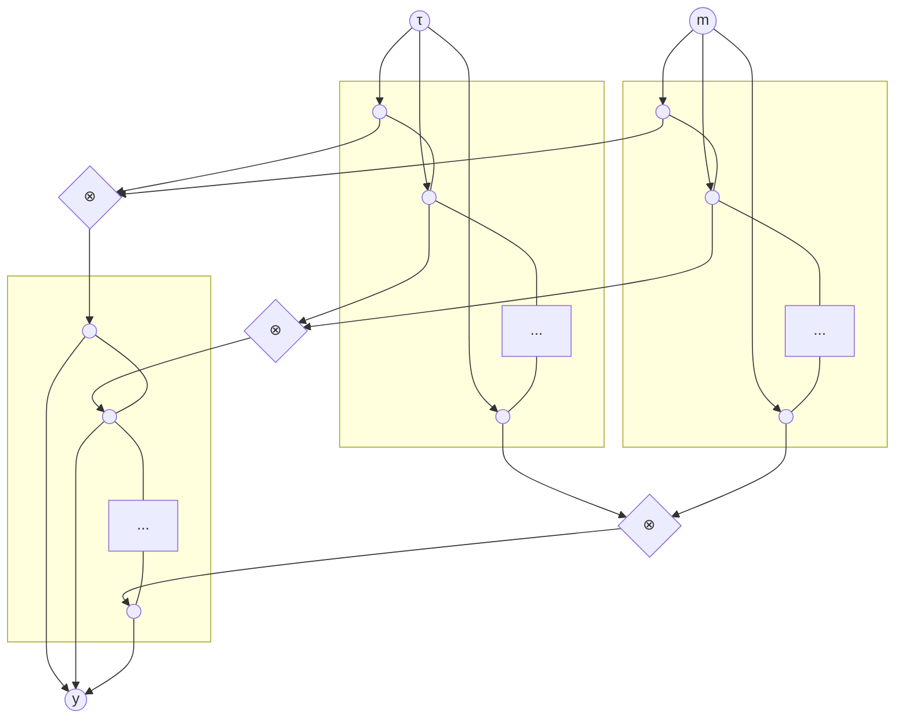
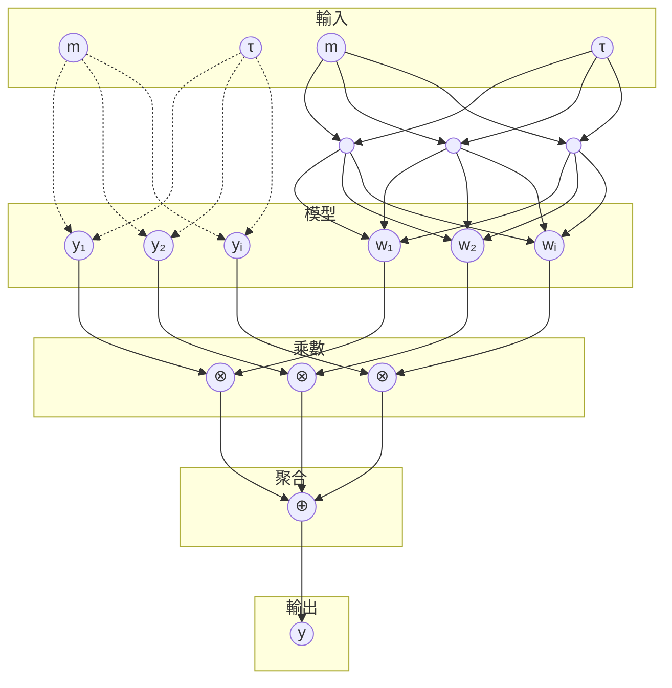

# 10505-Article Text-14033-1-2-20201228

> 原文檔案：`10505-Article_Text-14033-1-2-20201228.md`  
> 語言：繁體中文（臺灣，zh-TW）  
> 說明：由 LlamaParse Markdown 分段機器翻譯；公式、表格數字與檔名未改寫。

---

**第卅一屆人工智慧促進協會年會論文集（AAAI-17）**

# **用於選擇權定價的閘控神經網路：設計上的理性**

**楊永新†、鄭雨‡、Timothy M. Hospedales†**

倫敦大學瑪麗皇后學院電子工程與電腦科學系†、倫敦帝國學院商學院‡  
yongxin.yang@qmul.ac.uk, t.hospedales@qmul.ac.uk, y.zheng12@imperial.ac.uk

## **摘要**

我們提出一種神經網路方法來為歐式買權（EU call options）定價，該方法顯著優於現有的一些定價模型，並具備保證其預測在經濟上是合理的。為達成此目標，我們引入一類閘控神經網路（gated neural networks），能自動學習如何分割並征服問題空間，以達到穩健且精準的定價。接著，我們推導出這些網路的具體實例，使其在設計上即具「理性」（rational by design），自然地編碼出一個有效的買權價格曲面（call option surface），並強制遵守無套利原則（no arbitrage principles）。這種將人類洞見融入資料驅動學習的方式，因其編碼的歸納偏差（inductive bias），而在定價表現上提供顯著更好的泛化能力，同時保證模型預測的合理性，並產生具有經濟價值的副產品，例如風險中性密度（risk neutral density）。

## **引言**

選擇權定價模型長期以來一直是熱門的研究領域。從理論角度來看，新的選擇權定價模型為學者提供了檢視金融市場運作機制之機會。從實務觀點而言，造市者需要高效的定價模型來制定衍生性金融商品市場的買價與賣價。最早且最簡單的定價模型——**Black-Scholes**（Black and Scholes 1973）——提供了歐式選擇權價格的粗略理論估計。此後，許多研究試圖透過放寬Black-Scholes的嚴格假設，來尋找更好的選擇權定價模型。經濟學家所提出的模型通常從一系列經濟假設出發，最終得到一個確定性的公式，輸入包含某些市場訊號（例如價內程度（moneyness）、剩餘到期時間（time to maturity）以及無風險利率）。相較之下，機器學習研究則以資料驅動的方式解決選擇權定價問題：將其視為一個迴歸問題，使用與計量經濟模型相似的輸入，並以真實市場選擇權價格作為輸出。輸入與輸出之間複雜的關係（例如類似Black-Scholes的公式）是從大量資料中學習而得，而非從計量經濟公理推導而來。資料驅動選擇權定價的進展可透過提升模型表達能力，以及將選定的計量經濟公理作為歸納偏差整合進資料驅動模型來達成。本論文在這兩個方向皆有所貢獻，從而獲得極佳的選擇權定價結果。

**Translated Output:**

以機器學習技術訓練的迴歸模型，例如核機器（kernel machines）與神經網路，只要訓練資料充足，即能在樣本外（out-of-sample）情況下良好泛化。此類資料驅動方法能提供良好的選擇權價格估計（Malliaris and Salchenberger 1993），甚至超越從經濟原理推導出的公式。現有資料驅動方法的一項缺點是，它們為所有選擇權尋求單一的*唯一*解。然而，學習到的定價模型在某些選擇權上會失效，例如有些模型會高估深度價外選擇權（Bennell and Sutcliffe 2004），或低估接近到期日的選擇權（Dugas et al. 2000）。為緩解這些問題，Gradojevic、Gencay 與 Kukolj（2009）提出「分而治之」（divide-and-conquer）策略，先將選擇權分組為子類別，再為每個子類別建立不同的定價模型。然而，此分類乃依人工定義的啟發式規則（heuristics）進行，可能與市場狀況及其隨時間的變化並不一致。本論文提出一類新型神經網路用於選擇權定價，這些網路實作分而治之方法，其中選擇權分組是自動且從資料中學習而得，而非依賴人工啟發式規則。因此，它能隨著市場隨時間變化而動態調整選擇權分類，並同時精煉各類別的定價模型。在S&P 500指數選擇權上的實驗顯示，我們的方法顯著優於其他方法。

上述所有基於機器學習的方法都存在一項限制：雖然它們可能在資料擬合上表現良好（例如均方誤差），卻未強制遵守某些經濟原則，因此無法真正適用於實務定價。例如，選擇權價格存在理論上的界限，若違反這些界限，投資人即可獲得無風險利潤（即所謂套利）。這促使另一種較少被研究的改善資料驅動選擇權定價的方法：打開黑箱模型，將經濟公理作為約束條件整合到學習演算法中（Dugas et al. 2000）。從經濟觀點來看，這是設計一個神經網路以產生具有經濟意義的預測；從學習觀點來看，則是提供領域特定的歸納偏差（inductive bias），以提升泛化能力並避免過擬合。本論文推導出一類具備比現有工作更強經濟理性保證的閘控神經網路（gated neural networks）。特別是，我們的神經網路價格預測器是第一個基於學習的方法，能夠攜帶有效的風險中性密度函數（risk neutral density function），亦即在風險中性機率空間中，對未來資產價格提供一個*有效的機率分布*。

52

**輸出：**

風險中性（risk neutral）一詞大致意味著無套利（no arbitrage），但其嚴格定義已超出本文範圍，詳細請參見（Jeanblanc, Yor, and Chesney 2009）。

我們的貢獻有三點：（1）我們提出了一個在選擇權定價上具有優越表現的神經網路。（2）我們在一個大規模資料集上，將所提方法與多種基準模型進行比較；該資料集包含 5139 個交易日與 3029327 筆選擇權合約，其規模是先前研究（Dugas et al. 2000; Gradojevic, Gencay, and Kukolj 2009）的 **70 倍**。（3）我們的神經網路模型具有經濟意義（meaningful），因為它強制滿足一個經濟上有效的（無套利）買權定價模型所需的所有必要條件。這產生了一個有效的風險中性密度函數，使用者可由此萃取出許多重要指標，例如變異數、峰度與偏度，這些指標對風險管理至關重要。

## 相關文獻

### **計量經濟方法**
資產定價是財務金融與數理金融領域中非常活躍的研究方向。最古老且最著名的選擇權定價模型是 Black-Scholes 模型（Black and Scholes 1973）。該模型最大的批評在於其假設波動率為常數，導致與真實市場中常見的波動率微笑（volatility smile）現象不相容。波動率微笑的存在，是因為現實世界的報酬率分配通常具有厚尾與不對稱的特徵。隨機波動率模型（例如 Heston 1993）試圖透過允許波動率具有隨機性來刻畫上述微笑現象，並引入隨機波動率過程來進行補償（Heston 1993）。另一研究方向則建議在基礎過程加入跳躍項，以代表稀有事件，藉此緩解微笑問題。此類模型稱為 Lévy 模型（Merton 1976; Kou 2002; Madan, Carr, and Chang 1998; Barndorff-Nielsen 1997; Carr and Geman 2002），能夠產生波動率偏斜（skew）或微笑。關於資產定價模型的完整理論說明可參見（Jeanblanc, Yor, and Chesney 2009）。本文則以更資料導向的方式處理偏斜／微笑問題：直接從市場價格中學習，使模型在擬合市場價格的同時，也能反映相同的微笑結構。

實現選擇權定價模型的方法眾多，包括：傅立葉轉換法（Carr and Madan 1999）、樹狀模型（Cox, Ross, and Rubinstein 1979）、有限差分法（Schwartz 1977）以及蒙地卡羅方法（Boyle 1977）。本文採用分數傅立葉轉換（fractional FFT）方法（Cooley and Tukey 1965）作為基準選擇權定價模型的計算工具，因為這些模型的特徵函數均已知。

### **神經網路方法**
電腦科學家長期以來一直嘗試使用神經網路解決選擇權定價問題（Malliaris and Salchenberger 1993）。選擇權定價本質上可視為一個標準的迴歸任務，已有許多成熟方法，而神經網路（後來被重新命名為深度學習）是其中最受歡迎的選擇之一。

一些研究者主張，神經網路（NN）方法的一大優勢在於其不像計量經濟方法那樣需要做出許多假設。然而，神經網路並非與計量經濟方法完全正交。事實上，部分神經網路方法借用了傳統計量經濟學的洞見。例如，（Garcia and Gençay 2000）提出了一種具有類似Black-Scholes公式的神經網路選擇權定價模型。（Dugas et al. 2000）則選擇特定的激活函數並施加正權重參數限制，使其模型具備經濟學公理所要求的二階導數性質。這些研究顯示，引入計量經濟限制能產生優於普通前饋神經網路（vanilla feed-forward NNs）的選擇權定價模型。關於這一系列研究的良好綜述可見於（Garcia, Ghysels, and Renault 2010）。

雖然部分神經網路方法已從計量經濟洞見中受益，但這些方法始終試圖為市場上所有選擇權找到一個通用定價模型。然而，研究顯示，對於深度價外選擇權或到期期限較長的選擇權，神經網路方法的表現非常差（Ben-nell and Sutcliffe 2004）。這並不令人意外，因為神經網路方法通常會產生一個平滑的定價曲面，無法捕捉市場中這些棘手且交易量低的區塊。（Gradojevic, Gencay, and Kukolj 2009）試圖透過根據價內程度（moneyness）與剩餘到期時間將選擇權分類，並為每一類選擇權訓練獨立的神經網路來解決此問題。他們對選擇權的分組是基於固定的手動啟發式法則，這種做法並非最佳，且無法隨著時間適應不斷變化的市場資料。我們的方法是一種神經網路，它利用了類似的分而治之（divide-and-conquer）理念，但能同時學習將選擇權分組以及為各組定價這兩個相互關聯的問題。提供這種更高的模型表達能力，挑戰了我們先前將計量經濟公理嵌入模型以確保有意義預測的目標，因為在這個更複雜的模型中，理性限制（rationality constraints）更難以執行。因此，我們投入大量努力，同時貢獻了一個更具表達力的神經學習器，以及比現有文獻更強的理性限制保證。

## 方法論

### **背景**

我們專注於歐式買權（EU call options）。買權是一種合約，賦予買方在特定未來日期（稱為到期日）以約定價格（稱為履約價）購買標的資產（例如股票）的權利，但不負有義務。例如，在時間 $t = 0$（今日），某公司股票價值 $100$，一位交易者支付一定金額（選擇權成本）購買履約價 $110$、到期日 $T = 5$（五天後）的買權。五天後，若該公司股價為 $120$，他可以行使選擇權，以 $110$ 的履約價取得股票。若他立即以 $120$ 賣出股票，則獲利 $10$（忽略選擇權成本）。若公司股價低於 $110$，交易者將不會行使選擇權，而僅損失購買選擇權合約所支付的金額。選擇權定價問題即是：在時間 $t = 0$ 時，此選擇權的價格應該是多少？

我們將市場上的真實選擇權價格記為 $c$，而選擇權定價模型的估計值記為 $\hat{c}$。履約價（上述範例中的 $110$）以 $K$ 表示，剩餘到期時間以 $\tau$ 表示（$\tau = T - t$）。時間 $t$ 的標的資產價格為 $S_t$，時間 $T$ 的標的資產價格為 $S_T$（上述範例中的 $120$，但在 $t = 0$ 時此值未知）。

For a call option pricing model $\hat{c}(\cdot)$ with three inputs $K$, $S_t$, and $\tau$，在無套利假設下，我們有，

53

$$\hat{c}(K, S_t, \tau) = e^{-r\tau} \int_{0}^{\infty} \max(0, S_T - K) f(S_T | S_t, \tau) dS_T.$$

此處 $r$ 為無風險利率常數，而 $e^{-r\tau}$ 作為折現因子。$f(x | S_t, \tau)$ 是資產價格在到期日 $T$（即 $S_T$）的條件風險中性機率密度函數（conditional risk neutral probability density function），已知其在時間 $t$ 的價格（即 $S_t$）以及時間差（即 $\tau = T - t$）。此式可直觀解釋如下：$\max(0, S_T - K)$ 為持有此選擇權在時間 $T$ 時的潛在收益，而 $f(S_T | S_t, \tau)$ 則是該收益的機率密度，因此積分項實際上就是在風險中性機率空間下，給定目前狀態（$S_t$ 與 $\tau$）的到期日 $T$ 之期望收益。由於無套利假設，未來此期望收益必須以無風險利率折現，才能得到時間 $t$ 的選擇權價格。（為簡化起見，此處未考慮股利）。

由於無風險利率與折現項可獨立取得，因此選擇權定價模型實際上所建模的是該積分項，我們將其記為 $\tilde{c}$，

$$\tilde{c}(K, S_t, \tau) = \int_{0}^{\infty} \max(0, S_T - K) f(S_T | S_t, \tau) dS_T.$$

$\tilde{c}$ 可透過資料以迴歸問題的方式學習，但除非 $f(\cdot)$ 是一個有效的機率密度函數，否則這並不必然能產生一個*有意義*的預測模型。

## 理性預測的要件

接下來我們列出六個條件（Föllmer and Schied 2004）C1–C6，這些是一個*有意義*的選擇權定價模型應當滿足的條件。

$$\frac{\partial \tilde{c}}{\partial K} \leq 0 \tag{C1}$$

$\frac{\partial \tilde{c}}{\partial K} = \int_{0}^{K} f(S_T | S_t, \tau) dS_T - 1$，而 $\int_{0}^{K} f(S_T | S_t, \tau) dS_T$ 是一個累積分布函數 $\mathbb{P}(S_T \leq K)$，因此其值不可能大於一。

$$\frac{\partial^2 \tilde{c}}{\partial K^2} \geq 0 \tag{C2}$$

$\frac{\partial^2 \tilde{c}}{\partial K^2} = f(S_T | S_t, \tau)$ 是一個機率密度函數，因此其值不可能小於零。

$$\frac{\partial \tilde{c}}{\partial \tau} \geq 0 \tag{C3}$$

這是直觀的：等待時間越長（$\tau$ 越大），標的資產價格最終高於履約價的機會就越高，因此選擇權價格應隨到期時間非遞減。

$$\lim_{K \to \infty} \tilde{c}(K, S_t, \tau) = \tilde{c}(\infty, S_t, \tau) = 0 \tag{C4}$$

若履約價趨近於無窮大，選擇權價格應為零，因為標的資產價格永遠小於履約價，此時交易該選擇權毫無意義。

$$\tilde{c}(K, S_t, 0) = \max(0, S_t - K) \quad \text{when} \quad \tau = 0 \tag{C5}$$

當 $\tau = 0$ 時，選擇權可立即執行，因此其價格應恰好等於 $\max(0, S_t - K)$，此時 $S_t = S_T$。

$$\max(0, S_t - K) \leq \tilde{c}(K, S_t, \tau) \leq S_t \tag{C6}$$

**Output:**

此邊界可輕易由賣權－買權平價（put-call parity）與買權的 payoff 推導而得。買權價格不得超過標的資產價格，否則投資人可同時買入股票並賣出選擇權，待選擇權到期時平倉即可實現套利。請注意，上界意味著當 $K = 0$ 時，我們應有 $\tilde{c}(0, S_t, \tau) = \int_{0}^{\infty} S_T f(S_T | S_t, \tau) dS_T = e^{r\tau} S_t$（同時，$\hat{c}(0, S_t, \tau) = S_t$）。部分研究（Roper 2010）偏好使用積分公式而非上界，但兩者實際上是相同的。至於下界，買權價格必須大於 $\max(0, S_t - K)$，因為選擇權具有時間價值。

**假設** 上述推導中我們已做出以下假設：(i) $\tilde{c}$ 對 $K$ 的一階與二階導數存在；(ii) $\tilde{c}$ 對 $\tau$ 的一階導數存在。在介紹我們提出的選擇權定價模型之前，我們再加上最後一項假設：定價模型對 $S_t$ 具可重縮放性（rescalable）：

$$\tilde{c}\left(\frac{K}{S_t}, 1, \tau\right) := \frac{\tilde{c}(K, S_t, \tau)}{S_t} \tag{1}$$

其中分數項 $\frac{K}{S_t}$ 通常稱為（反向）價內程度（inverse moneyness），並記為 $m = \frac{K}{S_t}$。

## 單一模型

我們選擇權定價模型的核心函數 $y(m, \tau)$ 定義為

$$y(m, \tau) \equiv \tilde{c}(m, 1, \tau) := \frac{\tilde{c}(K, S_t, \tau)}{S_t}. \tag{2}$$

它接受兩個輸入：價內程度 $m$ 與剩餘到期時間 $\tau$。目標是最小化市場上真實選擇權價格 $c$ 與模型所估計的 $\hat{c}$ 之間的差異，其中 $\hat{c} = e^{-r\tau} \tilde{c} = e^{-r\tau} S_t y$。

我們的定價函數 $y(m, \tau)$ 由一個神經網路建模，如圖 1 所示，其數學表示式為

$$y(m, \tau) = \sum_{j=1}^{J} \sigma_1(\tilde{b}_j - m e^{\tilde{w}_j}) \sigma_2(\bar{b}_j + \tau e^{\bar{w}_j}) e^{\hat{w}_j}. \tag{3}$$

其中 $\sigma_1(x) = \log(1 + e^x)$（softplus 函數），$\sigma_2(x) = \frac{1}{1+e^{-x}}$（sigmoid 函數）。$J$ 為隱藏層的神經元數量。需學習的參數包括權重（$\tilde{w}$、$\bar{w}$、$\hat{w}$）與偏差（$\tilde{b}$、$\bar{b}$）。可以看出這是一個具閘控機制的神經網路（gated neural network）（Sigaud et al. 2015），分為左右兩側：左側接收 $m$ 並產生 $j = 1 \dots J$ 個神經元 $\sigma_1(\tilde{b}_j - m e^{\tilde{w}_j})$；右側接收 $\tau$ 並產生 $j = 1 \dots J$ 個神經元 $\sigma_2(\bar{b}_j + \tau e^{\bar{w}_j})$。接著將兩側具有相同索引的神經元以乘法閘（multiplication gate）合併。最後由 $J$ 個倒數第二層神經元透過權重 $\hat{w}$ 產生最終預測值 $y$。

### 驗證合理性

我們現在說明式 (3) 的網路如何滿足先前提出的合理性條件。Softplus 的導數為 sigmoid 函數：$\sigma_1'(x) = \sigma_2(x)$，而 sigmoid 的導數為 $\sigma_2'(x) = \sigma_2(x)(1 - \sigma_2(x))$。因此可知 $\sigma_1(x)$、$\sigma_2(x)$、$\sigma_1'(x)$ 以及 $\sigma_2'(x) = \sigma_1''(x)$ 皆產生正值。另請注意，權重已被限制正負號：左分支權重因 $-e^{\tilde{w}}$ 而為負值，右分支與最上層權重則因 $e^{\bar{w}}$ 與 $e^{\hat{w}}$ 而為正值。

圖 1：提出的模型（單一輸出）。注意雖然為了版面整潔而省略了偏差項（bias terms），但偏差項實際存在。$\otimes$ 是乘法閘門，會輸出輸入值的乘積。

我們可以驗證式 3 滿足條件 C1–C3，因為

$$
\frac{\partial y}{\partial m} = \sum_{j=1}^{J} -e^{\bar{w}_j} \sigma_2 (\tilde{b}_j - m e^{\tilde{w}_j}) \sigma_2 (\bar{b}_j + \tau e^{\bar{w}_j}) e^{\hat{w}_j} \leq 0
$$
$$
\frac{\partial^2 y}{\partial m^2} = \sum_{j=1}^{J} e^{2\tilde{w}_j} \sigma'_2 (\tilde{b}_j - m e^{\tilde{w}_j}) \sigma_2 (\bar{b}_j + \tau e^{\bar{w}_j}) e^{\hat{w}_j} \geq 0
$$
$$
\frac{\partial y}{\partial \tau} = \sum_{j=1}^{J} e^{\bar{w}_j} \sigma_1 (\tilde{b}_j - m e^{\tilde{w}_j}) \sigma'_2 (\bar{b}_j + \tau e^{\bar{w}_j}) e^{\hat{w}_j} \geq 0
$$

而條件 C1、C2 與 C3 可改寫為

$$
\frac{\partial \tilde{c}}{\partial K} = \frac{\partial S_t y}{\partial K} = S_t \frac{\partial y}{\partial m} \frac{\partial m}{\partial K} = S_t \frac{\partial y}{\partial m} \frac{1}{S_t} = \frac{\partial y}{\partial m} \leq 0
$$
$$
\frac{\partial^2 \tilde{c}}{\partial K^2} = \frac{\partial^2 y}{\partial m \partial K} = \frac{\partial^2 y}{\partial m^2} \frac{\partial m}{\partial K} = \frac{1}{S_t} \frac{\partial^2 y}{\partial m^2} \geq 0
$$
$$
\frac{\partial \tilde{c}}{\partial \tau} = \frac{\partial S_t y}{\partial \tau} = S_t \frac{\partial y}{\partial \tau} \geq 0
$$

條件 C4 可輕易驗證：當 $K \to \infty$ 時 $m \to \infty$，且當 $m \to \infty$ 時 $\sigma_1 (\tilde{b}_j - m e^{\tilde{w}_j}) = 0$。因此 $y = 0$，進而 $\tilde{c} = S_t y = 0$。這也解釋了為何最上層沒有偏差項。

條件 C5 與 C6 則難以透過網路架構設計（例如權重限制或激活函數選擇）達成。因此我們透過在訓練時合成虛擬選擇權合約來滿足它們——這些合約並不存在於真實市場中，其真實價格 $c$ 等於理論估計價格 $\hat{c}$。詳細而言，為滿足條件 C5，我們產生多筆虛擬資料點：對每個獨特的 $S_t$，固定 $\tau = 0$ 並在 $[0, S_t]$ 區間內均勻抽樣 $K$，此時選擇權價格應恰好等於 $S_t - K$。虛擬選擇權的範例可見表 1。

條件 C6 則較為棘手。關於上限，我們再次合成虛擬訓練選擇權：對每個獨特的 $\tau$，建立一個 $K = 0$ 的選擇權，此即最昂貴的選擇權。實證上，下限被違反的可能性極低，因為 (i) 當 $K \geq S_t$ 時下限為 0——這已由神經網路設計達成；(ii) 當

<table>
  <caption>表 1：條件 C5 的虛擬選擇權</caption>
  <thead>
    <tr>
      <th>τ</th>
      <th>e−rτ</th>
      <th>St</th>
      <th>K</th>
      <th>ĉ and c</th>
      <th>c̃</th>
      <th>y (expected)</th>
    </tr>
  </thead>
  <tbody>
    <tr>
      <td>0</td>
      <td>1</td>
      <td>1000</td>
      <td>10</td>
      <td>990</td>
      <td>990</td>
      <td>0.9900</td>
    </tr>
    <tr>
      <td>0</td>
      <td>1</td>
      <td>1000</td>
      <td>20</td>
      <td>980</td>
      <td>980</td>
      <td>0.9800</td>
    </tr>
    <tr>
      <td>0</td>
      <td>1</td>
      <td>1000</td>
      <td>990</td>
      <td>10</td>
      <td>10</td>
      <td>0.0100</td>
    </tr>
    <tr>
      <td>..</td>
      <td>..</td>
      <td>..</td>
      <td>..</td>
      <td>..</td>
      <td>..</td>
      <td>..</td>
    </tr>
    <tr>
      <td>0</td>
      <td>1</td>
      <td>1100</td>
      <td>10</td>
      <td>1090</td>
      <td>1090</td>
      <td>0.9909</td>
    </tr>
    <tr>
      <td>0</td>
      <td>1</td>
      <td>1100</td>
      <td>20</td>
      <td>1080</td>
      <td>1080</td>
      <td>0.9818</td>
    </tr>
    <tr>
      <td>0</td>
      <td>1</td>
      <td>1100</td>
      <td>1090</td>
      <td>10</td>
      <td>10</td>
      <td>0.0091</td>
    </tr>
    <tr>
      <td>..</td>
      <td>..</td>
      <td>..</td>
      <td>..</td>
      <td>..</td>
      <td>..</td>
      <td>..</td>
    </tr>
  </tbody>
</table>

<table>
    <caption>表 2：條件 C6 的虛擬選擇權</caption>
    <thead>
        <tr>
            <th>$\tau$</th>
            <th>$e^{-r\tau}$</th>
            <th>$S_t$</th>
            <th>$K$</th>
            <th>$\hat{c}$ and $c$</th>
            <th>$\tilde{c}$</th>
            <th>$y$ (expected)</th>
        </tr>
    </thead>
    <tbody>
        <tr>
            <td>7</td>
            <td>0.98</td>
            <td>1000</td>
            <td>0</td>
            <td>1000</td>
            <td>1020</td>
            <td>1.0200</td>
        </tr>
        <tr>
            <td>14</td>
            <td>0.95</td>
            <td>1100</td>
            <td>0</td>
            <td>1100</td>
            <td>1158</td>
            <td>1.0526</td>
        </tr>
        <tr>
            <td>..</td>
            <td>..</td>
            <td>..</td>
            <td>..</td>
            <td>..</td>
            <td>..</td>
            <td>..</td>
        </tr>
    </tbody>
</table>

由於 $K < S_t$，條件 C5 的虛擬資料與市場資料幾乎不可能被錯誤定價，因為我們將價外賣權轉換為價內買權（細節請見實驗部分第一段），因此類神經網路模型從資料中學習到此下限。虛擬選擇權的範例說明可見表 2。

## 多模型

先前的網路為所有選擇權提供單一理性預測模型。我們的完整模型則聯合訓練多個定價模型，以及一個權重模型來柔性地切換這些模型。如圖 2 所示，完整模型的左側有 $i = 1 \dots I$ 個單一定價模型：

$$
y_i(m, \tau) = \sum_{j=1}^{J} \sigma_1 (\tilde{b}_j^{(i)} - m e^{\tilde{w}_j^{(i)}}) \sigma_2 (\bar{b}_j^{(i)} + \tau e^{\bar{w}_j^{(i)}}) e^{\hat{w}_j^{(i)}} \quad (4)
$$

其右分支為一個具有單一 $K$ 個單元隱藏層的網路，而最上層則使用 $I$-way softmax 激活函數，為左分支提供模型選擇器。

$$
w_i(m, \tau) = \frac{e^{\sum_{k=1}^{K} \sigma_2 (m \dot{W}_{1,k} + \tau \dot{W}_{2,k} + \dot{b}_k) \ddot{W}_{k,i} + \ddot{b}_i}}{\sum_{i=1}^{I} e^{\sum_{k=1}^{K} \sigma_2 (m \dot{W}_{1,k} + \tau \dot{W}_{2,k} + \dot{b}_k) \ddot{W}_{k,i} + \ddot{b}_i}} \quad (5)
$$

最後，整體輸出 $y$ 是 $I$ 個局部選擇權定價模型輸出的 softmax 加權平均。由於 softmax 激活函數，所有權重（$w_i$）的總和為一。

$$
y(m, \tau) = \sum_{i=1}^{I} y_i(m, \tau) w_i(m, \tau). \quad (6)
$$

可以將此多模型視為專家混合集成（mixture of expert ensemble，Jacobs et al. 1991），或多任務學習模型（multi-task learning model，Yang and Hospedales 2015）。單一模型與多模型方法的參數整理於表 3。

**驗證合理性** 可以驗證上述多網路仍滿足條件 C1、C3 與 C4。條件 C5、C6 則再次透過餵入虛擬資料（feed virtual data）來進行軟性強制。尚未解決的問題是，多模型

**圖 2：提出的模型（multi）：右側為權重生成模型，左側為一組單一模型。注意左側並非單層。每一個 $(m, \tau) \rightarrow y_i$（由兩條虛線箭頭連結）都是由一個完整大小的單一模型實現。$\oplus$ 是加法閘，輸出所有輸入的總和。**

<table>
  <thead>
    <tr>
      <th>符號</th>
      <th>形狀</th>
      <th>註解</th>
      <th>單一模型中的數量</th>
      <th>多模型中的數量</th>
    </tr>
  </thead>
  <tbody>
    <tr>
      <td>$\tilde{w}$</td>
      <td>$1 \times J$</td>
      <td>價內程度的權重</td>
      <td>1</td>
      <td>$I$</td>
    </tr>
    <tr>
      <td>$\tilde{b}$</td>
      <td>$J$</td>
      <td>價內程度的偏差項</td>
      <td>1</td>
      <td>$I$</td>
    </tr>
    <tr>
      <td>$\bar{w}$</td>
      <td>$1 \times J$</td>
      <td>剩餘期限的權重</td>
      <td>1</td>
      <td>$I$</td>
    </tr>
    <tr>
      <td>$\bar{b}$</td>
      <td>$J$</td>
      <td>剩餘期限的偏差項</td>
      <td>1</td>
      <td>$I$</td>
    </tr>
    <tr>
      <td>$\hat{w}$</td>
      <td>$J \times 1$</td>
      <td>最終定價的權重</td>
      <td>1</td>
      <td>$I$</td>
    </tr>
    <tr>
      <td>$\dot{W}$</td>
      <td>$2 \times K$</td>
      <td>輸入至隱藏層的權重</td>
      <td>0</td>
      <td>1</td>
    </tr>
    <tr>
      <td>$\dot{b}$</td>
      <td>$K$</td>
      <td>隱藏層的偏差項</td>
      <td>0</td>
      <td>1</td>
    </tr>
    <tr>
      <td>$\ddot{W}$</td>
      <td>$K \times I$</td>
      <td>隱藏層至輸出的權重</td>
      <td>0</td>
      <td>1</td>
    </tr>
    <tr>
      <td>$\ddot{b}$</td>
      <td>$I$</td>
      <td>輸出的偏差項</td>
      <td>0</td>
      <td>1</td>
    </tr>
  </tbody>
</table>
表 3：符號與參數摘要。上方：單一定價模型。下方的多模型中的加權網路（右分支）。

違反了條件 C2。為緩解此問題，我們使用「從提示學習」（learning from hints）技巧（Abu-Mostafa 1993）。

將 $y(m, \tau)$ 對 $m$ 的一階導數表示為 $g(m, \tau) = \frac{\partial y}{\partial m}$，我們引入一個新的損失函數，

$$ \sum_{p=1}^{P} \sum_{q=1}^{Q} \max(0, g(m_{p,q}, \tau_q) - g(m_{p,q} + \Delta, \tau_q)) \quad (7) $$

**輸出：**

其中 $\Delta$ 為一小數，例如 $\Delta = 0.001$。$Q$ 為訓練集中獨特的剩餘到期時間（time-to-maturity）個數，$P$ 則是每個獨特剩餘到期時間所產生的偽資料數量。式 7 會將 $g(m, \tau)$ 推向關於 $m$ 的單調遞增函數，因此 $\frac{\partial g}{\partial m}$（等價於 $\frac{\partial^2 y}{\partial m^2}$）傾向大於零。回想 $\frac{\partial^2 \tilde{c}}{\partial K^2} = \frac{1}{S_t} \frac{\partial^2 y}{\partial m^2}$，故式 7 解決了第二導數為負的問題。與條件 C5、C6 所使用的虛擬選擇權不同，我們不考慮這些資料點因價格差異所造成的損失，亦即這些資料僅用來確保第二導數性質，並不會實際對其進行定價。總結來說，此多模型現在已能通過所有理性檢驗。

**損失函數與最佳化** 選擇權定價對損失函數的選擇相當敏感（Christoffersen and Jacobs 2004）。我們結合兩種目標函數：均方誤差（Mean Square Error, MSE）與平均絕對百分比誤差（Mean Absolute Percentage Error, MAPE）。對多模型而言，我們額外加入式 7 的損失項。訓練神經網路時，我們使用 Adam 最佳化器（Kingma and Ba 2015）。

## 實驗

**資料與前處理** S&P500 指數的選擇權資料來自 OptionMetrics 與 Bloomberg，提供歷史每日收盤買賣報價。樣本期間為 1996 年 4 月 1 日至 2016 年 5 月 31 日。對應的無風險利率與指數股息收益率亦由 OptionMetrics 與 Bloomberg 提供。無風險利率透過三次樣條（cubic spline）插值，以匹配選擇權到期期限。在模型校準前，需先進行若干資料篩選。我們以買賣價中點作為收盤價的代理值。由於價內選擇權交易極不活躍，其價格可靠性較低，因此予以捨棄。此外，我們希望盡可能保留更多合約，僅移除剩餘到期時間小於 2 天的合約。經過上述處理後，剩餘 3,029,327 筆選擇權報價。由於本模型專注於選擇權買權（call options）的定價，我們透過買賣權平價（put-call parity）將賣權價格轉換為買權價格，而非直接捨棄所有賣權報價——此做法會產生許多價內買權作為補充，因為我們已捨棄原有的價內買權報價。剩餘到期時間以年為單位進行正規化，例如當 $\tau = 7$（七天）時，實際輸入值為 $\frac{7}{365} = 0.019178$。

### 實驗 I：量化比較

我們將實驗設計如下：我們使用五個連續交易日的資料訓練模型，並使用接下來的一天進行測試。我們將我們的模型標記為 **Single** 與 **Multi**，並與五種基準方法進行比較：**PSSF**（Dugas et al. 2000）、模組化神經網路（**MNN**）（Gradojevic, Gencay, and Kukolj 2009）、Black–Scholes（**BS**）（Black and Scholes 1973）、Variance Gamma（**VG**）（Madan, Carr, and Chang 1998），以及 **Kou Jump**（Kou 2002）。對於三種計量經濟方法1，即 BS、VG 與 Kou Jump，我們僅使用最後一個訓練日的資料來校準其參數（原因見討論部分）。Single 與 PSSF 的隱藏層神經元數為 $J = 5$。Multi 的定價模型數為 $I = 9$，此設定與 MNN 相同。Multi 右分支權重網路的隱藏層神經元數為 $K = 5$。我們報告 $(c, e^{-r\tau} S_t y)$ 的 MSE 與 MAPE 以進行有意義的比較，雖然出於數值穩定性考量，我們訓練模型（等價地）最小化 $(e^{r\tau} \frac{c}{S_t}, y)$ 的差異。

表 4 與圖 3 均顯示我們的 Multi 模型在效能與穩定性兩方面皆具有優越性。我們注意到，所有方法在圖 3 中於少數時間點同時出現效能下降，這些時間點對應於網路泡沫（1998 年）、全球金融危機（2008 年）以及歐洲債務危機（2011 年）。

### 實驗 II：貢獻度分析

在本節中，我們說明並驗證我們的虛擬選擇權策略，以滿足條件 C5 與 C6，以及第二

56

<table>
  <caption>圖 3：分季測試 MAPE — 序列：PSSF、MNN、Single、Multi、BS、VG、Kou Jump；單位：Test MAPE</caption>
  <thead>
    <tr>
      <th>季別</th>
      <th>PSSF</th>
      <th>MNN</th>
      <th>Single</th>
      <th>Multi</th>
      <th>BS</th>
      <th>VG</th>
      <th>Kou Jump</th>
    </tr>
  </thead>
  <tbody>
    <tr><th>1995Q4</th><td>0.15</td><td>0.20</td><td>0.24</td><td>0.06</td><td>0.07</td><td>0.07</td><td>0.05</td></tr>
    <tr><th>1996Q1</th><td>0.16</td><td>0.18</td><td>0.22</td><td>0.05</td><td>0.06</td><td>0.08</td><td>0.05</td></tr>
    <tr><th>1996Q2</th><td>0.18</td><td>0.18</td><td>0.28</td><td>0.06</td><td>0.04</td><td>0.09</td><td>0.06</td></tr>
    <tr><th>1996Q3</th><td>0.15</td><td>0.16</td><td>0.23</td><td>0.05</td><td>0.04</td><td>0.06</td><td>0.04</td></tr>
    <tr><th>1996Q4</th><td>0.17</td><td>0.15</td><td>0.28</td><td>0.05</td><td>0.04</td><td>0.08</td><td>0.05</td></tr>
    <tr><th>1997Q1</th><td>0.19</td><td>0.17</td><td>0.33</td><td>0.04</td><td>0.05</td><td>0.09</td><td>0.05</td></tr>
    <tr><th>1997Q2</th><td>0.12</td><td>0.10</td><td>0.23</td><td>0.04</td><td>0.03</td><td>0.04</td><td>0.03</td></tr>
    <tr><th>1997Q3</th><td>0.17</td><td>0.13</td><td>0.27</td><td>0.05</td><td>0.04</td><td>0.06</td><td>0.05</td></tr>
    <tr><th>1997Q4</th><td>0.21</td><td>0.14</td><td>0.31</td><td>0.06</td><td>0.06</td><td>0.11</td><td>0.05</td></tr>
    <tr><th>1998Q1</th><td>0.33</td><td>0.14</td><td>0.36</td><td>0.06</td><td>0.12</td><td>0.13</td><td>0.06</td></tr>
    <tr><th>1998Q2</th><td>0.31</td><td>0.18</td><td>0.36</td><td>0.06</td><td>0.15</td><td>0.28</td><td>0.09</td></tr>
    <tr><th>1998Q3</th><td>0.43</td><td>0.19</td><td>0.44</td><td>0.09</td><td>0.44</td><td>0.44</td><td>0.12</td></tr>
    <tr><th>1998Q4</th><td>0.31</td><td>0.14</td><td>0.38</td><td>0.06</td><td>0.21</td><td>0.21</td><td>0.08</td></tr>
    <tr><th>1999Q1</th><td>0.25</td><td>0.13</td><td>0.35</td><td>0.05</td><td>0.13</td><td>0.09</td><td>0.06</td></tr>
    <tr><th>1999Q2</th><td>0.29</td><td>0.15</td><td>0.42</td><td>0.07</td><td>0.21</td><td>0.18</td><td>0.08</td></tr>
    <tr><th>1999Q3</th><td>0.38</td><td>0.18</td><td>0.44</td><td>0.07</td><td>0.30</td><td>0.26</td><td>0.11</td></tr>
    <tr><th>1999Q4</th><td>0.44</td><td>0.22</td><td>0.44</td><td>0.07</td><td>0.28</td><td>0.29</td><td>0.11</td></tr>
    <tr><th>2000Q1</th><td>0.40</td><td>0.19</td><td>0.40</td><td>0.07</td><td>0.20</td><td>0.15</td><td>0.08</td></tr>
    <tr><th>2000Q2</th><td>0.41</td><td>0.22</td><td>0.50</td><td>0.09</td><td>0.15</td><td>0.23</td><td>0.11</td></tr>
    <tr><th>2000Q3</th><td>0.32</td><td>0.23</td><td>0.43</td><td>0.08</td><td>0.25</td><td>0.29</td><td>0.09</td></tr>
    <tr><th>2000Q4</th><td>0.30</td><td>0.25</td><td>0.37</td><td>0.07</td><td>0.27</td><td>0.26</td><td>0.08</td></tr>
    <tr><th>2001Q1</th><td>0.32</td><td>0.22</td><td>0.34</td><td>0.07</td><td>0.24</td><td>0.28</td><td>0.09</td></tr>
    <tr><th>2001Q2</th><td>0.28</td><td>0.25</td><td>0.37</td><td>0.08</td><td>0.25</td><td>0.25</td><td>0.08</td></tr>
    <tr><th>2001Q3</th><td>0.33</td><td>0.19</td><td>0.30</td><td>0.06</td><td>0.22</td><td>0.29</td><td>0.10</td></tr>
    <tr><th>2001Q4</th><td>0.26</td><td>0.22</td><td>0.37</td><td>0.07</td><td>0.22</td><td>0.25</td><td>0.09</td></tr>
    <tr><th>2002Q1</th><td>0.24</td><td>0.21</td><td>0.35</td><td>0.06</td><td>0.21</td><td>0.23</td><td>0.08</td></tr>
    <tr><th>2002Q2</th><td>0.27</td><td>0.21</td><td>0.
</table>

<table>
    <tr><th>Q3-02</th><td>0.26</td><td>0.18</td><td>0.34</td><td>0.07</td><td>0.28</td><td>0.30</td><td>0.12</td></tr>
    <tr><th>Q4-02</th><td>0.27</td><td>0.18</td><td>0.35</td><td>0.06</td><td>0.25</td><td>0.23</td><td>0.11</td></tr>
    <tr><th>Q1-03</th><td>0.22</td><td>0.19</td><td>0.32</td><td>0.05</td><td>0.21</td><td>0.18</td><td>0.12</td></tr>
    <tr><th>Q2-03</th><td>0.20</td><td>0.20</td><td>0.31</td><td>0.06</td><td>0.17</td><td>0.18</td><td>0.05</td></tr>
    <tr><th>Q3-03</th><td>0.21</td><td>0.20</td><td>0.30</td><td>0.05</td><td>0.18</td><td>0.17</td><td>0.06</td></tr>
    <tr><th>Q4-03</th><td>0.19</td><td>0.20</td><td>0.29</td><td>0.05</td><td>0.14</td><td>0.14</td><td>0.08</td></tr>
    <tr><th>Q1-04</th><td>0.25</td><td>0.20</td><td>0.36</td><td>0.06</td><td>0.21</td><td>0.21</td><td>0.08</td></tr>
    <tr><th>Q2-04</th><td>0.27</td><td>0.21</td><td>0.34</td><td>0.06</td><td>0.21</td><td>0.22</td><td>0.09</td></tr>
    <tr><th>Q3-04</th><td>0.21</td><td>0.22</td><td>0.31</td><td>0.06</td><td>0.17</td><td>0.17</td><td>0.06</td></tr>
    <tr><th>Q4-04</th><td>0.26</td><td>0.23</td><td>0.30</td><td>0.07</td><td>0.14</td><td>0.15</td><td>0.07</td></tr>
    <tr><th>Q1-05</th><td>0.28</td><td>0.22</td><td>0.35</td><td>0.07</td><td>0.16</td><td>0.16</td><td>0.08</td></tr>
    <tr><th>Q2-05</th><td>0.29</td><td>0.23</td><td>0.38</td><td>0.07</td><td>0.19</td><td>0.19</td><td>0.10</td></tr>
    <tr><th>Q3-05</th><td>0.30</td><td>0.23</td><td>0.35</td><td>0.08</td><td>0.16</td><td>0.13</td><td>0.08</td></tr>
    <tr><th>Q4-05</th><td>0.27</td><td>0.23</td><td>0.36</td><td>0.08</td><td>0.12</td><td>0.24</td><td>0.08</td></tr>
    <tr><th>Q1-06</th><td>0.39</td><td>0.22</td><td>0.38</td><td>0.07</td><td>0.23</td><td>0.24</td><td>0.12</td></tr>
    <tr><th>Q2-06</th><td>0.29</td><td>0.21</td><td>0.34</td><td>0.08</td><td>0.15</td><td>0.12</td><td>0.09</td></tr>
    <tr><th>Q3-06</th><td>0.32</td><td>0.20</td><td>0.33</td><td>0.07</td><td>0.14</td><td>0.11</td><td>0.08</td></tr>
    <tr><th>Q4-06</th><td>0.32</td><td>0.18</td><td>0.36</td><td>0.08</td><td>0.17</td><td>0.15</td><td>0.10</td></tr>
    <tr><th>Q1-07</th><td>0.29</td><td>0.16</td><td>0.39</td><td>0.07</td><td>0.21</td><td>0.21</td><td>0.11</td></tr>
    <tr><th>Q2-07</th><td>0.28</td><td>0.15</td><td>0.50</td><td>0.07</td><td>0.35</td><td>0.34</td><td>0.16</td></tr>
    <tr><th>Q3-07</th><td>0.33</td><td>0.19</td><td>0.42</td><td>0.07</td><td>0.37</td><td>0.35</td><td>0.17</td></tr>
    <tr><th>Q4-07</th><td>0.32</td><td>0.18</td><td>0.44</td><td>0.07</td><td>0.37</td><td>0.37</td><td>0.15</td></tr>
    <tr><th>Q1-08</th><td>0.29</td><td>0.19</td><td>0.43</td><td>0.07</td><td>0.38</td><td>0.49</td><td>0.16</td></tr>
    <tr><th>Q2-08</th><td>0.33</td><td>0.10</td><td>0.36</td><td>0.18</td><td>0.41</td><td>0.34</td><td>0.19</td></tr>
    <tr><th>Q3-08</th><td>0.26</td><td>0.13</td><td>0.34</td><td>0.08</td><td>0.33</td><td>0.28</td><td>0.12</td></tr>
    <tr><th>Q4-08</th><td>0.25</td><td>0.13</td><td>0.34</td><td>0.05</td><td>0.28</td><td>0.28</td><td>0.11</td></tr>
    <tr><th>Q1-09</th><td>0.25</td><td>0.12</td><td>0.36</td><td>0.06</td><td>0.27</td><td>0.27</td><td>0.13</td></tr>
    <tr><th>Q2-09</th><td>0.26</td><td>0.14</td><td>0.34</td><td>0.06</td><td>0.25</td><td>0.26</td><td>0.13</td></tr>
    <tr><th>Q3-09</th><td>0.30</td><td>0.12</td><td>0.35</td><td>0.07</td><td>0.28</td><td>0.43</td><td>0.13</td></tr>
</table>

<table>
  <tbody>
    <tr><th>Q4-09</th><td>0.27</td><td>0.13</td><td>0.35</td><td>0.06</td><td>0.27</td><td>0.35</td><td>0.12</td></tr>
    <tr><th>Q1-10</th><td>0.27</td><td>0.14</td><td>0.36</td><td>0.06</td><td>0.26</td><td>0.27</td><td>0.11</td></tr>
    <tr><th>Q2-10</th><td>0.26</td><td>0.17</td><td>0.34</td><td>0.06</td><td>0.33</td><td>0.33</td><td>0.09</td></tr>
    <tr><th>Q3-10</th><td>0.30</td><td>0.18</td><td>0.36</td><td>0.09</td><td>0.37</td><td>0.37</td><td>0.13</td></tr>
    <tr><th>Q4-10</th><td>0.31</td><td>0.15</td><td>0.41</td><td>0.09</td><td>0.40</td><td>0.46</td><td>0.15</td></tr>
    <tr><th>Q1-11</th><td>0.26</td><td>0.15</td><td>0.37</td><td>0.06</td><td>0.37</td><td>0.38</td><td>0.14</td></tr>
    <tr><th>Q2-11</th><td>0.26</td><td>0.15</td><td>0.40</td><td>0.07</td><td>0.31</td><td>0.31</td><td>0.13</td></tr>
    <tr><th>Q3-11</th><td>0.24</td><td>0.19</td><td>0.39</td><td>0.08</td><td>0.20</td><td>0.18</td><td>0.12</td></tr>
    <tr><th>Q4-11</th><td>0.23</td><td>0.20</td><td>0.37</td><td>0.08</td><td>0.19</td><td>0.18</td><td>0.10</td></tr>
    <tr><th>Q1-12</th><td>0.22</td><td>0.19</td><td>0.37</td><td>0.08</td><td>0.18</td><td>0.17</td><td>0.09</td></tr>
    <tr><th>Q2-12</th><td>0.23</td><td>0.19</td><td>0.38</td><td>0.10</td><td>0.19</td><td>0.15</td><td>0.10</td></tr>
    <tr><th>Q3-12</th><td>0.25</td><td>0.19</td><td>0.36</td><td>0.08</td><td>0.18</td><td>0.16</td><td>0.09</td></tr>
    <tr><th>Q4-12</th><td>0.22</td><td>0.18</td><td>0.31</td><td>0.09</td><td>0.19</td><td>0.18</td><td>0.10</td></tr>
    <tr><th>Q1-13</th><td>0.23</td><td>0.19</td><td>0.31</td><td>0.09</td><td>0.18</td><td>0.19</td><td>0.09</td></tr>
    <tr><th>Q2-13</th><td>0.21</td><td>0.15</td><td>0.29</td><td>0.09</td><td>0.19</td><td>0.24</td><td>0.09</td></tr>
    <tr><th>Q3-13</th><td>0.22</td><td>0.14</td><td>0.28</td><td>0.09</td><td>0.25</td><td>0.22</td><td>0.10</td></tr>
    <tr><th>Q4-13</th><td>0.23</td><td>0.16</td><td>0.28</td><td>0.08</td><td>0.22</td><td>0.25</td><td>0.12</td></tr>
    <tr><th>Q1-14</th><td>0.21</td><td>0.18</td><td>0.27</td><td>0.09</td><td>0.28</td><td>0.33</td><td>0.15</td></tr>
    <tr><th>Q2-14</th><td>0.23</td><td>0.20</td><td>0.28</td><td>0.09</td><td>0.35</td><td>0.39</td><td>0.18</td></tr>
    <tr><th>Q3-14</th><td>0.25</td><td>0.20</td><td>0.31</td><td>0.07</td><td>0.32</td><td>0.29</td><td>0.17</td></tr>
    <tr><th>Q1-16</th><td>0.25</td><td>0.20</td><td>0.31</td><td>0.07</td><td>0.32</td><td>0.29</td><td>0.17</td></tr>
  </tbody>
</table>

Figure 3: 依季節區分的測試 MAPE：陰影部分對應以下事件：網路泡沫（1998 年）、全球金融危機（2008 年）與歐洲債務危機（2011 年）。

<table>
  <caption>表 4：三個月合約定價的量化比較。</caption>
  <thead>
    <tr>
      <th></th>
      <th colspan="2">訓練集</th>
      <th colspan="2">測試集</th>
    </tr>
    <tr>
      <th></th>
      <th>MSE</th>
      <th>MAPE (%)</th>
      <th>MSE</th>
      <th>MAPE (%)</th>
    </tr>
  </thead>
  <tbody>
    <tr>
      <td>PSSF</td>
      <td>267.48</td>
      <td>25.77</td>
      <td>269.56</td>
      <td>26.25</td>
    </tr>
    <tr>
      <td>MNN</td>
      <td>50.08</td>
      <td>16.89</td>
      <td>63.16</td>
      <td>18.22</td>
    </tr>
    <tr>
      <td>Single</td>
      <td>579.74</td>
      <td>34.74</td>
      <td>580.47</td>
      <td>34.99</td>
    </tr>
    <tr>
      <td>Multi</td>
      <td><strong>9.91</strong></td>
      <td><strong>5.75</strong></td>
      <td><strong>12.11</strong></td>
      <td><strong>6.84</strong></td>
    </tr>
    <tr>
      <td>BS</td>
      <td>63.73</td>
      <td>21.64</td>
      <td>64.71</td>
      <td>22.42</td>
    </tr>
    <tr>
      <td>VG</td>
      <td>55.40</td>
      <td>18.42</td>
      <td>61.57</td>
      <td>22.64</td>
    </tr>
    <tr>
      <td>Kou Jump</td>
      <td>18.37</td>
      <td>8.69</td>
      <td>20.13</td>
      <td>9.90</td>
    </tr>
  </tbody>
</table>

我們的多模型對 C2 所使用的二階導數修正。我們以 2008 年 5 月 15 日為例，當日 S&P 指數為 1423。我們繪製 S&P 指數在 7 天後（即 $\tau = 7$）的風險中性密度。圖 4 顯示虛擬選擇權合約與正二階導數限制兩者皆為必要。兩者皆需滿足才能產生有效的機率密度，即 (i) 非負且 (ii) 積分等於一。此外，機率密度函數應符合經濟意義，例如資產價格在 $\tau = 7$ 天後接近零應為罕見事件（機率很小）。

我們的模型因受 C1-C6 限制的自然結果而產生有效密度。相較之下，圖 5 中的 PSSF（Dugas et al. 2000）僅滿足 C1-C3 條件，產生了無效的密度與不合理的過高零價格機率。理論上，MNN（Gradojevic, Gencay, and Kukolj 2009）無法產生密度函數，因為其對 $K$ 的導數並未良好定義。圖 5（右）中的數值結果說明了這一點，其中可看到一個不連續點。

**討論** 我們說明為何僅提供單一日資料給計量經濟方法，而提供五日資料來訓練神經網路。與機器學習方法不同，計量經濟方法中的每個參數皆有特定意義，並無透過增加參數數量來提升模型容量的類比。相反地，神經網路方法提供了彈性的模型容量，例如改變隱藏層神經元數量。計量經濟方法在原理上被設計為最多只能擬合單一日資料，其中 $S_t$ 是唯一的（其中有些方法只能擬合單一日且具有唯一 $\tau$ 的資料，因此還需額外進行插值步驟）。將多日資料餵給計量經濟模型會導致嚴重的配適不足（under-fitting）與災難性的差勁表現。

事實上，要求我們的模型擬合多日資料（cor-

<table>
  <caption>圖 4：未來資產價格的隱含分配。各面板顯示在不同限制條件下，機率密度對 S&P 500 指數的關係。</caption>
  <thead>
    <tr>
      <th rowspan="2">S&P 500 指數</th>
      <th colspan="4">機率密度 (Probability Density)</th>
    </tr>
    <tr>
      <th>完整模型：含 C5、C6、C2（積分：1.0）</th>
      <th>含 C5、C6，無 C2（積分：1.0）</th>
      <th>無 C5、C6，含 C2（×10⁻³）（積分：0.1）</th>
      <th>無 C5、C6，無 C2（積分：1.4）</th>
    </tr>
  </thead>
  <tbody>
    <tr>
      <th>0</th>
      <td>0.0000</td>
      <td>0.0004</td>
      <td>1.1</td>
      <td>0.0011</td>
    </tr>
    <tr>
      <th>250</th>
      <td>0.0000</td>
      <td>0.0002</td>
      <td>0.0</td>
      <td>0.0009</td>
    </tr>
    <tr>
      <th>500</th>
      <td>0.0000</td>
      <td>0.0001</td>
      <td>0.0</td>
      <td>0.0006</td>
    </tr>
    <tr>
      <th>750</th>
      <td>0.0001</td>
      <td>0.0001</td>
      <td>0.0</td>
      <td>0.0003</td>
    </tr>
    <tr>
      <th>1000</th>
      <td>0.0002</td>
      <td>0.0002</td>
      <td>0.0</td>
      <td>0.0000</td>
    </tr>
    <tr>
      <th>1250</th>
      <td>0.0008</td>
      <td>-0.0010</td>
      <td>0.0</td>
      <td>-0.0005</td>
    </tr>
    <tr>
      <th>1300</th>
      <td>0.0012</td>
      <td>-0.0085</td>
      <td>0.1</td>
      <td>-0.0022</td>
    </tr>
    <tr>
      <th>1350</th>
      <td>0.0030</td>
      <td>0.0050</td>
      <td>0.8</td>
      <td>0.0030</td>
    </tr>
    <tr>
      <th>1400</th>
      <td>0.0088</td>
      <td>0.0240</td>
      <td>2.5</td>
      <td>0.0158</td>
    </tr>
    <tr>
      <th>1450</th>
      <td>0.0020</td>
      <td>0.0020</td>
      <td>4.0</td>
      <td>0.0020</td>
    </tr>
    <tr>
      <th>1500</th>
      <td>0.0001</td>
      <td>0.0001</td>
      <td>2.0</td>
      <td>0.0002</td>
    </tr>
    <tr>
      <th>1750</th>
      <td>0.0000</td>
      <td>0.0000</td>
      <td>0.0</td>
      <td>0.0001</td>
    </tr>
    <tr>
      <th>2000</th>
      <td>0.0000</td>
      <td>0.0000</td>
      <td>0.0</td>
      <td>0.0001</td>
    </tr>
  </tbody>
</table>

圖 4：未來資產價格的隱含分配。左上：我們的多模型。右上：無第二導數限制條件（C2）時，出現無效的負值。下左：無虛擬選擇權（條件 C5 與 C6）時，在零附近出現無意義的密度。下右：同時無導數限制與虛擬選擇權，則產生無效且無意義的密度。

<table>
  <caption>圖 5：PSSF 與 MNN 的風險中性密度比較——面板：PSSF、PSSF (× 10⁻⁴)、MNN (× 10⁻³)；S&P 500 指數 vs 機率密度</caption>
  <thead>
    <tr>
      <th rowspan="2">S&P 500 指數</th>
      <th colspan="3">機率密度</th>
    </tr>
    <tr>
      <th>PSSF (積分：149.01)</th>
      <th>PSSF × 10⁻⁴ (積分：0.0413)</th>
      <th>MNN × 10⁻³ (積分：2.0046)</th>
    </tr>
  </thead>
  <tbody>
    <tr><th>0</th><td>0.0</td><td>0.0</td><td>0.0</td></tr>
    <tr><th>100</th><td>3.6</td><td>0.0</td><td>0.0</td></tr>
    <tr><th>200</th><td>0.8</td><td>0.0</td><td>0.0</td></tr>
    <tr><th>300</th><td>0.0</td><td>0.0</td><td>0.0</td></tr>
    <tr><th>400</th><td>0.0</td><td>0.0</td><td>0.0</td></tr>
    <tr><th>500</th><td>0.0</td><td>0.0</td><td>0.0</td></tr>
    <tr><th>600</th><td>0.0</td><td>0.0</td><td>0.0</td></tr>
    <tr><th>700</th><td>0.0</td><td>0.0</td><td>0.1</td></tr>
    <tr><th>800</th><td>0.0</td><td>0.0</td><td>0.5</td></tr>
    <tr><th>900</th><td>0.0</td><td>0.0</td><td>1.5</td></tr>
    <tr><th>1000</th><td>0.0</td><td>0.0</td><td>3.2</td></tr>
    <tr><th>1100</th><td>0.0</td><td>0.0</td><td>5.5</td></tr>
    <tr><th>1200</th><td>0.0</td><td>0.0</td><td>6.3</td></tr>
    <tr><th>1300</th><td>0.0</td><td>0.0</td><td>5.0</td></tr>
    <tr><th>1400</th><td>0.0</td><td>0.1</td><td>3.0</td></tr>
    <tr><th>1500</th><td>0.0</td><td>4.1</td><td>0.0</td></tr>
    <tr><th>1600</th><td>0.0</td><td>0.5</td><td>0.0</td></tr>
    <tr><th>1700</th><td>0.0</td><td>0.0</td><td>0.0</td></tr>
    <tr><th>1800</th><td>0.0</td><td>0.0</td><td>0.0</td></tr>
    <tr><th>1900</th><td>0.0</td><td>0.0</td><td>0.0</td></tr>
    <tr><th>2000</th><td>0.0</td><td>0.0</td><td>0.0</td></tr>
  </tbody>
</table>

圖 5：PSSF 與 MNN 皆未產生有效的分配。左：PSSF 風險中性密度，X 軸範圍 [0, 2000]。中：PSSF 風險中性密度，X 軸範圍 [400, 2000]（注意 Y 軸刻度差異）。右：MNN 的風險中性密度。

對多個 $S_t$ 值同時進行回應會增加訓練難度。在我們的實驗中，我們發現類神經網路模型的表現與訓練天數呈*負*相關。若僅使用單日資料訓練，表 4 中 NN 模型的表現將會*改善*。這與「更多訓練資料會帶來更好表現」的既有觀念相悖。

**輸出：**

能獲得更好的表現。原因是將多日資料一起輸入模型，會隱含假設這些日子裡的市場結構是穩定的。隨著天數增加，這一假設很可能被違反，從而引入領域轉移（domain-shift）問題。

我們為何採取這種做法？因為當要把選擇權定價模型應用在高頻資料上時，一個能夠適應不同標的資產價格的模型極具價值：此時 $S_t$ 不再是常數（即標的資產的收盤價），而是持續變動的值（即標的資產的即時價格）。我們傾向於在模型中餵入五天的資料而非單日資料，目的是展示使用高頻資料來建構選擇權價格模型是可行的。

## **結論**

我們提出了一個神經網路選擇權定價模型，其表現優於現有的基於學習的方法以及部分計量經濟學替代方案，並且對其輸出的經濟合理性提供保證。在未來的工作中，我們將把此選擇權定價模型應用於高頻資料，並對其他財務問題（例如隱含波動率曲面（implied volatility surface））開發類似的限制條件。

**致謝** 本計畫獲得歐盟地平線2020研究與創新計畫（European Union’s Horizon 2020 research and innovation programme）在撥款協議 #640891 下的支持。

## **參考文獻**

Abu-Mostafa, Y. S. 1993. A method for learning from hints. *In Neural Information Processing Systems (NIPS)*.

Barndorff-Nielsen, O. E. 1997. Normal inverse gaussian distributions and stochastic volatility modelling. *Scandinavian Journal of Statistics* 24(1):1–13.

Bennell, J., and Sutcliffe, C. 2004. Black–scholes versus artificial neural networks in pricing ftse 100 options. *Intelligent Systems in Accounting, Finance and Management* 12(4):243–260.

Black, F., and Scholes, M. 1973. The pricing of options and corporate liabilities. *Journal of political economy* 81(3):637–654.

Boyle, P. P. 1977. Options: A monte carlo approach. *Journal of Financial Economics* 4(3):323–338.

Carr, P., and Geman, H. 2002. The fine structure of asset returns: An empirical investigation. *The Journal of Business* 75(2):305–332.

Carr, P., and Madan, D. B. 1999. Option valuation using the fast fourier transform. *Journal Of Computational Finance* 2:61–73.

Christoffersen, P., and Jacobs, K. 2004. The importance of the loss function in option valuation. *Journal of Financial Economics* 72(2):291–318.

Cooley, J. W., and Tukey, J. W. 1965. An algorithm for the machine calculation of complex Fourier series. *Mathematics of Computation* 19:297–301.

Cox, J. C.; Ross, S. A.; and Rubinstein, M. 1979. Option pricing: A simplified approach. *Journal of Financial Economics* 7(3):229–263.

Dugas, C.; Bengio, Y.; Belisle, F.; Nadeau, C.; and Garcia, R. 2000. Incorporating second-order functional knowledge for better option pricing. *In Neural Information Processing Systems (NIPS)*.

Föllmer, H., and Schied, A. 2004. *Stochastic Finance: An Introduction in Discrete Time*. De Gruyter studies in mathematics. Walter de Gruyter.

Garcia, R., and Gençay, R. 2000. Pricing and hedging derivative securities with neural networks and a homogeneity hint. *Journal of Econometrics* 94(1):93–115.

Garcia, R.; Ghysels, E.; and Renault, E. 2010. *The Econometrics of Option Pricing*. Elsevier Inc. 479–552.

Gradojevic, N.; Gencay, R.; and Kukolj, D. 2009. Option pricing with modular neural networks. *IEEE Transactions on Neural Networks* 20(4):626–637.

Heston, S. L. 1993. A closed-form solution for options with stochastic volatility with applications to bond and currency options. *Review of Financial Studies* 6:327–343.

Jacobs, R.; Jordan, M. I.; J., N. S.; and Hinton, G. E. 1991. Adaptive mixtures of local experts. In *Neural Computation*, volume 3, 79–87.

Jeanblanc, M.; Yor, M.; and Chesney, M. 2009. *Mathematical Methods for Financial Markets*. Springer Finance. Springer-Verlag London Ltd.

Kingma, D., and Ba, J. 2015. Adam: A method for stochastic optimization. *In International Conference on Learning Representations (ICLR)*.

Kou, S. G. 2002. A jump-diffusion model for option pricing. *Management Science* 48(8):1086–1101.

Madan, D. B.; Carr, P.; and Chang, E. C. 1998. The variance gamma process and option pricing. *European Finance Review* 2:79–105.

Malliaris, M., and Salchenberger, L. 1993. A neural network model for estimating option prices. *Applied Intelligence* 3(3):193–206.

Merton, R. C. 1976. Option pricing when underlying stock returns are discontinuous. *Journal of Financial Economics* 3:125–144.

Roper, M. 2010. Arbitrage free implied volatility surfaces. Preprint.

Schwartz, E. S. 1977. The valuation of warrants: Implementing a new approach. *Journal of Financial Economics* 4(1):79–93.

Sigaud, O.; Masson, C.; Filliat, D.; and Stulp, F. 2015. Gated networks: an inventory. *CoRR* abs/1512.03201.

Yang, Y., and Hospedales, T. M. 2015. A unified perspective on multi-domain and multi-task learning. *In International Conference on Learning Representations (ICLR)*.

58
