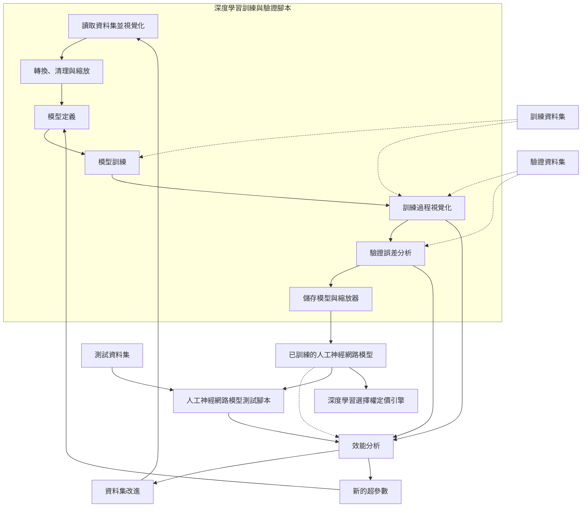

# Option pricing using deep learning approach based on LSTM-GRU neural networks Case of London stock exchange

> 原文檔案：`Option_pricing_using_deep_learning_approach_based_on_LSTM-GRU_neural_networks_Ca.md`  
> 語言：繁體中文（臺灣，zh-TW）  
> 說明：由 LlamaParse Markdown 分段機器翻譯；公式、表格數字與檔名未改寫。

---

DSFE, 3(3): 267–284.
DOI: 10.3934/DSFE.2023016
Received: 01 June 2023
Revised: 25 July 2023
Accepted: 27 July 2023
Published: 10 August 2023

http://www.aimspress.com/journal/dsfe

**研究文章**

# **使用基於 LSTM-GRU 神經網路的深度學習方法進行選擇權定價：倫敦證券交易所案例**

**Habib Zouaoui\*, Meryem-Nadjat Naas**

阿爾及利亞雷利贊大學經濟科學學院，w. Relizane, B.P: 48000, Algeria

* **通訊作者：** Email: habib.zouaoui@univ-relizane.dz.

**摘要：** 本研究回顧機器學習相關文獻，以探討深度學習（deep learning, DL）技術在提升選擇權定價模型準確度上，相較於 Black-Scholes 模型的潛力，以及捕捉金融資料中複雜特徵的能力。

神經網路及其他機器學習模型已被提出用於選擇權定價，並相較於傳統模型提升了準確度。然而，此類機器學習的應用也帶來實務上的挑戰，例如資料可用性與品質、計算資源、模型選擇與驗證、可解釋性以及過度擬合。本研究討論其中若干挑戰，並強調在 2019 年冠狀病毒病（Coronavirus disease 2019）疫情期間，針對倫敦選擇權定價進行機器學習模型的審慎評估與驗證之必要性。此外，為檢驗所使用模型的品質，我們透過統計顯著性檢定，比較這些演算法在選擇權定價上的表現。

**關鍵詞：** black scholes; deep learning; GRU, LSTM; option pricing; RNN

**JEL 分類：** C45, E47, G17

**縮寫：** BSM: black scholes Model; RNN: recurrent neural networks; LSTM: long short-term memory; GRU: gated recurrent unit

268

# 1. **導論**

使用深度學習（DL）進行選擇權定價是一個相對新穎且具前景的研究領域，旨在利用人工神經網路（ANN）來更佳地模擬金融市場的複雜動態，並對選擇權等金融衍生性商品進行定價。作為機器學習的一種類型，深度學習使用具有多層的神經網路來學習輸入與輸出之間的複雜關係。

傳統的選擇權定價方法，例如Black-Scholes模型（BSM），依賴於對基礎資產與市場動態的少數假設，例如波動度固定以及報酬率呈對數常態分布。這些假設在真實市場中可能無法成立，導致定價不準確以及風險管理失準（Huang, 2014）。

相較之下，深度學習方法有潛力捕捉市場變數之間影響選擇權價格的複雜非線性關係。透過以歷史市場資料訓練神經網路，該網路能夠學習如何對新的市場狀況進行泛化，進而做出更準確的預測。

使用深度學習進行選擇權定價的一種方法，是訓練神經網路來預測基礎資產的未來價格，然後利用此預測結果對選擇權進行定價。另一種方法則是直接訓練神經網路，在給定一組市場變數（例如當前資產價格、波動度以及到期時間）的情況下，預測選擇權價格（Li, 2023）。

然而，使用深度學習進行選擇權定價仍存在若干挑戰，包括需要大量的訓練資料、可能對雜訊資料過度擬合，以及難以解釋神經網路內部表徵的問題。研究人員持續探索並精煉深度學習在選擇權定價上的方法，並在量化金融領域保持活躍。

深度學習是一種基於人工神經網路演算法的先進機器學習技術。作為人工智慧的一個前景看好的分支，深度學習近年來備受關注。相較於傳統機器學習技術，例如支援向量機（SVM）與k-最近鄰（kNN），深度學習具備無監督特徵學習、強大的泛化能力，以及對大數據強健的訓練能力等優勢（Flórido, 2022）。

目前，數學分析、計算硬體與軟體的現代進展，以及大數據的可用性，已使得商品化機器能夠學習如何像投資經理人、金融分析師與交易員一樣運作成為可能。我們簡要回顧人工智慧與深度學習如何以及為何能夠影響金融領域。重溫1990年代的原始文獻，我們總結了一個可在該領域中使用機器學習的架構，並特別應用於選擇權定價。我們訓練一個全連接的前饋深度學習神經網路，以高度準確度重現Black and Scholes（1973）的選擇權定價公式。我們也簡要介紹神經網路，並詳細說明各種能提升模型準確度的超參數選擇。此練習顯示，深度學習網路可用於從市場中學習選擇權定價模型，並可被訓練來模仿專精於單一股票或指數的選擇權定價交易員（Chang, 2022）。

**Output:**

使用深度學習（DL）進行選擇權定價的一項假設是，其模型能夠更好地捕捉標的資產風險與不確定性之間的複雜非線性關係，以及這些因素與選擇權價格的關聯。傳統選擇權定價模型，例如 Black-Scholes-Merton（BSM）模型，假設標的資產價格遵循對數常態分布（log-normal distribution），且波動率（volatility）在時間上為常數。然而，在現實中，標的資產

*Data Science in Finance and Economics*

Volume 3, Issue 3, 267–284.

269

資產價格受到包括市場情緒、新聞事件與總體經濟狀況等複雜因素的影響，這些因素可能導致其呈現非常態分配與隨時間變化的波動性。

深度學習（deep learning, DL）模型能夠學習輸入與輸出變數之間的複雜關係，已展現出捕捉這些複雜動態並提升選擇權定價準確度的潛力。深度學習模型亦能納入更廣泛的輸入變數，包括新聞文章與社群媒體情緒等非結構化資料，這些資料可提供有關基礎資產風險與不確定性的額外洞見。

使用深度學習模型進行選擇權定價的另一項假設，是其相較於傳統選擇權定價模型，能夠更好地適應變動的市場環境，並具備處理極端事件（如市場崩盤或突發新聞事件）的能力。深度學習模型可利用包含極端市場事件的大量歷史資料進行訓練，有助於更有效地捕捉選擇權所伴隨的尾端風險（tail risk）。

總體而言，該假設認為深度學習模型能夠透過捕捉基礎資產風險、不確定性與選擇權價格之間複雜且動態的關係，並具備更強的市場環境適應能力與極端事件處理能力，從而提供更準確且穩健的選擇權定價預測。然而，深度學習模型需要大量高品質資料、嚴謹的驗證程序以及審慎的解釋。此外，其表現可能取決於特定問題與資料特性。

## 2. **研究背景**

選擇權在衍生性金融商品市場中占有一定地位。研究人員、投機者及其他交易者皆希望為每一選擇權取得合理的價格。然而，我們僅能對有限的選擇權價格求得精確解，大多數情況仍須透過數值方法定義。傳統方法在處理大型資料集與高維度資料時，處理能力較弱且計算速度緩慢。隨著近年來人工智慧的發展，例如機器學習方法，目標值的優化已逐漸變得較為容易。因此，許多學者、投資者與交易者開始將人工智慧應用於各類選擇權定價。本研究回顧過去數年來不同方法在各類選擇權定價上的應用，包括比較其優缺點、準確度與穩健性（Li, 2022）。為更清楚了解這些方法，我們呈現近期研究成果，並統計使用各種深度學習模型進行匯率預測的文章數量，如表 1 所示。

現今，機器學習方法如神經網路在金融市場的應用已成為熱門議題。在這些方法中，衍生性金融商品定價無論在學術界或實際交易中皆扮演重要角色。與時俱進的深度學習演算法亦具備良好的模型泛化能力，其預測準確度已超越傳統金融模型（Li, 2022）。

*Data Science in Finance and Economics*

Volume 3, Issue 3, 267–284.

<table>
  <caption><b>**表1**.</b> 過去研究回顧。</caption>
  <thead>
    <tr>
      <th>作者／年份</th>
      <th>國家</th>
      <th>研究方法</th>
      <th>主要發現</th>
    </tr>
  </thead>
  <tbody>
    <tr>
      <td>Robert Culkin, Sanjiv R. Das (2017)</td>
      <td>美國</td>
      <td>BSM, ANN</td>
      <td>ANN 準確度最佳</td>
    </tr>
    <tr>
      <td>Andrey Itkin (2019)</td>
      <td>美國</td>
      <td>BSM, ANN</td>
      <td>ANN 準確度最佳</td>
    </tr>
    <tr>
      <td>Camilo Blanco Vargas (2019)</td>
      <td>英國</td>
      <td>BS, MC, ANN, GPU</td>
      <td>ANN 準確度最佳</td>
    </tr>
    <tr>
      <td>Salvador et al. (2020)</td>
      <td>美國</td>
      <td>BSM, ANN</td>
      <td>ANN 準確度最佳</td>
    </tr>
    <tr>
      <td>Ivascu (2020)</td>
      <td>美國</td>
      <td>BSM, SVM, LSTM, GBM, ANN, GA</td>
      <td>LSTM 準確度最佳</td>
    </tr>
    <tr>
      <td>Gabriel Adams (2020)</td>
      <td>美國</td>
      <td>BSM, MLP, LSTM</td>
      <td>MLP 與 LSTM 準確度最佳</td>
    </tr>
    <tr>
      <td>Alexander Ke, Andrew Yang (2021)</td>
      <td>美國</td>
      <td>BSM, MLP, LSTM</td>
      <td>MLP 與 LSTM 準確度最佳</td>
    </tr>
    <tr>
      <td>Codruț-Florin Ivașcu (2021)</td>
      <td>羅馬尼亞</td>
      <td>BSM, ANN, SVR, LGBM, GA</td>
      <td>NN 與 SVR 準確度最佳</td>
    </tr>
    <tr>
      <td>Wenda Li (2021)</td>
      <td>臺灣</td>
      <td>BSM, ANN</td>
      <td>ANN 準確度最佳</td>
    </tr>
    <tr>
      <td>Edward Chang (2022)</td>
      <td>加拿大</td>
      <td>BSM, CNN-LSTM, ANN</td>
      <td>CNN-LSTM 表現較佳</td>
    </tr>
    <tr>
      <td>Diogo Pinto Flórido (2022)</td>
      <td>西班牙</td>
      <td>BSM, MLP, LSTM</td>
      <td>MLP 與 LSTM 準確度最佳</td>
    </tr>
    <tr>
      <td>Yan Liu, Xiong Zhang (2023)</td>
      <td>中國</td>
      <td>BSM, SVM, LSTM, RNN</td>
      <td>LSTM 準確度最佳</td>
    </tr>
    <tr>
      <td>Li, Yan (2023)</td>
      <td>中國</td>
      <td>BSM, MC, MLP</td>
      <td>MLP 準確度最佳</td>
    </tr>
  </tbody>
</table>
<b>**資料來源：**</b> 作者依據文獻回顧之分析（2023）

根據過去研究，我們得出結論：源自遞迴神經網路（recurrent neural network, RNN）的 LSTM 模型，是學習金融時間序列資料的最佳方法之一。我們重新檢視原始模型並在其基礎上進行修正，獲得一個同樣適用於金融資料的學習模型。對於美式選擇權而言，額外的一個問題是如何找出最適停止時間並提供合理的解釋，因為最適執行時間無法直接從市場資訊中學習。

總體而言，這些研究顯示深度學習（deep learning, DL）模型有潛力大幅提升選擇權定價的準確度與獲利能力，特別是與大量高品質資料結合使用，並經過謹慎驗證與詮釋時。然而，我們必須注意到，深度學習模型仍是選擇權定價領域相對新穎的方法，其表現可能取決於特定問題與資料特性。

然而，在比較深度學習於選擇權定價的表現時，本研究以閘控遞迴單元（gated recurrent unit, GRU）模型作為計算財務領域的新貢獻為特色。

## **3. 資料與方法**

### *3.1. Black-Scholes 模型（BSM）*

在1973年春季，費雪．布萊克（Fisher Black）與麥倫．休斯（Myron Scholes）根據實證證據發表了一篇學術論文，用以對特定資產的選擇權進行定價，並提出選擇權的價值是由少數幾個變數所決定：標的資產價格、履約價格、選擇權到期期限、資產的波動率（volatility）以及無風險利率。

**Output:**

271

## 3.1.1. 布雷克－休斯－默頓模型的假設

為使用 BS 公式，Black（1973）對股票市場提出以下理想條件假設：

- **對數常態分配（Lognormal distribution）：** 布雷克－休斯－默頓模型（Black–Scholes–Merton model）假設股價遵循對數常態分配，其原理為資產價格不可能為負值，亦即股價下限為零。
- **無股利（No dividends）：** 該模型假設股票不支付任何股利或報酬。
- **到期日（Expiration date）：** 模型假設選擇權僅能在到期日或到期時執行，因此無法準確為美式選擇權定價。此模型主要廣泛應用於歐式選擇權市場。
- **隨機遊走（Random walk）：** 股票市場具有高度波動性，並假設市場處於隨機遊走狀態，因為市場方向無法真正被預測。
- **無摩擦市場（Frictionless market）：** 模型假設不存在任何交易成本，包括手續費與經紀費用。
- **無風險利率（Risk-free interest rate）：** 利率假設為固定不變，因此基礎資產被視為無風險資產。
- **常態分配（Normal distribution）：** 股票報酬率呈常態分配，這意味著市場波動率在時間上為常數。
- **無套利（No arbitrage）：** 在無套利機會下，可避免無風險獲利的可能性。

## 3.1.2. 布雷克－休斯－默頓方程式

布雷克－休斯－默頓模型可被描述為一個二階偏微分方程式：

$$\frac{\partial V}{\partial t} + \frac{1}{2}\sigma^2 S^2 \frac{\partial^2 V}{\partial S^2} + rS \frac{\partial^2 V}{\partial S} - rV = 0$$

此方程式背後的重要金融洞見是：投資人可以透過同時買賣基礎資產與銀行帳戶資產（現金）來完美避險（perfectly hedge），從而消除風險。此一避險策略意味著選擇權僅存在唯一正確的價格，即由布雷克－休斯公式所計算出的價格（見下一節）。

## 3.1.3. 布雷克－休斯公式

布雷克－休斯公式用以計算歐式賣權與買權的價格。此價格與布雷克－休斯方程式一致，該公式可透過求解相對應的終端條件與邊界條件而得出（Chriss and Kawaller, 1997）：

$$C(0, t) = 0 \quad \text{for all } t$$
$$C(S, t) = S - K \quad \text{as } S \to \infty$$
$$C(S, T) = \max \{S - K, 0\}$$

對於不支付股利的基礎股票，其買權價值可由以下布雷克－休斯參數表示：

*Data Science in Finance and Economics* Volume 3, Issue 3, 267–284.

$$C(S_t, t) = N(d_1)S_t - N(d_2)Ke^{-r(T-t)} \tag{1}$$

$$d_1 = \frac{1}{\sigma\sqrt{T-t}} \left[ \ln \left( \frac{S_t}{K} \right) + \left( r + \frac{\sigma^2}{2} \right) (T-t) \right] \tag{2}$$

$$d_2 = d_1 - \sigma\sqrt{T-t}$$

對應賣權（put option）的價格，則根據賣權－買權平價（put–call parity）並考慮折現因子可得 [**Figure 1**]

<table>
  <caption>圖 1. 使用 Black–Scholes 定價公式計算的歐式買權價值。（V：歐式買權價格；S：現貨價格；T：剩餘到期時間）</caption>
  <thead>
    <tr>
      <th rowspan="2">T（剩餘到期時間）</th>
      <th colspan="3">S（現貨價格）</th>
    </tr>
    <tr>
      <th>0.8</th>
      <th>1.0</th>
      <th>1.2</th>
    </tr>
  </thead>
  <tbody>
    <tr>
      <th>0.0</th>
      <td>0.00</td>
      <td>0.00</td>
      <td>0.20</td>
    </tr>
    <tr>
      <th>0.5</th>
      <td>0.02</td>
      <td>0.08</td>
      <td>0.23</td>
    </tr>
    <tr>
      <th>1.0</th>
      <td>0.05</td>
      <td>0.12</td>
      <td>0.26</td>
    </tr>
    <tr>
      <th>1.5</th>
      <td>0.08</td>
      <td>0.16</td>
      <td>0.29</td>
    </tr>
    <tr>
      <th>2.0</th>
      <td>0.11</td>
      <td>0.19</td>
      <td>0.32</td>
    </tr>
  </tbody>
</table>

$$P(S_t, t) = Ke^{-r(T-t)} - S_t + C(S_t, t). \tag{3}$$
$$= N(-d_2)Ke^{-r(T-t)} - N(d_1)S_t$$

其中 **N** – 標準常態分配的累積分配函數；平均數 = 0，標準差 = 1  
**T-t** – 剩餘到期時間（以年為單位）  
**St** – 標的資產的現貨價格  
**K** – 履約價格  
**r** – 無風險利率  
**σ** – 標的資產報酬率的波動度

### 3.1.4. Black–Scholes–Merton 模型的限制

**僅適用於歐洲市場：** 如前所述，Black–Scholes–Merton 模型能精準決定歐式選擇權的價格，但無法準確評價美國的股票選擇權。其假設選擇權只能在到期日當天行使。  
**無風險利率：** BSM 假設利率為固定不變，但在現實中幾乎不可能如此。  
**無摩擦市場的假設：** 交易通常會產生交易成本，例如經紀商手續費與佣金。然而，Black–Scholes–Merton 模型假設市場無摩擦，即不存在交易成本，這在實際交易市場中也幾乎不可能發生。  
**無報酬：** BSM 假設股票選擇權沒有任何報酬、無股利且無利息收入。然而，這些情況在實際交易市場中同樣相當罕見。選擇權的買賣主要著重於報酬。1

---
1. https://corporatefinanceinstitute.com/resources/derivatives/black-scholes-merton-model/December(2022)

**3.2. 深度學習（DL）模型**

本節簡要說明四種後續用於匯率時間序列預測的*非線性*機器學習模型或深度學習（DL）模型的基本原理，即RNN、LSTM與閘控循環單元（GRU）。

### 3.2.1. 循環神經網路（RNN）

循環神經網路（RNN）與傳統神經網路的不同之處在於引入轉移權重（transition weight），以便在時間序列上傳遞資訊。此轉移權重意味著下一狀態取決於前一狀態，表示該模型具備記憶能力。在RNN中，隱藏層作為內部儲存機制，用以保存先前階段所擷取的資訊。「循環」（recurrent）一詞源自於模型對序列中的每個元素執行相同任務，並利用先前獲得的資訊來預測未來數值。RNN的結構如（圖2）所示。

**圖2.** 具有p個時間步長的循環神經網路。

兩種強大的RNN模型特別適合處理時間序列資料的時間依賴性，即長短期記憶（LSTM）與閘控循環單元（GRU）。這些深度學習模型在建模與預測上展現出顯著成效，相較於傳統時間序列模型與傳統神經網路，在許多時間序列應用領域均獲得良好結果。

### 3.2.2. 長短期記憶（LSTM）模型

長短期記憶（LSTM）是一種複雜的閘控記憶單元，旨在解決簡單RNN因梯度消失（vanishing gradient）問題而導致的效率限制（Zeroual et al., 2020）。

圖3呈現LSTM的完整架構圖，與RNN的圖3相似。LSTM包含四個主要組成部分：輸入閘（input gates）、遺忘閘（forget gate）、細胞狀態（cell state）與輸出閘（output gate）。

**圖 3.** LSTM 結構。

LSTM 模型定義如下。令 $x_t$、$h_t$ 與 $C_t$ 分別為時間步 $t$ 的輸入、隱藏狀態與細胞狀態。給定一序列輸入 ($x_1, x_2, \dots, x_m$)，LSTM 會計算出隱藏狀態序列 ($h_1, h_2, \dots, h_m$) 與細胞狀態序列 ($C_1, C_2, \dots, C_m$)，其計算方式如下：

***輸入閘 (Input Gate)：*** 其目標是透過兩個函數 $r_t$ 與 $d_t$ 來納入新的資訊 $x_t$。$r_t$ 會將前一個隱藏向量 $h_{t-1}$ 與新的資訊 $x_t$ 進行串接，亦即 [$h_{t-1}, x_t$]，再乘以權重矩陣 $W_r$，並加上偏差向量 $b_r$。$d_t$ 具有類似的功能。接著，$r_t$ 與 $d_t$ 進行元素對元素相乘，以獲得細胞狀態 $c_t$：

$$r_t = \sigma(W_f \cdot [h_{t-1}, x_t]) + b_f$$
$$d_t = \tanh(W_d \cdot [h_{t-1}, x_t]) + b_d$$

***遺忘閘 (Forget Gate)：*** 其形式與輸入閘中的 $r_t$ 極為相似，遺忘閘 $f_t$ 負責控制要將多少資訊保留在記憶中：

$$f_t = \sigma(W_i \cdot [h_{t-1}, x_t]) + b_i$$

***細胞狀態 (Cell State)：*** 將前一個細胞狀態 $C_{t-1}$ 與遺忘閘 $f_t$ 進行元素對元素相乘，然後再加上輸入閘所產生的 $r_t \cdot d_t$ 結果：

$$C_t = f_t \cdot C_{t-1} + r_t \cdot d_t$$

***輸出閘 (Output Gate)：*** 此處 $o_t$ 為時間步 $t$ 的輸出閘，$W_o$ 與 $b_o$ 分別為輸出閘的權重與偏差。隱藏層 $h_t$ 可傳遞至下一個時間步或作為輸出 $y_t$。$y_t$ 是對 $h_t$ 再施加一次 $\tanh$ 函數後所得。需注意的是，輸出閘 $o_t$ 並非最終輸出 $y_t$，而是控制輸出的閘門：

$$o_t = \sigma(W_o \cdot [h_{t-1}, x_t]) + b_o$$
$$h_t = o_t \tanh C_t$$

### 3.2.3. 閘控循環單元 (Gated Recurrent Unit, GRU) 模型

Cho et al. (2014) 在提出 RNN 與 LSTM 的同時也發明了 GRU，期望未來能出現更多遞迴網路的變體。GRU 同樣旨在解決梯度消失 (vanishing gradient) 的問題。

梯度問題。與 LSTM 不同的是，GRU 沒有 cell state 與 output gate，因此參數較少。GRU 利用隱藏層來傳遞資訊，並擁有兩個閘門，分別為重置閘門（reset gate）與更新閘門（update gate）。

GRU 的參數包括 $W_r$、$W_z$ 與 $W_h$。重置訊號 $r_t$ 決定是否忽略先前的隱藏狀態，而更新訊號 $z_t$ 則決定隱藏狀態 $h_t$ 是否需要以新的候選狀態 *hat ($h_t$)* 進行更新。

$$z_t = \sigma(W_z \cdot [h_{t-1}, x_t]) + b_z$$
$$r_t = \sigma(W_r \cdot [h_{t-1}, x_t]) + b_r$$
$$\hat{h}_t = \tanh(W_h \cdot [r_t \cdot h_{t-1}, x_t] + b_h)$$
$$h_t = (1 - z_t) \cdot h_{t-1} + z_t \cdot \hat{h}_t$$

***重置閘門（Reset Gate）：*** 此閘門的功能類似於 LSTM 的輸入閘門與遺忘閘門。閘門 $r_t$ 決定是否忽略先前的隱藏狀態。更新閘門 $z_t$ 則是用來產生候選狀態 *hat ($h_t$)*。$W_z$ 與 $W_r$ 是需要訓練的權重參數，而 $b_z$ 與 $b_r$ 則是偏差向量（noise vectors）。

***更新閘門（Update Gate）（第一部分）：*** 此部分將 $r_t$ 與 $h_{t-1}$ 相乘。相乘的結果代表 $h_{t-1}$ 被保留或忽略的比例。由此產生一個暫時的候選狀態 *hat ($h_t$)*，用於後續更新 $h_t$。$W_h$ 與 $b_h$ 分別為權重參數與偏差向量。

***更新閘門（Update Gate）（第二部分）：*** 此部分根據權重 $z_t$ 計算 $h_{t-1}$ 與 *hat ($h_t$)* 的加權平均。若 $z_t$ 接近零，則過去的資訊貢獻較小，而新的資訊貢獻較大。

### *3.3. 評估指標*

我們使用五種不同的預測誤差指標來評估模型的效能與方法的準確度：MAE、MSE、RMSE、MAPE 以及 R-squared，其中 $\hat{y}_t$ 為預測值，$y_t$ 為實際觀測值，$n$ 為預測次數，而 $\mu$ 為測量值的平均數。

**表 2.** 評估指標。

<table>
  <thead>
    <tr>
      <th>評估指標</th>
      <th>公式</th>
    </tr>
  </thead>
  <tbody>
    <tr>
      <td>均方誤差 (Mean square error, MSE)</td>
      <td>\( MSE = \frac{1}{n} \sum_{t=1}^{n} (y_t - \widehat{y}_t)^2 \)</td>
    </tr>
    <tr>
      <td>均方根誤差 (Root mean square error, RMSE)</td>
      <td>\( RMSE = \sqrt{\sum_{t=1}^{n} \frac{(y_t - \widehat{y}_t)^2}{n}} \)</td>
    </tr>
    <tr>
      <td>平均絕對誤差 (Mean absolute error, MAE)</td>
      <td>\( MAE = \sum_{t=1}^{n} \frac{|y_t - \widehat{y}_t|}{n} \)</td>
    </tr>
    <tr>
      <td>平均絕對百分比誤差 (Mean absolute percentage error, MAPE)</td>
      <td>\( MAPE = \frac{1}{n} \sum_{t=1}^{n} \left| \frac{y_t - \widehat{y}_t}{y_t} \right| \times 100 \)</td>
    </tr>
    <tr>
      <td>判定係數 (R-squared)</td>
      <td>\( R^2 = 1 - \frac{\sum_{t=1}^{n} (y_t - \widehat{y}_t)^2}{\sum_{t=1}^{n} (y_t - \mu)^2} \)</td>
    </tr>
  </tbody>
</table>

# **4. 結果與分析**

## *4.1. 資料描述*

本研究使用歷史 CSV 資料樣本來實作並比較兩個模型，該樣本包含在倫敦證券交易所交易的 10,000 筆歐式選擇權（put and call）的觀測值2。樣本包含 2020 年 1 月 1 日至 2021 年 12 月 31 日期間的所有記錄資料（**表 3**），此期間正值 2019 年冠狀病毒疾病（COVID-19）疫情，以下為其特徵：

<table>
    <caption><strong>表 3.</strong> 資料集中所有特徵的清單，包含變數類型及簡要意義描述。</caption>
    <thead>
        <tr>
            <th>變數</th>
            <th>類型</th>
            <th>描述</th>
        </tr>
    </thead>
    <tbody>
        <tr>
            <td>Time</td>
            <td>數值</td>
            <td>合約結算時間</td>
        </tr>
        <tr>
            <td>Strike price</td>
            <td>數值</td>
            <td>選擇權的履約價格</td>
        </tr>
        <tr>
            <td>Stock price</td>
            <td>數值</td>
            <td>選擇權標的資產的價格</td>
        </tr>
        <tr>
            <td>Volatility</td>
            <td>數值</td>
            <td>標的資產報酬率的波動率（volatility）</td>
        </tr>
        <tr>
            <td>Interest rate</td>
            <td>數值</td>
            <td>未結算且流通在外選擇權的實際總數量</td>
        </tr>
        <tr>
            <td><u>Type</u></td>
            <td>二元</td>
            <td>選擇權為買權（call）或賣權（put）</td>
        </tr>
        <tr>
            <td>Delta</td>
            <td>數值</td>
            <td>選擇權價格相對於其標的資產價格的導數</td>
        </tr>
        <tr>
            <td>Gamma</td>
            <td>數值</td>
            <td>選擇權價格相對於其 delta 的敏感度</td>
        </tr>
        <tr>
            <td>Theta</td>
            <td>數值</td>
            <td>選擇權價格相對於其剩餘到期時間的導數</td>
        </tr>
    </tbody>
</table>

本研究使用 Python 3.7 程式語言來實作模型。選擇此語言是因為其語法簡潔，且擁有豐富的機器學習預建函式庫，能夠加快工作流程並簡化除錯過程。特別是，在本研究實證部分所使用的函式庫包括：

<table>
  <caption><b>**表 4**.</b> 使用 Python 3.7 實作的模型。</caption>
  <thead>
    <tr>
      <th>套件</th>
      <th>研究</th>
      <th>描述</th>
    </tr>
  </thead>
  <tbody>
    <tr>
      <td>Pandas</td>
      <td>(McKinney, 2022)</td>
      <td>用於讀取、寫入與處理資料集</td>
    </tr>
    <tr>
      <td>NumPy</td>
      <td>(Oliphant, 2006)</td>
      <td>以陣列作為主要資料結構來執行運算；</td>
    </tr>
    <tr>
      <td>SciPy</td>
      <td>(Virtanen et al., 2019)</td>
      <td>一個大型函式庫，包含科學領域的各個分支，本研究用於統計工具；</td>
    </tr>
    <tr>
      <td>Time</td>
      <td>存在於 Python 標準函式庫中，</td>
      <td>用於計算兩個模型的運算與訓練時間；</td>
    </tr>
    <tr>
      <td>Matplotlib</td>
      <td>(Hunter, 2007)</td>
      <td>用於繪製圖表與視覺化呈現，以獲得模型的視覺化解釋；</td>
    </tr>
    <tr>
      <td>TensorFlow</td>
      <td>(Abadi et al., 2015)</td>
      <td>由 Google 開發的介面，用來實作機器學習，特別是深度學習 (Deep Learning, DL) 模型。其名稱來自於資料以張量 (tensor) 的形式匯入 TensorFlow，此特性可加速模型訓練。</td>
    </tr>
  </tbody>
</table>

***

2. https://www.londonstockexchange.com/

**Figure 4.** 資料集中數值特徵之間的相關性熱圖矩陣（賣權）

<table>
  <caption>Figure 4. Correlation heatmap matrix amongst numerical features from the dataset (Put Options)</caption>
  <thead>
    <tr>
      <th>Feature</th>
      <th>putPrice</th>
      <th>T</th>
      <th>K</th>
      <th>S0</th>
      <th>sigma</th>
      <th>r</th>
    </tr>
  </thead>
  <tbody>
    <tr>
      <th>putPrice</th>
      <td>1</td>
      <td>0.023</td>
      <td>0.7</td>
      <td>-0.54</td>
      <td>0.099</td>
      <td>-0.045</td>
    </tr>
    <tr>
      <th>T</th>
      <td>0.023</td>
      <td>1</td>
      <td>-0.0063</td>
      <td>-0.00049</td>
      <td>-0.0039</td>
      <td>-0.011</td>
    </tr>
    <tr>
      <th>K</th>
      <td>0.7</td>
      <td>-0.0063</td>
      <td>1</td>
      <td>-0.00017</td>
      <td>-0.001</td>
      <td>-0.0039</td>
    </tr>
    <tr>
      <th>S0</th>
      <td>-0.54</td>
      <td>-0.00049</td>
      <td>-0.00017</td>
      <td>1</td>
      <td>0.0028</td>
      <td>0.00055</td>
    </tr>
    <tr>
      <th>sigma</th>
      <td>0.099</td>
      <td>-0.0039</td>
      <td>-0.001</td>
      <td>0.0028</td>
      <td>1</td>
      <td>-0.011</td>
    </tr>
    <tr>
      <th>r</th>
      <td>-0.045</td>
      <td>-0.011</td>
      <td>-0.0039</td>
      <td>0.00055</td>
      <td>-0.011</td>
      <td>1</td>
    </tr>
  </tbody>
</table>

**Figure 4.** 資料集中數值特徵之間的相關性熱圖矩陣（買權）

<table>
  <caption>Figure 4. Correlation heatmap matrix amongst numerical features from the dataset (Call Options)</caption>
  <thead>
    <tr>
      <th>Feature</th>
      <th>callPrice</th>
      <th>T</th>
      <th>K</th>
      <th>S0</th>
      <th>sigma</th>
      <th>r</th>
    </tr>
  </thead>
  <tbody>
    <tr>
      <th>callPrice</th>
      <td>1</td>
      <td>0.084</td>
      <td>-0.54</td>
      <td>0.72</td>
      <td>0.095</td>
      <td>0.018</td>
    </tr>
    <tr>
      <th>T</th>
      <td>0.084</td>
      <td>1</td>
      <td>-0.0063</td>
      <td>-0.00049</td>
      <td>-0.0039</td>
      <td>-0.011</td>
    </tr>
    <tr>
      <th>K</th>
      <td>-0.54</td>
      <td>-0.0063</td>
      <td>1</td>
      <td>-0.00017</td>
      <td>-0.001</td>
      <td>-0.0039</td>
    </tr>
    <tr>
      <th>S0</th>
      <td>0.72</td>
      <td>-0.00049</td>
      <td>-0.00017</td>
      <td>1</td>
      <td>0.0028</td>
      <td>0.00055</td>
    </tr>
    <tr>
      <th>sigma</th>
      <td>0.095</td>
      <td>-0.0039</td>
      <td>-0.001</td>
      <td>0.0028</td>
      <td>1</td>
      <td>-0.011</td>
    </tr>
    <tr>
      <th>r</th>
      <td>0.018</td>
      <td>-0.011</td>
      <td>-0.0039</td>
      <td>0.00055</td>
      <td>-0.011</td>
      <td>1</td>
    </tr>
  </tbody>
</table>

## *4.2. 所使用的模型及其規格*

標準 BSM 模型被用來作為機器學習模型的比較基準。眾所周知，BSM 的輸入包括標的資產價格、選擇權履約價、選擇權剩餘到期時間、無風險利率（RF rate）以及標的資產的波動率衡量指標。對於後者，我們使用模型輸出中所描述的變數，得出選擇權的無套利價格。

當我們建立起一個可運作的深度學習堆疊後，便開始開發工作，首先撰寫一個 Python 腳本，使用 Keras 和 TensorFlow 來訓練人工神經網路（ANNs），以解決簡單的迴歸問題。

**圖 5.** 深度學習選擇權定價求解器開發流程圖。

**輸出：**

278

許多線上資源可用來完成這些初始步驟。特別是 TensorFlow 的官方線上文件非常清晰，並提供簡單的實務範例。本研究專案所實作的深度學習訓練與驗證腳本，即衍生自 TensorFlow 官方教學中一個基礎的迴歸範例，該範例可於 <u>https://www.tensorflow.org/tutorials/keras/regression</u> 取得。

如同物件導向程式設計（OOP）中用來規劃類別圖的概念，流程圖是描述程序性程式與流程的工具。圖 5 呈現了本研究中用來建構深度學習選擇權定價求解器的迭代開發過程。

以下為開發深度學習選擇權定價求解器的一般流程圖：

**問題定義（Problem Formulation）：** 明確定義問題陳述並確定專案範圍。

**資料蒐集（Data Collection）：** 蒐集標的資產的歷史價格資料，並納入相關的市場資料，例如利率、波動率（volatility）與股利。

**資料前處理（Data Pre-processing）：** 清理、標準化與轉換資料，以準備供深度學習模型使用。

**模型選擇（Model Selection）：** 根據問題陳述、資料特性及可用的運算資源，選擇適當的深度學習模型架構與設計。

**模型訓練（Model Training）：** 使用前處理後的資料訓練深度學習模型，採用梯度下降（gradient descent）與反向傳播（backpropagation）等技術來最佳化模型參數。

**模型評估（Model Evaluation）：** 運用適當的評估指標，例如均方根誤差（RMSE）或平均絕對誤差（MAE），評估深度學習模型的效能，並使用測試資料驗證其預測結果。

**模型調校（Model Tuning）：** 根據評估與驗證結果，調整深度學習模型的參數與架構，以提升其效能。

**部署（Deployment）：** 將深度學習選擇權定價求解器部署至生產環境，並在真實市場條件下測試其效能。

**監控與維護（Monitoring and Maintenance）：** 持續監控深度學習選擇權定價求解器的效能，並依需要維護與更新模型，以確保其長期準確性與可靠性。

請注意，流程圖的具體步驟與細節可能因深度學習選擇權定價求解器的特定需求、目標，以及資料的可用性與品質而有所不同。此外，開發深度學習模型需要同時具備金融與電腦科學的專業知識，並對基礎資料與市場動態有扎實的理解。

我們使用以下超參數訓練神經網路（如表 5 所示）：
- 四層全連接隱藏層
- 每層各有 200 個神經元
- 批次大小（batch size）為 64
- 訓練 200 個週期（epochs）
- 80–20 的訓練驗證分割（Figures 7, 8）
- 以均方誤差（MSE）作為損失函數

*Data Science in Finance and Economics*

Volume 3, Issue 3, 267–284.

<table>
  <caption><b>**表 5.**</b> 各模型的超參數。</caption>
  <thead>
    <tr>
      <th>超參數</th>
      <th>LSTM</th>
      <th>GRU</th>
    </tr>
  </thead>
  <tbody>
    <tr>
      <td>激活函數</td>
      <td>RELU</td>
      <td>RELU</td>
    </tr>
    <tr>
      <td>損失函數</td>
      <td>MSE</td>
      <td>MSE</td>
    </tr>
    <tr>
      <td>神經元數</td>
      <td>[200,200,200,200,200,1]</td>
      <td>[200,200,200,200,200,1]</td>
    </tr>
    <tr>
      <td>學習率</td>
      <td>0.001</td>
      <td>0.001</td>
    </tr>
    <tr>
      <td>優化器</td>
      <td>Adam</td>
      <td>Adam</td>
    </tr>
  </tbody>
</table>
此處 [200, 200, 200, 200, 200, 1] 代表從第一層到最後一層網路的神經元數量。

### *4.3. 基準模型的定價表現*

為了探討所使用模型的品質，我們比較了 BSM 與深度學習模型（如 LSTM 與 GRU）的表現。在歐式買權定價誤差方面，我們使用了 Python 程式碼。這些演算法透過顯著性統計檢定（MSE、RMSE、MAE），預測倫敦證券交易所（JSE）的歐式買權價格。

基準模型的結果是透過 BSM 選擇權定價與 LSTM 及 GRU 在資料集上取得的指標進行比較。這些結果被彙總以確認 LSTM 的定價表現。然而，以基準機器學習模型取得的結果則作為可能誤差範圍的指標。

第一個結論是，基準模型的定價品質在不同價內狀態下有顯著差異，如**圖 6** 所示。

<table>
  <caption>圖 6. GRU 模型的訓練與測試損失</caption>
  <thead>
    <tr>
      <th>Epoch</th>
      <th>GRU 訓練損失</th>
      <th>GRU 測試損失</th>
    </tr>
  </thead>
  <tbody>
    <tr>
      <th>0</th>
      <td>0.0235</td>
      <td>0.0058</td>
    </tr>
    <tr>
      <th>25</th>
      <td>0.0002</td>
      <td>0.0003</td>
    </tr>
    <tr>
      <th>50</th>
      <td>0.0001</td>
      <td>0.0002</td>
    </tr>
    <tr>
      <th>75</th>
      <td>0.0001</td>
      <td>0.0001</td>
    </tr>
    <tr>
      <th>100</th>
      <td>0.0001</td>
      <td>0.0001</td>
    </tr>
    <tr>
      <th>125</th>
      <td>0.0001</td>
      <td>0.0001</td>
    </tr>
    <tr>
      <th>150</th>
      <td>0.0001</td>
      <td>0.0001</td>
    </tr>
    <tr>
      <th>175</th>
      <td>0.0001</td>
      <td>0.0001</td>
    </tr>
    <tr>
      <th>200</th>
      <td>0.0001</td>
      <td>0.0001</td>
    </tr>
  </tbody>
</table>

<table>
  <caption>**圖 7.** LSTM 模型的訓練與測試損失。</caption>
  <thead>
    <tr>
      <th>Epoch</th>
      <th>LSTM 訓練損失</th>
      <th>LSTM 測試損失</th>
    </tr>
  </thead>
  <tbody>
    <tr>
      <th>0</th>
      <td>0.0195</td>
      <td>0.0065</td>
    </tr>
    <tr>
      <th>25</th>
      <td>0.0003</td>
      <td>0.0004</td>
    </tr>
    <tr>
      <th>50</th>
      <td>0.0002</td>
      <td>0.0003</td>
    </tr>
    <tr>
      <th>75</th>
      <td>0.0002</td>
      <td>0.0002</td>
    </tr>
    <tr>
      <th>100</th>
      <td>0.0001</td>
      <td>0.0002</td>
    </tr>
    <tr>
      <th>125</th>
      <td>0.0001</td>
      <td>0.0002</td>
    </tr>
    <tr>
      <th>150</th>
      <td>0.0001</td>
      <td>0.0002</td>
    </tr>
    <tr>
      <th>175</th>
      <td>0.0001</td>
      <td>0.0002</td>
    </tr>
    <tr>
      <th>200</th>
      <td>0.0001</td>
      <td>0.0002</td>
    </tr>
  </tbody>
</table>

<table>
  <caption><b>**表 6.**</b> 深度學習誤差指標與 Black-Scholes 價格之比較。</caption>
  <thead>
    <tr>
      <th>選擇權類型</th>
      <th>模型</th>
      <th>訓練/測試 (%)</th>
      <th>訓練週期</th>
      <th>時間</th>
      <th>MAE</th>
      <th>MSE</th>
      <th>RMSE</th>
    </tr>
  </thead>
  <tbody>
    <tr>
      <td rowspan="3">買權</td>
      <td>BSM</td>
      <td>80/20</td>
      <td>200</td>
      <td>1s 3ms/step</td>
      <td>2.84</td>
      <td>16.39</td>
      <td>4.05</td>
    </tr>
    <tr>
      <td>LSTM</td>
      <td>80/20</td>
      <td>200</td>
      <td>0s 4ms/step</td>
      <td>2.33</td>
      <td>13.58</td>
      <td>3.69</td>
    </tr>
    <tr>
      <td>GRU</td>
      <td>80/20</td>
      <td>200</td>
      <td>2s 13ms/step</td>
      <td>2.65</td>
      <td>15.21</td>
      <td>3.90</td>
    </tr>
    <tr>
      <td rowspan="3">賣權</td>
      <td>BSM</td>
      <td>80/20</td>
      <td>200</td>
      <td>0s 1ms/step</td>
      <td>4.70</td>
      <td>54.46</td>
      <td>7.38</td>
    </tr>
    <tr>
      <td>LSTM</td>
      <td>80/20</td>
      <td>200</td>
      <td>0s 6ms/step</td>
      <td>4.44</td>
      <td>54.30</td>
      <td>7.37</td>
    </tr>
    <tr>
      <td>GRU</td>
      <td>80/20</td>
      <td>200</td>
      <td>0s 4ms/step</td>
      <td>4.60</td>
      <td>55.16</td>
      <td>7.43</td>
    </tr>
  </tbody>
</table>
註：所有數值均乘以 100 倍。

就 LSTM 模型的定價準確度而言，表 4 顯示 LSTM 模型在買權與賣權以外的選擇權中呈現最優異的定價表現，具有顯著的非線性擬合能力。BSM 模型由於買權的 MAE、MSE、RMSE 指標達到最大值（分別為 2.84%、16.39% 與 4.05），以及賣權的指標接近 4.70%、54.46%、7.38%，因此提供最不可靠的定價結果。GRU 模型的價格誤差則分別為買權的 2.65%、15.21% 與 3.90%，以及賣權接近 4.60%、55.16%、7.43%。然而，LSTM 模型無論在何種定價模型下皆具有最高的定價品質，其 MAE、MSE、RMSE 指標均為最小值，買權分別為 2.33%、13.58%、3.69%，賣權則接近 4.44%、54.30%、7.37%。

最後，我們驗證了研究假設，並與先前文獻針對選擇權定價預測所獲得的結果一致（見附錄）。

COVID-19 疫情對英國金融市場與選擇權定價產生重大影響，包括整體不確定性與波動性大幅上升，以及經濟環境與政府政策的改變，進而影響金融資產的估值。

對選擇權定價的主要影響之一是各類資產的波動性增加。自疫情開始以來，許多選擇權的隱含波動率 (implied volatility) 已顯著上升，反映出金融市場的不確定性與風險水平提高。因此，準確預測選擇權價格並管理風險，尤其是針對複雜選擇權與結構性產品，已變得更具挑戰性。

新冠疫情也導致利率與貨幣政策出現變化。為了在這段期間支撐經濟，英格蘭銀行（Bank of England）實施了一系列措施，例如調降利率並推出量化寬鬆。這些措施影響了選擇權（options）及其他金融商品的訂價，尤其是到期期限較長的商品。

新冠疫情也導致市場結構與交易實務發生改變。許多金融機構轉向遠距工作與電子交易，這已影響到市場

**OUTPUT:**

281

流動性與交易量。此一轉變反過來影響了選擇權及其他金融商品的定價，尤其是那些流動性或交易量較低的商品。

總體而言，COVID-19疫情對英國的選擇權定價造成了顯著影響，波動率上升、經濟條件改變以及市場結構調整，都影響了金融資產的估值。金融機構必須調整其定價模型與風險管理實務，以因應這些變化，並持續進行監測與分析，以管理不斷演變的市場風險與不確定性。

## 5. **結論**

本研究聚焦於COVID-19期間的選擇權定價預測，提出一種深度學習整合方法，特別是長短期記憶（LSTM）與門控循環單元（GRU）模型，並與Black-Scholes模型（BSM）進行比較。

總結而言，機器學習技術已在提升選擇權定價準確度以及捕捉金融資料中的複雜特徵方面展現潛力。多項研究已提出神經網路及其他機器學習模型用於選擇權定價，相較於傳統模型均獲得更好的定價準確度。

然而，機器學習模型可能會遭遇過擬合（overfitting）及其他問題，其在選擇權定價及其他金融應用上的使用，需經過審慎的評估與驗證。此外，在選擇權定價中使用機器學習技術可能需要大量的資料與運算資源，這對某些應用而言可能構成實際困難。

整體來看，機器學習具有提升選擇權定價模型並提供更準確價格估計的潛力，但仍需進一步的研究與開發，才能充分發揮其潛能並解決實際應用上的挑戰。

然而，此波動率的增加也使得選擇權市場的預測更具挑戰性。我們驗證了基本假設：即使在COVID-19期間，深度學習（DL）模型在均方根誤差（RMSE）、平均絕對誤差（MAE）與均方誤差（MSE）等指標上，仍優於Black-Scholes選擇權定價模型。

所提出模型在COVID-19期間展現的高度競爭性預測能力，對於政策制定者、企業家及外匯經紀商而言具有實質助益。

最後，根據目前的結果，未來研究可透過優化這些演算法的參數，在更常見的選擇權定價情境中預期獲得大幅的效能提升。

## **人工智慧工具使用聲明**

作者聲明在撰寫本文時未使用人工智慧（AI）工具。

## **利益衝突**

作者聲明不存在任何利益衝突。

*Data Science in Finance and Economics*

Volume 3, Issue 3, 267–284.

# **參考文獻**

Abadi M, Agarwal A, Barham P, et al. (2016) Tensorflow: Large-Scale Machine Learning on Heterogeneous Distributed Systems. *arXiv Preprint*. https://doi.org/10.48550/arXiv.1603.04467.

Andrey I (2019) Deep learning calibration of option pricing models: some pitfalls and solutions. *arXiv Preprint*. https://doi.org/10.48550/arXiv.1906.03507.

Adams G (2020) Black-Scholes and Neural Networks, All Graduate Plan B and other Reports. 1486. https://doi.org/10.26076/133e-2777

Chang E (2022) CNN-LSTM vs ANN: Option Pricing Theory, Western University. Available from: https://ir.lib.uwo.ca/cgi/viewcontent.cgi?article=1589&context=usri

Chriss N, Kawaller I (1997) Black-Scholes and Beyond: Option Pricing Models 1st Edition, McGraw-Hill, USA.

Culkin R, Das SR (2017) Machine Learning in Finance: The Case of Deep Learning for Option Pricing. *J Invest Manag* 15: 92–100. Available from: https://srdas.github.io/Papers/BlackScholesNN.pdf

Flórido DP (2019) Estimate European vanilla option prices using artificial neural networks, UNIVERSIDADE DE LISBOA. Available from: https://repositorio.ul.pt/bitstream/10451/53641/1/TM_Diogo_Florido.pdf

Huang J, Cen Z (2014) Cubic Spline Method for a Generalized Black-Scholes Equation. *Math Probl Eng.* http://dx.doi.org/10.1155/2014/48436

Ibri S, Slimane M (2022) Probability Stochastic Processes and Simulation In Python, Algeria. Available from: https://www.researchgate.net/publication/360767027

Ivașcu CF (2021) Option pricing using Machine Learning. *Expert Syst Appl* 163: 113799. https://doi.org/10.1016/j.eswa.2020.113799

Ke A, Yang A (2019) Option Pricing with Deep Learning. *Department of Computer Science, Standford University, In CS230: Deep learning*, 8: 1–8. Available from: https://cs230.stanford.edu/projects_fall_2019/reports/26260984.pdf

Ketkar N, Moolayi J (2021) *Deep learning with python: Learn Best Practices of Deep Learning Models with PyTorch*, Bangalore, Karnataka, India.

Lewinson E (2023) Python for Finance Cookbook, 2nd Ed, Packt, USA.

Lindqvist S (2022) Neural Networks for Option Pricing. U.U.D.M. Project Report.

Liu Y, Zhang X (2023) Option Pricing Using LSTM: A Perspective of Realized Skewness. *Mathematics* 11: 314. https://doi.org/10.3390/math11020314

Li W (2022) Application of Machine Learning in Option Pricing: A Review. *Proceedings of the 2022 7th International Conference on Social Sciences and Economic Development (ICSSED 2022)*. *Advances in Economics, Business and Management Research*, 2022: 209–214. https://doi.org/10.2991/aebmr.k.220405.035

Li Y, Yan K (2023) Prediction of Barrier Option Price Based on Antithetic Monte Carlo and Machine Learning Methods. *Cloud Comput Data Sci* 2023: 77–86. https://doi.org/10.37256/ccds.4120232110

McKinney W (2022) *Python for Data Analysis*, 3E, Publisher: O’Reilly Media.

**References**

Morales-Bañuelos P, Muriel N, Fernández-Anaya G (2022) A Modified Black-Scholes-Merton Model for Option Pricing. *Mathematics* 10: 1492. https://doi.org/10.3390/math10091492

Oliphant TE (2006) *Guide to NumPy*. USA: Trelgol Publishing.

Salvador B, Oosterlee CW, van der Meer R (2020) European and American Options Valuation by Unsupervised Learning with Artificial Neural Networks. *Proceedings* 54: 14. https://doi.org/10.3390/proceedings2020054014

Vargas CB (2019) Machine learning and modern numerical techniques for high dimensional option pricing, A thesis presented for the degree of MSc Financial Computing, School of Mathematical Sciences and School of Electronic Engineering & Computer Science Queen Mary University of London.

## **附錄**

<table>
  <caption>圖 10：深度學習價格與 BS 價格的散布圖（買權與賣權，訓練與測試資料）</caption>
  <thead>
    <tr>
      <th>選擇權類型</th>
      <th>資料集</th>
      <th>BS 價格（X 軸）</th>
      <th>深度學習價格（Y 軸）</th>
    </tr>
  </thead>
  <tbody>
    <tr>
      <th rowspan="2">買權價格</th>
      <th>訓練資料</th>
      <td>0 至 495</td>
      <td>0 至 495</td>
    </tr>
    <tr>
      <th>測試資料</th>
      <td>0 至 480</td>
      <td>0 至 480</td>
    </tr>
    <tr>
      <th rowspan="2">賣權價格</th>
      <th>訓練資料</th>
      <td>0 至 480</td>
      <td>0 至 470</td>
    </tr>
    <tr>
      <th>測試資料</th>
      <td>0 至 475</td>
      <td>0 至 470</td>
    </tr>
  </tbody>
</table>

**圖 8.** 使用 BSM 與深度學習模型的測試資料與訓練資料比較。

<table>
  <caption>圖 11. 預測誤差分布——密度與預測誤差 (GBP)</caption>
  <thead>
    <tr>
      <th>預測誤差 (GBP)</th>
      <th>預測誤差 (密度)</th>
      <th>常態分布模擬 (密度)</th>
    </tr>
  </thead>
  <tbody>
    <tr>
      <th>-22.5</th>
      <td>0.000</td>
      <td>0.001</td>
    </tr>
    <tr>
      <th>-20.0</th>
      <td>0.000</td>
      <td>0.001</td>
    </tr>
    <tr>
      <th>-17.5</th>
      <td>0.000</td>
      <td>0.001</td>
    </tr>
    <tr>
      <th>-15.0</th>
      <td>0.001</td>
      <td>0.001</td>
    </tr>
    <tr>
      <th>-12.5</th>
      <td>0.003</td>
      <td>0.002</td>
    </tr>
    <tr>
      <th>-10.0</th>
      <td>0.007</td>
      <td>0.005</td>
    </tr>
    <tr>
      <th>-7.5</th>
      <td>0.017</td>
      <td>0.015</td>
    </tr>
    <tr>
      <th>-5.0</th>
      <td>0.040</td>
      <td>0.040</td>
    </tr>
    <tr>
      <th>-2.5</th>
      <td>0.101</td>
      <td>0.085</td>
    </tr>
    <tr>
      <th>0.0</th>
      <td>0.173</td>
      <td>0.106</td>
    </tr>
    <tr>
      <th>2.5</th>
      <td>0.038</td>
      <td>0.085</td>
    </tr>
    <tr>
      <th>5.0</th>
      <td>0.019</td>
      <td>0.040</td>
    </tr>
    <tr>
      <th>7.5</th>
      <td>0.009</td>
      <td>0.015</td>
    </tr>
    <tr>
      <th>10.0</th>
      <td>0.004</td>
      <td>0.005</td>
    </tr>
    <tr>
      <th>12.5</th>
      <td>0.001</td>
      <td>0.002</td>
    </tr>
    <tr>
      <th>15.0</th>
      <td>0.000</td>
      <td>0.001</td>
    </tr>
    <tr>
      <th>17.5</th>
      <td>0.000</td>
      <td>0.001</td>
    </tr>
    <tr>
      <th>20.0</th>
      <td>0.000</td>
      <td>0.001</td>
    </tr>
    <tr>
      <th>22.5</th>
      <td>0.000</td>
      <td>0.001</td>
    </tr>
  </tbody>
</table>

**圖 9.** 預測誤差 (GBP)。

©2023 the Author(s), licensee AIMS Press. This is an open access article distributed under the terms of the Creative Commons Attribution License (http://creativecommons.org/licenses/by/4.0)
