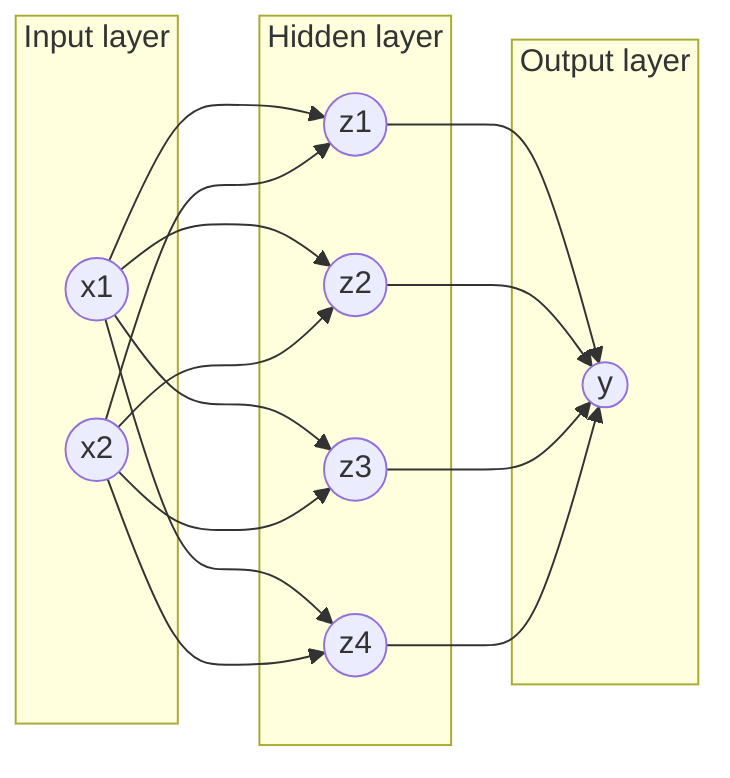
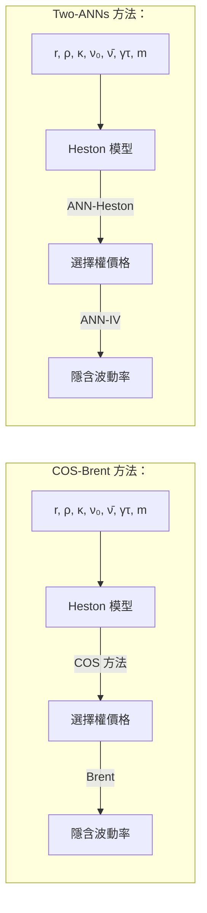

# Pricing options and computing implied volatilities using neural networks

> 原文檔案：`Pricing_options_and_computing_implied_volatilities_using_neural_networks.md`  
> 語言：繁體中文（臺灣，zh-TW）  
> 說明：由 LlamaParse Markdown 分段機器翻譯；公式、表格數字與檔名未改寫。

---

**定價選擇權與計算隱含波動率：使用類神經網路**

**Shuaiqiang Liu <sup>1,*</sup>, Cornelis W. Oosterlee <sup>1,2</sup> and Sander M.Bohte <sup>2</sup>**

<sup>1</sup> Applied Mathematics (DIAM), Delft University of Technology, Building 28, Mourik Broekmanweg 6, 2628 XE, Delft, Netherlands；  
<sup>2</sup> Centrum Wiskunde & Informatica, Science Park 123, 1098 XG, Amsterdam, Netherlands；  
<sup>*</sup> Correspondence: s.liu-4@tudelft.nl

初稿：2018年9月

**摘要：** 本文提出一種資料驅動的方法，透過人工類神經網路（Artificial Neural Network, ANN），用以加速選擇權定價與隱含波動率（implied volatility）的計算。由於類神經網路具有通用函數逼近器的特性，此方法先以精密金融模型所產生的資料集訓練一個最佳化的ANN，之後將訓練完成的ANN作為原求解器的代理，以快速且高效的方式運行。我們在三種不同類型的求解器上測試此方法，包括Black-Scholes方程式的解析解、Heston隨機波動率模型的COS方法，以及用於計算隱含波動率的Brent迭代求根法。數值結果顯示，ANN求解器能顯著降低計算時間。

**關鍵詞：** 機器學習；類神經網路；計算財務；選擇權定價；隱含波動率；GPU；Black-Scholes；Heston

---

arXiv:1901.08943v2 [q-fin.CP] 23 Apr 2019

## **1. 緒論**

在計算財務領域，數值方法普遍用於金融衍生性商品的定價以及現代風險管理。一般而言，先進的金融資產模型能夠捕捉金融市場中所觀察到的非線性特徵。然而，這些資產價格模型通常為多維度，因此無法得出選擇權價值的封閉解。

因此，發展出各種數值方法來求解對應的選擇權定價偏微分方程式（PDE）問題，例如有限差分法、傅立葉方法與蒙地卡羅模擬。在金融衍生性商品定價的脈絡中，存在一個必須將資產模型校準至市場資料的階段。換言之，資產價格模型中的開放參數需要被擬合。此校準過程通常*不*使用歷史資產價格，而是透過*選擇權價格*，亦即在所謂的風險中性機率測度下，讓市場上大量交易的選擇權價格與數學模型所計算出的選擇權價格相匹配。在模型校準的情況下，為了擬合這些資產參數，必須計算數千個選擇權價格。然而，由於高度高效計算的要求，某些高品質的資產模型因此被捨棄。在金融風險管理中，高效的數值計算也日益重要，特別是在處理即時風險管理（例如高頻交易）或交易對手信用風險問題時，此時效率與準確度之間的取捨似乎常常無法避免。

人工神經網路（ANNs）具備多個隱藏層，已成為從大型資料集中萃取特徵與偵測模式的成功機器學習方法。針對特定任務存在不同的神經網路變體，例如用於影像辨識的卷積神經網路，以及用於時間序列分析的遞迴神經網路。眾所周知，人工神經網路（ANNs）能夠逼近非線性函數[1]、[2]、[3]，因此可用來逼近偏微分方程（PDEs）的解[4]、[5]。資料科學的最新進展顯示，即使是高度非線性的多維函數，運用深度學習技術也能夠精確地加以表示[6]。本質上，人工神經網路（ANNs）能夠

2 of 21

被用作強大的通用函數逼近器，而無需對輸入變數與輸出之間的函數關係假設任何數學形式。此外，人工神經網路（ANN）能輕易支援平行處理以加速評估，特別是在 GPU 上。

我們旨在利用經典的人工神經網路（ANN），透過學習期權定價方法的結果來加速期權估值。從計算的角度來看，人工神經網路不會因偏微分方程（PDE）的維度而受到太大影響。一個「ANN 求解器」通常被分解為兩個獨立的階段：訓練階段與測試（或預測）階段。在訓練階段中，人工神經網路透過由複雜模型及其對應數值求解器所產生的資料集來「學習」PDE 求解器。此階段通常相當耗時，但可以在離線狀態下完成。在測試階段，訓練好的模型即可被用來線上逼近期權解。人工神經網路的解通常可以表示為一系列矩陣乘法，這可以平行且極有效率地實作，特別是在使用 GPU 的情況下。因此，訓練後的人工神經網路能夠有效率地提供金融衍生性商品價格或其他數量，且精確期權定價的線上運算時間可能大幅減少，特別是對複雜的資產價格模型而言。我們將在本論文中展示，這種資料驅動的方法極具前景。

本文提出的方法試圖在一個統一的資料驅動人工神經網路架構下加速歐式期權的定價。人工神經網路用於期權定價已有數十年歷史。基本上存在兩個方向。其中之一是基於觀察到的市場期權價格與標的資產價值，應用基於人工神經網路的迴歸技術來擬合一個無模型、非參數的定價函數，例如可參見 <font color="blue">[7]</font>、<font color="blue">[8]</font>、<font color="blue">[9]</font>、<font color="blue">[10]</font>。此外，<font color="blue">[11]</font>、<font color="blue">[12]</font> 的作者設計了特殊的核函數，在預測期權價格時將先驗的金融知識納入神經網路之中。

**Output:**

另一個方向是利用人工神經網路（ANN）來提升基於模型的定價效能。透過人工神經網路加速傳統偏微分方程（PDE）求解器的研究興趣正快速成長。論文 <font color="blue">[13]</font>、<font color="blue">[14]</font>、<font color="blue">[15]</font> 利用強化學習來加速高維度隨機微分方程的求解。<font color="blue">[16]</font> 的作者提出一種稱為連續時間隨機梯度下降的優化演算法，並結合深度神經網路來為高維度美式選擇權定價。在 <font color="blue">[17]</font> 中，金融模型的定價效能則透過處理定價誤差系統性偏差的非參數學習方法獲得提升。當然，此一趨勢不僅發生在計算金融領域，也出現在其他以偏微分方程為核心的工程領域，例如計算流體力學，參見 <font color="blue">[18]</font>、<font color="blue">[19]</font>、<font color="blue">[5]</font>、<font color="blue">[20]</font>。本文的工作即屬於後者。在此，我們使用傳統求解器產生人工資料，接著訓練人工神經網路學習不同問題參數下的解。相較於 <font color="blue">[4]</font> 或 <font color="blue">[5]</font>，我們的資料驅動方法除了找出選擇權定價偏微分方程的解之外，還能發現變數與特定參數（即隱含波動率）之間的隱含關係。

本文的組織如下。第二節簡要介紹兩個基本的選擇權定價模型：Black-Scholes 模型與 Heston 隨機波動率偏微分方程。除了歐式選擇權定價外，我們也分析用於計算所謂隱含波動率（implied volatility）的根尋找方法的穩健性問題。第三節呈現所採用的人工神經網路及其適當的超參數。在訓練人工神經網路學習不同問題參數下金融模型的結果後，第四節展示數值的人工神經網路結果及其對應誤差。

## 2. 選擇權定價與資產模型

本節簡要介紹兩種資產模型：幾何布朗運動（geometric Brownian motion, GBM）資產模型，其對應 Black-Scholes 選擇權定價偏微分方程，以及 Heston 隨機波動率資產模型，其導致 Heston 偏微分方程。我們也討論隱含波動率的概念。本文以歐式選擇權合約作為範例，然而其他類型的選擇權也可以用類似方式納入考量。

## 2.1. Black-Scholes 偏微分方程式

資產價格的第一個模型為幾何布朗運動（GBM），

$$dS_t = \mu S_t dt + \sqrt{\nu} S_t dW_t^s, \tag{1}$$

其中 $S$ 為不支付股利的資產價格，$W^s$ 為 Wiener 過程，$t$ 為時間，$\mu$ 為漂移參數，而 $\nu$ 為變異數參數。波動率參數則為 $\sigma = \sqrt{\nu}$。基礎股票價格上的歐式選擇權契約可透過 Black-Scholes 偏微分方程式（PDE）進行定價，該方程式可由 Itô 引理在複製投資組合方法下推導，或透過鞅方法得出。以選擇權價格表示為 $V(t, S)$，Black-Scholes 方程式如下：

$$\frac{\partial V}{\partial t} + \frac{1}{2} \sigma^2 S^2 \frac{\partial^2 V}{\partial S^2} + rS \frac{\partial V}{\partial S} - rV = 0, \tag{2}$$

其中 $t$ 為距離到期日 $T$ 的時間，$r$ 為無風險利率。此 PDE 需搭配最終條件以代表特定 payoff，例如歐式買權在到期日 $T$ 的 payoff 為：

$$V(t = T, S) = (S_0 - K)^+, \tag{3}$$

其中 $K$ 為選擇權的履約價格。有關金融數學基礎知識的更多資訊，請參閱標準教科書。

對於歐式普通香草選擇權（plain vanilla options），方程式 (2)、(3) 存在解析解，即：

$$V_c(t, S) = SN(d_1) - Ke^{-r\tau} N(d_2), \tag{4a}$$

$$d_1 = \frac{\log(S/K) + (r - 0.5\sigma^2)\tau}{\sigma\sqrt{\tau}}, \quad d_2 = d_1 - \sigma\sqrt{\tau}, \tag{4b}$$

其中 $\tau := T - t$，$V_c(t, S)$ 表示股票價值為 $S$ 時在時間 $t$ 的歐式買權價值，而 $N(\cdot)$ 表示常態分布。此求解程序 (4) 記為 $V(\cdot) = BS(\cdot)$。

### 2.1.1. 隱含波動率

隱含波動率（implied volatility）在金融領域被視為重要指標。給定觀察到的市場選擇權價格 $V^{mkt}$，Black-Scholes 隱含波動率 $\sigma^*$ 可透過求解 $BS(\sigma^*; S, K, \tau, r) = V^{mkt}$ 來確定。由於 Black-Scholes 方程式對波動率具有單調性，因此保證存在 $\sigma^* \in [0, +\infty]$。我們可將隱含波動率寫成隱函數形式：

$$\sigma^*(K, T) = BS^{-1}(V^{mkt}; S, K, \tau, r), \tag{5}$$

其中 $BS^{-1}$ 表示 Black-Scholes 函數的反函數。此外，透過採用價內程度（moneyness）$m = \frac{S_t}{K}$ 與剩餘到期時間 $\tau = T - t$，可將隱含波動率表示為 $\sigma^*(m, \tau)$，詳見 [21]。

為簡便起見，此處以 $\sigma^*$ 代表 $\sigma^*(m, \tau)$。方程式 (5) 不存在解析解。$\sigma^*$ 的值需透過數值迭代技術求得，因為方程式 (5) 可轉換為求根問題：

$$g(\sigma^*) = BS(S, \tau, K, r, \sigma^*) - V^{mkt}(S, \tau; K) = 0. \tag{6}$$

## 2.2. Heston 模型

使用 Black-Scholes 模型的限制之一，在於其假設方程式 (2)、(4) 中的波動率 $\sigma$ 為常數。資產定價中脫離常數波動率假設的重要建模進展，是將*波動率／變異數建模為擴散過程*。由此產生的模型即為隨機波動率（stochastic volatility, SV）模型。將波動率視為隨機變數的理念，已被實務金融資料所證實，這些資料顯示股票價格的波動率具有變動且難以預測的特性。

4 of 21

認為波動率為隨機過程的最重要理由，是金融市場資料中所呈現的隱含波動率微笑/偏斜（implied volatility smile/skew），而隨機波動率（SV）模型能夠準確地重現此現象，特別是對於剩餘到期時間 $T$ 為中長期之選擇權。引入一個與資產價格過程 $S_t$ 具有相關性的額外隨機過程後，我們面對的是一個**隨機微分方程組（system of SDEs）**，其選擇權定價的計算成本遠高於僅含單一資產價格過程的情況。

最廣為使用的隨機波動率模型是 Heston 模型<u>[22]</u>，在風險中性測度下，其隨機方程組如下：

$$dS_t = rS_t dt + \sqrt{\nu_t} S_t dW_t^s, S_{t_0} = S_0,$$ (7a)
$$d\nu_t = \kappa(\bar{\nu} - \nu_t)dt + \gamma \sqrt{\nu_t} dW_t^\nu, \nu_{t_0} = \nu_0,$$ (7b)
$$dW_t^s dW_t^\nu = \rho dt,$$ (7c)

其中 $\nu_t$ 為瞬時變異數（instantaneous variance），$W_t^s$ 與 $W_t^\nu$ 是兩個相關係數為 $\rho$ 的 Wiener 過程。式 (7) 中的第二個方程式描述變異數的均值回復過程，其參數包括：$r$ 為無風險利率，$\bar{\nu}$ 為長期變異數，$\kappa$ 為回復速度；$\gamma$ 則是變異數的波動率，決定了 $\nu_t$ 的波動程度。此外還有一個初始參數 $\nu_0$，即 $t_0$ 時刻的變異數值。

透過鞅方法（martingale approach），可推導出下列多維度的 Heston 選擇權定價偏微分方程式：

$$
\begin{aligned}
\frac{\partial V}{\partial t} \quad + \quad rS \frac{\partial V}{\partial S} + \kappa(\bar{\nu} - \nu) \frac{\partial V}{\partial \nu} + \frac{1}{2} \nu S^2 \frac{\partial^2 V}{\partial S^2} \\
\quad + \quad \rho \gamma S \nu \frac{\partial^2 V}{\partial S \partial \nu} + \frac{1}{2} \gamma^2 \nu \frac{\partial^2 V}{\partial \nu^2} - rV = 0.
\end{aligned}
$$ (8)

市場中常見的隱含波動率形狀，例如微笑或偏斜，可透過調整上述參數集合 $\{\kappa, \rho, \gamma, \nu_0, \bar{\nu}\}$ 來重現。一般而言，參數 $\gamma$ 影響資產報酬率分布的峰度（kurtosis），而相關係數 $\rho$ 則控制其不對稱性。Heston 模型並無解析解，因此必須以數值方法求解。

選擇權定價的數值方法大致可分為三類：有限差分法（finite differences, FD）、蒙地卡羅（Monte Carlo, MC）模擬，以及數值積分法。有限差分法常用於自由邊界問題，例如美式選擇權的定價，或某些奇異選擇權如障礙選擇權。此方法亦能精確計算選擇權價格的敏感度（即所謂的選擇權 Greeks）。

蒙地卡羅模擬與數值積分則依據 Feynman-Kac 定理，該定理指出（歐式）選擇權的價值可表示為風險中性測度下，選擇權到期日 $T$ 之 payoff 函數的折現期望值。蒙地卡羅方法常用於路徑依賴型高維度選擇權的定價，以及現代風險管理中各類估值調整（valuation adjustments）的計算。然而，蒙地卡羅方法通常收斂速度較慢，在模型校準（model calibration）的應用中，這可能構成顯著的問題。

數值積分方法同樣是基於 Feynman-Kac 定理。運用這些方法的最佳方式是先轉換到傅立葉域。資產價格的特徵函數（characteristic function）的可用性是使用傅立葉技術的先決條件。在此脈絡中，其中一種高效的技術是 COS 方法<u>[23]</u>，它利用傅立葉餘弦級數展開來逼近資產價格的機率密度函數，但其基礎仍是特徵函數。COS 方法可用來在 Heston 模型下極有效率地計算歐式選擇權價值。然而，對於許多不同的現代資產模型而言，特徵函數通常並不可得。我們在此將使用 Heston 模型搭配 COS 方法來訓練 Heston-ANN，以便訓練時間仍能保持相對較短。

## 2.3. 隱含波動率的數值方法

聚焦於隱含波動率 $\sigma^*$，有幾種迭代數值技術可用來求解 (6)，例如 Newton-Raphson 方法、二分法或 Brent 方法。Newton-Raphson 迭代式如下：

$$ \sigma_{k+1}^* = \sigma_k^* - \frac{V(\sigma_k^*) - V^{<sup>mkt</sup>}}{g'(\sigma_k^*)}, k = 0, \dots. \eqno(9) $$

從初始猜測值 $\sigma_0^*$ 開始，近似解 $\sigma_{k+1}^*$（$k = 0, \dots$）會透過迭代不斷改善，直到滿足特定收斂準則為止。式 (9) 分母中的 Black-Scholes 選擇權價值對波動率的一階偏導數，即選擇權的 Vega（vega），對於歐式選擇權可透過解析方式獲得。

<table>
<caption>訓練損失的歷史 — 系列：固定學習率、衰減學習率、循環學習率；以 Epoch 為單位的 log(MSE)</caption>
<thead>
<tr>
<th>Epoch</th>
<th>固定學習率 (Constant LR)</th>
<th>衰減學習率 (Decay LR)</th>
<th>循環學習率 (Cyclical LR)</th>
</tr>
</thead>
<tbody>
<tr><th>0</th><td>-7</td><td>-7</td><td>-7</td></tr>
<tr><th>50</th><td>-12.5</td><td>-12.5</td><td>-12.5</td></tr>
<tr><th>100</th><td>-13</td><td>-13</td><td>-13</td></tr>
<tr><th>150</th><td>-13.5</td><td>-13.5</td><td>-13.5</td></tr>
<tr><th>200</th><td>-13.8</td><td>-13.8</td><td>-13.8</td></tr>
<tr><th>250</th><td>-14</td><td>-14</td><td>-14</td></tr>
<tr><th>300</th><td>-14.2</td><td>-14.2</td><td>-14.2</td></tr>
<tr><th>350</th><td>-14.3</td><td>-14.3</td><td>-14.3</td></tr>
<tr><th>400</th><td>-14.4</td><td>-14.4</td><td>-14.4</td></tr>
<tr><th>450</th><td>-14.5</td><td>-14.5</td><td>-13.5</td></tr>
<tr><th>500</th><td>-14.5</td><td>-14.5</td><td>-17</td></tr>
<tr><th>550</th><td>-14.5</td><td>-14.5</td><td>-13.5</td></tr>
<tr><th>600</th><td>-14.5</td><td>-14.5</td><td>-14</td></tr>
<tr><th>650</th><td>-14.5</td><td>-14.5</td><td>-14.5</td></tr>
<tr><th>700</th><td>-14.5</td><td>-14.5</td><td>-15</td></tr>
<tr><th>750</th><td>-14.5</td><td>-14.5</td><td>-16</td></tr>
<tr><th>800</th><td>-14.5</td><td>-14.5</td><td>-16.5</td></tr>
<tr><th>850</th><td>-14.5</td><td>-14.5</td><td>-14.5</td></tr>
<tr><th>900</th><td>-14.5</td><td>-14.5</td><td>-14</td></tr>
<tr><th>950</th><td>-14.5</td><td>-14.5</td><td>-14</td></tr>
<tr><th>1000</th><td>-14.5</td><td>-16.5</td><td>-9.5</td></tr>
<tr><th>1050</th><td>-14.5</td><td>-17</td><td>-14</td></tr>
<tr><th>1100</th><td>-14.5</td><td>-17</td><td>-14.5</td></tr>
<tr><th>1150</th><td>-14.5</td><td>-17</td><td>-15</td></tr>
<tr><th>1200</th><td>-14.5</td><td>-17</td><td>-15.5</td></tr>
<tr><th>1250</th><td>-14.5</td><td>-17</td><td>-16</td></tr>
<tr><th>1300</th><td>-14.5</td><td>-17</td><td>-16.5</td></tr>
<tr><th>1350</th><td>-14.5</td><td>-17</td><td>-17</td></tr>
<tr><th>1400</th><td>-14.5</td><td>-17</td><td>-14.5</td></tr>
<tr><th>1450</th><td>-14.5</td><td>-17</td><td>-14</td></tr>
<tr><th>1500</th><td>-14.5</td><td>-17</td><td>-10.5</td></tr>
<tr><th>1550</th><td>-14.5</td><td>-17</td><td>-14</td></tr>
<tr><th>1600</th><td>-14.5</td><td>-17</td><td>-14.5</td></tr>
<tr><th>1650</th><td>-14.5</td><td>-17</td><td>-15</td></tr>
<tr><th>1700</th><td>-14.5</td><td>-17</td><td>-15.5</td></tr>
<tr><th>1750</th><td>-14.5</td><td>-17</td><td>-16</td></tr>
<tr><th>1800</th><td>-14.5</td><td>-17</td><td>-16.5</td></tr>
<tr><th>1850</th><td>-14.5</td><td>-17</td><td>-16.5</td></tr>
<tr><th>1900</th><td>-14.5</td><td>-17</td><td>-16</td></tr>
<tr><th>1950</th><td>-14.5</td><td>-17</td><td>-15.5</td></tr>
<tr><th>2000</th><td>-14.5</td><td>-17</td><td>-14.5</td></tr>
<tr><th>2050</th><td>-14.5</td><td>-17</td><td>-14</td></tr>
<tr><th>2100</th><td>-14.5</td><td>-17</td><td>-10.5</td></tr>
<tr><th>2150</th><td>-14.5</td><td>-17</td><td>-14</td></tr>
<tr><th>2200</th><td>-14.5</td><td>-17</td><td>-14.5</td></tr>
<tr><th>2250</th><td>-14.5</td><td>-17</td><td>-15</td></tr>
<tr><th>2300</th><td>-14.5</td><td>-17</td><td>-15.5</td></tr>
<tr><th>2350</th><td>-14.5</td><td>-17</td><td>-16</td></tr>
<tr><th>2400</th><td>-14.5</td><td>-17</td><td>-16.5</td></tr>
<tr><th>2450</th><td>-14.5</td><td>-17</td><td>-17</td></tr>
<tr><th>2500</th><td>-14.5</td><td>-17</td><td>-16.5</td></tr>
<tr><th>2550</th><td>-14.5</td><td>-17</td><td>-16</td></tr>
<tr><th>2600</th><td>-14.5</td><td>-17</td><td>-15.5</td></tr>
<tr><th>2650</th><td>-14.5</td><td>-17</td><td>-15</td></tr>
<tr><th>2700</th><td>-14.5</td><td>-17</td><td>-14.5</td></tr>
<tr><th>2750</th><td>-14.5</td><td>-17</td><td>-14</td></tr>
<tr><th>2800</th><td>-14.5</td><td>-17</td><td>-11</td></tr>
<tr><th>2850</th><td>-14.5</td><td>-17</td><td>-14</td></tr>
<tr><th>2900</th><td>-14.5</td><td>-17</td><td>-14.5</td></tr>
<tr><th>2950</th><td>-14.5</td><td>-17</td><td>-15.5</td></tr>
<tr><th>3000</th><td>-14.5</td><td>-17</td><td>-16.5</td></tr>
</tbody>
</table>

<table>
  <caption>**(b)** Vega 與價內程度 — 區域：ITM、ATM、OTM</caption>
  <thead>
    <tr>
      <th>價內程度</th>
      <th>區域</th>
      <th>Vega</th>
    </tr>
  </thead>
  <tbody>
    <tr>
      <th>0.0</th>
      <td>ITM</td>
      <td>0.000</td>
    </tr>
    <tr>
      <th>0.1</th>
      <td>ITM</td>
      <td>0.000</td>
    </tr>
    <tr>
      <th>0.2</th>
      <td>ITM</td>
      <td>0.000</td>
    </tr>
    <tr>
      <th>0.3</th>
      <td>ITM</td>
      <td>0.000</td>
    </tr>
    <tr>
      <th>0.4</th>
      <td>ITM</td>
      <td>0.000</td>
    </tr>
    <tr>
      <th>0.5</th>
      <td>ITM</td>
      <td>0.002</td>
    </tr>
    <tr>
      <th>0.6</th>
      <td>ITM</td>
      <td>0.025</td>
    </tr>
    <tr>
      <th>0.7</th>
      <td>ITM</td>
      <td>0.100</td>
    </tr>
    <tr>
      <th>0.8</th>
      <td>ITM</td>
      <td>0.235</td>
    </tr>
    <tr>
      <th>0.9</th>
      <td>ITM</td>
      <td>0.355</td>
    </tr>
    <tr>
      <th>1.0</th>
      <td>ATM</td>
      <td>0.380</td>
    </tr>
    <tr>
      <th>1.1</th>
      <td>OTM</td>
      <td>0.320</td>
    </tr>
    <tr>
      <th>1.2</th>
      <td>OTM</td>
      <td>0.215</td>
    </tr>
    <tr>
      <th>1.3</th>
      <td>OTM</td>
      <td>0.125</td>
    </tr>
    <tr>
      <th>1.4</th>
      <td>OTM</td>
      <td>0.065</td>
    </tr>
    <tr>
      <th>1.5</th>
      <td>OTM</td>
      <td>0.030</td>
    </tr>
    <tr>
      <th>1.6</th>
      <td>OTM</td>
      <td>0.012</td>
    </tr>
    <tr>
      <th>1.7</th>
      <td>OTM</td>
      <td>0.005</td>
    </tr>
    <tr>
      <th>1.8</th>
      <td>OTM</td>
      <td>0.002</td>
    </tr>
    <tr>
      <th>1.9</th>
      <td>OTM</td>
      <td>0.001</td>
    </tr>
    <tr>
      <th>2.0</th>
      <td>OTM</td>
      <td>0.000</td>
    </tr>
    <tr>
      <th>2.1</th>
      <td>OTM</td>
      <td>0.000</td>
    </tr>
    <tr>
      <th>2.2</th>
      <td>OTM</td>
      <td>0.000</td>
    </tr>
    <tr>
      <th>2.3</th>
      <td>OTM</td>
      <td>0.000</td>
    </tr>
    <tr>
      <th>2.4</th>
      <td>OTM</td>
      <td>0.000</td>
    </tr>
    <tr>
      <th>2.5</th>
      <td>OTM</td>
      <td>0.000</td>
    </tr>
  </tbody>
</table>

**圖 1.** Vega 在深度價內 (ITM) 或深度價外 (OTM) 期權的某些區域趨近於零。

然而，Newton-Raphson 方法可能無法收斂，特別是當 Vega 極小時或收斂停滯時。Black-Scholes 方程式將無界區間 $\sigma \in [0, +\infty)$ 單調對映到有限範圍 $V(t, S) \in [0, S_t - Ke^{-r\tau}]$，而期權 Vega 在某些 $\sigma$ 區域可能非常接近零，尤其是當期權處於深度價內 (deep ITM) 或深度價外 (deep OTM) 時。圖 1(b) 顯示 Vega 在價平 (ATM) 區域相對較大，但在深度價內或深度價外期權的小波動率或大波動率區域則呈現近乎平坦的函數形狀。解決此問題的一種穩健根尋找替代方法是採用 Newton-Raphson 與二分法 (bisection method) 的混合演算法。或者，文獻 [24] 的作者建議在迭代開始時選擇適當的初始值以避免發散。在下一小節中，我們將討論一種無需導數、穩健且高效的演算法來求解隱含波動率 (implied volatility)。

### 2.3.1. Brent 方法求解隱含波動率

Brent 方法[25]是一種不需導數、穩健且高效的演算法，它結合了二分法、反二次插值法與割線法。為了決定下一個迭代值，反二次插值法會使用三個先前的點（即迭代值）來擬合一個反二次函數，此做法類似於 Newton 方法的梯度概念，即

$$
\begin{aligned}
\sigma_{k+1} &= \frac{\sigma_k g(\sigma_{k-1})g(\sigma_{k-2})}{(g(\sigma_k) - g(\sigma_{k-1}))(g(\sigma_k) - g(\sigma_{k-2}))} \\
&+ \frac{\sigma_{k-1} g(\sigma_{k-2})g(\sigma_k)}{(g(\sigma_{k-1}) - g(\sigma_{k-2}))(g(\sigma_{k-1}) - g(\sigma_k))} \quad (10) \\
&+ \frac{\sigma_{k-2} g(\sigma_{k-1})g(\sigma_k)}{(g(\sigma_{k-2}) - g(\sigma_{k-1}))(g(\sigma_{k-2}) - g(\sigma_k))}.
\end{aligned}
$$

當兩個連續的近似值相同，例如 $\sigma_k = \sigma_{k-1}$ 時，二次插值法會被割線法（secant method）的近似式取代：

$$
\sigma_{k+1} = \sigma_{k-1} - g(\sigma_{k-1}) \frac{\sigma_{k-1} - \sigma_{k-2}}{g(\sigma_{k-1}) - g(\sigma_{k-2})}. \quad (11)
$$

本文使用 Brent 方法來計算第 4.4.2 節中與 Heston 選擇權價格相關的 Black-Scholes 隱含波動率（BS implied volatility）。我們將開發一個人工神經網路（ANN）來逼近波動率與選擇權價格之間的隱函數。

## 3. **方法論**

在本節中，我們提出一個用來逼近金融模型函數的神經網路。此程序包含兩個主要組成部分：產生訓練資料的生成器（generator），以及用來根據訓練模型預測選擇權價格的預測器（即人工神經網路）。此資料驅動架構包含以下步驟：

---
**演算法 1** 模型架構
---
- 產生輸入參數的樣本資料點，
- 計算對應的輸出（選擇權價格或隱含波動率），形成包含輸入與輸出的完整資料集，
- 將上述資料集分割為訓練集與測試集，
- 在訓練資料集上訓練人工神經網路，
- 在測試資料集上評估人工神經網路，
- 在實際應用中以訓練完成的人工神經網路取代原有的求解器。
---

### 3.1. 人工神經網路

人工神經網路（ANN）通常由三個層級的組成元件構成，由下而上分別為神經元（neurons）、層（layers）與整體架構（architecture）。整體架構是由不同層組合而成，而每一層又由大量的人工神經元所組成。神經元是人工神經網路的基本單位，其中包含可學習的權重（weights）與偏差（biases）。透過連接相鄰層的神經元，前一層的輸出訊號會作為下一層的輸入訊號。將多層堆疊起來後，訊號從輸入層出發，穿過隱藏層到達輸出層，此過程可能包含循環或遞迴連結，最終人工神經網路便能在輸入－輸出配對之間建立映射關係。

如圖 2a 所示，一個人工神經元基本上由以下三個連續運算所組成：

1. 計算加權輸入的總和，
2. 將偏差加到該總和上，
3. 透過轉移函數（transfer function）計算輸出值。

7 of 21

```mermaid
graph LR
    subgraph Neuron
    direction LR
    weights[weights]
    bias[bias]
    activation[activation]
    sum((Σ))
    phi[φ(·)]
    end

    x1((x1)) --> sum
    x2((x2)) --> sum
    xn((xn)) --> sum
    
    weights -- w1 --> sum
    weights -- w2 --> sum
    weights -- wn --> sum
    bias --> sum
    sum --> phi
    phi --> z(z)

    style Neuron stroke-dasharray: 5 5
```

**(a)** 一個神經元



**(b)** 多層感知器範例

**圖 2.** 多層感知器（MLP）架構示意圖。

多層感知器（multi-layer perceptron, MLP）由至少三層所組成，是人工神經網路（ANN）最簡化的版本。數學上，MLP 可由以下參數定義：

$$\boldsymbol{\theta} = (\mathbf{W}_1, \mathbf{b}_1, \mathbf{W}_2, \mathbf{b}_2, ..., \mathbf{W}_L, \mathbf{b}_L) \tag{12}$$

其中 $\mathbf{W}_j$ 為第 $j$ 層的權重矩陣，$\mathbf{b}_j$ 為第 $j$ 層的偏差向量。函數可表示為：

$$y(\mathbf{x}) = F(\mathbf{x}|\boldsymbol{\theta}). \tag{13}$$

令 $z_j^{(l)}$ 表示第 $l$ 層中第 $j$ 個神經元的值，則其對應的傳遞函數為：

$$z_j^{(l)} = \varphi^{(l)} \left( \sum_i w_{ij}^{(l)} z_i^{(l-1)} + b_j^{(l)} \right), \tag{14}$$

其中 $z_i^{(l-1)}$ 為第 $(l-1)$ 層中第 $i$ 個神經元的輸出值，$\varphi(\cdot)$ 為激活函數（activation function），且 $w_{ij}^{(l)} \in \mathbf{W}_l$，$b_j^{(l)} \in \mathbf{b}_l$。當 $l=0$ 時，$z^{(0)} = x$ 為輸入層；當 $l=L$ 時，$z^{(L)} = y$ 為輸出層；其餘情況下，$z^{(l)}$ 代表中間變數。激活函數 $\varphi(\cdot)$ 為系統引入非線性，例如可採用以下激活函數：

*   ReLU，$\varphi(x) = \max(x, 0)$，
*   Sigmoid，$\varphi(x) = \frac{1}{1 + e^{-x}}$，
*   Leaky ReLU，$\varphi(x) = \max(x, ax), 0 < a < 1$；

更多激活函數可參見 [6]。式 (15) 為具有「單一隱藏層」之 MLP 的公式範例：

$$\begin{cases} y = \varphi^{(2)} \left( \sum_j w_j^{(2)} z_j^{(1)} + b^{(2)} \right) \\ z_j^{(1)} = \varphi^{(1)} \left( \sum_i w_{ij}^{(1)} x_i + b_j^{(1)} \right). \end{cases} \tag{15}$$

根據通用逼近定理（Universal Approximation Theorem）[1]，具有足夠多神經元的單隱藏層人工神經網路能夠逼近任意連續函數。兩個函數之間的距離以函數範數 $||\cdot||$ 衡量：

$$D(f(\mathbf{x}), F(\mathbf{x})) = ||f(\mathbf{x}) - F(\mathbf{x})||, \tag{16}$$

8 of 21

其中 $f(x)$ 是目標函數，$F(x)$ 是由神經網路逼近的函數。例如，$p$-範數可表示為

$$||f(x) - F(x|\theta)||_p = \sqrt[p]{\int_{x} |f(x) - F(x|\theta)|^p d\mu(x)},$$

其中 $1 \leq p < \infty$，且 $\mu(x)$ 是定義在空間 $X$ 上的測度。我們選擇 $p=2$ 來評估平均準確度，此即對應於均方誤差（mean squared error, MSE）。在監督式學習中，損失函數等同於上述距離：

$$L(\theta) := D(f(x), F(x|\theta)). \tag{17}$$

訓練過程的目標是學習式（13）中的最佳權重與偏差，使損失函數的值盡可能小。此過程可表述為一個最佳化問題：

$$arg \min_{\theta} L(\theta | x, y), \tag{18}$$

給定已知的輸入－輸出配對 $(x, y)$ 與損失函數 $L(\theta)$。

已有許多反向傳播梯度下降法 <u>[26]</u> 被成功應用於求解式（18），例如隨機梯度下降（Stochastic Gradient Descent, SGD）及其變體 Adam 與 RMSprop。這些最佳化演算法從初始值出發，沿著損失函數下降的方向移動。參數更新的公式如下：

$$
\begin{cases}
W \leftarrow W - \eta(i) \frac{\partial L}{\partial W}, \\
b \leftarrow b - \eta(i) \frac{\partial L}{\partial b}, \\
i = 0, 1, 2, ...,
\end{cases} \tag{19}
$$

其中 $\eta$ 為學習率，其值可在迭代過程中變化。學習率在訓練過程中扮演重要角色：若學習率「過大」，會導致人工神經網路（ANN）的收斂產生振盪；而學習率過小則會使 ANN 學習速度過慢，甚至陷入局部最佳解區域。因此通常偏好使用自適應學習率，詳細說明將於第 <u>3.3</u> 節提供。

## 3.2. 超參數最佳化

訓練深度神經網路需對眾多所謂「超參數」（hyper-parameters）進行選擇，包括網路層數、神經元數量以及特定的激活函數。決定人工神經網路的深度（隱藏層數量）與寬度（神經元數量）是一項具有挑戰性的問題。

我們透過實驗發現，具備四個隱藏層的多層感知器（MLP）架構，對目前所關注的選擇權定價公式具有最佳的逼近能力。在四隱藏層架構的基礎上，其餘超參數則採用自動機器學習 <u>[27]</u> 進行最佳化。實現自動搜尋的方法有數種。在網格搜尋（grid search）技術中，所有候選參數會在一預先定義的網格上系統性地參數化，並以窮舉方式探索所有可能的候選組合。<u>[28]</u> 的作者認為隨機搜尋（random search）在超參數最佳化上更有效率。最近，貝氏超參數最佳化（Bayesian hyper-parameter optimization）已被發展出來，透過在超參數空間中導航以有效降低計算成本。然而，在結合特定專家知識的情況下，仍難以超越隨機搜尋的表現。

Neural networks 不一定會收斂到全域最小值。然而，使用適當的 *random initialization*（隨機初始化）可以幫助模型獲得合適的初始值。*Batch normalization*（批次正規化）會先減去批次的平均值，再除以批次的標準差，藉此對某一層的輸出進行縮放。此方法能夠加速神經網路的訓練。Batch size 表示在單一次迭代中，進入模型以更新可學習參數的樣本數量。*Dropout operation*（丟棄操作）則是從

（注意：本 chunk 原文於句中截斷，故翻譯亦維持未完形式以符合原始 Markdown 結構）

**隨機丟棄（dropout）** 是指在訓練過程中，隨機選擇一組神經元並將其停用，迫使網路學習更穩健的特徵。丟棄率（dropout rate）指的是某一層中被停用神經元的比例。

超參數優化分為兩個階段完成。在模型選擇過程中，可採用 *k*-fold cross validation（k 折交叉驗證）來降低過擬合（over-fitting），其步驟如下。

---
**演算法 2** *k* 折交叉驗證
---
- 將訓練資料集分割成 *k* 個不同的子集，
- 選擇其中一個子集作為驗證資料集，
- 在其餘 *k*-1 個子集上訓練模型，
- 將訓練好的模型在驗證資料上進行評估並計算指標，
- 重複上述步驟，直到探索完所有子集，
- 計算 *k* 次結果的平均指標作為最終指標，
- 探索下一組超參數，
- 依據平均指標對候選模型進行排序。
---

<table>
  <caption>**表 1.** 隨機搜尋超參數優化的設定</caption>
  <thead>
    <tr>
      <th>參數</th>
      <th>選項或範圍</th>
    </tr>
  </thead>
  <tbody>
    <tr>
      <td>Activation（激活函數）</td>
      <td>ReLu, tanh, sigmoid, elu</td>
    </tr>
    <tr>
      <td>Dropout rate（丟棄率）</td>
      <td>[0.0, 0.2]</td>
    </tr>
    <tr>
      <td>Neurons（神經元數）</td>
      <td>[200, 600]</td>
    </tr>
    <tr>
      <td>Initialization（權重初始化）</td>
      <td>uniform, glorot_uniform, he_uniform</td>
    </tr>
    <tr>
      <td>Batch normalization（批次正規化）</td>
      <td>yes, no</td>
    </tr>
    <tr>
      <td>Optimizer（優化器）</td>
      <td>SGD, RMSprop, Adam</td>
    </tr>
    <tr>
      <td>Batch size（批次大小）</td>
      <td>[256, 3000]</td>
    </tr>
  </tbody>
</table>

在第一階段，我們採用隨機搜尋（random search）結合 3 折交叉驗證，來找出類神經網路的初始超參數組合。如表 1 所示，每個模型皆訓練 200 個 epoch（訓練週期），並以 MSE 作為損失函數指標。一個 epoch 是指模型已完整處理整個訓練資料集一次。預測準確度會隨著訓練資料集規模增加而提升（詳細討論請見第 4.1 節）。隨機搜尋是在較小的資料集上執行，之後再於第二階段使用較大的資料集來訓練所選定的類神經網路（ANN）。

<table>
  <caption>表 2. 隨機搜尋後選定的模型</caption>
  <thead>
    <tr>
      <th>參數</th>
      <th>設定值</th>
    </tr>
  </thead>
  <tbody>
    <tr>
      <td>Hidden layers（隱藏層數）</td>
      <td>4</td>
    </tr>
    <tr>
      <td>Neurons (each layer)（每層神經元數）</td>
      <td>400</td>
    </tr>
    <tr>
      <td>Activation（激活函數）</td>
      <td>ReLu</td>
    </tr>
    <tr>
      <td>Dropout rate（丟棄率）</td>
      <td>0.0</td>
    </tr>
    <tr>
      <td>Batch-normalization（批次正規化）</td>
      <td>No</td>
    </tr>
    <tr>
      <td>Initialization（權重初始化）</td>
      <td>Glorot_uniform</td>
    </tr>
    <tr>
      <td>Optimizer（優化器）</td>
      <td>Adam</td>
    </tr>
    <tr>
      <td>Batch size（批次大小）</td>
      <td>1024</td>
    </tr>
  </tbody>
</table>

在第二階段，我們進一步將前五名的網路組態進行平均，以產生最終的人工神經網路（ANN）模型，如表 2 所示。表 2 顯示，最佳參數值並未落在搜尋空間的邊界上（除了丟棄率之外）。批次正規化（batch normalization）與丟棄（drop-out）並未提升此迴歸問題的模型準確度，可能的原因之一是輸出值對輸入參數相當敏感，這與影像中稀疏特徵的情況不同（後者在這些操作通常表現良好）。隨後，我們在整個（訓練與驗證）資料集上訓練所選取的網路，以取得最終權重。此程序產生了一個具有足夠準確度的人工神經網路，可用來近似金融選擇權的價值。

## *3.3. 學習率*

學習率（learning rate）是其中一個關鍵的超參數，代表每次迭代中權重更新的速率。過大的學習率會導致在局部最小值附近產生波動，有時甚至造成發散。而過小的學習率則可能使訓練階段進展得極為緩慢且低效。常見的做法是從較大的學習率開始，然後逐步降低，直到獲得訓練良好的模型為止。在訓練過程中調整學習率的方式有很多，例如階梯式退火（step-wise annealing）、指數衰減（exponential decay）、餘弦退火（cosine annealing），詳見 [29] 關於循環學習率（CLR）以及 [30] 關於隨機梯度下降重啟（SDGR）的討論。CLR 與 SDGR 的基本概念是：在訓練過程的特定階段，使用相對較大的學習率可將權重從目前位置大幅移動，使人工神經網路（ANNs）得以脫離局部最優解，並收斂至更好的解。

我們採用 [29] 所提出的方法來決定學習率。此方法基於觀察平均訓練損失如何隨不同學習率變化：從一個很小的學習率開始，在最初幾次迭代中逐步增加。透過監測損失函數相對於學習率的變化，如圖 3 所示，當學習率很小時損失值趨於穩定，接著快速下降，最後在學習率過大時開始震盪並發散。最佳學習率落在 10<sup>−5</sup> 至 10<sup>−3</sup> 之間，此區間的斜率最陡峭，訓練損失下降最為迅速。因此，在我們的實驗中，CLR 的學習率從 10<sup>−3</sup> 逐漸降低至 10<sup>−5</sup>。

<table>
<caption>訓練損失的歷史 — 系列：固定學習率、衰減學習率、循環學習率；y軸：log(MSE)；x軸：訓練週期（Epoch）</caption>
<thead>
<tr>
<th>訓練週期</th>
<th>固定學習率</th>
<th>衰減學習率</th>
<th>循環學習率</th>
</tr>
</thead>
<tbody>
<tr><th>0</th><td></td><td></td><td>-7</td></tr>
<tr><th>50</th><td></td><td>-12</td><td>-11</td></tr>
<tr><th>100</th><td></td><td>-12.5</td><td>-12.5</td></tr>
<tr><th>150</th><td></td><td>-13</td><td>-13</td></tr>
<tr><th>200</th><td></td><td>-13.5</td><td>-13.5</td></tr>
<tr><th>250</th><td></td><td>-14</td><td>-14</td></tr>
<tr><th>300</th><td></td><td>-14</td><td>-14</td></tr>
<tr><th>350</th><td></td><td>-14.5</td><td>-14.5</td></tr>
<tr><th>400</th><td></td><td>-14.5</td><td>-13.5</td></tr>
<tr><th>450</th><td></td><td>-14.5</td><td>-13.5</td></tr>
<tr><th>500</th><td>-14.5</td><td>-14.5</td><td>-17</td></tr>
<tr><th>550</th><td>-14.5</td><td>-14.5</td><td>-14</td></tr>
<tr><th>600</th><td>-14.5</td><td>-14.5</td><td>-13.5</td></tr>
<tr><th>650</th><td>-14.5</td><td>-14.5</td><td>-14</td></tr>
<tr><th>700</th><td>-14.5</td><td>-14.5</td><td>-14.5</td></tr>
<tr><th>750</th><td>-14.5</td><td>-14.5</td><td>-15</td></tr>
<tr><th>800</th><td>-14.5</td><td>-16</td><td>-16</td></tr>
<tr><th>850</th><td>-14.5</td><td>-16.5</td><td>-14.5</td></tr>
<tr><th>900</th><td>-14.5</td><td>-16.5</td><td>-14</td></tr>
<tr><th>950</th><td>-14.5</td><td>-17</td><td>-14</td></tr>
<tr><th>1000</th><td>-14.5</td><td>-17</td><td>-17</td></tr>
<tr><th>1050</th><td>-14.5</td><td>-17</td><td>-14.5</td></tr>
<tr><th>1100</th><td>-14.5</td><td>-17</td><td>-14</td></tr>
<tr><th>1150</th><td>-14.5</td><td>-17</td><td>-14.5</td></tr>
<tr><th>1200</th><td>-14.5</td><td>-17</td><td>-15</td></tr>
<tr><th>1250</th><td>-14.5</td><td>-17</td><td>-15.5</td></tr>
<tr><th>1300</th><td>-14.5</td><td>-17</td><td>-16</td></tr>
<tr><th>1350</th><td>-14.5</td><td>-17</td><td>-16.5</td></tr>
<tr><th>1400</th><td>-14.5</td><td>-17</td><td>-17</td></tr>
<tr><th>1450</th><td>-14.5</td><td>-17</td><td>-16.5</td></tr>
<tr><th>1500</th><td>-14.5</td><td>-17</td><td>-11</td></tr>
<tr><th>1550</th><td>-14.5</td><td>-17</td><td>-14</td></tr>
<tr><th>1600</th><td>-14.5</td><td>-17</td><td>-14.5</td></tr>
<tr><th>1650</th><td>-14.5</td><td>-17</td><td>-14.5</td></tr>
<tr><th>1700</th><td>-14.5</td><td>-17</td><td>-14.5</td></tr>
<tr><th>1750</th><td>-14.5</td><td>-17</td><td>-15</td></tr>
<tr><th>1800</th><td>-14.5</td><td>-17</td><td>-15.5</td></tr>
<tr><th>1850</th><td>-14.5</td><td>-17</td><td>-16</td></tr>
<tr><th>1900</th><td>-14.5</td><td>-17</td><td>-16.5</td></tr>
<tr><th>1950</th><td>-14.5</td><td>-17</td><td>-16.5</td></tr>
<tr><th>2000</th><td>-14.5</td><td>-17</td><td>-17</td></tr>
<tr><th>2050</th><td>-15</td><td>-17</td><td>-14.5</td></tr>
<tr><th>2100</th><td>-14.5</td><td>-17</td><td>-14</td></tr>
<tr><th>2150</th><td>-14.5</td><td>-17</td><td>-14</td></tr>
<tr><th>2200</th><td>-14.5</td><td>-17</td><td>-14.5</td></tr>
<tr><th>2250</th><td>-14.5</td><td>-17</td><td>-14.5</td></tr>
<tr><th>2300</th><td>-14.5</td><td>-17</td><td>-15</td></tr>
<tr><th>2350</th><td>-14.5</td><td>-17</td><td>-15.5</td></tr>
<tr><th>2400</th><td>-14.5</td><td>-17</td><td>-16</td></tr>
<tr><th>2450</th><td>-14.5</td><td>-17</td><td>-16.5</td></tr>
<tr><th>2500</th><td>-14.5</td><td>-17</td><td>-11</td></tr>
<tr><th>2550</th><td>-14.5</td><td>-17</td><td>-14</td></tr>
<tr><th>2600</th><td>-14.5</td><td>-17</td><td>-14.5</td></tr>
<tr><th>2650</th><td>-14.5</td><td>-17</td><td>-14.5</td></tr>
<tr><th>2700</th><td>-14.5</td><td>-17</td><td>-14.5</td></tr>
<tr><th>2750</th><td>-14.5</td><td>-17</td><td>-15</td></tr>
<tr><th>2800</th><td>-14.5</td><td>-17</td><td>-15.5</td></tr>
<tr><th>2850</th><td>-14.5</td><td>-17</td><td>-16</td></tr>
<tr><th>2900</th><td>-14.5</td><td>-17</td><td>-16.5</td></tr>
<tr><th>2950</th><td>-14.5</td><td>-17</td><td>-17</td></tr>
<tr><th>3000</th><td>-15</td><td>-17</td><td>-17</td></tr>
</tbody>
</table>

<table>
  <caption>訓練損失的歷史 — **圖 4.** 使用 Heston 模型訓練人工神經網路的不同學習率排程。log(MSE) 對 Epoch。</caption>
  <thead>
    <tr>
      <th>Epoch</th>
      <th>固定學習率 (log(MSE))</th>
      <th>衰減學習率 (log(MSE))</th>
      <th>循環學習率 (log(MSE))</th>
    </tr>
  </thead>
  <tbody>
    <tr>
      <th>0</th>
      <td>-6.8</td>
      <td>-6.7</td>
      <td>-6.9</td>
    </tr>
    <tr>
      <th>250</th>
      <td>-13.4</td>
      <td>-13.3</td>
      <td>-14.2</td>
    </tr>
    <tr>
      <th>500</th>
      <td>-14.1</td>
      <td>-14.0</td>
      <td>-8.9</td>
    </tr>
    <tr>
      <th>750</th>
      <td>-14.4</td>
      <td>-14.3</td>
      <td>-14.5</td>
    </tr>
    <tr>
      <th>1000</th>
      <td>-14.6</td>
      <td>-16.1</td>
      <td>-9.6</td>
    </tr>
    <tr>
      <th>1250</th>
      <td>-14.7</td>
      <td>-16.9</td>
      <td>-14.8</td>
    </tr>
    <tr>
      <th>1500</th>
      <td>-14.8</td>
      <td>-17.1</td>
      <td>-10.8</td>
    </tr>
    <tr>
      <th>1750</th>
      <td>-14.9</td>
      <td>-17.2</td>
      <td>-15.8</td>
    </tr>
    <tr>
      <th>2000</th>
      <td>-15.0</td>
      <td>-17.4</td>
      <td>-10.5</td>
    </tr>
    <tr>
      <th>2250</th>
      <td>-15.1</td>
      <td>-17.4</td>
      <td>-15.8</td>
    </tr>
    <tr>
      <th>2500</th>
      <td>-15.1</td>
      <td>-17.4</td>
      <td>-10.9</td>
    </tr>
    <tr>
      <th>2750</th>
      <td>-15.2</td>
      <td>-17.4</td>
      <td>-16.5</td>
    </tr>
    <tr>
      <th>3000</th>
      <td>-15.2</td>
      <td>-17.5</td>
      <td>-17.2</td>
    </tr>
  </tbody>
</table>

我們以 Heston 模型選擇權價格的人工神經網路求解器訓練階段的結果為例，比較三種不同的學習率排程。圖 5 顯示訓練誤差與驗證誤差相當一致，且在使用這些排程時並未發生過擬合 (over-fitting) 的現象。如圖 4 所示，在本例中，基於衰減率的排程優於具有相同學習率邊界的循環學習率 (CLR)，儘管使用 CLR 時訓練與驗證損失之間的差異較小。這與 [29] 的結論相反，但他們的網路包含了批次正規化 (batch normalization) 與 L2 正則化。在本文的測試中，我們將採用循環學習率 (CLR) 來找出最佳的學習率範圍，然後將此範圍應用於衰減學習率 (DecayLR) 排程來訓練人工神經網路。

<table>
  <caption>**圖 5.** Heston 模型的訓練與驗證損失歷史。面板：(a) 使用衰減學習率的損失，(b) 使用循環學習率的損失。單位：log(MSE)。</caption>
  <thead>
    <tr>
      <th rowspan="2">Epoch</th>
      <th colspan="2">(a) 使用衰減學習率的損失</th>
      <th colspan="2">(b) 使用循環學習率的損失</th>
    </tr>
    <tr>
      <th>DecayLR-training</th>
      <th>DecayLR-validation</th>
      <th>CLR-training</th>
      <th>CLR-validation</th>
    </tr>
  </thead>
  <tbody>
    <tr>
      <th>0</th>
      <td>-6.8</td>
      <td>-6.8</td>
      <td>-6.8</td>
      <td>-8.9</td>
    </tr>
    <tr>
      <th>500</th>
      <td>-14.1</td>
      <td>-14.8</td>
      <td>-16.8</td>
      <td>-16.5</td>
    </tr>
    <tr>
      <th>1000</th>
      <td>-14.5</td>
      <td>-14.2</td>
      <td>-16.8</td>
      <td>-16.5</td>
    </tr>
    <tr>
      <th>1500</th>
      <td>-17.0</td>
      <td>-16.5</td>
      <td>-16.8</td>
      <td>-16.5</td>
    </tr>
    <tr>
      <th>2000</th>
      <td>-17.2</td>
      <td>-16.5</td>
      <td>-16.8</td>
      <td>-16.5</td>
    </tr>
    <tr>
      <th>2500</th>
      <td>-17.4</td>
      <td>-17.1</td>
      <td>-16.8</td>
      <td>-16.5</td>
    </tr>
    <tr>
      <th>3000</th>
      <td>-17.4</td>
      <td>-17.1</td>
      <td>-17.1</td>
      <td>-16.8</td>
    </tr>
  </tbody>
</table>

## 4. 數值結果

我們展示人工神經網路（ANNs）在求解金融模型上的表現，依據以下準確度指標（這些指標同時也是訓練的基礎），

$$
\text{MSE} = \frac{1}{n} \sum (y_i - \hat{y}_i)^2, \tag{20}
$$

其中 $y_i$ 為實際值，而 $\hat{y}_i$ 為人工神經網路（ANN）預測值。MSE 被用作訓練指標以更新權重，而上述所有指標皆用於評估所選定的 ANN。然而，為求完整性，我們也報告其他常見的評估指標：

$$
\text{RMSE} = \sqrt{\text{MSE}}, \tag{21a}
$$
$$
\text{MAE} = \frac{1}{n} \sum |y_i - \hat{y}_i|, \tag{21b}
$$
$$
\text{MAPE} = \frac{1}{n} \sum \frac{|y_i - \hat{y}_i|}{y_i}. \tag{21c}
$$

我們從 Black-Scholes 模型開始，該模型可提供閉形式選擇權價格，並由 ANN 進行學習。我們也訓練 ANN 學習隱含波動率（implied volatility），其基礎是迭代求根的 Brent 方法。最後，ANN 學習使用 COS 方法在不同參數下求解 Heston 模型的結果。

### 4.1 資料集的詳細說明

作為資料驅動的方法，資料集的品質會影響最終模型的表現。理論上，由於數學模型已知，可以產生任意數量的樣本。實際上，應優先選擇具有良好空間填充性質的抽樣技術。拉丁超立方抽樣（Latin hypercube sampling, LHS）[31] 能夠從多維分布中產生參數值的隨機樣本，從而更好地代表參數空間。當輸入參數的樣本資料集準備好後，我們選用適當的數值方法來產生訓練結果。對於 Black-Scholes 模型，選擇權價格由閉形式公式獲得。對於 Heston 模型，價格則由穩健版的 COS 方法計算得出。在確定 Heston 價格後，將使用 Brent 方法求取對應的隱含波動率（implied volatility）。整個資料集被隨機分割為兩組，90% 作為訓練集，10% 作為測試集。

**表 3.** 訓練 ANN 時不同大小的訓練資料集

<table>
  <caption>表 3. 訓練 ANN 時不同大小的訓練資料集</caption>
    <tr>
      <td>案例</td>
      <td>0</td>
      <td>1</td>
      <td>2</td>
      <td>3</td>
      <td>4</td>
      <td>5</td>
      <td>6</td>
    </tr>
    <tr>
      <td><u>訓練集大小（×24300）</u></td>
      <td><u>1/8</u></td>
      <td><u>1/4</u></td>
      <td><u>1/2</u></td>
      <td>1</td>
      <td>2</td>
      <td>4</td>
      <td>8</td>
    </tr>
</table>

為了探討預測準確度與訓練集大小之間的關係，我們將訓練樣本數從基準集的 $\frac{1}{8}$ 倍增加到 8 倍，同時保持測試資料不變。此處的範例是學習隱含波動率（implied volatility）。我們先對每個資料集使用第 3.3 節所述的衰減學習率進行 ANN 訓練，並對每個案例以不同隨機種子重複訓練階段 5 次，再平均模型表現。如圖 6 所示，隨著資料規模增加，預測準確度提升，且由誤差棒所示的對應變異數也隨之下降。因此，我們在小型資料集上使用隨機搜尋進行超參數優化，並在大型資料集上訓練所選定的 ANN。衰減學習率的排程如第 3.3 節所述。訓練與驗證損失始終保持接近，顯示沒有發生過擬合（over-fitting）的現象。

### 4.2. Black-Scholes 模型

我們聚焦於歐式買權（European call options），為輸入參數產生 1,000,000 個隨機樣本，詳見表 4。我們計算對應的歐式選擇權價格 $V(S, t)$，其公式為

<table>
<caption>**圖 6.** R² 與 MSE 對訓練集大小的關係 — 測試與訓練序列的 log(MSE)，測試集 R²（百分比）</caption>
<thead>
<tr><th>case</th><th>Testing log(MSE)</th><th>Training log(MSE)</th><th>R² on test (%)</th></tr>
</thead>
<tbody>
<tr><th>0</th><td>-11.0</td><td>-11.3</td><td>99.92</td></tr>
<tr><th>1</th><td>-11.9</td><td>-12.2</td><td>99.96</td></tr>
<tr><th>2</th><td>-13.4</td><td>-13.6</td><td>99.98</td></tr>
<tr><th>3</th><td>-14.6</td><td>-14.9</td><td>100.00</td></tr>
<tr><th>4</th><td>-15.4</td><td>-15.6</td><td>100.00</td></tr>
<tr><th>5</th><td>-15.7</td><td>-16.1</td><td>100.00</td></tr>
<tr><th>6</th><td>-16.2</td><td>-16.3</td><td>100.00</td></tr>
</tbody>
</table>

(2) 與 (4) 的解。結果，每個樣本包含五個變數 {$S_0/K, \tau, r, \sigma, V/K$}。訓練樣本被輸入至人工神經網路 (ANN)，其中輸入包含 {$S_0/K, \tau, r, \sigma$}，輸出則為縮放後的選擇權價格 $V/K$。

<table>
  <caption>**表 4.** Black-Scholes 參數的寬範圍與窄範圍</caption>
  <thead>
    <tr>
      <th></th>
      <th>參數</th>
      <th>寬範圍</th>
      <th>窄範圍</th>
      <th>單位</th>
    </tr>
  </thead>
  <tbody>
    <tr>
      <th rowspan="4">輸入</th>
      <td>股價(<i>S</i><sub>0</sub> / <i>K</i>)</td>
      <td>[0.4, 1.6]</td>
      <td>[0.5, 1.5]</td>
      <td>-</td>
    </tr>
    <tr>
      <td>到期時間(<i>τ</i>)</td>
      <td>[0.2, 1.1]</td>
      <td>[0.3, 0.95]</td>
      <td>年</td>
    </tr>
    <tr>
      <td>無風險利率(<i>r</i>)</td>
      <td>[0.02, 0.1]</td>
      <td>[0.03, 0.08]</td>
      <td>-</td>
    </tr>
    <tr>
      <td>波動率(<i>σ</i>)</td>
      <td>[0.01, 1.0]</td>
      <td>[0.02, 0.9]</td>
      <td>-</td>
    </tr>
    <tr>
      <th>輸出</th>
      <td>買權價格(<i>V</i> / <i>K</i>)</td>
      <td>(0.0, 0.9)</td>
      <td>(0.0, 0.73)</td>
      <td>-</td>
    </tr>
  </tbody>
</table>

在評估人工神經網路 (ANN) 時，我們區分兩種不同的測試資料集，即寬測試集與稍微更窄的測試集。原因是我們觀察到，在參數域邊界非常接近的區域，ANN 的近似值常會產生較大的近似誤差，而中間部分的預測值則具有較高的準確度。我們希望緩解此邊界相關的問題。

寬測試資料集採用與訓練資料集相同的參數範圍。如表 5 所示，平均均方根誤差 (RMSE) 約為 $9 \cdot 10^{-5}$，這表示平均定價誤差為履約價格的 0.009%。圖 7a 顯示預測誤差的直方圖，可看出誤差大致呈現常態分布，最大絕對誤差約為 0.06%。

窄測試集則採用比訓練資料集稍微更窄的參數範圍。如表 5 所示，當測試集的參數範圍小於訓練資料集時，ANN 的測試表現會略有改善。圖 7 顯示最大的偏差變成

**Table 5.** BS-ANN 在測試資料集上的表現

| BS-ANN       | MSE             | RMSE            | MAE             | MAPE            |
|--------------|-----------------|-----------------|-----------------|-----------------|
| Training-wide | 8.04 · 10<sup>−9</sup> | 8.97 · 10<sup>−5</sup> | 6.73 · 10<sup>−5</sup> | 3.75 · 10<sup>−4</sup> |
| Testing-wide  | 8.21 · 10<sup>−9</sup> | 9.06 · 10<sup>−5</sup> | 6.79 · 10<sup>−5</sup> | 3.79 · 10<sup>−4</sup> |
| Testing-narrow| 7.00 · 10<sup>−9</sup> | 8.37 · 10<sup>−5</sup> | 6.49 · 10<sup>−5</sup> | 3.75 · 10<sup>−4</sup> |

整體而言，當我們感興趣的參數範圍較小時，以（略微過大）的廣域資料集來訓練人工神經網路（ANN）似乎是良好的做法。然而，在後續章節中，我們將列出人工神經網路在廣域測試資料集上的表現。

誤差小於 0.04%。擬合優度 $R^2$ 準則用以衡量實際值與預測值之間的距離。在兩種情況下，$R^2$ 並無顯著差異。

<table>
  <caption>**圖 7.** 左：人工神經網路於寬測試資料集的表現。右：人工神經網路於窄測試資料集的表現。面板：(a) 誤差分布（寬資料集）與 (b) 誤差分布（窄資料集）。衡量指標：密度（直方圖）與分布（累積曲線）。</caption>
  <thead>
    <tr>
      <th rowspan="2">diff</th>
      <th colspan="2">(a) 誤差分布（寬資料集）</th>
      <th rowspan="2">diff</th>
      <th colspan="2">(b) 誤差分布（窄資料集）</th>
    </tr>
    <tr>
      <th>密度</th>
      <th>分布</th>
      <th>密度</th>
      <th>分布</th>
    </tr>
  </thead>
  <tbody>
    <tr>
      <th>-0.0006</th>
      <td>0.000</td>
      <td>0.00</td>
      <th>-0.0004</th>
      <td>0.000</td>
      <td>0.00</td>
    </tr>
    <tr>
      <th>-0.0005</th>
      <td>0.000</td>
      <td>0.00</td>
      <th>-0.0003</th>
      <td>0.001</td>
      <td>0.01</td>
    </tr>
    <tr>
      <th>-0.0004</th>
      <td>0.001</td>
      <td>0.01</td>
      <th>-0.0002</th>
      <td>0.008</td>
      <td>0.04</td>
    </tr>
    <tr>
      <th>-0.0003</th>
      <td>0.003</td>
      <td>0.02</td>
      <th>-0.0001</th>
      <td>0.062</td>
      <td>0.25</td>
    </tr>
    <tr>
      <th>-0.0002</th>
      <td>0.014</td>
      <td>0.06</td>
      <th>0.0000</th>
      <td>0.142</td>
      <td>0.72</td>
    </tr>
    <tr>
      <th>-0.0001</th>
      <td>0.066</td>
      <td>0.28</td>
      <th>0.0001</th>
      <td>0.043</td>
      <td>0.93</td>
    </tr>
    <tr>
      <th>0.0000</th>
      <td>0.146</td>
      <td>0.70</td>
      <th>0.0002</th>
      <td>0.011</td>
      <td>0.98</td>
    </tr>
    <tr>
      <th>0.0001</th>
      <td>0.051</td>
      <td>0.91</td>
      <th>0.0003</th>
      <td>0.002</td>
      <td>1.00</td>
    </tr>
    <tr>
      <th>0.0002</th>
      <td>0.015</td>
      <td>0.98</td>
      <th></th>
      <td></td>
      <td></td>
    </tr>
    <tr>
      <th>0.0003</th>
      <td>0.003</td>
      <td>1.00</td>
      <th></th>
      <td></td>
      <td></td>
    </tr>
    <tr>
      <th>0.0004</th>
      <td>0.001</td>
      <td>1.00</td>
      <th></th>
      <td></td>
      <td></td>
    </tr>
    <tr>
      <th>0.0005</th>
      <td>0.000</td>
      <td>1.00</td>
      <th></th>
      <td></td>
      <td></td>
    </tr>
    <tr>
      <th>0.0006</th>
      <td>0.000</td>
      <td>1.00</td>
      <th></th>
      <td></td>
      <td></td>
    </tr>
  </tbody>
</table>

## *4.3. 隱含波動率 (Implied Volatility)*

此處的目標是學習隱含波動率與選擇權價格之間的隱含關係，此關係由方程式 (5) 所引導。選擇權的 Vega 可能變得任意小，這在人工神經網路 (ANN) 的情境中可能導致陡峭梯度問題。眾所周知，人工神經網路在具有大梯度的區域可能產生顯著的預測誤差。因此，我們提出一種梯度壓縮 (gradient-squash) 方法來處理此問題。

首先，每一選擇權價格可拆分為所謂的*內在價值 (intrinsic value)* 與*時間價值 (time value)*，我們將內在價值減去，如下所示：

$$\tilde{V} = V_t - \max(S_t - Ke^{-r\tau}, 0),$$

其中 $\tilde{V}$ 為選擇權的時間價值。請注意，此變更僅適用於價內（ITM）選擇權，因為價外（OTM）選擇權的內含價值等於零。為克服近似問題，所提出的方法是進一步透過對選擇權價值取對數轉換，以降低梯度的陡峭程度。此時的輸入變數則為 $\{\log(\tilde{V}/K), S_0/K, r, \tau\}$。此調整後的梯度方法能顯著提升預測準確度。

### *4.3.1. 模型表現*

在此情況下，資料樣本可在正向階段產生，亦即我們將使用 Black-Scholes 解（而非求根方法）來生成訓練資料集。給定

$\sigma, \tau, K, r$ 與 $S$，生成器（即 Black-Scholes 公式）會給出選擇權價格 $V(t_0, S_0) = BS(S_0, K, \tau, r, \sigma)$。對於資料集 $\{V, S_0, K, \tau, r, \sigma\}$，我們將輸入 $\sigma$ 視為隱含波動率 $\sigma^* \equiv \sigma$，並將其作為人工神經網路（ANN）的輸出。同時，其餘變數 $\{V, S_0, K, \tau, r\}$ 則成為人工神經網路的輸入，並接著進行對數轉換 $\log(\tilde{V}/K)$。此外，我們不考慮時間價值極小的樣本，例如 $\tilde{V} < 10^{-7}$ 的樣本。

**表 6.** 資料集的參數範圍

<table>
<thead>
<tr>
<th></th>
<th>參數</th>
<th>範圍</th>
<th>單位</th>
</tr>
</thead>
<tbody>
<tr>
<td rowspan="4">NN 輸入</td>
<td>股價（<i>S</i><sub>0</sub> / <i>K</i>）</td>
<td>[0.5, 1.4]</td>
<td>-</td>
</tr>
<tr>
<td>剩餘到期時間（<i>τ</i>）</td>
<td>[0.05, 1.0]</td>
<td>年</td>
</tr>
<tr>
<td>無風險利率（<i>r</i>）</td>
<td>[0.0, 0.1]</td>
<td>-</td>
</tr>
<tr>
<td>縮放後時間價值（log (<i>Ṽ</i> / <i>K</i>))</td>
<td>[-16.12, -0.94]</td>
<td>-</td>
</tr>
<tr>
<td>NN 輸出</td>
<td>波動率（<i>σ</i>）</td>
<td>(0.05, 1.0)</td>
<td>-</td>
</tr>
</tbody>
</table>

表 7 比較了使用縮放與原始（未縮放）輸入的人工神經網路效能，顯然縮放能大幅提升人工神經網路的表現。圖 8 顯示了訓練後的人工神經網路在縮放輸入下的樣本外表現。誤差分布也近似服從常態分布，其中最大偏差約為 $6 \cdot 10^{-4}$，且大多數隱含波動率（implied volatility）與其真實值相等。

**表 7.** 樣本外人工神經網路效能比較

<table>
  <thead>
    <tr>
      <th></th>
      <th>MSE</th>
      <th>MAE</th>
      <th>MAPE</th>
      <th><i>R</i><sup>2</sup></th>
    </tr>
  </thead>
  <tbody>
    <tr>
      <td>輸入：<i>m</i>, <i>τ</i>, <i>r</i>, <i>V</i> / <i>K</i><br />輸出：<i>σ</i><sup>*</sup></td>
      <td>6.36 · 10<sup>−4</sup></td>
      <td>1.24 · 10<sup>−2</sup></td>
      <td>7.67 · 10<sup>−2</sup></td>
      <td>0.97510</td>
    </tr>
    <tr>
      <td>輸入：<i>m</i>, <i>τ</i>, <i>r</i>, log(<i>Ṽ</i> / <i>K</i>)<br />輸出：<i>σ</i><sup>*</sup></td>
      <td>1.55 · 10<sup>−8</sup></td>
      <td>9.73 · 10<sup>−5</sup></td>
      <td>2.11 · 10<sup>−3</sup></td>
      <td>0.99999998</td>
    </tr>
  </tbody>
</table>

<table>
  <caption>圖 8 **(a)** 隱含波動率比較——縮放輸入下樣本外 IV-ANN 表現；R² = 0.9999998</caption>
  <thead>
    <tr>
      <th>實際值</th>
      <th>預測值</th>
    </tr>
  </thead>
  <tbody>
    <tr>
      <th>0.0</th>
      <td>0.0</td>
    </tr>
    <tr>
      <th>0.2</th>
      <td>0.2</td>
    </tr>
    <tr>
      <th>0.4</th>
      <td>0.4</td>
    </tr>
    <tr>
      <th>0.6</th>
      <td>0.6</td>
    </tr>
    <tr>
      <th>0.8</th>
      <td>0.8</td>
    </tr>
    <tr>
      <th>1.0</th>
      <td>1.0</td>
    </tr>
  </tbody>
</table>

<table>
  <caption>圖 8 **(b)** 誤差分布——IV-ANN 在縮放輸入下的樣本外表現。誤差（diff）的密度直方圖與累積分布線圖。</caption>
  <thead>
    <tr>
      <th>diff（誤差）</th>
      <th>Density（直方圖）</th>
      <th>Distribution（累積）</th>
    </tr>
  </thead>
  <tbody>
    <tr>
      <th>-0.00060</th>
      <td>0.0000</td>
      <td>0.000</td>
    </tr>
    <tr>
      <th>-0.00056</th>
      <td>0.0000</td>
      <td>0.000</td>
    </tr>
    <tr>
      <th>-0.00052</th>
      <td>0.0000</td>
      <td>0.000</td>
    </tr>
    <tr>
      <th>-0.00048</th>
      <td>0.0001</td>
      <td>0.000</td>
    </tr>
    <tr>
      <th>-0.00044</th>
      <td>0.0005</td>
      <td>0.001</td>
    </tr>
    <tr>
      <th>-0.00040</th>
      <td>0.0010</td>
      <td>0.002</td>
    </tr>
    <tr>
      <th>-0.00036</th>
      <td>0.0020</td>
      <td>0.003</td>
    </tr>
    <tr>
      <th>-0.00032</th>
      <td>0.0045</td>
      <td>0.006</td>
    </tr>
    <tr>
      <th>-0.00028</th>
      <td>0.0085</td>
      <td>0.012</td>
    </tr>
    <tr>
      <th>-0.00024</th>
      <td>0.0170</td>
      <td>0.025</td>
    </tr>
    <tr>
      <th>-0.00020</th>
      <td>0.0320</td>
      <td>0.049</td>
    </tr>
    <tr>
      <th>-0.00016</th>
      <td>0.0520</td>
      <td>0.088</td>
    </tr>
    <tr>
      <th>-0.00012</th>
      <td>0.0790</td>
      <td>0.147</td>
    </tr>
    <tr>
      <th>-0.00008</th>
      <td>0.1050</td>
      <td>0.226</td>
    </tr>
    <tr>
      <th>-0.00004</th>
      <td>0.1270</td>
      <td>0.321</td>
    </tr>
    <tr>
      <th>0.00000</th>
      <td>0.1320</td>
      <td>0.420</td>
    </tr>
    <tr>
      <th>0.00004</th>
      <td>0.1220</td>
      <td>0.512</td>
    </tr>
    <tr>
      <th>0.00008</th>
      <td>0.1025</td>
      <td>0.589</td>
    </tr>
    <tr>
      <th>0.00012</th>
      <td>0.0785</td>
      <td>0.648</td>
    </tr>
    <tr>
      <th>0.00016</th>
      <td>0.0545</td>
      <td>0.689</td>
    </tr>
    <tr>
      <th>0.00020</th>
      <td>0.0350</td>
      <td>0.715</td>
    </tr>
    <tr>
      <th>0.00024</th>
      <td>0.0215</td>
      <td>0.731</td>
    </tr>
    <tr>
      <th>0.00028</th>
      <td>0.0115</td>
      <td>0.740</td>
    </tr>
    <tr>
      <th>0.00032</th>
      <td>0.0065</td>
      <td>0.745</td>
    </tr>
    <tr>
      <th>0.00036</th>
      <td>0.0035</td>
      <td>0.748</td>
    </tr>
    <tr>
      <th>0.00040</th>
      <td>0.0020</td>
      <td>0.749</td>
    </tr>
    <tr>
      <th>0.00044</th>
      <td>0.0010</td>
      <td>0.750</td>
    </tr>
    <tr>
      <th>0.00048</th>
      <td>0.0005</td>
      <td>0.750</td>
    </tr>
    <tr>
      <th>0.00052</th>
      <td>0.0002</td>
      <td>0.750</td>
    </tr>
    <tr>
      <th>0.00056</th>
      <td>0.0001</td>
      <td>0.750</td>
    </tr>
    <tr>
      <th>0.00060</th>
      <td>0.0000</td>
      <td>0.750</td>
    </tr>
  </tbody>
</table>

**圖 8.** IV-ANN 在縮放輸入下的樣本外表現。

### 4.3.2. 根尋找方法的比較

我們比較五種不同隱含波動率求解方法的效能，包括 IV-ANN、Newton-Raphson、Brent、割線法（secant method）與二分法（bisection method），以 CPU 及 GPU 上的執行時間為衡量基準。為此，我們計算了 20,000 個歐式買權（European call options），這些期權的所有數值方法均能求得其隱含波動率。二分法與 Brent 方法的 $\sigma$ 值範圍設定為

**Output:**

將範圍調整至 $[0, 1.1]$，而 Newton-Raphson 與割線法（secant method）的初始猜測值皆設為 $\sigma_0^* = 0.5$。真實波動率則在區間 $[0.01, 0.99]$ 內變化，其他參數固定為 $r=0$、$T=0.5$、$K=1.0$、$S_0=1.0$。

表 8 顯示，在所有穩健（robust）的迭代方法中（無需仰賴領域知識來挑選合適初始值），Brent 方法是最快的。從統計觀點來看，類神經網路（ANN）求解器所產生的平均絕對誤差 MAE 約為 $10^{-4}$，屬於可接受的範圍。更重要的是，其計算速度在 GPU 上比 Newton-Raphson 迭代法快約 100 倍，在 CPU 上快約 10 倍。這是因為 GPU 架構讓 ANN 以批次模式（batch mode）處理輸入，可同時計算多個隱含波動率（implied volatilities），因此大幅提升速度。此外，在 CPU 上的加速效果也相當明顯，因為只需要進行矩陣乘法或內積運算。

<table>
  <caption><b>**表 8.**</b> 效能比較：CPU (Intel i5, 3.33GHz 快取 4MB) 與 GPU (NVIDIA Tesla P100)</caption>
  <thead>
    <tr>
      <th>方法</th>
      <th>GPU (秒)</th>
      <th>CPU (秒)</th>
      <th>穩健性</th>
    </tr>
  </thead>
  <tbody>
    <tr>
      <td>Newton-Raphson</td>
      <td>19.68</td>
      <td>23.06</td>
      <td>否</td>
    </tr>
    <tr>
      <td>Brent</td>
      <td>52.08</td>
      <td>60.67</td>
      <td>是</td>
    </tr>
    <tr>
      <td>Secant</td>
      <td>88.73</td>
      <td>103.76</td>
      <td>否</td>
    </tr>
    <tr>
      <td>二分法 (Bi-section)</td>
      <td>337.94</td>
      <td>390.91</td>
      <td>是</td>
    </tr>
    <tr>
      <td>IV-ANN</td>
      <td>0.20</td>
      <td>1.90</td>
      <td>是</td>
    </tr>
  </tbody>
</table>

## 4.4 Heston 隨機波動率模型

本節呈現類神經網路對 Heston 選擇權價格及其對應隱含波動率的預測品質，並評估 Heston-ANN 求解器的效能。

### 4.4.1 Heston 模型的選擇權價格

本節使用 COS 方法計算 Heston 選擇權價格。Heston 模型的解亦可透過其他數值技術獲得，例如偏微分方程（PDE）離散化或蒙地卡羅（Monte Carlo）方法。其中 COS 方法已被證明能在較低計算成本下保證高準確度。

根據表 9 所給定的 Heston 參數範圍，對於 COS 方法而言，積分區間是基於 \(L_{COS} = 50\)，而傅立葉餘弦展開式的項數則為 \(N_{COS} = 1500\)。深度價外（deep OTM）歐式選擇權的買權價格是透過買賣權平價（put-call parity）計算而得，因為 COS 方法計算出的接近零的買權價格可能因截斷誤差而失準。在表 9 中，我們列出了六個 Heston 輸入參數（\(r, \rho, \kappa, \bar{\nu}, \gamma, \nu_0\)）以及兩個選擇權合約相關參數（\(\tau, m\)）的範圍，其中履約價固定為 \(K=1\)。我們利用拉丁超立方抽樣（Latin hypercube sampling）產生約一百萬筆資料點，並以 10% 作為測試資料、10% 作為驗證資料、80% 作為訓練資料集。經過 3,000 個訓練週期（epoch）並採用學習率遞減排程後，如表 10 所示，Heston-ANN 求解器已訓練良好，避免了過度擬合（over-fitting），並能精準逼近選擇權價格。雖然輸入參數數量相較於 Black-Scholes 模型增加了一倍，但 Heston-ANN 的準確度依然非常令人滿意，且誤差分布模式與 BS-ANN 求解器相似。

**表 9.** 訓練 ANN 所使用的 Heston 參數範圍

<table>
  <thead>
    <tr>
      <th>ANN</th>
      <th>參數</th>
      <th>範圍</th>
      <th>方法</th>
    </tr>
  </thead>
  <tbody>
    <tr>
      <td rowspan="8">NN 輸入</td>
      <td>價內外程度，<i>m</i> = <i>S</i><sub>0</sub> / <i>K</i></td>
      <td>(0.6, 1.4)</td>
      <td>LHS</td>
    </tr>
    <tr>
      <td>剩餘到期時間，<i>τ</i></td>
      <td>(0.1, 1.4)(年)</td>
      <td>LHS</td>
    </tr>
    <tr>
      <td>無風險利率，<i>r</i></td>
      <td>(0.0%, 10%)</td>
      <td>LHS</td>
    </tr>
    <tr>
      <td>相關係數，<i>ρ</i></td>
      <td>(-0.95, 0.0)</td>
      <td>LHS</td>
    </tr>
    <tr>
      <td>均值回復速度，<i>κ</i></td>
      <td>(0.0, 2.0)</td>
      <td>LHS</td>
    </tr>
    <tr>
      <td>長期平均變異數，<i>v̄</i></td>
      <td>(0.0, 0.5)</td>
      <td>LHS</td>
    </tr>
    <tr>
      <td>波動率的波動率，<i>γ</i></td>
      <td>(0.0, 0.5)</td>
      <td>LHS</td>
    </tr>
    <tr>
      <td>初始變異數，<i>ν</i><sub>0</sub></td>
      <td>(0.05, 0.5)</td>
      <td>LHS</td>
    </tr>
    <tr>
      <td>NN 輸出</td>
      <td>歐式買權價格，<i>V</i></td>
      <td>(0, 0.67)</td>
      <td>COS</td>
    </tr>
  </tbody>
</table>

**表 10.** 訓練完成之 Heston-ANN 效能

<table>
<thead>
<tr>
<th>Heston-ANN</th>
<th>MSE</th>
<th>MAE</th>
<th>MAPE</th>
<th>$R^2$</th>
</tr>
</thead>
<tbody>
<tr>
<td>訓練集</td>
<td>$1.34 \cdot 10^{-8}$</td>
<td>$8.92 \cdot 10^{-5}$</td>
<td>$5.66 \cdot 10^{-4}$</td>
<td>0.9999994</td>
</tr>
<tr>
<td>測試集</td>
<td>$1.65 \cdot 10^{-8}$</td>
<td>$9.51 \cdot 10^{-5}$</td>
<td>$6.27 \cdot 10^{-4}$</td>
<td>0.9999993</td>
</tr>
</tbody>
</table>

### 4.4.2. Heston 模型與隱含波動率

我們設計了兩個實驗來說明 ANN 根據 Heston 選擇權價格計算隱含波動率 (implied volatility) 的能力。在第一個實驗中，隱含波動率的真實值 (ground truth) 是透過兩個步驟產生。首先，給定 Heston 輸入參數，我們先使用 COS 方法計算選擇權價格，接著再使用 Brent 方法計算 Black-Scholes 隱含波動率 $\sigma^*$。機器學習方法同樣基於兩個步驟。首先使用 Heston-ANN 計算選擇權價格，隨後再使用 IV-ANN 計算對應的隱含波動率。我們將這兩種方法比較如下。



**圖 10.** Heston 模型計算隱含波動率的兩種方法。

注意 ANN 求解器在所有參數範圍的中間區域表現最佳，而在邊界區域則容易變差。因此我們首先選擇價內外程度（moneyness）範圍 $m \in [0.7, 1.3]$ 以及剩餘期限 $\tau \in [0.3, 1.1]$。表 11 顯示了 ANN 的整體表現。由於 IV-ANN 以 Heston-ANN 的輸出作為輸入，累積誤差會使整體準確度略微下降。然而，均方根平均誤差仍相當小，RMSE $\approx 7 \cdot 10^{-4}$。接著我們縮小參數範圍，如表 11 第三列所示，發現隨著參數範圍縮小，預測準確度隨之提升。比較圖 11 與表 11 的結果，擬合優度以及誤差分佈皆隨著參數範圍略微縮小而改善，這與我們對 BS-ANN 求解器的發現相似。

<table>
  <caption><strong>**表 11.**</strong> Heston-ANN 加上 IV-ANN 的樣本外表現</caption>
  <thead>
    <tr>
      <th>Heston-ANN &#x26; IV-ANN</th>
      <th>RMSE</th>
      <th>MAE</th>
      <th>MAPE</th>
      <th>$R^2$</th>
    </tr>
  </thead>
  <tbody>
    <tr>
      <td>案例 1：<br />$\tau \in [0.3, 1.1], m \in [0.7, 1.3]$</td>
      <td>$7.12 \cdot 10^{-4}$</td>
      <td>$4.19 \cdot 10^{-4}$</td>
      <td>$1.46 \cdot 10^{-3}$</td>
      <td>0.999966</td>
    </tr>
    <tr>
      <td>案例 2：<br />$\tau \in [0.4, 1.0], m \in [0.75, 1.25]$</td>
      <td>$5.53 \cdot 10^{-4}$</td>
      <td>$3.89 \cdot 10^{-4}$</td>
      <td>$1.14 \cdot 10^{-3}$</td>
      <td>0.999980</td>
    </tr>
  </tbody>
</table>

<table>
  <caption>**(a)** 案例 1：誤差分布——密度（直方圖）與累積分布（累積線）依 diff 劃分</caption>
  <thead>
    <tr>
      <th>diff</th>
      <th>密度</th>
      <th>累積分布</th>
    </tr>
  </thead>
  <tbody>
    <tr>
      <th>-0.0030</th>
      <td>0.0000</td>
      <td>0.000</td>
    </tr>
    <tr>
      <th>-0.0028</th>
      <td>0.0000</td>
      <td>0.000</td>
    </tr>
    <tr>
      <th>-0.0026</th>
      <td>0.0000</td>
      <td>0.000</td>
    </tr>
    <tr>
      <th>-0.0024</th>
      <td>0.0000</td>
      <td>0.001</td>
    </tr>
    <tr>
      <th>-0.0022</th>
      <td>0.0005</td>
      <td>0.001</td>
    </tr>
    <tr>
      <th>-0.0020</th>
      <td>0.0010</td>
      <td>0.002</td>
    </tr>
    <tr>
      <th>-0.0018</th>
      <td>0.0020</td>
      <td>0.004</td>
    </tr>
    <tr>
      <th>-0.0016</th>
      <td>0.0035</td>
      <td>0.008</td>
    </tr>
    <tr>
      <th>-0.0014</th>
      <td>0.0055</td>
      <td>0.014</td>
    </tr>
    <tr>
      <th>-0.0012</th>
      <td>0.0100</td>
      <td>0.024</td>
    </tr>
    <tr>
      <th>-0.0010</th>
      <td>0.0200</td>
      <td>0.044</td>
    </tr>
    <tr>
      <th>-0.0008</th>
      <td>0.0400</td>
      <td>0.084</td>
    </tr>
    <tr>
      <th>-0.0006</th>
      <td>0.0775</td>
      <td>0.162</td>
    </tr>
    <tr>
      <th>-0.0004</th>
      <td>0.1275</td>
      <td>0.289</td>
    </tr>
    <tr>
      <th>-0.0002</th>
      <td>0.1750</td>
      <td>0.464</td>
    </tr>
    <tr>
      <th>0.0000</th>
      <td>0.1825</td>
      <td>0.647</td>
    </tr>
    <tr>
      <th>0.0002</th>
      <td>0.1500</td>
      <td>0.797</td>
    </tr>
    <tr>
      <th>0.0004</th>
      <td>0.0925</td>
      <td>0.889</td>
    </tr>
    <tr>
      <th>0.0006</th>
      <td>0.0525</td>
      <td>0.942</td>
    </tr>
    <tr>
      <th>0.0008</th>
      <td>0.0260</td>
      <td>0.968</td>
    </tr>
    <tr>
      <th>0.0010</th>
      <td>0.0125</td>
      <td>0.980</td>
    </tr>
    <tr>
      <th>0.0012</th>
      <td>0.0075</td>
      <td>0.988</td>
    </tr>
    <tr>
      <th>0.0014</th>
      <td>0.0040</td>
      <td>0.992</td>
    </tr>
    <tr>
      <th>0.0016</th>
      <td>0.0020</td>
      <td>0.994</td>
    </tr>
    <tr>
      <th>0.0018</th>
      <td>0.0015</td>
      <td>0.995</td>
    </tr>
    <tr>
      <th>0.0020</th>
      <td>0.0010</td>
      <td>0.996</td>
    </tr>
    <tr>
      <th>0.0022</th>
      <td>0.0005</td>
      <td>0.997</td>
    </tr>
    <tr>
      <th>0.0024</th>
      <td>0.0005</td>
      <td>0.997</td>
    </tr>
    <tr>
      <th>0.0026</th>
      <td>0.0005</td>
      <td>0.998</td>
    </tr>
    <tr>
      <th>0.0028</th>
      <td>0.0005</td>
      <td>0.998</td>
    </tr>
    <tr>
      <th>0.0030</th>
      <td>0.0005</td>
      <td>0.999</td>
    </tr>
  </tbody>
</table>

<table>
  <caption>**(b)** 案例 2：誤差分布——密度（長條）與累積分布（曲線）對 diff</caption>
  <thead>
    <tr>
      <th>diff</th>
      <th>密度</th>
      <th>累積分布</th>
    </tr>
  </thead>
  <tbody>
    <tr>
      <th>-0.0030</th>
      <td>0.000</td>
      <td>0.000</td>
    </tr>
    <tr>
      <th>-0.0028</th>
      <td>0.000</td>
      <td>0.000</td>
    </tr>
    <tr>
      <th>-0.0026</th>
      <td>0.000</td>
      <td>0.000</td>
    </tr>
    <tr>
      <th>-0.0024</th>
      <td>0.000</td>
      <td>0.000</td>
    </tr>
    <tr>
      <th>-0.0022</th>
      <td>0.001</td>
      <td>0.001</td>
    </tr>
    <tr>
      <th>-0.0020</th>
      <td>0.001</td>
      <td>0.002</td>
    </tr>
    <tr>
      <th>-0.0018</th>
      <td>0.002</td>
      <td>0.003</td>
    </tr>
    <tr>
      <th>-0.0016</th>
      <td>0.004</td>
      <td>0.006</td>
    </tr>
    <tr>
      <th>-0.0014</th>
      <td>0.007</td>
      <td>0.011</td>
    </tr>
    <tr>
      <th>-0.0012</th>
      <td>0.011</td>
      <td>0.020</td>
    </tr>
    <tr>
      <th>-0.0010</th>
      <td>0.023</td>
      <td>0.038</td>
    </tr>
    <tr>
      <th>-0.0008</th>
      <td>0.053</td>
      <td>0.078</td>
    </tr>
    <tr>
      <th>-0.0006</th>
      <td>0.100</td>
      <td>0.155</td>
    </tr>
    <tr>
      <th>-0.0004</th>
      <td>0.165</td>
      <td>0.285</td>
    </tr>
    <tr>
      <th>-0.0002</th>
      <td>0.204</td>
      <td>0.450</td>
    </tr>
    <tr>
      <th>0.0000</th>
      <td>0.188</td>
      <td>0.620</td>
    </tr>
    <tr>
      <th>0.0002</th>
      <td>0.122</td>
      <td>0.765</td>
    </tr>
    <tr>
      <th>0.0004</th>
      <td>0.064</td>
      <td>0.865</td>
    </tr>
    <tr>
      <th>0.0006</th>
      <td>0.030</td>
      <td>0.925</td>
    </tr>
    <tr>
      <th>0.0008</th>
      <td>0.013</td>
      <td>0.960</td>
    </tr>
    <tr>
      <th>0.0010</th>
      <td>0.007</td>
      <td>0.980</td>
    </tr>
    <tr>
      <th>0.0012</th>
      <td>0.003</td>
      <td>0.990</td>
    </tr>
    <tr>
      <th>0.0014</th>
      <td>0.001</td>
      <td>0.995</td>
    </tr>
    <tr>
      <th>0.0016</th>
      <td>0.001</td>
      <td>0.998</td>
    </tr>
    <tr>
      <th>0.0018</th>
      <td>0.000</td>
      <td>0.999</td>
    </tr>
    <tr>
      <th>0.0020</th>
      <td>0.000</td>
      <td>1.000</td>
    </tr>
    <tr>
      <th>0.0022</th>
      <td>0.000</td>
      <td>1.000</td>
    </tr>
    <tr>
      <th>0.0024</th>
      <td>0.000</td>
      <td>1.000</td>
    </tr>
    <tr>
      <th>0.0026</th>
      <td>0.000</td>
      <td>1.000</td>
    </tr>
    <tr>
      <th>0.0028</th>
      <td>0.000</td>
      <td>1.000</td>
    </tr>
    <tr>
      <th>0.0030</th>
      <td>0.000</td>
      <td>1.000</td>
    </tr>
  </tbody>
</table>

**圖 11.** 隱含波動率 (implied volatility) 的誤差分布：結合 Heston-ANN 與 IV-ANN 技術所估計之隱含波動率。

另一項實驗是展示 IV-ANN 能夠為 Heston 模型生成完整的隱含波動率曲面。使用以下 Heston 參數（產生微笑曲面的一個範例）：$\rho=-0.05, \kappa=1.5, \gamma=0.3, \bar{v}=0.1, v_0=0.1$ 與 $r=0.02$，我們透過 COS 方法計算執行價格比率（moneyness）$m \in [0.7, 1.3]$ 且剩餘到期時間 $\tau \in [0.5, 1.0]$ 的選擇權價格。經由 IV-ANN 逼近的隱含波動率（implied volatility）如圖 12a 所示，其與真實值之間的最大偏差不超過 $4 \cdot 10^{-4}$。

 

**(a)** 隱含波動率曲面 **(b)** 隱含波動率差異

**圖 12.** 左：由 IV-ANN 產生的 Heston 隱含波動率曲面。右：Brent 方法與 IV-ANN 之間的 Heston 隱含波動率差異。

總結來說，人工神經網路能夠精準地逼近 Heston 選擇權價格以及隱含波動率 (implied volatilities)。在 ANN 的測試階段，並不需要使用該金融模型的特徵函數 (characteristic function)。

## **5. 結論與討論**

本文提出一種人工神經網路 (ANN) 方法，用以降低金融選擇權定價的計算時間，特別適用於高維度金融模型。我們在三種不同的求解器上測試該 ANN 方法，包括 Black-Scholes 方程式的封閉解、Heston 模型的 COS 方法，以及用於計算隱含波動率的 Brent 根尋找法。我們的數值結果顯示，ANN 能夠以穩健的方式高效且準確地計算選擇權價格與隱含波動率。這意味著，對於那些會導致計算時間大幅增加的資產價格過程，我們能夠透過 ANN 提供一種極具效率的逼近技術。雖然離線訓練 (off-line training) 所需時間較長，但線上預測 (on-line prediction) 則非常快速。此外，平行運算讓 ANN 求解器能夠以「批次模式」(batch mode) 處理衍生性金融商品合約（亦即在校準過程中同時處理大量觀測到的市場選擇權價格），此特性在本案例中讓 GPU 上的計算速度比原始求解器提升約 100 倍。我們已證明參數值的邊界在應用 ANN 求解器時會產生影響。建議在訓練 ANN 時，使用比關注數值範圍稍寬的資料集。對於高維度資產模型，只要選擇權價值能夠透過任何數值求解器（傅立葉技術、有限差分法或蒙地卡羅方法）取得，我們即可藉由訓練好的 ANN 來加速計算。

雖然本文聚焦於歐式買權 (European call options)，但此方法應可擴展至更複雜選擇權的定價，例如美式、百慕達式或奇異選擇權。本研究初步展示了學習資料驅動求解器以加速求解參數化金融模型的可行性。模型的準確度可進一步提升，例如使用更深層的神經網路或更複雜的神經網路架構。求解器的速度亦可改善，例如設計更淺層的神經網路，或從複雜網路中萃取洞見 [32]。

此外，選擇權 Greeks（代表選擇權價格對市場或模型參數的敏感度）在實務上非常重要（例如用於避險目的）。由於 ANN 會逼近金融偏微分方程式 (PDE) 的解，因此相關導數亦可從訓練好的 ANN 中取得。從 ANN 求解器計算 Greeks 有幾種方法。最直接的方式是直接從 ANN 中萃取梯度資訊，因為方程式 (19) 中的逼近函數是已知且具有解析形式的。另一種方法是將訓練好的 ANN 視為一個隱含

20 of 21

函數，其中自動微分（Auto-Differentiation）[<s33>] 可協助精準計算導數。將兩個神經網路——Heston-ANN 與 IV-ANN——合併為單一網路，應能更有效率地計算 Heston 模型的隱含波動率曲面（implied volatility surface）。

1. Cybenko, G. Approximation by superpositions of a sigmoidal function. *Mathematics of Control, Signals and Systems* **1989**, *2*, 303–314. doi:10.1007/BF02551274.
2. Hornik, K. Approximation capabilities of multilayer feedforward networks. *Neural Networks* **1991**, *4*, 251–257. doi:10.1016/0893-6080(91)90009-T.
3. Hornik, K.; Stinchcombe, M.; White, H. Universal approximation of an unknown mapping and its derivatives using multilayer feedforward networks. *Neural Networks* **1990**, *3*, 551–560. doi:10.1016/0893-6080(90)90005-6.
4. Lagaris, I.; Likas, A.; Fotiadis, D. 人工神經網路於求解常微分與偏微分方程 (Artificial neural networks for solving ordinary and partial differential equations). *IEEE Transactions on Neural Networks* **1998**, *9*, 987–1000. doi:10.1109/72.712178.
5. Sirignano, J.; Spiliopoulos, K. DGM：一種求解偏微分方程的深度學習演算法 (DGM: A deep learning algorithm for solving partial differential equations). *Journal of Computational Physics* **2018**. doi:https://doi.org/10.1016/j.jcp.2018.08.029.
6. LeCun, Y.; Bengio, Y.; Hinton, G. 深度學習 (Deep learning). *Nature* **2015**, *521*, 436–444. doi:10.1038/nature14539.
7. Hutchinson, J.M.; Lo, A.W.; Poggio, T. A Nonparametric Approach to Pricing and Hedging Derivative Securities Via Learning Networks. *The Journal of Finance* **1994**, *49*, 851–889. doi:10.1111/j.1540-6261.1994.tb00081.x.
8. Yao, J.; Li, Y.; Tan, C.L. Option price forecasting using neural networks. *Omega* **2000**, *28*, 455–466. doi:10.1016/S0305-0483(99)00066-3.
9. Gencay, R.; Qi, M. Pricing and hedging derivative securities with neural networks: Bayesian regularization, early stopping, and bagging. *IEEE Transactions on Neural Networks* **2001**, *12*, 726–734. doi:10.1109/72.935086.
10. Garcia, R.; Gençay, R. Pricing and hedging derivative securities with neural networks and a homogeneity hint. *Journal of Econometrics* **2000**, *94*, 93 – 115. doi:https://doi.org/10.1016/S0304-4076(99)00018-4.
11. Dugas, C.; Bengio, Y.; Bélisle, F.; Nadeau, C.; Garcia, R. Incorporating Second-order Functional Knowledge for Better Option Pricing. Proceedings of the 13th International Conference on Neural Information Processing Systems; MIT Press: Cambridge, MA, USA, 2001; NIPS'00, pp. 451–457.
12. Yang, Y.; Zheng, Y.; Hospedales, T. Gated Neural Networks for Option Pricing: Rationality by Design. The Thirty-First AAAI Conference on Artificial Intelligence (AAAI-17), 2017, pp. 52–58.
13. Han, J.; Jentzen, A.; E, W. Solving high-dimensional partial differential equations using deep learning. *ArXiv:abs/1707.02568* **2017**, [<u>arXiv:math.NA/1707.02568</u>].
14. E, W.; Han, J.; Jentzen, A. Deep learning-based numerical methods for high-dimensional parabolic partial differential equations and backward stochastic differential equations. *Communications in Mathematics and Statistics* **2017**, *5*, 349–380. doi:10.1007/s40304-017-0117-6.
15. Beck, C.; E, W.; Jentzen, A. Machine learning approximation algorithms for high-dimensional fully nonlinear partial differential equations and second-order backward stochastic differential equations. *ArXiv:abs/1709.05963* **2017**, [<u>arXiv:math.NA/1709.05963</u>].
16. Sirignano, J.; Spiliopoulos, K. Stochastic Gradient Descent in Continuous Time. *SIAM Journal on Financial Mathematics* **2017**, *8*, 933–961, [<font color="blue">https://doi.org/10.1137/17M1126825</font>]. doi:10.1137/17M1126825.
17. Fan, J.; Mancini, L. Option Pricing With Model-Guided Nonparametric Methods. *Journal of the American Statistical Association* **2009**, *104*, 1351–1372. doi:10.1198/jasa.2009.ap08171.
18. Hesthaven, J.; Ubbiali, S. Non-intrusive reduced order modeling of nonlinear problems using neural networks. *Journal of Computational Physics* **2018**, *363*, 55 – 78. doi:https://doi.org/10.1016/j.jcp.2018.02.037.
19. Raissi, M.; Karniadakis, G.E. Hidden physics models: Machine learning of nonlinear partial differential equations. *Journal of Computational Physics* **2018**, *357*, 125 – 141. doi:https://doi.org/10.1016/j.jcp.2017.11.039.
20. Tompson, J.; Schlachter, K.; Sprechmann, P.; Perlin, K. Accelerating Eulerian Fluid Simulation With Convolutional Networks. *ArXiv:abs/1607.03597* **2016**, [**1607.03597**].
21. Cont, R.; da Fonseca, J. Dynamics of implied volatility surfaces. *Quantitative Finance* **2002**, *2*, 45–60. doi:10.1088/1469-7688/2/1/304.
22. Heston, S.L. A Closed-Form Solution for Options with Stochastic Volatility with Applications to Bond and Currency Options. *Review of Financial Studies* **1993**, *6*, 327–343. doi:10.1093/rfs/6.2.327.

21 of 21

23. Fang, F.; Oosterlee, C.W. A Novel Pricing Method for European Options Based on Fourier-Cosine Series Expansions. *SIAM Journal on Scientific Computing* **2009**, *31*, 826–848. doi:10.1137/080718061.

24. Jäckel, P. Let's Be Rational. *Wilmott* **2015**, *2015*, 40–53. doi:10.1002/wilm.10395.

25. P., B.R., Algorithms for Minimization without Derivatives; NJ: Prentice-Hall, 1973; chapter Chapter 4: An Algorithm with Guaranteed Convergence for Finding a Zero of a Function.

26. Ruder, S. An overview of gradient descent optimization algorithms. <font color="blue">ArXiv:abs/1609.04747</font> **2016**, [<font color="blue">1609.04747</font>].

27. Bergstra, J.; Bardenet, R.; Bengio, Y.; Kégl, B. Algorithms for Hyper-Parameter Optimization. *Advances in Neural Information Processing Systems (NIPS)* **2011**, pp. 2546–2554. doi:2012arXiv1206.2944S.

28. Bergstra, J.; Bengio, Y. Random Search for Hyper-Parameter Optimization. *Journal of Machine Learning Research* **2012**, *13*, 281–305.

29. Smith, L.N. Cyclical Learning Rates for Training Neural Networks. <font color="blue">ArXiv:abs/1506.01186</font> **2015**, [<font color="blue">1506.01186</font>].

30. Loshchilov, I.; Hutter, F. SGDR: Stochastic Gradient Descent with Restarts. <font color="blue">arXiv:abs/1608.03983</font> **2016**, [<font color="blue">1608.03983</font>].

31. McKay, M.D.; Beckman, R.J.; Conover, W.J. A Comparison of Three Methods for Selecting Values of Input Variables in the Analysis of Output from a Computer Code. *Technometrics* **1979**, *21*, 239. doi:10.2307/1268522.

32. Hinton, G.; Vinyals, O.; Dean, J. Distilling the Knowledge in a Neural Network. <font color="blue">ArXiv:abs/1503.02531</font> **2015**, [<font color="blue">[arXiv:stat.ML/1503.02531]</font>].

33. Baydin, A.G.; Pearlmutter, B.A.; Radul, A.A. Automatic differentiation in machine learning: a survey. <font color="blue">arXiv:abs/1502.05767</font> **2015**, [<font color="blue">1502.05767</font>].
