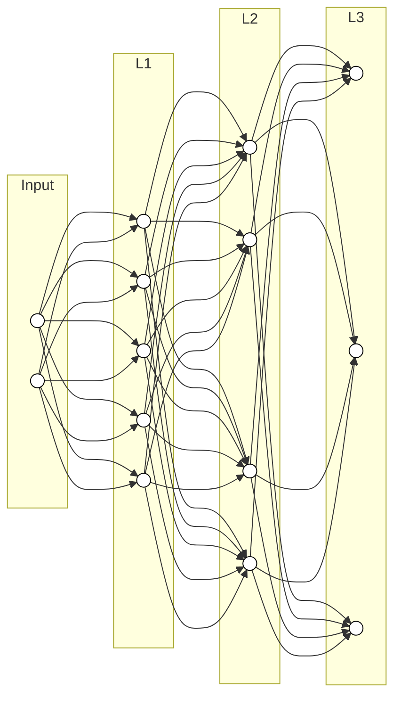
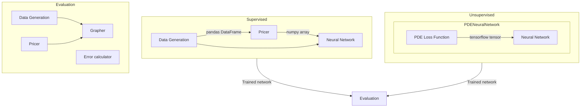
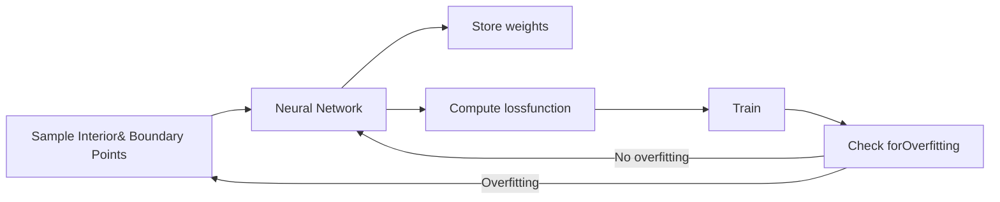
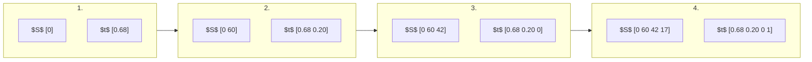

# Pu-Viola_Ruo_Han_01977026

> 原文檔案：`Pu-Viola_Ruo_Han_01977026.md`  
> 語言：繁體中文（臺灣，zh-TW）  
> 說明：由 LlamaParse Markdown 分段機器翻譯；公式、表格數字與檔名未改寫。

---

帝國理工學院

數學系

---

# **從實務觀點使用深度神經網路為選擇權定價：監督式與非監督式學習之比較研究**

---

*作者：* 蒲若涵（Viola Ruo Han Pu）（CID: 01977026）

本文係為取得

數學與金融理學碩士學位之論文，2020-2021

# **聲明**

本論文所包含之內容，除另有註明者外，均為本人獨立完成之研究成果。

1

# **致謝**

本論文於六月至八月在 Optiver Services B.V. 完成，該公司為位於阿姆斯特丹的做市商與自營交易公司。

首先，我要向 Optiver 衍生性商品訂價團隊的指導教授 Dr. Artur Swiech 與 Dr. Andrea Fontanari 致上最深的謝意，感謝他們給予我這個機會執行本專案、於論文撰寫期間提供寶貴的指導與回饋，並撥冗閱讀我的論文。其次，我要感謝整個衍生性商品訂價團隊，謝謝你們提供我所需的設備，並耐心回答我的問題。我也要向交易大廳所有交易員與研究人員表達感謝，無論何時我有疑問都能向你們請教，這對我理解實務面幫助極大。

我也要感謝我在帝國理工學院的校內指導教授 Dr. Paul Bilokon，感謝他在百忙之中仍指導我、出席定期會議，並花時間閱讀我的最終論文。

我也要感謝 Dana 協助安排讓這個專案得以進行，並不時與我討論。感謝 Joe 一直以來給予我許多幫助與支持，我會永遠記得我們關於麻糬的談話！特別感謝 Brendan 請我喝的冰咖啡拿鐵，以及我們一起享用的所有甜點——我迫不及待等你開始工作！同樣地，我也要感謝 Clarence，謝謝你幫助我適應阿姆斯特丹的生活、介紹我各種美味的懷念食物，並帶我喝好喝的珍珠奶茶！

在帝國理工學院，我要特別提及 Antila、Kian、Lidan 和 Jay。感謝你們讓封鎖期間的遠距學習變得愉快，並在論文專案期間持續給予支持——希望我們很快就能見面！

Robert 和他的家人絕對值得特別一提。感謝你們無論何時、何地都幫助我——我非常感激！

最後，我要感謝我的父母。謝謝你們關心我的飲食與睡眠，總是把我的幸福放在第一位！我很感激所有寶貴的人生建議，以及無條件的支持與愛。這篇論文獻給我的父母，謝謝你們的一切。

# **摘要**

選擇權賦予買方權利（但非義務），得以在到期日當日或之前，以履約價買入或賣出標的資產。決定選擇權的價值長期以來一直是個難題。僅能在到期日執行的歐式選擇權，幸而可藉由著名的 Black-Scholes 模型求解。然而，可在到期日前任何時間執行的美式選擇權，則無閉合解。為對美式選擇權進行定價，已發展出各種數值方法，例如求解偏微分方程式（PDEs）、樹狀方法、蒙地卡羅模擬以及有限差分法。

隨著機器學習日益普及，近期研究顯示神經網路可用於選擇權定價。在使用神經網路的方法中，有一種監督式學習是以選擇權價格作為標籤，訓練神經網路來內插標的資產價格、履約價、波動率等輸入變數與價格之間的關係。成功應用神經網路求解拉普拉斯方程式等偏微分方程式的經驗，啟發了將神經網路作為 Black-Scholes 偏微分方程式或美式選擇權偏微分方程式求解器的做法。

本研究旨在從準確性、穩健性與效率等面向，評估並比較監督式與非監督式學習方法在選擇權定價上的表現。研究工作特別強調實務應用性。我們發現，訓練完成的監督式神經網路所產生的價格，與解析解及數值解相當接近，僅在平價（at-the-money）區域有明顯差異。該網路能在樣本內預測提供相當準確的價格，但對樣本外預測則開始出現不理想的誤差。非監督式神經網路則受到維度問題的影響，隨著領域維度增加，訓練時間顯著拉長且誤差也隨之增大。總體而言，在本研究中監督式神經網路的表現普遍優於非監督式神經網路，然而兩種方法在實際應用時仍有相當的改善空間。

<table>
  <caption>目錄</caption>
    <tr>
      <td><b>1</b></td>
      <td><b>歐式選擇權定價</b></td>
      <td><b>13</b></td>
    </tr>
    <tr>
      <td>1.1</td>
      <td>一般偏微分方程式 . . . . . . . . . . . . . . . . . . . . . . . . . . . . . . . . . . . . . . . . . . . . . .</td>
      <td>13</td>
    </tr>
    <tr>
      <td>1.2</td>
      <td>歐式選擇權的 Black-Scholes 偏微分方程式 . . . . . . . . . . . . . . . . . . . . . . . . . . . .</td>
      <td>14</td>
    </tr>
    <tr>
      <td><b>2</b></td>
      <td><b>美式選擇權定價</b></td>
      <td><b>16</b></td>
    </tr>
    <tr>
      <td>2.1</td>
      <td>美式選擇權的偏微分方程式 . . . . . . . . . . . . . . . . . . . . . . . . . . . . . . . . . . . . . .</td>
      <td>16</td>
    </tr>
    <tr>
      <td>2.2</td>
      <td>樹狀方法 . . . . . . . . . . . . . . . . . . . . . . . . . . . . . . . . . . . . . . . . . . . . . . . . . . . .</td>
      <td>18</td>
    </tr>
    <tr>
      <td>2.3</td>
      <td>最小平方法蒙地卡羅模擬 . . . . . . . . . . . . . . . . . . . . . . . . . . . . . . . . . . . . . . . .</td>
      <td>19</td>
    </tr>
    <tr>
      <td><b>3</b></td>
      <td><b>人工神經網路</b></td>
      <td><b>22</b></td>
    </tr>
    <tr>
      <td>3.1</td>
      <td>概述 . . . . . . . . . . . . . . . . . . . . . . . . . . . . . . . . . . . . . . . . . . . . . . . . . . . . . .</td>
      <td>22</td>
    </tr>
    <tr>
      <td>3.2</td>
      <td>架構 . . . . . . . . . . . . . . . . . . . . . . . . . . . . . . . . . . . . . . . . . . . . . . . . . . . . . .</td>
      <td>23</td>
    </tr>
    <tr>
      <td>3.3</td>
      <td>通用逼近定理 . . . . . . . . . . . . . . . . . . . . . . . . . . . . . . . . . . . . . . . . . . . . . .</td>
      <td>24</td>
    </tr>
    <tr>
      <td>3.4</td>
      <td>激活函數 . . . . . . . . . . . . . . . . . . . . . . . . . . . . . . . . . . . . . . . . . . . . . . . . . . . .</td>
      <td>26</td>
    </tr>
    <tr>
      <td>3.5</td>
      <td>損失函數 . . . . . . . . . . . . . . . . . . . . . . . . . . . . . . . . . . . . . . . . . . . . . . . . . . . .</td>
      <td>27</td>
    </tr>
    <tr>
      <td>3.6</td>
      <td>最佳化 . . . . . . . . . . . . . . . . . . . . . . . . . . . . . . . . . . . . . . . . . . . . . . . . . . . . .</td>
      <td>29</td>
    </tr>
    <tr>
      <td></td>
      <td>3.6.1 隨機梯度下降法 . . . . . . . . . . . . . . . . . . . . . . . . . . . . . . . . . . . . . . . . . .</td>
      <td>29</td>
    </tr>
    <tr>
      <td></td>
      <td>3.6.2 Adam . . . . . . . . . . . . . . . . . . . . . . . . . . . . . . . . . . . . . . . . . . . . . . . . .</td>
      <td>30</td>
    </tr>
    <tr>
      <td></td>
      <td>3.6.3 L-BFGS . . . . . . . . . . . . . . . . . . . . . . . . . . . . . . . . . . . . . . . . . . . . . . .</td>
      <td>30</td>
    </tr>
    <tr>
      <td><b>4</b></td>
      <td><b>方法論與實作</b></td>
      <td><b>32</b></td>
    </tr>
    <tr>
      <td>4.1</td>
      <td>概述 . . . . . . . . . . . . . . . . . . . . . . . . . . . . . . . . . . . . . . . . . . . . . . . . . . . . . .</td>
      <td>32</td>
    </tr>
    <tr>
      <td>4.2</td>
      <td>共用元件 . . . . . . . . . . . . . . . . . . . . . . . . . . . . . . . . . . . . . . . . . . . . . . . . . . . .</td>
      <td>33</td>
    </tr>
    <tr>
      <td>4.3</td>
      <td>監督式學習 . . . . . . . . . . . . . . . . . . . . . . . . . . . . . . . . . . . . . . . . . . . . . . . . . .</td>
      <td></td>
    </tr>
</table>

<table>
    <tr>
      <td>34</td>
    </tr>
    <tr>
      <td></td>
      <td>4.3.1 參數選擇與標籤生成 . . . . . . . . . . . . . . . . . . . . . . . . . . . . . . . . . . .</td>
      <td>34</td>
    </tr>
    <tr>
      <td></td>
      <td>4.3.2 資料前處理 . . . . . . . . . . . . . . . . . . . . . . . . . . . . . . . . . . . . . . . . . . . . . . .</td>
      <td>35</td>
    </tr>
    <tr>
      <td></td>
      <td>4.3.3 訓練 . . . . . . . . . . . . . . . . . . . . . . . . . . . . . . . . . . . . . . . . . . . . . . . . . . .</td>
      <td>35</td>
    </tr>
    <tr>
      <td>4.4</td>
      <td>無監督學習 . . . . . . . . . . . . . . . . . . . . . . . . . . . . . . . . . . . . . . . . . . . . . . . . . . .</td>
      <td>36</td>
    </tr>
    <tr>
      <td></td>
      <td>4.4.1 神經網路作為偏微分方程求解器 . . . . . . . . . . . . . . . . . . . . . . . . . . . . . .</td>
      <td>36</td>
    </tr>
    <tr>
      <td></td>
      <td>4.4.2 數值可處理性 . . . . . . . . . . . . . . . . . . . . . . . . . . . . . . . . . . . . . . . . . . . . .</td>
      <td>37</td>
    </tr>
    <tr>
      <td></td>
      <td>4.4.3 選擇權定價偏微分方程 . . . . . . . . . . . . . . . . . . . . . . . . . . . . . . . . . . . . .</td>
      <td>39</td>
    </tr>
    <tr>
      <td></td>
      <td>4.4.4 實作細節 . . . . . . . . . . . . . . . . . . . . . . . . . . . . . . . . . . . . . . . . . . . . . . . . .</td>
      <td>40</td>
    </tr>
    <tr>
      <td><b>5</b></td>
      <td><b>結果與討論</b></td>
      <td><b>44</b></td>
    </tr>
    <tr>
      <td>5.1</td>
      <td>資料生成 . . . . . . . . . . . . . . . . . . . . . . . . . . . . . . . . . . . . . . . . . . . . . . . . . . .</td>
      <td>44</td>
    </tr>
    <tr>
      <td>5.2</td>
      <td>監督式學習 . . . . . . . . . . . . . . . . . . . . . . . . . . . . . . . . . . . . . . . . . . . . . . . . . . .</td>
      <td>45</td>
    </tr>
    <tr>
      <td></td>
      <td>5.2.1 效能 . . . . . . . . . . . . . . . . . . . . . . . . . . . . . . . . . . . . . . . . . . . . . . . . . . .</td>
      <td>45</td>
    </tr>
</table>

<table>
        <tr>
            <td></td>
            <td>5.2.2</td>
            <td>穩健性 . . . . . . . . . . . . . . . . . . . . . . . . . . . . . . . . . . . . . . . . . . . . . . . . . .</td>
            <td>50</td>
        </tr>
        <tr>
            <td>5.3</td>
            <td colspan="2">無監督學習 . . . . . . . . . . . . . . . . . . . . . . . . . . . . . . . . . . . . . . . . . .</td>
            <td>52</td>
        </tr>
        <tr>
            <td></td>
            <td>5.3.1</td>
            <td>表達能力 . . . . . . . . . . . . . . . . . . . . . . . . . . . . . . . . . . . . . . . . . . . . . . . . . .</td>
            <td>52</td>
        </tr>
        <tr>
            <td>5.4</td>
            <td colspan="2">比較 . . . . . . . . . . . . . . . . . . . . . . . . . . . . . . . . . . . . . . . . . . . . . . . . . . .</td>
            <td>58</td>
        </tr>
        <tr>
            <td></td>
            <td>5.4.1</td>
            <td>效能 . . . . . . . . . . . . . . . . . . . . . . . . . . . . . . . . . . . . . . . . . . . . . . . . . .</td>
            <td>59</td>
        </tr>
        <tr>
            <td></td>
            <td>5.4.2</td>
            <td>穩健性 . . . . . . . . . . . . . . . . . . . . . . . . . . . . . . . . . . . . . . . . . . . . . . . . . .</td>
            <td>61</td>
        </tr>
        <tr>
            <td></td>
            <td>5.4.3</td>
            <td>效率 . . . . . . . . . . . . . . . . . . . . . . . . . . . . . . . . . . . . . . . . . . . . . . . . . . . .</td>
            <td>62</td>
        </tr>
        <tr>
            <td><b>6</b></td>
            <td colspan="2"><b>結論與後續工作</b></td>
            <td><b>64</b></td>
        </tr>
        <tr>
            <td colspan="3"><b>參考文獻</b></td>
            <td><b>69</b></td>
        </tr>
</table>

# 圖表目錄

<table>
<tr>
<td>3.1</td>
<td>具有 <i>r</i> = 3、<i>I</i> = <i>d</i>0 = 2、<i>d</i>1 = 5、<i>d</i>2 = 4 以及 <i>O</i> = <i>d</i>3 = 3 的神經網路圖形表示。</td>
<td>24</td>
</tr>
<tr>
<td>4.1</td>
<td>專案架構。專案分為監督式學習與非監督式學習兩部分，並以一些共用元件將兩者連結起來。</td>
<td>33</td>
</tr>
<tr>
<td>4.2</td>
<td>非監督式神經網路深度學習流程圖，包含內部與邊界資料的取樣程序、透過最小化損失函數訓練神經網路，以及檢查過擬合以增加取樣點數。權重隨後會被儲存。</td>
<td>41</td>
</tr>
<tr>
<td>4.3</td>
<td>將點取樣至維度 <i>S</i> 與 <i>t</i> 陣列的步驟圖形表示，接著將兩者配對以形成邊界點的座標。</td>
<td>42</td>
</tr>
<tr>
<td>5.1</td>
<td><b>(a)</b> 神經網路預測價格與 Black-Scholes 閉式解價格的比較。<b>(b)</b> 神經網路預測價格與 Black-Scholes 閉式解價格之間誤差的直方圖。</td>
<td>45</td>
</tr>
<tr>
<td>5.2</td>
<td>給定參數 <i>S</i> ∈ [0.01, 60]、<i>K</i> = 20、<i>σ</i> = 0.25、<i>r</i> = 0.04、<i>q</i> = 0.0 以及 <i>T</i> = 365 天。<b>(a)</b> 預測價格與 Black-Scholes 價格對標的資產的關係。<b>(b)</b> 預測價格與 Black-Scholes 價格的絕對差異。同時也繪出 Black-Scholes 與二項樹法及蒙地卡羅方法所產生價格的絕對差異。</td>
<td>46</td>
</tr>
<tr>
<td>5.3</td>
<td>給定參數 <i>S</i> = 20、<i>K</i> ∈ [0.01, 60]、<i>σ</i> = 0.25、<i>r</i> = 0.04、<i>q</i> = 0.0 以及 <i>T</i> = 365 天。<b>(a)</b> 預測價格與 Black-Scholes 價格對履約價的關係。<b>(b)</b> 預測價格與 Black-Scholes 價格的絕對差異。</td>
<td>47</td>
</tr>
<tr>
<td>5.4</td>
<td>給定參數 <i>S</i> = <i>K</i> = 20、<i>σ</i> ∈ [0.05, 0.5]、<i>r</i> = 0.04、<i>q</i> = 0.0 以及 <i>T</i> = 365 天。<b>(a)</b> 預測價格與 Black-Scholes 價格對波動率的關係。<b>(b)</b> 預測價格與 Black-Scholes 價格的絕對差異。</td>
<td>47</td>
</tr>
<tr>
<td>5.5</td>
<td><b>(a)</b> 神經網路預測價格與二項樹價格的比較。<b>(b)</b> 神經網路預測價格與二項樹價格之間誤差的直方圖。</td>
<td>48</td>
</tr>
<tr>
<td>5.6</td>
<td>固定參數 <i>r</i> = 0.04、<i>q</i> = 0.0 以及 <i>T</i> = 365 天。供給以下參數：<b>(a-b)</b> <i>S</i> ∈ [0, 60]、<i>K</i> = 20 與 <i>σ</i> = 0.25。<b>(c-d)</b> <i>S</i> = 20、<i>K</i> ∈ [0, 60] 與 <i>σ</i> = 0.25。<b>(e-f)</b> <i>S</i> = <i>K</i> = 20 與 <i>σ</i> ∈ [0.05, 0.5]。左側圖形為預測價格與二項樹價格對標的資產、履約價與波動率的關係，右側圖形則顯示其絕對差異。</td>
<td>49</td>
</tr>
<tr>
<td>5.7</td>
<td>以表 5.6 所指定參數訓練的模型 <code>BSSt</code>、<code>BSStrikeSt</code> 與 <code>BSSigmaSt</code> 的結果。左側圖形繪出預測解與解析解對不同參數的關係，右側圖形則顯示預測價格與解析價格的差異。</td>
<td>55</td>
</tr>
</table>

<table>
		<tr>
			<td>5.8</td>
			<td>由模型 BSSt、BSStrikeSt 與 BSSigmaSt 所產生的三維圖形。左側圖中的橙色線代表邊界。 . . . . . . .</td>
			<td>55</td>
		</tr>
		<tr>
			<td>5.9</td>
			<td>以表 5.6 所指定參數訓練的模型 AmericanSt、AmericanStrikeSt 與 AmericanSigmaSt。左側圖形繪製預測解與解析解對不同參數的變化，右側圖形則顯示預測價格與二項樹價格之間的差異。 . . . . . . . . . . . . . . . . . . . . . . . . .</td>
			<td>57</td>
		</tr>
		<tr>
			<td>5.10</td>
			<td>左側圖形顯示監督式與非監督式價格對標的資產、履約價與波動率的變化，右側圖形則繪製監督式與非監督式價格之間的差異對不同參數的變化。 . . . . . . . . . . . . . .</td>
			<td>60</td>
		</tr>
		<tr>
			<td>5.11</td>
			<td>左側圖形顯示監督式與非監督式價格對標的資產、履約價與波動率的變化，右側圖形則繪製監督式與非監督式價格之間的差異對不同參數的變化。 . . . . . . . . . . . . . .</td>
			<td>61</td>
		</tr>
</table>

# **表格列表**

3.1 常見激活函數及其定義、導數與輸出範圍。改編自 [1]。 ............................ 26

3.2 常用於迴歸與二元分類問題的損失函數。$\hat{y}$ 表示預測值，$y$ 表示實際值。改編自 [1]。 . . 28

4.1 用於模擬 100,000 筆選擇權價格以訓練神經網路的參數範圍。到期時間 $T$ 的單位為天。 ........................ 34

5.1 使用二項式樹（1000 步）、MC/LSM（10,000 路徑與 20 步）以及解析 Black-Scholes 引擎產生 100,000 筆樣本所需的時間（秒）。 ............................ 44

5.2 以 **BinomialAmerican** 與 **MCAmerican** 所產生資料訓練之神經網路，在訓練集與測試集的均方誤差（MSE）、相對 $L_2$ 誤差與最大誤差。 ............................ 48

5.3 用於測試穩健性的 100,000 筆選擇權價格模擬之縮小後參數範圍。到期時間 $T$ 的單位為天。 ............................ 50

5.4 使用八種不同樣本大小訓練之神經網路，在訓練集與測試集的均方誤差（MSE）、相對 $L_2$ 誤差與最大誤差。固定參數為 $K \in [60, 100]$、$r = 0.02$、$q = 0.03$ 與 $T = 550$ 天。樣內預測提供 $S = 80$ 與 $\sigma = 0.25$；樣外預測提供三組參數：(1) $S = 40$ 與 $\sigma = 0.25$、(2) $S = 80$ 與 $\sigma = 0.05$、(3) $S = 40$ 與 $\sigma = 0.05$。記錄預測值與 Black-Scholes 價格之間的最大絕對誤差。注意訓練/測試資料與樣內/樣外預測的 **Max** 欄位定義不同。 ............................ 51

5.5 使用八種不同樣本大小訓練之神經網路，在訓練集與測試集的均方誤差（MSE）、相對 $L_2$ 誤差與最大誤差。固定參數為 $K \in [60, 100]$、$r = 0.02$、$q = 0.03$ 與 $T = 550$ 天。樣內預測提供 $S = 80$ 與 $\sigma = 0.25$；樣外預測提供三組參數：(1) $S = 40$ 與 $\sigma = 0.25$、(2) $S = 80$ 與 $\sigma = 0.05$、(3) $S = 40$ 與 $\sigma = 0.05$。記錄預測值與二項式樹價格之間的最大絕對誤差。注意訓練/測試資料與樣內/樣外預測的 **Max** 欄位定義不同。 ............................ 52

5.6 用於訓練不同模型的參數範圍或數值。到期時間 $T$ 與真實時間 $t$ 的單位為年。 ............................ 53

5.7 所有歐式與美式模型的內部訓練損失（int. loss）、內部驗證損失（int. val. loss）、邊界訓練損失（bound. loss）、邊界驗證損失（bound. val. loss）、相對 $L_2$ 誤差與相對最大誤差。 ............................ 58

5.8 用於比較監督式與非監督式神經網路之選擇權價格模擬的參數範圍。到期時間 $T$ 的單位為天。 ............................ 58

5

<table>
        <tr>
            <td>5.9</td>
            <td>監督式與非監督式神經網路在相同參數下（見表 5.8）訓練後的相對 <i>L</i>2 誤差與最大誤差。 . . . . . . . . . . . . . . . . . . . . . . . . . . . . . . . . . .</td>
            <td>59</td>
        </tr>
        <tr>
            <td>5.10</td>
            <td>監督式與非監督式神經網路在歐式與美式選擇權上，使用樣本外參數測試的最大絕對誤差。 . . . . . . . . . . . . . . . . .</td>
            <td>62</td>
        </tr>
        <tr>
            <td>5.11</td>
            <td>監督式與非監督式學習過程所花費的時間（秒）。注意歐式選擇權訓練時產生 200,000 筆樣本，而美式選擇權則產生 500,000 筆樣本。 . . . . . . . . . . . . . . . . . . . . . . . . . . . . . . . . .</td>
            <td>62</td>
        </tr>
</table>

# 縮寫詞列表

<table>
<tr>
<td>PDE</td>
<td>偏微分方程式 (Partial differential equation)</td>
</tr>
<tr>
<td>FDM</td>
<td>有限差分法 (Finite difference method)</td>
</tr>
<tr>
<td>FEM</td>
<td>有限元素法 (Finite element method)</td>
</tr>
<tr>
<td>LSM</td>
<td>最小平方法蒙地卡羅 (Least-Squares Monte Carlo)</td>
</tr>
<tr>
<td>SDE</td>
<td>隨機微分方程式 (Stochastic differential equation)</td>
</tr>
<tr>
<td>CDF</td>
<td>累積分布函數 (Cumulative distribution function)</td>
</tr>
<tr>
<td>ANN</td>
<td>人工神經網路 (Artificial neural network)</td>
</tr>
<tr>
<td>GBM</td>
<td>幾何布朗運動 (Geometric Brownian motion)</td>
</tr>
<tr>
<td>DE</td>
<td>差分演化 (Differential evolution)</td>
</tr>
<tr>
<td>CaNN</td>
<td>校準神經網路 (Calibration neural network)</td>
</tr>
<tr>
<td>BDSE</td>
<td>倒向隨機微分方程式 (Backward stochastic differential equation)</td>
</tr>
<tr>
<td>FNN</td>
<td>前饋神經網路 (Feedforward neural network)</td>
</tr>
<tr>
<td>MSE</td>
<td>均方誤差 (Mean squared error)</td>
</tr>
<tr>
<td>PnL</td>
<td>損益 (Profit-and-loss)</td>
</tr>
<tr>
<td>Id</td>
<td>恆等激活函數 (Identity activation function)</td>
</tr>
<tr>
<td>H</td>
<td>Heaviside 激活函數 (Heaviside activation function)</td>
</tr>
<tr>
<td>ReLU</td>
<td>修正線性單元激活函數 (Rectified linear unit activation function)</td>
</tr>
<tr>
<td>SGD</td>
<td>隨機梯度下降 (Stochastic gradient descent)</td>
</tr>
<tr>
<td>BFGS</td>
<td>Broyden–Fletcher–Goldfarb–Shanno</td>
</tr>
<tr>
<td>L-BFGS</td>
<td>有限記憶體 Broyden–Fletcher–Goldfarb–Shanno (Limited-memory Broyden–Fletcher–Goldfarb–Shanno)</td>
</tr>
<tr>
<td>ATM</td>
<td>價平 (At-the-money)</td>
</tr>
<tr>
<td>ITM</td>
<td>價內 (In-the-money)</td>
</tr>
<tr>
<td>OTM</td>
<td>價外 (Out-of-the-money)</td>
</tr>
</table>

# 符號列表

<table>
<tr>
<td>$K$</td>
<td>履約價</td>
</tr>
<tr>
<td>$S$</td>
<td>標的資產價格</td>
</tr>
<tr>
<td>$r$</td>
<td>無風險利率</td>
</tr>
<tr>
<td>$\sigma$</td>
<td>波動率 (volatility)</td>
</tr>
<tr>
<td>$T$</td>
<td>到期時間</td>
</tr>
<tr>
<td>$B = (B_t)_{t \ge 0}$</td>
<td>風險中性機率測度 $\mathbb{Q}$ 下的布朗運動</td>
</tr>
<tr>
<td>$g(S_T)$</td>
<td>選擇權的給付函數</td>
</tr>
<tr>
<td>$\Delta t := T/N$</td>
<td>樹狀方法中的子區間</td>
</tr>
<tr>
<td>$t_n = n\Delta t$</td>
<td>樹狀方法與 LSM 中的網格點</td>
</tr>
<tr>
<td>$p$</td>
<td>樹狀方法中標的資產價格上漲的機率</td>
</tr>
<tr>
<td>$u$</td>
<td>樹狀方法中標的資產價格上漲時的放大因子</td>
</tr>
<tr>
<td>$d$</td>
<td>樹狀方法中標的資產價格下跌時的放大因子</td>
</tr>
<tr>
<td>$g_k^n$</td>
<td>樹狀方法中第 $n$ 期、第 $k$ 個節點的美式選擇權內含價值</td>
</tr>
<tr>
<td>$\tilde{V}_k^n$</td>
<td>樹狀方法中第 $n$ 期、第 $k$ 個節點的美式選擇權續存價值</td>
</tr>
<tr>
<td>$\tau$</td>
<td>停時 (stopping time)</td>
</tr>
<tr>
<td>$(\Omega, \mathcal{F}, \mathbb{P})$</td>
<td>機率空間</td>
</tr>
<tr>
<td>$\Omega$</td>
<td>狀態空間，即時間 0 到 $T$ 之間所有可能結果的集合</td>
</tr>
<tr>
<td>$\omega$</td>
<td>樣本路徑</td>
</tr>
<tr>
<td>$\mathbb{P}$</td>
<td>機率測度，在無套利條件下允許等價鞅測度 $\mathbb{Q}$ 的存在</td>
</tr>
<tr>
<td>$C(\omega, s; t_n, T)$</td>
<td>在 LSM 中，條件於選擇權持有人在所有 $s, t < s \le T$ 皆採用最適停時策略，且選擇權在時間 $t$（含）之前皆未被執行下，所產生的現金流量路徑</td>
</tr>
<tr>
<td>$a_j$</td>
<td>LSM 中加權拉格爾多項式的一組常數係數</td>
</tr>
<tr>
<td>$F(\omega; t_n)$</td>
<td>LSM 中第 $t_n$ 期的美式選擇權續存價值</td>
</tr>
<tr>
<td>$F_K(\omega; t_{N-1})$</td>
<td>使用前 $K$ 個拉格爾基底函數近似第 $t_{N-1}$ 期的美式選擇權續存價值</td>
</tr>
<tr>
<td>$\widehat{F}_K(\omega; t_{N-1})$</td>
<td>將 $C(\omega, s; t_{N-1}, T)$ 的折現值對拉格爾基底函數進行迴歸所得到的擬合值</td>
</tr>
<tr>
<td>$N_I$</td>
<td>偏微分方程內部的微分算子</td>
</tr>
<tr>
<td>$N_B$</td>
<td>偏微分方程邊界的微分算子</td>
</tr>
<tr>
<td>$N_0$</td>
<td>初始或最終時間算子</td>
</tr>
<tr>
<td>$F / G$</td>
<td>偏微分方程的源函數</td>
</tr>
<tr>
<td>$q$</td>
<td>連續股利收益率</td>
</tr>
</table>

<table>
        <tr>
            <td>$\mathcal{N}$</td>
            <td>標準常態分布 $\mathcal{N}(0, 1)$ 的累積分布函數</td>
        </tr>
        <tr>
            <td>$\mathcal{T}[t, T]$</td>
            <td>在時間區間 $[t, T]$ 內，美式選擇權持有人可選擇執行之容許停時集合</td>
        </tr>
        <tr>
            <td>$V_{\text{Call}}(t, S)$</td>
            <td>買權 (Call option) 在時間 $t$ 的公平價值</td>
        </tr>
        <tr>
            <td>$V_{\text{Put}}(t, S)$</td>
            <td>賣權 (Put option) 在時間 $t$ 的公平價值</td>
        </tr>
        <tr>
            <td>$I$</td>
            <td>前饋類神經網路輸入層的單元數</td>
        </tr>
        <tr>
            <td>$O$</td>
            <td>前饋類神經網路輸出層的單元數</td>
        </tr>
        <tr>
            <td>$d_i$</td>
            <td>前饋類神經網路第 $i$ 個隱藏層的單元數</td>
        </tr>
        <tr>
            <td>$r - 1$</td>
            <td>前饋類神經網路的隱藏層數</td>
        </tr>
        <tr>
            <td>$\boldsymbol{\sigma}_i$</td>
            <td>第 $i$ 個隱藏層的激活函數</td>
        </tr>
        <tr>
            <td>$W^i$</td>
            <td>從第 $(i - 1)$ 層到第 $i$ 層的權重矩陣</td>
        </tr>
        <tr>
            <td>$\boldsymbol{b}^i$</td>
            <td>第 $i$ 個隱藏層的偏差向量</td>
        </tr>
        <tr>
            <td>$\mathcal{N}_r$</td>
            <td>具有 $r - 1$ 個隱藏層的前饋類神經網路類別</td>
        </tr>
        <tr>
            <td>$\sigma$</td>
            <td>乙狀激活函數 (Sigmoid activation function)</td>
        </tr>
        <tr>
            <td>$\tanh$</td>
            <td>雙曲正切激活函數 (Hyperbolic tangent activation function)</td>
        </tr>
        <tr>
            <td>$\ell$</td>
            <td>訓練前饋類神經網路的損失函數</td>
        </tr>
        <tr>
            <td>$\mathscr{L}$</td>
            <td>經驗風險 (Empirical risk)</td>
        </tr>
        <tr>
            <td>$\mathscr{L}_B$</td>
            <td>小批次風險 (Minibatch risk)</td>
        </tr>
        <tr>
            <td>$\eta$</td>
            <td>隨機梯度下降與 <i>Adam</i> 中的超參數，稱為步長或學習率 (learning rate)</td>
        </tr>
        <tr>
            <td>$B_i$</td>
            <td>隨機梯度下降中第 $i$ 個小批次，訓練資料被均勻抽樣至其中</td>
        </tr>
        <tr>
            <td>$g_t$</td>
            <td><i>Adam</i> 中的梯度</td>
        </tr>
        <tr>
            <td>$m_t$</td>
            <td><i>Adam</i> 中梯度的指數移動平均</td>
        </tr>
        <tr>
            <td>$v_t$</td>
            <td><i>Adam</i> 中梯度變異數的指數移動平均</td>
        </tr>
        <tr>
            <td>$\beta_1, \beta_2$</td>
            <td>控制 <i>Adam</i> 中移動平均指數衰減率的超參數</td>
        </tr>
        <tr>
            <td>$\mathscr{L}$</td>
            <td>將類神經網路作為偏微分方程求解器訓練時的損失函數</td>
        </tr>
        <tr>
            <td>$\lambda$</td>
            <td>損失函數中歸因於內部損失的權重，用以訓練類神經網路作為偏微分方程求解器</td>
        </tr>
        <tr>
            <td>$\{\boldsymbol{y}_i^I\}_{i=1}^{n_I}$</td>
            <td>均勻分布於定義域 $\Omega$ 的配置點 (Collocation points)</td>
        </tr>
        <tr>
            <td>$\{\boldsymbol{y}_i^B\}_{i=1}^{n_B}$</td>
            <td>均勻分布於邊界 $\partial\Omega$ 的配置點 (Collocation points)</td>
        </tr>
        <tr>
            <td>$t_{\max}$</td>
            <td>實時上界的數值</td>
        </tr>
        <tr>
            <td>$S_{\max}$</td>
            <td>標的資產在上界的數值</td>
        </tr>
</table>

# **導論**

*選擇權*（option）是一種衍生性金融商品，在金融領域中，指的是其價值來自於某個*標的*（underlying）表現的合約。標的可以是指數、資產或利率。選擇權賦予買方一項權利（而非義務），得以在到期日前或到期日當天，以約定的履約價格買入或賣出標的，具體方式取決於該選擇權的行使方式。交易者和投資人參與選擇權市場時，各有不同的目的。有些人帶著對價格走勢的看法進場，其他人則利用選擇權來保護自身部位免受不利價格波動的影響，或是擔任中介角色，依其他市場參與者的要求買賣選擇權，希望從買賣價差中獲利。最常見的選擇權類型為*歐式香草選擇權*（European vanilla option），它賦予買方一項權利（而非義務），得以在到期日 $T$ 以約定的履約價格 $K$ 買入（*買權*，Call option）或賣出（*賣權*，Put option）標的。歐式選擇權在到期時的 payoff 為：買權是 $(S_T - K)^+$，賣權是 $(K - S_T)^+$，其中 $S_T$ 為到期時的標的價格。

決定選擇權的價值一直是數理金融領域中長久以來的難題。Black 和 Scholes [2] 推導出一個閉合解公式，用以對標的價格遵循對數常態擴散過程的歐式選擇權進行定價，使得歐式選擇權的估值變得相當直接。另一方面，具提前行使特性的選擇權，例如*美式選擇權*（American options），則難以估值。由於美式選擇權可在選擇權存續期間的任何時間行使，其定價問題涉及一個與最適*停時*（stopping time）相關的移動邊界。最適停時理論與以下問題有關：如何根據依序觀察到的隨機變數，選擇一個時間點採取行動，以最大化期望報酬或最小化期望成本。

由於只有在標的資產無股利支付的情況下，才存在美式選擇權定價的閉合解，因此已發展出大量數值方法與分析方法來對美式選擇權進行估值。早期用來為美式選擇權定價且至今仍廣受歡迎的嘗試，包括求解*偏微分方程式*（partial differential equations, PDEs）。例如，Brennan 和 Schwartz [3] 發展出*有限差分法*（finite difference method, FDM）來評估美式賣權。Zvan 等人則將 Black-Scholes 偏微分方程式轉換為帶有非線性罰項的形式，並使用*有限元素法*（finite element method, FEM）[4] 求解。最近，Ballestra [5] 提出一種基於有限差分架構並結合重複 Richardson 外推法的新穎演算法，證明其表現遠優於傳統有限差分法。然而，這些偏微分方程式方法僅適用於低維度問題——最多四維 [6]。

除了這些偏微分方程方法之外，由 Cox 等人[7]所提出的二項樹法（binomial tree method），後續被 Boyle[8]擴展為三項樹法（trinomial tree method），具有容易實作且計算快速的優點。許多文獻已證明二項樹法在美式選擇權評價上的收斂性[9]。此外，常見的模擬基方法包括蒙地卡羅模擬（Monte Carlo simulation）以及由 Longstaff 和 Schwartz[10]所提出的最小平方法蒙地卡羅（Least-Squares Monte Carlo, LSM）方法。LSM 方法已被證實能產生優於一般蒙地卡羅模擬的結果[11]，且其一致性與收斂性

10

**Output:**

這些模擬方法取決於對應隨機微分方程（stochastic differential equations, SDEs）的離散化以及條件期望的近似[6]。

另一方面，基於人工神經網路（artificial neural network, ANN）的方法則無需對偏微分方程或隨機微分方程進行離散化。自從Hutchinson *et al.* [13]提出使用學習網路在Black-Scholes架構下為S&P 500指數期貨選擇權定價以來，利用ANN進行選擇權定價與避險的研究便受到廣泛關注。這得益於ANN在事前訓練完成後相較於傳統函數逼近器在計算時間上的優勢，以及其根據通用逼近定理[14]所能逼近極複雜函數解的能力。雖然大多數關於ANN的文獻聚焦於歐式選擇權，例如Liu *et al.* [15]提出的ANN方法，用以在Black-Scholes架構與Heston模型下為歐式選擇權定價，並使用Brent根尋法計算隱含波動率（implied volatility），但已有部分研究嘗試將ANN方法擴展至更複雜的美式選擇權定價。

使用監督式機器學習（supervised machine learning）技術為美式選擇權定價的研究包括Jang and Lee [16]，他們證明融入先驗機率的生成貝氏神經網路模型，在為S&P 100指數美式賣權定價時，能提供優於傳統美式選擇權模型的校準與預測表現。與Jang and Lee [16]以S&P 100指數美式賣權為研究對象不同，Gaspar *et al.* [17]則探討個股美式賣權的定價，他們使用兩種不同的神經網路，並從Bloomberg收集輸入變數。相較於僅使用股價、履約價、隱含波動率與到期期限作為輸入變數的NN模型，加入更多輸入變數（如股利收益率與利率）的模型表現優於前者以及最小二乘蒙地卡羅（LSM）方法。Karatas *et al.* [18]則不依賴觀察到的市場選擇權價格來擬合無模型函數（有別於Gaspar *et al.* [17]的做法），而是採用基於模型的定價方式，在幾何布朗運動（geometric Brownian motion, GBM）架構下使用Ju-Zhong（JZ）近似法產生美式選擇權價格過程的人工樣本路徑，並證明遞迴神經網路的訓練時間優於前饋神經網路。此外，Liu *et al.* [19]同樣採用基於模型的定價方式，他們將先前針對歐式選擇權的研究[15]加以延伸，不僅逼近美式Black-Scholes價格，還使用差分演化（Differential Evolution, DE）最佳化演算法，透過校準神經網路（Calibration Neural Network, CaNN）來估計隱含波動率與隱含股利（當兩者未知時）。

在無監督學習技術（unsupervised learning techniques）方面，數篇論文已嘗試使用人工神經網路（ANN）而非傳統數值方法來求解偏微分方程（PDE），以緩解維度災難（curse of dimensionality）。Han 等*[20]* 將偏微分方程重新表述為倒向隨機微分方程（backward stochastic differential equations, BSDE），並以深度神經網路逼近解的梯度，開啟了深度 BSDE 研究領域。繼 Han 等人的工作之後，Chen 與 Wan [21] 將神經網路應用於美式選擇權定價問題，以 BSDE 的最小平方殘差作為損失函數。他們的神經網路在維度大於 20 時，表現優於最小二乘蒙地卡羅法（LSM）。與採用深度 BSDE 方法不同，Salvador 等*[22]* 將 Black–Scholes 美式選擇權定價問題重新表述為線性互補問題（linear complementarity problem），並讓人工神經網路透過最小化損失函數來學習滿足偏微分方程及邊界條件約束的解。相較於有限元素法（finite element method）計算出的價格，該人工神經網路所得解的誤差量級為 10^{-3}，因此具有相當的準確度。

先前在該領域的研究主要探討使用人工神經網路為歐式與美式選擇權定價的可行性，並將其結果與傳統數值方法所得結果進行比較。關於監督式學習與無監督式學習之間的比較，

11

本論文探討在極端市場條件下，速度、準確度與穩健性的表現尚未被充分研究。監督式學習與非監督式學習方法各有其優點——監督式學習較易於實作，而非監督式學習則不需要大量訓練資料，在某些情況下較易取得。本研究的首要目標是比較使用這兩種方法對選擇權進行定價。在監督式學習中，價格由數值方法產生，並用以訓練神經網路，使其能將輸入映射至價格。在非監督式學習方面，我們以 van der Meer *et al.* 的論文 [23] 及 Salvador *et al.* 的論文 [6] 為基礎，透過人工神經網路（ANNs）最小化適當的損失函數，來求解對應的偏微分方程式。這些人工神經網路將逼近收斂至偏微分方程式問題的解。

本論文的結構如下。前三章提供關鍵概念的理論背景。第一章介紹一般偏微分方程式（PDEs）以及著名的 Black-Scholes 偏微分方程式，此方程式用於歐式選擇權（European options）的定價。第二章呈現美式選擇權（American options）的定價方法，包括美式選擇權的偏微分方程式、樹狀方法以及最小平方法蒙地卡羅模擬（Least-Squares Monte Carlo）。在第三章中，可以找到人工神經網路的概述，包括全連接前饋神經網路（fully-connected feedforward neural network）的概念、通用逼近定理（universal approximation theorem）——該定理指出具有單一隱藏層的神經網路能在緊緻子集上逼近豐富的函數類別，以及神經網路的訓練方法。第四章詳細說明監督式與非監督式學習的方法論與實作，包括如何將非監督式神經網路用作偏微分方程式的求解器、確保數值可處理性的實務考量與調整，以及如何將第一章與第二章中的 Black-Scholes 偏微分方程式和美式偏微分方程式與損失函數相連結。本章亦討論程式碼中關鍵組件的實際實作細節。第五章呈現使用監督式與非監督式學習對歐式選擇權與美式選擇權進行定價的結果。我們會先分別評估與討論監督式和非監督式技術，再進行兩者的比較。最後，在第六章中，我們對本論文做出簡要總結，並提出未來可能的研究方向。本論文的程式碼可於 GitHub 取得： https://github.com/violapu/OPNN.

# 第 1 章

# 歐式選擇權定價

本論文從歐式選擇權的定價開始。在第 1.2 節介紹以 Black-Scholes 偏微分方程（PDEs）為歐式選擇權定價之前，我們先在第 1.1 節對一般偏微分方程進行簡要介紹。

偏微分方程（PDEs）描述多變數函數各階偏導數之間的關係，通常用來描述自然現象並建模多維度動態系統。在金融領域中，求解偏微分方程對於衍生性金融商品定價、最適執行等問題至關重要。

## 1.1 一般偏微分方程

考慮一個定義在有限區域 $\Omega \subset R^n$ 上，關於函數 $u(x) \equiv u(x_1, ..., x_n)$ 的一般 $n$ 維偏微分方程，第 $k$ 階偏微分方程可表示為

$$N_I(x, u(x); Du(x), ..., D^{k-1}u(x), D^k u(x)) = 0 \quad x \in \Omega \subset R^n$$

其中 $D^k$ 是所有 $k$ 階偏導數的集合。由於這些偏導數引數通常可由 $u$ 推斷得出，因此我們可以省略它們，寫成

$$N_I(x, u) = 0  in  \Omega \tag{1.1.1}$$

在某些情況下，我們要求未知函數 $u$ 在其定義域邊界 $\partial\Omega$ 上等於某已知函數。與上述類似，邊界條件可表示為

$$N_B(x, u) = 0  on  \partial\Omega \tag{1.1.2}$$

在多數情況中，對於每個資料選擇都必須存在唯一解，且解會隨資料（包括右端項以及內部與邊界的微分算子 $N_I$ 與 $N_B$）連續變化，這項性質稱為「適定性」（*well-posedness*）[24]。更具體地說，例如當邊界條件發生微小變化時，解僅應有邊際的改變。為確保偏微分方程是適定的，方程式 (1.1.1) 與 (1.1.2) 可改寫為 [23]

$$
\begin{cases}
\tilde{N}_I(x, u) = F(x) & in  \Omega \\
\tilde{N}_B(x, u) = G(x) & on  \partial\Omega
\end{cases} \tag{1.1.3}
$$

其中 $F$ 與 $G$ 為源函數。這些源函數與算子定義了 $u$ 必須滿足的限制條件，才能求解該偏微分方程。此類偏微分方程的適定性定義如下 [25]：

13

**定義 1.1.1.** 若對於所有 $F$ 與 $G$，方程式 (1.1.3) 所示之偏微分方程 (PDE) 皆存在唯一解，且對於任意兩組資料 $(F_1, G_1)$ 與 $(F_2, G_2)$，其對應解 $u_1$ 與 $u_2$ 滿足
$$\|u_1 - u_2\| \leq K(\|F_1 - F_2\| + \|G_1 - G_2\|)$$
其中 $K \in \mathbb{R}$ 為某一固定常數，則稱該 PDE 具有適定性 (well-posedness)。此常數 $K$ 稱為 Lipschitz 常數。

## 1.2 歐式選擇權的 Black-Scholes 偏微分方程

數理金融領域中最著名的結果之一，即為 Black 與 Scholes 於 1973 年在開創性論文 [2] 中提出的 Black-Scholes 方程式及其相關的 Black-Scholes 偏微分方程。本文在此呈現該方程式的一個簡化變形，用以對支付連續股利的基礎資產進行歐式選擇權定價。

歐式選擇權賦予持有人在到期日當天，以履約價格買入或賣出基礎資產（如股票、債券或商品）的權利。在介紹用於定價普通歐式選擇權的 Black-Scholes 方程式之前，我們先回顧 Feynman-Kac 公式。Feynman-Kac 公式 [26] 指出，由布朗運動 $B = (B_t)_{t \geq 0}$ 驅動的隨機過程之期望值，可透過求解一個相關的偏微分方程而獲得。

**定理 1.2.1** (Feynman-Kac)。*假設 $V = V(t, x)$ 是下列偏微分方程的解*
$$
\begin{cases}
\partial_t V + b(t, x) \partial_x V + \frac{1}{2} \sigma^2(t, x) \partial_x^2 V = r(t, x) V, & t < T; \\
V(T, x) = g(x), & t = T.
\end{cases}
$$

則在 $V$、$r$、$b$ 與 $\sigma$ 滿足適當正則性條件下，我們有
$$V(t, x) = \mathbb{E} \left[ g(X_T) \exp \left( \int_t^T r(u, X^u) \mathrm{d}u \right) \middle| \mathcal{F}_t \right] \eqno(1.2.1)$$

其中 $X = (X_s)_{s \in [t, T]}$ 是下列隨機微分方程 (SDE) 的解
$$\mathrm{d}X_s = b(s, X_s) \mathrm{d}s + \sigma(s, X_s) \mathrm{d}B_s, \quad X_t = x$$

在 Black-Scholes 模型中，在風險中性機率測度 $\mathbb{Q}$ 下，基礎資產被假設支付連續收益率 $q$，亦即在區間 $(t, t + \delta t]$ 所支付的股利等於 $q S_t \delta t$。基礎資產的動態可表示為下列隨機微分方程
$$\mathrm{d}S_t = (r - q) S_t \mathrm{d}t + \sigma S_t \mathrm{d}B_t$$

其中 $B_t$ 為布朗運動。到期日為 $T$、 payoff 為 $g(S_T)$ 的選擇權在時間 $t$ 的公平價值為
$$V(t, S) := \mathbb{E}_{\mathbb{Q}}^{(t, S)} [g(S_T) \exp(-r(T - t))]$$

根據定理 1.2.1，$V(t, S)$ 可由下列偏微分方程的解來刻畫，此偏微分方程即為著名的 Black-Scholes 偏微分方程
$$
\begin{cases}
\partial_t V + (r - q) S \partial_S V + \frac{1}{2} \sigma^2 S^2 \partial_S^2 V - rV = 0, & t < T; \\
V(T, S) = g(S), & t = T.
\end{cases} \eqno(1.2.2)
$$

為求解此偏微分方程，需施加適當的邊界條件 [27]。對歐式選擇權而言，基礎資產的定義域為 $[0, \infty)$。此時 $S_{\min} = 0$，而必須選擇適當的 $S_{\max}$ 以施加邊界條件 $V(t, 0)$ 與 $V(t, S_{\max})$。

* 對於終端條件為 $V(T, S) = (S - K)^+$ 的買權（Call options）：

    (1) 當股價為零時，買權變得毫無價值。因此，$V(t, 0) = 0$。

    (2) 當初始股價非常大時，買權有很高機率到期時處於價內（in the money）並被執行，使得選擇權持有人在到期日 $T$ 收到股票並支付履約價 $K$。因此，$V(t, S_{\text{max}}) \approx S_{\text{max}} - Ke^{-r(T-t)}$。

* 對於終端條件為 $V(T, S) = (K - S)^+$ 的賣權（Put options）：

    (1) 當股價為零時，賣權的行為如同一筆固定的現金支付 $K$。因此該選擇權的公平價值為 $V(t, 0) = Ke^{-r(T-t)}$。

    (2) 當初始股價非常大時，賣權極有可能到期時高於履約價 $K$ 而到期無價值。因此，$V(t, S_{\text{max}}) \approx 0$。

施加邊界條件後，方程式 (1.2.2) 的解析解為：

$$
\begin{aligned}
V_{\text{Call}}(t, S) &= Se^{-q(T-t)}\mathcal{N}(d_1) - Ke^{-r(T-t)}\mathcal{N}(d_2) \\
V_{\text{Put}}(t, S) &= Ke^{-r(T-t)}\mathcal{N}(-d_2) - Se^{-q(T-t)}\mathcal{N}(-d_1)
\end{aligned}
\eqno(1.2.3)
$$

其中 $\mathcal{N}$ 為標準常態分布 $\mathcal{N}(0, 1)$ 的累積分布函數（cumulative distribution function, CDF），且

$$
\begin{aligned}
d_1 &= \frac{\log(S/K) + (r - q + \sigma^2/2)(T - t)}{\sigma\sqrt{T - t}} \\
d_2 &= \frac{\log(S/K) + (r - q - \sigma^2/2)(T - t)}{\sigma\sqrt{T - t}} = d_1 - \sigma\sqrt{T - t}
\end{aligned}
$$

15

# 第 2 章

# 美式選擇權定價

本章介紹美式選擇權的定價方法。延續第 1 章的內容，第 2.1 節先推導美式選擇權的偏微分方程式（PDE）。除了直接求解偏微分方程式外，第 2.2 節與第 2.3 節分別介紹常用於美式選擇權定價的數值方法，包括樹狀方法（tree-based method）與最小平方法蒙地卡羅模擬（Least-Squares Monte Carlo）。這兩種方法用來產生標籤資料，以供監督式學習訓練之用，同時也用來計算神經網路在監督式學習與非監督式學習下所預測價格的誤差。

## 2.1 美式選擇權的偏微分方程式

與歐式選擇權不同，美式選擇權允許選擇權持有人在到期日前任何時間行使權利，並立即根據當時標的資產的價值收取給付。此問題可視為一個「最適停止問題」（optimal stopping problem）。

**定義 2.1.1**（停止時間，Stopping Time）。令 $(\Omega, F, \{F_n\}_{n=0}^{\infty}, P)$ 為一濾過機率空間。一停止時間為一隨機變數 $\tau: \Omega \to \{0, 1, 2...\} \cup \{\infty\}$，滿足對所有 $n \ge 0$ 皆有：

$$\{\omega : \tau(\omega)\} := \{\tau \le n\} \in F_n \tag{2.1.1}$$

**備註。** *在離散時間下，條件 (2.1.1) 等價於對每個 $n$ 皆有 $\{\tau = n\} \in F_n$。*

令 $T[t, T]$ 表示在時間區間 $[t, T]$ 內所有可允許的停止時間所構成的集合，選擇權持有人可在此區間內選擇行使權利。則在時間 $t$、標的資產價格 $S_t = S$ 時，美式選擇權的價格為

$$V(t, S) = \sup_{\tau \in T[t, T]} E_{Q} \left[ g(S_{\tau}) e^{-r(\tau - t)} \big| S_t \right] \tag{2.1.2}$$

其中 $Q$ 為風險中性機率測度。在方程式 (2.1.2) 中令 $\tau = t$，表示可立即行使選擇權並獲得給付 $g(S)$。因此我們有

$$V(t, S) \ge g(S)$$

$$
\begin{aligned}
e^{r \delta t} V(t, S) &= e^{r \delta t} \sup_{\tau \in \mathcal{T}[t, T]} \mathbb{E}_{\mathbb{Q}} \left[ g(S_{\tau}) e^{-r(\tau - t)} \middle| S_t \right] \\
&= \sup_{\tau \in \mathcal{T}[t, T]} \mathbb{E}_{\mathbb{Q}} \left[ \mathbb{E}_{\mathbb{Q}} \left[ g(S_{\tau}) e^{-r(\tau - t - \delta t)} \middle| S_{t + \delta t} \right] \middle| S_t \right] \\
&\geq \sup_{\tau \in \mathcal{T}[t + \delta t, T]} \mathbb{E}_{\mathbb{Q}} \left[ \mathbb{E}_{\mathbb{Q}} \left[ g(S_{\tau}) e^{-r(\tau - t - \delta t)} \middle| S_{t + \delta t} \right] \middle| S_t \right] \\
&= \mathbb{E}_{\mathbb{Q}} \left[ \sup_{\tau \in \mathcal{T}[t + \delta t, T]} \mathbb{E}_{\mathbb{Q}} \left[ g(S_{\tau}) e^{-r(\tau - t - \delta t)} \middle| S_{t + \delta t} \right] \middle| S_t \right] \\
&= \mathbb{E}_{\mathbb{Q}} [V(t + \delta t, S_{t + \delta t})]
\end{aligned}
$$

其中 $S_{t+\delta t}$ 為時間 $t + \delta t$ 時的標的資產價格。因此我們已證明

$$e^{r\delta t} V(t, S) \geq \mathbb{E}_{\mathbb{Q}} [V(t + \delta t, S_{t+\delta t})] \tag{2.1.3}$$

我們假設 $V$ 關於 $t$ 為連續可微，且關於 $S$ 為二階連續可微。根據伊藤引理（Itô's lemma），可得

$$V(t + \delta t, S_{t+\delta t}) = V(t, S) + \int_t^{t+\delta t} \left( \partial_t V(u, S_u) du + \partial_S V(u, S_u)(r S_u du + \sigma S_u dB_u) \right.$$
$$\left. + \frac{1}{2} \partial_S^2 V(u, S_u) \sigma^2 S_u^2 du \right)$$

對兩邊取期望值，得到

$$\mathbb{E}_{\mathbb{Q}} [V(t + \delta t, S_{t+\delta t})] = V(t, S) + \mathbb{E}_{\mathbb{Q}} \left[ \int_t^{t+\delta t} \partial_t V(u, S_u) du + \partial_S V(u, S_u) r S_u du \right.$$
$$\left. + \frac{1}{2} \partial_S^2 V(u, S_u) \sigma^2 S_u^2 du \right] \tag{2.1.4}$$

將 $e^{r\delta t} = 1 + r\delta t + \mathcal{O}(\delta t^2)$ 與方程式 (2.1.4) 代入方程式 (2.1.3)，並將兩邊同除以 $\delta t$，可得

$$r V(t, S) + \frac{\mathcal{O}(\delta t^2)}{\delta t} \geq \mathbb{E}_{\mathbb{Q}} \left[ \frac{1}{\delta t} \int_t^{t+\delta t} \partial_t V(u, S_u) du + \partial_S V(u, S_u) r S_u du + \frac{1}{2} \partial_S^2 V(u, S_u) \sigma^2 S_u^2 du \right]$$

由於 $\mathcal{O}(\delta t)$ 是 $\delta t$ 的高階項，令 $\delta t \to 0$ 後可得

$$r V(t, S) \geq \partial_t V(t, S) + \partial_S V(t, S) r S + \frac{1}{2} \partial_S^2 V(t, S) \sigma^2 S^2$$

$$\partial_t V(t, S) + \partial_S V(t, S) r S + \frac{1}{2} \partial_S^2 V(t, S) \sigma^2 S^2 - r V(t, S) \leq 0$$

因此我們已證明

$$\min \left( -\partial_t V(t, S) - \partial_S V(t, S) r S - \frac{1}{2} \partial_S^2 V(t, S) \sigma^2 S^2 + r V(t, S), V(t, S) - g(S) \right) \geq 0 \tag{2.1.5}$$

方程式 (2.1.5) 中的第一項在 $V(t, S) > g(S)$ 時等於零，此區域稱為**續存區域**（continuation region），意即此時繼續持有選擇權的價值高於立即執行所獲得的報酬。

\begin{cases} 
\min(-\partial_t V(t, S) - \partial_S V(t, S)rS - \frac{1}{2}\partial_S^2 V(t, S)\sigma^2 S^2 + rV(t, S), V(t, S) - g(S)) = 0, & t \in [0, T]; \\
V(T, S) = g(S), & t = T.
\end{cases}
\eqno(2.1.6)
$$

## 2.2 樹狀方法

在 Black-Scholes 模型中，無風險資產的利率為 $r$，而風險股票的價格過程 $(S_t)_{t \ge 0}$ 遵循幾何布朗運動

$$
\frac{dS_t}{S_t} = rdt + \sigma dB_t \eqno(2.2.1)
$$

由此可得

$$
S_t = S_0 \exp \left[ \left( r - \frac{\sigma^2}{2} \right)t + \sigma B_t \right] \eqno(2.2.2)
$$

其中 $B = (B_t)_{t \ge 0}$ 是在風險中性機率測度 $\mathbb{Q}$ 下的布朗運動。到期日為 $T$、 payoff 函數為 $g(S_T)$ 的歐式選擇權（其中 Call 選擇權 $g(s) = (s - K)^+$，Put 選擇權 $g(s) = (K - s)^+$）在時間零的公平價格為

$$
e^{-rT} \mathbb{E}_{\mathbb{Q}} \left[ g(S_T) \right] \eqno(2.2.3)
$$

樹狀方法的動機是將連續的價格過程近似為簡單的離散過程，以利於計算式 (2.2.3) 所示的時間零公平價格。其基本想法是建構一棵樹，用來模擬股票價格在選擇權存續期間可能遵循的各種路徑。單一標的資產的二項式定價模型最初由 Cox、Ross 與 Rubinstein [7] 提出。此後，該方法經常被用來為可在到期前任何時間執行的美式選擇權進行定價。

要使用二項式樹方法為美式選擇權定價，我們將區間 $[0, T]$ 分成 $N$ 個子區間，每個子區間長度為 $\Delta t := T/N$，網格點為 $t_n = n\Delta t, n = 0, 1, \dots, N$。$N$ 期重組樹 (recombined tree) 是由簡單的一期二項式樹所建構而成，其中股票價格 $S$ 可以機率 $p$ 上漲至 $uS$，或以機率 $1-p$ 下跌至 $dS$。由式 (2.2.1) 與 (2.2.2) 可得

$$
\frac{S_{t+\Delta t}}{S_t} = \exp \left[ \left( r - \frac{\sigma^2}{2} \right) \Delta t + \sigma(B_{t+\Delta t} - B_t) \right] \sim \text{log-normal} \left( \left( r - \frac{\sigma^2}{2} \right) \Delta t, \sigma^2 \Delta t \right)
$$

在區間 $[t, t + \Delta t]$ 上，隨機報酬率的第一與第二動差分別為

$$
\mathbb{E}_{\mathbb{Q}} \left[ \frac{S_{t+\Delta t}}{S_t} \right] = e^{r \Delta t} \quad \text{與} \quad \mathbb{E}_{\mathbb{Q}} \left[ \left( \frac{S_{t+\Delta t}}{S_t} \right)^2 \right] = e^{(2r + \sigma^2) \Delta t}
$$

透過將上述兩個動差與二元隨機變數的前兩個動差匹配，我們得到

$$
\begin{cases}
pu + (1 - p)d = e^{r \Delta t} \\
pu^2 + (1 - p)d^2 = e^{(2r + \sigma^2) \Delta t}
\end{cases}
$$

$$在施加條件 $ud = 1$ 以確保樹狀結構能夠重組後，並對 $u$ 進行 $\sqrt{\Delta t}$ 冪次的泰勒展開，我們得到 Cox-Ross-Rubinstein (CRR) 模型下二項樹的參數
$$p = \frac{e^{r\Delta t} - d}{u - d}, \quad u = e^{\sigma\sqrt{\Delta t}}, \quad d = e^{-\sigma\sqrt{\Delta t}}$$
其中需滿足 $-\sigma < r\sqrt{\Delta t} < \sigma$ 以確保 $p$ 為一個定義良好的機率。

由於美式選擇權具有提前行使的特徵，需引入一個停時 $\tau$ 來描述行使時機策略。到期日為 $T$、履約價為 $K$ 的美式選擇權在第 $n$ 期的公平價格為
$$
\begin{aligned}
V^n &:= \sup_{\tau \in [n, N]} \mathbb{E}_{\mathbb{Q}} \left[ e^{-r(\tau-n)\Delta t} g(S_\tau) \middle| \mathcal{F}_n \right] \\
&= \begin{cases} g(S_N) & \text{for } n = N \\ \max\{g(S_n), e^{-r\Delta t} \mathbb{E}_{\mathbb{Q}} \left[ V^{n+1} \middle| \mathcal{F}_n \right]\} & \text{for } n = 0, 1, \dots, N-1 \end{cases}
\end{aligned}
$$

在時刻 $t_n$，共有 $n+1$ 個節點代表資產價格 $S_k^n$，其中 $S_k^n = S_0 u^{n-k} d^k$，$k = 0, 1, \dots, n$ 且 $n = 0, 1, \dots, N$。進一步定義 $g_k^n := g(S_k^n)$。則對於 $n = 0, 1, \dots, N-1$，美式選擇權在第 $n$ 期的公平價格可表示為
$$V_k^n = \max\{g_k^n, e^{-r\Delta t} (p V_k^{n+1} + (1 - p) V_{k+1}^{n+1})\}$$

其直觀意義為：在任一時刻 $n$，存在兩種可能性。若立即行使選擇權為最適策略，則選擇權持有人會行使選擇權並立即獲得收益 $g_k^n$，此收益亦稱為選擇權在第 $n$ 期的*內含價值* (intrinsic value)。反之，若此時行使並非最適策略，則持有人繼續持有選擇權，此頭寸在第 $n$ 期的價值可透過風險中性定價計算：
$$\tilde{V}_k^n := e^{-r\Delta t} \left[ p V_{k+1}^{n+1} + (1 - p) V_k^{n+1} \right]$$
其中 $\tilde{V}_k^n$ 亦稱為選擇權在第 $n$ 期的*延續價值* (continuation value)。因此，選擇權僅會在內含價值大於延續價值時才會被行使。

使用二項樹方法計算美式選擇權在零時刻價值的演算法如下。首先，在終點時刻 $N$，選擇權價值等於其內含價值，即 $V_k^N = g_k^N$，$k = 0, 1, \dots, N$。接著對 $n = N-1, N-2, \dots, 0$，依序計算每個 $k = 0, 1, \dots, n$ 對應的 $V_k^n$。透過向後歸納法，即可得到零時刻的選擇權價值 $V_0^0$。更詳細的說明與證明可參見 [28]。Jiang 與 Dai 證明了二項樹方法對美式選擇權的收斂性 [9]。

二項樹方法的優點在於其易於實作、對低維度問題計算速度快，以及可靈活擴展至含有嵌入式決策特徵的選擇權。然而，當基礎資產的數量增加時，維度災難 (curse of dimensionality) 便會出現，導致實作的計算成本大幅上升。

## 2.3 最小平方法蒙地卡羅模擬

雖然因提前行使的特徵，使用蒙地卡羅模擬 (Monte Carlo simulation) 對美式選擇權進行定價較為困難，但此方法仍具有若干優點 [10]。其主要優點在於，當選擇權價值取決於多個因子時，計算時間僅呈線性增加。此外，蒙地卡羅模擬能夠處理一般的隨機過程，例如跳躍擴散 (jump diffusion)。在實務上，模擬方法適用於

parallel 運算，從而有可能提升運算速度。有多種蒙地卡羅模擬方法可用來為美式選擇權定價，此處我們概述由 Longstaff 與 Schwartz 所提出的最小平方法蒙地卡羅（Least-Squares Monte Carlo, LSM）。有關該模擬方法的數值範例、理論架構以及演算法的更詳細說明，可參見 [10]。

在到期日，最佳策略為：若選擇權處於價內（in the money）則執行之，若處於價外（out of the money）則任其到期而無價值。在到期日之前，如第 2.2 節所述，美式選擇權持有人會將立即執行的 payoff（稱為內含價值，intrinsic value）與繼續持有選擇權的期望 payoff（稱為續存價值，continuation value）進行比較，並且僅在內含價值較高時才執行。與二項樹法類似，最佳執行策略是由繼續持有選擇權之 payoff 的條件期望值所決定。LSM 方法的關鍵在於運用最小平方法來估計此一條件期望 payoff。

我們假設一個機率空間 $(\Omega, F, P)$ 與有限時域 $[0, T]$。狀態空間 $\Omega$ 是時間 0 到 $T$ 之間所有可能結果的集合，其中 $\omega$ 代表一條樣本路徑，$F$ 是時間 $T$ 可區分事件的 sigma 代數，而 $P$ 是在無套利條件下允許存在等價鞅測度 $Q$ 的機率測度。為實施 LSM，我們假設美式選擇權僅能在 $N$ 個離散時點執行，並可藉由使 $N$ 足夠大來逼近可連續執行的美式選擇權。我們將從評價日到到期日的期間 $[0, T]$ 劃分為 $N$ 個子區間，網格點為 $t_n = n\Delta t, n = 0, 1, ..., N$。在時間 $t_n$，立即執行的現金流量等於內含價值，且為選擇權持有人所知。然而，繼續持有選擇權的現金流量雖未知，但可透過對剩餘折現現金流量 $C(\omega, s; t_n, T)$ 在風險中性測度 $Q$ 下取期望值來計算。$C(\omega, s; t_n, T)$ 是指在選擇權持有人於所有 $s, t < s \leq T$ 皆採用最適停止策略，且選擇權在時間 $t$ 或之前未被執行之條件下，由該選擇權所產生的現金流量路徑。則在時間 $t_n$，續存價值為

$$F(\omega; t_n) = E_{Q} \left[ \sum_{j=n+1}^{N} \exp \left( -\int_{t_n}^{t_j} r(\omega, s) \, ds \right) C(\omega, t_j; t_n, T) \bigg| F_{t_n} \right] \tag{2.3.1}$$

最小平方法可用來逼近在 $t_{N-1}, t_{N-2}, ..., t_1$ 的條件期望值。例如，在 $t_{N-1}$ 時，式 (2.3.1) 中的 $F(\omega; t_{N-1})$ 可表示為一組可數的 $F_{t_{N-1}}$-可測基底函數的線性組合。基底函數的可能選擇包括 Legendre、Chebyshev 與 Jacobi 多項式。Longstaff 與 Schwartz [10] 選擇了一組加權 Laguerre 多項式作為基底函數：

$$F(\omega; t_{N-1}) = \sum_{j=0}^{\infty} a_j L_j(X)$$

在其中，$a_j$ 係數為常數。最小平方法（LSM）演算法 [10] 如下：

- 產生多條標的資產可能遵循的隨機路徑，對每一條路徑，在時刻 $t_n$（$n = 0, 1, \dots, N$）的資產價格 $S_n$ 均為已知。
- 將期間 $[0, T]$ 劃分為 $N$ 個子區間，其中 $0 < t_1 \leq t_2 \leq \cdots \leq t_N = T$。
- 在時刻 $t_{N-1}$，延續價值 $F(\omega; t_{N-1})$ 可利用前 $K$ 個拉格uerre（Laguerre）基底函數逼近，記為 $F_K(\omega; t_{N-1})$。找出在 $t_{N-1}$ 時選擇權處於價內的路徑後，將 $C(\omega, s; t_{N-1}, T)$ 的折現值對這些基底函數進行迴歸，所得的迴歸擬合值即為 $\widehat{F}_K(\omega; t_{N-1})$。

* 透過比較立即執行之內含價值（intrinsic value）與 $\widehat{F}_K(\omega; t_{N-1})$ 的大小，我們可在內含價值較高時決定提前執行。此步驟對所有價內路徑（in-the-money paths）重複進行。
* 再往回推至時間 $t_{N-2}$，並重複此過程，直到對所有路徑的每個時間步驟皆做出是否執行的決策為止。
* 從時間零開始，沿著每一條路徑前進，直到遇到第一個停時（stopping time），並將該停時產生的現金流量折現回時間零。
* 對所有路徑 $\omega$ 取平均，即可得到美式選擇權的價值。

# 第 3 章

# 人工神經網路

本章首先在第 <u>3.1</u> 節概述人工神經網路以及包含監督式學習與非監督式學習的機器學習演算法。接著在第 <u>3.2</u> 節正式定義神經網路的各組成部分。第 <u>3.3</u> 節討論通用逼近定理（universal approximation theorem），該定理指出具有單一隱藏層的神經網路能夠逼近任意函數。本節同時證明若干激活函數的連續性與可微分性。第 <u>3.4-3.6</u> 節則詳細說明神經網路的實作，包括選擇適當的激活函數以引入非線性，以及使用最佳化演算法最小化距離測度。

## 3.1 概述

人工神經網路（Artificial Neural Networks, ANNs）是一類數學運算系統，其結構與動物大腦相似。根據 Haykin <u>[29]</u> 的說法，神經網路的非數學表述如下：

神經網路是一種大規模平行分散式處理器，具有儲存經驗知識並使其可供使用的自然傾向。它在兩個方面與大腦相似：

1. 網路透過學習過程獲得知識。
2. 神經元之間的連接強度（稱為突觸權重）用來儲存知識。

神經網路的目標是逼近某個函數 $f$，方法是定義一個映射 $y = f(x; \theta)$，並學習參數 $\theta$ 的值，使其能最佳地逼近該函數。為了學習輸入與輸出之間的映射，突觸權重以及神經網路架構（包括每層感知器的數量、層數以及突觸連接的方向）都非常重要。

不同類型的神經網路可透過改變這些參數來區分。其中一個例子是前饋神經網路（Feedforward Neural Networks, FNNs），其每一層的每個單元都與下一層的所有單元相連，且不存在將模型輸出回饋至神經網路的回饋連接 <u>[30]</u>。資訊從 $x$ 開始，透過用來定義 $f$ 的計算，最後到達輸出 $y$ <u>[31]</u>。這與遞迴神經網路形成對比，在遞迴神經網路中，網路的輸出會被回饋至網路本身。

由於其通用逼近能力，FNN 在許多應用中都很有用，例如臉部與語音辨識、時間序列預測，以及模擬建模。隨著 FNN 在眾多應用中獲得成功，我們希望將 FNN 以監督式與非監督式兩種方式應用於選擇權定價。

監督式學習與非監督式學習是機器學習演算法的兩大類別，這些演算法能夠從資料中學習。所謂電腦程式能從經驗 $E$ 中學習，是指針對某些任務 $T$ 與效能衡量指標 $P$，其在任務 $T$ 上以 $P$ 衡量的表現會隨著經驗 $E$ 而改善 [32]。任務 $T$ 的例子包括分類與迴歸，而衡量指標 $P$ 可以是準確率或錯誤率。監督式學習演算法所接收的輸入包含特徵，且每個範例都對應一個標籤。資料通常會被分割為訓練集、驗證集與測試集。訓練資料可表示為

$$(x_1, y_1), ..., (x_n, y_n)$

其中 $x_i$ 代表輸入向量，而 $y_i$ 代表對應的標籤。給定輸入 $x_i$，輸出 $f(x_i)$ 應盡可能接近 $y_i$。為了量化這種接近程度，我們定義損失函數，並在訓練過程中使用最佳化演算法將其最小化。損失函數的一個例子是均方誤差（*Mean Squared Error*, MSE）：

$$MSE = \frac{1}{n} \sum_{i}^{n} (f(x_i) - y_i)^2$$

它衡量輸出與標籤之間平均平方差。在訓練過程中，可能會發生稱為過擬合（*overfitting*）的問題，亦即產生的函數在訓練資料上表現良好，但在未見過的資料上卻表現不佳。這會表現為訓練損失在訓練過程中大幅低於驗證損失。為防止過擬合，可以引入隨機丟棄（*dropout*）層，在訓練時以機率 $p \in [0, 1]$ 將每個輸入隨機替換為零值，迫使神經網路學習最具穩健性的特徵。除了使用隨機丟棄層外，也可以減少稱為 epoch 的迭代次數，或增加樣本數量來防止過擬合。模型訓練完成後，可在稱為測試資料的未見過資料上評估模型，以觀察模型的泛化能力。

另一方面，非監督式學習演算法僅接收特徵而沒有標籤。由於沒有標籤，演算法的優劣無法直接透過輸出與標籤的接近程度來衡量，而是透過其他指標，例如若目標是最大化損益（profit-and-loss, PnL），則可使用 PnL，或是自行定義的損失函數。

## 3.2 架構

神經網路的概念可形式化如下 [1]：

**定義 3.2.1.** 令 $I, O, r \in \mathbb{N}$。若函數 $f: \mathbb{R}^I \to \mathbb{R}^O$ 為具有 $r-1 \in \{0, 1, \dots\}$ 個隱藏層的前饋神經網路，其中第 $i$ 個隱藏層有 $d_i \in \mathbb{N}$ 個單元（$i = 1, \dots, r-1$），且激活函數為 $\sigma_i: \mathbb{R}^{d_i} \to \mathbb{R}^{d_i}$（$i = 1, \dots, r$），其中 $d_r := O$，則

$$f = \sigma_r \circ L_r \circ \cdots \circ \sigma_1 \circ L_1 \tag{3.2.1}$$

其中對任意 $i = 1, \dots, r$，$L_i: \mathbb{R}^{d_{i-1}} \to \mathbb{R}^{d_i}$ 為仿射函數

$$L_i(x) := W^i x + b^i, \quad x \in \mathbb{R}^{d_{i-1}}$$

23

由權重矩陣 $W^i = [W^i_{j,k}]_{j=1,...,d_i, k=1,...,d_{i-1}} \in \mathbb{R}^{d_i \times d_{i-1}}$ 與偏差向量 $\boldsymbol{b}^i = (b^i_1, ..., b^i_{d_i}) \in \mathbb{R}^{d_i}$ 所參數化，其中 $d_0 := I$。我們將此類函數 $f$ 的集合記為

$$\mathcal{N}_r (I, d_1, ..., d_{r-1}, O; \sigma_1, ..., \sigma_r)$$

深度類神經網路的範例可見於圖 3.1。從定義可知，前饋類神經網路（FNN）通常是由交替組合仿射函數與簡單非線性函數所組成，藉此產生非線性，這也是它們被稱為網路的原因。整個鏈狀結構的總長度（包含輸入層、隱藏層與輸出層）即為模型的*深度*。隱藏層的維度則決定了類神經網路的*寬度*。類神經網路的架構由權重 $W^1, ..., W^r$、偏差 $\boldsymbol{b}^1, ..., \boldsymbol{b}^r$ 以及激活函數 $\sigma_1, ..., \sigma_r$ 所決定。

*   $I = d_0 = 2$
*   $d_1 = 5$
*   $d_2 = 4$
*   $O = d_3 = 3$
*   激活函數：$\sigma_1$（應用於 $L_1$）、$\sigma_2$（應用於 $L_2$）、$\sigma_3$（應用於 $L_3$）

**圖 3.1：** 具有 $r = 3, I = d_0 = 2, d_1 = 5, d_2 = 4$ 與 $O = d_3 = 3$ 之類神經網路的圖形表示。

## 3.3 通用逼近定理

使用類神經網路來逼近極為複雜的函數，其動機來自於類神經網路的*通用逼近性質*（universal approximation property），該性質指出定義在有界區域上的連續函數，可以被適當的類神經網路所逼近 [33]。

為了衡量類神經網路的逼近精確度，我們定義以下兩種範數。令 $K \subset \mathbb{R}^I$ 為緊緻集，且 $L^p(K, \mathbb{R})$ 表示滿足 $\|f\|_{L^p(K)} < \infty$ 的可測函數 $f : K \to \mathbb{R}$ 所構成的類別。對任意可測函數 $f : \mathbb{R}^I \to \mathbb{R}$，*上確界範數*（sup norm）定義為：

$$\|f\|_{\text{sup}, K} := \sup_{x \in K} |f(\boldsymbol{x})|$$

而對任意 $p \ge 1$，$L^p$ *範數* 定義為：

$$\|f\|_{L^p(K)} := \left( \int_K |f(\boldsymbol{x})|^p d\boldsymbol{x} \right)^{\frac{1}{p}}$

**定理 3.3.1**（通用逼近定理）。*令 $g : \mathbb{R} \to \mathbb{R}$ 為一可測函數，且滿足*

(a) *g 不是多項式函數。*

(b) *g 在任意有限區間上有界。*

(c) *g 在 $\mathbb{R}$ 上所有不連續點所構成集合的閉包，其 Lebesgue 測度為零。*

*此外，令 $K \subset \mathbb{R}^I$ 為緊緻集合，且 $\epsilon > 0$。*

(i) *對任意 $u \in C(K, \mathbb{R})$，存在 $d \in \mathbb{N}$ 及 $f \in \mathcal{N}_2(I, d, 1; g, \text{Id})$，使得*
$$\|u - f\|_{\sup, K} < \epsilon$$

(ii) *令 $p \geq 1$。對任意 $v \in L^p(K, \mathbb{R})$，存在 $d' \in \mathbb{N}$ 及 $h \in \mathcal{N}_2(I, d', 1; g, \text{Id})$，使得*
$$\|v - h\|_{L^p(K)} < \epsilon$$

根據通用逼近定理，神經網路能夠表示我們試圖逼近的任意函數。然而，這並不保證該函數能夠被成功學習，其原因有二[31]。首先，演算法可能無法找到正確學習該函數的參數。其次，由於過擬合（overfitting）等問題，可能會學到錯誤的函數。

定理 3.3.1 對僅含單一隱藏層的神經網路成立，此結果可推廣至寬度有界但深度無界的更深層神經網路，並適用於一般的激活函數[35]。在實務上，使用單一隱藏層可能導致該層的神經元數量過於龐大，進而產生較大的泛化誤差。使用多個隱藏層能大幅減少每一層的感知器數量，並可能帶來更好的泛化能力。

當我們使用神經網路求解偏微分方程式（PDE）——這正是本論文以無監督學習所要達成的目標——時，神經網路必須能夠同時良好地逼近目標函數及其導數。當激活函數具備連續性與可微分性時，此性質已被證明成立[1]：

**命題 3.3.2**（連續性與可微分性）。

(i) *若對任意 $i = 1, \dots, r$，皆有 $\sigma_i \in C(\mathbb{R}^{d_i}, \mathbb{R}^{d_i})$，則*
$$\mathcal{N}_r(I, d_1, \dots, d_{r-1}, O; \sigma_1, \dots, \sigma_r) \subset C(\mathbb{R}^I, \mathbb{R}^O)$$

(ii) *若對任意 $i = 1, \dots, r$，存在 $m_i \in \mathbb{N} \cup \{\infty\}$ 使得 $\sigma_i \in C^{m_i}(\mathbb{R}^{d_i}, \mathbb{R}^{d_i})$，則*
$$\mathcal{N}_r(I, d_1, \dots, d_{r-1}, O; \sigma_1, \dots, \sigma_r) \subset C^{\min\{m_1, \dots, m_r\}}(\mathbb{R}^I, \mathbb{R}^O)$$

*證明。* (i) 由於式（3.2.1）中的仿射函數 $L_1, \dots, L_r$ 皆為連續函數，因此 $f \in \mathcal{N}_r(I, d_1, \dots, d_{r-1}, O; \sigma_1, \dots, \sigma_r)$ 是連續函數的複合。故 $f$ 為連續函數。

(ii) 假設我們欲對 $f \in \mathcal{N}_r(I, d_1, \dots, d_{r-1}, O; \sigma_1, \dots, \sigma_r)$ 求取階數為 $m$ 的偏導數，其中 $m \leq \min\{m_1, \dots, m_r\}$。根據鏈鎖法則，該導數存在，且可表示為 $L_1, \dots, L_r$ 與 $\sigma_1, \dots, \sigma_r$ 至多 $m$ 階偏導數的線性組合與複合。依構造及假設，這些偏導數皆為連續函數，因此 $f$ 的偏導數亦為連續函數。
$\square$

25

## 3.4 激活函數

如第 3.2 節所述，神經網路是由仿射函數與非線性函數所構成，其中非線性是由激活函數（activation function）所提供，使神經網路能夠學習複雜的資料。在訓練過程中，通常會使用*反向傳播*（back-propagation）演算法來計算梯度，以找出損失函數的最小值。這要求神經網路必須具備連續性與可微分性，而這些性質正是由激活函數所控制，如命題 3.3.2 所示。因此，激活函數最好是連續且可微分的。常見的激活函數可見表 3.1，其選擇通常取決於使用情境。

<table>
<thead>
<tr>
<th>激活函數</th>
<th>圖形</th>
<th>定義</th>
<th>導數</th>
<th>值域</th>
</tr>
</thead>
<tbody>
<tr>
<td>Identity (Id)</td>
<td></td>
<td>g(x) = x</td>
<td>g'(x) = 1</td>
<td>ℝ</td>
</tr>
<tr>
<td>Heaviside (H)</td>
<td></td>
<td>g(x) = { 0 x &#x3C; 0 1 x ≥ 0</td>
<td>g'(x) = 0, x ≠ 0</td>
<td>{0, 1}</td>
</tr>
<tr>
<td>Sigmoid (σ)</td>
<td></td>
<td>g(x) = 1 / (1 + e-x)</td>
<td>g'(x) = g(x)(1 - g(x))</td>
<td>(0, 1)</td>
</tr>
<tr>
<td>Hyperbolic Tangent (tanh)</td>
<td></td>
<td>g(x) = (ex - e-x) / (ex + e-x)</td>
<td>g'(x) = 1 - g(x)2</td>
<td>(-1, 1)</td>
</tr>
<tr>
<td>ArcTan</td>
<td></td>
<td>g(x) = tan-1(x)</td>
<td>g'(x) = 1 / (1 + x2)</td>
<td>(-1.5, 1.5)</td>
</tr>
<tr>
<td>Rectified linear unit (ReLU)</td>
<td></td>
<td>g(x) = max{x, 0}</td>
<td>g'(x) = { 0 x &#x3C; 0 1 x > 0</td>
<td>[0, ∞)</td>
</tr>
<tr>
<td>Softplus</td>
<td></td>
<td>g(x) = log(1 + ex)</td>
<td>g'(x) = 1 / (1 + e-x)</td>
<td>(0, ∞)</td>
</tr>
</tbody>
</table>

**表 3.1：** 常見激活函數及其定義、導數與輸出值域。改編自 [1]。

*Identity (Id)* 激活函數會將各神經元的輸入乘以權重後直接輸出，其輸出與輸入成正比。因此，它僅能用於輸出層，例如在迴歸問題中使用，而無法同時用於所有層，否則無法引入非線性。此外，由於 identity 的導數為常數，反向傳播演算法無法用來學習權重。同樣地，*heaviside (H)* 激活函數的導數

（本 chunk 原文在此中斷，後續待續）

**Output:**

若梯度為零或未定義，則無法用於反向傳播演算法。

另一方面，*sigmoid* ($\sigma$)、*hyperbolic tangent* ($tanh$) 與 *arctan* 激活函數皆具有可微分性，因此在深度神經網路中廣受採用。其中，sigmoid 的輸出值被限制在 (0, 1) 之間，故也常被用於分類問題，以表示屬於某類別的機率。然而，這三種激活函數皆存在*梯度消失問題* (vanishing gradient problem) [36]，即在反向傳播過程中梯度會變得極小，導致權重無法有效更新。

*修正線性單元 (ReLU)* 激活函數 [37] 在計算上極有效率，能加速模型收斂。但其限制之一是無法讓負值通過，因此當輸入落在負實數軸時，ReLU 單元會失去活性並輸出固定值，此現象稱為*死亡 ReLU 問題* (dead ReLU problem) [38]。為解決此問題，其連續可微分版本——*softplus* 激活函數應運而生。

## 3.5 損失函數

如 3.3 節所述，理論上神經網路能夠逼近任何合理的函數。為了以最佳方式讓神經網路 $\boldsymbol{f} : \mathbb{R}^I \to \mathbb{R}^O, \boldsymbol{f} \in \mathcal{N}_r(I, d_1, ..., d_{r-1}, O)$ 逼近目標函數，我們定義損失函數 $\ell : \mathbb{R}^O \times \mathbb{R}^O \to \mathbb{R}$，其中一個常見例子即為 3.1 節所提到的均方誤差 (Mean Squared Error)。

更一般而言，若輸入 $\boldsymbol{x} \in \mathbb{R}^I$ 與標籤 $\boldsymbol{y} \in \mathbb{R}^O$ 為聯合隨機向量 $(\boldsymbol{X}, \boldsymbol{Y})$ 的某一次實現，則可透過最小化下列*風險* (risk) 來獲得最佳的 $\boldsymbol{f}$：

$$\boldsymbol{E}[\ell(\boldsymbol{f}(\boldsymbol{X}), \boldsymbol{Y})]$$

由於現實中我們通常無法得知 $(\boldsymbol{X}, \boldsymbol{Y})$ 的真實分布，因此改以最小化*經驗風險* (empirical risk) 來達成：

$$\mathcal{L}(\boldsymbol{f}) := \frac{1}{N} \sum_{i=1}^N \ell(\boldsymbol{f}(\boldsymbol{x}^i), \boldsymbol{y}^i) \tag{3.5.1}$$

我們同時定義*小批次風險* (minibatch risk) 如下：

$$\mathcal{L}_B(\boldsymbol{\theta}) := \frac{1}{\#B} \sum_{i \in B} \ell(\boldsymbol{f}_{\boldsymbol{\theta}}(\boldsymbol{x}^i), \boldsymbol{y}^i) \tag{3.5.2}$$

其中，小批次 $B \subset \{1, 2, ..., N\}$ 為樣本集合的任意子集。

一些常見的一維損失函數可見於表 3.2。*平方損失*（squared loss）為實際值與預測值差異的平方，當差異越大時懲罰越重。由於二次成長的特性，平方損失通常會放大遠離實際值的預測值，使離群值（outliers）在訓練過程中被賦予較高權重，從而不成比例地影響訓練結果。*絕對損失*（absolute loss）可用來解決此缺點。然而，絕對損失函數的梯度為常數，這意味著即使損失值已經很低，梯度仍然很大，這對基於梯度的訓練並不理想。因此，$L_1$ 損失對離群值相對穩健，但可能較難找到解；而 $L_2$ 損失則對離群值較敏感，但訓練過程較穩定。另一方面，*Huber 損失* [39] 結合了平方損失與絕對損失，同時具備兩者的優點。它在 $\delta$-鄰域（$\delta > 0$）內為絕對損失，超出該範圍則轉為二次形式。選擇合適的 $\delta$ 值非常重要，因為它決定了何者被視為離群值。*Log-cosh 損失* 是一種平滑的 $L_2$ 損失，相較於僅一階可微的 Huber 損失，它具有二階可微性。由於某些演算法使用牛頓法（Newton’s method）來最小化損失函數，因此擁有二階可微的損失函數較為有利。

27

**平方損失**（squared loss）、**絕對損失**（absolute loss）、**Huber 損失**（Huber loss）、**對數雙曲餘弦損失**（log-cosh loss）以及**二元交叉熵**（binary cross-entropy）與**鉸鏈損失**（hinge loss）等常見損失函數的範例亦呈現於表 3.2 中。其他適合多維分類問題的損失函數尚包括 *categorical cross-entropy* 與 *Kullback–Leibler divergence loss*。由於本研究計畫涉及的是迴歸問題，因此本節僅聚焦於適用於迴歸問題的損失函數。

<table>
    <thead>
        <tr>
            <th>損失函數</th>
            <th>圖形</th>
            <th>定義</th>
            <th>用途</th>
        </tr>
    </thead>
    <tbody>
        <tr>
            <td>平方損失</td>
            <td></td>
            <td>ℓ(ŷ, y) = (ŷ − y)2, ŷ, y ∈ ℝ</td>
            <td>迴歸</td>
        </tr>
        <tr>
            <td>絕對損失</td>
            <td></td>
            <td>ℓ(ŷ, y) = |ŷ − y|, ŷ, y ∈ ℝ</td>
            <td>迴歸</td>
        </tr>
        <tr>
            <td>Huber 損失</td>
            <td></td>
            <td>ℓ(ŷ, y) = { 1/2(ŷ − y)2, |ŷ − y| ≤ δ δ(|ŷ − y| − 1/2δ), |ŷ − y| > δ</td>
            <td>迴歸</td>
        </tr>
        <tr>
            <td>對數雙曲餘弦損失</td>
            <td></td>
            <td>ℓ(ŷ, y) = log(cosh(ŷ − y)) ŷ, y ∈ ℝ</td>
            <td>迴歸</td>
        </tr>
        <tr>
            <td>二元交叉熵</td>
            <td></td>
            <td>ℓ(ŷ, y) = −y log ŷ − (1 − y) log(1 − ŷ), ŷ ∈ (0, 1), y ∈ {0, 1}</td>
            <td>二元分類</td>
        </tr>
        <tr>
            <td>鉸鏈損失</td>
            <td></td>
            <td>ℓ(ŷ, y) = max(0, 1 − ŷy), ŷ ∈ (0, 1), y ∈ {0, 1}</td>
            <td>二元分類</td>
        </tr>
    </tbody>
</table>

**表 3.2：** 常用於迴歸與二元分類問題的損失函數。$\hat{y}$ 代表預測值，$y$ 代表實際值。改編自 [1]。

28

## 3.6 最佳化

在本節中，我們介紹一些常用於訓練神經網路的熱門最佳化方法。

### 3.6.1 隨機梯度下降

要理解*隨機梯度下降 (stochastic gradient descent, SGD)*，我們先來看梯度下降法，這是一種基於一階梯度的最佳化方法，會沿著最陡下降的方向更新變數。更多細節可參見 [1]。

為了最小化一個一般的可微函數 $F : \mathbb{R}^d \to \mathbb{R}$，常見做法是令 $\nabla F(\boldsymbol{x}) = 0$，有時至少會存在一個解為最小值點。然而，在現實中 $\nabla F$ 可能為零或難以求解，通常使得這個常見方法不可行。微分方程式

$$\frac{\mathrm{d}\boldsymbol{x}(t)}{\mathrm{d}t} = -\nabla F(\boldsymbol{x}(t)), \quad t > 0 \tag{3.6.1}$$

在初始條件 $\boldsymbol{x}(0) \in \mathbb{R}^d$ 下，若最小值點存在，則可逼近該最小值點。令步長 $\eta > 0$，方程式 (3.6.1) 可使用歐拉法 (Euler's method) 近似為

$$\frac{\boldsymbol{x}(t + \eta) - \boldsymbol{x}(t)}{\eta} \approx -\nabla F(\boldsymbol{x}(t))$$

$$\boldsymbol{x}(t + \eta) \approx \boldsymbol{x}(t) - \eta \nabla F(\boldsymbol{x}(t))$$

這便引導出梯度下降法

$$\boldsymbol{x}_{\text{new}} := \boldsymbol{x}_{\text{old}} - \eta \nabla F(\boldsymbol{x}_{\text{old}})$$

給定初始條件 $\boldsymbol{x}_0$；其中步長 $\eta$ 是一個稱為學習率 (learning rate) 的超參數。使用梯度下降法最小化式 (3.5.1) 所定義的經驗風險在計算上可能相當昂貴。因此，在神經網路訓練中，通常偏好使用隨機梯度下降 (SGD)，其利用訓練資料的子集來依序計算梯度更新。在 SGD 中，訓練資料會被均勻抽樣成小批次 $B_1, \dots, B_k \subset \{1, \dots, N\}$，使得對任意 $i = 1, \dots, k$ 皆有 $\#B_i = N/k$，其中 $N/k$ 即為小批次大小 (minibatch size)。在使用批次大小 $N/k$ 時，最小化式 (3.5.2) 所定義之小批次風險的 SGD 一次迭代可表示為

$$\boldsymbol{\theta}_i := \boldsymbol{\theta}_{i-1} - \eta \nabla_{\boldsymbol{\theta}} \mathscr{L}_{B_i}(\boldsymbol{\theta}_{i-1}), \quad i = 1, \dots, k$$

SGD 面臨幾項挑戰。其中一項挑戰在於選擇合適的學習率。若學習率 $\eta$ 過大，SGD 可能會越過最小值點；反之，若學習率過小，收斂速度則會非常緩慢。另一項挑戰是要避免陷入次佳的局部最小值與鞍點。這是因為鞍點在正交方向上的斜率皆為零，使得 SGD 難以逃脫 [40]。儘管如此，SGD 已被證明是一種高效且有效的訓練方法，也是許多機器學習應用得以成功的關鍵，例如近期在語音辨識領域的深度學習重大進展 [41]。

### 3.6.2 Adam

為了解決前一節所提到的隨機梯度下降（SGD）的缺點，學界提出了多種隨機最佳化方法。其中一種稱為 *Adam* 的方法，結合了兩種流行演算法的優點：*AdaGrad* [42] 處理稀疏梯度的能力，以及 *RMSProp* [43] 能夠處理非平穩目標函數的特性。

令 $f(\theta)$ 為一個帶有雜訊的目標函數，我們希望針對參數 $\theta$ 最小化此目標函數的期望值 $\mathbb{E}[f(\theta)]$。令 $g_t = \nabla_\theta f_t(\theta)$ 表示梯度，$m_t$ 表示梯度的指數移動平均，$v_t$ 表示這些梯度平方的指數移動平均。*Adam* 演算法會更新 $m_t$，並根據 $v_t$ 來調整學習率，其中超參數 $\beta_1, \beta_2 \in [0, 1)$ 控制這些移動平均的指數衰減率。該演算法 [44] 如下所示：

$$g_t = \nabla_\theta f_t(\theta_{t-1})$$

$$m_t = \beta_1 \cdot m_{t-1} + (1 - \beta_1) \cdot g_t$$

$$v_t = \beta_2 \cdot v_{t-1} + (1 - \beta_2) \cdot g_t^2$$

$$\widehat{m}_t = m_t / (1 - \beta_1^t)$$

$$\widehat{v}_t = v_t / (1 - \beta_2^t)$$

$$\theta_t = \theta_{t-1} - \eta \cdot \frac{\widehat{m}_t}{\sqrt{\widehat{v}_t} + \epsilon}$$

其中 $g_t^2$ 表示元素-wise 的平方運算 $g_t \odot g_t$，$\eta$ 表示學習率，$\epsilon$ 用以確保數值穩定性，而 $\hat{m}_t$ 與 $\hat{v}_t$ 則是經過偏差修正的估計值。所有向量運算皆為元素-wise 運算。

*Adam* 所需的記憶體極少，在實務上已被證明表現良好，目前是最受歡迎的最佳化演算法。

### 3.6.3 L-BFGS

另一種廣受歡迎的最佳化演算法是 Broyden–Fletcher–Goldfarb–Shanno（BFGS）方法，這是一種準牛頓法（quasi-Newton method），在每次迭代中會產生一個正定矩陣 $B_k$。傳統的 BFGS 方法如下所示 [45]。首先，給定參數 $\theta_k$ 的某個近似值，BFGS 透過計算以下式子來找出搜尋方向：

$$p_k = -B_k^{-1} \nabla \mathcal{L}(\theta_k) \tag{3.6.2}$$

接著，線搜尋演算法會先嘗試步長 $\eta_k = 1$，若該步長無法滿足充分下降條件與曲率條件（例如 Wolfe 條件 [46]），則會遞迴地縮小 $\eta_k$ 直到滿足停止準則為止。在選定滿足 Wolfe 條件的步長 $\eta_k$ 後，我們計算：

$$\theta_{k+1} = \theta_k + \eta_k \boldsymbol{p}_k = \theta_k + \boldsymbol{s}_k$$

$$\boldsymbol{y}_k = \nabla \mathcal{L}(\theta_{k+1}) - \nabla \mathcal{L}(\theta_k)$$

$$B_{k+1} = B_k + \frac{\boldsymbol{y}_k \boldsymbol{y}_k^T}{\boldsymbol{y}_k^T \boldsymbol{s}_k} - \frac{B_k \boldsymbol{s}_k \boldsymbol{s}_k^T B_k^T}{\boldsymbol{s}_k^T B_k \boldsymbol{s}_k}$$

其中最後一步即為 BFGS 更新公式。

在求解方程式 (3.6.2) 時，若 $B_k$ 的秩變高，計算成本會變得相當昂貴。有鑑於此，發展出一種稱為*有限記憶* BFGS（L-BFGS）的方法。此方法不儲存完整的矩陣 $B_k$，而是僅儲存迭代過程中計算得到的向量 $s_k$ 與 $y_k$，並利用這些向量來表示該矩陣。相較於標準 BFGS 需要與參數數量呈二次方關係的記憶體用量，這些低秩的 Hessian 近似更新可使記憶體需求僅隨參數數量線性成長，這對於神經網路通常涉及大量參數的情況極具優勢。

如文獻 [45] 所示，L-BFGS 方法具有適中的記憶體需求、比 SGD 更穩健的收斂性，且能有效擴展至大型監督式、非監督式或強化學習應用。

31

# 第 4 章

# **方法論與實作**

在本章中，我們說明監督式學習與非監督式學習的方法論與實作，包括如何用它們來為選擇權定價、各自與共用的關鍵元件，以及設計考量。

我們先在第 <u>4.1</u> 節概述專案架構以及主要元件之間的關係，第 <u>4.2</u> 節則介紹監督式與非監督式學習共用的元件。第 <u>4.3</u> 節詳細說明如何使用監督式學習為選擇權定價。最後，第 <u>4.4</u> 節呈現基於 van der Meer *et al.* 的論文 [<u>23</u>] 使用非監督式學習求解線性與非線性時變偏微分方程（其中神經網路被用來求解拉普拉斯方程式、卜松方程式以及對流占優的對流擴散方程式），以及 Salvador *et al.* 的論文 [<u>6</u>] 中使用類似方法為歐式與美式選擇權定價的做法。同時也會說明確保數值可處理性的方法以及程式碼的重要部分。

## 4.1 概述

如圖 <u>4.1</u> 所示，本專案主要區分為監督式學習與非監督式學習兩大部分，這是基於兩者需求不同以及為了提升清晰度。例如，取得神經網路輸入資料的難易度不同：在監督式學習中，輸入為一個包含履約價（strike）、現貨價格（spot）、波動率（volatility）、無風險利率（risk-free interest rate）、股息收益率（dividend yield）以及剩餘到期天數的 <u>pandas</u> [<u>47</u>] DataFrame；而在非監督式學習中，則使用從區域內部與邊界均勻取樣的配置點（collocation point）作為輸入。監督式學習的 feedforward 神經網路是使用 *keras* 建構的，*keras* 是一個以較低階深度學習函式庫 <u>tensorflow</u> [<u>48</u>] 為後端的介面；而非監督式學習的神經網路則是直接使用 <u>tensorflow</u> 的變數與 placeholder 建構，實作較為複雜，但能提供更高的客製化彈性。

訓練完成的監督式與非監督式神經網路會使用相同的輸入來預測選擇權價格，而 *grapher* 則用來將兩種訓練後的神經網路所輸出的選擇權價格，針對履約價或現貨價格等輸入參數進行繪圖。同時也會比較監督式與非監督式學習的 *L2* 誤差與最大誤差。

此外，專案中存在一些同時供監督式與非監督式學習使用的共用元件，包括 *data generation* 與 *pricer*，這是因為在訓練與評估過程中會反覆需要產生資料與選擇權價格。

32

**圖 4.1：** 專案架構。專案分為監督式學習與非監督式學習兩部分，並透過一些共享元件將兩者連結起來。

## 4.2 共享元件

共享元件包含「資料產生器」（data generation）與「定價器」（pricer）。`DataGenerator` 採用管線設計模式（pipeline design pattern），透過一系列的欄位產生器來產生 `pandas` DataFrame。欄位產生器的範例如下：

* `UniformGenerator`：用來產生在指定範圍內均勻分布的浮點數欄位，用於生成履約價、現貨價格、波動率、無風險利率以及股息收益率。
* `RandIntGenerator`：用來產生在指定範圍內離散均勻分布的隨機整數欄位，用於生成距離到期日的天數。

**Output:**

*   `ConstantGenerator`：用來產生一欄固定數值的生成器。它用於產生固定的履約價、標的價格、波動率、無風險利率、股息收益率以及到期天數。
*   `LinspaceGenerator`：用來在指定區間內產生一欄等間距數值的生成器。它用於產生等間距的履約價、標的價格、波動率、無風險利率、股息收益率以及到期天數。

由 `UniformGenerator` 與 `RandIntGenerator` 產生的 DataFrame 會被輸入至定價器（pricer），輸出一個選擇權價格欄位，作為監督式學習的標籤（labels）使用。

除了用於監督式學習之外，生成器也會產生僅有一欄為等間距數值（例如標的價格），其餘欄位皆為常數值的 DataFrame。這些 DataFrame 會被輸入至已訓練完成的類神經網路，以預測選擇權價格，並可繪製選擇權價格對標的價格的圖形，用以視覺化已訓練模型的預測表現。此方法同時應用於監督式與非監督式學習。

定價器使用 `QuantLib` [49] 的定價引擎，例如使用二項式樹方法的 `BinomialVanillaEngine`；繼承自 `MCLongstaffSchwartzEngine` 的 `MCAmericanEngine`，其使用 LSM 方法為美式選擇權定價；以及使用蒙地卡羅模擬為歐式選擇權定價的 `MCEuropeanEngine`。

## 4.3 監督式學習

在本節中，我們介紹使用監督式學習為歐式與美式選擇權定價的方法論。

### 4.3.1 參數選擇與標籤生成

為了產生足夠大規模的資料集以進行監督式學習，我們首先需從選定的數值範圍中均勻且隨機地選取參數。這些參數包括：初始股價 $S_0$、履約價 $K$、波動率 $\sigma$、到期期限 $T$、無風險利率 $r$、股息收益率 $q$，其範圍如表 4.1 所示。注意，到期期限以天數表示，因為 `QuantLib` 定價引擎需使用特定的計算日期與到期日期來計算剩餘期限。到期日期是將隨機抽樣的天數加到計算日期後，再提供給定價引擎使用。

<table>
  <caption>Table 4.1: The ranges of parameters used to simulate 100,000 option prices for training the neural network.</caption>
  <thead>
    <tr>
      <th>Parameter</th>
      <th>Range</th>
    </tr>
  </thead>
  <tbody>
    <tr>
      <td>Initial stock price (<i>S</i>0)</td>
      <td>[0.01, 200]</td>
    </tr>
    <tr>
      <td>strike price (<i>K</i>)</td>
      <td>[0.01, 200]</td>
    </tr>
    <tr>
      <td>波動率 (volatility, <i>σ</i>)</td>
      <td>[0.05, 0.5]</td>
    </tr>
    <tr>
      <td>到期期限 (maturity, <i>T</i>)</td>
      <td>[1, 1095]</td>
    </tr>
    <tr>
      <td>無風險利率 (risk-free rate, <i>r</i>)</td>
      <td>[-0.02, 0.08]</td>
    </tr>
    <tr>
      <td>股息收益率 (dividend yield, <i>q</i>)</td>
      <td>[0, 0.08]</td>
    </tr>
  </tbody>
</table>

從上述範圍中均勻抽樣共 100,000 組參數樣本，每一組樣本包含表 4.1 所列的一組參數。這些樣本接著被輸入至

**Output:**

二項式樹與最小平方法蒙地卡羅定價器來產生兩組各 100,000 筆選擇權價格作為標籤。為了產生這 100,000 筆樣本，二項式樹方法的步數設定為 1,000 步以確保價格平滑，而最小平方法蒙地卡羅方法則設定為 10,000 條路徑與 20 步。

### 4.3.2 資料前處理

初始股價、履約價與到期時間的數值範圍可達兩個數量級，而其他數值則介於 0 與 1 之間。初始股價、履約價與到期時間因數值較大，對結果的影響也較顯著。由於它們不一定比其他特徵更重要，因此在訓練前需將資料進行正規化。對於迴歸問題，資料正規化對訓練結果的影響並不大，但能提升模型的數值穩定性，並可能加速訓練過程。為了將我們產生的資料（價格除外）進行正規化，我們使用 `sklearn.preprocessing.Min-MaxScaler`，該估計器會將每個特徵個別重新縮放到 [0, 1] 的範圍，其公式如下：

$$X_{\text{std}} = \frac{X - X.\min(\text{axis} = 0)}{X.\max(\text{axis} = 0) - X.\min(\text{axis} = 0)}$$

$$X_{\text{scaled}} = X_{\text{std}} * (\max - \min) + \min$$

此外，為了訓練與校準我們的類神經網路模型，資料必須被分割為訓練集、驗證集與測試集。訓練資料是用來訓練模型參數（如權重）的樣本集合；驗證資料則用來微調與校準模型；最後，未曾見過的測試資料則用來對模型的擬合程度提供無偏的評估。我們以隨機方式將資料分割，使訓練集、驗證集與測試集分別佔全部資料的 64%、16% 與 20%。`random_state` 參數設為 0，以便未來可重現相同結果。

### 4.3.3 訓練

在調整隱藏層數、每層感知器數量、訓練週期數（epochs）與小批次大小等超參數後，我們針對歐式與美式選擇權皆採用固定的類神經網路超參數：兩個隱藏層，每層各有 128 個感知器，小批次大小為 128，訓練週期數為 800。隱藏層所使用的激活函數為 softplus，輸出層同樣使用 softplus，以確保價格為正值。

訓練過程中，我們使用 Adam 優化器來最小化標籤價格與類神經網路輸出價格之間的均方誤差（MSE）。與非監督式訓練類似，我們使用相對 $L_2$ 誤差與最大誤差作為評估模型表現的指標。相對 $L_2$ 誤差與最大誤差的定義如下：

$$L_2 \text{ error} = \frac{\|v_{\text{NN}} - v_{\text{Analytical/Numerical}}\|_{L_2}}{\|v_{\text{Analytical/Numerical}}\|_{L_2}} \tag{4.3.1}$$

$$\max \text{ error} = \frac{\max(v_{\text{NN}} - v_{\text{Analytical/Numerical}})}{\max(v_{\text{Analytical/Numerical}})} \tag{4.3.2}$$

其中 $v_{\text{Analytical/Numerical}}$ 為分析解 Black-Scholes 公式或美式選擇權的數值解，而 $v_{\text{NN}}$ 則是類神經網路訓練後所產生的解。

為了檢查是否發生過擬合，我們繪製訓練損失與驗證損失對迭代次數的圖形。整體而言，訓練損失並未大幅低於驗證損失，

35

**4.4 無監督學習**

偏微分方程（PDE）傳統上以迭代更新並改善解直到收斂的方式求解。數十年來的研究一直致力於探索能加速收斂的更新規則。隨著機器學習的進展，已有數種嘗試將神經網路應用為PDE求解器。

在利用神經網路學習PDE解的不同方法中，我們的專案主要以文獻<u>[23]</u>與<u>[6]</u>所發展的工作為基礎。與其將邊界條件與初始條件作為必須嚴格滿足的硬約束，<u>[23]</u>與<u>[6]</u>將其視為軟約束，透過嵌入損失函數中，使其盡可能被滿足。這些損失函數接著在神經網路訓練過程中被最小化。僅透過調整這些損失函數，即可學習不同類型的PDE、初始條件與邊界條件，顯示此方法具有高度的通用性與適應性。

第<u>4.4.1</u>節旨在透過證明求解PDE等同於同時最佳化多個泛函，來解釋上述方法為何有效。在第<u>4.4.2</u>節中可找到訓練演算法時的一些實務考量。最後，關於實作無監督神經網路的主要程式碼之詳細說明，可於第<u>4.4.4</u>節找到。

### 4.4.1 神經網路作為PDE求解器

令問題域為 $\Omega \subset R^d$，$\partial\Omega$ 表示域 $\Omega$ 的邊界，而 $v(t, x)$ 表示PDE的解。延續第<u>1.1</u>節對一般偏微分方程的介紹，一般PDE問題可依<u>[6]</u>寫成：

$$
\begin{aligned}
N_I(v(t, x)) &= 0, \quad x \in \Omega, t \in [0, T] \\
N_B(v(t, x)) &= 0, \quad x \in \partial\Omega, t \in [0, T] \\
N_0(v(t, x)) &= 0, \quad x \in \Omega, t \in \{0, T\}
\end{aligned}
$$

其中 $N_I(\cdot)$ 為線性或非線性的時變微分算子，$N_B(\cdot)$ 為邊界算子，而 $N_0(\cdot)$ 為初始或終止時間算子。

為了獲得PDE的真實解 $\hat{v}(t, x)$，我們必須在 $k$ 次可微函數空間上最小化一個適當的損失函數 $L(v)$，其中 $k$ 取決於PDE中導數的階數。理想上 $L$ 應滿足以下性質，這些性質的更多細節可參見<u>[25]</u>。

**性質 4.4.1.** *PDE的解即為最小化子，亦即*

$$
\argmin_{v \in C^k} L(v) = \hat{v}.
$$

**性質 4.4.2.** *對任意 $\varepsilon > 0$，存在 $\delta > 0$ 使得*

$$
L(v) - L(\hat{v}) < \delta
$$

*蘊含*

$$
\|v - \hat{v}\| < \varepsilon.
$$

36

**4.4.2 性質**

性質 4.4.2 的出現，是因為有限的神經網路無法保證能夠表達任意函數，這意味著損失函數 $\mathscr{L}$ 的真正最小值可能無法達到。

**性質 4.4.3.** $\mathscr{L}(\nu)$ 具有唯一的全局最小值。

**性質 4.4.4.** 對任意 $\epsilon > 0$，存在 $\delta > 0$ 使得
$$\|\nu - \hat{\nu}\| > \delta \Rightarrow \mathscr{L}(\nu) - \mathscr{L}(\hat{\nu}) > \epsilon$$

性質 4.4.3 與 4.4.4 足以確保收斂。首先，如第 3.6 節所述，用來最小化損失函數的梯度類方法，會面臨陷入次優局部最小值的問題。為了確保這些方法不會被困住，損失函數必須僅存在單一的全局最小值。其次，當解遠離真解時，損失函數的值會增加，這確保了優化器不會朝向無窮遠處發散。這兩個性質共同保證了收斂，因為它們允許我們建構出有界的區域，該區域包含優化器為了最小化損失函數所需行進的路徑。

在這些性質都得到滿足的情況下，假設 $\mathcal{N}_I$、$\mathcal{N}_B$ 與 $\mathcal{N}_0$ 皆為純量函數，則它們的 $L^p$ 範數可作為損失函數：

$$\|\mathcal{N}_I(\nu(t, x))\|_p \equiv \left[ \int_{\Omega} |\mathcal{N}_I(\nu(t, x))|^p \, \mathrm{d}x \mathrm{d}t \right]^{\frac{1}{p}}$$
$$\|\mathcal{N}_B(\nu(t, x))\|_p \equiv \left[ \int_{\partial\Omega} |\mathcal{N}_B(\nu(t, x))|^p \, \mathrm{d}x \mathrm{d}t \right]^{\frac{1}{p}}$$
$$\|\mathcal{N}_0(\nu(t, x))\|_p \equiv \left[ \int_{\partial\Omega} |\mathcal{N}_0(\nu(t, x))|^p \, \mathrm{d}x \mathrm{d}t \right]^{\frac{1}{p}}$$

其中 $p \geq 1$。為了同時最小化這三個範數，我們省略 $p$ 次方根，並引入權重 $\lambda \in (0, 1)$，得到總損失函數：

$$\mathscr{L}(\nu) = \lambda \int_{\Omega} |\mathcal{N}_I(\nu(t, x))|^p \, \mathrm{d}x \mathrm{d}t + (1 - \lambda) \int_{\partial\Omega} \left( |\mathcal{N}_B(\nu(t, x))|^p + |\mathcal{N}_0(\nu(t, x))|^p \right) \mathrm{d}x \mathrm{d}t \tag{4.4.1}$$

當 $p = 2$ 時，該問題會退化為最小平方法迴歸問題，這是研究最充分且最容易分析的情況。因此，我們採用 $p = 2$：

$$\mathscr{L}(\nu) = \lambda \int_{\Omega} |\mathcal{N}_I(\nu(t, x))|^2 \, \mathrm{d}x \mathrm{d}t + (1 - \lambda) \int_{\partial\Omega} \left( |\mathcal{N}_B(\nu(t, x))|^2 + |\mathcal{N}_0(\nu(t, x))|^2 \right) \mathrm{d}x \mathrm{d}t \tag{4.4.2}$$

文獻 [25] 已證明，由式 (4.4.1) 與 (4.4.2) 所定義的損失函數滿足所有四項期望性質。因此，理論上神經網路所使用的梯度類方法應能找到真解的近似解。

### 4.4.2 數值可處理性

在第 4.4.1 節建立了理論上的函數空間後，我們接著探討實際訓練神經網路以逼近偏微分方程解的演算法，詳細內容如 [25] 所述。首先，我們從函數空間轉換到權重空間開始。

# **轉換至權重空間**

為了使用神經網路來逼近解，我們不再針對 $k$ 次可微函數空間來最佳化損失函數，而是必須針對神經網路的參數 $\theta \in R^N$ 進行最佳化。我們透過重新定義損失函數來達成此目的：

$$L(\theta) = \lambda \int_{\Omega} \left| N_I(v(y, \theta)) \right|^2 dxdt + (1 - \lambda) \int_{\partial \Omega} \left( \left| N_B(v(y, \theta)) \right|^2 + \left| N_0(v(y, \theta)) \right|^2 \right) dxdt \tag{4.4.3}$$

然而，重新定義後的損失函數不再滿足第 4.4.1 節中所討論的所有期望性質。儘管如此，經驗證據顯示，轉換至權重空間後，損失函數會漸近地滿足這些期望性質。

# **蒙地卡羅積分**

轉換至權重空間後，我們可以使用最佳化演算法來訓練神經網路，而這些演算法仰賴其計算損失函數對權重之梯度的能力。由於積分通常難以直接計算，我們必須使用蒙地卡羅積分等技術將積分轉換為近似值。蒙地卡羅積分還有一項額外優勢，即其效能不會隨著維度增加而顯著下降，這在神經網路中通常是常見的情況。使用蒙地卡羅積分，積分可近似為：

$$\int_{\Omega} dy \approx \|\Omega\| \frac{1}{n} \sum_{i=1}^{n} H(y_i)$$

其中 $y_i$ 是從 $\Omega$ 上均勻抽樣而得。將此應用於式 4.4.3 所定義的損失函數，我們得到以下近似損失函數：

$$L(\theta) \approx \lambda \|\Omega\| \frac{1}{n_I} \sum_{i=1}^{n_I} \left| N_I(v(y_i^I, \theta)) \right|^2 + (1 - \lambda) \|\partial\Omega\| \left( \frac{1}{n_B} \sum_{i=1}^{n_B} \left| N_B(v(y_i^B, \theta)) \right|^2 + \frac{1}{n_0} \sum_{i=1}^{n_0} \left| N_0(v(y_i^0, \theta)) \right|^2 \right) \tag{4.4.4}$$

其中配置點 $\{y_i^I\}_{i=1}^{n_I}$ 與 $\{y_i^B\}_{i=1}^{n_B}$ 分別均勻分布於定義域 $\Omega$ 與邊界 $\partial\Omega$ 上，而 $\{y_i^0\}_{i=1}^{n_0}$ 則均勻分布於 $T \times \Omega$ 上。

# **最佳化演算法**

關於最佳化演算法，在第 3.6 節中介紹了三種訓練演算法，包括 SGD、Adam 與 L-BFGS。然而在本專案中，我們僅專注於 L-BFGS，其原因如下。如第 3.6.1 節所述，SGD 的一項挑戰在於選擇合適的學習率，使訓練過程能在合理時間內收斂：學習率過高會導致梯度飛越，而學習率過低則會造成收斂前需要大量迭代。為了避免每次改變神經網路架構（例如每層感知器數量或層數）時都需重新尋找合適的學習率，van der Meer [25] 提出將 SGD 正規化，使正規化後的步長等於學習率。然而，在解決尋找合適學習率的問題後，發現正規化後的 SGD 對超參數（包括迭代次數、批次大小與學習率）的選擇極為敏感，使得其難以實際應用。

**Output:**

與正規化隨機梯度下降（normalised SGD）類似，*Adam* 具有四個超參數，包括批次大小（batch size）、學習率（learning rate），以及兩個指數衰減參數 $\beta_1$ 與 $\beta_2$，用來控制梯度一階動量與二階動量的移動平均。*Adam* 相較於正規化隨機梯度下降的優點在於其對超參數的敏感度較低。另一方面，L-BFGS 僅需最佳化配置點（collocation points）的數量這一個超參數，因此更具實用性。

由於在監督式學習中，內插輸入與價格之間的關係比用神經網路求解偏微分方程相對容易，因此我們如第 4.3.3 節所述，使用一階最佳化演算法 *Adam* 來訓練監督式神經網路，並使用二階最佳化演算法 L-BFGS 來以非監督式神經網路求解偏微分方程。與監督式學習類似，我們在隱藏層與輸出層皆使用 softplus 激活函數。

## 4.4.3 選擇權定價偏微分方程

在介紹完如何將一般神經網路作為偏微分方程求解器後，我們可以透過連結目前所討論的內容，特別是將第 1.2 章與第 2.1 章所提出的偏微分方程，以及定義於方程式 (4.4.3) 與 (4.4.4) 的損失函數，來使用神經網路求解選擇權定價偏微分方程。

## Black-Scholes 偏微分方程

在第 1.2 節中，我們於方程式 (1.2.2) 給出了用以定價歐式選擇權的 Black-Scholes 偏微分方程。我們定義算子 $L(\cdot)$ 來表示到期日前之 Black-Scholes 偏微分方程，因此方程式 (1.2.2) 可改寫為

$$
\begin{cases}
L(v) = \partial_t v + (r - q) S \partial_S v + \frac{1}{2} \sigma^2 S^2 \partial_S^2 v - r v = 0, \quad t < T; \\
v(t, S) = g(S), \quad t = T.
\end{cases}
\tag{4.4.5}
$$

其中終端條件為：Call 選擇權的 $g(S) = (S - K)^+$，Put 選擇權的 $g(S) = (K - S)^+$。邊界條件則為：

$$
\begin{cases}
v_{Call}(t, 0) = 0 \\
v_{Call}(t, S_{\max}) \approx S_{\max} - K e^{-r(T-t)}
\end{cases}
\quad
\begin{cases}
v_{Put}(t, 0) = K e^{-r(T-t)} \\
v_{Put}(t, S_{\max}) \approx 0
\end{cases}
\tag{4.4.6}
$$

在重新定義的損失函數（方程式 (4.4.3)）中，算子 $N_I(\cdot)$ 對應於方程式 (4.4.5) 中的算子 $L(\cdot)$，而算子 $N_B(\cdot)$ 則等於 $v(t, x) - B(t, x)$，其中 $B(t, x)$ 即為方程式 (4.4.6) 所述的邊界條件。終端條件則由 $v(t, x) - g(x)$ 給定。因此，用於 Black-Scholes 偏微分方程定價歐式選擇權的損失函數為

$$
L(\theta) = \lambda \int_{\Omega} \left| L(v(t, x)) \right|^2 dx dt + (1 - \lambda) \int_{\partial \Omega} \left( \left| v(t, x) - B(t, x) \right|^2 + \left| v(t, x) - g(x) \right|^2 \right) dx dt
$$

在轉換至權重空間並以蒙地卡羅積分近似積分項後，我們得到神經網路參數向量 $\theta$ 的損失函數：

$$
L(\theta) \approx \lambda \|\Omega\| \frac{1}{n_I} \sum_{i=1}^{n_I} \left| L(v(y_i^I, \theta)) \right|^2 + (1 - \lambda) \|\partial\Omega\| \left( \frac{1}{n_B} \sum_{i=1}^{n_B} \left| N_B(v(y_i^B, \theta)) \right|^2 + \frac{1}{n_0} \sum_{i=1}^{n_0} \left| N_0(v(y_i^0, \theta)) \right|^2 \right)
$$

$$
\approx \tilde{\lambda} \frac{1}{n_I} \sum_{i=1}^{n_I} \left| L(v(y_i^I, \theta)) \right|^2 + (1 - \tilde{\lambda}) \left( \frac{1}{n_B} \sum_{i=1}^{n_B} \left| v(y_i^B, \theta) - B(y_i^B) \right|^2 + \frac{1}{n_0} \sum_{i=1}^{n_0} \left| v(y_i^0, \theta) - g(y_i^0) \right|^2 \right)
$$

39

在本文中，我們將常數 $\|\Omega\|$ 與 $\|\partial\Omega\|$ 併入 $\lambda$ 中，形成 $\tilde{\lambda}$。

實務上，我們將邊界條件與終止條件合併，對選擇權（Call option）使用 $(S - Ke^{-r(T-t)})^+$，對賣權（Put option）則使用 $(Ke^{-r(T-t)} - S)^+$。這是因為當 $t = T$（到期時），它們會退化為終止條件 $g(S)$；而當 $S = 0$ 或 $S = S_{\max}$ 時，它們會退化為式 <u>4.4.6</u> 中的邊界條件。我們令 $S_{\max} = 4K$。

## **美式選擇權偏微分方程式**

至於美式選擇權的偏微分方程式，我們再次引用式 <u>2.1.6</u> 中以算子 $L(\cdot)$ 表示的形式：

$$
\begin{cases}
\min\left(-L(v), v(t, S) - g(S)\right) = 0, \quad t \in [0, T]; \\
v(t, S) = g(S), \quad t = T.
\end{cases}
\tag{4.4.7}
$$

其中終止條件為：選擇權（Call option）的 $g(S) = (S - K)^+$，賣權（Put option）的 $g(S) = (K - S)^+$。邊界條件則為：

$$
\begin{cases}
v_{Call}(t, 0) = 0 \\
v_{Call}(t, S_{\max}) \approx S_{\max}
\end{cases}
\quad
\begin{cases}
v_{Put}(t, 0) = K \\
v_{Put}(t, S_{\max}) \approx 0
\end{cases}
\tag{4.4.8}
$$

同樣地，算子 $N_I(\cdot)$ 等於 $L(\cdot)$，而算子 $N_B(\cdot)$ 等於 $v(t, x) - B(t, x)$，其中 $B(t, x)$ 即式 <u>4.4.8</u> 所定義的邊界條件。終止條件則由 $v(t, x) - g(x)$ 給定。因此，損失函數定義為

$$
L(\theta) = \lambda \int_{\Omega} \left| \min\left(-L(v(t, x)), v(t, x) - g(x)\right) \right|^2 dx dt + (1 - \lambda) \int_{\partial\Omega} \left( \left| v(t, x) - B(t, x) \right|^2 + \left| v(t, x) - g(x) \right|^2 \right) dx dt
$$

經過轉換至權重空間與蒙地卡羅積分等類似操作後，我們得到：

$$
L(\theta) \approx \tilde{\lambda} \frac{1}{n_I} \sum_{i=1}^{n_I} \left| \min\left(-L(v(y_i^I, \theta)), v(y_i^I, \theta) - g(y_i^I)\right) \right|^2 + (1 - \tilde{\lambda}) \left( \frac{1}{n_B} \sum_{i=1}^{n_B} \left| v(y_i^B, \theta) - B(y_i^B) \right|^2 + \frac{1}{n_0} \sum_{i=1}^{n_0} \left| v(y_i^0, \theta) - g(y_i^0) \right|^2 \right)
$$

在實際實作中，我們將邊界條件與終止條件合併，對選擇權（Call option）使用 $(S - K)^+$，對賣權（Put option）使用 $(K - S)^+$，理由與歐式選擇權相同。我們同樣令 $S_{\max} = 4K$。

### 4.4.4 實作細節

本節將說明如何使用無監督神經網路來求解第 <u>4.4.3</u> 節所提出的偏微分方程式，透過解釋程式碼的關鍵部分來提供洞見。我們使用命令列介面（command line interface）來執行模型的訓練與繪圖。這提供了一個簡單但富有表達力的介面，便於測試。模型透過在終端機輸入一個唯一的識別字串來指定，接著使用工廠物件（factory object）根據此字串建立模型物件。

40

# 取樣資料

圖 4.2 呈現了無監督學習的流程。我們先說明如何取得訓練神經網路所需的資料。內部與邊界配置點（collocation points）分別在內部區域與邊界區域中均勻取樣。

舉例而言，假設我們將標的股票價格 $S$ 的定義域設為 $[0, 60]$（其中 $S_{\text{max}} = 4K = 60$），並將真實時間 $t$ 的定義域設為 $[0, 1]$（其中 $t_{\text{max}} = \text{maturity} = 1$）。內部配置點是從兩個定義域中，依照指定的點數均勻取樣至兩個獨立的陣列。這兩個陣列再透過成對匹配取樣點，即可形成此二維定義域中各點的座標。

**圖 4.2：** 無監督神經網路深度學習流程圖，包含取樣內部與邊界資料、透過最小化損失函數訓練神經網路，以及檢查是否過擬合以增加取樣點數。訓練完成後會儲存權重。

邊界點的取樣方式是固定其中一個維度，並變化其餘所有維度。使用上述相同範例，其程序如下：

1. 固定標的股票維度 $S$。將代表 $S$ 維度的陣列填入定義域的下界（即 0），並在真實時間定義域 $[0, 1]$ 中均勻取樣，得到如 0.68 的數值放入 $t$ 維度陣列。
2. 將 $S$ 維度陣列填入定義域的上界（即 60），再次在 $t$ 維度中均勻取樣，得到如 0.20 的數值放入 $t$ 維度陣列。
3. 固定真實時間維度 $t$。將代表 $t$ 維度的陣列填入定義域的下界（即 0），並在標的股票定義域 $[0, 60]$ 中均勻取樣，得到如 42 的數值。
4. 將 $t$ 維度陣列填入定義域的上界（即 1），並在 $S$ 維度中均勻取樣，得到如 17 的數值。

此程序重複進行，直到達到指定的點數為止。各定義域的點數依照其定義域大小的比例進行分配。使用上述範例的此取樣程序之圖形化表示可見於圖 4.3。

**圖 4.3：** 將點依序取樣至維度 $S$ 與 $t$ 陣列的步驟之圖形化表示，之後再將兩者配對以形成邊界點的座標。

### 建構神經網路

在取樣完內部點與邊界點後，我們將其輸入神經網路進行訓練。由於神經網路本質上是一種圖形結構，因此我們使用 placeholder（一種稍後才會指派資料的變數）來代表輸入、輸出、源函數與邊界條件。這使得我們能在此階段無需提供實際資料，即可建立運算操作並建構計算圖。

接著初始化權重與偏差。權重初始化已被廣泛研究，其目標是在增加層數時維持梯度穩定，避免出現梯度消失（vanishing gradient）或梯度爆炸（exploding gradient）的現象，即使只有一層發生也可能導致收斂極為緩慢。初始化方法的選擇取決於所使用的激活函數。Van der Meer [25] 與 Salvador *et al.* [6] 使用了雙曲正切（hyperbolic tangent）激活函數，因此採用了 Glorot 初始化 [50]。然而，我們決定使用 softplus 激活函數，以確保價格不會變成負值。Glorot 初始化會將權重初始化為使激活輸出平均值接近零的方式，但它不適用於類似 ReLU 的激活函數，因為這類函數會將所有小於或等於零的值壓縮至零，導致大多數神經元沉默，進而減緩學習過程。因此，我們採用了適合類 ReLU 激活函數的另一種初始化方法，稱為 *He 初始化* [51]。其步驟如下：

1. 建立一個張量，其維度與該層權重矩陣相符，並從隨機均勻分布中初始化數值。
2. 將所有數值乘以 $\sqrt{2/N}$，其中 $N$ 為前一層輸出的輸入節點數，也稱為 *fan-in*。
3. 將偏差向量初始化為零。

在權重與偏差初始化完成後，我們使用已初始化的權重、偏差以及選定的激活函數來建構神經網路圖。我們所有模型皆運行 20,000 次迭代，並使用 4 個隱藏層。每層感知器（perceptron）的數量取決於問題域的維度：二維域使用每層 20 個感知器，三維及以上域則使用每層 128 個感知器。

### 計算損失函數與訓練

類別 `BlackScholesBase` 是 `PDENeuralNetwork` 的子類別，其中包含一個函數 `compute_loss_terms`，會回傳內部損失與邊界損失的張量。例如，在計算內部損失時，使用 `tf.gradients` 來估計偏微分方程中的偏導數。而 `compute_loss_terms` 函數中的邊界損失則是透過計算

**OUTPUT:**

理論邊界條件與神經網路預測的邊界條件。總損失函數則透過將內部損失與邊界損失相加來定義。

函數 *boundary_condition* 定義了 Black-Scholes 偏微分方程（Black-Scholes PDE）中的邊界條件，如方程式 (4.4.6) 所示。PDENeuralNetwork 類別中的 *sample_data* 會從取樣的內部點與邊界點，以及邊界條件建立一個 *feed_dict*。此 *feed_dict* 在訓練期間提供給神經網路，使用 L-BFGS 優化器來最小化損失函數，並以實際資料取代佔位符（placeholders）。

## **檢查過擬合（Checking for Overfitting）**

在每次訓練迭代後，會呼叫 PDENeuralNetwork 類別中的 *default_callback_validate* 函數。它透過比較內部（訓練）損失與內部驗證損失，以及邊界（訓練）損失與邊界驗證損失，來檢查是否發生過擬合。這是因為訓練損失大幅低於驗證損失通常是過擬合的徵兆。

若內部（訓練）損失小於內部驗證損失的五分之一，則將內部取樣點的數量加倍。增加取樣資料有助於降低過擬合誤差，因為使用更多資料進行訓練能讓模型更具泛化能力。邊界損失的處理方式亦相同：若邊界（訓練）損失小於邊界驗證損失的五分之一，則將邊界點的數量加倍。初始的內部與邊界點數量可自行指定。

只有在我們**指定** TrainMode 為 DefaultAdaptive 時，才會呼叫 *default_callback_validate* 函數。**或者，我們可以指定 TrainMode 為 Default**，此時會呼叫 PDENeuralNetwork 類別中的 *default_callback* 函數，該函數不會檢查過擬合。此時內部與邊界點的數量需事先指定，且在訓練過程中不會增加。

## **計算 $L_2$ 與最大誤差（Computing $L_2$ and Max Error）**

除了繪製選擇權價格與標的股票價格或履約價格等變數的關係圖外，還會計算第 4.3.3 節所定義的 $L_2$ 誤差與最大誤差（max error），以評估神經網路所產生解的準確度。

此處使用 Black-Scholes 偏微分方程的解析解（analytical solution）。由於美式選擇權（American options）沒有閉合形式的解析解，我們會產生一組具有相同輸入變數範圍（例如標的股票價格與真實時間）或相同固定變數值（例如波動率與無風險利率）的資料。然後使用定價程式（pricers）根據指定資料產生價格，並將其作為數值解來計算各項誤差。

43

# 第 5 章

## 結果與討論

本章涵蓋主要的研究結果與評估。在 5.1 節中可找到二項式樹法與 LSM 生成所需資料所花費時間的簡要摘要。第 5.2 節與 5.3 節則呈現使用監督式與非監督式神經網路對歐式選擇權與美式選擇權進行定價的結果。由於監督式學習與非監督式學習本質上的差異，導致兩者具有不同的最佳神經網路架構與超參數，因此所使用的輸入參數範圍也略有不同。這是因為在非監督式學習中，求解帶有邊界條件的偏微分方程式時必須設定 $S_{\max} = 4K$，這使得基礎資產價格與履約價的參數範圍與監督式學習所需的不同。

因此，我們先分別使用略為不同的參數範圍來訓練監督式與非監督式神經網路。接著針對最佳化後的監督式與非監督式神經網路，分別進行個別分析，包括訓練後神經網路的表現、透過樣本內與樣本外預測測試的穩健性，以及表達能力（expressivity）。

最後，我們提供相同範圍的參數給監督式與非監督式網路進行訓練，以進行公平的比較分析。所有實作皆針對賣權（Put options）進行。

### 5.1 資料生成

使用表 4.1 所指定的範圍生成 100,000 筆樣本所需的時間呈現於表 5.1。所有生成器皆仰賴 `QuantLib` 函式庫。

<table>
<thead>
<tr>
<th>生成器</th>
<th>花費時間</th>
</tr>
</thead>
<tbody>
<tr>
<td><kbd>BinomialAmerican</kbd></td>
<td>714</td>
</tr>
<tr>
<td><kbd>BinomialEuropean</kbd></td>
<td>124</td>
</tr>
<tr>
<td><kbd>MCAmerican</kbd></td>
<td>8168</td>
</tr>
<tr>
<td><kbd>MCEuropean</kbd></td>
<td>6549</td>
</tr>
<tr>
<td><kbd>AnalyticalBS</kbd></td>
<td>15</td>
</tr>
</tbody>
</table>
<strong>表 5.1：</strong> 使用二項式樹（1000 步）、MC/LSM（10,000 條路徑與 20 步）以及解析 Black-Scholes 引擎生成 100,000 筆樣本所需時間（單位：秒）。

## 5.2 監督式學習

針對監督式學習，本文呈現訓練後神經網路的效能與穩健性。Black-Scholes 解析解與數值解分別作為歐式選擇權與美式選擇權的標籤，並視為真實值（ground truth）。

### 5.2.1 效能

訓練資料包含 64,000 筆樣本，驗證資料包含 16,000 筆樣本，測試資料則包含 20,000 筆樣本。依據表 4.1 所指定的範圍生成資料後，將其輸入至第 4.3.3 節所述超參數的神經網路進行訓練。

#### 歐式選擇權

歐式選擇權的標籤由 `AnalyticalBS` 產生器生成。訓練神經網路後，在訓練資料上得到均方誤差（MSE）為 5.67E-03，相對 $L_2$ 誤差（式 (4.3.1)）為 1.35E-03，以及相對最大誤差（式 (4.3.2)）為 1.30E-03；在測試資料上則得到均方誤差為 5.93E-03，相對 $L_2$ 誤差為 1.38E-03，以及相對最大誤差為 1.32E-03。

訓練完成的神經網路用以預測訓練資料與測試資料的價格，分別產生 64,000 筆與 20,000 筆價格。從中各隨機抽樣 1,000 筆價格，繪製預測價格對標籤的散布圖，如圖 5.1 所示。訓練資料的價格配對幾乎落在 45 度角的直線上，顯示預測價格與用以訓練的標籤極為接近。此外，測試資料的價格配對同樣落在 45 度角的直線上，表明訓練後的神經網路能良好地泛化至未見過的資料。

標籤減去預測價格所得的差異分布亦呈現於圖 5.1。由於訓練資料量為測試資料的 3.2 倍，為公平比較，從訓練資料的預測價格中隨機抽樣 20,000 筆。無論是訓練資料或測試資料，大多數的定價誤差皆落在 $\pm 40$ 美分以內。

<table>
  <caption>圖 5.1：(a) 神經網路預測價格與 Black-Scholes 封閉解價格比較。</caption>
  <thead>
    <tr>
      <th>資料系列</th>
      <th>Black-Scholes 價格</th>
      <th>預測價格</th>
    </tr>
  </thead>
  <tbody>
    <tr>
      <th>訓練資料</th>
      <td>0</td>
      <td>0</td>
    </tr>
    <tr>
      <th>訓練資料</th>
      <td>25</td>
      <td>25</td>
    </tr>
    <tr>
      <th>訓練資料</th>
      <td>50</td>
      <td>50</td>
    </tr>
    <tr>
      <th>訓練資料</th>
      <td>75</td>
      <td>75</td>
    </tr>
    <tr>
      <th>訓練資料</th>
      <td>81</td>
      <td>81</td>
    </tr>
    <tr>
      <th>訓練資料</th>
      <td>100</td>
      <td>100</td>
    </tr>
    <tr>
      <th>訓練資料</th>
      <td>125</td>
      <td>125</td>
    </tr>
    <tr>
      <th>訓練資料</th>
      <td>137</td>
      <td>137</td>
    </tr>
    <tr>
      <th>訓練資料</th>
      <td>150</td>
      <td>150</td>
    </tr>
    <tr>
      <th>訓練資料</th>
      <td>168</td>
      <td>168</td>
    </tr>
    <tr>
      <th>訓練資料</th>
      <td>175</td>
      <td>175</td>
    </tr>
    <tr>
      <th>訓練資料</th>
      <td>180</td>
      <td>180</td>
    </tr>
    <tr>
      <th>訓練資料</th>
      <td>185</td>
      <td>185</td>
    </tr>
    <tr>
      <th>訓練資料</th>
      <td>196</td>
      <td>196</td>
    </tr>
    <tr>
      <th>測試資料</th>
      <td>0</td>
      <td>0</td>
    </tr>
    <tr>
      <th>測試資料</th>
      <td>25</td>
      <td>25</td>
    </tr>
    <tr>
      <th>測試資料</th>
      <td>50</td>
      <td>50</td>
    </tr>
    <tr>
      <th>測試資料</th>
      <td>75</td>
      <td>75</td>
    </tr>
    <tr>
      <th>測試資料</th>
      <td>80</td>
      <td>80</td>
    </tr>
    <tr>
      <th>測試資料</th>
      <td>100</td>
      <td>100</td>
    </tr>
    <tr>
      <th>測試資料</th>
      <td>125</td>
      <td>125</td>
    </tr>
    <tr>
      <th>測試資料</th>
      <td>138</td>
      <td>138</td>
    </tr>
    <tr>
      <th>測試資料</th>
      <td>150</td>
      <td>150</td>
    </tr>
    <tr>
      <th>測試資料</th>
      <td>160</td>
      <td>160</td>
    </tr>
    <tr>
      <th>測試資料</th>
      <td>170</td>
      <td>170</td>
    </tr>
  </tbody>
</table>

<table>
  <caption>圖 5.1：(b) 神經網路預測價格與 Black-Scholes 封閉解價格之誤差直方圖 — 序列：訓練資料、測試資料；軸：差異 vs 密度</caption>
  <thead>
    <tr>
      <th>差異（Bin 中心）</th>
      <th>訓練資料（密度）</th>
      <th>測試資料（密度）</th>
    </tr>
  </thead>
  <tbody>
    <tr>
      <th>-0.375</th>
      <td>0</td>
      <td>20</td>
    </tr>
    <tr>
      <th>-0.325</th>
      <td>20</td>
      <td>100</td>
    </tr>
    <tr>
      <th>-0.275</th>
      <td>100</td>
      <td>180</td>
    </tr>
    <tr>
      <th>-0.225</th>
      <td>250</td>
      <td>400</td>
    </tr>
    <tr>
      <th>-0.175</th>
      <td>550</td>
      <td>900</td>
    </tr>
    <tr>
      <th>-0.125</th>
      <td>1000</td>
      <td>1950</td>
    </tr>
    <tr>
      <th>-0.075</th>
      <td>2850</td>
      <td>3550</td>
    </tr>
    <tr>
      <th>-0.025</th>
      <td>4900</td>
      <td>8650</td>
    </tr>
    <tr>
      <th>0.025</th>
      <td>5650</td>
      <td>2500</td>
    </tr>
    <tr>
      <th>0.075</th>
      <td>1400</td>
      <td>1000</td>
    </tr>
    <tr>
      <th>0.125</th>
      <td>650</td>
      <td>350</td>
    </tr>
    <tr>
      <th>0.175</th>
      <td>150</td>
      <td>150</td>
    </tr>
    <tr>
      <th>0.225</th>
      <td>50</td>
      <td>100</td>
    </tr>
    <tr>
      <th>0.275</th>
      <td>20</td>
      <td>50</td>
    </tr>
    <tr>
      <th>0.325</th>
      <td>10</td>
      <td>20</td>
    </tr>
    <tr>
      <th>0.375</th>
      <td>0</td>
      <td>10</td>
    </tr>
  </tbody>
</table>

**圖 5.1：** **(a)** 神經網路預測價格與 Black-Scholes 封閉解價格之比較。**(b)** 神經網路預測價格與 Black-Scholes 封閉解價格之誤差直方圖。

為了視覺化訓練後神經網路的表現，以下參數 $S \in [0.01, 60]$、$K = 20$、$\sigma = 0.25$、$r = 0.04$、$q = 0.0$，以及 $T = 365$ 天被輸入至訓練好的神經網路以

generate predicted prices. These prices and the Black-Scholes prices are then plotted against the underlying $S$ as can be seen in Figure 5.2.

The prices of in-the-money (ITM) Put option are slightly below the intrinsic value (negative time value) due to positive interest rate and zero dividend yield. Positive interest rate not only increases the forward price and causes the Put option prices to fall, but also decreases the present value of the Put as it becomes less attractive than saving money in the bank. As expected, the differences between the predicted prices and Black-Scholes prices are highest near at-the-money (ATM) region. This is because ATM options are most sensitive to time decay and changes in volatility, resulting in them being the hardest region to price.

The differences between the predicted prices and the prices generated by Monte Carlo and binomial tree methods are also plotted. The small differences indicate that binomial tree and Monte Carlo approximate Black-Scholes solution well, validating these methods to generate relatively accurate American prices.

<table>
  <caption>Prices against Underlying (a) — series: NN predicted AnalyticalBS, AnalyticalBS prices, Payoff</caption>
  <thead>
    <tr>
      <th>Underlying</th>
      <th>NN predicted AnalyticalBS Price</th>
      <th>AnalyticalBS prices Price</th>
      <th>Payoff Price</th>
    </tr>
  </thead>
  <tbody>
    <tr>
      <th>0</th>
      <td>19.1</td>
      <td>19.1</td>
      <td>20.0</td>
    </tr>
    <tr>
      <th>5</th>
      <td>14.5</td>
      <td>14.5</td>
      <td>15.0</td>
    </tr>
    <tr>
      <th>10</th>
      <td>9.8</td>
      <td>9.8</td>
      <td>10.0</td>
    </tr>
    <tr>
      <th>15</th>
      <td>5.3</td>
      <td>5.3</td>
      <td>5.0</td>
    </tr>
    <tr>
      <th>20</th>
      <td>1.5</td>
      <td>1.8</td>
      <td>0.0</td>
    </tr>
    <tr>
      <th>25</th>
      <td>0.3</td>
      <td>0.6</td>
      <td>0.0</td>
    </tr>
    <tr>
      <th>30</th>
      <td>0.1</td>
      <td>0.2</td>
      <td>0.0</td>
    </tr>
    <tr>
      <th>35</th>
      <td>0.0</td>
      <td>0.1</td>
      <td>0.0</td>
    </tr>
    <tr>
      <th>40</th>
      <td>0.0</td>
      <td>0.0</td>
      <td>0.0</td>
    </tr>
    <tr>
      <th>45</th>
      <td>0.0</td>
      <td>0.0</td>
      <td>0.0</td>
    </tr>
    <tr>
      <th>50</th>
      <td>0.0</td>
      <td>0.0</td>
      <td>0.0</td>
    </tr>
    <tr>
      <th>55</th>
      <td>0.0</td>
      <td>0.0</td>
      <td>0.0</td>
    </tr>
    <tr>
      <th>60</th>
      <td>0.0</td>
      <td>0.0</td>
      <td>0.0</td>
    </tr>
  </tbody>
</table>

<table>
  <caption>標的資產價格差異 (b) — 價格與標的資產</caption>
  <thead>
    <tr>
      <th>標的資產</th>
      <th>NN predicted AnalyticalBS vs AnalyticalBS prices</th>
      <th>BinomialEuropean vs AnalyticalBS prices</th>
      <th>MCEuropean vs AnalyticalBS prices</th>
    </tr>
  </thead>
  <tbody>
    <tr>
      <th>0</th>
      <td>0.033</td>
      <td>0.000</td>
      <td>0.000</td>
    </tr>
    <tr>
      <th>5</th>
      <td>0.100</td>
      <td>0.000</td>
      <td>0.001</td>
    </tr>
    <tr>
      <th>7.5</th>
      <td>0.123</td>
      <td>0.000</td>
      <td>0.002</td>
    </tr>
    <tr>
      <th>10</th>
      <td>0.085</td>
      <td>0.000</td>
      <td>0.003</td>
    </tr>
    <tr>
      <th>12.5</th>
      <td>0.000</td>
      <td>0.000</td>
      <td>0.005</td>
    </tr>
    <tr>
      <th>15</th>
      <td>0.052</td>
      <td>0.000</td>
      <td>0.017</td>
    </tr>
    <tr>
      <th>17.5</th>
      <td>0.000</td>
      <td>0.000</td>
      <td>0.009</td>
    </tr>
    <tr>
      <th>20</th>
      <td>0.220</td>
      <td>0.000</td>
      <td>0.010</td>
    </tr>
    <tr>
      <th>21.5</th>
      <td>0.275</td>
      <td>0.000</td>
      <td>0.009</td>
    </tr>
    <tr>
      <th>25</th>
      <td>0.150</td>
      <td>0.000</td>
      <td>0.008</td>
    </tr>
    <tr>
      <th>30</th>
      <td>0.030</td>
      <td>0.000</td>
      <td>0.006</td>
    </tr>
    <tr>
      <th>32.5</th>
      <td>0.000</td>
      <td>0.000</td>
      <td>0.002</td>
    </tr>
    <tr>
      <th>35</th>
      <td>0.008</td>
      <td>0.000</td>
      <td>0.001</td>
    </tr>
    <tr>
      <th>40</th>
      <td>0.012</td>
      <td>0.000</td>
      <td>0.001</td>
    </tr>
    <tr>
      <th>50</th>
      <td>0.007</td>
      <td>0.000</td>
      <td>0.001</td>
    </tr>
    <tr>
      <th>60</th>
      <td>0.004</td>
      <td>0.000</td>
      <td>0.001</td>
    </tr>
  </tbody>
</table>

**圖 5.2：** 參數 $S \in [0.01, 60]$、$K = 20$、$\sigma = 0.25$、$r = 0.04$、$q = 0.0$ 及 $T = 365$ 天。**(a)** 神經網路預測價格與 Black-Scholes 價格對標的資產價格的關係。**(b)** 預測價格與 Black-Scholes 價格的絕對差異。同時也繪出 Black-Scholes 價格與二項式樹 (binomial tree) 及蒙地卡羅 (Monte Carlo) 方法產生之價格的絕對差異。

同樣地，將 $S = 20$、$K \in [0.01, 60]$、$\sigma = 0.25$、$r = 0.04$、$q = 0.0$ 及 $T = 365$ 天輸入已訓練的神經網路，以產生預測價格並對執行價格 (strike prices) 作圖，如圖 5.3 所示。平價 (ATM) 區域再次呈現最高的誤差。

為了檢視選擇權價格與波動率 (volatility) 之間的關係，將 $S = K = 20$、$\sigma \in [0.05, 0.5]$、$r = 0.04$、$q = 0.0$ 及 $T = 365$ 天輸入已訓練的神經網路以產生預測價格。對於平價 (ATM) 賣權 (Put options)，$Se^{-q(T-t)} = Ke^{-r(T-t)}$。將 $Ke^{-r(T-t)}$ 替換為 $Se^{-q(T-t)}$ 後代入 Black-Scholes 賣權公式，即式 (1.2.3)：

$$V_{\text{Put}}(t, S) = Ke^{-r(T-t)}\mathcal{N}(-d_2) - Se^{-q(T-t)}\mathcal{N}(-d_1)$$

其中

$$d_1 = \frac{\log(S/K) + (r - q + \sigma^2/2)(T-t)}{\sigma\sqrt{T-t}}, \quad d_2 = d_1 - \sigma\sqrt{T-t}$$

可得：

$$V_{\text{Put}}(t, S) = Se^{-q(T-t)} \left[ \mathcal{N}\left(\frac{\sigma}{2}\sqrt{T-t}\right) - \mathcal{N}\left(-\frac{\sigma}{2}\sqrt{T-t}\right) \right]$$

$$V_{\text{Put}}(t, S) \approx 0.4 S \sigma \sqrt{T-t} \tag{5.2.1}$$

因此，針對圖 5.4 中的 ATM 選擇權，分析型 Black-Scholes 價格會隨波動率呈線性增加。對 ATM 選擇權進行定價的困難，可能來自於 vega（衡量選擇權價格對標的資產波動率變化的敏感度）在接近 ATM 時達到最高值。這很可能導致當波動率變化時所觀察到的誤差。

<table>
  <caption>圖 5.3：參數 S = 20、K ∈ [0.01, 60]、σ = 0.25、r = 0.04、q = 0.0 以及 T = 365 天。(a) 預測價格與 Black-Scholes 價格對履約價的關係。(b) 預測價格與 Black-Scholes 價格的絕對差異。</caption>
  <thead>
    <tr>
      <th rowspan="2">履約價</th>
      <th colspan="3">面板 (a) 價格對履約價 (價格)</th>
      <th colspan="3">面板 (b) 價格差異對履約價 (價格)</th>
    </tr>
    <tr>
      <th>NN 預測</th>
      <th>AnalyticalBS</th>
      <th>AnalyticalBS 價格</th>
      <th>Payoff</th>
      <th>NN 預測 AnalyticalBS 與 AnalyticalBS 價格</th>
      <th>BinomialEuropean 與 AnalyticalBS 價格</th>
      <th>MCEuropean 與 AnalyticalBS 價格</th>
    </tr>
  </thead>
  <tbody>
    <tr>
      <th>0</th>
      <td>0.0</td>
      <td>0.0</td>
      <td>0.0</td>
      <td>0.000</td>
      <td>0.000</td>
      <td>0.000</td>
    </tr>
    <tr>
      <th>5</th>
      <td>0.0</td>
      <td>0.0</td>
      <td>0.0</td>
      <td>0.001</td>
      <td>0.000</td>
      <td>0.000</td>
    </tr>
    <tr>
      <th>10</th>
      <td>0.1</td>
      <td>0.1</td>
      <td>0.0</td>
      <td>0.010</td>
      <td>0.000</td>
      <td>0.002</td>
    </tr>
    <tr>
      <th>15</th>
      <td>0.5</td>
      <td>0.5</td>
      <td>0.0</td>
      <td>0.005</td>
      <td>0.000</td>
      <td>0.005</td>
    </tr>
    <tr>
      <th>20</th>
      <td>1.8</td>
      <td>1.5</td>
      <td>0.0</td>
      <td>0.250</td>
      <td>0.000</td>
      <td>0.008</td>
    </tr>
    <tr>
      <th>25</th>
      <td>5.2</td>
      <td>5.2</td>
      <td>5.0</td>
      <td>0.010</td>
      <td>0.000</td>
      <td>0.012</td>
    </tr>
    <tr>
      <th>30</th>
      <td>10.1</td>
      <td>10.0</td>
      <td>10.0</td>
      <td>0.075</td>
      <td>0.000</td>
      <td>0.022</td>
    </tr>
    <tr>
      <th>35</th>
      <td>15.0</td>
      <td>15.0</td>
      <td>15.0</td>
      <td>0.025</td>
      <td>0.000</td>
      <td>0.010</td>
    </tr>
    <tr>
      <th>40</th>
      <td>20.0</td>
      <td>20.0</td>
      <td>20.0</td>
      <td>0.005</td>
      <td>0.000</td>
      <td>0.005</td>
    </tr>
    <tr>
      <th>45</th>
      <td>25.0</td>
      <td>25.0</td>
      <td>25.0</td>
      <td>0.001</td>
      <td>0.000</td>
      <td>0.005</td>
    </tr>
    <tr>
      <th>50</th>
      <td>30.0</td>
      <td>30.0</td>
      <td>30.0</td>
      <td>0.015</td>
      <td>0.000</td>
      <td>0.006</td>
    </tr>
    <tr>
      <th>55</th>
      <td>34.0</td>
      <td>34.0</td>
      <td>35.0</td>
      <td>0.030</td>
      <td>0.000</td>
      <td>0.006</td>
    </tr>
    <tr>
      <th>60</th>
      <td>37.5</td>
      <td>37.5</td>
      <td>40.0</td>
      <td>0.042</td>
      <td>0.000</td>
      <td>0.006</td>
    </tr>
  </tbody>
</table>

**圖 5.3：** 參數 $S = 20, K \in [0.01, 60], \sigma = 0.25, r = 0.04, q = 0.0$，以及 $T = 365$ 天。**(a)** 預測價格與 Black-Scholes 價格對履約價的比較。**(b)** 預測價格與 Black-Scholes 價格的絕對差異。

<table>
  <caption>圖 5.4：參數 $S = K = 20, \sigma \in [0.05, 0.5], r = 0.04, q = 0.0$，以及 $T = 365$ 天。**(a)** 預測價格與 Black-Scholes 價格對波動率的比較。**(b)** 預測價格與 Black-Scholes 價格的絕對差異。</caption>
  <thead>
    <tr>
      <th rowspan="2">Sigma</th>
      <th colspan="2">Panel (a) Prices against Sigma (Price)</th>
      <th colspan="3">Panel (b) Differences in Prices against Sigma (Price)</th>
    </tr>
    <tr>
      <th>NN predicted AnalyticalBS</th>
      <th>AnalyticalBS prices</th>
      <th>NN predicted AnalyticalBS vs AnalyticalBS prices</th>
      <th>BinomialEuropean vs AnalyticalBS prices</th>
      <th>MCEuropean vs AnalyticalBS prices</th>
    </tr>
  </thead>
  <tbody>
    <tr>
      <th>0.05</th>
      <td>0.43</td>
      <td>0.12</td>
      <td>0.31</td>
      <td>0.00</td>
      <td>0.00</td>
    </tr>
    <tr>
      <th>0.1</th>
      <td>0.62</td>
      <td>0.50</td>
      <td>0.12</td>
      <td>0.00</td>
      <td>0.00</td>
    </tr>
    <tr>
      <th>0.15</th>
      <td>0.88</td>
      <td>0.88</td>
      <td>0.00</td>
      <td>0.00</td>
      <td>0.00</td>
    </tr>
    <tr>
      <th>0.2</th>
      <td>1.15</td>
      <td>1.25</td>
      <td>0.10</td>
      <td>0.00</td>
      <td>0.01</td>
    </tr>
    <tr>
      <th>0.25</th>
      <td>1.48</td>
      <td>1.63</td>
      <td>0.15</td>
      <td>0.00</td>
      <td>0.01</td>
    </tr>
    <tr>
      <th>0.3</th>
      <td>1.82</td>
      <td>2.02</td>
      <td>0.20</td>
      <td>0.00</td>
      <td>0.01</td>
    </tr>
    <tr>
      <th>0.35</th>
      <td>2.20</td>
      <td>2.38</td>
      <td>0.18</td>
      <td>0.00</td>
      <td>0.01</td>
    </tr>
    <tr>
      <th>0.4</th>
      <td>2.60</td>
      <td>2.75</td>
      <td>0.15</td>
      <td>0.00</td>
      <td>0.01</td>
    </tr>
    <tr>
      <th>0.45</th>
      <td>3.02</td>
      <td>3.12</td>
      <td>0.10</td>
      <td>0.00</td>
      <td>0.01</td>
    </tr>
    <tr>
      <th>0.5</th>
      <td>3.45</td>
      <td>3.49</td>
      <td>0.04</td>
      <td>0.00</td>
      <td>0.01</td>
    </tr>
  </tbody>
</table>

**圖 5.4：** 參數 $S = K = 20, \sigma \in [0.05, 0.5], r = 0.04, q = 0.0$，以及 $T = 365$ 天。**(a)** 預測價格與 Black-Scholes 價格對波動率的比較。**(b)** 預測價格與 Black-Scholes 價格的絕對差異。

## 美式選擇權

針對美式選擇權，標籤資料由 `BinomialAmerican` 與 `MCAmerican` 產生器所生成。訓練後得到以下結果。

<table>
  <thead>
    <tr>
      <th></th>
      <th>BinomialAmerican</th>
      <th>MCAmerican</th>
    </tr>
  </thead>
  <tbody>
    <tr>
      <th colspan="3">訓練資料</th>
    </tr>
    <tr>
      <td><strong>MSE</strong></td>
      <td>0.01461</td>
      <td>0.01055</td>
    </tr>
    <tr>
      <td><strong>L2</strong></td>
      <td>0.00210</td>
      <td>0.00176</td>
    </tr>
    <tr>
      <td><strong>Max</strong></td>
      <td>0.00194</td>
      <td>0.00187</td>
    </tr>
    <tr>
      <th colspan="3">測試資料</th>
    </tr>
    <tr>
      <td><strong>MSE</strong></td>
      <td>0.01559</td>
      <td>0.1147</td>
    </tr>
    <tr>
      <td><strong>L2</strong></td>
      <td>0.00215</td>
      <td>0.00184</td>
    </tr>
    <tr>
      <td><strong>Max</strong></td>
      <td>0.00201</td>
      <td>0.00197</td>
    </tr>
  </tbody>
</table>

**表 5.2：** 以 `BinomialAmerican` 與 `MCAmerican` 所產生資料訓練之神經網路，在訓練集與測試集的 MSE、相對 $L_2$ 誤差及最大誤差。

由於以 `BinomialAmerican` 與 `MCAmerican` 所產生資料訓練的神經網路結果相當接近，因此僅呈現以 `BinomialAmerican` 資料訓練之網路圖形。與歐式選擇權類似，預測價格與 `BinomialAmerican` 所產生標籤的對比圖顯示於圖 5.5。價格對所落於的 45 度直線顯示訓練結果令人滿意，且神經網路能良好地泛化至未見過的測試資料。從直方圖可看出，無論是訓練資料或測試資料，大多數的定價誤差皆落在 $\pm 0.8$ 以內。

<table>
  <caption>圖 5.5：(a) 神經網路預測價格與二項式樹價格之比較——系列：訓練資料、測試資料</caption>
  <thead>
    <tr>
      <th>資料集</th>
      <th>二項式樹價格</th>
      <th>預測價格</th>
    </tr>
  </thead>
  <tbody>
    <tr><th rowspan="25">訓練資料</th><td>0</td><td>0</td></tr>
    <tr><td>10</td><td>10</td></tr>
    <tr><td>20</td><td>20</td></tr>
    <tr><td>30</td><td>30</td></tr>
    <tr><td>40</td><td>40</td></tr>
    <tr><td>50</td><td>50</td></tr>
    <tr><td>60</td><td>60</td></tr>
    <tr><td>70</td><td>70</td></tr>
    <tr><td>80</td><td>80</td></tr>
    <tr><td>90</td><td>90</td></tr>
    <tr><td>100</td><td>100</td></tr>
    <tr><td>108</td><td>108</td></tr>
    <tr><td>115</td><td>115</td></tr>
    <tr><td>125</td><td>125</td></tr>
    <tr><td>135</td><td>135</td></tr>
    <tr><td>145</td><td>145</td></tr>
    <tr><td>155</td><td>155</td></tr>
    <tr><td>165</td><td>165</td></tr>
    <tr><td>172</td><td>172</td></tr>
    <tr><td>178</td><td>178</td></tr>
    <tr><td>182</td><td>182</td></tr>
    <tr><td>184</td><td>184</td></tr>
    <tr><td>186</td><td>186</td></tr>
    <tr><td>188</td><td>188</td></tr>
    <tr><td>196</td><td>196</td></tr>
    <tr><th rowspan="20">測試資料</th><td>2</td><td>2</td></tr>
    <tr><td>12</td><td>12</td></tr>
    <tr><td>22</td><td>22</td></tr>
    <tr><td>32</td><td>32</td></tr>
    <tr><td>42</td><td>42</td></tr>
    <tr><td>52</td><td>52</td></tr>
    <tr><td>62</td><td>62</td></tr>
    <tr><td>72</td><td>72</td></tr>
    <tr><td>82</td><td>82</td></tr>
    <tr><td>92</td><td>92</td></tr>
    <tr><td>102</td><td>102</td></tr>
    <tr><td>112</td><td>112</td></tr>
    <tr><td>122</td><td>122</td></tr>
    <tr><td>132</td><td>132</td></tr>
    <tr><td>142</td><td>142</td></tr>
    <tr><td>152</td><td>152</td></tr>
    <tr><td>162</td><td>162</td></tr>
    <tr><td>172</td><td>172</td></tr>
    <tr><td>182</td><td>182</td></tr>
    <tr><td>188</td><td>188</td></tr>
  </tbody>
</table>

<table>
  <caption>圖 5.5: (b) 神經網路預測價格與二項樹價格之誤差直方圖 — 系列：訓練資料、測試資料；軸：差異、密度</caption>
  <thead>
    <tr>
      <th>差異（bin 中心）</th>
      <th>訓練資料（密度）</th>
      <th>測試資料（密度）</th>
    </tr>
  </thead>
  <tbody>
    <tr>
      <th>-0.75</th>
      <td>0</td>
      <td>10</td>
    </tr>
    <tr>
      <th>-0.70</th>
      <td>0</td>
      <td>10</td>
    </tr>
    <tr>
      <th>-0.65</th>
      <td>0</td>
      <td>20</td>
    </tr>
    <tr>
      <th>-0.60</th>
      <td>10</td>
      <td>30</td>
    </tr>
    <tr>
      <th>-0.55</th>
      <td>20</td>
      <td>40</td>
    </tr>
    <tr>
      <th>-0.50</th>
      <td>30</td>
      <td>50</td>
    </tr>
    <tr>
      <th>-0.45</th>
      <td>40</td>
      <td>70</td>
    </tr>
    <tr>
      <th>-0.40</th>
      <td>60</td>
      <td>100</td>
    </tr>
    <tr>
      <th>-0.35</th>
      <td>100</td>
      <td>150</td>
    </tr>
    <tr>
      <th>-0.30</th>
      <td>150</td>
      <td>250</td>
    </tr>
    <tr>
      <th>-0.25</th>
      <td>250</td>
      <td>350</td>
    </tr>
    <tr>
      <th>-0.20</th>
      <td>400</td>
      <td>550</td>
    </tr>
    <tr>
      <th>-0.15</th>
      <td>750</td>
      <td>950</td>
    </tr>
    <tr>
      <th>-0.10</th>
      <td>1400</td>
      <td>2250</td>
    </tr>
    <tr>
      <th>-0.05</th>
      <td>3500</td>
      <td>7600</td>
    </tr>
    <tr>
      <th>0.00</th>
      <td>6200</td>
      <td>2800</td>
    </tr>
    <tr>
      <th>0.05</th>
      <td>2400</td>
      <td>2200</td>
    </tr>
    <tr>
      <th>0.10</th>
      <td>1750</td>
      <td>1200</td>
    </tr>
    <tr>
      <th>0.15</th>
      <td>1000</td>
      <td>600</td>
    </tr>
    <tr>
      <th>0.20</th>
      <td>600</td>
      <td>350</td>
    </tr>
    <tr>
      <th>0.25</th>
      <td>350</td>
      <td>250</td>
    </tr>
    <tr>
      <th>0.30</th>
      <td>250</td>
      <td>180</td>
    </tr>
    <tr>
      <th>0.35</th>
      <td>180</td>
      <td>130</td>
    </tr>
    <tr>
      <th>0.40</th>
      <td>120</td>
      <td>100</td>
    </tr>
    <tr>
      <th>0.45</th>
      <td>80</td>
      <td>70</td>
    </tr>
    <tr>
      <th>0.50</th>
      <td>50</td>
      <td>50</td>
    </tr>
    <tr>
      <th>0.55</th>
      <td>30</td>
      <td>40</td>
    </tr>
    <tr>
      <th>0.60</th>
      <td>20</td>
      <td>30</td>
    </tr>
    <tr>
      <th>0.65</th>
      <td>10</td>
      <td>20</td>
    </tr>
    <tr>
      <th>0.70</th>
      <td>5</td>
      <td>10</td>
    </tr>
    <tr>
      <th>0.75</th>
      <td>0</td>
      <td>5</td>
    </tr>
  </tbody>
</table>

**圖 5.5: (a)** 神經網路預測價格與二項樹價格之比較。**(b)** 神經網路預測價格與二項樹價格之誤差直方圖。

為了視覺化神經網路的表現，使用與歐式選擇權相同的參數所產生的預測價格，針對標的資產價格、履約價與波動率（sigma）進行繪圖。同時也繪製預測價格與二項樹價格之間的差異。

美國選擇權的價值永遠不會低於其內含價值 (intrinsic value)。這是因為若低於內含價值，投資人將會買入該選擇權，並以標的資產進行避險，然後立即執行選擇權，從而獲得無風險套利利潤。因此，美國選擇權的下限套利界限 (lower arbitrage bound) 即為其內含價值。而歐洲選擇權則不可能如此，因為歐洲選擇權只能在到期日當天執行。預測價格與數值解之間的最大絕對差異為

----- SOURCE -----
Note that American option value is never below the intrinsic value. This is because if it does, people will buy the option and hedge the position with the underlying, and immediately exercise the option, resulting in arbitrage profit. Therefore, the lower arbitrage bound of American option is the intrinsic value. This is not possible in the case of European options as they can only be exercised on the expiry date. The maximum absolute differences between the predicted prices and numerical
----- END SOURCE -----

解決方案與預測價格和 Black-Scholes 價格之間的差異相比，大約高出 12%–20%，其中 ATM 區域的誤差再次最高。

<table>
  <caption>價格與標的、履約價及波動率之價格差異 — 面板 (a) 至 (f)</caption>
  <thead>
    <tr>
      <th rowspan="2">X軸數值</th>
      <th colspan="3">對標的資產之價格 (a)</th>
      <th>對標的資產之價格差異 (b)</th>
      <th colspan="3">對履約價之價格 (c)</th>
      <th>對履約價之價格差異 (d)</th>
      <th rowspan="2">波動率 (Sigma)</th>
      <th colspan="2">對波動率之價格 (e)</th>
      <th>對波動率之價格差異 (f)</th>
    </tr>
    <tr>
      <th>NN預測BinomialAmerican</th>
      <th>BinomialAmerican價格</th>
      <th>Payoff</th>
      <th>NN預測BinomialAmerican vs BinomialAmerican價格</th>
      <th>NN預測BinomialAmerican</th>
      <th>BinomialAmerican價格</th>
      <th>Payoff</th>
      <th>NN預測BinomialAmerican vs BinomialAmerican價格</th>
      <th>NN預測BinomialAmerican</th>
      <th>BinomialAmerican價格</th>
      <th>NN預測BinomialAmerican vs BinomialAmerican價格</th>
    </tr>
  </thead>
  <tbody>
    <tr>
      <th>0</th>
      <td>20.0</td>
      <td>20.0</td>
      <td>20.0</td>
      <td>0.04</td>
      <td>0.0</td>
      <td>0.0</td>
      <td>0.0</td>
      <td>0.00</td>
      <th>0.05</th>
      <td>0.70</td>
      <td>0.20</td>
      <td>0.50</td>
    </tr>
    <tr>
      <th>5</th>
      <td>15.0</td>
      <td>15.0</td>
      <td>15.0</td>
      <td>0.01</td>
      <td>0.0</td>
      <td>0.0</td>
      <td>0.0</td>
      <td>0.00</td>
      <th>0.10</th>
      <td>0.80</td>
      <td>0.50</td>
      <td>0.30</td>
    </tr>
    <tr>
      <th>10</th>
      <td>10.0</td>
      <td>10.0</td>
      <td>10.0</td>
      <td>0.06</td>
      <td>0.0</td>
      <td>0.0</td>
      <td>0.0</td>
      <td>0.02</td>
      <th>0.15</th>
      <td>0.95</td>
      <td>0.85</td>
      <td>0.10</td>
    </tr>
    <tr>
      <th>15</th>
      <td>5.0</td>
      <td>5.0</td>
      <td>5.0</td>
      <td>0.25</td>
      <td>0.1</td>
      <td>0.1</td>
      <td>0.0</td>
      <td>0.04</td>
      <th>0.20</th>
      <td>1.20</td>
      <td>1.30</td>
      <td>0.10</td>
    </tr>
    <tr>
      <th>20</th>
      <td>1.5</td>
      <td>1.8</td>
      <td>0.0</td>
      <td>0.03</td>
      <td>1.5</td>
      <td>1.8</td>
      <td>0.0</td>
      <td>0.03</td>
      <th>0.25</th>
      <td>1.55</td>
      <td>1.70</td>
      <td>0.15</td>
    </tr>
    <tr>
      <th>25</th>
      <td>0.3</td>
      <td>0.4</td>
      <td>0.0</td>
      <td>0.07</td>
      <td>5.0</td>
      <td>5.0</td>
      <td>5.0</td>
      <td>0.28</td>
      <th>0.30</th>
      <td>1.90</td>
      <td>2.05</td>
      <td>0.15</td>
    </tr>
    <tr>
      <th>30</th>
      <td>0.1</td>
      <td>0.1</td>
      <td>0.0</td>
      <td>0.02</td>
      <td>10.0</td>
      <td>10.0</td>
      <td>10.0</td>
      <td>0.00</td>
      <th>0.35</th>
      <td>2.25</td>
      <td>2.40</td>
      <td>0.15</td>
    </tr>
    <tr>
      <th>35</th>
      <td>0.0</td>
      <td>0.0</td>
      <td>0.0</td>
      <td>0.04</td>
      <td>15.0</td>
      <td>15.0</td>
      <td>15.0</td>
      <td>0.10</td>
      <th>0.40</th>
      <td>2.65</td>
      <td>2.80</td>
      <td>0.15</td>
    </tr>
    <tr>
      <th>40</th>
      <td>0.0</td>
      <td>0.0</td>
      <td>0.0</td>
      <td>0.03</td>
      <td>20.0</td>
      <td>20.0</td>
      <td>20.0</td>
      <td>0.08</td>
      <th>0.45</th>
      <td>3.00</td>
      <td>3.15</td>
      <td>0.15</td>
    </tr>
    <tr>
      <th>45</th>
      <td>0.0</td>
      <td>0.0</td>
      <td>0.0</td>
      <td>0.02</td>
      <td>25.0</td>
      <td>25.0</td>
      <td>25.0</td>
      <td>0.04</td>
      <th>0.50</th>
      <td>3.40</td>
      <td>3.55</td>
      <td>0.15</td>
    </tr>
    <tr>
      <th>50</th>
      <td>0.0</td>
      <td>0.0</td>
      <td>0.0</td>
      <td>0.01</td>
      <td>30.0</td>
      <td>30.0</td>
      <td>30.0</td>
      <td>0.01</td>
      <td></td>
      <td></td>
      <td></td>
      <td></td>
    </tr>
    <tr>
      <th>55</th>
      <td>0.0</td>
      <td>0.0</td>
      <td>0.0</td>
      <td>0.00</td>
      <td>35.0</td>
      <td>35.0</td>
      <td>35.0</td>
      <td>0.00</td>
      <td></td>
      <td></td>
      <td></td>
      <td></td>
    </tr>
    <tr>
      <th>60</th>
      <td>0.0</td>
      <td>0.0</td>
      <td>0.0</td>
      <td>0.00</td>
      <td>40.0</td>
      <td>40.0</td>
      <td>40.0</td>
      <td>0.00</td>
      <td></td>
      <td></td>
      <td></td>
      <td></td>
    </tr>
  </tbody>
</table>

**圖 5.6：** 固定參數 $r = 0.04$、$q = 0.0$ 與 $T = 365$ 天。所提供的參數如下：**(a-b)** $S \in [0, 60]$、$K = 20$ 與 $\sigma = 0.25$。**(c-d)** $S = 20$、$K \in [0, 60]$ 與 $\sigma = 0.25$。**(e-f)** $S = K = 20$ 且 $\sigma \in [0.05, 0.5]$。左側圖形為模型預測價格與二項樹價格相對於標的資產價格、履約價與波動率之結果，右側圖形則顯示兩者的絕對差異。

當與波動率（volatility）一起繪圖時，由於我們的零股息收益率（zero dividend yield）與低利率，價平的美式選擇權（at the money American option）行為與歐式選擇權相當類似。因此，隨著波動率增加，二項樹解（binomial tree solution）也因方程式（5.2.1）的關係而線性增加。神經網路在波動率變化時的定價難度相似，導致誤差也相似，這與歐式選擇權的情況一致。

## 5.2.2 穩健性

神經網路的穩健性以兩種方式進行測試：樣本內插值（in-sample interpolation）與樣本外推值（out-of-sample extrapolation）。為了執行這兩項測試，我們將參數範圍縮小至表 5.3 所示。

<table>
<thead>
<tr>
<th>參數</th>
<th>範圍</th>
</tr>
</thead>
<tbody>
<tr>
<td>初始股價（<i>S</i>0）</td>
<td>[60, 100]</td>
</tr>
<tr>
<td>履約價（<i>K</i>）</td>
<td>[60, 100]</td>
</tr>
<tr>
<td>波動率（<i>σ</i>）</td>
<td>[0.10, 0.40]</td>
</tr>
<tr>
<td>到期期限（<i>T</i>）</td>
<td>[365, 730]</td>
</tr>
<tr>
<td>無風險利率（<i>r</i>）</td>
<td>[0.0, 0.04]</td>
</tr>
<tr>
<td>股息收益率（<i>q</i>）</td>
<td>[0.02, 0.04]</td>
</tr>
</tbody>
</table>

**表 5.3：** 用以模擬 100,000 筆選擇權價格來測試穩健性的縮小參數範圍。到期期限 *T* 的單位為天數。

為了找出仍能獲得良好訓練神經網路所需的最小樣本數，我們使用表 5.3 中的參數生成了 100、500、1,000、5,000、10,000、20,000、50,000 與 100,000 筆樣本。

### 歐式選擇權

由 `AnalyticalBS` 產生器所產生的歐式選擇權訓練資料被輸入神經網路進行訓練。訓練集與測試集的均方誤差（MSE）、相對 *L*2 誤差以及最大誤差列於表 5.4。當樣本數從 100 增加到 10,000 時，訓練與測試資料的 MSE 劇烈下降 99.8%，訓練與測試資料的相對 *L*2 誤差分別驟降 96.6% 與 95.1%，而訓練與測試資料的相對最大誤差也分別大幅下降 93.1% 與 92.8%，之後才開始緩慢趨於平穩。大約使用 10,000 筆樣本即可開始獲得一個良好的訓練神經網路。

此外，為了評估訓練後的神經網路在預測上的表現，我們將樣本內參數 *S* = 80、*K* ∈ [60, 100]、*σ* = 0.25、*r* = 0.02、*q* = 0.03 以及 *T* = 550 天，分別輸入這八個訓練好的神經網路以產生預測價格。給予 *K* 一個範圍而非單一數值，目的是產生一系列預測價格。接著報告預測價格與 Black-Scholes 價格之間的最大絕對差異。這種方式可降低特定參數組合所帶來的隨機性。如表 5.4 所示，當樣本數從 100 增加到 100,000 時，最大絕對差異大致上隨之下降，唯獨 50,000 筆樣本的結果可能因所選參數組合而略高。

在樣本外推值測試中，我們將較受關注的參數 *S* 與 *σ* 設為樣本外，而固定參數 *K* ∈ [60, 100]、*r* = 0.02、*q* = 0.03 以及 *T* = 550 天。同樣地，*K* 設定為一個範圍而非單一數值，理由與前述相同。共有三組參數被用於測試。

(1) $S = 40$ 且 $\sigma = 0.25$、(2) $S = 80$ 且 $\sigma = 0.05$、(3) $S = 40$ 且 $\sigma = 0.05$。同時將 $S$ 與 $\sigma$ 置於樣本外，其影響大於僅其中之一落在樣本外，此結果符合預期。此外，樣本規模越大，外推能力越佳，雖然整體表現仍不理想。

## 歐式選擇權

<table>
  <thead>
    <tr>
      <th colspan="9">歐式選擇權</th>
    </tr>
    <tr>
      <th>Size</th>
      <th>100</th>
      <th>500</th>
      <th>1000</th>
      <th>5000</th>
      <th>10,000</th>
      <th>20,000</th>
      <th>50,000</th>
      <th>100,000</th>
    </tr>
  </thead>
  <tbody>
    <tr>
      <th colspan="9">訓練資料</th>
    </tr>
    <tr>
      <td><strong>MSE</strong></td>
      <td>1.90529</td>
      <td>1.09192</td>
      <td>0.20605</td>
      <td>0.00672</td>
      <td>0.00289</td>
      <td>3.82E-04</td>
      <td>1.30E-04</td>
      <td>3.12E-05</td>
    </tr>
    <tr>
      <td><strong>L2</strong></td>
      <td>0.10912</td>
      <td>0.06900</td>
      <td>0.03199</td>
      <td>0.00555</td>
      <td>0.00369</td>
      <td>0.00130</td>
      <td>7.66E-04</td>
      <td>3.73E-04</td>
    </tr>
    <tr>
      <td><strong>Max</strong></td>
      <td>0.06078</td>
      <td>0.03937</td>
      <td>0.03090</td>
      <td>0.00641</td>
      <td>0.00419</td>
      <td>0.00149</td>
      <td>8.60E-04</td>
      <td>1.54E-04</td>
    </tr>
    <tr>
      <th colspan="9">測試資料</th>
    </tr>
    <tr>
      <td><strong>MSE</strong></td>
      <td>1.89696</td>
      <td>2.25707</td>
      <td>0.15353</td>
      <td>0.00659</td>
      <td>0.00296</td>
      <td>3.78E-04</td>
      <td>1.37E-04</td>
      <td>3.10E-05</td>
    </tr>
    <tr>
      <td><strong>L2</strong></td>
      <td>0.07495</td>
      <td>0.09484</td>
      <td>0.02469</td>
      <td>0.00567</td>
      <td>0.00369</td>
      <td>0.00130</td>
      <td>7.83E-04</td>
      <td>3.73E-04</td>
    </tr>
    <tr>
      <td><strong>Max</strong></td>
      <td>0.06047</td>
      <td>0.04722</td>
      <td>0.02653</td>
      <td>0.00679</td>
      <td>0.00433</td>
      <td>0.00149</td>
      <td>8.87E-04</td>
      <td>1.53E-04</td>
    </tr>
    <tr>
      <th colspan="9">樣本內預測</th>
    </tr>
    <tr>
      <td><strong>Max</strong></td>
      <td>1.72817</td>
      <td>0.96682</td>
      <td>0.88647</td>
      <td>0.07202</td>
      <td>0.06123</td>
      <td>0.00973</td>
      <td>0.01344</td>
      <td>0.00643</td>
    </tr>
    <tr>
      <th colspan="9">樣本外預測</th>
    </tr>
    <tr>
      <td><strong>Max1</strong></td>
      <td>14.18484</td>
      <td>5.55869</td>
      <td>5.52033</td>
      <td>0.80936</td>
      <td>1.06838</td>
      <td>0.35788</td>
      <td>0.24086</td>
      <td>0.21350</td>
    </tr>
    <tr>
      <td><strong>Max2</strong></td>
      <td>4.58948</td>
      <td>4.50357</td>
      <td>1.85624</td>
      <td>0.67389</td>
      <td>0.63721</td>
      <td>0.50430</td>
      <td>0.27694</td>
      <td>0.31145</td>
    </tr>
    <tr>
      <td><strong>Max3</strong></td>
      <td>21.25890</td>
      <td>13.47338</td>
      <td>4.73384</td>
      <td>3.92314</td>
      <td>3.47274</td>
      <td>2.24869</td>
      <td>2.13002</td>
      <td>2.11120</td>
    </tr>
  </tbody>
</table>

**表 5.4：** 使用八種不同樣本大小訓練的神經網路，在訓練與測試資料集上的均方誤差（MSE）、相對 $L_2$ 誤差與最大誤差。所有預測均固定參數 $K \in [60, 100]$、$r = 0.02$、$q = 0.03$ 及 $T = 550$ 天。樣內（in-sample）預測使用 $S = 80$ 與 $\sigma = 0.25$；樣外（out-of-sample）預測則提供三組參數：(1) $S = 40$ 與 $\sigma = 0.25$、(2) $S = 80$ 與 $\sigma = 0.05$、(3) $S = 40$ 與 $\sigma = 0.05$。表中記錄預測價格與 Black-Scholes 價格之間的最大絕對誤差。請注意訓練／測試資料以及樣內／樣外預測的 **Max** 值有所差異。

## 美式選擇權

使用表 5.3 所指定縮小範圍的訓練資料，以測試美式選擇權的穩健性，該資料由 `BinomialAmerican` 產生器生成。表 5.5 呈現樣本大小從 100 增加至 100,000 時的均方誤差（MSE）、相對 $L_2$ 誤差與最大誤差。

結果與歐式選擇權情況相似。當樣本大小從 100 增加至 10,000 時，訓練與測試資料的 MSE 大幅下降 99.9%，訓練與測試資料的相對 $L_2$ 誤差分別驟降 96.9% 與 95.7%，訓練與測試資料的相對最大誤差也分別下降 93.2% 與 93.4%，之後才開始緩慢趨於平穩。當樣本數約超過 10,000 時，即可開始獲得品質良好的訓練神經網路。

與歐式選擇權情況類似，在樣內預測中，最大絕對差異大致隨著樣本大小從 100 增加至 100,000 而減少。在樣外預測中，結果同樣相似，同時改變 $S$ 與 $\sigma$ 所產生的誤差大於僅改變其中之一的情況。值得注意的是，當同時改變 $S$ 與 $\sigma$ 時，在樣本大小為 20,000 及以上時，美式選擇權的最大絕對差異比歐式選擇權小二至十倍。這顯示增加樣本數量能更顯著提升美式選擇權的外推能力，相較於歐式選擇權而言。

<table>
  <thead>
    <tr>
      <th colspan="9"><b>美式選擇權</b></th>
    </tr>
    <tr>
      <th><b>Size</b></th>
      <th><b>100</b></th>
      <th><b>500</b></th>
      <th><b>1000</b></th>
      <th><b>5000</b></th>
      <th><b>10,000</b></th>
      <th><b>20,000</b></th>
      <th><b>50,000</b></th>
      <th><b>100,000</b></th>
    </tr>
  </thead>
  <tbody>
    <tr>
      <th colspan="9"><b>訓練資料</b></th>
    </tr>
    <tr>
      <td><b>MSE</b></td>
      <td>1.90170</td>
      <td>1.44934</td>
      <td>0.16396</td>
      <td>0.03720</td>
      <td>0.00261</td>
      <td>9.85E-04</td>
      <td>1.56E-04</td>
      <td>4.47E-05</td>
    </tr>
    <tr>
      <td><b>L2</b></td>
      <td>0.10825</td>
      <td>0.07866</td>
      <td>0.02824</td>
      <td>0.01292</td>
      <td>0.00339</td>
      <td>0.00205</td>
      <td>8.14E-04</td>
      <td>4.30E-04</td>
    </tr>
    <tr>
      <td><b>Max</b></td>
      <td>0.06363</td>
      <td>0.03702</td>
      <td>0.02891</td>
      <td>0.01460</td>
      <td>0.00434</td>
      <td>0.00297</td>
      <td>7.68E-04</td>
      <td>3.94E-04</td>
    </tr>
    <tr>
      <th colspan="9"><b>測試資料</b></th>
    </tr>
    <tr>
      <td><b>MSE</b></td>
      <td>2.00642</td>
      <td>3.24441</td>
      <td>0.13660</td>
      <td>0.03522</td>
      <td>0.00247</td>
      <td>0.00103</td>
      <td>1.66E-04</td>
      <td>4.38E-05</td>
    </tr>
    <tr>
      <td><b>L2</b></td>
      <td>0.07678</td>
      <td>0.11046</td>
      <td>0.02273</td>
      <td>0.01293</td>
      <td>0.00331</td>
      <td>0.00207</td>
      <td>8.35E-04</td>
      <td>4.25E-04</td>
    </tr>
    <tr>
      <td><b>Max</b></td>
      <td>0.06366</td>
      <td>0.04581</td>
      <td>0.02684</td>
      <td>0.01484</td>
      <td>0.00418</td>
      <td>0.00296</td>
      <td>7.98E-04</td>
      <td>3.96E-04</td>
    </tr>
    <tr>
      <th colspan="9"><b>樣本內預測</b></th>
    </tr>
    <tr>
      <td><b>Max</b></td>
      <td>1.72658</td>
      <td>1.28727</td>
      <td>0.72480</td>
      <td>0.14604</td>
      <td>0.05455</td>
      <td>0.05198</td>
      <td>0.00955</td>
      <td>0.00864</td>
    </tr>
    <tr>
      <th colspan="9"><b>樣本外預測</b></th>
    </tr>
    <tr>
      <td><b>Max1</b></td>
      <td>14.99500</td>
      <td>8.22808</td>
      <td>5.30161</td>
      <td>2.67740</td>
      <td>0.80573</td>
      <td>0.30729</td>
      <td>0.46919</td>
      <td>0.28069</td>
    </tr>
    <tr>
      <td><b>Max2</b></td>
      <td>4.57698</td>
      <td>4.48225</td>
      <td>1.37062</td>
      <td>0.93873</td>
      <td>0.48714</td>
      <td>0.28102</td>
      <td>0.47818</td>
      <td>0.38925</td>
    </tr>
    <tr>
      <td><b>Max3</b></td>
      <td>22.37835</td>
      <td>16.18176</td>
      <td>5.99075</td>
      <td>4.84882</td>
      <td>5.27667</td>
      <td>1.21286</td>
      <td>0.74324</td>
      <td>0.26194</td>
    </tr>
  </tbody>
</table>

**表 5.5：** 使用八種不同樣本大小訓練的神經網路，在訓練與測試資料集上的均方誤差（MSE）、相對 *L*2 誤差及最大誤差。所有預測均固定參數 *K* ∈ [60, 100]、*r* = 0.02、*q* = 0.03 及 *T* = 550 天。樣本內（in-sample）預測使用 *S* = 80 與 *σ* = 0.25；樣本外（out-of-sample）預測則提供三組參數：(1) *S* = 40 與 *σ* = 0.25、(2) *S* = 80 與 *σ* = 0.05、(3) *S* = 40 與 *σ* = 0.05。表中記錄預測價格與二項樹價格之間的最大絕對誤差。請注意訓練/測試資料以及樣本內/樣本外預測的 **Max** 值有所不同。

因此，若要使預測價格與真實價格的誤差小於 1 分，歐式選擇權需使用 20,000 筆以上樣本，而美式選擇權則需 50,000 筆以上樣本。由於外推能力不佳，即使使用 100,000 筆樣本仍會產生約 25 至 40 分的誤差，故訓練時應採用更大的參數範圍，以應對極端市場情境，例如波動率極低的平靜市場、2020 年 3 月因 COVID-19 導致波動率暴增的市場，或通縮時期出現的負利率環境。

## 5.3 非監督式學習

非監督式學習中沒有標籤。Black-Scholes 解析解與數值解再次被用作真實值（ground truth）以計算定價誤差。

### 5.3.1 表現力（Expressivity）

在訓練神經網路時，Salvador *et al.* [6] 僅指定 *S*0 的定義域為 [0, 60]（*S*max = 4*K*）以及 *t* 的定義域為 [0, 1]（*t*max = *T*），其餘參數則固定為：*K* = 15、*σ* = 0.25、*r* = 0.04、*q* = 0.0、*T* = 1。這表示訓練完成的神經網路僅能在 *S* 與 *t* 變化、其餘參數固定的資料上進行預測，此做法在現實中並不實用，因為每次改變如 *K* 等其他參數時都必須重新訓練，成本過高。

為解決此不實用性，我們將定義域的維度擴展以納入其餘參數。維度的增加不僅大幅延長訓練時間，同時也

這會增加誤差。因此，我們的目標是找出在領域中可加入的最大維度數量，同時仍能獲得一個訓練良好的神經網路。參數 $r$、$q$ 與 $T$ 在本研究中較不重要，因此固定為 $r = 0.04$、$q = 0.0$ 與 $T = 1$。各模型所使用的參數範圍或數值詳列於表 5.6。

<table>
  <caption><b>表 5.6：</b> 用於訓練不同模型的參數範圍或數值。到期時間 <i>T</i> 與真實時間 <i>t</i> 的單位為年。</caption>
  <thead>
    <tr>
      <th>參數</th>
      <th><i>S</i></th>
      <th><i>t</i></th>
      <th><i>K</i></th>
      <th><i>σ</i></th>
      <th><i>r</i></th>
      <th><i>q</i></th>
      <th><i>T</i></th>
    </tr>
  </thead>
  <tbody>
    <tr>
      <td>BSSt 與 AmericanSt</td>
      <td>[0, 80]</td>
      <td>[0, 1]</td>
      <td>20</td>
      <td>0.25</td>
      <td>0.04</td>
      <td>0.0</td>
      <td>1</td>
    </tr>
    <tr>
      <td>BSStrikeSt 與 AmericanStrikeSt</td>
      <td>[0, 400]</td>
      <td>[0, 1]</td>
      <td>[0, 100]</td>
      <td>0.25</td>
      <td>0.04</td>
      <td>0.0</td>
      <td>1</td>
    </tr>
    <tr>
      <td>BSSigmaSt 與 AmericanSigmaSt</td>
      <td>[0, 80]</td>
      <td>[0, 1]</td>
      <td>20</td>
      <td>[0.05, 0.5]</td>
      <td>0.04</td>
      <td>0.0</td>
      <td>1</td>
    </tr>
    <tr>
      <td>BSSrikeSigmaSt 與 AmericanSrikeSigmaSt</td>
      <td>[0, 400]</td>
      <td>[0, 1]</td>
      <td>[0, 100]</td>
      <td>[0.05, 0.5]</td>
      <td>0.04</td>
      <td>0.0</td>
      <td>1</td>
    </tr>
  </tbody>
</table>

模型 `BSSt` 與 `AmericanSt` 指的是僅變化 $S$ 與 $t$ 的最簡單情況，而 `BSSigmaSt` 與 `AmericanSigmaSt` 則是指變化 $S$、$t$ 與 $\sigma$ 的情況。其餘模型以此類推。所有範例皆以 $\lambda = 0.5$ 生成，此時內部損失與邊界損失被賦予相等的權重，並使用第 4.4.4 節所指定的神經網路架構進行訓練。在每個模型訓練 20,000 次迭代後，我們會呈現各模型的圖形，並附上包含歐式選擇權與美式選擇權的內部損失、邊界損失、$L_2$ 誤差以及最大誤差的摘要表格。

## 歐式選擇權

為了視覺化訓練結果，我們再次將神經網路預測的價格（近似解）與解析解價格，針對不同參數進行繪圖。同時也繪製近似解與解析解之間的差異。
模型 `BSSt` 僅有兩個領域維度，因此只能針對標的資產進行繪圖；而具有三個或更多領域維度的模型，則可針對更多參數進行繪圖。

### 模型 BSSt

<table>
  <caption>模型 BSSt：近似解、解析解與 Payoff 對 S — t=0.0, K=20.0, r=0.04, q=0.0, σ=0.25, T=1.0 (DefaultAdaptive, iterations=20000)</caption>
  <thead>
    <tr>
      <th>S</th>
      <th>近似解 (V)</th>
      <th>解析解 (V)</th>
      <th>Payoff (V)</th>
    </tr>
  </thead>
  <tbody>
    <tr>
      <th>0</th>
      <td>19.2</td>
      <td>19.2</td>
      <td>20.0</td>
    </tr>
    <tr>
      <th>5</th>
      <td>14.8</td>
      <td>14.8</td>
      <td>15.0</td>
    </tr>
    <tr>
      <th>10</th>
      <td>10.6</td>
      <td>10.6</td>
      <td>10.0</td>
    </tr>
    <tr>
      <th>15</th>
      <td>6.8</td>
      <td>6.8</td>
      <td>5.0</td>
    </tr>
    <tr>
      <th>20</th>
      <td>3.8</td>
      <td>3.8</td>
      <td>0.0</td>
    </tr>
    <tr>
      <th>25</th>
      <td>1.8</td>
      <td>1.8</td>
      <td>0.0</td>
    </tr>
    <tr>
      <th>30</th>
      <td>0.8</td>
      <td>0.8</td>
      <td>0.0</td>
    </tr>
    <tr>
      <th>35</th>
      <td>0.3</td>
      <td>0.3</td>
      <td>0.0</td>
    </tr>
    <tr>
      <th>40</th>
      <td>0.1</td>
      <td>0.1</td>
      <td>0.0</td>
    </tr>
    <tr>
      <th>45</th>
      <td>0.0</td>
      <td>0.0</td>
      <td>0.0</td>
    </tr>
    <tr>
      <th>50</th>
      <td>0.0</td>
      <td>0.0</td>
      <td>0.0</td>
    </tr>
    <tr>
      <th>55</th>
      <td>0.0</td>
      <td>0.0</td>
      <td>0.0</td>
    </tr>
    <tr>
      <th>60</th>
      <td>0.0</td>
      <td>0.0</td>
      <td>0.0</td>
    </tr>
  </tbody>
</table>
<table>
  <caption>模型 BSSt：價格差異對 S — 參數：t=0.0, K=20.0, r=0.04, q=0.0, σ=0.25, T=1.0 (DefaultAdaptive, iterations=20000)</caption>
  <thead>
    <tr>
      <th>S</th>
      <th>V (價格差異)</th>
    </tr>
  </thead>
  <tbody>
    <tr><th>0</th><td>0.0081</td></tr>
    <tr><th>1.25</th><td>0.0032</td></tr>
    <tr><th>2.5</th><td>0.0075</td></tr>
    <tr><th>3.75</th><td>0.0019</td></tr>
    <tr><th>5</th><td>0.0045</td></tr>
    <tr><th>6.25</th><td>0.0015</td></tr>
    <tr><th>7.5</th><td>0.0043</td></tr>
    <tr><th>8.75</th><td>0.0010</td></tr>
    <tr><th>11.25</th><td>0.0121</td></tr>
    <tr><th>12.5</th><td>0.0115</td></tr>
    <tr><th>15</th><td>0.0022</td></tr>
    <tr><th>16.25</th><td>0.0005</td></tr>
    <tr><th>20</th><td>0.0110</td></tr>
    <tr><th>25</th><td>0.0171</td></tr>
    <tr><th>30</th><td>0.0130</td></tr>
    <tr><th>40</th><td>0.0005</td></tr>
    <tr><th>41.25</th><td>0.0000</td></tr>
    <tr><th>47.5</th><td>0.0018</td></tr>
    <tr><th>50</th><td>0.0019</td></tr>
    <tr><th>60</th><td>0.0011</td></tr>
  </tbody>
</table>

# 模型 BSStrikeSt

<table>
  <caption>模型 BSStrikeSt：t=0.0, K=20.0, r=0.04, q=0.0, σ=0.25, T=1.0 (DefaultAdaptive, iterations=20000) — Y軸：V(t, S)，X軸：S</caption>
  <thead>
    <tr>
      <th>S</th>
      <th>近似解</th>
      <th>解析解</th>
      <th>給付</th>
    </tr>
  </thead>
  <tbody>
    <tr>
      <th>0</th>
      <td>19.6</td>
      <td>19.2</td>
      <td>20.0</td>
    </tr>
    <tr>
      <th>10</th>
      <td>9.2</td>
      <td>8.9</td>
      <td>10.0</td>
    </tr>
    <tr>
      <th>20</th>
      <td>2.4</td>
      <td>2.1</td>
      <td>0.0</td>
    </tr>
    <tr>
      <th>30</th>
      <td>0.3</td>
      <td>0.2</td>
      <td>0.0</td>
    </tr>
    <tr>
      <th>40</th>
      <td>0.0</td>
      <td>0.0</td>
      <td>0.0</td>
    </tr>
    <tr>
      <th>50</th>
      <td>0.0</td>
      <td>0.0</td>
      <td>0.0</td>
    </tr>
    <tr>
      <th>60</th>
      <td>0.0</td>
      <td>0.0</td>
      <td>0.0</td>
    </tr>
  </tbody>
</table>

<table>
  <caption>模型 BSStrikeSt：價格差異 — t=0.0, K=20.0, r=0.04, q=0.0, σ=0.25, T=1.0 (DefaultAdaptive, iterations=20000)</caption>
  <thead>
    <tr>
      <th>S</th>
      <th>V(t, S)</th>
    </tr>
  </thead>
  <tbody>
    <tr><th>0</th><td>0.27</td></tr>
    <tr><th>2</th><td>0.33</td></tr>
    <tr><th>4</th><td>0.30</td></tr>
    <tr><th>6</th><td>0.01</td></tr>
    <tr><th>8</th><td>0.13</td></tr>
    <tr><th>10</th><td>0.21</td></tr>
    <tr><th>12</th><td>0.21</td></tr>
    <tr><th>14</th><td>0.01</td></tr>
    <tr><th>16</th><td>0.11</td></tr>
    <tr><th>18</th><td>0.16</td></tr>
    <tr><th>20</th><td>0.18</td></tr>
    <tr><th>22</th><td>0.18</td></tr>
    <tr><th>24</th><td>0.16</td></tr>
    <tr><th>26</th><td>0.14</td></tr>
    <tr><th>28</th><td>0.11</td></tr>
    <tr><th>30</th><td>0.08</td></tr>
    <tr><th>32</th><td>0.04</td></tr>
    <tr><th>34</th><td>0.01</td></tr>
    <tr><th>36</th><td>0.02</td></tr>
    <tr><th>38</th><td>0.04</td></tr>
    <tr><th>40</th><td>0.04</td></tr>
    <tr><th>42</th><td>0.03</td></tr>
    <tr><th>44</th><td>0.02</td></tr>
    <tr><th>46</th><td>0.02</td></tr>
    <tr><th>48</th><td>0.03</td></tr>
    <tr><th>50</th><td>0.04</td></tr>
    <tr><th>52</th><td>0.05</td></tr>
    <tr><th>54</th><td>0.06</td></tr>
    <tr><th>56</th><td>0.06</td></tr>
    <tr><th>58</th><td>0.06</td></tr>
    <tr><th>60</th><td>0.06</td></tr>
  </tbody>
</table>

<table>
  <caption>模型 BSStrikeSt：t=0.0, S=20, r=0.04, q=0.0, σ=0.25, T=1.0 (DefaultAdaptive, iterations=20000)</caption>
  <thead>
    <tr>
      <th>K</th>
      <th>近似解 V(t, S)</th>
      <th>解析解 V(t, S)</th>
      <th>給付 V(t, S)</th>
    </tr>
  </thead>
  <tbody>
    <tr>
      <th>0</th>
      <td>0.0</td>
      <td>0.0</td>
      <td>0.0</td>
    </tr>
    <tr>
      <th>5</th>
      <td>0.0</td>
      <td>0.0</td>
      <td>0.0</td>
    </tr>
    <tr>
      <th>10</th>
      <td>0.0</td>
      <td>0.0</td>
      <td>0.0</td>
    </tr>
    <tr>
      <th>15</th>
      <td>0.5</td>
      <td>0.5</td>
      <td>0.0</td>
    </tr>
    <tr>
      <th>20</th>
      <td>1.8</td>
      <td>1.8</td>
      <td>0.0</td>
    </tr>
    <tr>
      <th>25</th>
      <td>5.2</td>
      <td>5.2</td>
      <td>5.0</td>
    </tr>
    <tr>
      <th>30</th>
      <td>9.5</td>
      <td>9.5</td>
      <td>10.0</td>
    </tr>
    <tr>
      <th>35</th>
      <td>14.2</td>
      <td>14.2</td>
      <td>15.0</td>
    </tr>
    <tr>
      <th>40</th>
      <td>19.0</td>
      <td>19.0</td>
      <td>20.0</td>
    </tr>
    <tr>
      <th>45</th>
      <td>23.8</td>
      <td>23.8</td>
      <td>25.0</td>
    </tr>
    <tr>
      <th>50</th>
      <td>28.5</td>
      <td>28.5</td>
      <td>30.0</td>
    </tr>
    <tr>
      <th>55</th>
      <td>33.2</td>
      <td>33.2</td>
      <td>35.0</td>
    </tr>
    <tr>
      <th>60</th>
      <td>37.8</td>
      <td>37.8</td>
      <td>40.0</td>
    </tr>
  </tbody>
</table>

<table>
  <caption>模型 BSStrikeSt：價格差異 — t=0.0, S=20, r=0.04, q=0.0, σ=0.25, T=1.0 (DefaultAdaptive, iterations=20000)</caption>
  <thead>
    <tr>
      <th>K</th>
      <th>V(t, S)</th>
    </tr>
  </thead>
  <tbody>
    <tr><th>0</th><td>0.160</td></tr>
    <tr><th>2</th><td>0.145</td></tr>
    <tr><th>3</th><td>0.050</td></tr>
    <tr><th>4</th><td>0.065</td></tr>
    <tr><th>5</th><td>0.138</td></tr>
    <tr><th>6</th><td>0.132</td></tr>
    <tr><th>7</th><td>0.128</td></tr>
    <tr><th>9</th><td>0.020</td></tr>
    <tr><th>11</th><td>0.046</td></tr>
    <tr><th>12</th><td>0.017</td></tr>
    <tr><th>14</th><td>0.033</td></tr>
    <tr><th>20</th><td>0.185</td></tr>
    <tr><th>22</th><td>0.192</td></tr>
    <tr><th>30</th><td>0.013</td></tr>
    <tr><th>31</th><td>0.030</td></tr>
    <tr><th>38</th><td>0.172</td></tr>
    <tr><th>40</th><td>0.180</td></tr>
    <tr><th>47</th><td>0.199</td></tr>
    <tr><th>50</th><td>0.192</td></tr>
    <tr><th>60</th><td>0.112</td></tr>
  </tbody>
</table>

# 模型 BSSigmaSt

<table>
  <caption>模型 BSSigmaSt：t=0.0，S=K=20.0，r=0.04，q=0.0，σ=0.25，T=1.0 (DefaultAdaptive, iterations=20000) — V 對 S</caption>
  <thead>
    <tr>
      <th>S</th>
      <th>近似解</th>
      <th>解析解</th>
      <th>Payoff</th>
    </tr>
  </thead>
  <tbody>
    <tr>
      <th>0</th>
      <td>19.6</td>
      <td>19.2</td>
      <td>20.0</td>
    </tr>
    <tr>
      <th>10</th>
      <td>9.8</td>
      <td>9.4</td>
      <td>10.0</td>
    </tr>
    <tr>
      <th>20</th>
      <td>2.4</td>
      <td>1.9</td>
      <td>0.0</td>
    </tr>
    <tr>
      <th>30</th>
      <td>0.3</td>
      <td>0.2</td>
      <td>0.0</td>
    </tr>
    <tr>
      <th>40</th>
      <td>0.0</td>
      <td>0.0</td>
      <td>0.0</td>
    </tr>
    <tr>
      <th>50</th>
      <td>0.0</td>
      <td>0.0</td>
      <td>0.0</td>
    </tr>
    <tr>
      <th>60</th>
      <td>0.0</td>
      <td>0.0</td>
      <td>0.0</td>
    </tr>
  </tbody>
</table>

<table>
  <caption>模型 BSSigmaSt：價格差異 — t=0.0，S=K=20.0，r=0.04，q=0.0，σ=0.25，T=1.0 (DefaultAdaptive, iterations=20000)</caption>
  <thead>
    <tr>
      <th>S</th>
      <th>V</th>
    </tr>
  </thead>
  <tbody>
    <tr><th>0</th><td>0.35</td></tr>
    <tr><th>1</th><td>0.10</td></tr>
    <tr><th>2</th><td>0.17</td></tr>
    <tr><th>3</th><td>0.16</td></tr>
    <tr><th>4</th><td>0.03</td></tr>
    <tr><th>5</th><td>0.10</td></tr>
    <tr><th>10</th><td>0.33</td></tr>
    <tr><th>15</th><td>0.53</td></tr>
    <tr><th>16</th><td>0.54</td></tr>
    <tr><th>17</th><td>0.53</td></tr>
    <tr><th>20</th><td>0.43</td></tr>
    <tr><th>25</th><td>0.18</td></tr>
    <tr><th>29</th><td>0.01</td></tr>
    <tr><th>30</th><td>0.01</td></tr>
    <tr><th>35</th><td>0.04</td></tr>
    <tr><th>40</th><td>0.02</td></tr>
    <tr><th>42</th><td>0.00</td></tr>
    <tr><th>45</th><td>0.02</td></tr>
    <tr><th>50</th><td>0.05</td></tr>
    <tr><th>55</th><td>0.05</td></tr>
    <tr><th>60</th><td>0.05</td></tr>
  </tbody>
</table>

<table>
  <caption>t=0.0, S=K=20.0, r=0.04, q=0.0, T=1.0 (DefaultAdaptive, iterations=20000) — V 對 σ</caption>
  <thead>
    <tr>
      <th>σ</th>
      <th>近似解 (V)</th>
      <th>解析解 (V)</th>
    </tr>
  </thead>
  <tbody>
    <tr>
      <th>0.05</th>
      <td>0.68</td>
      <td>0.12</td>
    </tr>
    <tr>
      <th>0.10</th>
      <td>1.05</td>
      <td>0.47</td>
    </tr>
    <tr>
      <th>0.15</th>
      <td>1.43</td>
      <td>0.83</td>
    </tr>
    <tr>
      <th>0.20</th>
      <td>1.78</td>
      <td>1.20</td>
    </tr>
    <tr>
      <th>0.25</th>
      <td>2.06</td>
      <td>1.58</td>
    </tr>
    <tr>
      <th>0.30</th>
      <td>2.25</td>
      <td>1.97</td>
    </tr>
    <tr>
      <th>0.35</th>
      <td>2.33</td>
      <td>2.36</td>
    </tr>
    <tr>
      <th>0.40</th>
      <td>2.31</td>
      <td>2.76</td>
    </tr>
    <tr>
      <th>0.45</th>
      <td>2.16</td>
      <td>3.16</td>
    </tr>
    <tr>
      <th>0.50</th>
      <td>1.90</td>
      <td>3.50</td>
    </tr>
  </tbody>
</table>
<table>
  <caption>價格差異 — V 對 σ</caption>
  <thead>
    <tr>
      <th>σ</th>
      <th>價格差異 (V)</th>
    </tr>
  </thead>
  <tbody>
    <tr>
      <th>0.05</th>
      <td>0.56</td>
    </tr>
    <tr>
      <th>0.10</th>
      <td>0.59</td>
    </tr>
    <tr>
      <th>0.15</th>
      <td>0.59</td>
    </tr>
    <tr>
      <th>0.20</th>
      <td>0.54</td>
    </tr>
    <tr>
      <th>0.25</th>
      <td>0.46</td>
    </tr>
    <tr>
      <th>0.30</th>
      <td>0.28</td>
    </tr>
    <tr>
      <th>0.35</th>
      <td>0.03</td>
    </tr>
    <tr>
      <th>0.40</th>
      <td>0.45</td>
    </tr>
    <tr>
      <th>0.45</th>
      <td>1.00</td>
    </tr>
    <tr>
      <th>0.50</th>
      <td>1.60</td>
    </tr>
  </tbody>
</table>

**圖 5.7：** 以表 5.6 所指定參數訓練之模型 `BSSt`、`BSStrikeSt` 與 `BSSigmaSt` 的結果。左側圖表繪製預測解與解析解對不同參數的變化，右側圖表則顯示預測價格與解析價格之間的差異。

與監督式學習類似，誤差最大的區域為平價(at-the-money, ATM)區域，如圖 5.7 所示，雖然誤差區域會進一步延伸至價內(in-the-money, ITM)與價外(out-of-the-money, OTM)。當僅變化 *S* 與 *t* 時（如 Salvador *et al.* 的論文 [6] 所實作），最大絕對差異約為同時變化 *σ* 時的 100 倍小，也約為同時變化 *K* 時的 50 倍小。當 *σ* 較高時表現特別差，可能的原因是 *S*max = 4*K* 在大波動率下範圍不夠寬廣。此時可採用非矩形域，讓較大的 *σ* 對應較大的 *S*max。文中提供三維圖以更清楚地視覺化價格曲面。

|  |  |  |
| :--- | :--- | :--- |
| $K=20.0, r=0.04, q=0.0, \sigma=0.25, T=1.0$   DefaultAdaptive, iterations=20000 | $S=20, r=0.04, q=0.0, \sigma=0.25, T=1.0$   DefaultAdaptive, iterations=20000 | $S=K=20.0, r=0.04, q=0.0, T=1.0$   DefaultAdaptive, iterations=20000 |

**圖 5.8：** 分別由模型 `BSSt`、`BSStrikeSt` 與 `BSSigmaSt` 產生的三維圖。最左圖中的橘色線代表邊界。

# 美式選擇權

針對美式選擇權，同樣觀察到高於內含價值（intrinsic value）的 payoff。在誤差最大的區域同樣是平價（ATM）區域，與歐式選擇權以及監督式學習中的美式選擇權情況相似。

## Model AmericanSt

<table>
  <caption>Model AmericanSt: American Options Payoff and Solutions — t=0.0, K=20.0, r=0.04, q=0.0, σ=0.25, T=1.0 (DefaultAdaptive, iterations=20000)</caption>
  <thead>
    <tr>
      <th>S</th>
      <th>Approximated Solution (V)</th>
      <th>Binomial Tree Solution (V)</th>
      <th>Payoff (V)</th>
    </tr>
  </thead>
  <tbody>
    <tr>
      <th>0</th>
      <td>20.0</td>
      <td>20.0</td>
      <td>20.0</td>
    </tr>
    <tr>
      <th>5</th>
      <td>15.0</td>
      <td>15.0</td>
      <td>15.0</td>
    </tr>
    <tr>
      <th>10</th>
      <td>10.0</td>
      <td>10.0</td>
      <td>10.0</td>
    </tr>
    <tr>
      <th>15</th>
      <td>5.2</td>
      <td>5.2</td>
      <td>5.0</td>
    </tr>
    <tr>
      <th>20</th>
      <td>1.8</td>
      <td>2.0</td>
      <td>0.0</td>
    </tr>
    <tr>
      <th>25</th>
      <td>0.5</td>
      <td>0.7</td>
      <td>0.0</td>
    </tr>
    <tr>
      <th>30</th>
      <td>0.1</td>
      <td>0.2</td>
      <td>0.0</td>
    </tr>
    <tr>
      <th>35</th>
      <td>0.0</td>
      <td>0.1</td>
      <td>0.0</td>
    </tr>
    <tr>
      <th>40</th>
      <td>0.0</td>
      <td>0.0</td>
      <td>0.0</td>
    </tr>
    <tr>
      <th>45</th>
      <td>0.0</td>
      <td>0.0</td>
      <td>0.0</td>
    </tr>
    <tr>
      <th>50</th>
      <td>0.0</td>
      <td>0.0</td>
      <td>0.0</td>
    </tr>
    <tr>
      <th>55</th>
      <td>0.0</td>
      <td>0.0</td>
      <td>0.0</td>
    </tr>
    <tr>
      <th>60</th>
      <td>0.0</td>
      <td>0.0</td>
      <td>0.0</td>
    </tr>
  </tbody>
</table>

<table>
  <caption>Model AmericanSt：價格差異 — t=0.0, K=20.0, r=0.04, q=0.0, σ=0.25, T=1.0 (DefaultAdaptive, iterations=20000)</caption>
  <thead>
    <tr>
      <th>S</th>
      <th>V（價格差異）</th>
    </tr>
  </thead>
  <tbody>
    <tr><th>0</th><td>0.058</td></tr>
    <tr><th>1</th><td>0.085</td></tr>
    <tr><th>2</th><td>0.055</td></tr>
    <tr><th>3</th><td>0.025</td></tr>
    <tr><th>4</th><td>0.024</td></tr>
    <tr><th>5</th><td>0.000</td></tr>
    <tr><th>6</th><td>0.020</td></tr>
    <tr><th>7</th><td>0.022</td></tr>
    <tr><th>8</th><td>0.014</td></tr>
    <tr><th>9</th><td>0.020</td></tr>
    <tr><th>10</th><td>0.050</td></tr>
    <tr><th>11</th><td>0.061</td></tr>
    <tr><th>12</th><td>0.045</td></tr>
    <tr><th>13</th><td>0.000</td></tr>
    <tr><th>14</th><td>0.050</td></tr>
    <tr><th>15</th><td>0.062</td></tr>
    <tr><th>16</th><td>0.050</td></tr>
    <tr><th>17</th><td>0.075</td></tr>
    <tr><th>18</th><td>0.125</td></tr>
    <tr><th>19</th><td>0.180</td></tr>
    <tr><th>20</th><td>0.225</td></tr>
    <tr><th>21</th><td>0.245</td></tr>
    <tr><th>22</th><td>0.252</td></tr>
    <tr><th>23</th><td>0.248</td></tr>
    <tr><th>24</th><td>0.235</td></tr>
    <tr><th>25</th><td>0.215</td></tr>
    <tr><th>26</th><td>0.190</td></tr>
    <tr><th>27</th><td>0.165</td></tr>
    <tr><th>28</th><td>0.140</td></tr>
    <tr><th>29</th><td>0.115</td></tr>
    <tr><th>30</th><td>0.095</td></tr>
    <tr><th>31</th><td>0.078</td></tr>
    <tr><th>32</th><td>0.062</td></tr>
    <tr><th>33</th><td>0.050</td></tr>
    <tr><th>34</th><td>0.040</td></tr>
    <tr><th>35</th><td>0.030</td></tr>
    <tr><th>36</th><td>0.024</td></tr>
    <tr><th>37</th><td>0.018</td></tr>
    <tr><th>38</th><td>0.014</td></tr>
    <tr><th>39</th><td>0.010</td></tr>
    <tr><th>40</th><td>0.007</td></tr>
    <tr><th>41</th><td>0.004</td></tr>
    <tr><th>42</th><td>0.002</td></tr>
    <tr><th>43</th><td>0.000</td></tr>
    <tr><th>44</th><td>0.001</td></tr>
    <tr><th>45</th><td>0.002</td></tr>
    <tr><th>46</th><td>0.003</td></tr>
    <tr><th>47</th><td>0.003</td></tr>
    <tr><th>48</th><td>0.004</td></tr>
    <tr><th>49</th><td>0.004</td></tr>
    <tr><th>50</th><td>0.004</td></tr>
    <tr><th>51</th><td>0.004</td></tr>
    <tr><th>52</th><td>0.004</td></tr>
    <tr><th>53</th><td>0.004</td></tr>
    <tr><th>54</th><td>0.004</td></tr>
    <tr><th>55</th><td>0.004</td></tr>
    <tr><th>56</th><td>0.004</td></tr>
    <tr><th>57</th><td>0.004</td></tr>
    <tr><th>58</th><td>0.004</td></tr>
    <tr><th>59</th><td>0.004</td></tr>
    <tr><th>60</th><td>0.004</td></tr>
  </tbody>
</table>

## Model AmericanStrikeSt

<table>
  <caption>Model AmericanSt：美式選擇權價格 (V) 與標的資產價格 (S) — t=0.0, K=20.0, r=0.04, q=0.0, σ=0.25, T=1.0 (DefaultAdaptive, iterations=20000)</caption>
  <thead>
    <tr>
      <th>S</th>
      <th>近似解</th>
      <th>二項樹解</th>
      <th>Payoff</th>
    </tr>
  </thead>
  <tbody>
    <tr>
      <th>0</th>
      <td>19.8</td>
      <td>20.0</td>
      <td>20.0</td>
    </tr>
    <tr>
      <th>10</th>
      <td>10.0</td>
      <td>10.0</td>
      <td>10.0</td>
    </tr>
    <tr>
      <th>20</th>
      <td>0.8</td>
      <td>1.8</td>
      <td>0.0</td>
    </tr>
    <tr>
      <th>30</th>
      <td>0.3</td>
      <td>0.1</td>
      <td>0.0</td>
    </tr>
    <tr>
      <th>40</th>
      <td>0.2</td>
      <td>0.0</td>
      <td>0.0</td>
    </tr>
    <tr>
      <th>50</th>
      <td>0.1</td>
      <td>0.0</td>
      <td>0.0</td>
    </tr>
    <tr>
      <th>60</th>
      <td>0.0</td>
      <td>0.0</td>
      <td>0.0</td>
    </tr>
  </tbody>
</table>

<table>
  <caption>Model AmericanStrikeSt：價格差異 — t=0.0, K=20.0, r=0.04, q=0.0, σ=0.25, T=1.0 (DefaultAdaptive, iterations=20000)</caption>
  <thead>
    <tr>
      <th>S</th>
      <th>V（價格差異）</th>
    </tr>
  </thead>
  <tbody>
    <tr>
      <th>0</th>
      <td>0.33</td>
    </tr>
    <tr>
      <th>5</th>
      <td>0.06</td>
    </tr>
    <tr>
      <th>10</th>
      <td>0.05</td>
    </tr>
    <tr>
      <th>15</th>
      <td>0.04</td>
    </tr>
    <tr>
      <th>20</th>
      <td>0.88</td>
    </tr>
    <tr>
      <th>25</th>
      <td>0.30</td>
    </tr>
    <tr>
      <th>30</th>
      <td>0.20</td>
    </tr>
    <tr>
      <th>35</th>
      <td>0.23</td>
    </tr>
    <tr>
      <th>40</th>
      <td>0.16</td>
    </tr>
    <tr>
      <th>45</th>
      <td>0.08</td>
    </tr>
    <tr>
      <th>50</th>
      <td>0.03</td>
    </tr>
    <tr>
      <th>55</th>
      <td>0.02</td>
    </tr>
    <tr>
      <th>60</th>
      <td>0.01</td>
    </tr>
  </tbody>
</table>

<table>
  <caption>美式選擇權 - 模型 AmericanStrikeSt：V 對 K，t=0.0, S=20.0, r=0.04, q=0.0, σ=0.25, T=1.0 (DefaultAdaptive, iterations=20000)</caption>
  <thead>
    <tr>
      <th>K</th>
      <th>近似解 (V)</th>
      <th>二項樹解 (V)</th>
      <th>履約價值 (V)</th>
    </tr>
  </thead>
  <tbody>
    <tr>
      <th>0</th>
      <td>0.0</td>
      <td>0.0</td>
      <td>0.0</td>
    </tr>
    <tr>
      <th>5</th>
      <td>0.0</td>
      <td>0.0</td>
      <td>0.0</td>
    </tr>
    <tr>
      <th>10</th>
      <td>0.3</td>
      <td>0.0</td>
      <td>0.0</td>
    </tr>
    <tr>
      <th>15</th>
      <td>0.4</td>
      <td>0.3</td>
      <td>0.0</td>
    </tr>
    <tr>
      <th>20</th>
      <td>0.5</td>
      <td>1.4</td>
      <td>0.0</td>
    </tr>
    <tr>
      <th>25</th>
      <td>5.2</td>
      <td>5.4</td>
      <td>5.0</td>
    </tr>
    <tr>
      <th>30</th>
      <td>10.0</td>
      <td>10.0</td>
      <td>10.0</td>
    </tr>
    <tr>
      <th>35</th>
      <td>15.0</td>
      <td>15.0</td>
      <td>15.0</td>
    </tr>
    <tr>
      <th>40</th>
      <td>20.0</td>
      <td>20.0</td>
      <td>20.0</td>
    </tr>
    <tr>
      <th>45</th>
      <td>25.0</td>
      <td>25.0</td>
      <td>25.0</td>
    </tr>
    <tr>
      <th>50</th>
      <td>30.0</td>
      <td>30.0</td>
      <td>30.0</td>
    </tr>
    <tr>
      <th>55</th>
      <td>35.0</td>
      <td>35.0</td>
      <td>35.0</td>
    </tr>
    <tr>
      <th>60</th>
      <td>40.0</td>
      <td>40.0</td>
      <td>40.0</td>
    </tr>
  </tbody>
</table>

<table>
  <caption>美式選擇權：模型 AmericanStrikeSt 的價格差異 (t=0.0, S=20.0, r=0.04, q=0.0, σ=0.25, T=1.0, DefaultAdaptive, iterations=20000)</caption>
  <thead>
    <tr>
      <th>K</th>
      <th>V (價格差異)</th>
    </tr>
  </thead>
  <tbody>
    <tr><th>0</th><td>0.06</td></tr>
    <tr><th>2</th><td>0.02</td></tr>
    <tr><th>4</th><td>0.06</td></tr>
    <tr><th>6</th><td>0.06</td></tr>
    <tr><th>8</th><td>0.12</td></tr>
    <tr><th>10</th><td>0.24</td></tr>
    <tr><th>12</th><td>0.38</td></tr>
    <tr><th>14</th><td>0.34</td></tr>
    <tr><th>16</th><td>0.00</td></tr>
    <tr><th>18</th><td>0.42</td></tr>
    <tr><th>20</th><td>0.88</td></tr>
    <tr><th>22</th><td>0.94</td></tr>
    <tr><th>24</th><td>0.74</td></tr>
    <tr><th>26</th><td>0.44</td></tr>
    <tr><th>28</th><td>0.20</td></tr>
    <tr><th>30</th><td>0.06</td></tr>
    <tr><th>32</th><td>0.05</td></tr>
    <tr><th>34</th><td>0.08</td></tr>
    <tr><th>36</th><td>0.16</td></tr>
    <tr><th>38</th><td>0.19</td></tr>
    <tr><th>40</th><td>0.16</td></tr>
    <tr><th>42</th><td>0.10</td></tr>
    <tr><th>44</th><td>0.08</td></tr>
    <tr><th>46</th><td>0.07</td></tr>
    <tr><th>48</th><td>0.04</td></tr>
    <tr><th>50</th><td>0.04</td></tr>
    <tr><th>52</th><td>0.04</td></tr>
    <tr><th>54</th><td>0.05</td></tr>
    <tr><th>56</th><td>0.04</td></tr>
    <tr><th>58</th><td>0.05</td></tr>
    <tr><th>60</th><td>0.07</td></tr>
  </tbody>
</table>

# 模型 AmericanSigmaSt

<table>
  <caption>圖 5.9：模型 AmericanSigmaSt — 近似解與二項樹解之比較；參數：t=0.0, K=20.0, r=0.04, q=0.0, σ=0.25, T=1.0 (DefaultAdaptive, iterations=20000)</caption>
  <thead>
    <tr>
      <th>S</th>
      <th>近似解 (V)</th>
      <th>二項樹解 (V)</th>
      <th>履約價值 (V)</th>
    </tr>
  </thead>
  <tbody>
    <tr>
      <th>0</th>
      <td>19.7</td>
      <td>20.0</td>
      <td>20.0</td>
    </tr>
    <tr>
      <th>5</th>
      <td>14.8</td>
      <td>15.0</td>
      <td>15.0</td>
    </tr>
    <tr>
      <th>10</th>
      <td>10.0</td>
      <td>10.0</td>
      <td>10.0</td>
    </tr>
    <tr>
      <th>15</th>
      <td>5.5</td>
      <td>5.6</td>
      <td>5.0</td>
    </tr>
    <tr>
      <th>20</th>
      <td>1.8</td>
      <td>2.2</td>
      <td>0.0</td>
    </tr>
    <tr>
      <th>25</th>
      <td>0.4</td>
      <td>0.7</td>
      <td>0.0</td>
    </tr>
    <tr>
      <th>30</th>
      <td>0.1</td>
      <td>0.2</td>
      <td>0.0</td>
    </tr>
    <tr>
      <th>35</th>
      <td>0.0</td>
      <td>0.1</td>
      <td>0.0</td>
    </tr>
    <tr>
      <th>40</th>
      <td>0.0</td>
      <td>0.0</td>
      <td>0.0</td>
    </tr>
    <tr>
      <th>45</th>
      <td>0.0</td>
      <td>0.0</td>
      <td>0.0</td>
    </tr>
    <tr>
      <th>50</th>
      <td>0.0</td>
      <td>0.0</td>
      <td>0.0</td>
    </tr>
    <tr>
      <th>55</th>
      <td>0.0</td>
      <td>0.0</td>
      <td>0.0</td>
    </tr>
    <tr>
      <th>60</th>
      <td>0.0</td>
      <td>0.0</td>
      <td>0.0</td>
    </tr>
  </tbody>
</table>

<table>
  <caption>Model AmericanSigmaSt：價格差異 — V vs S (t=0.0, K=20.0, r=0.04, q=0.0, σ=0.25, T=1.0)</caption>
  <thead>
    <tr>
      <th>S</th>
      <th>V（價格差異）</th>
    </tr>
  </thead>
  <tbody>
    <tr><th>0</th><td>0.400</td></tr>
    <tr><th>1</th><td>0.005</td></tr>
    <tr><th>2</th><td>0.138</td></tr>
    <tr><th>3</th><td>0.105</td></tr>
    <tr><th>4</th><td>0.055</td></tr>
    <tr><th>5</th><td>0.015</td></tr>
    <tr><th>6</th><td>0.000</td></tr>
    <tr><th>7</th><td>0.045</td></tr>
    <tr><th>8</th><td>0.072</td></tr>
    <tr><th>9</th><td>0.074</td></tr>
    <tr><th>10</th><td>0.050</td></tr>
    <tr><th>11</th><td>0.025</td></tr>
    <tr><th>12</th><td>0.008</td></tr>
    <tr><th>13</th><td>0.008</td></tr>
    <tr><th>14</th><td>0.022</td></tr>
    <tr><th>15</th><td>0.030</td></tr>
    <tr><th>16</th><td>0.100</td></tr>
    <tr><th>17</th><td>0.180</td></tr>
    <tr><th>18</th><td>0.230</td></tr>
    <tr><th>19</th><td>0.250</td></tr>
    <tr><th>20</th><td>0.255</td></tr>
    <tr><th>21</th><td>0.256</td></tr>
    <tr><th>22</th><td>0.250</td></tr>
    <tr><th>23</th><td>0.235</td></tr>
    <tr><th>24</th><td>0.210</td></tr>
    <tr><th>25</th><td>0.185</td></tr>
    <tr><th>26</th><td>0.155</td></tr>
    <tr><th>27</th><td>0.130</td></tr>
    <tr><th>28</th><td>0.105</td></tr>
    <tr><th>29</th><td>0.080</td></tr>
    <tr><th>30</th><td>0.055</td></tr>
    <tr><th>31</th><td>0.030</td></tr>
    <tr><th>32</th><td>0.010</td></tr>
    <tr><th>33</th><td>0.000</td></tr>
    <tr><th>34</th><td>0.015</td></tr>
    <tr><th>35</th><td>0.028</td></tr>
    <tr><th>36</th><td>0.038</td></tr>
    <tr><th>37</th><td>0.046</td></tr>
    <tr><th>38</th><td>0.052</td></tr>
    <tr><th>39</th><td>0.055</td></tr>
    <tr><th>40</th><td>0.056</td></tr>
    <tr><th>41</th><td>0.057</td></tr>
    <tr><th>42</th><td>0.057</td></tr>
    <tr><th>43</th><td>0.056</td></tr>
    <tr><th>44</th><td>0.055</td></tr>
    <tr><th>45</th><td>0.053</td></tr>
    <tr><th>46</th><td>0.050</td></tr>
    <tr><th>47</th><td>0.048</td></tr>
    <tr><th>48</th><td>0.045</td></tr>
    <tr><th>49</th><td>0.042</td></tr>
    <tr><th>50</th><td>0.039</td></tr>
    <tr><th>51</th><td>0.036</td></tr>
    <tr><th>52</th><td>0.033</td></tr>
    <tr><th>53</th><td>0.030</td></tr>
    <tr><th>54</th><td>0.028</td></tr>
    <tr><th>55</th><td>0.025</td></tr>
    <tr><th>56</th><td>0.023</td></tr>
    <tr><th>57</th><td>0.020</td></tr>
    <tr><th>58</th><td>0.018</td></tr>
    <tr><th>59</th><td>0.016</td></tr>
    <tr><th>60</th><td>0.014</td></tr>
  </tbody>
</table>

<table>
  <caption>圖 5.9：模型 AmericanSigmaSt — 近似解與二項樹解之 V 對 σ 比較。參數：t=0.0, S=K=20.0, r=0.04, q=0.0, T=1.0 (DefaultAdaptive, iterations=20000)</caption>
  <thead>
    <tr>
      <th>σ</th>
      <th>近似解 (V)</th>
      <th>二項樹解 (V)</th>
    </tr>
  </thead>
  <tbody>
    <tr>
      <th>0.05</th>
      <td>0.36</td>
      <td>0.20</td>
    </tr>
    <tr>
      <th>0.1</th>
      <td>0.62</td>
      <td>0.54</td>
    </tr>
    <tr>
      <th>0.15</th>
      <td>0.89</td>
      <td>0.92</td>
    </tr>
    <tr>
      <th>0.2</th>
      <td>1.16</td>
      <td>1.30</td>
    </tr>
    <tr>
      <th>0.25</th>
      <td>1.43</td>
      <td>1.68</td>
    </tr>
    <tr>
      <th>0.3</th>
      <td>1.70</td>
      <td>2.06</td>
    </tr>
    <tr>
      <th>0.35</th>
      <td>1.97</td>
      <td>2.44</td>
    </tr>
    <tr>
      <th>0.4</th>
      <td>2.24</td>
      <td>2.82</td>
    </tr>
    <tr>
      <th>0.45</th>
      <td>2.51</td>
      <td>3.20</td>
    </tr>
    <tr>
      <th>0.5</th>
      <td>2.78</td>
      <td>3.58</td>
    </tr>
  </tbody>
</table>

<table>
  <caption>圖 5.9：模型 AmericanSigmaSt — 價格差異；參數：t=0.0, S=K=20.0, r=0.04, q=0.0, T=1.0 (DefaultAdaptive, iterations=20000)</caption>
  <thead>
    <tr>
      <th>σ</th>
      <th>V（價格差異）</th>
    </tr>
  </thead>
  <tbody>
    <tr>
      <th>0.05</th>
      <td>0.17</td>
    </tr>
    <tr>
      <th>0.10</th>
      <td>0.06</td>
    </tr>
    <tr>
      <th>0.125</th>
      <td>0.00</td>
    </tr>
    <tr>
      <th>0.15</th>
      <td>0.05</td>
    </tr>
    <tr>
      <th>0.20</th>
      <td>0.16</td>
    </tr>
    <tr>
      <th>0.25</th>
      <td>0.26</td>
    </tr>
    <tr>
      <th>0.30</th>
      <td>0.35</td>
    </tr>
    <tr>
      <th>0.35</th>
      <td>0.46</td>
    </tr>
    <tr>
      <th>0.40</th>
      <td>0.57</td>
    </tr>
    <tr>
      <th>0.45</th>
      <td>0.68</td>
    </tr>
    <tr>
      <th>0.50</th>
      <td>0.79</td>
    </tr>
  </tbody>
</table>

**圖 5.9：** 模型 `AmericanSt`、`AmericanStrikeSt` 與 `AmericanSigmaSt` 以表 5.6 所列參數進行訓練。左側圖表繪製預測解與解析解在不同參數下的比較，右側圖表則顯示預測價格與二項樹價格之間的差異。

表 5.7 列出歐式與美式選擇權的內部訓練與驗證損失、邊界訓練與驗證損失、相對 $L_2$ 誤差以及最大誤差。

對於歐式選擇權，當網域維度從二維增加到三維時，損失增加約 100 倍；而從三維增加到四維時，損失增加約 10 倍。相對 $L_2$ 誤差與最大誤差也隨網域維度增加而大幅上升，雖然從三維到四維的增幅較小。僅將網域維度從二維增加到四維即導致誤差明顯上升，這顯示當納入更多網域維度時，定價誤差可能會大到不符合實務需求。在實務上，若要為履約價與到期日固定的選擇權定價，並希望達到模型 `BSSt` 所獲得的低誤差水準，則必須提供 σ、r 與 q 的不同組合。組合種類繁多，再加上不同履約價與到期日的選擇權數量龐大，使得此方法在實務上並不具可行性。

對於美式選擇權，其損失與誤差通常會隨著領域維度的增加而增加，雖然增加的幅度不如歐式選擇權那麼劇烈。這可能是因為美式選擇權的損失函數較為複雜，因此學習難度也較高。美式選擇權的相對 $L_2$ 誤差大於歐式選擇權，但相對最大誤差則相近，甚至更小。然而，儘管增加的幅度

（注意：本段落為未完句，依指示完整翻譯原文內容，未添加或省略任何段落。）

**OUTPUT:**

誤差較小時，即使是最簡單的模型 `AmericanSt` 在 ATM 區域的定價誤差已達 25 美分，如圖 5.9 所示。這並非理想的結果，更不用說模型 `AmericanStrikeSt` 的最大誤差高達 80 美分，以及模型 `AmericanSigmaSt` 的 40 美分誤差。

此外，`BSSt` 訓練 20,000 次迭代所需的時間為 340.27 秒，而 `BSSigmaSt` 和 `BSStrikeSt` 分別為 3426.189 秒與 4439.136 秒，`BSStrikeSigmaSt` 則高達 13304 秒。當增加一個維度時，訓練時間便大幅增加，這意味著測試與超參數最佳化將耗費極高成本，也顯示此方法並不實用。

<table>
  <caption>European and American Options</caption>
  <thead>
    <tr>
      <th>模型</th>
      <th>內部損失 (Int Loss)</th>
      <th>內部驗證損失 (Int. Val. Loss)</th>
      <th>邊界損失 (Bound. Loss)</th>
      <th>邊界驗證損失 (Bound. Val. Loss)</th>
      <th>相對 L2</th>
      <th>相對最大誤差 (Relative Max)</th>
    </tr>
  </thead>
  <tbody>
    <tr>
      <td colspan="7"><strong>歐式選擇權 (European Options)</strong></td>
    </tr>
    <tr>
      <td><strong>BSSt</strong></td>
      <td>5.89E-04</td>
      <td>8.58E-04</td>
      <td>0.00101</td>
      <td>0.00310</td>
      <td>0.00193</td>
      <td>0.00901</td>
    </tr>
    <tr>
      <td><strong>BSStrikeSt</strong></td>
      <td>0.02282</td>
      <td>0.03644</td>
      <td>0.02107</td>
      <td>0.04820</td>
      <td>0.00575</td>
      <td>0.01512</td>
    </tr>
    <tr>
      <td><strong>BSSigmaSt</strong></td>
      <td>0.02664</td>
      <td>0.07550</td>
      <td>0.04451</td>
      <td>0.10397</td>
      <td>0.04256</td>
      <td>0.04718</td>
    </tr>
    <tr>
      <td><strong>BSStrikeSigmaSt</strong></td>
      <td>0.19782</td>
      <td>0.35104</td>
      <td>0.27883</td>
      <td>0.97134</td>
      <td>0.04938</td>
      <td>0.03736</td>
    </tr>
    <tr>
      <td colspan="7"><strong>美式選擇權 (American Options)</strong></td>
    </tr>
    <tr>
      <td><strong>AmericanSt</strong></td>
      <td>0.00307</td>
      <td>0.00749</td>
      <td>0.00734</td>
      <td>0.01560</td>
      <td>0.03842</td>
      <td>0.00300</td>
    </tr>
    <tr>
      <td><strong>AmericanStrikeSt</strong></td>
      <td>0.07894</td>
      <td>0.15597</td>
      <td>0.07317</td>
      <td>0.01200</td>
      <td>0.04419</td>
      <td>0.01685</td>
    </tr>
    <tr>
      <td><strong>AmericanSigmaSt</strong></td>
      <td>0.03228</td>
      <td>0.03712</td>
      <td>0.08501</td>
      <td>0.09000</td>
      <td>0.07172</td>
      <td>0.01742</td>
    </tr>
    <tr>
      <td><strong>AmericanStrikeSigmaSt</strong></td>
      <td>0.37095</td>
      <td>1.25676</td>
      <td>0.22071</td>
      <td>0.45027</td>
      <td>0.07755</td>
      <td>0.03052</td>
    </tr>
  </tbody>
</table>
<strong>表 5.7：</strong>所有歐式與美式選擇權模型的內部訓練損失 (int. loss)、內部驗證損失 (int. val. loss)、邊界訓練損失 (bound. loss)、邊界驗證損失 (bound. val. loss)、相對 <i>L</i>2 誤差以及相對最大誤差。

## 5.4 比較

為公平比較監督式學習與非監督式學習的表現，訓練時提供了相同範圍或數值的參數。接著透過比較訓練與測試指標、樣本內與樣本外預測的穩健性，以及訓練所需時間與已訓練神經網路生成價格所需的時間，來評估監督式與非監督式神經網路。

<table>
  <caption><b>表 5.8：</b> 用以模擬選擇權價格以比較監督式與非監督式神經網路的參數範圍。到期時間 <i>T</i> 的單位為天。</caption>
  <thead>
    <tr>
      <th>參數</th>
      <th>範圍 / 數值</th>
    </tr>
  </thead>
  <tbody>
    <tr>
      <td>初始股價 (<i>S</i>0)</td>
      <td>[0, 200]</td>
    </tr>
    <tr>
      <td>履約價 (<i>K</i>)</td>
      <td>[0, 50]</td>
    </tr>
    <tr>
      <td>波動率 (<i>σ</i>)</td>
      <td>[0.10, 0.40]</td>
    </tr>
    <tr>
      <td>到期期限 (<i>T</i>)</td>
      <td>365</td>
    </tr>
    <tr>
      <td>無風險利率 (<i>r</i>)</td>
      <td>0.04</td>
    </tr>
    <tr>
      <td>股利收益率 (<i>q</i>)</td>
      <td>0.02</td>
    </tr>
  </tbody>
</table>

第五章 表 5.8 中的參數用於產生資料，然後將這些資料輸入監督式與非監督式神經網路，用以定價歐式選擇權與美式選擇權。對於監督式學習，如第 5.2.2 節所得結論，歐式選擇權需要 20,000 筆樣本，而美式選擇權則需要 50,000 筆樣本才能產生一個表現良好的神經網路。因此，我們依據表 5.8 所指定的範圍，產生 20,000 筆與 50,000 筆樣本來訓練監督式神經網路。歐式選擇權以 `AnalyticalBS` 產生器產生價格作為標籤，美式選擇權則使用 `BinomialAmerican` 產生器。對於非監督式學習，則使用 `BSStrikeSigmaSt` 與 `AmericanStrikeSigmaSt` 模型來訓練表 5.8 所指定的定義域。

### 5.4.1 表現

表 5.9 所示為訓練監督式與非監督式神經網路後所得到的評估指標。從表中可以看出，監督式神經網路在歐式選擇權與美式選擇權的相對 $L_2$ 誤差及最大相對誤差皆明顯較小。

<table>
  <thead>
    <tr>
      <th></th>
      <th>Relative L2 Error</th>
      <th>Relative Max Error</th>
    </tr>
  </thead>
  <tbody>
    <tr>
      <th colspan="3">European Options</th>
    </tr>
    <tr>
      <td>Supervised</td>
      <td>0.00191</td>
      <td>0.00107</td>
    </tr>
    <tr>
      <td>Unsupervised</td>
      <td>0.04041</td>
      <td>0.00668</td>
    </tr>
    <tr>
      <th colspan="3">American Options</th>
    </tr>
    <tr>
      <td>Supervised</td>
      <td>0.00156</td>
      <td>0.00011</td>
    </tr>
    <tr>
      <td>Unsupervised</td>
      <td>0.05791</td>
      <td>0.01924</td>
    </tr>
  </tbody>
</table>

**表 5.9：** 使用表 5.8 相同參數訓練之監督式與非監督式神經網路的相對 $L_2$ 誤差與最大相對誤差。

為了視覺化神經網路的表現，我們將下列參數輸入已訓練完成的神經網路，產生 1,000 筆價格以供繪圖。固定參數為 *r* = 0.04、*q* = 0.02、*T* = 365 天。針對標的資產價格作圖時，令 *S* ∈ [0.01, 50]、*K* = 15、*σ* = 0.25；針對履約價作圖時，令 *S* = 30、*K* ∈ [0.01, 50]、*σ* = 0.25；針對波動率作圖時，則令 *S* = *K* = 30、*σ* ∈ [0.10, 0.40]。

由圖 5.10 與圖 5.11 可知，無論是歐式選擇權或美式選擇權，監督式神經網路所預測的價格皆與解析解高度吻合。非監督式神經網路價格與解析解之間的最大絕對差異，大約是監督式神經網路與解析解之間差異的 10 至 30 倍。

相較於第 5.2.1 節中監督式神經網路的表現（在 ATM 區域對標的資產價格與履約價作圖時，最大絕對誤差約為 30 美分），本節監督式神經網路在相同作圖條件下的最大絕對誤差縮小了 10 倍。此外，在變動波動率來預測價格時，本節的價格也能與解析解相當吻合，而非如第 5.2.1 節出現 50 美分的誤差。監督式神經網路表現優於第 5.2.1 節的結果是合理的，因為本節將 *r*、*q* 與 *T* 固定在特定數值，而非給定範圍，且履約價與波動率的範圍也較為狹窄。

無監督神經網路在 ATM 與 ITM 區域皆無法產生準確的價格，無論是歐式選擇權或美式選擇權，其誤差皆出現在相似的區域。

# 歐洲選擇權

<table>
  <caption>歐式選擇權：價格與標的物之差異 — 類別：標的物；系列：監督式價格、AnalyticalBS 價格、無監督式價格、Payoff、監督式 vs AnalyticalBS 價格、無監督式 vs AnalyticalBS 價格；價格</caption>
  <thead>
    <tr>
      <th rowspan="2">標的物</th>
      <th colspan="4">相對於標的物之價格</th>
      <th colspan="2">相對於標的物之價格差異</th>
    </tr>
    <tr>
      <th>監督式價格</th>
      <th>AnalyticalBS 價格</th>
      <th>無監督式價格</th>
      <th>Payoff</th>
      <th>監督式 vs AnalyticalBS 價格</th>
      <th>無監督式 vs AnalyticalBS 價格</th>
    </tr>
  </thead>
  <tbody>
    <tr>
      <th>0</th>
      <td>14.3</td>
      <td>14.3</td>
      <td>14.6</td>
      <td>15.0</td>
      <td>0.01</td>
      <td>0.07</td>
    </tr>
    <tr>
      <th>10</th>
      <td>4.8</td>
      <td>4.8</td>
      <td>4.5</td>
      <td>5.0</td>
      <td>0.01</td>
      <td>0.37</td>
    </tr>
    <tr>
      <th>20</th>
      <td>0.3</td>
      <td>0.3</td>
      <td>0.1</td>
      <td>0.0</td>
      <td>0.02</td>
      <td>0.15</td>
    </tr>
    <tr>
      <th>30</th>
      <td>0.0</td>
      <td>0.0</td>
      <td>0.0</td>
      <td>0.0</td>
      <td>0.00</td>
      <td>0.10</td>
    </tr>
    <tr>
      <th>40</th>
      <td>0.0</td>
      <td>0.0</td>
      <td>0.0</td>
      <td>0.0</td>
      <td>0.00</td>
      <td>0.02</td>
    </tr>
    <tr>
      <th>50</th>
      <td>0.0</td>
      <td>0.0</td>
      <td>0.0</td>
      <td>0.0</td>
      <td>0.00</td>
      <td>0.02</td>
    </tr>
  </tbody>
</table>
<table>
  <caption>歐式選擇權：價格與履約價之差異 — 類別：履約價；系列：監督式價格、AnalyticalBS 價格、無監督式價格、Payoff、監督式 vs AnalyticalBS 價格、無監督式 vs AnalyticalBS 價格；價格</caption>
  <thead>
    <tr>
      <th rowspan="2">履約價</th>
      <th colspan="4">相對於履約價之價格</th>
      <th colspan="2">相對於履約價之價格差異</th>
    </tr>
    <tr>
      <th>監督式價格</th>
      <th>AnalyticalBS 價格</th>
      <th>無監督式價格</th>
      <th>Payoff</th>
      <th>監督式 vs AnalyticalBS 價格</th>
      <th>無監督式 vs AnalyticalBS 價格</th>
    </tr>
  </thead>
  <tbody>
    <tr>
      <th>0</th>
      <td>0.0</td>
      <td>0.0</td>
      <td>0.0</td>
      <td>0.0</td>
      <td>0.00</td>
      <td>0.12</td>
    </tr>
    <tr>
      <th>10</th>
      <td>0.0</td>
      <td>0.0</td>
      <td>0.0</td>
      <td>0.0</td>
      <td>0.00</td>
      <td>0.03</td>
    </tr>
    <tr>
      <th>20</th>
      <td>0.1</td>
      <td>0.1</td>
      <td>0.1</td>
      <td>0.0</td>
      <td>0.01</td>
      <td>0.10</td>
    </tr>
    <tr>
      <th>30</th>
      <td>2.5</td>
      <td>2.5</td>
      <td>2.2</td>
      <td>0.0</td>
      <td>0.01</td>
      <td>0.38</td>
    </tr>
    <tr>
      <th>40</th>
      <td>9.8</td>
      <td>9.8</td>
      <td>9.0</td>
      <td>10.0</td>
      <td>0.02</td>
      <td>0.88</td>
    </tr>
    <tr>
      <th>50</th>
      <td>18.5</td>
      <td>18.5</td>
      <td>17.5</td>
      <td>20.0</td>
      <td>0.01</td>
      <td>1.00</td>
    </tr>
  </tbody>
</table>
<table>
  <caption>歐式選擇權：價格與波動度之差異 — 類別：波動度；系列：監督式價格、AnalyticalBS 價格、無監督式價格、監督式 vs AnalyticalBS</caption>

<table>
  <caption>價格、Unsupervised 與 AnalyticalBS 價格；價格</caption>
  <thead>
    <tr>
      <th rowspan="2">Sigma</th>
      <th colspan="3">針對 Sigma 的價格</th>
      <th colspan="2">針對 Sigma 的價格差異</th>
    </tr>
    <tr>
      <th>Supervised Prices</th>
      <th>AnalyticalBS prices</th>
      <th>Unsupervised Prices</th>
      <th>Supervised vs AnalyticalBS Prices</th>
      <th>Unsupervised vs AnalyticalBS Prices</th>
    </tr>
  </thead>
  <tbody>
    <tr>
      <th>0.10</th>
      <td>0.90</td>
      <td>0.88</td>
      <td>1.20</td>
      <td>0.02</td>
      <td>0.32</td>
    </tr>
    <tr>
      <th>0.15</th>
      <td>1.45</td>
      <td>1.45</td>
      <td>1.55</td>
      <td>0.00</td>
      <td>0.10</td>
    </tr>
    <tr>
      <th>0.20</th>
      <td>2.02</td>
      <td>2.02</td>
      <td>1.90</td>
      <td>0.00</td>
      <td>0.12</td>
    </tr>
    <tr>
      <th>0.25</th>
      <td>2.60</td>
      <td>2.60</td>
      <td>2.25</td>
      <td>0.00</td>
      <td>0.35</td>
    </tr>
    <tr>
      <th>0.30</th>
      <td>3.15</td>
      <td>3.15</td>
      <td>2.58</td>
      <td>0.00</td>
      <td>0.60</td>
    </tr>
    <tr>
      <th>0.35</th>
      <td>3.72</td>
      <td>3.72</td>
      <td>2.90</td>
      <td>0.01</td>
      <td>0.85</td>
    </tr>
    <tr>
      <th>0.40</th>
      <td>4.30</td>
      <td>4.28</td>
      <td>3.22</td>
      <td>0.04</td>
      <td>1.10</td>
    </tr>
  </tbody>
</table>

**圖 5.10：** 左側圖表顯示監督式與非監督式價格相對於標的資產、履約價與波動率之關係，右側圖表則繪製監督式與非監督式價格之差異相對於不同參數的變化。

## 美式選擇權

<table>
  <caption>美式選擇權：價格對標的資產 — 系列：監督式價格、BinomialAmerican 價格、非監督式價格、Payoff</caption>
  <thead>
    <tr>
      <th>標的資產</th>
      <th>監督式價格</th>
      <th>BinomialAmerican 價格</th>
      <th>非監督式價格</th>
      <th>Payoff</th>
    </tr>
  </thead>
  <tbody>
    <tr>
      <th>0</th>
      <td>15.0</td>
      <td>15.0</td>
      <td>15.0</td>
      <td>15.0</td>
    </tr>
    <tr>
      <th>5</th>
      <td>10.0</td>
      <td>10.0</td>
      <td>10.0</td>
      <td>10.0</td>
    </tr>
    <tr>
      <th>10</th>
      <td>5.0</td>
      <td>5.0</td>
      <td>5.0</td>
      <td>5.0</td>
    </tr>
    <tr>
      <th>15</th>
      <td>1.3</td>
      <td>1.3</td>
      <td>1.1</td>
      <td>0.0</td>
    </tr>
    <tr>
      <th>20</th>
      <td>0.2</td>
      <td>0.2</td>
      <td>0.3</td>
      <td>0.0</td>
    </tr>
    <tr>
      <th>25</th>
      <td>0.0</td>
      <td>0.0</td>
      <td>0.2</td>
      <td>0.0</td>
    </tr>
    <tr>
      <th>30</th>
      <td>0.0</td>
      <td>0.0</td>
      <td>0.1</td>
      <td>0.0</td>
    </tr>
    <tr>
      <th>35</th>
      <td>0.0</td>
      <td>0.0</td>
      <td>0.0</td>
      <td>0.0</td>
    </tr>
    <tr>
      <th>40</th>
      <td>0.0</td>
      <td>0.0</td>
      <td>0.0</td>
      <td>0.0</td>
    </tr>
    <tr>
      <th>45</th>
      <td>0.0</td>
      <td>0.0</td>
      <td>0.0</td>
      <td>0.0</td>
    </tr>
    <tr>
      <th>50</th>
      <td>0.0</td>
      <td>0.0</td>
      <td>0.0</td>
      <td>0.0</td>
    </tr>
  </tbody>
</table>

<table>
  <caption>美式選擇權：相對於標的資產的價格差異</caption>
  <thead>
    <tr>
      <th>標的資產</th>
      <th>監督式 vs 二項式美式價格</th>
      <th>無監督式 vs 二項式美式價格</th>
    </tr>
  </thead>
  <tbody>
    <tr>
      <th>0</th>
      <td>0.000</td>
      <td>0.052</td>
    </tr>
    <tr>
      <th>2</th>
      <td>0.010</td>
      <td>0.005</td>
    </tr>
    <tr>
      <th>4</th>
      <td>0.016</td>
      <td>0.021</td>
    </tr>
    <tr>
      <th>6</th>
      <td>0.014</td>
      <td>0.002</td>
    </tr>
    <tr>
      <th>8</th>
      <td>0.016</td>
      <td>0.120</td>
    </tr>
    <tr>
      <th>10</th>
      <td>0.026</td>
      <td>0.000</td>
    </tr>
    <tr>
      <th>12</th>
      <td>0.018</td>
      <td>0.340</td>
    </tr>
    <tr>
      <th>14</th>
      <td>0.028</td>
      <td>0.000</td>
    </tr>
    <tr>
      <th>16</th>
      <td>0.020</td>
      <td>0.235</td>
    </tr>
    <tr>
      <th>18</th>
      <td>0.014</td>
      <td>0.120</td>
    </tr>
    <tr>
      <th>20</th>
      <td>0.008</td>
      <td>0.000</td>
    </tr>
    <tr>
      <th>22</th>
      <td>0.008</td>
      <td>0.160</td>
    </tr>
    <tr>
      <th>24</th>
      <td>0.008</td>
      <td>0.204</td>
    </tr>
    <tr>
      <th>26</th>
      <td>0.006</td>
      <td>0.170</td>
    </tr>
    <tr>
      <th>28</th>
      <td>0.004</td>
      <td>0.100</td>
    </tr>
    <tr>
      <th>30</th>
      <td>0.002</td>
      <td>0.040</td>
    </tr>
    <tr>
      <th>32</th>
      <td>0.001</td>
      <td>0.010</td>
    </tr>
    <tr>
      <th>34</th>
      <td>0.000</td>
      <td>0.000</td>
    </tr>
    <tr>
      <th>36</th>
      <td>0.000</td>
      <td>0.020</td>
    </tr>
    <tr>
      <th>38</th>
      <td>0.000</td>
      <td>0.030</td>
    </tr>
    <tr>
      <th>40</th>
      <td>0.000</td>
      <td>0.030</td>
    </tr>
    <tr>
      <th>42</th>
      <td>0.000</td>
      <td>0.028</td>
    </tr>
    <tr>
      <th>44</th>
      <td>0.000</td>
      <td>0.024</td>
    </tr>
    <tr>
      <th>46</th>
      <td>0.000</td>
      <td>0.018</td>
    </tr>
    <tr>
      <th>48</th>
      <td>0.000</td>
      <td>0.010</td>
    </tr>
    <tr>
      <th>50</th>
      <td>0.000</td>
      <td>0.004</td>
    </tr>
  </tbody>
</table>

<table>
  <caption>美式選擇權：價格對履約價</caption>
  <thead>
    <tr>
      <th>履約價</th>
      <th>監督式價格</th>
      <th>二項式美式價格</th>
      <th>無監督式價格</th>
      <th> payoff </th>
    </tr>
  </thead>
  <tbody>
    <tr>
      <th>0</th>
      <td>0.0</td>
      <td>0.0</td>
      <td>0.2</td>
      <td>0.0</td>
    </tr>
    <tr>
      <th>5</th>
      <td>0.0</td>
      <td>0.0</td>
      <td>0.1</td>
      <td>0.0</td>
    </tr>
    <tr>
      <th>10</th>
      <td>0.0</td>
      <td>0.0</td>
      <td>0.0</td>
      <td>0.0</td>
    </tr>
    <tr>
      <th>15</th>
      <td>0.0</td>
      <td>0.0</td>
      <td>0.1</td>
      <td>0.0</td>
    </tr>
    <tr>
      <th>20</th>
      <td>0.2</td>
      <td>0.2</td>
      <td>0.3</td>
      <td>0.0</td>
    </tr>
    <tr>
      <th>25</th>
      <td>1.0</td>
      <td>1.0</td>
      <td>0.8</td>
      <td>0.0</td>
    </tr>
    <tr>
      <th>30</th>
      <td>2.8</td>
      <td>2.8</td>
      <td>2.4</td>
      <td>0.0</td>
    </tr>
    <tr>
      <th>35</th>
      <td>6.0</td>
      <td>6.0</td>
      <td>5.8</td>
      <td>5.0</td>
    </tr>
    <tr>
      <th>40</th>
      <td>10.5</td>
      <td>10.5</td>
      <td>10.3</td>
      <td>10.0</td>
    </tr>
    <tr>
      <th>45</th>
      <td>15.2</td>
      <td>15.2</td>
      <td>15.0</td>
      <td>15.0</td>
    </tr>
    <tr>
      <th>50</th>
      <td>20.0</td>
      <td>20.0</td>
      <td>19.6</td>
      <td>20.0</td>
    </tr>
  </tbody>
</table>

<table>
  <caption>履約價差異 — 美式選擇權；系列：監督式 vs 二項式美式價格、非監督式 vs 二項式美式價格；價格 vs 履約價</caption>
  <thead>
    <tr>
      <th>履約價</th>
      <th>監督式 vs 二項式美式價格</th>
      <th>非監督式 vs 二項式美式價格</th>
    </tr>
  </thead>
  <tbody>
    <tr>
      <th>0</th>
      <td>0.000</td>
      <td>0.170</td>
    </tr>
    <tr>
      <th>2.5</th>
      <td>0.000</td>
      <td>0.070</td>
    </tr>
    <tr>
      <th>5</th>
      <td>0.000</td>
      <td>0.005</td>
    </tr>
    <tr>
      <th>7.5</th>
      <td>0.000</td>
      <td>0.010</td>
    </tr>
    <tr>
      <th>10</th>
      <td>0.000</td>
      <td>0.015</td>
    </tr>
    <tr>
      <th>12.5</th>
      <td>0.000</td>
      <td>0.000</td>
    </tr>
    <tr>
      <th>15</th>
      <td>0.002</td>
      <td>0.100</td>
    </tr>
    <tr>
      <th>17.5</th>
      <td>0.008</td>
      <td>0.190</td>
    </tr>
    <tr>
      <th>20</th>
      <td>0.006</td>
      <td>0.180</td>
    </tr>
    <tr>
      <th>22.5</th>
      <td>0.010</td>
      <td>0.010</td>
    </tr>
    <tr>
      <th>25</th>
      <td>0.010</td>
      <td>0.200</td>
    </tr>
    <tr>
      <th>27.5</th>
      <td>0.010</td>
      <td>0.350</td>
    </tr>
    <tr>
      <th>30</th>
      <td>0.008</td>
      <td>0.410</td>
    </tr>
    <tr>
      <th>32.5</th>
      <td>0.002</td>
      <td>0.250</td>
    </tr>
    <tr>
      <th>35</th>
      <td>0.005</td>
      <td>0.000</td>
    </tr>
    <tr>
      <th>37.5</th>
      <td>0.010</td>
      <td>0.185</td>
    </tr>
    <tr>
      <th>40</th>
      <td>0.002</td>
      <td>0.000</td>
    </tr>
    <tr>
      <th>42.5</th>
      <td>0.008</td>
      <td>0.200</td>
    </tr>
    <tr>
      <th>45</th>
      <td>0.012</td>
      <td>0.380</td>
    </tr>
    <tr>
      <th>47.5</th>
      <td>0.014</td>
      <td>0.405</td>
    </tr>
    <tr>
      <th>50</th>
      <td>0.012</td>
      <td>0.375</td>
    </tr>
  </tbody>
</table>

<table>
  <caption>美式選擇權：價格 vs 波動度 (Sigma)</caption>
  <thead>
    <tr>
      <th>波動度 (Sigma)</th>
      <th>監督式價格</th>
      <th>二項式美式價格</th>
      <th>非監督式價格</th>
    </tr>
  </thead>
  <tbody>
    <tr>
      <th>0.10</th>
      <td>0.90</td>
      <td>0.95</td>
      <td>1.08</td>
    </tr>
    <tr>
      <th>0.15</th>
      <td>1.55</td>
      <td>1.55</td>
      <td>1.50</td>
    </tr>
    <tr>
      <th>0.20</th>
      <td>2.15</td>
      <td>2.15</td>
      <td>1.85</td>
    </tr>
    <tr>
      <th>0.25</th>
      <td>2.75</td>
      <td>2.75</td>
      <td>2.20</td>
    </tr>
    <tr>
      <th>0.30</th>
      <td>3.30</td>
      <td>3.30</td>
      <td>2.55</td>
    </tr>
    <tr>
      <th>0.35</th>
      <td>3.85</td>
      <td>3.85</td>
      <td>2.90</td>
    </tr>
    <tr>
      <th>0.40</th>
      <td>4.40</td>
      <td>4.40</td>
      <td>3.20</td>
    </tr>
  </tbody>
</table>

<table>
  <caption>Sigma 對價格的差異 — 美式選擇權；系列：監督式 vs 二項式美式價格、無監督式 vs 二項式美式價格；價格 vs Sigma</caption>
  <thead>
    <tr>
      <th>Sigma</th>
      <th>監督式 vs 二項式美式價格</th>
      <th>無監督式 vs 二項式美式價格</th>
    </tr>
  </thead>
  <tbody>
    <tr>
      <th>0.10</th>
      <td>0.04</td>
      <td>0.13</td>
    </tr>
    <tr>
      <th>0.15</th>
      <td>0.02</td>
      <td>0.01</td>
    </tr>
    <tr>
      <th>0.20</th>
      <td>0.01</td>
      <td>0.15</td>
    </tr>
    <tr>
      <th>0.25</th>
      <td>0.00</td>
      <td>0.38</td>
    </tr>
    <tr>
      <th>0.30</th>
      <td>0.00</td>
      <td>0.65</td>
    </tr>
    <tr>
      <th>0.35</th>
      <td>0.00</td>
      <td>0.93</td>
    </tr>
    <tr>
      <th>0.40</th>
      <td>0.00</td>
      <td>1.22</td>
    </tr>
  </tbody>
</table>

**圖 5.11：** 左側圖表顯示監督式與無監督式價格相對於標的資產、履約價與波動率的關係，右側圖表則繪製監督式與無監督式價格在不同參數下的差異。

### 5.4.2 穩健性

神經網路的穩健性（robustness）透過樣本外預測（out-of-sample prediction）進行測試。固定參數 $S \in [0.01, 200]$、$r = 0.04$、$q = 0.02$，以及 $T = 365$ 天。不同 $K$ 與 $\sigma$ 如表 5.10 所示。

結合固定參數的神經網路進行預測。對歐式選擇權與美式選擇權的最大絕對誤差，也可於表 5.10 中找到。

<table>
<thead>
<tr>
<th></th>
<th></th>
<th colspan="2">Max (Supervised vs. Unsupervised)</th>
</tr>
<tr>
<th><i>K</i></th>
<th><i>σ</i></th>
<th>European Options</th>
<th>American Options</th>
</tr>
</thead>
<tbody>
<tr>
<td>60</td>
<td>0.25</td>
<td>0.07600 vs. 1.89196</td>
<td>0.06255 vs. 1.77424</td>
</tr>
<tr>
<td>80</td>
<td>0.25</td>
<td>0.56016 vs. 2.62745</td>
<td>2.39964 vs. 2.95207</td>
</tr>
<tr>
<td>30</td>
<td>0.05</td>
<td>0.19792 vs. 0.40358</td>
<td>0.30349 vs. 0.81019</td>
</tr>
<tr>
<td>30</td>
<td>0.50</td>
<td>0.17195 vs. 1.93838</td>
<td>0.08062 vs. 1.99079</td>
</tr>
<tr>
<td>60</td>
<td>0.50</td>
<td>0.32255 vs. 5.11988</td>
<td>3.23661 vs. 5.33638</td>
</tr>
</tbody>
</table>

**Table 5.10:** Maximum absolute error for supervised and unsupervised neural network for both European and American options tested via out-of-sample parameters.

由表 5.10 可知，當 $K$ 越來越偏離樣本外，而 $\sigma$ 仍處於樣本內時，監督式與非監督式神經網路的推廣能力皆如預期般變差。

當 $\sigma$ 偏離樣本外至較低波動率時，非監督式神經網路產生的價格誤差，大約是 $\sigma$ 增加至樣本外較高波動率時的 2.5 至 5 倍。這也是預期中的結果，可由圖 5.10 與 5.11 中波動率增加時誤差上升的趨勢看出。非監督式神經網路在 $\sigma$ 維度的推廣上表現最差。

總體而言，監督式神經網路在推廣能力上優於非監督式神經網路，儘管其最大絕對誤差同樣大到不理想。

### 5.4.3 效率

本節中監督式與非監督式神經網路的訓練，是在一台具有以下規格的筆記型電腦上進行。該筆電的硬體規格包括：CPU 為 Dual-Core Intel Core i5 @ 2.3 GHz，GPU 為 Intel Iris Plus Graphics 640 1536 MB，以及 8GB RAM。

資料生成（僅適用於監督式學習）、訓練神經網路以及使用訓練後的神經網路產生預測價格所需的時間，列於表 5.11 中。

<table>
<caption><b>Efficiency</b></caption>
<thead>
<tr>
<th>Model</th>
<th>Supervised</th>
<th>Unsupervised</th>
</tr>
</thead>
<tbody>
<tr>
<td></td>
<td colspan="2"><b>European Options</b></td>
</tr>
<tr>
<td><b>Data Generation</b></td>
<td>32.804</td>
<td>N.A.</td>
</tr>
<tr>
<td><b>Training</b></td>
<td>1413.502</td>
<td>22150.834</td>
</tr>
<tr>
<td><b>Prediction</b></td>
<td>0.690</td>
<td>0.054</td>
</tr>
<tr>
<td></td>
<td colspan="2"><b>American Options</b></td>
</tr>
<tr>
<td><b>Data Generation</b></td>
<td>3492.415</td>
<td>N.A.</td>
</tr>
<tr>
<td><b>Training</b></td>
<td>4654.160</td>
<td>22211.546</td>
</tr>
<tr>
<td><b>Prediction</b></td>
<td>0.221</td>
<td>0.045</td>
</tr>
</tbody>
</table>

**Table 5.11:** Time taken (in seconds) for supervised and unsupervised learning processes. Note that 200,000 samples are generated for training for European options while 500,000 samples are generated for American options.

**輸出：**

請注意，歐式選擇權的資料是由 *AnalyticalBS* **所生成**，而美式選擇權的資料則是由 <u>BinomialAmerican</u> 以 1000 步所 **生成**。生成這些價格所需的時間，是取自第 5.4.1 節中三組參數進行預測的平均時間。

由於二項樹法（200 步）以及 LSM（200 步與 300,000 條路徑）在實務上能產生相當準確的價格，因此也用來對第 5.4.1 節中的三組參數進行預測。其平均預測時間分別為 0.572 秒與約 5 小時 30 分鐘。這顯示監督式與非監督式網路在事前訓練完成後，生成美式選擇權價格的速度遠比傳統數值方法更快。

此外，雖然非監督式神經網路的訓練時間遠長於監督式神經網路的資料生成與訓練總時間，但其預測時間大約比監督式神經網路快 5 倍與 12 倍。

63

# 第 6 章

# 結論與後續研究

近年來機器學習的流行，使得深度神經網路在金融領域獲得廣泛應用，其中包括選擇權定價。監督式學習方法需要大量訓練資料，已被用來內插 moneyness、波動率、利率與股利收益率等輸入變數和價格之間的關係。另有新穎方法透過最小化損失函數，以無監督學習方式求解偏微分方程，並已應用於歐式與美式選擇權的定價。本論文從實務角度評估並比較這兩種方法在選擇權定價上的表現。

我們已證明，監督式學習在處理具有範圍的資料時不會遇到訓練困難，而無監督學習在領域維度增加時，訓練時間與誤差皆會同步上升。監督式神經網路的誤差比無監督式對應模型小 10 到 30 倍。在樣本外參數測試中，監督式神經網路預測的價格遠比無監督式神經網路更接近解析解與數值解，儘管監督式神經網路的最大絕對誤差仍介於數美分至數美元之間。這顯示無論監督式或無監督式神經網路，在極端市場狀況下（如波動率極低的平靜市場、波動率暴漲的市場，或負利率環境）都可能出現問題。此問題可透過擴大訓練參數範圍（對監督式學習而言）或擴大領域範圍（對無監督式學習而言）來緩解。然而，擴大範圍同時也會增加訓練時間並降低樣本內預測的準確度，此現象於無監督式學習中更為顯著。因此，必須在神經網路處理極端市場狀況的能力與訓練時間／樣本內預測準確度之間做出取捨。

在效率方面，若事先完成訓練，則監督式與無監督式神經網路產生美式選擇權價格的速度皆優於傳統數值方法，例如二項樹法與 LSM。雖然將資料產生時間納入考量後，無監督式學習的訓練時間遠長於監督式學習，但其預測價格的速度僅為監督式神經網路所需時間的一小部分。

總體而言，在選擇權定價上，監督式學習方法在以下各方面皆優於無監督式學習方法：實作難度、實際應用中泛化至更高維度的能力、以相對 $L_2$ 誤差與最大誤差衡量的表現、透過樣本外參數測試的穩健性，以及訓練時間。無監督式學習的優點則是不需要訓練資料，且在事先訓練完成的情況下具有更快的預測速度。由於歐式選擇權已有 Black-Scholes 解析解，而美式選擇權亦有能夠處理極端市場狀況的數值方法，因此這兩種神經網路方法仍需在許多面向進行改善，才能真正投入實務應用。

有鑑於此，仍有許多方向值得進一步研究。首先，為了提升**神經網路**處理極端市場狀況的能力，可以改用如對數常態分布（log-normal distribution）等特定分布來抽樣標的資產，而非均勻抽樣。其次，由於在波動率較高時，非監督式神經網路表現不佳，可能肇因於標的資產的上界不夠寬廣，因此可提高標的資產的上界。我們也可以採用非矩形的邊界設定，讓標的資產的上界隨波動率增加而提高。第三，由於提高邊界會增加訓練時間，使用具備更高運算能力的硬體設備將更為理想。較高運算能力的設備亦可用來測試更複雜的神經網路架構，或執行更多迭代以達到更好的收斂效果。第四，如圖 5.11 所示，由於未強加凸性限制，非監督式定價結果會在二項樹定價上下波動。因為選擇權價格是履約價的凸函數，因此可在損失函數中加入額外項來強加凸性限制。

其他後續研究方向包括採用不同模型，例如 Heston 模型、rough Bergomi 模型或局部波動率模型，來比較監督式與非監督式學習的效果。亦可實作亞式選擇權或障礙選擇權等不同類型的選擇權。

65

# **參考文獻**

[1] Mikko Pakkanen. Deep learning. 2021.

[2] Fischer Black and Myron Scholes. The pricing of options and corporate liabilities. *In World Scientific Reference on Contingent Claims Analysis in Corporate Finance: Volume 1: Foundations of CCA and Equity Valuation*, pages 3–21. World Scientific, 2019.

[3] Michael J Brennan and Eduardo S Schwartz. The valuation of American put options. *The Journal of Finance*, 32(2):449–462, 1977.

[4] Robert Zvan, Peter A Forsyth, and Kenneth R Vetzal. Penalty methods for American options with stochastic volatility. *Journal of Computational and Applied Mathematics*, 91(2):199–218, 1998.

[5] Luca Vincenzo Ballestra. Fast and accurate calculation of American option prices. *Decisions in Economics and Finance*, 41(2):399–426, 2018.

[6] Beatriz Salvador, Cornelis W Oosterlee, and Remco van der Meer. Financial option valuation by unsupervised learning with artificial neural networks. *Mathematics*, 9(1):46, 2021.

[7] John C Cox, Stephen A Ross, and Mark Rubinstein. Option pricing: A simplified approach. *Journal of financial Economics*, 7(3):229–263, 1979.

[8] Phelim P Boyle. Option valuation using a tree-jump process. *International Options Journal*, 3:7–12, 1986.

[9] Lishang Jiang and Min Dai. Convergence of binomial tree method for American options. *Partial Differential Equations and their Applications*, edited by *H. Chen and L. Rodino*, World Scientific Publishing Co. Pte. Ltd, pages 106–118, 1999.

[10] Francis A Longstaff and Eduardo S Schwartz. Valuing American options by simulation: a simple least-squares approach. *The review of financial studies*, 14(1):113–147, 2001.

[11] Jinsha Zhao. American option valuation methods. *International Journal of Economics and Finance*, 10(5), 2018.

[12] Emmanuelle Clément, Damien Lamberton, and Philip Protter. An analysis of a least squares regression method for American option pricing. *Finance and Stochastics*, 6(4):449–471, 2002.

[13] James M Hutchinson, Andrew W Lo, and Tomaso Poggio. A nonparametric approach to pricing and hedging derivative securities via learning networks. *The Journal of Finance*, 49(3):851–889, 1994.

66

[14] Blanka Horvath、Aitor Muguruza 與 Mehdi Tomas。深度學習波動率（Deep learning volatility）。*Available at SSRN 3322085*，2019。

[15] Shuaiqiang Liu、Cornelis W Oosterlee 與 Sander M Bohte。使用神經網路為選擇權定價並計算隱含波動率（Pricing options and computing implied volatilities using neural networks）。*Risks*，7(1):16，2019。

[16] Huisu Jang 與 Jaewook Lee。生成貝氏神經網路模型用於美式指數選擇權風險中性定價（Generative Bayesian neural network model for risk-neutral pricing of American index options）。*Quantitative Finance*，19(4):587–603，2019。

[17] Raquel M Gaspar、Sara D Lopes 與 Bernardo Sequeira。美式賣權的神經網路定價（Neural network pricing of American put options）。*Risks*，8(3):73，2020。

[18] Ali Hirsa、Tugce Karatas 與 Amir Oskoui。在各種不同過程下對香草／奇異選擇權進行定價／校準的監督式深度神經網路（DNNs）（Supervised deep neural networks (DNNs) for pricing/calibration of vanilla/exotic options under various different processes）。*arXiv preprint arXiv:1902.05810*，2019。

[19] Shuaiqiang Liu、Álvaro Leitao、Anastasia Borovykh 與 Cornelis W Oosterlee。關於從美式選擇權萃取隱含資訊的神經網路校準（On calibration neural networks for extracting implied information from American options）。*arXiv preprint arXiv:2001.11786*，2020。

[20] Jiequn Han、Arnulf Jentzen 與 E Weinan。使用深度學習求解高維偏微分方程（Solving high-dimensional partial differential equations using deep learning）。*Proceedings of the National Academy of Sciences*，115(34):8505–8510，2018。

[21] Yangang Chen 與 Justin WL Wan。基於倒向隨機微分方程的高維美式選擇權定價與避險深度神經網路架構（Deep neural network framework based on backward stochastic differential equations for pricing and hedging American options in high dimensions）。*Quantitative Finance*，21(1):45–67，2021。

[22] Beatriz Salvador、Cornelis W Oosterlee 與 Remco van der Meer。使用人工神經網路非監督式學習進行歐式與美式選擇權估值（European and American options valuation by unsupervised learning with artificial neural networks）。In *Multidisciplinary Digital Publishing Institute Proceedings*，volume 54，page 14，2020。

[23] Remco van der Meer、Cornelis Oosterlee 與 Anastasia Borovykh。求解偏微分方程之神經網路的最適加權損失函數（Optimally weighted loss functions for solving PDEs with neural networks）。*arXiv preprint arXiv:2002.06269*，2020。

[24] David Hilditch。良置性與自由演化導論（An introduction to well-posedness and free-evolution）。*International Journal of Modern Physics A*，28(22n23):1340015，2013。

[25] Remco van der Meer。使用神經網路求解偏微分方程（Solving partial differential equations with neural networks）。2019。

[26] Pierre Del Moral。Feynman-Kac 公式（Feynman-Kac formulae）。In *Feynman-Kac Formulae*，pages 47–93。Springer，2004。

[27] Imperial College London。財務數值方法，主題 4：使用有限差分方法為選擇權定價（Numerical methods for finance, topic 4: option pricing with finite difference methods）。2021。

[28] Imperial College London。財務數值方法，主題 1：晶格方法導論（Numerical methods for finance, topic 1: introduction to lattice methods）。2021。

[29] Simon Haykin。神經網路：全面基礎（Neural networks: A comprehensive foundation）。1994。

67

[30] Oludare Isaac Abiodun, Aman Jantan, Abiodun Esther Omolara, Kemi Victoria Dada, Nachaat AbdElatif Mohamed, and Humaira Arshad. 人工神經網路應用之現況：一篇綜述（State-of-the-art in artificial neural network applications: A survey）。*Heliyon*, 4(11):e00938, 2018。

[31] Ian Goodfellow, Yoshua Bengio, and Aaron Courville. *Deep learning*。MIT press, 2016。

[32] Tom M Mitchell et al. Machine learning. 1997。

[33] Yulong Lu and Jianfeng Lu. 深度神經網路表達分布的通用逼近定理（A universal approximation theorem of deep neural networks for expressing distributions）。*arXiv preprint arXiv:2004.08867*, 2020。

[34] Moshe Leshno, Vladimir Ya Lin, Allan Pinkus, and Shimon Schocken. 使用非多項式激活函數的多層前饋網路可逼近任意函數（Multilayer feedforward networks with a non-polynomial activation function can approximate any function）。*Neural networks*, 6(6):861–867, 1993。

[35] Patrick Kidger and Terry Lyons. 深度窄網路的通用逼近（Universal approximation with deep narrow networks）。In *Conference on learning theory*, pages 2306–2327. PMLR, 2020。

[36] Sepp Hochreiter. 遞迴神經網路學習過程中的梯度消失問題及其解決方案（The vanishing gradient problem during learning recurrent neural nets and problem solutions）。*International Journal of Uncertainty, Fuzziness and Knowledge-Based Systems*, 6(02):107–116, 1998。

[37] Xavier Glorot, Antoine Bordes, and Yoshua Bengio. 深度稀疏整流神經網路（Deep sparse rectifier neural networks）。In *Proceedings of the fourteenth international conference on artificial intelligence and statistics*, pages 315–323. JMLR Workshop and Conference Proceedings, 2011。

[38] Lu Lu, Yeonjong Shin, Yanhui Su, and George Em Karniadakis. 死亡ReLU與初始化：理論與數值範例（Dying ReLU and initialization: Theory and numerical examples）。*arXiv preprint arXiv:1903.06733*, 2019。

[39] Peter J Huber. 位置參數的穩健估計（Robust estimation of a location parameter）。In *Breakthroughs in statistics*, pages 492–518. Springer, 1992。

[40] Yann Dauphin, Razvan Pascanu, Caglar Gulcehre, Kyunghyun Cho, Surya Ganguli, and Yoshua Bengio. 識別與攻擊高維非凸最佳化中的鞍點問題（Identifying and attacking the saddle point problem in high-dimensional non-convex optimization）。*arXiv preprint arXiv:1406.2572*, 2014。

[41] Li Deng, Jinyu Li, Jui-Ting Huang, Kaisheng Yao, Dong Yu, Frank Seide, Michael Seltzer, Geoff Zweig, Xiaodong He, Jason Williams, et al. Microsoft在語音研究領域深度學習的最新進展（Recent advances in deep learning for speech research at Microsoft）。In *2013 IEEE International Conference on Acoustics, Speech and Signal Processing*, pages 8604–8608. IEEE, 2013。

[42] John Duchi, Elad Hazan, and Yoram Singer. 線上學習與隨機最佳化的自適應次梯度方法（Adaptive subgradient methods for online learning and stochastic optimization）。*Journal of machine learning research*, 12(7), 2011。

[43] Tijmen Tieleman and Geoffrey Hinton. Lecture 6.5-rmsprop: Divide the gradient by a running average of its recent magnitude. **COURSERA: Neural Networks for Machine Learning**, pages 26–31。

[44] Diederik P Kingma and Jimmy Ba. Adam：一種隨機最佳化方法（Adam: A method for stochastic optimization）。*arXiv preprint arXiv:1412.6980*, 2014。

[45] Jacob Rafati 和 Roummel F Marica。《準牛頓優化方法於深度學習應用》（Quasi-Newton optimization methods for deep learning applications）。收錄於 *Deep Learning Applications*，頁 9–38。Springer, Singapore, 2020。

[46] Philip Wolfe。上升法之收斂條件（Convergence conditions for ascent methods）。*SIAM review*，11(2):226–235，1969。

[47] Wes McKinney 等。Python 中用於統計運算的資料結構（Data structures for statistical computing in python）。收錄於 *Proceedings of the 9th Python in Science Conference*，第 445 卷，頁 51–56。Austin, TX, 2010。

[48] Martín Abadi、Ashish Agarwal、Paul Barham、Eugene Brevdo、Zhifeng Chen、Craig Citro、Greg S Corrado、Andy Davis、Jeffrey Dean、Matthieu Devin 等。TensorFlow：在異質分散式系統上進行大規模機器學習（TensorFlow: Large-scale machine learning on heterogeneous distributed systems）。*arXiv preprint arXiv:1603.04467*，2016。

[49] Ferdinando Ametrano 和 Luigi Ballabio。QuantLib－一個用於量化金融的免費／開放原始碼函式庫（QuantLib - a free/open-source library for quantitative finance），2003。

[50] Xavier Glorot 和 Yoshua Bengio。理解訓練深度前饋神經網路的困難之處（Understanding the difficulty of training deep feedforward neural networks）。收錄於 *Proceedings of the thirteenth international conference on artificial intelligence and statistics*，頁 249–256。JMLR Workshop and Conference Proceedings，2010。

[51] Kaiming He、Xiangyu Zhang、Shaoqing Ren 和 Jian Sun。深入探討整流器：超越人類在 ImageNet 分類上的表現（Delving deep into rectifiers: Surpassing human-level performance on imagenet classification）。收錄於 *Proceedings of the IEEE international conference on computer vision*，頁 1026–1034，2015。

69

# GRADEMARK 報告

## 最終成績
# /0

## 總評意見
**Instructor**

<table>
    <tr>
      <td>第 1 頁</td>
    </tr>
    <tr>
      <td>第 2 頁</td>
    </tr>
    <tr>
      <td>第 3 頁</td>
    </tr>
    <tr>
      <td>第 4 頁</td>
    </tr>
    <tr>
      <td>第 5 頁</td>
    </tr>
    <tr>
      <td>第 6 頁</td>
    </tr>
    <tr>
      <td>第 7 頁</td>
    </tr>
    <tr>
      <td>第 8 頁</td>
    </tr>
    <tr>
      <td>第 9 頁</td>
    </tr>
    <tr>
      <td>第 10 頁</td>
    </tr>
    <tr>
      <td>第 11 頁</td>
    </tr>
    <tr>
      <td>第 12 頁</td>
    </tr>
    <tr>
      <td>第 13 頁</td>
    </tr>
    <tr>
      <td>第 14 頁</td>
    </tr>
    <tr>
      <td>第 15 頁</td>
    </tr>
    <tr>
      <td>第 16 頁</td>
    </tr>
    <tr>
      <td>第 17 頁</td>
    </tr>
    <tr>
      <td>第 18 頁</td>
    </tr>
    <tr>
      <td>第 19 頁</td>
    </tr>
    <tr>
      <td>第 20 頁</td>
    </tr>
</table>

<table>
    <tr>
      <td>第 21 頁</td>
    </tr>
    <tr>
      <td>第 22 頁</td>
    </tr>
    <tr>
      <td>第 23 頁</td>
    </tr>
    <tr>
      <td>第 24 頁</td>
    </tr>
    <tr>
      <td>第 25 頁</td>
    </tr>
    <tr>
      <td>第 26 頁</td>
    </tr>
    <tr>
      <td>第 27 頁</td>
    </tr>
    <tr>
      <td>第 28 頁</td>
    </tr>
    <tr>
      <td>第 29 頁</td>
    </tr>
    <tr>
      <td>第 30 頁</td>
    </tr>
    <tr>
      <td>第 31 頁</td>
    </tr>
    <tr>
      <td>第 32 頁</td>
    </tr>
    <tr>
      <td>第 33 頁</td>
    </tr>
    <tr>
      <td>第 34 頁</td>
    </tr>
    <tr>
      <td>第 35 頁</td>
    </tr>
    <tr>
      <td>第 36 頁</td>
    </tr>
    <tr>
      <td>第 37 頁</td>
    </tr>
    <tr>
      <td>第 38 頁</td>
    </tr>
    <tr>
      <td>第 39 頁</td>
    </tr>
    <tr>
      <td>第 40 頁</td>
    </tr>
    <tr>
      <td>第 41 頁</td>
    </tr>
    <tr>
      <td>第 42 頁</td>
    </tr>
    <tr>
      <td>第 43 頁</td>
    </tr>
    <tr>
      <td>第 44 頁</td>
    </tr>
    <tr>
      <td>第 45 頁</td>
    </tr>
    <tr>
      <td>第 46 頁</td>
    </tr>
</table>

<table>
    <tr>
      <td>第 47 頁</td>
    </tr>
    <tr>
      <td>第 48 頁</td>
    </tr>
    <tr>
      <td>第 49 頁</td>
    </tr>
    <tr>
      <td>第 50 頁</td>
    </tr>
    <tr>
      <td>第 51 頁</td>
    </tr>
    <tr>
      <td>第 52 頁</td>
    </tr>
    <tr>
      <td>第 53 頁</td>
    </tr>
    <tr>
      <td>第 54 頁</td>
    </tr>
    <tr>
      <td>第 55 頁</td>
    </tr>
    <tr>
      <td>第 56 頁</td>
    </tr>
    <tr>
      <td>第 57 頁</td>
    </tr>
    <tr>
      <td>第 58 頁</td>
    </tr>
    <tr>
      <td>第 59 頁</td>
    </tr>
    <tr>
      <td>第 60 頁</td>
    </tr>
    <tr>
      <td>第 61 頁</td>
    </tr>
    <tr>
      <td>第 62 頁</td>
    </tr>
    <tr>
      <td>第 63 頁</td>
    </tr>
    <tr>
      <td>第 64 頁</td>
    </tr>
    <tr>
      <td>第 65 頁</td>
    </tr>
    <tr>
      <td>第 66 頁</td>
    </tr>
    <tr>
      <td>第 67 頁</td>
    </tr>
    <tr>
      <td>第 68 頁</td>
    </tr>
    <tr>
      <td>第 69 頁</td>
    </tr>
    <tr>
      <td>第 70 頁</td>
    </tr>
    <tr>
      <td>第 71 頁</td>
    </tr>
    <tr>
      <td>第 72 頁</td>
    </tr>
</table>

# 第 73 頁
